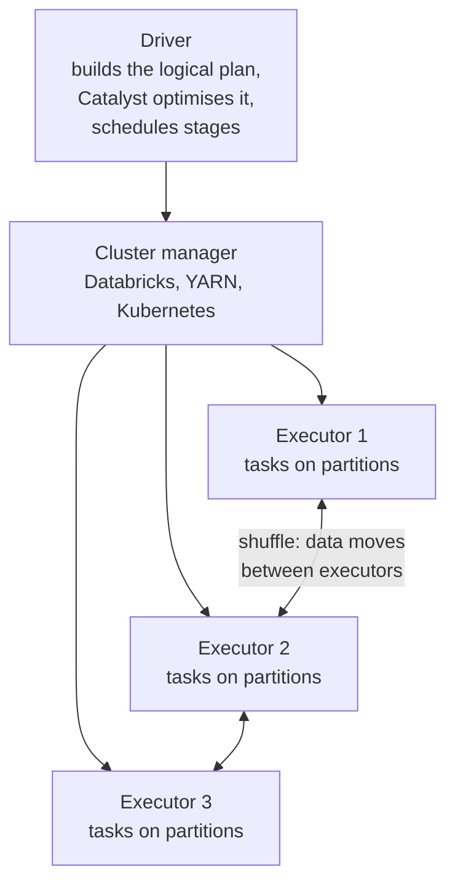
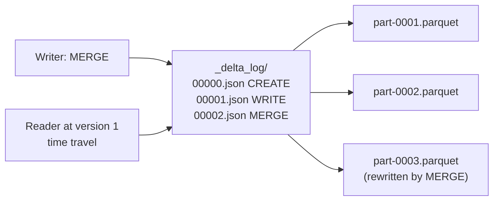
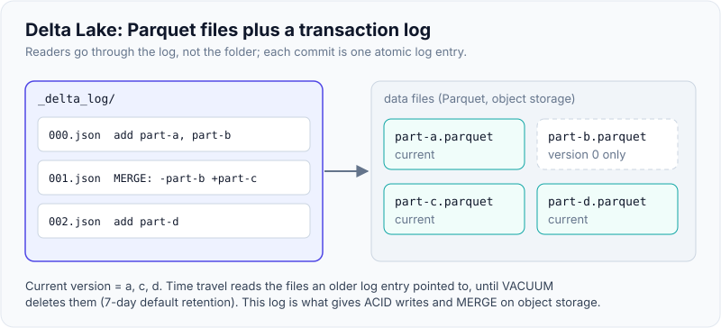

# Spark/PySpark & Lakehouse Basics (Databricks)

!!! abstract "Key takeaways"
    - Spark splits work across **executors** coordinated by a **driver**. Transformations are **lazy**; an **action** (`count`, `write`, `collect`) triggers a job. **Wide** transformations (`groupBy`, `join`, `distinct`) cause a **shuffle**, the main cost in most jobs.
    - Use **DataFrame/SQL built-in functions**, not Python UDFs and not `collect()` loops. Built-ins run in the JVM and are optimised by Catalyst; Python UDFs serialise every row to Python.
    - Joins: **broadcast** the small side (default auto-broadcast threshold 10 MB); otherwise sort-merge join. **AQE** (on by default since Spark 3.2) re-plans at runtime: switches to broadcast, coalesces partitions and splits skewed ones.
    - A **lakehouse** stores data as open files (Parquet) on object storage plus a **table format** (Delta Lake, Iceberg, Hudi) whose transaction log adds ACID writes, **MERGE**, schema enforcement and **time travel**.
    - Databricks stack: **Unity Catalog** (governance, `catalog.schema.table`), **Auto Loader** into bronze, **Lakeflow Declarative Pipelines** (formerly Delta Live Tables) and **Lakeflow Jobs** (formerly Workflows), **medallion** layers bronze → silver → gold. Spark 4.0 / DBR 17+ turn **ANSI mode** on by default: bad casts now fail instead of returning NULL.

## Why it matters

Customer data often outgrows a single Postgres box: years of claims, sensor readings, transaction logs. Databricks' FDE and solutions roles, and many Palantir deployments (Foundry transforms run on Spark), expect you to read and write PySpark comfortably, reason about why a job is slow, and design a bronze/silver/gold pipeline. Take-homes sometimes ship a notebook with a slow or wrong PySpark job to fix.

You don't need to be a Spark committer. You need the execution model, the handful of things that make jobs slow, and the lakehouse table operations that make pipelines idempotent ([page 4](04-data-quality-schema-drift-idempotent-loads-and-backfills.md)).

## Core concepts

### Execution model


*Notice the shuffle arrows. Everything inside one executor is cheap; anything that crosses them (joins, groupBy, distinct) writes to disk and the network.*

{ loading=lazy }
*Everything that crosses between executors is the expensive part.*

- **Lazy evaluation:** `filter`, `select`, `join`, `groupBy` build a plan. Nothing runs until an action.
- **Job → stages → tasks:** each action is a job; stages are split at shuffle boundaries; each stage runs one task per partition.
- **Narrow vs wide:** `filter`, `withColumn`, `select` are narrow (each output partition depends on one input partition). `groupBy`, `join`, `distinct`, `orderBy` are wide (shuffle).
- **Catalyst** optimises the logical plan (predicate pushdown, column pruning, join reordering); **Tungsten** generates efficient code. `df.explain()` shows the physical plan.
- **Partitions:** the unit of parallelism. `spark.sql.shuffle.partitions` defaults to 200; AQE coalesces small shuffle partitions at runtime.

### Joins and skew

| Strategy | When Spark uses it | Cost |
|---|---|---|
| Broadcast hash join | One side below `spark.sql.autoBroadcastJoinThreshold` (10 MB default), or `F.broadcast()` hint | Small side copied to every executor, no shuffle of the big side |
| Sort-merge join | Both sides large | Both sides shuffled and sorted by key |
| Shuffle hash join | Medium sides, when preferred | Shuffle, hash build on one side |

**Skew:** one key (a default customer ID, `NULL`, a giant provider) holds most rows, so one task runs for an hour while the others finish in seconds. AQE's skew-join handling splits oversized partitions when they exceed both a size factor and a byte threshold. Manual fixes: filter or handle the hot key separately, salt the key, or broadcast the other side.

### PySpark idioms

| Do | Avoid | Why |
|---|---|---|
| `F.lower(F.trim(col))`, `F.when`, `F.regexp_replace` | Python UDFs for simple logic | Built-ins stay in the JVM and are optimised |
| pandas UDFs (Arrow) when Python is unavoidable | Row-at-a-time Python UDFs | Vectorised batches, far less serialisation |
| `write` results to a table | `collect()` / `toPandas()` on big data | Driver memory is small; it becomes the bottleneck |
| `Window.partitionBy(...).orderBy(...)` + `row_number` for dedup | `dropDuplicates()` when you need "latest" | `dropDuplicates` keeps an arbitrary row |
| Explicit schemas when reading | `inferSchema=true` on large CSVs | Inference scans data and guesses types |
| `df.explain()` and the Spark UI | Guessing | Shows shuffles, broadcast decisions, skew |

### Spark 4.0 changes worth knowing

- **ANSI SQL mode on by default** (`spark.sql.ansi.enabled=true`): invalid casts, overflow and division by zero raise errors instead of returning NULL or wrapping. Use `try_cast` and friends where bad input is expected. Databricks Runtime 17.0+ matches this.
- **Spark Connect** (client-server API) is mature; notebooks and IDEs talk to remote clusters through it, which is how Databricks Connect works.

### The lakehouse

A data lake (cheap files on S3, ADLS or GCS) plus warehouse guarantees. The table format adds a **transaction log** next to the Parquet files:


*Notice that readers go through the log, not the folder. A commit is one atomic log entry, which is what gives ACID writes on object storage and lets you read any earlier version until old files are vacuumed.*

{ loading=lazy }
*The log, not the folder, decides what the table contains.*

| Feature | What it gives you |
|---|---|
| ACID commits | Concurrent readers never see half a write; failed jobs leave no partial data |
| Schema enforcement | Writes with mismatched columns fail unless evolution is enabled (`mergeSchema`) |
| `MERGE INTO` | Upserts and deletes for CDC and idempotent loads |
| Time travel | `VERSION AS OF n` / `TIMESTAMP AS OF ...` for audits, debugging and rollbacks |
| `VACUUM` | Deletes unreferenced files older than the retention period (7 days by default); time travel beyond that is gone |
| `OPTIMIZE` | Compacts small files; with `ZORDER BY` or **liquid clustering** (`CLUSTER BY`) it co-locates data for faster filters |

**Delta Lake vs Iceberg vs Hudi:** all three provide ACID tables on object storage. Delta is native on Databricks; Iceberg has broad engine support (Snowflake, Trino, Athena, Spark); Hudi came from Uber with a focus on upserts. Databricks Unity Catalog can expose Delta tables to Iceberg clients, and interoperability keeps improving, so the choice is usually made by the customer's platform.

### Databricks medallion stack

| Layer | Databricks tooling | Contents |
|---|---|---|
| Landing | Unity Catalog volumes, Lakeflow Connect (managed connectors) | Raw files, API extracts |
| Bronze | Auto Loader (`cloudFiles`) streaming or `availableNow` jobs | Raw records + ingestion metadata, append-only |
| Silver | Lakeflow Declarative Pipelines or notebooks/dbt, `MERGE` | Typed, deduplicated, conformed |
| Gold | Materialized views, dbt marts, metric views | Business aggregates for BI and apps |
| Governance | Unity Catalog | Permissions, lineage, audit across all layers |

## In practice: code & configuration

### Wrong vs right PySpark

=== "❌ Common mistake"
    ```python
    from pyspark.sql import functions as F
    from pyspark.sql.types import StringType

    normalise = F.udf(lambda e: e.strip().lower() if e else None, StringType())  # row-by-row Python
    members = members.withColumn("email", normalise("email"))

    emails = [r.email for r in members.collect()]           # every row to the driver
    latest = fills.dropDuplicates(["fill_id"])               # keeps an arbitrary version, not the latest
    joined = fills.join(drugs, "drug_code")                  # inner join silently drops unknown drugs
    ```

=== "✅ Correct approach"
    ```python
    from pyspark.sql import Window, functions as F

    members = members.withColumn("email", F.lower(F.trim("email")))     # built-in, optimised

    latest_first = Window.partitionBy("fill_id").orderBy(F.col("event_ts").desc())
    latest = (fills.withColumn("rn", F.row_number().over(latest_first))
                   .filter("rn = 1").drop("rn"))                        # deterministic "latest wins"

    joined = latest.join(F.broadcast(drugs), "drug_code", "left")       # small dim broadcast, keep unknowns
    ```
    Both versions return `asha@example.com` for `" Asha@Example.com "` on PySpark 4.0.1; the built-in version never leaves the JVM and nothing is pulled to the driver.

### Bronze → silver → gold with an idempotent Delta MERGE

```python
from delta import configure_spark_with_delta_pip
from delta.tables import DeltaTable
from pyspark.sql import SparkSession, Window, functions as F

builder = (SparkSession.builder.master("local[2]")
           .config("spark.sql.extensions", "io.delta.sql.DeltaSparkSessionExtension")
           .config("spark.sql.catalog.spark_catalog", "org.apache.spark.sql.delta.catalog.DeltaCatalog"))
spark = configure_spark_with_delta_pip(builder).getOrCreate()   # on Databricks, `spark` already exists
BASE = "/tmp/lake"

# ---------- bronze: raw events exactly as received (duplicates, late corrections) ----------
raw = spark.createDataFrame(
    [("F1", "M1", "D1", "2026-09-14", "12.00", "PAID",     "2026-09-14T10:00:00Z"),
     ("F1", "M1", "D1", "2026-09-14", "12.00", "PAID",     "2026-09-14T10:00:00Z"),   # exact duplicate
     ("F2", "M2", "D3", "2026-09-14", "5400",  "PAID",     "2026-09-14T11:00:00Z"),
     ("F2", "M2", "D3", "2026-09-14", "5400",  "REVERSED", "2026-09-15T08:00:00Z"),   # later correction
     ("F3", "M3", "D9", "2026-09-14", None,    "PENDING",  "2026-09-14T12:00:00Z")],
    "fill_id string, member_id string, drug_code string, filled_on string, amount string, status string, event_ts string")
(raw.withColumn("_ingested_at", F.current_timestamp())
    .write.format("delta").mode("overwrite").save(f"{BASE}/bronze_fills"))

# ---------- silver: typed, deduplicated, latest version per business key ----------
bronze = spark.read.format("delta").load(f"{BASE}/bronze_fills")
latest = Window.partitionBy("fill_id").orderBy(F.col("event_ts").desc())
silver = (bronze
    .withColumn("filled_on", F.to_date("filled_on"))
    .withColumn("amount", F.col("amount").cast("decimal(10,2)"))
    .withColumn("event_ts", F.to_timestamp("event_ts"))
    .withColumn("rn", F.row_number().over(latest))
    .filter("rn = 1").drop("rn", "_ingested_at"))          # one row per key BEFORE the merge

drugs = spark.createDataFrame([("D1", "Atorvastatin", False), ("D3", "Adalimumab", True)],
                              "drug_code string, drug_name string, is_specialty boolean")
silver = silver.join(F.broadcast(drugs), "drug_code", "left")

def upsert_silver(df):
    path = f"{BASE}/silver_fills"
    if not DeltaTable.isDeltaTable(spark, path):
        df.write.format("delta").save(path)
        return
    (DeltaTable.forPath(spark, path).alias("t")
        .merge(df.alias("s"), "t.fill_id = s.fill_id")
        .whenMatchedUpdateAll(condition="s.event_ts > t.event_ts")   # old data never overwrites new
        .whenNotMatchedInsertAll()
        .execute())

upsert_silver(silver)
upsert_silver(silver)       # rerun: same result, no duplicates

# ---------- gold: business aggregate ----------
s = spark.read.format("delta").load(f"{BASE}/silver_fills")
gold = (s.filter("status = 'PAID'")
         .groupBy("filled_on", "is_specialty")
         .agg(F.sum("amount").alias("paid_amount"), F.countDistinct("member_id").alias("members")))
gold.show()
print(spark.read.format("delta").option("versionAsOf", 0).load(f"{BASE}/silver_fills").count())
```

Run on PySpark 4.0.1 with delta-spark 4.0.0. Silver ends with 3 rows (F1 `PAID`, F2 `REVERSED`, F3 `PENDING` with NULL drug details from the left join); the table history shows `WRITE` then `MERGE`, and the second run changed nothing. Gold shows only F1's 12.00 as paid, because the reversal won.

!!! warning "MERGE needs one source row per key"
    If the source has two rows for the same `fill_id`, Delta refuses: `[DELTA_MULTIPLE_SOURCE_ROW_MATCHING_TARGET_ROW_IN_MERGE] Cannot perform Merge as multiple source rows matched...` (reproduced on Delta 4.0). Deduplicate the batch first, as the window above does. This is the most common CDC-into-Delta error.

### Delta SQL you should be able to write

```sql
CREATE TABLE silver_fills (fill_id STRING, member_id STRING, filled_on DATE,
                           amount DECIMAL(10,2), status STRING)
USING DELTA CLUSTER BY (member_id);                 -- liquid clustering instead of partitions + Z-order

MERGE INTO silver_fills t
USING updates s ON t.fill_id = s.fill_id
WHEN MATCHED THEN UPDATE SET *
WHEN NOT MATCHED THEN INSERT *;

DESCRIBE HISTORY silver_fills;                      -- version, operation, who, when
SELECT count(*) FROM silver_fills VERSION AS OF 1;  -- time travel for audits and debugging
RESTORE TABLE silver_fills TO VERSION AS OF 1;      -- roll back a bad load
OPTIMIZE silver_fills;                              -- compact small files (clusters by CLUSTER BY keys)
VACUUM silver_fills;                                -- remove unreferenced files past retention (7 days default)

SELECT try_cast('abc' AS INT);                      -- NULL; plain CAST raises CAST_INVALID_INPUT under ANSI
```

`CREATE ... CLUSTER BY`, `MERGE`, `DESCRIBE HISTORY`, `VERSION AS OF`, `OPTIMIZE` and the ANSI cast behaviour were run on open-source Spark 4.0.1 and Delta 4.0.0.

### Auto Loader into bronze (Databricks)

```python
# Databricks only: incremental file ingestion with schema tracking
(spark.readStream.format("cloudFiles")
    .option("cloudFiles.format", "csv")
    .option("cloudFiles.schemaLocation", "/Volumes/pharmacy/raw/_schemas/fills")   # tracks schema + drift
    .option("header", "true")
    .load("/Volumes/pharmacy/raw/landing/fills/")
    .withColumn("_source_file", F.col("_metadata.file_path"))                      # lineage per row
    .writeStream
    .option("checkpointLocation", "/Volumes/pharmacy/raw/_checkpoints/fills")      # exactly-once file tracking
    .trigger(availableNow=True)                    # process what's there, then stop: schedulable as a job
    .toTable("pharmacy.bronze.fills"))
```

Not run locally (Auto Loader is a Databricks feature). The checkpoint records which files were processed, so reruns don't reload them; unexpected columns go to a rescued-data column instead of failing the stream, which is the schema-drift behaviour from page 4.

## Real-world usage

- **Databricks** customers run medallion pipelines for claims, transactions and IoT; Unity Catalog provides one permission model and lineage across notebooks, SQL warehouses, jobs and ML.
- **Palantir Foundry** transforms (Python, SQL, Java) run on Spark over versioned datasets, so PySpark is a practical skill in Foundry deployments too.
- **Netflix, Apple and others** adopted Apache Iceberg for very large tables; **Uber** built Hudi for upsert-heavy ingestion. The open-table-format idea is now standard.
- **Common incidents:** a driver OOM from `toPandas()` on a large table; a job stuck at 199/200 tasks because of a skewed key; thousands of tiny files from a streaming job without compaction; Spark 3 jobs failing after an upgrade to Spark 4 because ANSI casts now error on bad data.

## Trade-offs & production gotchas

| Choice | Pros | Cons | Use when |
|---|---|---|---|
| Spark | Scales out, rich ecosystem, lakehouse native | Cluster overhead, tuning | Data beyond one machine, or the customer's platform is Databricks/Foundry |
| pandas / DuckDB / Polars | Fast on one machine, simple | Memory-bound | Up to tens of GB, prototypes, take-homes |
| Partitioning by date | Simple pruning, partition overwrite | Over-partitioning creates small files | Large tables filtered by date |
| Liquid clustering | Adapts to query patterns, no partition design | Newer, platform-dependent features | New Delta tables on Databricks |
| Structured Streaming | Low latency | Always-on cost, state | Minutes matter |
| `availableNow` batch | Streaming semantics, batch cost | Not real-time | Scheduled incremental ingestion |

!!! warning "Gotchas"
    - **`collect()` and `toPandas()`** pull everything to the driver. Aggregate first or write to a table.
    - **`dropDuplicates`** keeps an arbitrary row. Use a window with an explicit order for "latest wins".
    - **Small files** kill read performance. Compact with `OPTIMIZE`; avoid partitioning on high-cardinality columns.
    - **`VACUUM` with a short retention** breaks time travel and can break long-running readers.
    - **ANSI mode upgrades:** jobs that relied on bad casts becoming NULL fail on Spark 4. Use `try_cast` deliberately.
    - **Don't reach for Spark by habit.** A 2 GB take-home is faster in pandas or DuckDB; say why you chose the tool.

!!! question "Interview angle"
    "This job is slow, what do you check?" Answer in order: the Spark UI (which stage, task time distribution for skew, shuffle read/write sizes), the physical plan (`explain`: broadcast or sort-merge, filters pushed down?), file layout (small files, partition pruning), then code (Python UDFs, `collect`, unnecessary wide transformations).

## How this connects to my experience

- **Where it applies:** not a resume claim. Spark and Databricks aren't on my resume; Python is on my skills list. Closest experience: Deloitte ConvergeHealth, *"Developed event-driven healthcare analytics workflows and secure data discovery platforms"* on AWS (S3, Lambda, ECS/EKS), and distributed-systems thinking from Kafka at OptumRx.
- **Talking points:**
    - Kafka partitions and consumer groups map well onto Spark partitions and tasks: parallelism by key, and skew when one key is hot.
    - S3-based data platforms at Deloitte are the storage half of a lakehouse; Delta or Iceberg adds the table layer. *[confirm: whether ConvergeHealth stored analytics data in S3 and in what format (Parquet, CSV, JSON)]*
    - Position honestly: "I haven't run Spark in production. I know the execution model and the lakehouse operations, and I've built and run a bronze-silver-gold pipeline with Delta MERGE locally."
- **Likely follow-up chain:** "Have you used Spark?" (honest answer + what I've built) → "Explain a shuffle and how you'd avoid one" (wide transformations, broadcast joins, pre-aggregation) → "How do you make a Delta load idempotent?" (dedup batch, MERGE on key with event-time guard, or `replaceWhere` partition overwrite).

## Interview questions

### Fundamentals

??? question "Q1. What is lazy evaluation in Spark, and why does it matter?"
    **Answer:** Transformations build a logical plan without executing; only actions run jobs. It lets Catalyst optimise the whole plan (push filters down, prune columns, choose join strategies) before running, and avoids materialising intermediate results. The flip side: errors in transformations surface only at the action, and calling several actions recomputes the plan unless you cache.

    **Interviewer listens for:** plan optimisation, actions trigger work, recomputation.

    **Common wrong answer:** "Spark is lazy to save memory."

??? question "Q2. Narrow vs wide transformations?"
    **Answer:** Narrow transformations (filter, select, withColumn) compute each output partition from one input partition, so no data moves. Wide transformations (groupBy, join, distinct, orderBy) need data with the same key together, so they shuffle across executors and create a stage boundary. Shuffles dominate cost.

    **Interviewer listens for:** shuffle, stage boundaries.

    **Common wrong answer:** confusing them with number of columns.

??? question "Q3. What does Delta Lake add on top of Parquet files?"
    **Answer:** A transaction log that makes writes atomic and isolated (ACID), enforces the table schema, supports MERGE/UPDATE/DELETE, records history for time travel and rollback, and enables maintenance such as OPTIMIZE (compaction, clustering) and VACUUM.

    **Interviewer listens for:** transaction log, ACID, MERGE, time travel.

    **Common wrong answer:** "Compression."

### Intermediate

??? question "Q4. When does Spark use a broadcast join, and when should you force one?"
    **Answer:** When one side's estimated size is below `spark.sql.autoBroadcastJoinThreshold` (10 MB by default), or at runtime via AQE when actual sizes turn out small. Force it with `F.broadcast(df)` when you know a dimension is small but statistics are missing or wrong. Don't broadcast large tables: it can exhaust executor and driver memory.

    **Interviewer listens for:** threshold, AQE, hint, memory risk.

    **Common wrong answer:** "Always broadcast the right side."

??? question "Q5. Why avoid Python UDFs, and what are the alternatives?"
    **Answer:** Row-at-a-time Python UDFs serialise each row between the JVM and Python workers and are opaque to Catalyst. Prefer built-in functions; if Python is required, use pandas (Arrow) UDFs that process batches; for complex logic consider SQL expressions or Scala/Java UDFs.

    **Interviewer listens for:** serialisation cost, Catalyst, pandas UDFs.

    **Common wrong answer:** "UDFs are fine, Spark parallelises them."

??? question "Q6. What is the medallion architecture?"
    **Answer:** A layering pattern: bronze holds raw data as received plus ingestion metadata; silver holds cleaned, typed, deduplicated, conformed data; gold holds business-level aggregates and models for consumption. It separates concerns, enables replay from bronze, and gives clear quality expectations per layer. It is a pattern, not a product.

    **Interviewer listens for:** replay from raw, quality per layer.

    **Common wrong answer:** "A Databricks product."

### Senior

??? question "Q7. A job sits at 199 of 200 tasks for an hour. Diagnose and fix."
    **Answer:** Classic skew: one partition holds a hot key. Confirm in the Spark UI (task duration and shuffle read size distribution for that stage). Fixes: ensure AQE skew-join handling is on and thresholds fit; handle the hot key separately (often NULL or a default ID); salt the key on the large side and replicate the small side; or broadcast the smaller side to avoid the shuffle.

    **Interviewer listens for:** UI evidence, AQE skew join, salting, NULL keys.

    **Common wrong answer:** "Add more executors."

??? question "Q8. How do you load CDC events into a Delta table correctly?"
    **Answer:** For each micro-batch, deduplicate to one row per key (latest by LSN or event time), then `MERGE` with conditions: delete when the event is a delete, update when the source is newer than the target, insert when not matched. Guard against out-of-order events with the version column. Use `foreachBatch` in Structured Streaming, or Lakeflow Declarative Pipelines' `AUTO CDC` / `APPLY CHANGES` API which does this for you, including SCD type 2.

    **Interviewer listens for:** dedup per batch, ordering guard, deletes, managed option.

    **Common wrong answer:** "Append all events to the table."

### Scenario-based

??? question "Q9. After upgrading to Spark 4, a nightly job fails with `CAST_INVALID_INPUT`. What happened and what do you do?"
    **Answer:** Spark 4 enables ANSI mode by default, so casting malformed strings now raises instead of returning NULL. Short term, the job can set `spark.sql.ansi.enabled=false`, but better: find the bad values, use `try_cast` where bad input is expected, and quarantine rows that fail parsing so data problems are visible rather than silently NULL.

    **Interviewer listens for:** ANSI default, `try_cast`, quarantine instead of hiding.

    **Common wrong answer:** "Spark 4 is buggy, downgrade."

??? question "Q10. The customer has 3 GB of CSVs and asks for a Spark cluster. What do you recommend?"
    **Answer:** For 3 GB, pandas, Polars or DuckDB on one machine is faster to build and cheaper to run. Ask about growth, concurrency, and whether they already have Databricks. If the platform is Databricks, a small single-node cluster or serverless SQL is fine and keeps them on their standard; design tables in Delta so scaling later is a configuration change.

    **Interviewer listens for:** right-sizing, customer platform, future growth.

    **Common wrong answer:** "Yes, Spark scales."

## Cheat sheet

| Concept | Remember |
|---|---|
| Execution | Driver plans, executors run tasks per partition; actions trigger jobs |
| Cost | Shuffles (wide transformations), skew, small files, driver collects |
| Joins | Broadcast < 10 MB default; sort-merge otherwise; AQE re-plans |
| AQE | On by default since 3.2: coalesce partitions, switch joins, split skew |
| Spark 4 | ANSI on by default; `try_cast`; Spark Connect |
| Delta | Log + Parquet: ACID, MERGE, time travel, OPTIMIZE, VACUUM (7-day default) |
| MERGE rule | One source row per key; event-time guard |
| Databricks | Unity Catalog, Auto Loader, Lakeflow Declarative Pipelines + Jobs, medallion |

## Sources
1. [Apache Spark: SQL performance tuning](https://apache.googlesource.com/spark/+/master/docs/sql-performance-tuning.md): AQE, broadcast thresholds, skew join settings.
2. [Apache Spark: SQL migration guide](https://apache.googlesource.com/spark/+show/master/docs/sql-migration-guide.md): ANSI mode enabled by default since Spark 4.0.
3. [Databricks: ANSI compliance in Databricks Runtime](https://docs.databricks.com/sql/language-manual/sql-ref-ansi-compliance.html): ANSI default in DBR 17.0+, error behaviour.
4. [Databricks: Adaptive query execution](https://docs.databricks.com/optimizations/aqe.html): skew join properties and runtime re-planning.
5. [Delta Lake documentation](https://docs.delta.io/latest/index.html): MERGE, time travel, OPTIMIZE, VACUUM retention, liquid clustering.
6. [Databricks: Delta Lake deployment guide](https://docs.databricks.com/aws/en/lakehouse-architecture/deployment-guide/delta-lake): Unity Catalog volumes, Auto Loader, Lakeflow Connect and Declarative Pipelines.
7. [Databricks: Auto Loader](https://docs.databricks.com/aws/en/ingestion/cloud-object-storage/auto-loader/): `cloudFiles` options, schema location, rescued data, `availableNow`.
8. [Databricks: The AUTO CDC APIs](https://docs.databricks.com/aws/en/ldp/cdc): AUTO CDC replaces APPLY CHANGES; SCD type 1 and 2 from change feeds.
9. *Spark: The Definitive Guide* (Bill Chambers and Matei Zaharia) and *Learning Spark, 2nd ed.* (Damji et al.): execution model, narrow vs wide transformations, joins.
10. Local verification: PySpark 4.0.1 and delta-spark 4.0.0 defaults (`autoBroadcastJoinThreshold` 10485760b, `adaptive.enabled` true, `ansi.enabled` true, `shuffle.partitions` 200) and the MERGE duplicate-source error.
