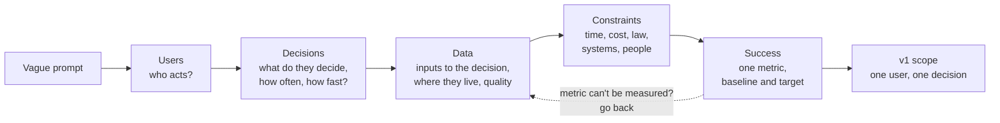
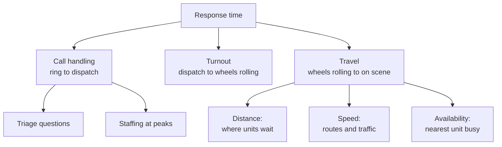

# Framework for Ambiguous Prompts: Users, Decisions, Data, Constraints, Success Metrics

!!! abstract "Key takeaways"
    - The decomposition round hands you a deliberately **under-specified** prompt ("a city wants faster 911 response", "help a hospital manage beds"). Finding the missing scope, data, constraints and definition of success **is the test**, not a hurdle before it.
    - Use one fixed opening, **U-D-D-C-S**: **Users** (who acts?), **Decisions** (what do they decide, how often?), **Data** (what do they decide with, and where does it live?), **Constraints** (time, money, law, systems, people), **Success** (one metric with a baseline and a target).
    - **Decisions are the hinge.** Software that does not change a decision changes nothing. Every object, screen and line of code should trace back to a decision someone makes.
    - Spend about **5–10 minutes** framing, say your assumptions out loud, then **commit to one user and one decision** for v1 and start building. Framing forever is the second most common failure after jumping straight to a solution.
    - Write the **success metric as code early** (a baseline calculation). It proves you understand the data, gives the demo a number and tells you when to stop.

## Why it matters

FDE loops at Palantir, OpenAI, Databricks and others include a round where you get a vague business goal and are asked to turn it into a working, extensible model or plan in about 45–60 minutes, often in a live pairing tool. Prep sites that interview candidates describe the same scoring across companies: **structured breakdown, end-user empathy, data reasoning, scoping judgement, and how you adapt when the interviewer changes a constraint**. The most common rejection reason they report is **jumping to a solution** before clarifying the problem. These details come from prep sites and candidate reports, not from the companies, so confirm the format with your recruiter (see [FDE role & interview loop](../fde-role-interview-loop/index.md)).

This mirrors the real job. A forward deployed engineer arrives at a customer where "the problem" is usually a symptom ("our planners spend all day in spreadsheets"). Teams that build before they frame produce dashboards nobody opens. Teams that frame well find the one decision that matters and make it faster, cheaper or safer.

The framework here differs from the [system design framework](../system-design/01-approach-and-framework-for-the-design-interview.md) in one way: system design assumes the product is known and asks how it scales. Decomposition assumes **the product is unknown** and asks what is worth building at all.

## Core concepts

### The five lenses: U-D-D-C-S


*Notice that the arrow runs from users to decisions to data, not from data to features. The dashed loop is normal: if the success metric needs data nobody has, you revisit the data lens instead of pretending.*

**1. Users: who acts on the output?**
Name 2–4 user types, then pick one primary user for v1. In a 911 prompt the candidates are call-takers, dispatchers, paramedics, district commanders and the city budget office. They make very different decisions. Ask: "I see dispatchers and commanders as the main users. Dispatchers make the minute-by-minute call. Shall I focus there?"

**2. Decisions: what do they decide, how often, under what time pressure?**
This is the most underused lens. A decision has a **frequency** (per call, per shift, per quarter), a **latency budget** (seconds vs days) and a **cost of being wrong**. The dispatcher decides "which unit goes to this call" in seconds, hundreds of times a day. The commander decides "where do units wait between calls" once per shift. The budget office decides "do we fund another station" once a year. Each one leads to a different product: a real-time recommender, a shift planner, or an analysis notebook.

**3. Data: what does the decision need, and does it exist?**
List the inputs and where they live: computer-aided dispatch (CAD) logs, unit GPS, road network, hospital capacity. For each, ask about **freshness**, **quality** and **access** ("Is GPS real time or every 30 seconds? Can we read CAD directly or only a nightly export?"). Data reasoning is a scored signal; this is where you show it. The [data modelling](../data-modelling/index.md) and [data integration](../fde-data-integration/index.md) topics go deeper.

**4. Constraints: what limits the solution?**
- **Time:** pilot in 6 weeks? The interview itself is a 45-minute constraint too.
- **Systems:** must it run inside the customer network, integrate with the existing CAD, work offline?
- **People:** who will maintain it, how much training can users absorb?
- **Law and risk:** PHI, audit trails, a human must make the final call.
- **Cost:** licences, cloud spend, people.

**5. Success: one metric, with a baseline and a target**
"Reduce 90th-percentile response time for priority-1 calls from 12 to 10 minutes within 6 months" beats "faster response". Pick one **north-star metric** plus one or two **guardrails** (do not increase the average for priority-2 calls, do not overload one crew). Percentiles matter: averages hide the long waits that cause harm, the same reason SRE practice defines latency SLOs on percentiles.

### Problem, symptom, solution: keep them apart

| Layer | 911 example | Trap |
|---|---|---|
| Stated request | "Build a dashboard of response times" | Building exactly that |
| Symptom | Long waits in the South district | Treating it as the cause |
| Root problem | Units are posted far from where calls cluster at night | Never asked "why?" |
| Decision to improve | Where to post idle units each shift | Optimising the wrong decision (routing) |
| Solution | Shift-level posting recommendation plus a metric to prove it | Picked before the above were known |

Use "why?" two or three times on the stated request. If the customer asked for a dashboard, ask what they would **do differently** after seeing it. That answer is the decision.

### Decompose MECE, then pick a thread

Once framed, split the problem into parts that are **mutually exclusive and collectively exhaustive** (MECE, a consulting habit from Barbara Minto's *Pyramid Principle*). For "reduce response time" the time itself decomposes cleanly:


*Notice that the branches add up to the whole and do not overlap, so you can ask "which branch has the most minutes?" and let data choose where to start, rather than starting where the tech is most fun.*

Then say: "If travel is 70% of the time, I'll focus on unit posting first. Call handling is a staffing question, so it's out of scope for the software."

### The 60-minute shape

| Minutes | Activity | Output on screen |
|---|---|---|
| 0–8 | U-D-D-C-S questions, state assumptions | 6–10 line problem frame |
| 8–15 | Object model for the chosen decision ([ontology thinking](02-from-vague-business-goal-to-data-and-object-model.md)) | Types and relationships |
| 15–40 | Walking skeleton, then the core logic ([live MVP](03-decomposing-into-a-working-extensible-mvp-in-a-live-pairing.md)) | Running code with output |
| 40–52 | Interviewer's twist: new constraint, new user, more scale | A small change, not a rewrite |
| 52–60 | Wrap-up: what's cut, risks, next steps | Spoken summary |

The [prioritisation page](04-prioritisation-trade-off-calls-and-cutting-scope-under-time.md) covers how to cut when this slips.

### The interviewer is a stakeholder, not an examiner

Treat the interviewer as the customer. Ask short, specific questions and **offer a default with each one** so a non-answer doesn't stall you: "How fresh is GPS? I'll assume every 30 seconds unless you say otherwise." Sources on these rounds agree that long silence reads as being stuck, and waiting for guidance is a known failure mode. Checkpoint every 10 minutes: "Here's where I am. Does this match what you care about?"

## In practice: code & configuration

The first code you write is often not the product. It is the **success metric**, computed from the data you were told exists. That forces you to name the fields, find edge cases (cancelled calls, missing timestamps) and produce a baseline the rest of the session improves on.

=== "❌ Common mistake"
    ```python
    # Minute 2: jumps to an algorithm before knowing the user, decision or metric.
    import networkx as nx

    def shortest_route(graph, ambulance, incident):
        return nx.shortest_path(graph, ambulance, incident, weight="minutes")

    # 25 minutes later: a routing engine nobody asked for. Travel speed was not
    # the problem; units were posted in the wrong places. No baseline, no metric,
    # nothing to show the "commander" user.
    ```

=== "✅ Correct approach"
    ```python
    """Measure the success metric before building anything: p90 911 response time by district."""
    from dataclasses import dataclass
    from datetime import datetime
    from statistics import quantiles
    from collections import defaultdict

    @dataclass(frozen=True)
    class Incident:
        incident_id: str
        district: str
        priority: int            # 1 = life-threatening
        call_received: datetime
        unit_on_scene: datetime | None   # None = cancelled or still open

        @property
        def response_minutes(self) -> float | None:
            if self.unit_on_scene is None:
                return None
            return (self.unit_on_scene - self.call_received).total_seconds() / 60

    def p90(values: list[float]) -> float:
        # quantiles(n=10) returns 9 cut points; the last one is the 90th percentile
        return quantiles(values, n=10, method="inclusive")[-1] if len(values) > 1 else values[0]

    def baseline(incidents: list[Incident], priority: int = 1) -> dict[str, float]:
        by_district: dict[str, list[float]] = defaultdict(list)
        for i in incidents:
            if i.priority == priority and i.response_minutes is not None:
                by_district[i.district].append(i.response_minutes)
        return {d: round(p90(v), 1) for d, v in sorted(by_district.items())}

    if __name__ == "__main__":
        t = lambda hh, mm: datetime(2026, 10, 1, hh, mm)
        log = [
            Incident("A1", "North", 1, t(9, 0), t(9, 7)),
            Incident("A2", "North", 1, t(9, 30), t(9, 41)),
            Incident("A3", "North", 1, t(10, 0), t(10, 6)),
            Incident("B1", "South", 1, t(9, 5), t(9, 19)),
            Incident("B2", "South", 1, t(11, 0), t(11, 22)),
            Incident("B3", "South", 2, t(12, 0), t(12, 40)),   # priority 2: excluded
            Incident("B4", "South", 1, t(13, 0), None),        # cancelled: excluded
        ]
        print(baseline(log))   # {'North': 10.2, 'South': 21.2}
    ```

Note what the correct version does in a few minutes: it names a user (the commander comparing districts), a metric (p90, priority 1), two data-quality rules said out loud, and a result that already points at the South district. Everything later is measured against this number.

Keep the frame itself visible as a comment block or a short doc in the pairing tool:

```text
PROBLEM FRAME (v1)
Users:       dispatch shift commander (primary); dispatcher (later)
Decision:    where idle ambulances wait, set once per 8h shift
Data:        CAD incident log (nightly export), station list, unit GPS (30s, later)
Constraints: pilot in 6 weeks; human approves every posting; no PHI leaves the network
Success:     p90 priority-1 response 12 -> 10 min; guardrail: priority-2 p90 not worse
Assumptions: CAD timestamps are reliable; ~200 calls/day; 3 districts
Out of scope: call-handling time, live routing, hospital diversion
```

## Real-world usage

- **Palantir's split of roles** shows the framework in action: deployment strategists focus on finding the problem with the customer, and forward deployed engineers build it. In an FDE interview you are expected to do both, which is why the framing lens is scored.
- **Product discovery practice** uses the same moves: Teresa Torres' opportunity solution trees separate the outcome (metric), opportunities (user needs) and solutions. "Jobs to be done" asks what job the user hires the product for, which is the decision lens in different words.
- **Healthcare example:** "reduce ER wait times" can mean triage staffing, bed availability upstream or discharge delays downstream. Hospitals often find the bottleneck is discharge, not the ER itself. Without the decision lens you build an ER dashboard and move nothing. See the [bed-flow model](02-from-vague-business-goal-to-data-and-object-model.md).
- **Banking example:** "reduce fraud losses" decomposes into which decision (block a card in milliseconds, queue a case for an analyst, or change a rule weekly). The latency budget alone decides between a stream processor and a batch notebook.

## Trade-offs & production gotchas

| Option | Pros | Cons | Use when |
|---|---|---|---|
| Frame fully before any code (10–15 min) | Fewer wrong turns | Little time to build; looks slow | Pure "plan" rounds with no coding |
| Frame lightly (5–8 min), build, re-frame at checkpoints | Shows judgement and output | Needs discipline to come back to the frame | Most live pairing rounds |
| Ask many questions without defaults | Thorough | Stalls if interviewer says "you decide" | Never; always offer a default |
| Pick the most complex user (e.g. real-time dispatcher) | Impressive | Hardest to finish in 45 min | Only if the interviewer steers you there |
| Pick the decision with best data and clearest metric | Finishable, measurable | May feel modest | Default for v1 |

!!! warning "Gotchas"
    - **"You decide" is an answer.** When the interviewer won't give a number, state an assumption, write it in the frame and move on.
    - **Averages lie.** A 911 average of 8 minutes can hide a 25-minute tail. Use percentiles and segment by priority and district.
    - **A metric you can't compute is not a metric.** If the data needed doesn't exist, the first deliverable may be instrumenting it.
    - **Watch for the hidden constraint.** Customer-simulation style prompts often hide one (a union rule on shift changes, a law that a human must approve). Ask "Is there anything that would stop this being used even if it worked?"
    - **Don't frame for 20 minutes.** The round wants a working model. Frame, commit, build, revisit.

!!! tip "One sentence to open with"
    "Before I design anything, I'd like to understand who will use this, what decision it should help them make, what data we have and how we'll know it worked. Then I'll pick a thin slice and build it."

## How this connects to my experience

- **Where it applies:** not a resume claim as an interview technique, but the same moves sit behind "Collaborated with senior architects to design scalable service architecture, API strategies, and data integration patterns" and "Led sprint planning, estimation, stakeholder communication" on OptumRx Meteor (healthcare, 750K+ users).
- **Talking points:**
    - The GraphQL Consumer Service sits between 5 upstream systems and multiple consumers. Framing "which consumer needs which data, how fresh" is the data lens applied to integration.
    - Healthcare constraints (PHI, auth through PingFederate and Active Directory) are the constraint lens; in an interview, naming them early signals domain experience.
    - A concrete example of turning a vague stakeholder request into a scoped feature with a metric. *[confirm: pick one real story, e.g. a request from the pharmacy business that you reframed]*
- **Likely follow-up chain:** "How did you decide what to build first?" → "How did you know it worked?" → "What would you do with no data?" Answer with the frame: user, decision, metric; then admit honestly if no metric was measured at the time and say what you'd measure now.

## Interview questions

### Fundamentals

??? question "Q1. You get the prompt 'A city wants to reduce 911 response times.' What do you do in the first five minutes?"
    **Answer:** Restate the goal, then work through U-D-D-C-S out loud. Who are the users (call-takers, dispatchers, commanders)? What decisions do they make and how often? What data exists (CAD logs, GPS, stations)? What constraints apply (pilot timeline, human approval, privacy)? How do we measure success (p90 response time for priority-1 calls, baseline and target)? Offer defaults for every question, write the frame down, then pick one user and decision for v1.

    **Interviewer listens for:** questions before solutions, a chosen focus, and a measurable metric.

    **Common wrong answer:** "We'll build a routing engine with real-time traffic," in minute one.

??? question "Q2. Why focus on decisions rather than features?"
    **Answer:** Value comes from changing what someone does. A feature that doesn't change a decision (a chart nobody acts on) has no impact. Decisions also give natural requirements: frequency sets the processing model (stream vs batch), latency budget sets architecture, and cost of error sets how much explanation, validation and human review you need.

    **Interviewer listens for:** linking decisions to technical choices.

    **Common wrong answer:** "Features are what users ask for, so we build those."

??? question "Q3. What makes a good success metric for a decomposition prompt?"
    **Answer:** One north-star metric that the chosen decision can move, with a baseline, a target and a time frame, plus one or two guardrails so you don't win by causing harm elsewhere. Prefer percentiles or rates segmented by the dimension that matters (priority, district). It must be computable from data that exists or can be instrumented.

    **Interviewer listens for:** baseline, guardrails, measurability.

    **Common wrong answer:** "User satisfaction" or "faster", with no number and no data source.

??? question "Q4. The interviewer answers your clarifying question with 'What do you think?' How do you respond?"
    **Answer:** Treat it as permission to decide. State a reasonable assumption with a one-line reason ("I'll assume 200 calls a day, a mid-sized city, so a single process is plenty"), write it into the visible assumptions list, and say when you would revisit it. Then move on.

    **Interviewer listens for:** comfort with ambiguity and pace.

    **Common wrong answer:** asking the same question again, or freezing.

### Intermediate

??? question "Q5. How do you tell a symptom from the real problem?"
    **Answer:** Ask "why?" a few times and ask what the user would do differently with the requested thing. Decompose the outcome MECE (for response time: call handling, turnout, travel) and ask which component holds most of the loss. The real problem is the decision that drives the biggest component. Confirm with the interviewer before committing.

    **Interviewer listens for:** decomposition of the metric and data-led focus.

    **Common wrong answer:** building what was literally asked for.

??? question "Q6. What is MECE and why does it help here?"
    **Answer:** Mutually exclusive, collectively exhaustive: the parts don't overlap and together cover the whole. It stops you double-counting or missing a branch, and it lets you compare branches (which one has the most minutes or money) so you can justify where to start.

    **Interviewer listens for:** using the split to prioritise, not as a buzzword.

    **Common wrong answer:** listing ideas that overlap ("faster ambulances", "better routing", "less traffic").

??? question "Q7. How much time should framing take in a 60-minute live pairing round?"
    **Answer:** About 5–10 minutes before the first code, with short revisits at checkpoints. The round scores a working, extensible model, so framing that runs to 20 minutes leaves nothing to show. If the round is explicitly a planning or whiteboard decomposition, framing can take longer.

    **Interviewer listens for:** awareness of the clock.

    **Common wrong answer:** "As long as it takes to get every requirement."

??? question "Q8. Which constraints do candidates usually forget?"
    **Answer:** People and process constraints (who maintains it, training, union or shift rules), legal ones (PHI, audit, human in the loop), integration ones (read-only access to the system of record, nightly exports instead of APIs) and deployment ones (customer network, no internet). These often kill a technically good solution.

    **Interviewer listens for:** deployment realism, a core FDE signal.

    **Common wrong answer:** only listing scale and latency.

### Senior

??? question "Q9. Two stakeholders want different success metrics. How do you handle it in the round?"
    **Answer:** Name the conflict, pick one north-star for v1 based on the primary user and the decision you are supporting, and keep the other as a guardrail or a later phase. Show how the model could report both. Say you'd confirm the choice with the sponsor.

    **Interviewer listens for:** decisiveness plus a way to keep the other party on board.

    **Common wrong answer:** trying to optimise both at once with no trade-off.

??? question "Q10. How do you show data reasoning when you have no real data?"
    **Answer:** Describe the records you expect (fields, grain, volume, freshness), name quality risks (missing timestamps, duplicate events, clock skew), generate a tiny realistic sample in code, and compute the baseline metric on it. Say what you'd check first on real data.

    **Interviewer listens for:** grain, quality and volume thinking.

    **Common wrong answer:** "We'll get the data from the customer," and nothing else.

??? question "Q11. How is this framework different from a system design framework?"
    **Answer:** System design assumes the product is known and focuses on scale, availability and trade-offs between components. Decomposition assumes the product is unknown: the main risk is building the wrong thing. So it starts with users, decisions and success, and scale only matters once the decision is chosen.

    **Interviewer listens for:** knowing which risk each round targets.

    **Common wrong answer:** running the system design checklist (QPS, sharding) on a vague business prompt.

### Scenario-based

??? question "Q12. Twenty minutes in, the interviewer says 'Actually, the mayor cares most about cost.' What now?"
    **Answer:** Re-run the success lens: the metric becomes cost per incident or staffed hours, with response time as a guardrail. Check which decisions move cost (fleet size, shift patterns) and whether the current model can answer it. Usually the same objects (units, incidents, shifts) support it, so it's a new calculation, not a rewrite. Say that out loud.

    **Interviewer listens for:** calm re-framing and reuse of the model.

    **Common wrong answer:** starting over, or ignoring the change.

??? question "Q13. The prompt is 'Use AI to help our warehouse.' Frame it."
    **Answer:** Users: pickers, shift leads, buyers. Decisions: what to reorder and when (daily, buyer), which orders to pick first (minutes, lead), where to slot stock (monthly). Data: stock levels, orders, supplier lead times. Constraints: ERP is the system of record, pilot in one site. Success: stockouts per week down with inventory value as a guardrail. Then point out that AI is a means, not the goal: a simple days-of-cover rule may be v1, with an ML forecast behind the same interface later.

    **Interviewer listens for:** decision-first framing and not forcing AI in.

    **Common wrong answer:** "We'll fine-tune an LLM on the warehouse data."

??? question "Q14. You realise halfway through that your chosen decision has no usable data. What do you do?"
    **Answer:** Say so, explain the impact, and offer two options: switch to a neighbouring decision with better data, or make v1 about instrumenting the data plus a simple heuristic so the metric can be measured. Pick one with the interviewer and continue.

    **Interviewer listens for:** honest self-correction.

    **Common wrong answer:** carrying on and hoping it isn't noticed.

## Cheat sheet

| Lens | Ask | Output |
|---|---|---|
| Users | Who acts on the output? | 2–4 user types, one primary |
| Decisions | What do they decide, how often, how fast, cost of error? | One decision for v1 |
| Data | Inputs, location, freshness, quality, access? | Field list and grain |
| Constraints | Time, systems, people, law, cost? | 3–5 bullets, including hidden ones |
| Success | Metric, baseline, target, guardrail? | One computable number |
| Habit | Offer a default with every question | Assumption list on screen |
| First code | Compute the baseline metric | A number to beat |
| Avoid | Solution in minute one; framing for 20 minutes | Checkpoint every ~10 minutes |

## Sources
1. [Exponent: How to answer decomposition interview questions (2026)](https://www.tryexponent.com/blog/how-to-answer-decomposition-interview-questions-the-definitive-guide-2026): clarify first, MECE subproblems, skeleton before depth, jumping to solutions as the top rejection reason (prep site).
2. [Exponent: Palantir Forward Deployed Engineer interview guide](https://www.tryexponent.com/guides/palantir-forward-deployed-engineer-interview): decomposition as a vague prompt to a working, extensible model; scoring signals (prep site, candidate reports).
3. [Exponent: How to answer decomposition questions (FDE course)](https://www.tryexponent.com/courses/forward-deployed-engineering/decomposition/how-to-answer-decomposition-questions): stakeholders, resources and timeline first; 911 response-time example prompt.
4. [Exponent: Databricks FDE interview guide](https://www.tryexponent.com/guides/databricks-forward-deployed-engineer-interview): decomposition as the centrepiece round; clarify stakeholders, scope and KPIs first (candidate reports).
5. [techinterview.org: Inside the Palantir engineering interview loop](https://www.techinterview.org/post/3233476805/palantir-interview-process/): format and mid-round constraint changes (candidate reports).
6. Barbara Minto, *The Pyramid Principle*: MECE grouping.
7. Teresa Torres, *Continuous Discovery Habits*: outcomes vs opportunities vs solutions (opportunity solution trees).
8. [Google SRE Book: Service Level Objectives](https://sre.google/sre-book/service-level-objectives/): why percentiles beat averages for latency-type metrics.
9. [Palantir blog: A day in the life of a Palantir Deployment Strategist](https://blog.palantir.com/a-day-in-the-life-of-a-palantir-deployment-strategist-951cb59a5a96): problem-finding vs building roles.
