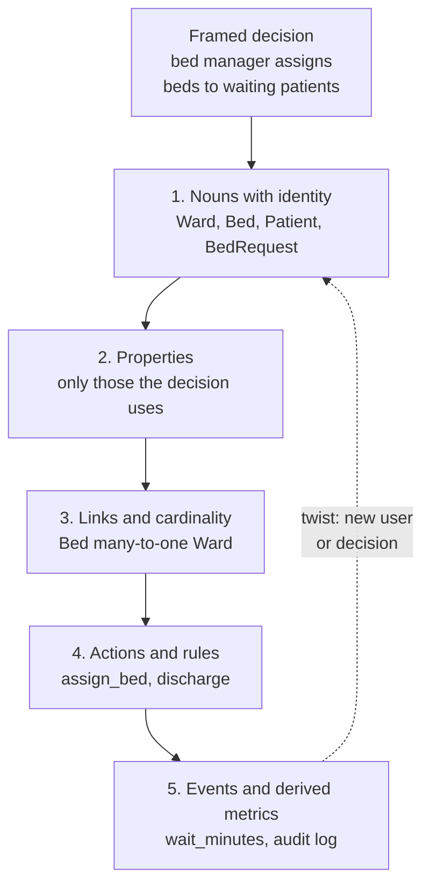
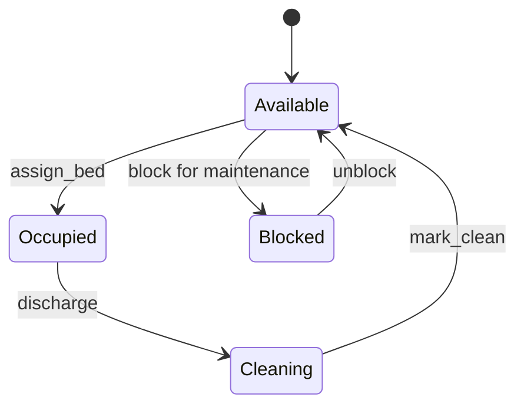
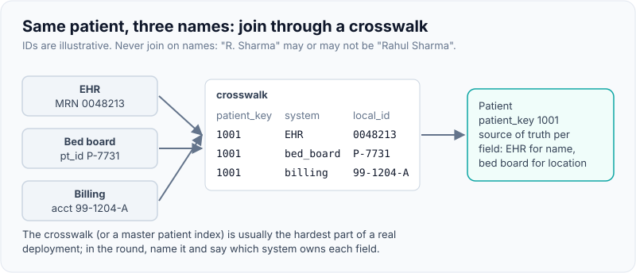
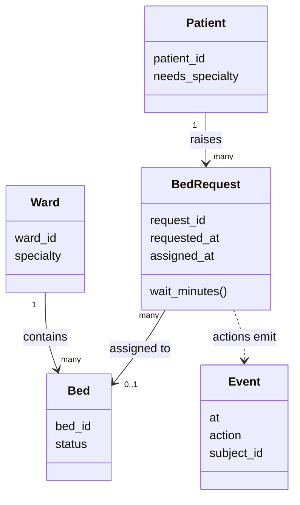

# From Vague Business Goal to Data & Object Model (Ontology Thinking)

!!! abstract "Key takeaways"
    - **Ontology thinking** means modelling the customer's world as they talk about it: **object types** (nouns with identity), **properties**, **links** (relationships with cardinality) and **actions** (verbs that change state under rules). Palantir Foundry's Ontology uses exactly these building blocks.
    - Derive the model from the **decision** you framed, not from the database you imagine. Ask "what does the user look at, and what do they change?" Those are your objects and actions.
    - Separate **state** (a bed is occupied) from **events** (a bed was assigned at 09:15 by nurse X). Events give you the audit trail, the metrics and the ability to replay; state gives you fast answers.
    - Keep **derived values derived** (wait time = assigned_at − requested_at). Stored copies drift.
    - Evolve in steps on screen: dictionaries → typed objects → links and actions with validation. Each step should keep the program running. The interviewer scores the **extensibility** of the final model as much as its correctness.

## Why it matters

After framing ([U-D-D-C-S](01-framework-for-ambiguous-prompts-users-decisions-data-constra.md)), the decomposition round expects a model: something you can code against and extend when the interviewer adds a twist. A weak model (strings and dictionaries, names as identity, no place for rules) collapses at the first twist. A good model makes the twist a small, local change.

This is also how FDE work starts at a customer. Data is spread over many systems of record (an EHR, a bed board, a staffing tool, spreadsheets) with different names for the same thing. The value Palantir sells with its Ontology is a shared layer that maps those datasets to the business's own concepts, so applications and people can act on "patients", "beds" and "transfers" instead of tables. Even if you never touch Foundry, interviewers at FDE-style companies listen for that way of thinking: **data reasoning plus the user's vocabulary**.

## Core concepts

### The building blocks

Palantir's documentation describes the Foundry Ontology as mapping datasets and models to **object types, properties, link types and action types**. An object type defines an entity or event; a link type defines a relationship between two object types; an action type defines how objects can be changed. It also offers a helpful analogy: an object type is like a dataset and an object is like one row.

| Building block | Question it answers | Bed-flow example | Code form |
|---|---|---|---|
| Object type | What things exist, with identity? | Ward, Bed, Patient, BedRequest | `@dataclass` / `record` with an ID |
| Property | What do we know about each thing? | `Bed.status`, `Ward.specialty` | Typed field; enum for closed sets |
| Derived property | What can be computed from others? | `BedRequest.wait_minutes` | `@property` / method, not stored |
| Link | How are things related, and how many? | Bed → Ward (many-to-one); BedRequest → Bed (0..1) | ID reference plus traversal helper |
| Action | What can users change, under which rules? | `assign_bed`, `discharge` | Method that validates, mutates, logs |
| Event | What happened, when, by whom? | `assign_bed at 09:15` | Append-only record |

You can use the same vocabulary in [domain-driven design](../ddd-clean-architecture/index.md) terms: entities (identity), value objects (no identity, compared by value), aggregates (consistency boundaries) and domain events. The [LLD approach page](../lld-design-patterns/06-lld-approach-requirements-entities-relationships-apis.md) covers entity extraction for classic low-level design rounds.

### From prompt to model in five moves


*Notice the loop back. A twist usually adds one object type or one action; it should rarely change the ones you have. If it does, the earlier model was mixing concepts.*

**1. Nouns with identity.** Listen to the prompt and the interviewer's words. Underline nouns. Keep the ones that have a lifecycle and need to be told apart (two patients named Asha are different people, so names are not IDs). Drop nouns that are just values ("cardiology" is a value of `specialty` until someone needs to manage specialties).

**2. Properties, but only the ones the decision uses.** A bed manager deciding which bed to give needs bed status, ward specialty and maybe isolation capability. They do not need the bed's manufacturer. Resist modelling the whole hospital.

**3. Links with cardinality.** Say the cardinality out loud: "a bed belongs to exactly one ward; a ward has many beds; a request gets at most one bed." Cardinality decides the code shape (a foreign-key style ID vs a list vs a join object). In Foundry, many-to-many links need their own backing data, which is the same idea as a join table in [relational modelling](../postgresql-sql/05-normalisation-vs-denormalisation.md).

**4. Actions with rules.** Verbs that change state become actions: `assign_bed`, `discharge`, `mark_clean`. Each action is the single place for its **validation rules** (bed must be available, specialty must match) and **side effects** (log an event, notify). That is what makes the model safe to extend: new rules go in one spot.

**5. Events and derived metrics.** Record each action as an event. The success metric from your framing (median wait for a bed) is computed from events and object timestamps, never typed in.

### State vs events: the key modelling choice


*Notice that "Cleaning" exists because the real world has it: a discharged bed is not free. Missing states like this are a classic sign of a model built from a database schema rather than from users' language. Each arrow is an action that should emit an event.*

{ loading=lazy }
*State answers 'is it free now?'; the growing log answers everything else.*

| Approach | Strength | Weakness | Use when |
|---|---|---|---|
| State only (current status fields) | Simple, fast reads | No history, metrics impossible, no audit | Throwaway prototypes |
| State plus event log | Fast reads and full history | Two things to keep consistent | Default for operational tools |
| Event sourcing (state rebuilt from events) | Perfect audit, replay, time travel | More complex, harder queries | Regulated domains, needs replay ([CQRS & event sourcing](../microservices/index.md)) |

In a 45-minute round, **state plus an append-only event list** is the sweet spot. Say that event sourcing is the next step if audit or replay becomes a requirement.

### Grain, identity and the "same thing, different names" problem

- **Grain:** one row per what? A `BedRequest` is one per admission request, not one per patient. Getting grain wrong breaks metrics (counting patients when you meant requests).
- **Identity across systems:** the EHR calls it MRN, the bed board calls it `pt_id`. Say how you'd map them (a crosswalk table, a master patient index) and that this is usually the hardest part of real deployments; see [data integration](../fde-data-integration/index.md).
- **Time:** store timestamps with time zones; decide whether "requested_at" is when the doctor ordered or when the request reached the bed desk. Definitions matter for metrics.

{ loading=lazy }
*Join through IDs in the crosswalk, never through names.*

## In practice: code & configuration

The prompt: *"A hospital network wants patients to wait less for a bed."* After framing, the user is the **bed manager**, the decision is **which bed to give the next waiting patient**, and the metric is **median wait from request to assignment**.

=== "❌ Common mistake"
    ```python
    # v0: everything is a dict keyed by strings. Works for 10 minutes, then hurts.
    beds = {"B1": {"ward": "cardiology", "free": True, "patient": None}}
    waiting = [{"name": "Asha", "needs": "cardiology", "since": "08:00"}]

    def assign(bed_id):
        p = waiting.pop(0)                 # who decided FIFO? where is the rule written?
        beds[bed_id]["free"] = False
        beds[bed_id]["patient"] = p["name"]   # name as identity: two patients called Asha?
        # wait time lost: "since" is gone with the popped dict; no record of who assigned
    assign("B1")
    print(beds)
    ```
    Problems: names as identity, a boolean where there are really three states, no rule checks (specialty is ignored), the metric's input is destroyed, and nothing is logged. Starting with dicts is fine for the first five minutes; staying there is the mistake.

=== "✅ Correct approach (Python)"
    ```python
    """v2 of the bed-flow model: object types, links, actions and an event log."""
    from __future__ import annotations
    from dataclasses import dataclass, field
    from datetime import datetime
    from enum import Enum

    # ---- Object types (nouns with identity) ----
    class BedStatus(Enum):
        AVAILABLE = "available"
        OCCUPIED = "occupied"
        CLEANING = "cleaning"

    @dataclass
    class Ward:
        ward_id: str
        specialty: str                      # e.g. "cardiology"

    @dataclass
    class Bed:
        bed_id: str
        ward_id: str                        # link: Bed -> Ward (many-to-one)
        status: BedStatus = BedStatus.AVAILABLE

    @dataclass
    class Patient:
        patient_id: str
        needs_specialty: str

    @dataclass
    class BedRequest:                       # an event-like object: it has a lifecycle
        request_id: str
        patient_id: str                     # link: BedRequest -> Patient
        requested_at: datetime
        assigned_bed_id: str | None = None  # link: BedRequest -> Bed (0..1)
        assigned_at: datetime | None = None

        @property
        def wait_minutes(self) -> float | None:       # derived property, never stored
            if self.assigned_at is None:
                return None
            return (self.assigned_at - self.requested_at).total_seconds() / 60

    # ---- Actions (verbs that change state, with rules and an audit trail) ----
    @dataclass(frozen=True)
    class Event:
        at: datetime
        action: str
        subject_id: str
        detail: str

    class ActionRejected(Exception):
        pass

    @dataclass
    class BedFlow:
        wards: dict[str, Ward] = field(default_factory=dict)
        beds: dict[str, Bed] = field(default_factory=dict)
        patients: dict[str, Patient] = field(default_factory=dict)
        requests: dict[str, BedRequest] = field(default_factory=dict)
        events: list[Event] = field(default_factory=list)

        # link traversal helpers: the questions users actually ask
        def beds_in(self, ward_id: str) -> list[Bed]:
            return [b for b in self.beds.values() if b.ward_id == ward_id]

        def open_requests(self) -> list[BedRequest]:
            return sorted((r for r in self.requests.values() if r.assigned_bed_id is None),
                          key=lambda r: r.requested_at)

        def assign_bed(self, request_id: str, bed_id: str, at: datetime) -> None:
            req, bed = self.requests[request_id], self.beds[bed_id]
            patient = self.patients[req.patient_id]
            ward = self.wards[bed.ward_id]
            # validation rules live on the action, not scattered through the UI
            if bed.status is not BedStatus.AVAILABLE:
                raise ActionRejected(f"{bed_id} is {bed.status.value}")
            if ward.specialty != patient.needs_specialty:
                raise ActionRejected(f"{bed_id} is {ward.specialty}, patient needs {patient.needs_specialty}")
            bed.status = BedStatus.OCCUPIED
            req.assigned_bed_id, req.assigned_at = bed_id, at
            self.events.append(Event(at, "assign_bed", request_id, bed_id))

        def discharge(self, bed_id: str, at: datetime) -> None:
            bed = self.beds[bed_id]
            if bed.status is not BedStatus.OCCUPIED:
                raise ActionRejected(f"{bed_id} is not occupied")
            bed.status = BedStatus.CLEANING   # real-world state: a bed is not free the moment a patient leaves
            self.events.append(Event(at, "discharge", bed_id, "to cleaning"))

    if __name__ == "__main__":
        t = lambda hh, mm: datetime(2026, 10, 1, hh, mm)
        flow = BedFlow()
        flow.wards["W1"] = Ward("W1", "cardiology")
        flow.beds["B1"] = Bed("B1", "W1")
        flow.beds["B2"] = Bed("B2", "W1", BedStatus.CLEANING)
        flow.patients["P1"] = Patient("P1", "cardiology")
        flow.requests["R1"] = BedRequest("R1", "P1", t(8, 0))

        try:
            flow.assign_bed("R1", "B2", t(8, 20))
        except ActionRejected as e:
            print("rejected:", e)                     # rejected: B2 is cleaning
        flow.assign_bed("R1", "B1", t(9, 15))
        print(flow.requests["R1"].wait_minutes)       # 75.0
        print([e.action for e in flow.events])        # ['assign_bed']
        print(len(flow.open_requests()))              # 0
    ```

=== "✅ Same model in Java 21"
    ```java
    import java.time.Duration;
    import java.time.Instant;
    import java.util.*;

    public class BedFlow {
        enum BedStatus { AVAILABLE, OCCUPIED, CLEANING }

        record Ward(String id, String specialty) {}
        record Patient(String id, String needsSpecialty) {}

        static final class Bed {                       // mutable status, stable identity
            final String id; final String wardId; BedStatus status;
            Bed(String id, String wardId, BedStatus status) { this.id = id; this.wardId = wardId; this.status = status; }
        }

        // Actions are data: easy to log, replay, authorise and extend
        sealed interface Action permits AssignBed, Discharge {}
        record AssignBed(String patientId, String bedId, Instant at) implements Action {}
        record Discharge(String bedId, Instant at) implements Action {}

        record Event(Instant at, Action action) {}

        final Map<String, Ward> wards = new HashMap<>();
        final Map<String, Bed> beds = new HashMap<>();
        final Map<String, Patient> patients = new HashMap<>();
        final List<Event> events = new ArrayList<>();

        void apply(Action action) {
            switch (action) {                          // exhaustive: the compiler flags a new Action type
                case AssignBed a -> {
                    Bed bed = beds.get(a.bedId());
                    Patient p = patients.get(a.patientId());
                    if (bed.status != BedStatus.AVAILABLE)
                        throw new IllegalStateException(bed.id + " is " + bed.status);
                    if (!wards.get(bed.wardId).specialty().equals(p.needsSpecialty()))
                        throw new IllegalStateException("specialty mismatch");
                    bed.status = BedStatus.OCCUPIED;
                }
                case Discharge d -> {
                    Bed bed = beds.get(d.bedId());
                    if (bed.status != BedStatus.OCCUPIED)
                        throw new IllegalStateException(bed.id + " is not occupied");
                    bed.status = BedStatus.CLEANING;
                }
            }
            Instant at = switch (action) { case AssignBed a -> a.at(); case Discharge d -> d.at(); };
            events.add(new Event(at, action));         // audit trail for every state change
        }

        public static void main(String[] args) {
            var flow = new BedFlow();
            flow.wards.put("W1", new Ward("W1", "cardiology"));
            flow.beds.put("B1", new Bed("B1", "W1", BedStatus.AVAILABLE));
            flow.patients.put("P1", new Patient("P1", "cardiology"));
            Instant t0 = Instant.parse("2026-10-01T08:00:00Z");
            flow.apply(new AssignBed("P1", "B1", t0));
            flow.apply(new Discharge("B1", t0.plus(Duration.ofHours(30))));
            System.out.println(flow.beds.get("B1").status + " " + flow.events.size()); // CLEANING 2
        }
    }
    ```
    The Java version models actions as a **sealed interface of records**. Adding a `MarkClean` action makes the `switch` fail to compile until it is handled, which is a nice extensibility story to tell (Java 21 pattern matching for `switch`, JEP 441). Run it with `java BedFlow.java`.

The model as a diagram, which you can sketch in the pairing tool before coding:


*Notice `BedRequest` sits between Patient and Bed. Modelling the request as its own object (not a field on Patient) is what makes wait time measurable and allows a patient to have several admissions.*

### How the twists land on this model

| Twist the interviewer adds | Change needed | Touches existing code? |
|---|---|---|
| "Some patients need isolation rooms" | `Bed.isolation: bool`, `Patient.needs_isolation`, one rule in `assign_bed` | One action |
| "Show the median wait per ward" | Function over `requests` and `beds` | No |
| "Transfers between hospitals" | New `Hospital` object, `Ward → Hospital` link, `transfer` action | Adds, doesn't change |
| "Predict discharges to free beds earlier" | `PredictedDischarge` object with a confidence, fed by a model behind an interface | Adds |
| "Nurses must approve assignments" | `assign_bed` creates a `PendingAssignment`; new `approve` action | One action's flow |

If you can walk the interviewer through this table, you have shown extensibility without building any of it.

## Real-world usage

- **Palantir Foundry** maps datasets to object types, links and actions so operational apps can read and write business objects with permissions and audit. Action types let users change objects through governed operations rather than raw table edits, which is the same idea as putting validation inside `assign_bed`.
- **Healthcare data standards** show the same thinking at industry scale: HL7 FHIR defines resources such as Patient, Encounter, Location and Appointment with references between them. Using FHIR-like names in a hospital prompt makes the model instantly familiar to a health-tech interviewer.
- **Common failure in real deployments:** modelling from the source system's schema ("ADT_A01 message table") instead of the user's language. The result reads well to the integration team and badly to the bed manager.
- **Banking:** "reduce fraud losses" models Customer, Account, Card, Transaction, Alert, Case and actions such as `block_card` and `escalate_case`. Alerts and cases are event-like objects with lifecycles, just like `BedRequest`.

## Trade-offs & production gotchas

| Choice | Pros | Cons | Use when |
|---|---|---|---|
| Dicts and lists | Fastest start | No types, no rules, breaks at first twist | First 5 minutes only |
| Dataclasses / records plus service class | Clear, typed, testable | A bit more typing | Default in the round |
| Rich domain objects (methods on entities) | Rules near data | Cross-object rules get awkward | Rules about one object |
| Actions on a service / aggregate root | One place for cross-object rules and events | Can grow into a god class | Rules spanning objects (bed plus request) |
| Generic "entity" table (EAV) | Flexible | Unreadable, no validation | Almost never in an interview |

!!! warning "Gotchas"
    - **Names are not identity.** Always give objects an ID.
    - **Booleans hide states.** `free: bool` can't express "cleaning" or "blocked". Use an enum and draw the state diagram.
    - **Don't store what you can derive.** A stored `wait_minutes` drifts the first time someone edits `assigned_at`.
    - **Don't model the whole enterprise.** Model what the chosen decision needs, and say what you're leaving out.
    - **Many-to-many needs its own object** (for example `ShiftAssignment` between Nurse and Shift). It usually ends up with properties of its own (role, hours).

!!! question "Interview angle"
    Interviewers often ask "what would you add next?" right after you finish the model. Have the twist table above in your head: it shows you designed for change without overbuilding.

## How this connects to my experience

- **Where it applies:** not a resume claim as "ontology", but closely related to "Owned the GraphQL Consumer Service end-to-end, acting as the integration layer between 5 upstream systems and multiple downstream consumers" (OptumRx Meteor). A GraphQL schema is an object model: types, fields, relationships and mutations (actions) over several systems of record.
- **Talking points:**
    - Mapping 5 upstream systems into one consumer-facing schema meant deciding object identity and naming across systems, which is the "same thing, different names" problem. *[confirm: an example of an entity whose IDs or names differed between upstreams]*
    - Healthcare domain vocabulary (members, prescriptions, pharmacies, claims) from OptumRx helps model health prompts quickly. *[confirm: which entities the Meteor schema exposed]*
    - Deloitte ConvergeHealth "secure data discovery platforms" is relevant to mapping datasets into findable business concepts. *[confirm: what metadata model the Data Asset Explorer used]*
- **Likely follow-up chain:** "How did you design the GraphQL schema?" → "How did you handle an entity owned by two upstreams?" → "How would you model this hospital prompt?" Answer by naming objects, links and mutations, then the source-of-truth rule for each field.

## Interview questions

### Fundamentals

??? question "Q1. What is 'ontology thinking' in a decomposition interview?"
    **Answer:** Modelling the customer's domain in their own words as object types with identity, properties, links with cardinality, and actions that change state under rules, plus events for history. It comes from how platforms like Palantir Foundry model a business on top of raw datasets, but the idea is plain domain modelling driven by the decision you're supporting.

    **Interviewer listens for:** objects, links, actions, and starting from users' language.

    **Common wrong answer:** "Designing database tables."

??? question "Q2. How do you choose which nouns become object types?"
    **Answer:** Keep nouns that have identity and a lifecycle and that the chosen decision needs to tell apart (Bed, Patient, BedRequest). Values without identity become properties (specialty, status). Drop nouns the decision doesn't use, and say you're deferring them.

    **Interviewer listens for:** identity and relevance as the tests.

    **Common wrong answer:** making a class for every noun in the prompt.

??? question "Q3. Why model a request or an assignment as its own object?"
    **Answer:** Because it has its own lifecycle and properties (requested_at, assigned_at, status) and because the metric is usually about it (wait time). It also lets one patient have many requests over time, and it is the natural home for many-to-many relationships.

    **Interviewer listens for:** reifying relationships and events.

    **Common wrong answer:** a `bed_id` field on Patient.

??? question "Q4. Where should business rules live in your model?"
    **Answer:** On the actions that change state (or on the entity when the rule is about one object only). That gives one place to read, test and change rules, and one place to emit events. Not in the UI or scattered across callers.

    **Interviewer listens for:** centralised validation and side effects.

    **Common wrong answer:** "In the frontend, before calling the API."

### Intermediate

??? question "Q5. State or events: which do you store?"
    **Answer:** Both, in most operational tools: current state for fast reads and an append-only event log for audit, metrics and replay. Full event sourcing, where state is rebuilt from events, is worth it when audit or replay is a hard requirement, at the cost of complexity.

    **Interviewer listens for:** a reasoned default and when to go further.

    **Common wrong answer:** "Only current state; history is a reporting concern."

??? question "Q6. How do you handle the same entity having different IDs in different source systems?"
    **Answer:** Choose a canonical ID for the object type, keep a crosswalk from each source ID to it, define the source of truth per property, and flag records that can't be matched for review rather than guessing. Say that entity resolution is often the hardest part of real deployments.

    **Interviewer listens for:** crosswalks, source of truth, unmatched handling.

    **Common wrong answer:** "Join on name and date of birth."

??? question "Q7. Why avoid storing derived values?"
    **Answer:** They drift from their inputs when either side changes and create two sources of truth. Compute them on read; materialise only for performance, with a clear refresh rule.

    **Interviewer listens for:** single source of truth, conscious caching.

    **Common wrong answer:** "Storing is faster, so always store."

??? question "Q8. What does cardinality change in code?"
    **Answer:** One-to-one or many-to-one becomes an ID reference on one side; one-to-many becomes a traversal (or a list on the parent); many-to-many becomes its own object, which usually gains properties. Optional cardinality (0..1) needs explicit None handling.

    **Interviewer listens for:** saying cardinality out loud and mapping it to structures.

    **Common wrong answer:** lists on both sides with no owner.

### Senior

??? question "Q9. How do you keep the model extensible without overbuilding?"
    **Answer:** Model only what the v1 decision needs, but keep concepts separate (requests separate from patients, actions as a defined set) so new requirements add objects or actions instead of changing existing ones. Show the extension path verbally with two or three likely twists. Use interfaces only where variation is expected (policies, data sources).

    **Interviewer listens for:** additive change and restraint.

    **Common wrong answer:** abstract base classes for everything "in case".

??? question "Q10. How would you represent actions so they can be audited, authorised and replayed?"
    **Answer:** As explicit command objects (Java records in a sealed interface, or Python dataclasses) passed to one `apply` method that validates, mutates and appends an event with who, what and when. Authorisation checks sit in `apply`. Replay reruns events. Exhaustive `switch` in Java 21 forces handling new action types.

    **Interviewer listens for:** commands as data, one choke point.

    **Common wrong answer:** setters called from anywhere.

??? question "Q11. How does this relate to DDD aggregates?"
    **Answer:** An aggregate is a consistency boundary with a root that enforces invariants. In the bed example, assigning a bed touches both Bed and BedRequest, so either the service acts as the boundary for that action or you pick an aggregate (the bed) and update the request through an event. In a 45-minute round, a single service with clear actions is enough; mention aggregates when the interviewer asks about concurrency or scale.

    **Interviewer listens for:** knowing the concept and when it matters.

    **Common wrong answer:** one giant aggregate for the whole hospital.

### Scenario-based

??? question "Q12. The interviewer adds: 'Patients can be transferred between hospitals.' Walk through the change."
    **Answer:** Add a Hospital object and a Ward → Hospital link. Add a `transfer` action with rules (bed available at destination, specialty match, transport arranged) that creates a new BedRequest at the destination and records a transfer event linking both requests. Existing actions and metrics don't change; a new metric (transfer time) comes from the events.

    **Interviewer listens for:** additive change and reuse of existing concepts.

    **Common wrong answer:** adding `hospital` strings to every object and rewriting the assign logic.

??? question "Q13. Model 'reduce no-shows at outpatient clinics' in two minutes."
    **Answer:** Objects: Patient, Clinician, Clinic, Appointment (scheduled_at, status: booked, confirmed, attended, no_show, cancelled), Reminder (channel, sent_at, outcome). Links: Appointment → Patient, Clinician, Clinic; Reminder → Appointment. Actions: book, confirm, send_reminder, mark_attended, mark_no_show. Metric: no-show rate per clinic per week, derived from appointment status events.

    **Interviewer listens for:** the event-like Appointment with a state machine and a derived metric.

    **Common wrong answer:** a `no_show_count` integer on Patient.

??? question "Q14. You discover two source systems disagree on a bed's status. What does your model do?"
    **Answer:** Define a source of truth per property (say the bed board for status, the EHR for patient location), keep the raw values from each source with timestamps, show a conflict flag to the bed manager, and log it as a data-quality event. Don't silently pick one.

    **Interviewer listens for:** source-of-truth rules and surfacing conflicts to users.

    **Common wrong answer:** "Take the latest update," without asking which system is authoritative.

## Cheat sheet

| Concept | Remember |
|---|---|
| Object type | Noun with identity and lifecycle, needed by the decision |
| Property | Typed; enums for closed sets; derived values are methods |
| Link | Say cardinality; many-to-many becomes an object |
| Action | Verb with rules, mutation and an event in one place |
| Event | Who, what, when; feeds metrics and audit |
| State vs events | Default both; event sourcing if replay or audit is required |
| Identity | IDs, never names; crosswalk across systems |
| Evolve | Dicts → typed objects → links and actions; keep it running |
| Twists | Should add objects or actions, not rewrite them |

## Sources
1. [Palantir Foundry docs: Ontology core concepts](https://www.palantir.com/docs/foundry/ontology/core-concepts): object types, properties, link types and action types; object type as dataset, object as row.
2. [Palantir Foundry docs: Link types overview](https://palantir.com/docs/foundry/object-link-types/link-types-overview/): many-to-many links backed by their own datasource.
3. [Palantir Foundry docs: Types reference](https://palantir.com/docs/foundry/object-link-types/type-reference/): ontology types vs data types; object types as schemas.
4. Eric Evans, *Domain-Driven Design*: ubiquitous language, entities, value objects, aggregates.
5. [JEP 441: Pattern Matching for switch](https://openjdk.org/jeps/441): exhaustive switch over sealed types in Java 21.
6. [Python docs: dataclasses](https://docs.python.org/3/library/dataclasses.html): typed records used in the examples.
7. [HL7 FHIR resource list](https://hl7.org/fhir/resourcelist.html): Patient, Encounter, Location, Appointment as industry object types.
8. [Martin Fowler: Event Sourcing](https://martinfowler.com/eaaDev/EventSourcing.html): state rebuilt from events and when it is worth it.
9. [Exponent: Palantir FDE interview guide](https://www.tryexponent.com/guides/palantir-forward-deployed-engineer-interview): data reasoning and extensible models as scored signals (prep site).
