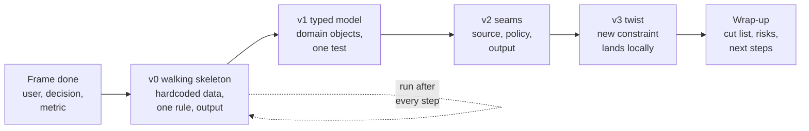
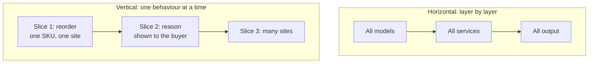
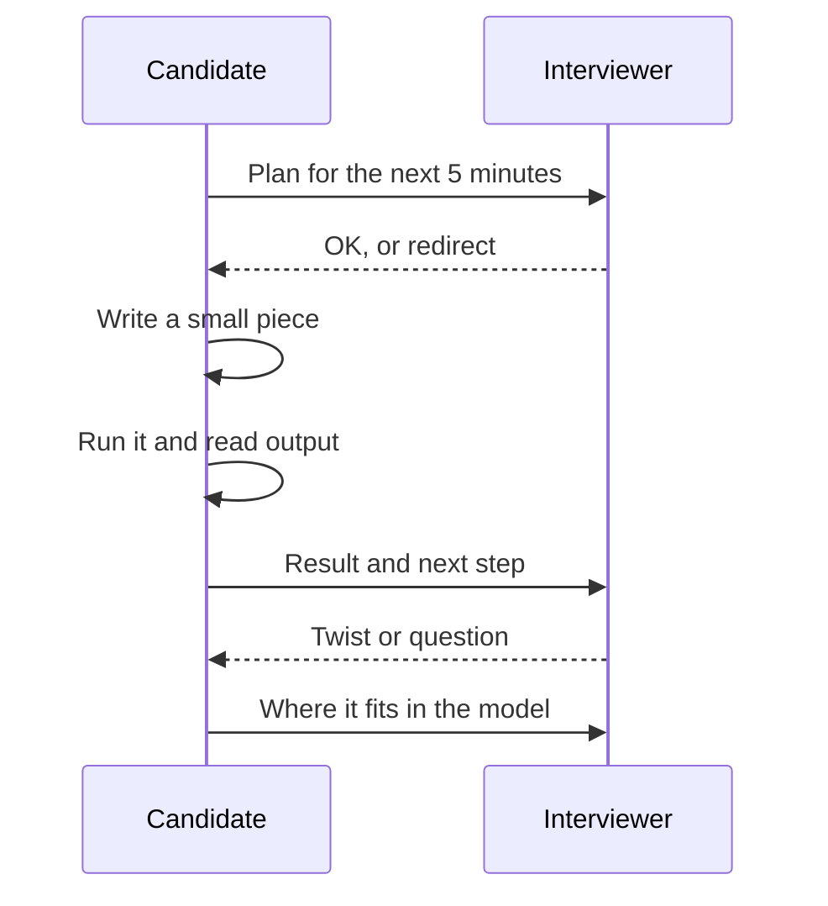
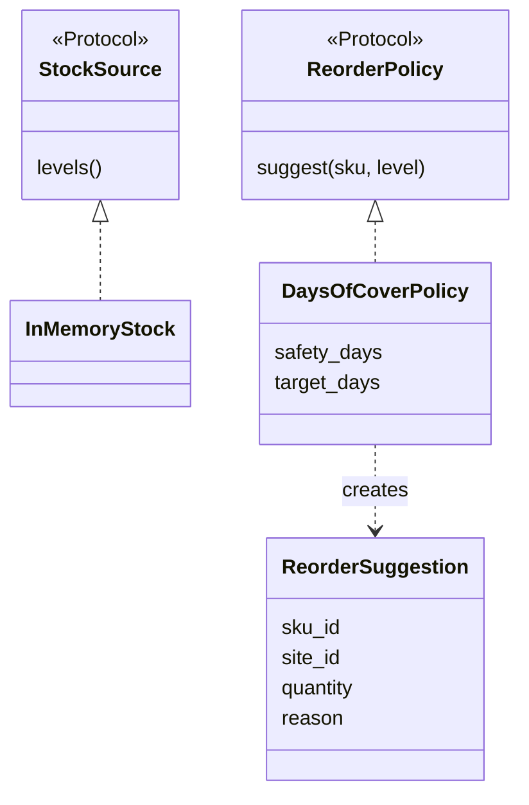

# Decomposing into a Working, Extensible MVP in a Live Pairing Session

!!! abstract "Key takeaways"
    - Get something **running end to end within about 10 minutes**: hardcoded data in, one rule, real output. This is a **walking skeleton** (Alistair Cockburn: a tiny implementation that performs a small end-to-end function). Everything after it is a safe, visible improvement.
    - Grow by **vertical slices** (one user-visible behaviour at a time through every layer), not horizontal layers (all models, then all services, then all output).
    - Add **seams only where change is likely**: the data source, the policy or algorithm, and the output. Typing those as `Protocol`s (Python) or interfaces (Java) is what makes the model "extensible" in the interviewer's eyes.
    - **Narrate and checkpoint.** Say what you're about to do, do it, run it, and ask "does this match what you want?" every 10 minutes. Silence and long periods without running code are the two biggest risks.
    - Keep a **visible cut list and assumption list** in the editor. When the twist comes, the change should be small and local. If it forces a rewrite, the seams were in the wrong place.

## Why it matters

Prep sites describe Palantir's decomposition round as roughly a 60-minute live pairing session aimed at turning a vague real-world prompt into a **running, extensible model**, and say other FDE loops have adopted similar rounds. Interviewers watch three things at once: whether you **ship something that runs**, whether its **structure survives a change**, and whether you are **easy to work with** while doing it. Candidates who design beautifully on paper and run out of time with nothing running do badly; so do candidates who hack a script that collapses at the first follow-up.

The real job is the same. A forward deployed engineer often demos a working slice to a customer in days, then iterates in front of them. The [PostHog FDE handbook](https://posthog.com/handbook/forward-deployed-engineering/how-we-work) and the broader FDE literature stress fast, visible delivery inside the customer's environment. A walking skeleton with good seams is how you do that without painting yourself into a corner.

## Core concepts

### The build loop for a 45-minute window


*Notice that every box ends with code that runs and prints a result. If time runs out after any box, you still have something to demo and talk about.*

| Stage | Rough time | Goal | What you say |
|---|---|---|---|
| v0 skeleton | min 15–25 | Prove the path from input to decision works | "Hardcoded data first so we see a result fast." |
| v1 typed model | min 25–32 | Name the domain, add one test | "Now I'll give these real types so rules have a home." |
| v2 seams | min 32–40 | Isolate what will change | "The policy is the part most likely to change, so I'll put it behind an interface." |
| v3 twist | min 40–52 | Absorb the interviewer's change | "This fits in the policy and one new field." |
| Wrap-up | min 52–60 | Show judgement | "Here's what I cut, what's risky, what I'd do next." |

### Walking skeleton vs prototype vs big design

Cockburn's walking skeleton "need not use the final architecture, but it should link together the main architectural components", and it is meant to **evolve**, unlike a throwaway spike. *Growing Object-Oriented Software, Guided by Tests* (Freeman and Pryce) describes it as the thinnest slice of real functionality that can be built and tested end to end. *The Pragmatic Programmer* calls the same idea **tracer bullets**: code that goes all the way through the system so you can see where it lands and adjust.

| Approach | In a pairing round | Risk |
|---|---|---|
| Walking skeleton then grow | Running in 10 minutes; each step demoable | Must refactor as you go |
| Throwaway spike, then "real" code | Learn fast | No time to rewrite |
| Full design first (all classes, then logic) | Looks thorough | Nothing runs at minute 40 |
| Script and never refactor | Fast start | Twist forces a rewrite |

### Vertical slices, not layers


*Notice that the vertical path shows the interviewer a working behaviour after each slice. The horizontal path only shows value when the last layer is done, which may be never in 45 minutes.*

### Where to put seams (and where not to)

Michael Feathers defines a **seam** as a place where you can change behaviour without editing in that place. In a decomposition round, three seams cover most twists:

1. **Data source**: in-memory list today; CSV, database or the customer's API tomorrow.
2. **Policy or algorithm**: the rule that makes the decision (threshold, scoring, matching, routing). This is the most common twist target.
3. **Output**: print today; API, alert or dashboard tomorrow.

Do not add seams elsewhere "just in case". Each interface costs time and makes the code harder to follow live. Name the seams you **chose not to add** ("persistence is a dict; I'd add a repository when we need a database"). That shows judgement, which is what [YAGNI and SOLID](../lld-design-patterns/01-solid-dry-kiss-yagni-composition-over-inheritance.md) are about. The [Strategy pattern](../lld-design-patterns/04-behavioural-patterns.md) is the formal name for the policy seam.

### Talking while coding


*Notice the rhythm: plan, small change, run, report. The interviewer is never left guessing what you're doing, and every redirect costs you minutes, not a rewrite.*

Useful phrases:

- "I'll hardcode this for now and put it behind an interface once it works."
- "I'm going to skip input validation and write it on the cut list."
- "Quick check before I go further: is per-site reordering what you want, or per company?"
- "That run surprised me. Let me look at why before adding more."

### Pairing-tool realities

- Tools like CoderPad often run a single file with the standard library; don't plan on installing packages. Python's `dataclasses`, `typing.Protocol`, `enum`, `collections`, `heapq` and `statistics` are enough for most models.
- Use the language you are fastest in. FDE teams often use Python, so practise Python fluency even if your production background is Java; see [Python](../python/index.md) and the [learning round](06-the-learning-round-picking-up-an-unfamiliar-api-language-or.md) page.
- Run often. A program you run every 3–5 minutes never has more than one bug at a time.
- Tests can be plain `assert`s at the bottom of the file. Mention that you'd use pytest or JUnit in a real repo.

## In practice: code & configuration

The prompt: *"Our hospitals keep running out of supplies. Help."* After framing: the user is the **site buyer**, the decision is **what to reorder today**, the metric is **stockouts per week** with inventory value as a guardrail.

### v0 (about minute 10 of building): walking skeleton

```python
# v0 (minute ~10): walking skeleton. Hardcoded data, one function, real output.
stock = {"gloves": 40, "masks": 500, "syringes": 90}
daily_use = {"gloves": 20, "masks": 30, "syringes": 10}

def needs_reorder(item: str) -> bool:
    return stock[item] / daily_use[item] < 7      # less than 7 days of cover

print([i for i in stock if needs_reorder(i)])     # ['gloves']
```

Ten lines, and the interviewer already sees the decision being made. Now say what's wrong with it: no supplier lead time, no quantity, one site, magic number 7, no explanation for the buyer.

### From v0 to v3: what changes and why

=== "❌ Common mistake"
    ```python
    # Minute 35: a "framework" with nothing running yet.
    from abc import ABC, abstractmethod

    class BaseEntity(ABC): ...
    class BaseRepository(ABC):
        @abstractmethod
        def find_all(self): ...
    class AbstractReorderStrategyFactory(ABC): ...
    class EventBus: ...
    class NotificationService: ...
    # No data, no output, no decision. When the interviewer says
    # "we have three warehouses", there is nothing to change yet.
    ```

=== "✅ Correct approach (v3, about minute 45)"
    ```python
    """v3 (minute ~45): same behaviour as v0, now with seams for the follow-ups."""
    from __future__ import annotations
    from dataclasses import dataclass
    from typing import Iterable, Protocol

    # ---- Domain: nouns from the prompt ----
    @dataclass(frozen=True)
    class Sku:
        sku_id: str
        supplier_lead_days: int

    @dataclass(frozen=True)
    class StockLevel:
        sku_id: str
        site_id: str                 # added at v2 when the interviewer said "we have 3 warehouses"
        on_hand: int
        avg_daily_use: float

    @dataclass(frozen=True)
    class ReorderSuggestion:
        sku_id: str
        site_id: str
        quantity: int
        reason: str                  # explainability: users must trust the suggestion

    # ---- Seams: the parts most likely to change ----
    class StockSource(Protocol):
        def levels(self) -> Iterable[StockLevel]: ...

    class ReorderPolicy(Protocol):
        def suggest(self, sku: Sku, level: StockLevel) -> ReorderSuggestion | None: ...

    class InMemoryStock:                         # swap for CSV / ERP API later
        def __init__(self, rows: list[StockLevel]) -> None:
            self._rows = rows
        def levels(self) -> Iterable[StockLevel]:
            return iter(self._rows)

    @dataclass(frozen=True)
    class DaysOfCoverPolicy:
        safety_days: int = 3
        target_days: int = 14

        def suggest(self, sku: Sku, level: StockLevel) -> ReorderSuggestion | None:
            if level.avg_daily_use <= 0:
                return None                      # edge case named out loud, handled simply
            cover = level.on_hand / level.avg_daily_use
            trigger = sku.supplier_lead_days + self.safety_days
            if cover >= trigger:
                return None
            qty = round(self.target_days * level.avg_daily_use - level.on_hand)
            return ReorderSuggestion(sku.sku_id, level.site_id, max(qty, 0),
                                     f"{cover:.1f} days of cover < lead time {sku.supplier_lead_days} + safety {self.safety_days}")

    # ---- Use case: orchestrates, knows nothing about storage or the policy's maths ----
    def reorder_report(skus: dict[str, Sku], source: StockSource, policy: ReorderPolicy) -> list[ReorderSuggestion]:
        out = []
        for level in source.levels():
            s = policy.suggest(skus[level.sku_id], level)
            if s:
                out.append(s)
        return sorted(out, key=lambda s: (s.site_id, s.sku_id))

    if __name__ == "__main__":
        skus = {"gloves": Sku("gloves", 5), "masks": Sku("masks", 10), "syringes": Sku("syringes", 2)}
        source = InMemoryStock([
            StockLevel("gloves", "PUNE", 40, 20),
            StockLevel("masks", "PUNE", 500, 30),
            StockLevel("syringes", "PUNE", 90, 10),
            StockLevel("masks", "MUMBAI", 200, 30),
        ])
        for s in reorder_report(skus, source, DaysOfCoverPolicy()):
            print(s)
        # tiny test: the v0 behaviour still holds for gloves
        assert any(s.sku_id == "gloves" and s.site_id == "PUNE" for s in reorder_report(skus, source, DaysOfCoverPolicy()))
    ```
    Output:
    ```text
    ReorderSuggestion(sku_id='masks', site_id='MUMBAI', quantity=220, reason='6.7 days of cover < lead time 10 + safety 3')
    ReorderSuggestion(sku_id='gloves', site_id='PUNE', quantity=240, reason='2.0 days of cover < lead time 5 + safety 3')
    ```

Notice how the twist ("we have three warehouses") landed: one field on `StockLevel` and a sort key. The masks at Mumbai now trigger because the 10-day supplier lead time was modelled; in v0 the magic number 7 would have missed them.


*Notice there are exactly two seams. A CSV or ERP source and an ML forecast policy each become one new class; `reorder_report` never changes.*

### Typical twists and where they land

| Twist | Lands in | Size |
|---|---|---|
| "Read stock from this CSV" | New `CsvStock` implementing `StockSource` | ~10 lines |
| "Use a demand forecast instead of average use" | New `ForecastPolicy`; forecast model behind it | New class |
| "Budget cap per site per week" | Post-processing step on the report: rank by urgency, cut at budget | One function |
| "Some items are critical, never stock out" | `Sku.critical`, higher `safety_days` in policy | Two lines |
| "Buyers want to override suggestions" | `Override` object and an action that records who and why | Additive |

## Real-world usage

- **Walking skeletons in enterprise delivery:** teams use them to prove integration paths early (auth, network, data access) because in customer environments the plumbing, not the algorithm, usually breaks first. That is especially true when deploying into a customer VPC or on-prem; see [enterprise deployment](../fde-enterprise-deployment/index.md).
- **Strategy-style policies are everywhere in operations software:** pricing rules, fraud rules, routing heuristics and reorder policies all change faster than the data model. Keeping them pluggable lets a customer A/B a new policy against the old one.
- **Explainability as a feature:** the `reason` field matters in healthcare and banking, where users must justify actions to auditors. Black-box recommendations without reasons are often ignored by staff.
- **Failure mode:** demos that only work on hardcoded data. In the interview, say how the data source seam would connect to the real system and what could go wrong (freshness, missing SKUs).

## Trade-offs & production gotchas

| Decision | Option A | Option B | Default in the round |
|---|---|---|---|
| Start | Hardcoded data | Parse an input file | Hardcoded, then file if asked |
| Types | Dicts | Dataclasses / records | Dataclasses from v1 |
| Seams | Everywhere | Source, policy, output only | Only where change is likely |
| Tests | Full test suite | A few `assert`s | Asserts, mention pytest/JUnit |
| Persistence | Database | In-memory dict | In-memory, name the repository seam |
| Language | Strongest language | Language the team uses | Strongest, unless told otherwise |

!!! warning "Gotchas"
    - **No output for 20 minutes** is the biggest red flag. Print something early.
    - **Refactoring in silence.** Say "I'm extracting the policy so the next change is easy" before you do it.
    - **Breaking the running version.** Make small steps and rerun; if a refactor goes wrong, undo instead of debugging for 10 minutes.
    - **Over-abstracting.** `AbstractFactoryFactory` signals the opposite of judgement. Two Protocols are enough.
    - **Ignoring the interviewer's twist** to finish your plan. The twist is the test; take it.

!!! tip "Rehearse the skeleton"
    Practise writing the v0-to-v3 progression for three prompts (inventory, scheduling, dispatch) against a 45-minute timer until the first output always appears before minute 10. The [worked prompts page](05-worked-decomposition-prompts-scheduling-logistics-marketplac.md) has four more to drill.

## How this connects to my experience

- **Where it applies:** not a resume claim as an interview format, but "Built the ReactJS application from the ground up and established a micro-frontend architecture" and "Established engineering standards around testing, CI/CD, code quality" (OptumRx Meteor) are real examples of starting thin and structuring for growth.
- **Talking points:**
    - Starting the React app from scratch and splitting into micro-frontends later is a seam story: where did you leave room for teams to plug in? *[confirm: what the first shipped slice of the app was]*
    - Kafka workflows with retry and DLQ are a pluggable-policy example (retry policy as configuration, not code). *[confirm: whether retry policy was configurable per topic]*
    - Leading sprint planning gives a natural way to talk about vertical slicing of stories.
- **Likely follow-up chain:** "How do you decide what goes into v1?" → "How do you avoid over-engineering?" → "Tell me about a time a design didn't survive a requirement change." Answer with seams chosen for likely change, YAGNI elsewhere, and an honest example. *[confirm: a real example where a design had to be reworked]*

## Interview questions

### Fundamentals

??? question "Q1. What is a walking skeleton and why start with one?"
    **Answer:** A tiny implementation that performs one small end-to-end function and links the main components (Cockburn). It proves the path from input to decision works, gives the interviewer something to see within minutes, and makes every later step an improvement to running code rather than a hope.

    **Interviewer listens for:** end to end, evolves rather than thrown away, early output.

    **Common wrong answer:** "A prototype you throw away."

??? question "Q2. Vertical slice vs horizontal layer: which do you build first and why?"
    **Answer:** Vertical slices: one user-visible behaviour through every layer. Each slice is demoable and testable, and if time runs out you have working behaviour. Horizontal layers deliver nothing visible until the last layer is done.

    **Interviewer listens for:** demoability under time pressure.

    **Common wrong answer:** "Models first, then services, then the API."

??? question "Q3. What makes a model 'extensible' in this round?"
    **Answer:** Likely changes land locally: a new data source, a new policy or a new output is a new class implementing an existing interface, and a new constraint is a field plus a rule in one place. The core use case function doesn't change. Extensibility is judged by how small the twist's diff is.

    **Interviewer listens for:** small, local changes, not abstraction count.

    **Common wrong answer:** "Lots of abstract classes and interfaces."

??? question "Q4. How often should you run your code in a live session?"
    **Answer:** Every few minutes, after each small change. That keeps bugs isolated, shows progress, and gives natural moments to narrate and check in.

    **Interviewer listens for:** small steps and feedback loops.

    **Common wrong answer:** "When the whole thing is written."

### Intermediate

??? question "Q5. Where do you put seams, and how do you avoid over-engineering?"
    **Answer:** Where change is most likely: the data source, the decision policy and the output. Everywhere else, keep concrete code and say which seam you'd add later and when (for example a repository once persistence is needed). Each interface costs time and readability.

    **Interviewer listens for:** deliberate placement and named deferrals.

    **Common wrong answer:** "Program to interfaces everywhere."

??? question "Q6. Python `Protocol` vs `ABC` for seams in an interview?"
    **Answer:** `typing.Protocol` gives structural typing: any class with the right methods fits, no inheritance needed, which is light and flexible for live coding. `ABC` enforces implementation at instantiation and suits shared base behaviour. For seams in a 45-minute model, Protocols are usually enough; in Java, a plain interface is the equivalent.

    **Interviewer listens for:** knowing both and choosing simply.

    **Common wrong answer:** not knowing structural typing exists.

??? question "Q7. How do you test in a pairing tool without a framework?"
    **Answer:** A few `assert` statements at the bottom of the file covering the main behaviour and one edge case, rerun after each change. Mention that in a real repo you'd use pytest or JUnit with fixtures and that the seams make the policy testable in isolation.

    **Interviewer listens for:** pragmatism plus testing instinct.

    **Common wrong answer:** no tests, or 15 minutes setting up a framework.

??? question "Q8. Why add a `reason` field to a recommendation?"
    **Answer:** Users act on recommendations they understand. A reason supports trust, debugging and audit (important in healthcare and finance) and lets the customer tune the policy. It costs one field.

    **Interviewer listens for:** end-user empathy and operational thinking.

    **Common wrong answer:** "The algorithm is correct, so no explanation is needed."

### Senior

??? question "Q9. How do you balance speed and code quality in the round?"
    **Answer:** Optimise for speed until something runs, then improve structure in small, safe steps while keeping it running: types, then seams, then edge cases. State the shortcuts you took on a visible cut list. Quality here means "the next change is easy", not completeness.

    **Interviewer listens for:** sequencing and explicit trade-offs.

    **Common wrong answer:** "I always write production-quality code from the start."

??? question "Q10. The interviewer asks how this MVP would become production software at the customer. What do you say?"
    **Answer:** Swap the in-memory source for the real system behind the existing seam (with auth, retries and freshness checks), add persistence for suggestions and overrides, schedule the job or expose an API, add logging and a metric for the success KPI, run in shadow mode next to current practice, then pilot at one site with exit criteria.

    **Interviewer listens for:** deployment path, shadow mode, measuring impact.

    **Common wrong answer:** "Containerise it and deploy to Kubernetes."

??? question "Q11. When would you rewrite instead of extend during the session?"
    **Answer:** Almost never with less than 15 minutes left. If the twist breaks a core assumption (say the unit of decision changes from SKU to order), explain the impact, make the smallest change that demonstrates the new behaviour, and describe the proper restructure verbally.

    **Interviewer listens for:** time awareness and honest trade-offs.

    **Common wrong answer:** deleting everything at minute 45.

### Scenario-based

??? question "Q12. Minute 30 and nothing runs yet. What do you do?"
    **Answer:** Say so, stop designing, and get the thinnest path running with hardcoded data in the next five minutes, even if it ignores half the model. Then reconnect the structure. A running simple version beats an unfinished elegant one.

    **Interviewer listens for:** self-awareness and recovery.

    **Common wrong answer:** keep building classes and hope.

??? question "Q13. The interviewer says 'we now need to support three warehouses' at minute 40. Walk through it."
    **Answer:** Add `site_id` to the stock level, keep the policy per SKU and site, group or sort the report by site, add one assert for a second site, run it. Mention follow-ups (transfers between sites before reordering) as next steps rather than building them.

    **Interviewer listens for:** a small, local change and a mention of the next idea.

    **Common wrong answer:** a new class hierarchy for warehouses.

??? question "Q14. You get stuck on a bug for five minutes. What now?"
    **Answer:** Narrate what you expected versus what you see, print the intermediate values, simplify the input, and if it is not core, hardcode around it and put it on the cut list. Ask the interviewer if they see something; using them as a resource is allowed.

    **Interviewer listens for:** calm debugging and time management.

    **Common wrong answer:** silent staring.

## Cheat sheet

| Concept | Remember |
|---|---|
| Walking skeleton | End to end, hardcoded, running by minute ~10 of building |
| Slices | Vertical, demoable after each |
| Seams | Source, policy, output; name the ones you skipped |
| Types | Dataclasses / records from v1; enums for states |
| Tests | `assert`s at the bottom; rerun every few minutes |
| Narration | Plan, change, run, report; checkpoint every ~10 minutes |
| Twist | Should be a field, a rule or a new class, not a rewrite |
| Lists on screen | Assumptions and cut list |
| Stuck | Simplify, print, hardcode around, ask |

## Sources
1. [O'Reilly, *97 Things Every Software Architect Should Know*, ch. 60 "Start with a Walking Skeleton"](https://oreilly.com/library/view/97-things-every/9780596800611/ch60.html): walking skeleton idea and Cockburn's definition.
2. Alistair Cockburn, *Crystal Clear* (2004): walking skeleton definition (links main components, need not use the final architecture).
3. Steve Freeman and Nat Pryce, *Growing Object-Oriented Software, Guided by Tests*: thinnest end-to-end slice that can be built, deployed and tested.
4. David Thomas and Andrew Hunt, *The Pragmatic Programmer* (20th anniversary edition): tracer bullets.
5. Michael Feathers, *Working Effectively with Legacy Code*: seams.
6. [Python docs: typing.Protocol](https://docs.python.org/3/library/typing.html#typing.Protocol): structural subtyping used for the seams.
7. [Exponent: Palantir FDE interview guide](https://www.tryexponent.com/guides/palantir-forward-deployed-engineer-interview): 60-minute live pairing, running extensible model (prep site, candidate reports).
8. [Exponent: How to answer decomposition interview questions (2026)](https://www.tryexponent.com/blog/how-to-answer-decomposition-interview-questions-the-definitive-guide-2026): end-to-end skeleton before depth, narrate continuously.
9. [PostHog handbook: Forward deployed engineering, how we work](https://posthog.com/handbook/forward-deployed-engineering/how-we-work): fast, visible delivery with customers.
