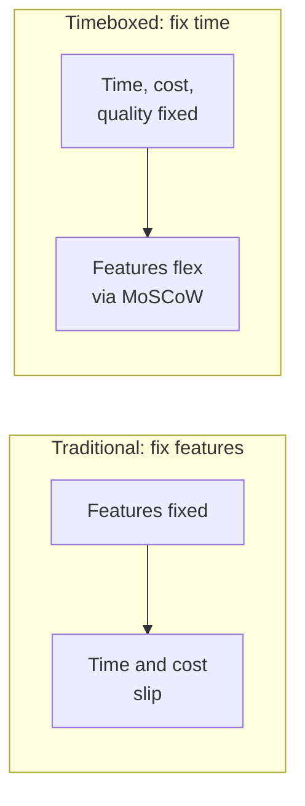
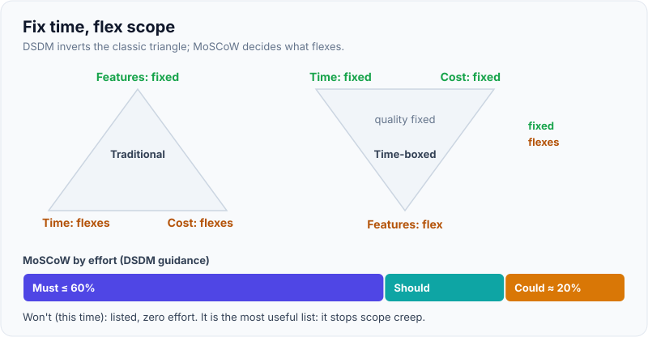
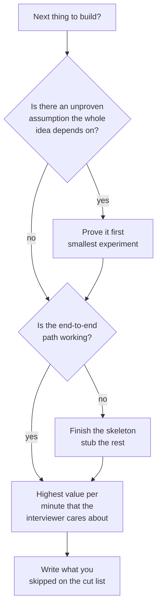
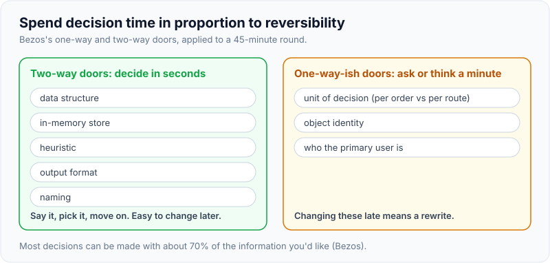

# Prioritisation, Trade-off Calls & Cutting Scope Under Time Pressure

!!! abstract "Key takeaways"
    - When time is fixed, **scope is the variable**. DSDM makes this explicit: time, cost and quality are fixed and features flex, managed with **MoSCoW** (Must, Should, Could, Won't have this time).
    - Sequence by **risk and value**, not by what's easiest to demo: build the part that proves the idea works (the decision logic on real-shaped data) before the polish around it.
    - **Cut depth, not breadth.** Keep the end-to-end path working and stub the expensive parts behind a seam (straight-line distance instead of a routing API). A stub with an interface is a deferral; a half-built feature is waste.
    - Make trade-off calls in one sentence: **"A or B; I pick A because of requirement X; the cost is Y; I'd revisit if Z."** Say it out loud and write it on the cut list.
    - Spend decision time in proportion to **reversibility**. Two-way doors (an in-memory store, a heuristic) get decided in seconds; one-way doors (the unit of decision, the object model's identity) deserve a question to the interviewer.

## Why it matters

Every decomposition round runs out of time. Interviewers expect it. Prep sites list **scoping judgement** among the things they score and describe strong answers as ending in a **sequenced plan** with named assumptions and trade-offs; sequencing that plan by risk rather than by what's easiest to demo is how you make it convincing. The candidate who builds 40% of everything loses to the one who builds 100% of the core plus a clear list of what was cut and why.

On a real deployment, the same skill decides whether a pilot lands. Customers always ask for more than fits in six weeks. FDE job descriptions talk about owning scoping and production rollout; that means saying "not in this pilot" often, with reasons the sponsor accepts. The [customer discovery topic](../fde-customer-discovery/index.md) covers saying no to stakeholders; this page covers making the call itself.

## Core concepts

### Fix time, flex scope


*Notice that in an interview the time box is absolute. The only levers left are scope and depth, so the skill is choosing which to pull.*

{ loading=lazy }
*Only the bottom vertex of the right triangle moves; that's your scope.*

The Agile Business Consortium's DSDM guidance applies MoSCoW inside each timebox:

| Priority | Meaning | In a 45-minute build | On a 6-week pilot |
|---|---|---|---|
| **Must** | Without it the solution is pointless or unsafe | The decision logic on realistic data, end-to-end output | Core workflow for the primary user, security sign-off |
| **Should** | Important, painful to leave out, workaround exists | Explanations, one edge case, the twist | Second user type, CSV import |
| **Could** | Nice to have, first to drop | Pretty output, extra metrics | Dashboard polish, notifications |
| **Won't (this time)** | Agreed out of scope for now | Persistence, auth, UI | Mobile app, other sites |

The DSDM guidance recommends typically no more than 60% of effort on Must Haves, with a pool of Could Haves of about 20%, so the Should and Could items form a buffer that can be dropped when estimates are wrong. The **Won't** list is the most valuable: it shows you thought about those items and chose not to do them.

### Ranking techniques and when to use each

| Technique | How it works | Strength | Weakness | Use when |
|---|---|---|---|---|
| MoSCoW | Bucket items into Must/Should/Could/Won't | Fast, shared language with business | Everything becomes a Must without discipline | Timeboxes, interviews, pilots |
| RICE (Intercom) | (Reach × Impact × Confidence) / Effort | Comparable numbers, forces confidence estimate | False precision, slow | Roadmaps with many candidate features |
| Value vs effort 2×2 | Plot items; do high-value low-effort first | Visual, quick with stakeholders | Ignores risk and dependencies | Workshop with the customer |
| Risk-first | Build what would kill the project if wrong | Finds dead ends early | May delay visible progress | New domains, unknown data, integrations |
| Cost of delay / WSJF | Value lost per week of delay ÷ duration | Good for sequencing | Hard to estimate value | Portfolio and release planning |

RICE was introduced by Intercom: Reach (people per period), Impact (a scale from 0.25 to 3), Confidence (a percentage) and Effort (person-months). In an interview you won't compute it, but mentioning confidence shows maturity: "this feature has high impact but I'm only 50% sure the data exists, so it goes after the data check."

### Risk-first sequencing

Ask: **what assumption, if wrong, makes everything else pointless?** Build or test that first.


*Notice the order: risk, then a working path, then value. Polish never appears; it comes from leftover time, not from planning.*

For a 911 posting prompt, the riskiest assumption is "travel time explains most of the response time". If the data says call handling dominates, the posting model is pointless. So the first code is the baseline breakdown, not the optimiser.

### Cutting depth, not breadth

| Expensive part | Cut to | Keeps |
|---|---|---|
| Real routing / maps API | Straight-line distance × road factor | Ranking of units, the interface |
| ML demand forecast | 28-day moving average | The policy seam |
| Database | In-memory dict | Repository method names |
| Auth and roles | Single user, comment on where checks go | The action choke point |
| UI | Printed table | The data the UI would show |
| Optimal assignment (Hungarian, ILP) | Greedy assignment | Correctness of constraints |
| Every edge case | The one that changes the decision | A note listing the others |

The pattern is always the same: keep the **shape** (interface, data, flow) and replace the **depth** (algorithm, integration) with a simple version that is good enough to demo the decision.

### Trade-off calls: a script

A good trade-off statement has five parts:

1. **Options:** "Greedy assignment or optimal matching."
2. **Choice:** "Greedy for now."
3. **Reason tied to a requirement:** "We have under 50 units per shift and the commander approves each posting, so near-optimal is fine."
4. **Cost:** "It can make a locally good choice that blocks a better one later."
5. **Revisit trigger:** "If we automate approvals or go above a few hundred units, I'd move to an assignment solver."

Practise until this takes 15 seconds. The [system design framework](../system-design/01-approach-and-framework-for-the-design-interview.md) uses the same shape for architecture choices.

### Reversibility decides how long to think

Jeff Bezos' shareholder letters split decisions into **one-way doors** (consequential, hard to reverse; decide carefully) and **two-way doors** (reversible; decide fast, by individuals or small groups), and suggest most decisions can be made with about 70% of the information you'd like. In the round:

- **Two-way doors** (decide in seconds): data structure, store, heuristic, output format, naming.
- **One-way-ish doors** (ask or think for a minute): the unit of decision (per order vs per route), object identity, who the primary user is. Changing these late means a rewrite.

{ loading=lazy }
*Spend your clarifying questions on the right-hand panel.*

### Time checks

Glance at the clock at fixed points and say what you're doing about it:

| Time left | If behind | Say |
|---|---|---|
| 30 min | Skeleton not running | "I'm going to hardcode the data and get output first." |
| 20 min | Core logic not done | "I'll stub the routing and finish the assignment rule." |
| 10 min | Twist not handled | "Let me make the smallest change that shows the twist works." |
| 5 min | Anything | "Let me summarise what works, what's cut and what I'd do next." |

## In practice: code & configuration

The twist: *"Recommend which ambulance to send."* A real routing API would be ideal but needs keys, network access and rate-limit handling you don't have in a pairing tool.

=== "❌ Common mistake"
    ```python
    # 20 minutes spent on integration plumbing for a dependency we can't call.
    import requests, time

    class RoutingClient:
        def __init__(self, api_key, retries=3, backoff=1.5):
            self.api_key, self.retries, self.backoff = api_key, retries, backoff

        def travel_minutes(self, a, b):
            for attempt in range(self.retries):
                r = requests.get("https://routing.example/v1/eta",
                                 params={"from": a, "to": b, "key": self.api_key})
                if r.status_code == 429:
                    time.sleep(self.backoff ** attempt)   # TODO: honour Retry-After
                    continue
                return r.json()["minutes"]
            raise RuntimeError("routing failed")

    # ...no unit selection logic, no output, nothing runs in the sandbox.
    ```

=== "✅ Correct approach"
    ```python
    """Cut depth, keep the seam: a straight-line ETA stands in for a routing API."""
    from dataclasses import dataclass
    from math import asin, cos, radians, sin, sqrt
    from typing import Protocol

    # DECISIONS (said out loud, kept as a comment the interviewer can see)
    # - CUT: real routing API (needs keys, network, rate limits). Stub: haversine * road factor.
    # - CUT: traffic by time of day. Revisit if ETA error matters more than ranking order.
    # - KEPT: the TravelTime seam, so the real client is a one-class change.

    @dataclass(frozen=True)
    class Point:
        lat: float
        lon: float

    class TravelTime(Protocol):
        def minutes(self, a: Point, b: Point) -> float: ...

    @dataclass(frozen=True)
    class StraightLineTravelTime:
        kmh: float = 30.0
        road_factor: float = 1.3          # roads are longer than straight lines; tune with real data later

        def minutes(self, a: Point, b: Point) -> float:
            dlat, dlon = radians(b.lat - a.lat), radians(b.lon - a.lon)
            h = sin(dlat / 2) ** 2 + cos(radians(a.lat)) * cos(radians(b.lat)) * sin(dlon / 2) ** 2
            km = 2 * 6371 * asin(sqrt(h))
            return km * self.road_factor / self.kmh * 60

    def nearest_unit(incident: Point, units: dict[str, Point], tt: TravelTime) -> tuple[str, float]:
        best = min(units, key=lambda u: tt.minutes(units[u], incident))
        return best, round(tt.minutes(units[best], incident), 1)

    if __name__ == "__main__":
        units = {"AMB-1": Point(18.5204, 73.8567), "AMB-2": Point(18.5590, 73.7868)}
        print(nearest_unit(Point(18.5300, 73.8470), units, StraightLineTravelTime()))  # ('AMB-1', 3.8)
    ```

The correct version runs, makes the decision, and puts the cut in writing. When the interviewer asks "what about real roads?", the answer is a class called `RoutingApiTravelTime` that implements `minutes`, plus the retry and rate-limit concerns you deliberately deferred (see [retries and backoff](../distributed-systems/05-retries-backoff-jitter-timeouts.md)).

A visible cut list at the top of the file:

```text
CUT LIST (Won't this session)            WHY                               REVISIT WHEN
- routing API                            no network in sandbox; ranking ok  ETA accuracy is a requirement
- unit availability / busy status        single-incident demo               multiple concurrent incidents
- persistence                            in-memory is enough to demo        more than one session / user
- auth                                   single user                        before pilot
```

## Real-world usage

- **Pilots and proofs of concept:** successful FDE-style pilots define exit criteria and a Won't list up front, then cut Coulds when integration takes longer than planned (it usually does). See [estimation and stakeholder management](../leadership-behavioral/07-estimation-deadlines-and-stakeholder-management.md) for the conversation side.
- **Amazon's two-way-door culture** is the reason many teams there ship reversible changes quickly behind feature flags and reserve design reviews for one-way decisions such as data models and public APIs.
- **Healthcare and banking:** some items can never be cut (audit logging, PHI handling, access control at the point of action). Saying "this is a Must even in the demo because of PHI" earns credit. Cut the UI, not the safeguards.
- **Failure mode:** "everything is a Must". If every item is Must, nothing is prioritised; ask "what happens if we ship without it?" If the answer is "it's worse but still useful", it's a Should.

## Trade-offs & production gotchas

| Cut | Pros | Cons | Use when |
|---|---|---|---|
| Stub behind an interface | Keeps flow, easy to replace | Demo numbers may be unrealistic | External dependencies, heavy algorithms |
| Hardcode data | Fastest | Hides data-quality issues | Skeleton stage |
| Drop an edge case with a note | Saves time | Bug risk later | Rare cases that don't change the decision |
| Drop a user type | Big time saving | Narrower value | Second user has a different decision |
| Lower accuracy (greedy vs optimal) | Simple, explainable | Sub-optimal results | Small scale, human in the loop |
| Cut safeguards (auth, audit, PHI) | Saves time | Unacceptable in regulated domains | Never silently; at most a stated placeholder |

!!! warning "Gotchas"
    - **Silent cuts look like gaps.** Always say what you cut and write it down.
    - **Polish first is a trap.** Pretty output on a wrong decision scores worse than ugly output on a right one.
    - **Don't cut the twist.** The interviewer's new requirement is a Must for the interview, even if you'd push back on a real customer.
    - **Stubs must be honest.** Name them `Stub` or `StraightLine...`, not `RoutingService`, so nobody mistakes them for the real thing.
    - **Reversible choices don't need consensus.** Don't ask the interviewer about variable names; do ask about the primary user.

!!! question "Interview angle"
    A common follow-up after the build is "If you had another hour, what would you do, in order?" Answer from your cut list, ordered by risk and value, not by what's fun: "1. availability of units, because it changes the decision; 2. real routing, because accuracy matters for p90; 3. persistence."

## How this connects to my experience

- **Where I used it:** "Led sprint planning, estimation, stakeholder communication, release management, and production support" and "Led a cross-functional team of 8–10 engineers delivering enterprise healthcare applications serving 750K+ users" (OptumRx Meteor, Publicis Sapient).
- **Talking points:**
    - Sprint planning is MoSCoW in practice: fixed sprint length, flexible scope, negotiating Should vs Could with product owners. *[confirm: whether the team used MoSCoW explicitly or story points plus a priority order]*
    - Release management means deciding what ships when a sprint runs short: which items move to the next release and how that was communicated. *[confirm: one concrete example of descoping before a release and what was cut]*
    - The GraphQL Consumer Service integrated 5 upstream systems: a natural place for "cut depth, keep the seam", for example shipping with cached or partial data from a slow upstream. *[confirm: whether partial responses or stubs were used while an upstream wasn't ready]*
    - Healthcare constraints (OAuth2, PingFederate, AD) are things that couldn't be cut, which is a good example of separating Musts from Coulds.
- **Likely follow-up chain:** "Tell me about a time you had to cut scope to hit a deadline." → "How did you decide what to cut?" → "How did stakeholders react?" → "What would you do differently?" Use STAR: the deadline and stakes, the options listed, the criteria (risk, user impact, compliance), the communication (early, with a Won't list and a date for the deferred items), the result, and the lesson. See [STAR story bank](../leadership-behavioral/01-star-framework-and-building-a-story-bank.md). *[confirm: the story, dates and outcome]*

## Interview questions

### Fundamentals

??? question "Q1. You have 45 minutes and a long list of features. How do you decide what to build?"
    **Answer:** Bucket with MoSCoW against the chosen user and decision. Must: the decision logic and an end-to-end path on realistic data. Then sequence by risk (prove the riskiest assumption first) and value. Write a Won't list and say it out loud. Revisit at time checks.

    **Interviewer listens for:** an explicit method and a visible cut list.

    **Common wrong answer:** "I'll try to do everything quickly."

??? question "Q2. What does MoSCoW stand for and what's the most important bucket?"
    **Answer:** Must have, Should have, Could have, Won't have (this time). The Won't bucket is the most useful because it records conscious exclusions and stops scope creep; DSDM also recommends keeping Musts to a minority of effort so Shoulds and Coulds act as contingency.

    **Interviewer listens for:** the "this time" nuance and contingency idea.

    **Common wrong answer:** treating Won't as "never".

??? question "Q3. What does 'cut depth, not breadth' mean?"
    **Answer:** Keep the end-to-end flow complete and reduce the sophistication of expensive pieces: a heuristic instead of a solver, a stub instead of an API, in-memory instead of a database, all behind interfaces. You keep a demoable, extensible system rather than a few polished fragments.

    **Interviewer listens for:** stubs behind seams.

    **Common wrong answer:** dropping whole stages of the flow.

??? question "Q4. How do you state a trade-off?"
    **Answer:** "Options A and B. I choose A because of requirement X. The cost is Y. I'd revisit if Z changes." Tie it to the framed users, constraints or metric.

    **Interviewer listens for:** a requirement-linked, conditional decision.

    **Common wrong answer:** "A is best practice."

### Intermediate

??? question "Q5. Risk-first or value-first?"
    **Answer:** Risk-first when an unproven assumption could make the whole idea useless (the data doesn't exist, the bottleneck is elsewhere); value-first once the core is proven. In practice: prove the risky assumption with the smallest experiment, get the skeleton running, then add the most valuable slice.

    **Interviewer listens for:** an ordering with reasons.

    **Common wrong answer:** "Always do the easy wins first."

??? question "Q6. When is RICE useful, and what are its limits?"
    **Answer:** For comparing many candidate features on a roadmap with a common scale: (Reach × Impact × Confidence) / Effort. The confidence factor penalises guesses. Limits: false precision, it ignores dependencies and strategic bets, and it's too slow for a 45-minute round.

    **Interviewer listens for:** knowing the formula and when not to use it.

    **Common wrong answer:** treating RICE scores as objective truth.

??? question "Q7. How do you decide how long to spend on a decision?"
    **Answer:** By reversibility and cost of being wrong. Reversible choices (data structures, heuristics) get seconds. Hard-to-reverse ones (the unit of decision, identity in the model, the primary user) get a minute and often a question to the interviewer.

    **Interviewer listens for:** one-way vs two-way doors.

    **Common wrong answer:** agonising over every choice equally.

??? question "Q8. What can't you cut, even in a demo?"
    **Answer:** Things that make the result wrong or unsafe: the core decision rule, correctness of hard constraints (capacity, specialty, double booking), and in regulated domains the shape of safeguards (where access checks and audit events go). You can stub their implementation but must show where they live.

    **Interviewer listens for:** domain-aware non-negotiables.

    **Common wrong answer:** "Everything can be cut in an interview."

### Senior

??? question "Q9. A customer says everything is a Must for the pilot. How do you respond?"
    **Answer:** Go item by item: "If we launch without this, does the pilot still prove the value?" Tie Musts to the success metric and exit criteria. Offer sequencing rather than refusal (phase 2 dates). Make the Won't list visible and get the sponsor to sign it. Keep contingency by not filling the timebox with Musts.

    **Interviewer listens for:** criteria, sequencing, written agreement.

    **Common wrong answer:** agreeing to everything and slipping later.

??? question "Q10. How do you keep a stub from becoming permanent technical debt?"
    **Answer:** Name it honestly, put it behind an interface, record it with a revisit trigger (cut list, ticket), add a test that pins its current behaviour, and track a metric that tells you when it's no longer good enough (ETA error, for example).

    **Interviewer listens for:** explicit debt management.

    **Common wrong answer:** "We'll remember to replace it."

??? question "Q11. How do you prioritise when two users' needs conflict?"
    **Answer:** Pick the primary user whose decision drives the success metric for v1, serve the other through a guardrail or a later slice, and explain the reasoning. If the conflict is fundamental, raise it with the sponsor rather than splitting the difference badly.

    **Interviewer listens for:** a clear choice and escalation judgement.

    **Common wrong answer:** building half of each.

### Scenario-based

??? question "Q12. Fifteen minutes left, core logic works, the interviewer adds a new constraint. What do you do?"
    **Answer:** Take it. Say where it fits (a field and a rule in the policy, for example), implement the smallest version, run it, then use the last minutes to summarise the cut list and next steps. Don't spend the time polishing what already works.

    **Interviewer listens for:** treating the twist as a Must.

    **Common wrong answer:** "I'd like to finish my plan first."

??? question "Q13. You realise your planned algorithm (optimal matching) won't fit in the time. What do you say?"
    **Answer:** "Optimal matching would take most of the remaining time. I'll use greedy assignment by priority, which is explainable and fine at this scale with a human approving. The cost is sub-optimal matches in contested cases. If scale or automation grows, I'd swap in a solver behind the same function."

    **Interviewer listens for:** the five-part trade-off script.

    **Common wrong answer:** half-implementing the optimal version.

??? question "Q14. Tell me about a time you cut scope on a real project."
    **Answer:** Use STAR with numbers: the deadline and stakes, the options considered, the criteria used (risk, user impact, compliance), who you aligned with and how early, what shipped and what moved, and the outcome. End with what you'd do differently (for example, keeping more contingency). Use a real story from sprint or release planning.

    **Interviewer listens for:** criteria, early communication, ownership.

    **Common wrong answer:** a story where the team worked weekends to deliver everything.

## Cheat sheet

| Concept | Remember |
|---|---|
| Fixed time | Scope and depth are the only levers |
| MoSCoW | Must / Should / Could / Won't (this time); Musts a minority of effort |
| Sequencing | Riskiest assumption → working skeleton → highest value |
| Cut depth | Stub behind a seam; keep the end-to-end path |
| Trade-off script | Options, choice, reason, cost, revisit trigger |
| Reversibility | Two-way doors fast; ask about one-way doors |
| Never cut | Core rule, hard constraints, place for safeguards |
| Cut list | Visible, with why and revisit-when |
| Time checks | 30 / 20 / 10 / 5 minutes left |

## Sources
1. [Agile Business Consortium: DSDM Project Framework, MoSCoW prioritisation](https://www.agilebusiness.org/dsdm-project-framework/moscow-prioririsation.html): Must/Should/Could/Won't within timeboxes, fixed time and flexible features, effort guidance for Musts.
2. [Intercom: RICE, simple prioritization for product managers](https://www.intercom.com/blog/rice-simple-prioritization-for-product-managers/): Reach, Impact, Confidence, Effort scoring.
3. Jeff Bezos, 2015 Letter to Amazon Shareholders (published April 2016): one-way vs two-way door decisions.
4. [Amazon 2016 Letter to Shareholders](https://www.aboutamazon.com/news/company-news/2016-letter-to-shareholders): deciding with about 70% of the information.
5. Donald Reinertsen, *The Principles of Product Development Flow*: cost of delay and sequencing.
6. [Exponent: How to answer decomposition interview questions (2026)](https://www.tryexponent.com/blog/how-to-answer-decomposition-interview-questions-the-definitive-guide-2026): scoping and trade-off reasoning as scored signals (prep site).
7. [Exponent: OpenAI FDE interview guide](https://www.tryexponent.com/guides/openai-forward-deployed-engineer-interview): decomposition round on vague enterprise problems; naming assumptions and trade-offs (prep site, candidate reports).
8. [St Andrews Digital Communications: MoSCoW prioritisation is on effort](https://digitalcommunications.wp.st-andrews.ac.uk/2016/08/05/moscow-prioritisation-is-on-effort/): quotes the DSDM guidance of no more than 60% Must Have effort and about 20% Could Have contingency.
