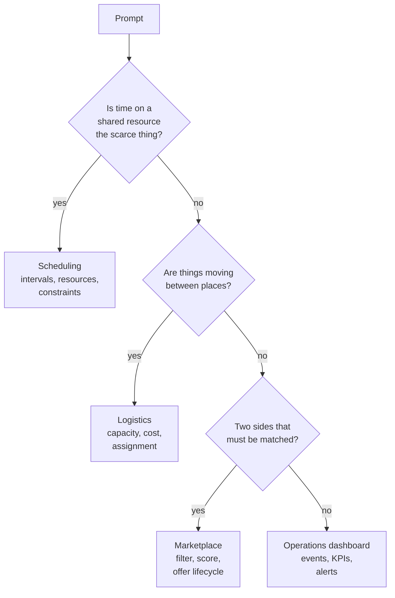
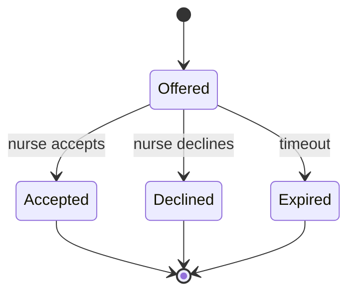

# Worked Decomposition Prompts: Scheduling, Logistics, Marketplace, Operations Dashboard

!!! abstract "Key takeaways"
    - Most decomposition prompts fall into a few **archetypes**: **scheduling** (time intervals plus resources plus constraints), **logistics** (things moving, capacity, cost), **marketplace** (two sides, matching, a lifecycle) and **operations dashboard** (events in, KPIs out). Recognise the archetype in the first minute and you know the core objects.
    - Each archetype has one **core algorithm or rule** that carries the decision: interval overlap, greedy assignment under capacity, filter-then-score matching, metrics over an event log. Build that first; it's the Must.
    - Each also has a **natural seam**: constraints as a list of functions (scheduling), a cost function (logistics), a scoring function plus a state machine (marketplace), KPI definitions as data (dashboard). Interviewer twists almost always land on that seam.
    - Hard constraints **filter**; soft preferences **score**. Mixing them is the most common modelling bug in matching and scheduling prompts.
    - Drill one archetype a day against a 45-minute timer: frame in 5–8 minutes, skeleton by minute 15, core rule by 35, twist by 50.

## Why it matters

Candidate reports for Palantir-style decomposition rounds mention prompts like a parking garage system, a chess game, a social graph with recommendations, disease spread through a network, and city-scale problems such as 911 response times. Exponent's FDE course uses "improve traffic in NYC" and "sync two employee record systems" as mock prompts. The surface varies but the shapes repeat: work one of each archetype end to end and a new prompt becomes a variation, not a blank page. These lists come from prep sites and candidate reports, so treat them as examples.

Each worked example below follows the same steps from the earlier pages: [frame with U-D-D-C-S](01-framework-for-ambiguous-prompts-users-decisions-data-constra.md), [model the objects](02-from-vague-business-goal-to-data-and-object-model.md), [build a skeleton with seams](03-decomposing-into-a-working-extensible-mvp-in-a-live-pairing.md), and [cut scope deliberately](04-prioritisation-trade-off-calls-and-cutting-scope-under-time.md).

## Core concepts

### Recognise the archetype


*Notice that real prompts often combine archetypes (a delivery marketplace is logistics plus marketplace). Pick the one that holds the primary decision for v1 and name the other as a later slice.*

| Archetype | Core objects | Core rule | Natural seam | Typical twist |
|---|---|---|---|---|
| Scheduling | Resource, Slot or Appointment, Constraint | Half-open interval overlap | List of constraint functions | New constraint (breaks, room equipment, priority patients) |
| Logistics | Order, Vehicle, Location, Route | Greedy assignment under capacity | Cost function | Time windows, cold chain, priorities |
| Marketplace | Supply, Demand, Match/Offer | Filter hard constraints, then score | Scoring function and offer state machine | Fairness, cancellations, surge |
| Ops dashboard | Event, Entity, KPI, Alert | Durations and counts over an event log | KPI registry | New KPI, per-team breakdown, alert thresholds |

### Hard constraints filter, soft preferences score

A **hard constraint** makes an option invalid (nurse lacks ICU skill, van over capacity, room double-booked). A **soft preference** makes a valid option better or worse (same zone, higher rating, shorter distance). Filter first, then rank what's left. Putting a hard constraint into a score (a big negative weight) means it can be outweighed, which is how systems end up sending an unqualified nurse to an ICU shift.

## In practice: code & configuration

The most common bug across scheduling, logistics windows and dashboards is **interval logic**. Get it right once and reuse it.

=== "❌ Common mistake"
    ```python
    # Slots as strings, overlap by equality, back-to-back treated as a clash.
    booked = {"DrRao": ["09:00", "09:30"]}

    def is_free(doctor, start):           # ignores duration entirely
        return start not in booked[doctor]

    def overlaps(a_start, a_end, b_start, b_end):
        return a_start <= b_end and b_start <= a_end   # closed intervals: 9:00-9:30 clashes with 9:30-10:00

    print(is_free("DrRao", "09:15"))      # True, but a 30-minute slot at 9:15 clashes with 9:00-9:30
    ```

=== "✅ Correct approach"
    ```python
    from datetime import datetime

    def overlaps(a_start: datetime, a_end: datetime, b_start: datetime, b_end: datetime) -> bool:
        # Half-open intervals [start, end): back-to-back bookings do not clash
        return a_start < b_end and b_start < a_end

    d = lambda h, m: datetime(2026, 10, 12, h, m)
    assert overlaps(d(9, 0), d(9, 30), d(9, 15), d(9, 45))       # real clash
    assert not overlaps(d(9, 0), d(9, 30), d(9, 30), d(10, 0))   # back-to-back is fine
    ```

### Prompt 1: Scheduling. "Our clinics waste capacity and patients wait weeks."

**Frame (U-D-D-C-S)**

| Lens | v1 answer |
|---|---|
| Users | Front-desk scheduler (primary); clinicians; patients (later, self-booking) |
| Decision | Which slot to offer a patient, in real time on the phone |
| Data | Clinician rosters, rooms, existing appointments, appointment types and durations |
| Constraints | Clinician and room can't double-book; clinic hours; some appointment types need specific rooms |
| Success | Median days to next available appointment; guardrail: clinician overtime not up |

**Model:** Clinician, Room, Patient, Appointment. Constraints are functions that return a reason when broken, so new rules are additive and the scheduler can say *why* a slot is unavailable.

```python
"""Scheduling: clinic appointments with pluggable constraints."""
from dataclasses import dataclass
from datetime import datetime, timedelta
from typing import Callable

@dataclass(frozen=True)
class Appointment:
    appt_id: str
    clinician_id: str
    room_id: str
    patient_id: str
    start: datetime
    end: datetime

def overlaps(a: Appointment, b: Appointment) -> bool:
    return a.start < b.end and b.start < a.end      # half-open intervals: back-to-back is fine

# A constraint returns a reason string if the new appointment breaks it, else None
Constraint = Callable[[Appointment, list[Appointment]], str | None]

def clinician_free(new: Appointment, booked: list[Appointment]) -> str | None:
    clash = next((b for b in booked if b.clinician_id == new.clinician_id and overlaps(b, new)), None)
    return f"clinician busy with {clash.appt_id}" if clash else None

def room_free(new: Appointment, booked: list[Appointment]) -> str | None:
    clash = next((b for b in booked if b.room_id == new.room_id and overlaps(b, new)), None)
    return f"room busy with {clash.appt_id}" if clash else None

def within_hours(open_h: int = 9, close_h: int = 17) -> Constraint:
    def check(new: Appointment, _: list[Appointment]) -> str | None:
        ok = new.start.hour >= open_h and (new.end.hour, new.end.minute) <= (close_h, 0)
        return None if ok else "outside clinic hours"
    return check

class Schedule:
    def __init__(self, constraints: list[Constraint]) -> None:
        self.constraints, self.booked = constraints, []

    def book(self, appt: Appointment) -> list[str]:
        problems = [r for c in self.constraints if (r := c(appt, self.booked))]
        if not problems:
            self.booked.append(appt)
        return problems                                  # empty list = booked

    def free_slots(self, clinician_id: str, room_id: str, day: datetime, minutes: int = 30) -> list[datetime]:
        slots, t = [], day.replace(hour=9, minute=0)
        while t + timedelta(minutes=minutes) <= day.replace(hour=17, minute=0):
            probe = Appointment("probe", clinician_id, room_id, "-", t, t + timedelta(minutes=minutes))
            if not any(c(probe, self.booked) for c in self.constraints):
                slots.append(t)
            t += timedelta(minutes=minutes)
        return slots

if __name__ == "__main__":
    d = datetime(2026, 10, 12)
    at = lambda h, m: d.replace(hour=h, minute=m)
    s = Schedule([clinician_free, room_free, within_hours()])
    print(s.book(Appointment("A1", "DrRao", "R1", "P1", at(9, 0), at(9, 30))))    # []
    print(s.book(Appointment("A2", "DrRao", "R2", "P2", at(9, 15), at(9, 45))))   # ['clinician busy with A1']
    print(s.book(Appointment("A3", "DrShah", "R1", "P3", at(9, 30), at(10, 0))))  # [] (back-to-back room use)
    print(len(s.free_slots("DrRao", "R1", d)))                                    # 14
```

**Twists and where they land**

- *"Clinicians need a lunch break."* A new constraint function. Nothing else changes.
- *"Urgent patients must be seen within 48 hours."* A priority on the request and a search that returns the earliest slot; maybe hold back a few slots per day for urgent cases (a capacity policy).
- *"No-shows waste 15% of slots."* A NoShowRisk score per appointment and an overbooking policy, behind its own seam. Mention the ethical guardrail (don't systematically disadvantage some patient groups).
- *Scale:* index bookings by resource and day; concurrent booking needs a transaction or a database constraint (see [isolation levels](../postgresql-sql/03-transactions-acid-and-isolation-levels.md)).

### Prompt 2: Logistics. "Our deliveries are late and vans run half empty."

**Frame**

| Lens | v1 answer |
|---|---|
| Users | Depot dispatcher (primary); drivers; customers (ETA notifications later) |
| Decision | Which van takes which orders each morning |
| Data | Orders with location, weight, priority; vans with capacity; depot location |
| Constraints | Capacity is hard; urgent and cold-chain orders first; drivers' shift length |
| Success | On-time delivery rate; guardrail: vans used per day |

**Model:** Order, Van, Location, and an assignment (the van's stop list). The cost function is the seam: Manhattan distance now, a road-network or time-window-aware cost later.

```python
"""Logistics: assign delivery orders to vans, respecting capacity, with a pluggable cost."""
from dataclasses import dataclass, field
from typing import Callable

@dataclass(frozen=True)
class Order:
    order_id: str
    x: float
    y: float
    kg: float
    priority: int = 0                 # 1 = cold-chain / urgent

@dataclass
class Van:
    van_id: str
    capacity_kg: float
    x: float = 0.0                    # current position (depot at 0,0)
    y: float = 0.0
    load_kg: float = 0.0
    stops: list[str] = field(default_factory=list)

Cost = Callable[[Van, Order], float]

def distance_cost(van: Van, o: Order) -> float:
    return abs(van.x - o.x) + abs(van.y - o.y)          # Manhattan distance: good enough for v1

def assign(orders: list[Order], vans: list[Van], cost: Cost = distance_cost) -> list[str]:
    unassigned = []
    for o in sorted(orders, key=lambda o: -o.priority):  # urgent orders choose first
        fits = [v for v in vans if v.load_kg + o.kg <= v.capacity_kg]
        if not fits:
            unassigned.append(o.order_id)               # surfaced, never silently dropped
            continue
        v = min(fits, key=lambda v: cost(v, o))
        v.stops.append(o.order_id)
        v.load_kg += o.kg
        v.x, v.y = o.x, o.y                             # greedy: the van "moves" to its last stop
    return unassigned

if __name__ == "__main__":
    vans = [Van("V1", 100), Van("V2", 60)]
    orders = [Order("O1", 2, 3, 40), Order("O2", 8, 1, 30, priority=1),
              Order("O3", 3, 3, 50), Order("O4", 9, 2, 45)]
    print(assign(orders, vans))                         # ['O4']
    print({v.van_id: v.stops for v in vans})            # {'V1': ['O2', 'O3'], 'V2': ['O1']}
```

Say the trade-off: greedy is explainable and fast but not optimal (vehicle routing is NP-hard; production uses heuristics or solvers). The unassigned list is a feature: the dispatcher must see what didn't fit.

**Twists**

- *"Customers have delivery windows."* Orders gain `window_start` and `window_end`; the cost function penalises or the filter rejects stops that would arrive outside the window. That is the half-open interval logic from scheduling again.
- *"Cold-chain vans only."* `Van.refrigerated`, and a hard filter for cold-chain orders (filter, not score).
- *"Re-plan when a van breaks down."* Re-run `assign` on its remaining stops against the other vans' spare capacity.

### Prompt 3: Marketplace. "Hospitals can't fill last-minute nursing shifts."

**Frame**

| Lens | v1 answer |
|---|---|
| Users | Staffing coordinator posting shifts (primary); nurses accepting offers |
| Decision | Which nurses to offer an open shift to, in what order |
| Data | Shifts (skill, ward, zone, date); nurses (skills, zone, rating, availability) |
| Constraints | Skills and availability are hard; labour rules on hours; fairness of offers |
| Success | Fill rate within 24 hours of posting; guardrail: offers per nurse per week (no spamming) |

**Model:** Nurse, Shift, Offer (the match, with a lifecycle). The scoring function and the offer state machine are the seams.


*Notice that the Offer, not the Shift, carries the lifecycle. One shift can have many offers; the first acceptance wins and the others must be withdrawn, which is the concurrency question an interviewer will probe.*

```python
"""Marketplace: match open hospital shifts to available nurses, with an explainable score."""
from dataclasses import dataclass
from enum import Enum

class OfferState(Enum):
    OFFERED = "offered"
    ACCEPTED = "accepted"
    DECLINED = "declined"
    EXPIRED = "expired"

@dataclass(frozen=True)
class Nurse:
    nurse_id: str
    skills: frozenset[str]
    home_zone: str
    rating: float                      # 0..5

@dataclass(frozen=True)
class Shift:
    shift_id: str
    required_skill: str
    zone: str
    day: str

def score(n: Nurse, s: Shift) -> tuple[float, list[str]] | None:
    if s.required_skill not in n.skills:
        return None                    # hard constraint: filter, don't score
    reasons, total = [], n.rating
    reasons.append(f"rating {n.rating}")
    if n.home_zone == s.zone:
        total += 2
        reasons.append("same zone +2")
    return total, reasons

def rank(shift: Shift, nurses: list[Nurse], busy_on: dict[str, set[str]]) -> list[tuple[str, float, list[str]]]:
    out = []
    for n in nurses:
        if shift.day in busy_on.get(n.nurse_id, set()):
            continue                   # availability is another hard constraint
        r = score(n, shift)
        if r:
            out.append((n.nurse_id, r[0], r[1]))
    return sorted(out, key=lambda t: -t[1])

# Offer lifecycle: one place that knows the legal transitions
TRANSITIONS = {OfferState.OFFERED: {OfferState.ACCEPTED, OfferState.DECLINED, OfferState.EXPIRED}}

def transition(state: OfferState, to: OfferState) -> OfferState:
    if to not in TRANSITIONS.get(state, set()):
        raise ValueError(f"{state.value} -> {to.value} not allowed")
    return to

if __name__ == "__main__":
    nurses = [Nurse("N1", frozenset({"icu", "er"}), "east", 4.5),
              Nurse("N2", frozenset({"icu"}), "west", 4.9),
              Nurse("N3", frozenset({"peds"}), "east", 5.0)]
    shift = Shift("S1", "icu", "east", "2026-10-12")
    print(rank(shift, nurses, busy_on={"N2": set()}))
    # [('N1', 6.5, ['rating 4.5', 'same zone +2']), ('N2', 4.9, ['rating 4.9'])]
    print(transition(OfferState.OFFERED, OfferState.ACCEPTED))   # OfferState.ACCEPTED
```

**Twists**

- *"Two nurses accept at the same moment."* Accepting must be atomic per shift: a conditional update (`UPDATE shift SET filled_by = ? WHERE id = ? AND filled_by IS NULL`) or a unique constraint, and the loser sees "already filled". See [idempotency](../distributed-systems/04-idempotency-and-idempotency-keys.md) for retries of the accept call.
- *"Top-rated nurses get every offer; others leave the platform."* Add a fairness term (offers received this week) to the score; the guardrail metric was there for this.
- *"Surge: 50 shifts open after a local emergency."* Batch matching across shifts instead of one at a time, which turns it into an assignment problem; greedy by shift urgency is the v1.

### Prompt 4: Operations dashboard. "Leadership has no idea how the support operation is doing."

**Frame**

| Lens | v1 answer |
|---|---|
| Users | Operations lead in a daily stand-up (primary); team leads; executives (weekly roll-up) |
| Decision | Where to move people today: which team or queue is breaching |
| Data | Ticket events (opened, assigned, resolved) with timestamps and team |
| Constraints | Read-only access to the ticketing system; data arrives as an hourly export |
| Success | Breaches spotted before customers escalate; guardrail: dashboard trusted (numbers match the source) |

**Model:** one append-only Event log is the source; tickets are rebuilt from events; KPIs are **definitions as data** (name, computation, target, direction), so adding a KPI is one line and every KPI is documented in code.

```python
"""Operations dashboard: KPIs defined as data over one event log."""
from dataclasses import dataclass
from datetime import datetime
from statistics import median
from typing import Callable

@dataclass(frozen=True)
class Event:
    ticket_id: str
    kind: str            # "opened" | "assigned" | "resolved"
    at: datetime
    team: str

def durations(events: list[Event], start: str, end: str) -> list[float]:
    starts = {e.ticket_id: e.at for e in events if e.kind == start}
    return [(e.at - starts[e.ticket_id]).total_seconds() / 3600
            for e in events if e.kind == end and e.ticket_id in starts]

@dataclass(frozen=True)
class Kpi:
    name: str
    compute: Callable[[list[Event]], float]
    target: float
    higher_is_better: bool = False

    def status(self, events: list[Event]) -> str:
        v = self.compute(events)
        ok = v >= self.target if self.higher_is_better else v <= self.target
        return f"{self.name}: {v:.1f} (target {self.target}) {'OK' if ok else 'BREACH'}"

KPIS = [   # adding a KPI is one line, not a new endpoint
    Kpi("median hours to assign", lambda ev: median(durations(ev, "opened", "assigned")), 1.0),
    Kpi("median hours to resolve", lambda ev: median(durations(ev, "opened", "resolved")), 8.0),
    Kpi("open tickets", lambda ev: len({e.ticket_id for e in ev if e.kind == "opened"})
                                  - len({e.ticket_id for e in ev if e.kind == "resolved"}), 5),
]

if __name__ == "__main__":
    t = lambda h: datetime(2026, 10, 12, h)
    log = [Event("T1", "opened", t(8), "ops"), Event("T1", "assigned", t(9), "ops"), Event("T1", "resolved", t(12), "ops"),
           Event("T2", "opened", t(9), "ops"), Event("T2", "assigned", t(12), "ops"),
           Event("T3", "opened", t(10), "it"), Event("T3", "assigned", t(10), "it"), Event("T3", "resolved", t(20), "it")]
    for k in KPIS:
        print(k.status(log))
    # median hours to assign: 1.0 (target 1.0) OK
    # median hours to resolve: 7.0 (target 8.0) OK
    # open tickets: 1.0 (target 5) OK
```

Point out what the code deliberately ignores: unresolved tickets are excluded from "time to resolve", which flatters the number (survivorship bias). A senior answer names it and adds "age of oldest open ticket" as a companion KPI.

**Twists**

- *"Break it down by team."* Filter events by team before computing; the KPI definitions don't change.
- *"Alert when a KPI breaches."* An Alert object created when `status` flips to BREACH, with de-duplication so one breach doesn't page every hour.
- *"Executives want a weekly trend."* Bucket events by week; at volume, precompute daily aggregates instead of scanning raw events. The [observability](../observability/index.md) topic covers similar SLI design.

## Real-world usage

- **Scheduling** in healthcare is constraint-heavy (room equipment, credentials, preferences); commercial schedulers use constraint solvers, and the rule-list v1 is how you explain the problem before reaching for one.
- **Logistics:** capacitated routing with time windows is a standard operations research problem; Google OR-Tools ships routing solvers. Greedy plus a named solver as the next step is the expected interview level.
- **Marketplaces** (ride-hailing, staffing, freelance) separate eligibility from ranking and model the offer lifecycle, because cancellations and double acceptance are where money and trust are lost.
- **Operations dashboards** fail when numbers don't match the source or teams define KPIs differently; KPI definitions in code, tested on a known sample, address both.

## Trade-offs & production gotchas

| Prompt | v1 choice | Alternative | Switch when |
|---|---|---|---|
| Scheduling | Scan bookings per resource | Interval index or DB constraints | Many resources, concurrent bookers |
| Logistics | Greedy by priority and distance | Routing solver (OR-Tools) | Many stops, time windows, cost pressure |
| Marketplace | Rank and offer one by one | Batch assignment across shifts | Surges, many open shifts at once |
| Dashboard | Compute on request from events | Pre-aggregated daily tables | Large event volume, slow queries |

!!! warning "Gotchas"
    - **Closed intervals** create false clashes for back-to-back bookings. Use half-open `[start, end)`.
    - **Hard constraints in scores** can be outweighed. Filter first.
    - **Silent drops:** orders that don't fit and shifts nobody can take must be shown to the user.
    - **Survivorship bias** in dashboard metrics: excluding open items flatters resolution times.

## How this connects to my experience

- **Where it applies:** not a resume claim as interview prompts. The healthcare context of OptumRx Meteor (pharmacy, 750K+ users) and Deloitte ConvergeHealth gives domain vocabulary for scheduling and operations prompts in health settings.
- **Talking points:**
    - The ops-dashboard pattern (events in, KPIs out) relates to "Designed Kafka-based event-driven workflows with retry and DLQ handling": the same events that drive workflows can feed operational metrics. *[confirm: whether Meteor had operational dashboards built from Kafka events]*
    - "Developed event-driven healthcare analytics workflows" at Deloitte is the closest real example of computing metrics from event data. *[confirm: what metrics those workflows produced]*
    - AWS Personalize integration at Deloitte is a ranking problem, useful when discussing marketplace scoring (filter, then rank). *[confirm: what was being recommended]*
- **Likely follow-up chain:** "Have you built anything like this?" → "What was the hardest constraint?" → "How did you validate it?" Bridge honestly to the closest real system and then return to the model you built in the round.

## Interview questions

### Fundamentals

??? question "Q1. How do you recognise which archetype a prompt belongs to?"
    **Answer:** Ask what's scarce and what decision is made: time on shared resources (scheduling), moving things with capacity (logistics), two sides to match (marketplace), or understanding performance from events (dashboard). Many prompts combine them; pick the archetype that holds the v1 decision and say the other is a later slice.

    **Interviewer listens for:** fast structure and an explicit v1 choice.

    **Common wrong answer:** treating every prompt as a CRUD app.

??? question "Q2. How do you check whether two appointments overlap?"
    **Answer:** With half-open intervals: `a.start < b.end and b.start < a.end`. Back-to-back bookings (one ends at 9:30, the next starts at 9:30) don't clash. Compare per resource (clinician, room).

    **Interviewer listens for:** the half-open convention and per-resource checks.

    **Common wrong answer:** `<=` comparisons or checking only start times.

??? question "Q3. Hard constraints vs soft preferences: how do you model each?"
    **Answer:** Hard constraints filter candidates out (skills, capacity, availability). Soft preferences score the remaining candidates (distance, rating, same zone), ideally with reasons. Never encode a hard constraint as a large negative weight, because enough positive weight can outvote it.

    **Interviewer listens for:** filter then rank.

    **Common wrong answer:** one big weighted score for everything.

### Intermediate

??? question "Q4. Why use greedy assignment for the logistics MVP?"
    **Answer:** It's simple, fast, explainable to dispatchers and good enough at small scale with a human checking. Vehicle routing is NP-hard; optimal methods take time to build. State the cost (locally good choices can block better global ones) and the upgrade path (a routing solver behind the same function).

    **Interviewer listens for:** the trade-off and upgrade path.

    **Common wrong answer:** trying to write an optimal solver live.

??? question "Q5. Why does the offer, not the shift, carry the lifecycle in a marketplace?"
    **Answer:** A shift can receive many offers, each with its own state (offered, accepted, declined, expired) and timestamps. Modelling Offer separately enables metrics (time to accept, decline reasons), fairness tracking and correct handling of several outstanding offers.

    **Interviewer listens for:** reifying the match.

    **Common wrong answer:** a `status` field on Shift.

??? question "Q6. How do you make dashboard KPIs extensible and trustworthy?"
    **Answer:** Define KPIs as data (name, computation, target, direction) over one event log, so adding a KPI is one entry. Test each definition on a known sample, reconcile counts with the source system, and document edge-case rules (what counts as resolved, how reopened tickets are treated).

    **Interviewer listens for:** definitions in code and reconciliation.

    **Common wrong answer:** hand-written SQL per chart with no tests.

??? question "Q7. What is survivorship bias in an operations metric?"
    **Answer:** Computing a metric only over items that finished (resolved tickets) ignores the ones still open, which are often the slowest. "Median time to resolve" looks good while a backlog grows. Pair it with age of oldest open item or open count.

    **Interviewer listens for:** naming the bias and a companion metric.

    **Common wrong answer:** not noticing.

### Senior

??? question "Q8. Two nurses accept the same shift at the same moment. How do you handle it?"
    **Answer:** Make acceptance atomic per shift: a conditional update that only succeeds if the shift is still unfilled, or a unique constraint on the filled shift. The loser gets a clear "already filled" response; other outstanding offers are withdrawn. Make the accept endpoint idempotent so client retries don't double-process.

    **Interviewer listens for:** atomic conditional update and idempotency.

    **Common wrong answer:** "Check if it's free, then update" in two steps.

??? question "Q9. How does the scheduling model change at hospital-network scale?"
    **Answer:** Index bookings by resource and day; enforce no-double-booking in the database (exclusion or unique constraints, or row locks per resource-slot) because many schedulers book concurrently; cache free-slot searches briefly; keep constraints as composable rules but consider a constraint solver for optimisation (minimise idle time) rather than just validity.

    **Interviewer listens for:** concurrency control and when to use a solver.

    **Common wrong answer:** "Add more servers."

??? question "Q10. How would you add 'fairness' to the marketplace?"
    **Answer:** Define it first with the customer (equal offer opportunities among qualified nurses, or caps per week), add a term to the score or a hard cap, and track a guardrail metric (distribution of offers per nurse). Make the policy explicit and reviewable because fairness choices affect people's income.

    **Interviewer listens for:** defining fairness and measuring it.

    **Common wrong answer:** "Randomise the order."

### Scenario-based

??? question "Q11. Prompt: 'A food bank wants to get more food to families.' Decompose it in two minutes."
    **Answer:** Users: warehouse coordinator, volunteer drivers, partner pantries. Decisions: which pantry gets which donations (daily), which driver takes which route (daily). Data: inventory with expiry, pantry demand, driver availability. Constraints: perishables expire, volunteers' hours are limited, refrigeration. Success: kg delivered before expiry per week; guardrail: waste. Archetype: logistics with a scheduling flavour. v1: allocate expiring stock to pantries by demand, greedy, with a stop list per driver.

    **Interviewer listens for:** archetype recognition and a metric that reflects the mission.

    **Common wrong answer:** "Build an app for donors."

??? question "Q12. In the logistics prompt, the interviewer says 'customers want two-hour delivery windows'. What changes?"
    **Answer:** Orders get a window; the van's running clock (departure plus travel and service time) decides whether a stop arrives inside it. Make the window a hard filter for strict customers or a penalty in the cost for soft ones. The `assign` loop and capacity check stay; the cost function and a time estimate change. Note that windows make greedy noticeably worse, which strengthens the case for a solver later.

    **Interviewer listens for:** reuse of interval logic and the cost seam.

    **Common wrong answer:** rewriting the whole assignment algorithm.

??? question "Q13. In the dashboard prompt, team leads say the numbers are wrong. What do you do?"
    **Answer:** Treat trust as the guardrail metric. Pick a few tickets and trace them from source to KPI, compare counts with the ticketing system for the same window, check definitions (reopened tickets, time zones, export lag), fix and document the rule in the KPI definition, and add a reconciliation check that runs with each refresh.

    **Interviewer listens for:** reconciliation and explicit definitions.

    **Common wrong answer:** "The code is correct; they must be wrong."

## Cheat sheet

| Archetype | Core rule | Seam | First twist to expect |
|---|---|---|---|
| Scheduling | `a.start < b.end and b.start < a.end` | Constraint functions | Breaks, priorities, no-shows |
| Logistics | Greedy by priority, capacity filter | Cost function | Time windows, cold chain |
| Marketplace | Filter hard, score soft, offer lifecycle | Score and state machine | Double acceptance, fairness |
| Dashboard | Durations and counts over events | KPI registry | Per-team, alerts, trends |
| All | Show what didn't fit; explain recommendations | | Concurrency and scale |

## Sources
1. [Exponent: Palantir FDE interview guide](https://www.tryexponent.com/guides/palantir-forward-deployed-engineer-interview): reported prompt types and the running-model expectation (prep site, candidate reports).
2. [Exponent: Decomposition course](https://www.tryexponent.com/courses/decomposition): mock prompts such as improving NYC traffic and syncing employee record systems.
3. [Exponent: How to answer decomposition interview questions (2026)](https://www.tryexponent.com/blog/how-to-answer-decomposition-interview-questions-the-definitive-guide-2026) and [techinterview.org: Inside the Palantir engineering interview loop](https://www.techinterview.org/post/3233476805/palantir-interview-process/): reported prompts such as a chess game, a parking garage, a social graph, infection spread and 911 response times (prep sites, candidate reports).
4. [Google OR-Tools: Vehicle routing](https://developers.google.com/optimization/routing): capacity and time-window routing solvers.
5. [PostgreSQL docs: Exclusion constraints](https://www.postgresql.org/docs/current/ddl-constraints.html#DDL-CONSTRAINTS-EXCLUSION): preventing overlapping bookings in the database.
6. [Python docs: statistics](https://docs.python.org/3/library/statistics.html) and [datetime](https://docs.python.org/3/library/datetime.html): median and interval arithmetic used in the examples.
7. Martin Kleppmann, *Designing Data-Intensive Applications*: derived data and the log as the source of truth.
