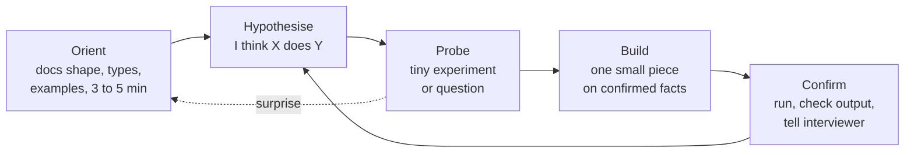
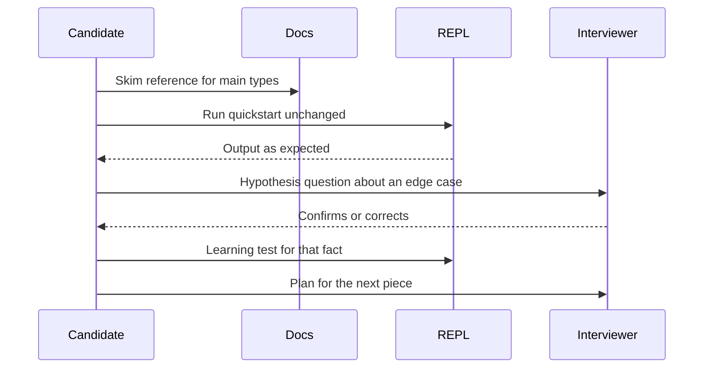

# The Learning Round: Picking Up an Unfamiliar API, Language or Library Fast

!!! abstract "Key takeaways"
    - The learning round gives you **something you don't know** (a library, an API with docs, a small unfamiliar codebase, a concept) and asks you to use it to solve a problem in about an hour. It scores **how fast you build a working mental model**, not what you already knew.
    - Use a loop: **Orient** (shape of the docs and API, 3–5 minutes) → **Hypothesise** → **Probe** with tiny experiments → **Build** one small piece → **Confirm** → repeat. Never write 50 lines on a guess.
    - **Treat the interviewer as the documentation.** Ask precise, hypothesis-shaped questions ("I read that `next_cursor` is null on the last page. Is an empty `data` list also possible?"). Silence and guessing are the failure modes prep sites report most.
    - Write **learning tests**: small asserts that pin what the library actually does. They catch surprises (`itertools.groupby` only groups consecutive keys) before they become bugs.
    - Map the new thing onto what you know (Java to Python, REST to this SDK) **and say where the analogy breaks**. That is the senior signal.

## Why it matters

Prep sites describe a recurring Palantir round, usually called **Learning** (some reports call a related format **Re-engineering**), in which candidates get an unfamiliar concept, library, codebase or API and must use it to solve a problem, typically in a one-hour pairing session. Reports describe the signal as how quickly you build a working mental model from limited material, whether you read carefully and ask precise questions, and how you use the interviewer, who effectively acts as your documentation. Palantir says its interview format is tailored to the candidate and role and doesn't publish a fixed format, so treat these details as candidate-reported and confirm with your recruiter.

The round exists because it is the job. A forward deployed engineer lands in a customer environment with their stack: a proprietary ERP API, an old SOAP service, a data platform you have never used, a language the team chose years ago. FDE job descriptions ask for Python and TypeScript and comfort deploying into whatever the customer runs. The engineer who can read unfamiliar docs and get one call working by lunch is the one customers trust.

## Core concepts

### The learning loop


*Notice that building only happens on confirmed facts. A surprise sends you back to orienting, which is cheap; building on a wrong assumption is expensive.*

### Step 1: Orient (3–5 minutes, out loud)

Don't read docs top to bottom. Find their **shape**. The Diátaxis framework (Daniele Procida) splits documentation into four kinds; knowing which you're looking at tells you how to use it:

| Doc type | Purpose | Use it in the round to |
|---|---|---|
| Tutorial | Learning by doing, step by step | Get the first call working |
| How-to guide | Solve a specific task | Copy the closest recipe to your problem |
| Reference | Exact facts: signatures, fields, errors | Check parameters, return types, edge cases |
| Explanation | Concepts and why | Build the mental model (lifecycles, consistency, auth) |

Orientation checklist:

- **Nouns and verbs:** what are the main types or resources, and what operations exist? (This is [ontology thinking](02-from-vague-business-goal-to-data-and-object-model.md) applied to the library.)
- **Entry point:** how do I create a client, connect, or call the first function?
- **One example:** find the smallest working example and run it unchanged first.
- **Contracts:** inputs, outputs, errors, nulls, ordering, mutability.
- **For an HTTP API:** auth, pagination, rate limits, error format, idempotency, versioning. These six cause most integration bugs (see [pagination](../api-design/03-pagination-filtering-and-sorting.md) and [idempotency keys](../api-design/05-idempotency-keys-and-safe-retries.md)).

Say what you're doing: "I'm skimming the reference for the main types first, then I'll run the quickstart example as is."

### Step 2–3: Hypothesise and probe

Turn each uncertainty into a **hypothesis** and test it in the cheapest way:

1. **Run it** (REPL, a 3-line script): fastest and most reliable.
2. **Read the reference** for that one function.
3. **Ask the interviewer** a specific question.
4. **Read the source** (for a small library or codebase).

In Python, introspection is built in: `help(obj)`, `dir(obj)`, `type(x)`, `inspect.signature(fn)`, and `inspect.getsource(fn)` for pure-Python code. In Java, IDE completion and Javadoc do the same job; `jshell` (since Java 9) gives a REPL.

### Using the interviewer well


*Notice that the questions to the interviewer are specific and come after reading. The interviewer is a resource for things the docs don't answer quickly, not a substitute for reading.*

| Weak question | Strong question |
|---|---|
| "How does this work?" | "The doc says `fetch` returns a list. Is it ever `None` when there are no results?" |
| "What should I do?" | "I'm planning to page with the cursor until it's null, then filter late shipments. Does that match what you want?" |
| (silence for 4 minutes) | "I'm reading the error section because I want to know what a rate limit looks like." |

Prep guides consistently say interviewers here prefer early questions to silent struggle; long silences read as being stuck even when you're thinking.

### Reading an unfamiliar codebase (the re-engineering variant)

If you're given 200–500 lines of someone else's code:

1. **Run it** and the tests, if any. Behaviour first, code second.
2. **Find the entry point** (`main`, the HTTP handler, the public function) and **trace one request** end to end.
3. **Read the tests** as documentation of intent.
4. **Name the concepts** you find in a comment block (objects, flows, invariants).
5. **Change one small thing** and run it, to prove your model is right before the real task.

[Practical coding for FDE](../fde-practical-coding/index.md) covers refactoring and debugging unfamiliar code in more depth.

### Picking up a language: map, then mind the gaps

Transfer what you know, then name where it breaks. For a Java engineer moving to Python (common because many FDE teams use Python):

| Java habit | Python equivalent | Where the analogy breaks |
|---|---|---|
| `record Point(int x, int y)` | `@dataclass(frozen=True) class Point` | Type hints aren't enforced at runtime |
| `interface Policy` | `typing.Protocol` (structural) or `abc.ABC` | Protocols match by shape; no `implements` needed |
| `Optional<T>` | `Optional[T]`, or the PEP 604 union of `T` and `None` | Nothing forces you to check for `None` |
| `PriorityQueue` | `heapq` on a list | Functions over a list, not a class; min-heap only |
| `stream().collect(groupingBy(...))` | `defaultdict(list)` loop, or `itertools.groupby` | `groupby` groups only **consecutive** equal keys |
| `int` division `7 / 2 == 3` | `7 // 2 == 3`; `7 / 2 == 3.5` | `/` is always float division |
| `equals` / `hashCode` | `__eq__` / `__hash__` (dataclass generates) | Mutable dataclasses are unhashable by default |
| Default parameter values: none | `def f(x, items=[])` | Mutable defaults are shared across calls; use `None` |
| Checked exceptions | All exceptions unchecked | Read docs for what can raise |

The [Python topic](../python/index.md) and [core Java](../core-java/index.md) pages go deeper on each side.

## In practice: code & configuration

### Learning tests: pin down what the library actually does

Clean Code's chapter on boundaries describes **learning tests** (credited to Jim Newkirk): small tests you write to explore a third-party API, which then keep verifying your understanding when the library is upgraded. In a learning round they're also visible proof of how you learn.

=== "❌ Common mistake"
    ```python
    # Assume groupby works like SQL GROUP BY, and build the feature on that guess.
    from itertools import groupby

    rows = [("icu", 1), ("er", 2), ("icu", 3)]
    by_ward = {k: [v for _, v in g] for k, g in groupby(rows, key=lambda r: r[0])}
    print(by_ward)   # {'icu': [3], 'er': [2]}  <- the first icu row silently vanished
    # 20 minutes later: "why are the ICU numbers wrong?"
    ```

=== "✅ Correct approach"
    ```python
    """Learning tests: pin down what an unfamiliar library ACTUALLY does before building on it."""
    import heapq
    import inspect
    from itertools import groupby

    # 1. Orient: what is the shape of this API?
    print(inspect.signature(groupby))              # (iterable, key=None)
    print([n for n in dir(heapq) if not n.startswith("_")][:6])   # e.g. ['heapify', 'heappop', 'heappush', ...]

    # 2. Hypothesis -> tiny experiment -> assert. Each assert is a fact I now rely on.
    rows = [("icu", 1), ("er", 2), ("icu", 3)]
    naive = {k: [v for _, v in g] for k, g in groupby(rows, key=lambda r: r[0])}
    assert naive == {"icu": [3], "er": [2]}         # surprise: groupby only groups CONSECUTIVE keys
    fixed = {k: [v for _, v in g] for k, g in groupby(sorted(rows), key=lambda r: r[0])}
    assert fixed == {"er": [2], "icu": [1, 3]}      # documented: sort by the same key first

    h = []
    for priority, task in [(3, "low"), (1, "urgent"), (2, "normal")]:
        heapq.heappush(h, (priority, task))
    assert heapq.heappop(h) == (1, "urgent")        # min-heap: smallest first (Java's PriorityQueue is too)
    assert heapq.nlargest(1, [5, 9, 2]) == [9]      # for max, use nlargest or negate the key

    print("all learning tests passed")
    ```

The Python docs say this about `groupby` directly: it generates a new group every time the key value changes, so the input generally needs to be sorted on the same key. Reading the reference for the one function you depend on is a two-minute habit that prevents a 20-minute bug.

### Building against an unfamiliar documented API

A typical learning-round task: "Here are the docs for our shipments API. Find the late shipments." You can't call a real service in the sandbox, so fake the endpoint from the docs, then write the client against the documented contract.

```python
"""Building against an unfamiliar (documented) API: a cursor-paginated endpoint, faked locally."""
from typing import Iterator

# Pretend these are the docs the interviewer handed over:
#   GET /v1/shipments?limit=N&cursor=C -> {"data": [...], "next_cursor": str | null}
#   Rate limit: 429 with Retry-After seconds.
FAKE = [{"id": f"S{i}", "status": "late" if i % 3 == 0 else "on_time"} for i in range(1, 8)]

def fake_get(limit: int, cursor: str | None) -> dict:
    start = int(cursor or 0)
    page = FAKE[start:start + limit]
    nxt = str(start + limit) if start + limit < len(FAKE) else None
    return {"data": page, "next_cursor": nxt}

def iter_shipments(get=fake_get, limit: int = 3) -> Iterator[dict]:
    cursor = None
    while True:
        body = get(limit, cursor)
        yield from body["data"]
        cursor = body["next_cursor"]
        if cursor is None:                       # the doc says null ends the stream: verify, don't assume
            return

late = [s["id"] for s in iter_shipments() if s["status"] == "late"]
assert late == ["S3", "S6"], late
print(late)
```

Things worth saying while you write it:

- "I'm injecting `get` so I can swap the fake for a real HTTP call without touching the paging logic." (A seam, as in the [live MVP](03-decomposing-into-a-working-extensible-mvp-in-a-live-pairing.md) page.)
- "The doc mentions 429 with `Retry-After`. I'll leave a note and handle it if we have time; in production I'd honour the header with capped backoff." See [retries and backoff](../distributed-systems/05-retries-backoff-jitter-timeouts.md).
- "Question: is the cursor stable if new shipments arrive while I'm paging?" (A real-world edge case that shows API maturity.)

### A 60-minute plan

| Minutes | Activity |
|---|---|
| 0–5 | Restate the task; skim docs for shape; ask 1–2 framing questions |
| 5–12 | Run the smallest example unchanged; write first learning tests |
| 12–40 | Build the feature in small steps, a learning test or question for every uncertainty |
| 40–52 | Extension or follow-up from the interviewer |
| 52–60 | Summarise what you learned, what surprised you, what you'd check next |

## Real-world usage

- **Customer stacks:** FDEs routinely integrate with systems they've never seen (proprietary APIs, data platforms, identity providers). The first day is the learning loop: read the docs' shape, get one authenticated call working, write learning tests around the quirks.
- **Learning tests as upgrade insurance:** keeping the learning tests in the repo means that when the vendor SDK changes behaviour, a test fails in CI instead of production.
- **Docs are often wrong or stale** in enterprise settings. Probing behaviour (and noting where it differs from the docs) is a core skill; report differences back to the customer or vendor.
- **Using AI assistants:** in real work, an assistant can summarise unfamiliar docs quickly, but its claims need the same learning-test treatment. Some interview loops ban AI tools; ask before using any.

## Trade-offs & production gotchas

| Approach | Pros | Cons | Use when |
|---|---|---|---|
| Read docs fully first | Fewer surprises | Slow; nothing built | Small, dense docs |
| Run the example, then read reference as needed | Fast feedback | May miss concepts | Default |
| Ask the interviewer | Fastest for intent and edge cases | Overuse looks like not reading | After a quick look at docs |
| Read the source | Ground truth | Time-consuming | Small libraries, unclear docs |
| Guess from similar libraries | Very fast | Silent wrong assumptions | Only with a learning test to confirm |

!!! warning "Gotchas"
    - **Analogies lie at the edges.** "It's like Java's streams" is a useful start and a source of bugs (`groupby`, mutable defaults, float division).
    - **Don't skip the quickstart.** Running the official example unchanged first proves your environment works before you debug your own code.
    - **Read the error section.** Error shapes, rate limits and nulls are where integrations break, and asking about them signals experience.
    - **Don't hide confusion.** "I don't know this yet; here's how I'll find out" is a strong sentence in this round.
    - **Keep notes visible.** A short "facts I've confirmed" comment block helps you and shows the interviewer your model.

!!! question "Interview angle"
    Expect "What did you find surprising?" or "How would you learn the rest of this library?" at the end. Have an answer: the surprise, the learning test that caught it, and a plan (read the explanation docs on lifecycle, write learning tests for error cases, read the changelog for breaking changes).

## How this connects to my experience

- **Where it applies:** not a resume claim as a round, but the resume shows repeated ramp-ups on unfamiliar vendor APIs: "Implemented automated key rotation workflows and HSM integrations using Thales Luna and SafeNet", "Developed enterprise key management capabilities supporting AWS, Azure, and GCP environments" (Coriolis, CCKM), "Integrated AWS Personalize recommendation services" (Deloitte), and "Built secure enterprise APIs using OAuth2, PingFederate, and Active Directory integration" (OptumRx).
- **Talking points:**
    - Three cloud key management APIs (AWS KMS, Azure Key Vault, GCP Cloud KMS) with different models is a natural "map, then mind the gaps" story. *[confirm: the specific differences that caught you out, e.g. key versioning or rotation semantics]*
    - HSM integration with vendor SDKs (Thales Luna, SafeNet) is a real example of learning from vendor docs with little community help. *[confirm: how long it took to get the first working call, and how you learned the SDK]*
    - Python is on the resume; FDE loops often expect it. *[confirm: how much production Python you have written, so you can be honest about fluency]*
- **Likely follow-up chain:** "Tell me about a time you had to learn a new technology quickly." → "How did you approach it?" → "What went wrong?" → "What would you do differently?" Use the learning loop as the structure of the answer: orient, first working call, learning tests or experiments, the surprise, the result.

## Interview questions

### Fundamentals

??? question "Q1. What does the learning round assess?"
    **Answer:** How quickly and reliably you build a working mental model of something new from limited material: reading docs selectively, testing assumptions, asking precise questions, and shipping a small working feature. Prior knowledge of the library is not the point.

    **Interviewer listens for:** process over prior knowledge.

    **Common wrong answer:** "Whether I already know the library."

??? question "Q2. You get docs for an API you've never seen. What do you do in the first five minutes?"
    **Answer:** Restate the task, skim the docs for shape (main resources and operations, auth, pagination, errors), run the smallest example unchanged, and ask one or two framing questions. Say what you're doing as you go.

    **Interviewer listens for:** orienting before coding, running the example.

    **Common wrong answer:** reading every page in silence, or coding immediately from guesses.

??? question "Q3. What is a learning test?"
    **Answer:** A small test written against a third-party library to check your understanding of its behaviour (described in Clean Code, credited to Jim Newkirk). It turns assumptions into verified facts and keeps protecting you when the library is upgraded.

    **Interviewer listens for:** assumptions verified in code.

    **Common wrong answer:** "Unit tests for my own code."

??? question "Q4. How should you use the interviewer in this round?"
    **Answer:** As documentation and a stakeholder: ask specific, hypothesis-shaped questions after a quick look at the docs, confirm intent before building, and narrate so they can steer. Don't go silent, and don't ask them to do the reading for you.

    **Interviewer listens for:** precise questions and narration.

    **Common wrong answer:** never asking, to look independent.

### Intermediate

??? question "Q5. Which parts of an HTTP API's docs do you check first, and why?"
    **Answer:** Auth, pagination, rate limits, error format, idempotency and versioning, because they cause most integration bugs. Then the specific endpoints the task needs, their request and response shapes, and how nulls and empty results look.

    **Interviewer listens for:** integration experience.

    **Common wrong answer:** only looking at the happy-path example.

??? question "Q6. How do you learn a new language quickly enough for an interview?"
    **Answer:** Map constructs from a language you know (records to dataclasses, interfaces to Protocols, streams to comprehensions), drill the standard library you'll need (collections, dates, heaps, string handling), and learn the known gotchas (mutable defaults, integer vs float division, `groupby`). Practise small problems against a timer in that language.

    **Interviewer listens for:** a mapping plus awareness of the gaps.

    **Common wrong answer:** "Read a book cover to cover."

??? question "Q7. How do you approach a 300-line unfamiliar codebase?"
    **Answer:** Run it and its tests, find the entry point, trace one request end to end, read tests as intent, write down the main concepts and invariants, then make one small change to confirm your model before the real task.

    **Interviewer listens for:** behaviour first, tracing a path, verifying the model.

    **Common wrong answer:** reading files alphabetically.

??? question "Q8. Give an example of an analogy that breaks when moving from Java to Python."
    **Answer:** `itertools.groupby` looks like `Collectors.groupingBy`, but it only groups consecutive equal keys, so unsorted input silently splits groups. Another: default arguments are evaluated once, so `def f(items=[])` shares a list across calls. Another: `/` is float division.

    **Interviewer listens for:** concrete, correct gaps.

    **Common wrong answer:** "Python is just Java without types."

### Senior

??? question "Q9. The docs and the observed behaviour disagree. What do you do?"
    **Answer:** Trust behaviour for now, write a learning test that pins it, tell the interviewer (or customer) about the discrepancy, check the version and changelog, and design defensively (handle both cases if cheap). In real work, report it to the vendor or doc owner.

    **Interviewer listens for:** evidence over documentation, communication.

    **Common wrong answer:** "Assume my code is wrong and keep changing it."

??? question "Q10. How do you decide between reading the source and asking the interviewer?"
    **Answer:** Ask about intent, scope and edge cases the docs don't cover (fast, cheap). Read the source for precise behaviour of a small, readable function when docs are vague. Run an experiment when a three-line script answers it faster than either.

    **Interviewer listens for:** cost-aware choice of information source.

    **Common wrong answer:** always one or the other.

??? question "Q11. How would you onboard yourself to a customer's unfamiliar data platform in your first week?"
    **Answer:** Get access and one end-to-end path working on day one (read a table, write a result), map its concepts to ones I know, write learning tests around quirks (types, time zones, nulls, permissions), find the people who own it, keep a running "confirmed facts and open questions" doc, and share it with the team.

    **Interviewer listens for:** a walking skeleton applied to learning, plus people.

    **Common wrong answer:** "Take the vendor training course first."

### Scenario-based

??? question "Q12. Ten minutes in, you realise you misunderstood a core concept of the library. What do you do?"
    **Answer:** Say so plainly, explain the corrected understanding, write a learning test for it, and adjust the small amount of code you've built. Early correction is a positive signal; hiding it isn't.

    **Interviewer listens for:** honest self-correction.

    **Common wrong answer:** patching around the misunderstanding.

??? question "Q13. The interviewer gives you a library in a language you've never used. How do you start?"
    **Answer:** Say it's new to me, find a hello-world and the run command, run the library's smallest example, map syntax to what I know as I go, and ask the interviewer about idioms when stuck ("is there a standard way to iterate a map here?"). Keep the scope small and the feedback loop short.

    **Interviewer listens for:** composure and a fast feedback loop.

    **Common wrong answer:** refusing, or pretending to know it.

??? question "Q14. At the end, the interviewer asks what you'd do to learn the rest of the library. Answer."
    **Answer:** Read the explanation docs on its core concepts (lifecycle, consistency, auth), work through error handling with learning tests, read the changelog for breaking changes and deprecations, look at how real projects use it, and keep the learning tests in the repo as a regression net.

    **Interviewer listens for:** a structured plan beyond the task.

    **Common wrong answer:** "Use it more and see."

## Cheat sheet

| Step | Remember |
|---|---|
| Orient | Shape of docs (tutorial, how-to, reference, explanation); nouns and verbs; run the example unchanged |
| API checklist | Auth, pagination, rate limits, errors, idempotency, versioning |
| Probe | REPL first; `help`, `dir`, `inspect.signature`; learning tests as asserts |
| Ask | Specific, hypothesis-shaped, after a quick read |
| Build | Small pieces on confirmed facts; inject dependencies for fakes |
| Language | Map constructs, then name where analogies break |
| Codebase | Run it, entry point, trace one request, tests as intent |
| End | Surprises, how you caught them, how you'd learn the rest |

## Sources
1. [PracHub: Palantir learning interview guide](https://prachub.com/resources/palantir-learning-interview-guide-what-to-expect-and-how-to-prepare): format, mental-model signal, interviewer as documentation (prep site; notes Palantir doesn't publish a fixed format).
2. [Exponent: Palantir FDE interview guide](https://www.tryexponent.com/guides/palantir-forward-deployed-engineer-interview): learning round in FDE loops (prep site, candidate reports).
3. [techinterview.org: Inside the Palantir engineering interview loop](https://www.techinterview.org/post/3233476805/palantir-interview-process/): learning and re-engineering rounds, reading the interface spec before coding (candidate reports).
4. [Diátaxis](https://diataxis.fr/): tutorials, how-to guides, reference and explanation.
5. Robert C. Martin, *Clean Code*, ch. 8 "Boundaries": learning tests (credited to Jim Newkirk).
6. [Python docs: itertools.groupby](https://docs.python.org/3/library/itertools.html#itertools.groupby): groups break whenever the key changes; sort first.
7. [Python docs: heapq](https://docs.python.org/3/library/heapq.html): min-heap functions over a list.
8. [Python docs: inspect](https://docs.python.org/3/library/inspect.html): signatures and source introspection.
9. [Python docs: Programming FAQ, default values shared between objects](https://docs.python.org/3/faq/programming.html#why-are-default-values-shared-between-objects): mutable default arguments.
