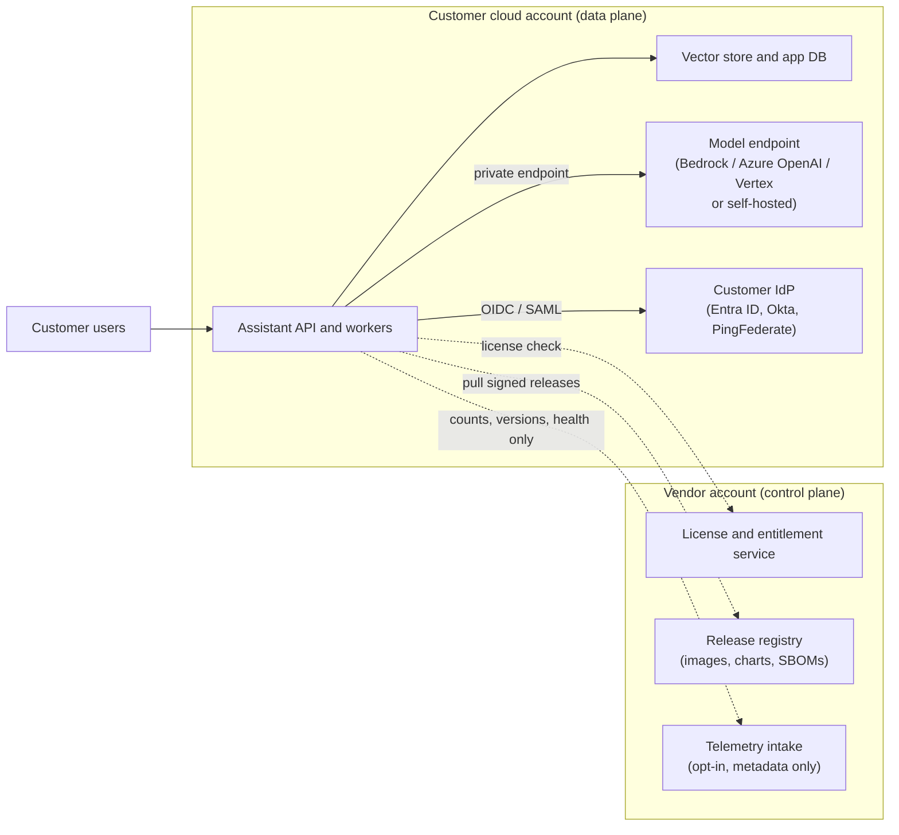
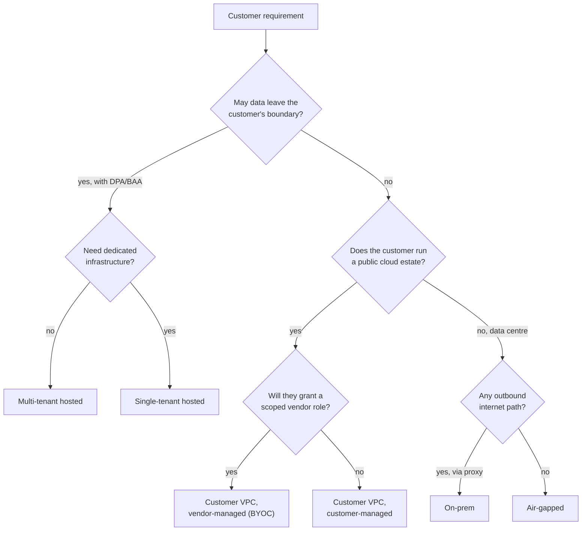

# Deployment Models: Hosted API vs Customer VPC vs On-Prem & Air-Gapped

!!! abstract "Key takeaways"
    - **Five models on a spectrum:** multi-tenant hosted (SaaS/API) → single-tenant hosted → **customer VPC / BYOC** (runs in the customer's cloud account) → on-prem / private cloud → **air-gapped** (no internet at all). Moving right gives the customer more control and gives you more operational pain.
    - **Split control plane from data plane.** Customer data, prompts, embeddings and model calls stay in the data plane in the customer's boundary; licensing, release metadata and (optional) telemetry live in a vendor control plane. This is how most BYOC products pass security review.
    - **Ask for the real constraint, not the stated model.** "We need on-prem" often means "data must not leave our AWS org" or "our CISO won't sign a new sub-processor", which a customer-VPC install with their own Bedrock/Azure/Vertex models satisfies.
    - **Write a responsibility matrix per model** (who patches, upgrades, scales, holds keys, is on call, sees logs). Most deployment disputes are ownership disputes.
    - **One codebase, many profiles.** Every environment-specific choice (registry, model endpoint, IdP, proxy, telemetry) is configuration, validated at install time; never fork the product per customer.

## Why it matters

An FDE's job is to get software into production *inside* a customer's world. The first architecture decision, and often the first argument, is **where the software runs**. A bank, a payer or a defence agency will not paste regulated data into a vendor's multi-tenant endpoint just because the demo was good. The deployment model decides:

- **What the security review looks at.** A hosted API means a vendor risk assessment of you and every sub-processor. A customer-VPC install means a review of your container images, IAM permissions and network calls.
- **How fast you can ship.** Hosted: you deploy ten times a day. Air-gapped: a release is a signed bundle carried across a boundary, perhaps once a quarter.
- **Who is on call.** If it runs in the customer's account, the customer's operations team has to be able to run it after you leave (see [Production rollout & handoff](07-production-rollout-monitoring-on-call-and-handoff-to-the-cus.md)).
- **Which models you can use.** A hosted product can call any frontier API. A customer-VPC install usually calls the model through the customer's own cloud AI platform ([Bedrock, Azure OpenAI, Vertex](06-cloud-ai-platforms-amazon-bedrock-azure-openai-vertex-ai.md)). Air-gapped means self-hosted open-weight models on the customer's GPUs.

Before cloud, enterprise software was mostly installed on-prem (think shrink-wrapped Java app servers). SaaS swung the default to vendor-hosted. In 2024–26 the pendulum swung partway back for AI: model providers became available inside the big clouds, and enterprises started asking for "the AI, in our account". FDE job descriptions from OpenAI, Anthropic and Palantir explicitly mention deploying into customer VPCs and on-prem environments (see [The AI-lab FDE model](../fde-role-interview-loop/02-the-ai-lab-fde-model-openai-anthropic-google-databricks-scal.md)).

## Core concepts

### The five deployment models

| Model | Where code runs | Where data lives | Who operates | Typical customer |
|---|---|---|---|---|
| **Multi-tenant hosted (SaaS / API)** | Vendor cloud, shared infrastructure | Vendor cloud, logically isolated per tenant | Vendor | Mid-market, low data sensitivity, fastest start |
| **Single-tenant hosted** | Vendor cloud, dedicated stack per customer (own VPC/account) | Vendor cloud, physically separate | Vendor | Larger enterprise wanting isolation without running it |
| **Customer VPC / BYOC** | Customer's cloud account (AWS/Azure/GCP) | Customer account | Vendor-managed (via a scoped role) or customer-managed | Regulated industries with a cloud commitment |
| **On-prem / private cloud** | Customer data centre (VMware, OpenShift, bare-metal Kubernetes) | Customer data centre | Customer, with vendor support | Banks, telcos, manufacturers with data-centre estates |
| **Air-gapped** | Isolated network, no internet path | Inside the enclave | Customer only; vendor has no remote access | Defence, intelligence, critical infrastructure, some healthcare |

![A grid with where data lives down the side (vendor cloud shared, vendor cloud dedicated, customer cloud account, customer data centre, isolated enclave) and who operates across the top (vendor with full access, vendor via a scoped audited role, customer with break-glass vendor access, customer only). Multi-tenant and single-tenant sit in the vendor column; the customer cloud account row holds both BYOC run by the vendor and a customer-run VPC install; on-prem is customer-run; air-gapped is customer-only. Releases slide from ten deploys a day to perhaps one signed bundle a quarter.](images/01-two-axes.svg){ loading=lazy }
*Watch the customer-cloud-account row: same data location, two very different operating models.*

Two terms interviewers use loosely:

- **BYOC (bring your own cloud):** the vendor's software runs in the customer's cloud account, usually still managed by the vendor through a cross-account role. Databricks' classic data plane, Confluent and several vector-database vendors use variants of this.
- **Self-hosted / customer-managed:** the customer installs and operates the software (Helm chart, Terraform module, VM image). The vendor ships releases and support but has no standing access.

### Control plane vs data plane

The pattern that makes BYOC acceptable to a security team is a clean split:


*Notice that every solid arrow (user data, prompts, retrieved documents, model calls) stays inside the customer account; the dotted arrows to the vendor carry no customer content and can be switched off or replaced with offline files for air-gapped installs.*

What crosses the boundary must be written down and minimal: release artefacts flowing in, and at most licence checks and aggregate health metrics flowing out. If the product needs to send prompts or documents to the vendor for any reason (support debugging, evals, fine-tuning), that is a separate, explicit, customer-approved data flow, and it will be the first thing the security team asks about (see [Security reviews](04-security-reviews-and-compliance-questionnaires-soc-2-hipaa-g.md)).

### Where the model runs: a separate decision

For an AI product there are really two placement decisions: where the **application** runs and where the **model inference** runs.

| Application placement | Model options | Notes |
|---|---|---|
| Vendor-hosted | Vendor's own model API, or a frontier API under the vendor's contract | Data goes to vendor and to the model provider as sub-processor |
| Customer VPC | Customer's Bedrock / Azure OpenAI (Foundry) / Vertex (now Gemini Enterprise Agent Platform) under the **customer's** contract and quota; or self-hosted open weights | The most common enterprise AI pattern in 2026; model provider never contracts with you |
| On-prem | Self-hosted open weights (vLLM, TGI, NVIDIA NIM) on customer GPUs; or private connectivity back to their cloud AI platform | GPU sizing and model upgrades become the customer's problem |
| Air-gapped | Self-hosted open weights only; weights delivered in the release bundle | Model refreshes are slow; evals must run inside the enclave |

When the customer brings their own model endpoint, your application must be **model-agnostic** (a gateway interface and per-route config), which is the same design advice as [Model selection & routing](../fde-applied-llm/01-model-selection-and-routing-quality-vs-latency-vs-cost-acros.md).

### Choosing a model: start from constraints


*Notice that the first question is about data boundaries, not technology preference, and that "customer VPC" splits into two very different operating models depending on whether the vendor may hold a role in the account.*

Questions to ask in discovery (see [Discovery interviews](../fde-customer-discovery/01-discovery-interviews-workflow-mapping-hidden-constraints-res.md)):

1. Which data classes will the system touch (PHI, PCI, PII, export-controlled, trade secrets)?
2. Which cloud(s) and regions are approved? Is there an existing enterprise agreement with a model provider through that cloud?
3. Who must hold the encryption keys (provider-managed, customer-managed KMS, HSM-backed, see [HSMs & BYOK/HYOK](../cryptography-key-management/05-hsms-and-byok-hyok.md))?
4. Can the vendor have any standing access? Break-glass only? None?
5. Is there outbound internet from the workload subnet? Through which proxy? With TLS inspection?
6. Who will operate it on day 2, and do they run Kubernetes today?

### The responsibility matrix

Write one per engagement and get it signed with the statement of work.

| Responsibility | Multi-tenant hosted | Customer VPC, vendor-managed | Customer VPC, customer-managed | Air-gapped |
|---|---|---|---|---|
| Infrastructure provisioning | Vendor | Vendor (Terraform via scoped role) | Customer (vendor Terraform module) | Customer |
| App upgrades and patches | Vendor, continuous | Vendor, in agreed windows | Customer, from vendor releases | Customer, from offline bundles |
| Encryption keys | Vendor (or customer-managed key option) | Customer KMS | Customer KMS / HSM | Customer HSM |
| Model endpoint and quota | Vendor | Customer's cloud AI platform | Customer's cloud AI platform | Customer GPUs |
| Logs and audit data | Vendor stores, customer can export | Customer account | Customer account | Customer enclave |
| First-line on-call | Vendor | Shared (agreed RACI) | Customer | Customer |
| Vendor access to prod | Full | Scoped role, audited | Break-glass, customer-approved sessions | None |

### Air-gapped specifics

Air-gapped (also "disconnected" or "classified enclave") deployments break every assumption a cloud-native product makes:

- **No image pulls.** Releases ship as a bundle: container images (as OCI archives), Helm charts, model weights, SBOMs, signatures and checksums. The customer loads them into an internal registry (Harbor, Artifactory, Nexus). Tools such as Zarf and Replicated exist precisely to package Kubernetes apps for disconnected installs.
- **No licence server, no telemetry.** Licences are signed offline files with expiry. Support works from logs the customer chooses to export after their own review.
- **No runtime downloads.** Tokenizers, spaCy models, `pip install` at start-up, font CDNs, public OIDC discovery URLs: anything fetched at runtime fails. Find them with a test install in a network namespace with no egress.
- **Time and certificates.** Internal CAs only; NTP from internal servers. Certificate expiry inside an enclave is a classic outage.
- **Evals inside the enclave.** You can't pull production samples out to tune prompts. Ship the eval harness with the product and train the customer to run it.

## In practice: code & configuration

### One codebase, several profiles

The common mistake is to fork the product or hard-code endpoints when the first on-prem customer appears. The fix is install-time configuration (see the full Helm chart in [Packaging & delivery](05-packaging-and-delivery-into-a-customer-account-docker-helm-t.md)) plus a preflight that refuses contradictory settings.

{ loading=lazy }
*Each failure is caught at install time, where it costs seconds, not inside an enclave you cannot reach.*

=== "❌ Common mistake"
    ```python
    # settings.py - assumptions baked into code
    MODEL_URL = "https://api.vendor-ai.example/v1/chat"   # vendor-hosted only
    TELEMETRY_URL = "https://telemetry.vendor.example"    # always on, sends prompts for "quality"
    TOKENIZER = "https://huggingface.co/some/tokenizer"    # downloaded at start-up
    IMAGE = "vendor/assistant:latest"                       # floating tag, public registry
    # Result: fails in a customer VPC without internet, fails security review,
    # and every new customer becomes a code branch.
    ```

=== "✅ Correct approach"
    ```python
    # profile_check.py - one codebase, several deployment modes: fail the install early
    # when a values file contradicts the mode the customer signed up for. (Ran offline.)
    from urllib.parse import urlparse

    RULES = {
        "hosted":       {"telemetry": None,  "llm_providers": {"bedrock", "azure-openai", "vertex", "vendor-api"}},
        "customer-vpc": {"telemetry": None,  "llm_providers": {"bedrock", "azure-openai", "vertex", "openai-compatible"}},
        "air-gapped":   {"telemetry": False, "llm_providers": {"openai-compatible"}},  # self-hosted model server only
    }
    INTERNAL_SUFFIXES = (".svc", ".cluster.local", ".corp.example")

    def check(mode: str, v: dict) -> list[str]:
        r, problems = RULES[mode], []
        if v["llm"]["provider"] not in r["llm_providers"]:
            problems.append(f"llm.provider={v['llm']['provider']} not allowed in {mode}")
        if r["telemetry"] is False and v["telemetry"]["enabled"]:
            problems.append("telemetry must be disabled in air-gapped mode")
        if mode == "air-gapped":
            if not v["global"]["imageRegistry"]:
                problems.append("global.imageRegistry must point at the customer's internal mirror")
            for key, url in [("llm.endpoint", v["llm"]["endpoint"]), ("auth.oidc.issuerUri", v["auth"]["issuerUri"])]:
                host = urlparse(url).hostname or ""
                if not host.endswith(INTERNAL_SUFFIXES):
                    problems.append(f"{key} host '{host}' is not internal")
        if mode != "hosted" and not v["image"]["digest"]:
            problems.append("image.digest must be pinned for customer-run installs")
        return problems
    ```
    Output for a values file copied from the hosted profile into an air-gapped install:
    ```text
    FAIL: llm.provider=bedrock not allowed in air-gapped
    FAIL: telemetry must be disabled in air-gapped mode
    FAIL: global.imageRegistry must point at the customer's internal mirror
    FAIL: llm.endpoint host '' is not internal
    FAIL: auth.oidc.issuerUri host 'login.microsoftonline.com' is not internal
    FAIL: image.digest must be pinned for customer-run installs
    ```

### A deployment-model decision record

Keep a short ADR per customer; it is what the next FDE and the customer's architecture board read.

```markdown
# ADR-007: Deployment model for <Customer> claims assistant
Date: 2026-10-10    Status: Accepted
Context: PHI in scope; AWS-only (eu-central-1, eu-west-1); existing Bedrock EA; no vendor
standing access permitted in production; ops team runs EKS today.
Decision: Customer VPC, customer-managed. Helm chart + Terraform module delivered via their
GitOps repo. Inference via the customer's Bedrock (EU geographic inference profile) over PrivateLink.
Vendor access: break-glass only, via customer-approved session, recorded.
Consequences: upgrades follow their monthly change window; we ship a preflight and runbooks;
evals run in their account; telemetry off, health metrics go to their Prometheus.
Rejected: multi-tenant hosted (new sub-processor for PHI); BYOC vendor-managed (no standing access).
```

## Real-world usage

- **Palantir** built Apollo to continuously deliver software into hundreds of environments, including classified and disconnected ones, because its products run inside customer and government networks. That is the origin of the FDE role (see [What an FDE is](../fde-role-interview-loop/01-what-an-fde-is-palantir-origins-fde-vs-swe-vs-solutions-engi.md)).
- **Data platforms** (Databricks classic compute, Confluent, several vector databases) popularised BYOC: the vendor's control plane, the customer's data plane in the customer's account.
- **Model providers inside clouds:** Anthropic models on Bedrock, Vertex and Microsoft Foundry, and OpenAI models through Azure, are a deployment-model answer as much as a model answer. The customer keeps the data in their account and their contract.
- **Self-hosted open weights** with vLLM or NVIDIA NIM are the default for air-gapped and sovereign deployments, accepting lower model quality and GPU operations in exchange for complete data control.
- **Failure modes:** a "customer VPC" product that silently calls a vendor endpoint for embeddings; a Helm chart that assumes cluster-admin; a BYOC role with `AdministratorAccess`; an air-gapped install that fails because a Python package downloads a model on first import; certificates expiring in an enclave with no automated renewal.

## Trade-offs & production gotchas

| Option | Pros | Cons | Use when |
|---|---|---|---|
| Multi-tenant hosted | Fastest start; vendor ships continuously; lowest customer effort | Hardest security review; data leaves customer; noisy-neighbour risk | Low/medium sensitivity; pilots with synthetic or de-identified data |
| Single-tenant hosted | Isolation without customer ops; per-customer keys and region | Vendor cost per tenant; still a sub-processor | Large customer, regulated data allowed off-prem under DPA/BAA |
| Customer VPC, vendor-managed | Data stays in customer account; vendor still operates | Customer must trust a cross-account role; audit of vendor actions | Cloud-native regulated customer who wants a managed service |
| Customer VPC, customer-managed | No vendor access; fits their change control | Slower upgrades; customer ops must learn the product | Strict "no standing access" policies; strong platform team |
| On-prem | Uses existing data centre and GPUs; data never in public cloud | Hardware lead times; varied Kubernetes flavours (OpenShift) | Data-centre-first enterprises |
| Air-gapped | Maximum isolation | Slow releases, no telemetry, self-hosted models only, hard support | Classified or critical-infrastructure workloads |

!!! warning "Gotcha: 'on-prem' is often a proxy for something else"
    Customers say "on-prem" when they mean "not in your cloud". Ask what outcome the requirement protects. If the answer is "PHI must stay in our AWS organisation under our BAA with AWS", a customer-VPC install with their Bedrock is cheaper for everyone than racking GPUs.

!!! warning "Gotcha: version skew across customers"
    Ten customer-managed installs quickly become ten versions. Publish a support window (for example, current and previous two minor versions), make upgrades boring (backward-compatible migrations, `helm upgrade` tested from N-2), and track which customer runs what.

!!! tip "Interview angle"
    When asked "How would you deploy this for a bank?", don't pick a model immediately. Say: "It depends on three answers: may data leave their boundary, which cloud and keys, and who operates it day 2. Then I'd propose the least-operational model that satisfies the constraint and write the responsibility matrix."

## How this connects to my experience

- **Where I used it:**
    - **Coriolis, CipherTrust Cloud Key Management (CCKM):** "Developed enterprise key management capabilities supporting AWS, Azure, and GCP environments" and "HSM integrations using Thales Luna and SafeNet". Key management is the textbook case of software the customer runs and controls, connecting into several clouds from their own boundary. *[confirm: whether CCKM releases were installed by customers on their own appliances or VMs, and whether you handled any customer-environment installs or support cases]*
    - **Deloitte ConvergeHealth Data Asset Explorer:** cloud-native services on AWS (EKS, ECS, Lambda, RDS) with **Terraform**-automated provisioning and IAM/KMS/Secrets Manager controls: the building blocks of a customer-VPC deployment. *[confirm: whether the platform was deployed into client-owned AWS accounts or a Deloitte-hosted one]*
    - **OptumRx Meteor:** healthcare apps for 750K+ users where PHI handling decides what can run where; integration layer across 5 upstream systems inside an enterprise network.
- **Talking points:**
    - "At CCKM the product's whole value was that keys stay under the customer's control while workloads span AWS, Azure and GCP. That's the same control-plane/data-plane argument I'd make for an AI product in a customer VPC."
    - "Healthcare taught me to start with the data class. If PHI is in scope, the deployment model follows from where the BAA chain already exists."
    - "I've automated infrastructure with Terraform, so I'd ship the customer a module and a preflight, not a wiki page of manual steps."
- **Likely follow-up chain:** "Hosted or in their VPC?" → "What exactly crosses the boundary?" → "How do you upgrade 15 customer-managed installs?" → "What breaks in air-gapped?". Answer: constraints decide; only signed releases in and opt-in metadata out; support window plus tested N-2 upgrades plus version tracking; runtime downloads, licence checks, telemetry, certificates and evals.

## Interview questions

### Fundamentals

??? question "Q1. Compare multi-tenant SaaS, single-tenant hosted, customer VPC and on-prem deployments."
    **Answer:** Multi-tenant shares vendor infrastructure across customers with logical isolation; fastest to ship, hardest to approve for regulated data. Single-tenant gives each customer a dedicated stack in the vendor's cloud: physical isolation, per-customer keys and region, still a sub-processor. Customer VPC runs the software in the customer's own cloud account so data never enters the vendor's environment; it can be vendor-managed through a scoped role or customer-managed. On-prem runs in the customer's data centre and is operated by the customer with vendor support.

    **Interviewer listens for:** data location vs operator as separate axes; sub-processor implications; operational cost.

    **Common wrong answer:** "On-prem is the most secure, so always offer it."

??? question "Q2. What is BYOC and why do enterprise customers like it?"
    **Answer:** Bring your own cloud: the vendor's data plane runs in the customer's cloud account, while the vendor keeps a control plane for releases, licensing and optional telemetry. Customers like it because data, keys and logs stay in their account under their existing cloud agreements and controls, while they still get a managed product. The price is a cross-account role they must trust and audit.

    **Interviewer listens for:** control/data plane split; customer keys and logs; cross-account trust.

    **Common wrong answer:** "BYOC means the customer brings their own model."

??? question "Q3. What changes when a deployment is air-gapped?"
    **Answer:** No image pulls (ship OCI archives and charts in a signed bundle, loaded into an internal registry), no licence server (signed offline licence), no telemetry (support from customer-exported logs), no runtime downloads (tokenizers, packages, OIDC discovery on public URLs), internal CAs and NTP, self-hosted models with weights in the bundle, and evals that run inside the enclave. Releases become infrequent, so upgrades must be robust from older versions.

    **Interviewer listens for:** runtime downloads; signed bundles; evals inside; upgrade path.

    **Common wrong answer:** "Same as on-prem, just with a firewall."

### Intermediate

??? question "Q4. How do you decide where the model inference runs, separately from the app?"
    **Answer:** Map the data class and contract chain. If the customer has an enterprise agreement and BAA with their cloud provider, inference through their Bedrock, Azure OpenAI or Vertex keeps the model provider under their contract and quota. If no data may reach any third party, or there's no internet, self-host open weights. Hosted apps can use the vendor's model contract if the customer accepts the sub-processor. Then check feature and model availability on that surface and run evals there.

    **Interviewer listens for:** contract chain; customer quota; eval on the actual surface.

    **Common wrong answer:** choosing the model first and making the deployment fit.

??? question "Q5. What belongs in a vendor control plane for a BYOC product, and what must never be there?"
    **Answer:** Release metadata and artefacts, licence and entitlement checks, fleet version inventory, and opt-in aggregate health (counts, versions, error rates). Never prompts, completions, retrieved documents, embeddings, user identities beyond what licensing needs, or credentials to customer data stores. Anything else needs a separately approved data flow.

    **Interviewer listens for:** explicit list of what crosses; opt-in; metadata only.

    **Common wrong answer:** "We send logs to our Datadog for support."

??? question "Q6. How do you keep one codebase deployable to hosted, VPC and air-gapped modes?"
    **Answer:** Treat every environment dependency as configuration: image registry, model provider and endpoint, IdP issuer, proxy and CA bundle, telemetry, storage classes. Use a provider-neutral gateway for models. Avoid runtime downloads by baking assets into images. Validate configuration at install time with a preflight that knows the mode's rules. Test the air-gapped profile in CI in a namespace with no egress.

    **Interviewer listens for:** config not forks; preflight; no-egress CI test.

    **Common wrong answer:** maintaining a customer branch.

### Senior

??? question "Q7. A customer insists on on-prem. How do you respond?"
    **Answer:** Ask what risk the requirement protects: data leaving their control, a new sub-processor, residency, or a regulator's view. Often a customer-VPC install using their own cloud AI platform under existing agreements meets the need with far less cost and lead time than GPUs in a data centre. If on-prem is truly required (no public cloud, sovereign data), plan GPU sizing, open-weight model choice and evals, OpenShift or vanilla Kubernetes differences, and a support model. Put the trade-offs in an ADR they sign.

    **Interviewer listens for:** underlying constraint; cheaper alternative; honest cost of on-prem.

    **Common wrong answer:** agreeing immediately, or refusing.

??? question "Q8. How do you manage upgrades across many customer-managed installs?"
    **Answer:** Publish a support window (for example N and N-2 minor versions) and a deprecation policy. Make upgrades boring: backward-compatible schema migrations, Helm upgrade tested from each supported version in CI, preflight checks, rollback instructions. Keep a fleet inventory (version, mode, customer contact) through opt-in telemetry or support tickets. Ship security patches as small releases. Encourage GitOps so the customer's change control is a pull request.

    **Interviewer listens for:** support window; N-2 upgrade tests; inventory; customer change control.

    **Common wrong answer:** "We tell them to always run latest."

??? question "Q9. What is the minimum vendor access you'd ask for in a vendor-managed customer-VPC model?"
    **Answer:** A dedicated role assumable only by the vendor's deploy pipeline role, with an external ID, short sessions, a customer-owned permissions boundary, and permissions limited to the product's resources (one cluster namespace, one registry repository, its own Terraform state). No IAM administration, no access to customer data stores beyond what the app's own runtime role has. All actions logged in the customer's CloudTrail, with break-glass access for incidents approved per session. See the Terraform in [Packaging & delivery](05-packaging-and-delivery-into-a-customer-account-docker-helm-t.md).

    **Interviewer listens for:** external ID; boundary; scoped resources; customer-side audit.

    **Common wrong answer:** "AdministratorAccess so we can fix anything."

### Scenario-based

??? question "Q10. A health insurer wants your LLM claims assistant. PHI, AWS-only, no vendor access in production, and their ops team runs EKS. Propose the deployment."
    **Answer:** Customer VPC, customer-managed. Deliver a Helm chart and Terraform module into their GitOps repo; images pinned by digest and mirrored into their ECR. Inference through their Bedrock in an approved region via PrivateLink, under their BAA with AWS. SSO through their IdP, logs to their CloudWatch or Prometheus, keys in their KMS. Vendor access break-glass only. Provide a preflight, runbooks, an eval harness they run, and a hypercare period with shared on-call before handing over.

    **Interviewer listens for:** contract chain; private networking; customer operations; handoff plan.

    **Common wrong answer:** "We'll host it in our AWS account; we're HIPAA compliant."

??? question "Q11. Your first air-gapped install fails at start-up. How do you debug without remote access?"
    **Answer:** Ask the customer for pod events and logs (`kubectl describe`, `kubectl logs`) through their approved export process. Typical causes: an image not in the internal registry (wrong registry value or missing image in the bundle), a runtime download (tokenizer, package, model), OIDC discovery to a public URL, an untrusted internal CA, or clock skew breaking token validation. Reproduce in your own no-egress test cluster, fix the bundle, and add a CI test so it can't recur.

    **Interviewer listens for:** structured hypotheses; reproduction offline; CI guard.

    **Common wrong answer:** "Ask them to open the firewall temporarily."

## Cheat sheet

| Concept | Remember |
|---|---|
| Spectrum | Multi-tenant → single-tenant → customer VPC/BYOC → on-prem → air-gapped |
| Two axes | Where data lives vs who operates |
| Control/data plane | Content stays in customer data plane; only releases in, opt-in metadata out |
| Model placement | Customer's cloud AI platform under their contract, or self-hosted open weights |
| First questions | Data class, approved cloud/region, key ownership, vendor access, egress, day-2 operator |
| Responsibility matrix | Provisioning, upgrades, keys, model quota, logs, on-call, vendor access |
| Air-gapped | Signed bundles, internal registry, offline licence, no runtime downloads, evals inside |
| One codebase | Config + preflight + no-egress CI test; never fork per customer |
| Upgrades | Support window N-2, tested upgrade paths, fleet inventory |

## Sources
1. [AWS Well-Architected SaaS Lens](https://docs.aws.amazon.com/wellarchitected/latest/saas-lens/saas-lens.html): silo/pool/bridge tenancy models and operational trade-offs.
2. [AWS whitepaper: SaaS tenant isolation strategies](https://docs.aws.amazon.com/whitepapers/latest/saas-tenant-isolation-strategies/saas-tenant-isolation-strategies.html): multi-tenant vs dedicated isolation.
3. [Amazon Bedrock: Data protection](https://docs.aws.amazon.com/bedrock/latest/userguide/data-protection.html): prompts and completions not stored or used for training; model deployment accounts not accessible to model providers.
4. [Palantir Apollo](https://www.palantir.com/platforms/apollo/): continuous delivery into customer, classified and disconnected environments.
5. [Zarf documentation](https://docs.zarf.dev/) and [Replicated documentation](https://docs.replicated.com/): packaging Kubernetes applications for air-gapped installs.
6. [vLLM documentation](https://docs.vllm.ai/): self-hosted, OpenAI-compatible inference server for open-weight models.
7. [Kubernetes: Images](https://kubernetes.io/docs/concepts/containers/images/): image references by digest and private registries.
8. [Google Cloud: Introducing Gemini Enterprise Agent Platform](https://cloud.google.com/blog/products/ai-machine-learning/introducing-gemini-enterprise-agent-platform): Vertex AI capabilities now delivered through the Agent Platform (April 22, 2026).
