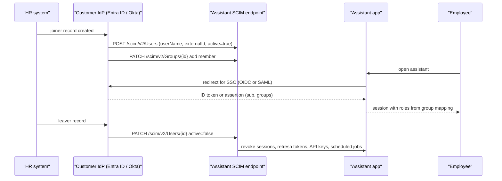
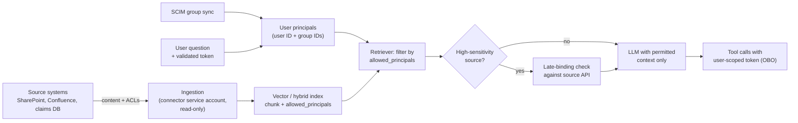

# Enterprise Identity: SSO (SAML/OIDC), SCIM, RBAC & Permission Propagation

!!! abstract "Key takeaways"
    - **Three separate jobs:** *authentication* (SSO via SAML 2.0 or OIDC against the customer's IdP), *provisioning* (who exists and which groups they're in, via SCIM 2.0 or just-in-time), and *authorisation* (what each user may see and do, via roles and attributes in your app).
    - **JIT creates users; only SCIM (or an equivalent sync) removes them.** Deprovisioning is the requirement security teams check: when someone leaves, their access to the assistant and its indexed documents must end within the agreed time.
    - **Key on immutable IDs**, not email: `sub` (or Entra `oid` + `tid`) from the token, and SCIM `externalId`. Emails and display names change.
    - **Permissions must propagate end to end.** The assistant may only retrieve documents the user could open in the source system, and agent tools act **on behalf of the user** (token exchange / OBO), never with a super service account.
    - **Watch token size and staleness:** Entra ID caps groups in a token (overage claim), SCIM sync is periodic (around 40 minutes per cycle in Entra), and document ACLs in a vector index go stale unless re-synced or checked at query time.

## Why it matters

Every enterprise customer already has an identity provider (IdP): Microsoft Entra ID (formerly Azure AD), Okta, Ping Identity (PingFederate), Google Workspace or on-prem Active Directory behind ADFS. Their security team's first non-negotiable is "**no new passwords**": users sign in with corporate SSO, and access follows corporate groups. The second, checked in every security review, is **joiner-mover-leaver**: when people change teams or leave, their access changes or ends without someone remembering to click a button.

For an AI assistant the stakes are higher than for a normal app. A retrieval-augmented assistant indexes documents from SharePoint, Confluence, file shares and ticket systems. If it doesn't respect the original permissions, it becomes the easiest way in the company to read the CEO's mailbox or another patient's record. "The bot showed me a document I shouldn't see" is one of the most common ways enterprise AI pilots get shut down.

This page builds on the core identity pages; it doesn't repeat them:

- Protocols: [OpenID Connect: ID Token, UserInfo & Discovery](../spring-security-oauth2/06-openid-connect-id-token-userinfo-discovery.md) and [SSO, SAML vs OIDC & Enterprise IdPs](../spring-security-oauth2/08-sso-saml-vs-oidc-enterprise-idps.md).
- Spring wiring: [Resource Server & Client Configuration](../spring-security-oauth2/07-resource-server-and-client-configuration-in-spring.md).
- Token propagation: [Service-to-Service Auth: mTLS, Token Exchange & Propagation](../spring-security-oauth2/09-service-to-service-auth.md).

## Core concepts

### SSO: SAML 2.0 vs OIDC in a customer deployment

| | SAML 2.0 | OpenID Connect |
|---|---|---|
| Format | Signed XML assertion posted to your ACS URL | Signed JWT ID token from the token endpoint |
| Setup data | IdP metadata XML (entity ID, SSO URL, signing cert) | Issuer URL; your app reads `/.well-known/openid-configuration` and JWKS |
| Typical in | Older enterprise apps, ADFS, PingFederate estates | New apps, APIs, mobile, Entra ID and Okta app registrations |
| Gotchas | Cert rotation by the IdP breaks login; clock skew; IdP-initiated flows and replay | Issuer/audience validation per tenant; group claim size; refresh-token policy |

Practical rules for an FDE:

- **Support both.** Many enterprises standardise on SAML for workforce apps. Supporting OIDC only can stall a deal; an identity broker (Keycloak, Auth0/Okta Customer Identity, AWS Cognito, Entra External ID) can translate.
- **Per-tenant configuration.** In a multi-tenant product, each customer has its own IdP connection; route users by email domain ("home realm discovery") and validate the issuer **for that tenant**. Never accept a token just because it is signed by *some* Entra tenant.
- **Metadata over copy-paste.** Consume the IdP's metadata URL or OIDC discovery so certificate and key rotation work without a support ticket. In air-gapped installs, the IdP is internal (ADFS, Keycloak); see [Deployment models](01-deployment-models-hosted-api-vs-customer-vpc-vs-on-prem-and.md).

### Provisioning: JIT vs SCIM

**Just-in-time (JIT) provisioning** creates a local user record on first login from the token's claims. It's simple and needs no extra integration, but it only ever learns about a user when they log in. A user who leaves the company simply stops logging in; their account, API keys, saved conversations and scheduled agent jobs live on.

**SCIM 2.0** (System for Cross-domain Identity Management) is the IETF standard for pushing identity changes from the IdP to your app: RFC 7643 defines the schema (`User`, `Group`, the enterprise extension) and RFC 7644 the REST protocol (`/Users`, `/Groups`, `PATCH` operations, filtering, bulk, `/ServiceProviderConfig`). The IdP is the SCIM *client*; your product exposes the SCIM *server*.


*Notice that SSO (the middle part) and provisioning (the top and bottom) are separate flows: the leaver path never involves the user logging in, which is exactly why JIT alone can't deprovision.*

{ loading=lazy }
*Watch the JIT bar run off the chart: without a leaver signal, nothing ever closes.*

What enterprise IdPs actually send, and what your SCIM server must handle:

- **Deactivate, not delete.** Entra ID and Okta usually send `PATCH ... active=false` when a user is unassigned or disabled; hard `DELETE` may come later or never. Treat deactivation as the security event.
- **Idempotency and order.** Provisioning runs in cycles (Entra ID runs incremental cycles roughly every 40 minutes after the initial full sync, per Microsoft and integrator docs). Operations can repeat and arrive out of order; make each one idempotent.
- **Quirks.** Entra ID has historically sent `active` as the string `"False"`, path-less `replace` operations and mixed-case `op` values; normalise them. Return proper SCIM errors (`409` with `scimType: uniqueness` for duplicate `userName`).
- **Filtering.** The IdP checks for existing users with `GET /Users?filter=userName eq "x"` before creating; implement at least `eq` on `userName` and `externalId`.
- **Auth to your SCIM endpoint.** A dedicated bearer token or OAuth client-credentials token, scoped to SCIM only, rotated, and never the same credential as the app.

### Authorisation: RBAC, ABAC and group mapping

Most enterprise deployments start with **RBAC**: IdP groups map to app roles (`assistant-users`, `assistant-admins`, `claims-reviewers`). Rules:

- **The mapping lives in your app's config, owned by the customer.** Group names and IDs differ per customer; never hard-code them.
- **Prefer group object IDs over display names**, which can be renamed or duplicated.
- **Limit groups in tokens.** Entra ID emits at most 150 groups in a SAML assertion and 200 in a JWT; beyond that it sends an *overage* indicator and your app must call Microsoft Graph. Fix it by emitting only groups assigned to the application, or by using **app roles**, which appear in a `roles` claim.
- **ABAC** adds attributes (department, region, clearance, line of business) for rules like "claims reviewers in the EU see EU claims only". Attributes come from the token or SCIM enterprise extension. Keep the policy in one place (a policy engine such as OPA/Cedar, or one service), not scattered `if` statements.

{ loading=lazy }
*The users with the most groups, often executives, are the ones who silently lose access.*

### Permission propagation into retrieval and tools

This is where AI products differ from ordinary apps. Two rules:

1. **Retrieval only returns what the user could open in the source system.** Each indexed chunk carries the source document's ACL (allowed users and groups), captured at ingestion. At query time the retriever filters on the user's identities (user ID plus group IDs). For high-sensitivity sources, add a **late-binding check**: before showing a result, re-check access against the source API. The ingestion and filtering design is covered in [Production RAG: Permission-Aware Retrieval](../fde-applied-llm/03-production-rag-chunking-hybrid-search-reranking-permission-a.md).
2. **Agents act as the user.** When the assistant calls a downstream API (create a ticket, read a claim), it uses a token that represents *this user*, obtained by OAuth 2.0 Token Exchange (RFC 8693) or Entra's on-behalf-of flow, with scopes limited to the tool. A shared service account with broad access turns every prompt injection into a privilege escalation (see [Guardrails](../fde-applied-llm/06-guardrails-prompt-injection-pii-phi-redaction-grounding-chec.md) and [Agents in production](../fde-applied-llm/04-agents-in-production-tool-use-mcp-servers-sub-agents-skills.md)).


*Notice that the connector's broad read access is used only for ingestion; every user-facing step uses the user's own principals or a token exchanged for the user.*

Staleness is the hard part. Group membership changes (SCIM cycle), source ACL changes (re-crawl schedule) and token lifetimes each add delay. Agree a **maximum permission-change latency** with the customer (for example: leaver access gone within one hour, ACL changes reflected within 24 hours, late-binding checks for HR and legal sources) and design to it.

## In practice: code & configuration

### SCIM: create and deactivate a user (RFC 7644)

```http
POST /scim/v2/Users HTTP/1.1
Host: assistant.customer.example
Authorization: Bearer <scim-only token>
Content-Type: application/scim+json

{
  "schemas": ["urn:ietf:params:scim:schemas:core:2.0:User"],
  "userName": "asha.rao@payer.example",
  "externalId": "8f2e7c1a-entra-object-id",
  "name": {"givenName": "Asha", "familyName": "Rao"},
  "emails": [{"value": "asha.rao@payer.example", "type": "work", "primary": true}],
  "active": true
}
```

```http
HTTP/1.1 201 Created
Content-Type: application/scim+json
Location: https://assistant.customer.example/scim/v2/Users/2819c223-7f76-453a-919d-413861904646
ETag: W/"1"

{
  "schemas": ["urn:ietf:params:scim:schemas:core:2.0:User"],
  "id": "2819c223-7f76-453a-919d-413861904646",
  "externalId": "8f2e7c1a-entra-object-id",
  "userName": "asha.rao@payer.example",
  "active": true,
  "meta": {
    "resourceType": "User",
    "created": "2026-10-10T09:00:00Z",
    "lastModified": "2026-10-10T09:00:00Z",
    "location": "https://assistant.customer.example/scim/v2/Users/2819c223-7f76-453a-919d-413861904646",
    "version": "W/\"1\""
  }
}
```

```http
PATCH /scim/v2/Users/2819c223-7f76-453a-919d-413861904646 HTTP/1.1
Content-Type: application/scim+json

{
  "schemas": ["urn:ietf:params:scim:api:messages:2.0:PatchOp"],
  "Operations": [{"op": "replace", "path": "active", "value": false}]
}
```

### SCIM server logic: deprovisioning that actually revokes access

The handler below ran offline. It normalises Entra-style quirks, rejects duplicates with a SCIM error, and fires revocation exactly once, on the active → inactive transition.

```python
# scim_store.py - minimal SCIM 2.0 user lifecycle with deprovision side effects (ran offline).
from dataclasses import dataclass, field
import uuid

CORE_USER = "urn:ietf:params:scim:schemas:core:2.0:User"
PATCH_OP = "urn:ietf:params:scim:api:messages:2.0:PatchOp"
ERROR = "urn:ietf:params:scim:api:messages:2.0:Error"

@dataclass
class User:
    id: str
    userName: str
    externalId: str
    active: bool = True
    version: int = 1

class ScimStore:
    def __init__(self, on_deactivate):
        self.users: dict[str, User] = {}
        self.on_deactivate = on_deactivate      # revoke sessions, refresh tokens, API keys, agent jobs

    def create(self, body: dict) -> tuple[int, dict]:
        if any(u.userName.lower() == body["userName"].lower() for u in self.users.values()):
            return 409, {"schemas": [ERROR], "status": "409", "scimType": "uniqueness",
                         "detail": "userName already exists"}
        u = User(id=str(uuid.uuid4()), userName=body["userName"],
                 externalId=body.get("externalId", ""), active=body.get("active", True))
        self.users[u.id] = u
        return 201, {"schemas": [CORE_USER], "id": u.id, "active": u.active,
                     "meta": {"resourceType": "User", "version": f'W/"{u.version}"'}}

    def patch(self, user_id: str, body: dict) -> tuple[int, dict]:
        u = self.users.get(user_id)
        if u is None:
            return 404, {"schemas": [ERROR], "status": "404", "detail": "not found"}
        for op in body["Operations"]:
            kind, path, value = op["op"].lower(), op.get("path"), op.get("value")   # "Replace" -> "replace"
            if kind == "replace" and path is None and isinstance(value, dict) and "active" in value:
                path, value = "active", value["active"]                            # path-less form
            if kind == "replace" and path == "active":
                new_active = value if isinstance(value, bool) else str(value).lower() == "true"  # "False" string
                if u.active and not new_active:
                    self.on_deactivate(u)       # fires only on the transition -> replays are harmless
                u.active = new_active
        u.version += 1
        return 200, {"schemas": [CORE_USER], "id": u.id, "active": u.active,
                     "meta": {"resourceType": "User", "version": f'W/"{u.version}"'}}
```
```text
create          -> 201 True W/"1"
duplicate       -> 409 (case-insensitive userName)
deactivate      -> False ['asha.rao@payer.example']
replay deactivate -> W/"3" ['asha.rao@payer.example']   # no second revocation
```

### Spring Security: validate the right issuer and map groups to roles

=== "❌ Common mistake"
    ```java
    // Accepts any signed token, trusts mutable claims, hard-codes customer group names.
    @Bean
    JwtDecoder jwtDecoder() {
        // "common" JWKS: tokens from ANY Entra tenant verify. No issuer or audience check.
        return NimbusJwtDecoder.withJwkSetUri(
            "https://login.microsoftonline.com/common/discovery/v2.0/keys").build();
    }

    @Bean
    JwtAuthenticationConverter jwtAuth() {
        var c = new JwtAuthenticationConverter();
        c.setJwtGrantedAuthoritiesConverter(jwt -> {
            String email = jwt.getClaimAsString("preferred_username");   // mutable, user-editable in some IdPs
            boolean admin = email.endsWith("@payer.example")              // tenant decided by email domain
                && jwt.getClaimAsStringList("groups").contains("AI Admins"); // display name, hard-coded
            return admin ? List.of(new SimpleGrantedAuthority("ROLE_ADMIN")) : List.of();
        });
        return c;
    }
    ```

=== "✅ Correct approach"
    ```yaml
    # application.yml (Spring Boot 3.2+): issuer + audience validated for THIS customer tenant
    spring:
      security:
        oauth2:
          resourceserver:
            jwt:
              issuer-uri: https://login.microsoftonline.com/${TENANT_ID}/v2.0   # discovery + JWKS + iss check
              audiences: api://assistant-${CUSTOMER}                             # aud check
    assistant:
      group-role-mapping:          # customer-owned config: group OBJECT IDs -> app roles
        "3b0e6c1d-...": ASSISTANT_USER
        "9a41f2e8-...": ASSISTANT_ADMIN
        "c77d0b55-...": CLAIMS_REVIEWER
    ```
    ```java
    // NOT COMPILED HERE (needs a Spring Boot 3.x project). Shapes follow Spring Security 6.x.
    @Configuration
    @EnableMethodSecurity
    class SecurityConfig {

        @Bean
        SecurityFilterChain api(HttpSecurity http, JwtAuthenticationConverter jwtAuth) throws Exception {
            http.authorizeHttpRequests(a -> a
                    .requestMatchers("/admin/**").hasRole("ASSISTANT_ADMIN")
                    .anyRequest().hasAnyRole("ASSISTANT_USER", "ASSISTANT_ADMIN"))
                .oauth2ResourceServer(o -> o.jwt(j -> j.jwtAuthenticationConverter(jwtAuth)));
            return http.build();
        }

        @Bean
        JwtAuthenticationConverter jwtAuth(GroupRoleProperties mapping) {
            var c = new JwtAuthenticationConverter();
            c.setPrincipalClaimName("oid");                       // immutable Entra object ID, not email
            c.setJwtGrantedAuthoritiesConverter(jwt -> {
                if (jwt.hasClaim("_claim_names")) {               // group overage: too many groups for the token
                    throw new BadJwtException("group overage: assign groups to the app or use app roles");
                }
                List<String> groups = Optional.ofNullable(jwt.getClaimAsStringList("groups")).orElse(List.of());
                return groups.stream()
                    .map(mapping::roleFor).flatMap(Optional::stream)          // unknown groups grant nothing
                    .map(r -> (GrantedAuthority) new SimpleGrantedAuthority("ROLE_" + r))
                    .toList();
            });
            return c;
        }
    }
    ```
    The SCIM endpoint gets its **own** filter chain (matched on `/scim/v2/**`) that accepts only the SCIM credential, so an end-user token can never call it and the SCIM token can't call the app.

### Retrieval filter with the user's principals

```python
# The principals come from the validated token + SCIM-synced groups, never from the prompt.
principals = [f"user:{claims['oid']}"] + [f"group:{g}" for g in groups_from_scim(claims["oid"])]
hits = index.search(
    query_vector,
    top_k=20,
    filter={"allowed_principals": {"$in": principals}},   # pre-filter, not post-filter (see RAG page)
)
```

## Real-world usage

- **Enterprise AI assistants** (Microsoft 365 Copilot, Glean, Google Agentspace, now part of Gemini Enterprise) all advertise *permission trimming*: answers only from content the user can already open. Customers now expect the same from any custom assistant an FDE builds.
- **SSO and SCIM as paid features:** many SaaS vendors gate SAML SSO and SCIM behind enterprise tiers; enterprise procurement checklists treat both as required.
- **Common incidents:** an assistant indexed a SharePoint site with "Everyone except external users" permissions and surfaced HR documents; a leaver kept API-key access because JIT never removed them; an Entra tenant change of a group name broke a hard-coded role mapping; group overage silently dropped all roles for executives who belong to hundreds of groups.
- **Healthcare and banking:** HIPAA's "minimum necessary" standard and banks' entitlement reviews both mean auditors will ask you to show *who could see what, when*. Keep role mappings and permission decisions logged.

## Trade-offs & production gotchas

| Option | Pros | Cons | Use when |
|---|---|---|---|
| JIT provisioning only | Zero integration; works day 1 | No deprovisioning; no groups until login | Pilots; paired with short sessions and periodic access review |
| SCIM provisioning | Joiners, movers and leavers automated; groups before first login | Must build and operate a SCIM server; IdP quirks | Production in any enterprise |
| Groups in token | Simple; no extra calls | Overage limits; stale until next login | Small number of app-assigned groups |
| App roles (Entra) / IdP-side role claims | Customer admins assign roles in their IdP; small tokens | Tied to IdP features | When the customer wants to manage access in Entra/Okta |
| Index-time ACL filter | Fast; scales | Stale between re-syncs | Most sources |
| Late-binding source check | Always current | Latency; source API rate limits | HR, legal, patient records |

!!! warning "Gotcha: deprovisioning must reach everything"
    Deactivating a user must revoke sessions, refresh tokens, personal API keys, scheduled agent jobs and cached permission sets, and stop their content from being used for others' answers if policy requires. If the IdP supports OIDC Back-Channel Logout, implement it too, so an IdP-side session kill ends the app session without waiting for the next SCIM cycle. Test it: deactivate a test user in the customer's IdP and time how long until every path is closed.

!!! warning "Gotcha: email is not an identifier"
    Emails change (marriage, rebranding, mergers) and can be reused. Key users on the IdP's immutable ID (`sub`, or `oid` + `tid` in Entra) and SCIM `externalId`; store email as an attribute.

!!! tip "Interview angle"
    Say the three words out loud: "authenticate with their IdP, provision with SCIM, authorise with their groups, and the same identity flows into retrieval and tools."

## How this connects to my experience

- **Where I used it:**
    - **OptumRx Meteor (Publicis Sapient):** "Built secure enterprise APIs using OAuth2, PingFederate, and Active Directory integration" for healthcare applications serving 750K+ users. PingFederate is an enterprise IdP/federation server that speaks both SAML and OIDC, and AD is the group source. *[confirm: whether the flows were OIDC, SAML or both; whether AD groups drove authorisation in the GraphQL Consumer Service; how deprovisioning reached the app]*
    - **Johnson Controls Metasys:** "Built user management microservices and owned JWT-based authentication and SSO implementation end-to-end" and "Spring Security authorization controls". User management plus SSO is exactly the JIT-vs-provisioning and role-mapping problem on this page.
    - **OptumRx GraphQL Consumer Service:** as the integration layer between 5 upstream systems and many consumers, it is the natural place to propagate the caller's identity downstream instead of using one broad service credential. *[confirm: how user identity or scopes were passed to upstream systems]*
- **Talking points:**
    - "I've integrated with PingFederate and Active Directory in a healthcare setting, so I know the enterprise IdP side: metadata, certificates, group claims and the security team's expectations."
    - "At Johnson Controls I owned user management and SSO end to end, which is where I learned that creating users is easy and removing access reliably is the real requirement."
    - "For an assistant, I'd treat permission trimming as a launch blocker: ACLs captured at ingestion, filtered by the user's principals, late-binding checks for sensitive sources, and tools called on behalf of the user."
- **Likely follow-up chain:** "How do users log in?" → "What happens when someone leaves?" → "How do you make sure the bot doesn't show documents they can't see?" → "What if group membership changes mid-day?". Answer: customer IdP via OIDC or SAML with per-tenant issuer validation; SCIM deactivation revokes all access paths; index-time ACL filtering plus late-binding checks; an agreed permission-change latency with SCIM cycles, re-crawl schedules and short token lifetimes designed to meet it.

## Interview questions

### Fundamentals

??? question "Q1. What's the difference between SSO, provisioning and authorisation?"
    **Answer:** SSO authenticates the user against the customer's IdP (SAML or OIDC) so the app gets a verified identity. Provisioning manages the lifecycle of accounts and group memberships in the app (JIT on login, or pushed by SCIM). Authorisation decides what the authenticated user may do and see, using roles and attributes mapped from groups. They fail independently: you can have perfect SSO and still leak data through bad authorisation or stale provisioning.

    **Interviewer listens for:** three distinct concerns; examples of each failing.

    **Common wrong answer:** "SSO handles all of it."

??? question "Q2. Why do enterprises require SCIM if you already support SSO?"
    **Answer:** SSO only tells you about users when they log in. SCIM lets the IdP create users and groups ahead of time and, crucially, deactivate them when they leave or lose entitlement, without any login. That closes access via sessions, API keys and scheduled jobs, and gives the customer central control and audit of access.

    **Interviewer listens for:** deprovisioning; groups before login; central control.

    **Common wrong answer:** "SCIM is another login protocol."

??? question "Q3. SAML or OIDC for a new enterprise integration?"
    **Answer:** Prefer OIDC for new apps and APIs: JSON tokens, discovery, easy key rotation, works for SPAs and APIs. But support SAML because many enterprises standardise on it for workforce SSO (ADFS, PingFederate). An identity broker can accept SAML from the customer and issue OIDC tokens internally. Either way, validate issuer, audience, signature and time, and consume metadata for rotation.

    **Interviewer listens for:** pragmatic support of both; validation; metadata.

    **Common wrong answer:** "SAML is deprecated."

### Intermediate

??? question "Q4. What must a SCIM server handle to work with Entra ID and Okta in production?"
    **Answer:** `POST/GET/PATCH` on `/Users` (and `/Groups` if groups are pushed), `filter` with `eq` on `userName` and `externalId`, `PATCH` with `replace` on `active` as the deactivation signal, idempotent and order-tolerant operations, proper SCIM error bodies (409 uniqueness, 404), quirks such as string booleans and path-less operations, a dedicated rotated bearer credential, and audit logging of each change. Test with the IdP's provision-on-demand feature.

    **Interviewer listens for:** deactivate vs delete; idempotency; quirks; separate credential.

    **Common wrong answer:** "Implement DELETE and you're done."

??? question "Q5. What is the groups overage problem and how do you solve it?"
    **Answer:** Entra ID includes at most 200 groups in a JWT (150 in SAML). Beyond that it omits the groups and adds an overage claim pointing to Microsoft Graph. Apps that only read the `groups` claim silently give those users no roles. Solutions: configure the app registration to emit only groups assigned to the app, use app roles (a `roles` claim), or call Graph to fetch memberships, cached briefly. Detect the overage claim explicitly rather than treating it as "no groups".

    **Interviewer listens for:** limit; silent failure; app roles or assigned groups.

    **Common wrong answer:** "Increase the token size limit."

??? question "Q6. How do you map customer groups to application roles?"
    **Answer:** A per-customer mapping in configuration, keyed by group object IDs, owned and reviewed by the customer, with unknown groups granting nothing. Prefer coarse roles in the app and finer rules as attributes (ABAC) evaluated in one policy component. Log role grants on login for audit. Alternatively, let the customer assign app roles in their IdP so access is managed where their admins already work.

    **Interviewer listens for:** IDs not names; config not code; deny by default; audit.

    **Common wrong answer:** hard-coding group names in code.

### Senior

??? question "Q7. How do you make a RAG assistant respect source-system permissions?"
    **Answer:** Capture each document's ACL at ingestion and store allowed principals on every chunk. At query time, build the user's principals from the validated token and SCIM-synced groups and pre-filter the search on them. Re-sync ACLs on a schedule and on change events where the source supports them. For sensitive sources, re-check access against the source API before using a chunk. Never put permissions in the prompt or let the model decide. Agree a maximum staleness with the customer and test with seeded documents and test users.

    **Interviewer listens for:** ingestion ACLs; pre-filter; late binding; staleness SLA; tests.

    **Common wrong answer:** "We tell the model not to reveal confidential information."

??? question "Q8. An agent needs to create tickets in ServiceNow and read claims. Which identity does it use?"
    **Answer:** The user's, via a delegated token: OAuth token exchange (RFC 8693) or the IdP's on-behalf-of flow, scoped to just the tool's permissions, short-lived. The downstream system then enforces its own authorisation and its audit log shows the real user. Use a service identity only for system tasks with no user context (ingestion, nightly jobs), with least privilege and separate credentials. This limits the blast radius of prompt injection.

    **Interviewer listens for:** delegation; downstream enforcement and audit; injection blast radius.

    **Common wrong answer:** "A service account with admin rights so it never gets blocked."

??? question "Q9. How do you design for permission-change latency?"
    **Answer:** List every path: token lifetime and refresh, SCIM sync interval, session caches, index ACL re-sync, cached retrieval results. Agree targets per event type with the customer (leaver: within an hour; ACL change: within a day; sensitive sources: real time via late binding). Shorten the paths that miss targets: short access tokens, SCIM-triggered session revocation, event-driven ACL updates, cache invalidation on group change. Monitor it with synthetic test users.

    **Interviewer listens for:** enumerate paths; agreed SLA; synthetic tests.

    **Common wrong answer:** "Changes apply immediately."

### Scenario-based

??? question "Q10. During the pilot a user says the assistant summarised a confidential HR document. What do you do?"
    **Answer:** Treat it as a security incident: confirm with logs (user, query, retrieved chunk IDs, source document), disable the affected source or the assistant if exposure is ongoing, and inform the customer's security contact. Root-cause: was the source ACL actually broad ("Everyone"), was the ACL not captured, was the filter missing on a code path, or was it stale? Fix, add a regression test with that document, re-audit sources for broad permissions, and consider late-binding checks for HR. Share a blameless postmortem.

    **Interviewer listens for:** incident response first; evidence from logs; distinguish source misconfiguration vs product bug.

    **Common wrong answer:** "Add a system prompt telling it not to share HR documents."

??? question "Q11. The customer uses SAML with PingFederate, your product only supports OIDC, and go-live is in three weeks. Options?"
    **Answer:** Ask whether PingFederate can act as an OIDC provider for this app (it supports OIDC, so this is often a configuration task on their side). If not, put an identity broker in front (Keycloak, Cognito, Entra External ID) that accepts SAML and issues OIDC to the app. Long term, add SAML support to the product if this pattern repeats, and feed it back to product as field feedback. Don't build a quick custom SAML parser.

    **Interviewer listens for:** customer-side config first; broker; no hand-rolled SAML; product feedback.

    **Common wrong answer:** "Write our own SAML handling this week."

## Cheat sheet

| Concept | Remember |
|---|---|
| Three jobs | Authenticate (SSO) · provision (SCIM/JIT) · authorise (RBAC/ABAC) |
| SAML vs OIDC | XML assertion to ACS vs JWT + discovery; support both or broker |
| SCIM | RFC 7643 schema, RFC 7644 protocol; IdP is client, you are server |
| Deprovision | `PATCH active=false` is the security event; revoke sessions, tokens, keys, jobs |
| Entra quirks | ~40-min cycles, string booleans, path-less ops, provision-on-demand for tests |
| IDs | Key on `sub` / `oid`+`tid` and `externalId`, never email |
| Groups | Object IDs; overage at 200 (JWT) / 150 (SAML); app roles as alternative |
| Retrieval | ACLs at ingestion, pre-filter by principals, late binding for sensitive sources |
| Tools | On-behalf-of / token exchange (RFC 8693); never a super service account |
| Staleness | Agree max permission-change latency; test with synthetic users |

## Sources
1. [RFC 7643: SCIM Core Schema](https://datatracker.ietf.org/doc/html/rfc7643): User/Group resources, `externalId`, `meta.version`.
2. [RFC 7644: SCIM Protocol](https://datatracker.ietf.org/doc/html/rfc7644): `/Users` endpoints, PATCH operations, filtering, error `scimType` values.
3. [OpenID Connect Core 1.0](https://openid.net/specs/openid-connect-core-1_0.html) and [OIDC Discovery 1.0](https://openid.net/specs/openid-connect-discovery-1_0.html): ID token validation and issuer metadata.
4. [OASIS SAML 2.0 specifications](https://docs.oasis-open.org/security/saml/v2.0/): assertions, bindings, metadata.
5. [RFC 8693: OAuth 2.0 Token Exchange](https://datatracker.ietf.org/doc/html/rfc8693): delegated tokens for downstream calls.
6. [Microsoft Learn: Tutorial – Develop and plan provisioning for a SCIM endpoint](https://learn.microsoft.com/en-us/entra/identity/app-provisioning/use-scim-to-provision-users-and-groups): Entra ID SCIM behaviour and requirements.
7. [Microsoft Learn: Configure group claims for applications](https://learn.microsoft.com/en-us/entra/identity/hybrid/connect/how-to-connect-fed-group-claims): 150 (SAML) / 200 (JWT) group limits and overage.
8. Integrator guides on Entra ID provisioning cycles, e.g. [Seqera: SCIM with Entra ID](https://docs.seqera.io/platform-cloud/sso/idp-delegation/group-catalog/scim-entra-id): ~40-minute incremental cycles, provision on demand (secondary).
9. [Spring Security: OAuth 2.0 Resource Server JWT](https://docs.spring.io/spring-security/reference/servlet/oauth2/resource-server/jwt.html): issuer-uri, audiences, `JwtAuthenticationConverter`.
10. [OpenID Connect Back-Channel Logout 1.0](https://openid.net/specs/openid-connect-backchannel-1_0.html): IdP-initiated session termination.
