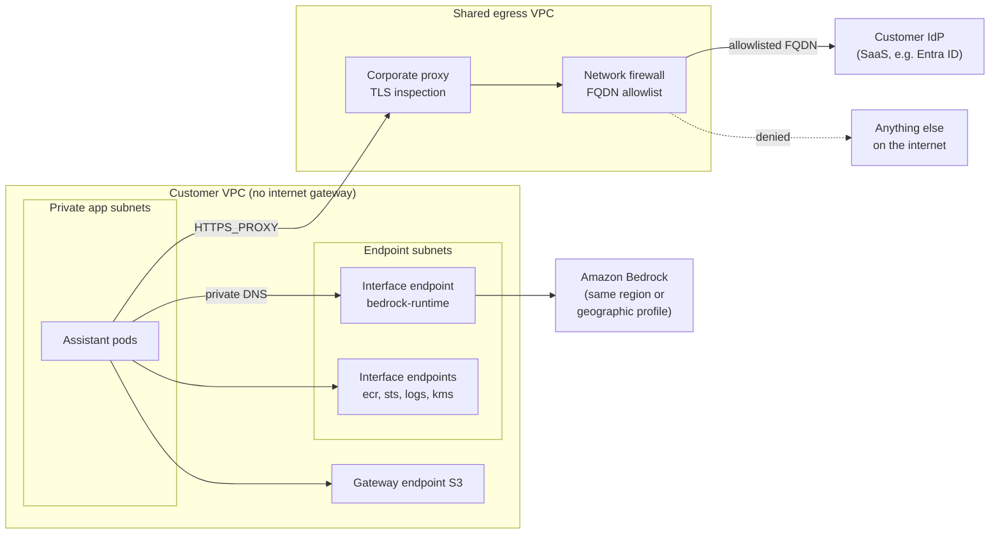

# Network & Data Constraints: Private Endpoints, Proxies, Egress Allowlists, Data Residency

!!! abstract "Key takeaways"
    - **Enterprise networks are deny-by-default.** Workloads sit in private subnets with no internet gateway; anything outbound goes through a corporate proxy or firewall with an **FQDN allowlist**, and each new destination is a change request with a lead time.
    - **Private endpoints keep cloud traffic off the internet:** AWS PrivateLink interface endpoints, Azure Private Link private endpoints (plus private DNS zones), Google Private Service Connect and VPC Service Controls. Combine them with **endpoint policies** and "public network access disabled" on the service.
    - **Proxies break things quietly:** `NO_PROXY` syntax differs per runtime, Java ignores the env vars, TLS inspection needs the corporate root CA in every trust store, and some proxies buffer streaming responses. **Never fix a TLS error by disabling verification.**
    - **Produce an egress inventory before install day:** every hostname the product calls, why, and whether it goes private, via proxy, or is removed. Hidden runtime downloads and telemetry are the usual surprises.
    - **Residency has three parts:** where data is **stored**, where it is **processed** (model inference may cross regions: Bedrock global vs geographic inference profiles, Azure Global vs Data Zone vs Regional deployments), and who can **access** it (support, sub-processors). Logs, backups and eval datasets count too.

## Why it matters

The demo ran on a laptop with open internet. The customer's production subnet has no route to the internet at all. On install day the pods crash because they can't reach a model API, a package mirror, a tokenizer download, or the vendor's telemetry endpoint. Each fix needs a firewall change ticket that takes two weeks. This is the single most common reason FDE deployments slip.

Network and data constraints come from three places:

1. **Security architecture:** banks, payers and governments segment networks and inspect all outbound traffic to stop data exfiltration and command-and-control malware.
2. **Regulation and contracts:** GDPR transfer rules, national data-localisation laws, HIPAA business associate agreements and customer contracts dictate where data may be stored and processed (the legal side is in [Security reviews](04-security-reviews-and-compliance-questionnaires-soc-2-hipaa-g.md)).
3. **Cloud governance:** service control policies (SCPs) and Azure Policy restrict regions and services; models outside the approved regions are simply unavailable.

The networking fundamentals (VPCs, subnets, security groups, NACLs, route tables) are in [AWS Networking](../aws/09-networking-vpc-subnets-security-groups-vs-nacls-route-53-clo.md) and Kubernetes networking in [Services, Ingress & Networking](../docker-kubernetes/04-services-ingress-and-networking.md). This page is about the constraints you meet in a customer's environment.

## Core concepts

### A typical locked-down AI deployment


*Notice the two different exits: AWS service traffic goes through private endpoints and never touches the proxy, while the few remaining internet destinations go through the proxy and firewall allowlist. Anything not on either path fails.*

### Private endpoints, per cloud

| | AWS | Azure | Google Cloud |
|---|---|---|---|
| Mechanism | **PrivateLink interface endpoint**: ENIs with private IPs in your subnets; **gateway endpoints** for S3 and DynamoDB | **Private endpoint**: a NIC in your VNet mapped to one resource (an Azure OpenAI/Foundry account, storage account, Key Vault) | **Private Service Connect** endpoints; **Private Google Access** for Google APIs from private IPs |
| DNS | Private DNS on the endpoint makes the public name (`bedrock-runtime.<region>.amazonaws.com`) resolve to private IPs | Private DNS zones such as `privatelink.openai.azure.com`, linked to the VNet (and to on-prem DNS forwarders) | Private DNS zones for `*.googleapis.com` or PSC endpoint names |
| Extra fence | **Endpoint policy** (which principals, actions, resources via this endpoint); `aws:SourceVpce` conditions on resource policies | Disable **public network access** on the resource; network security groups | **VPC Service Controls** perimeter: blocks API access from outside the perimeter, the main exfiltration control |
| AI services | `bedrock`, `bedrock-runtime`, agent and AgentCore endpoints | Azure OpenAI / Microsoft Foundry resources, AI Search | Vertex AI (now delivered as Gemini Enterprise Agent Platform) endpoints; coverage per feature in Google's generative AI security-controls table |

Three points interviewers probe:

- **Private endpoint ≠ private data.** It controls the network path, not what the service does with the data. Pair it with the service's data-handling terms (Bedrock does not store prompts by default; Azure OpenAI's abuse-monitoring retention; see [Cloud AI platforms](06-cloud-ai-platforms-amazon-bedrock-azure-openai-vertex-ai.md)).
- **DNS is where it breaks.** Hybrid networks forward DNS from on-prem to the cloud; if the private zone isn't linked or forwarded, clients resolve the public IP and the firewall drops them. `nslookup` from inside the pod is the first debugging step.
- **Vendor-hosted APIs can be private too.** A SaaS vendor can publish a PrivateLink *endpoint service* (behind a Network Load Balancer) so the customer reaches the hosted API without internet. Many AI vendors and data platforms offer this for enterprise tiers.

### Corporate proxies

Most enterprises force outbound HTTP(S) through an explicit proxy. Your application must:

- **Honour proxy settings in every runtime.** Python `requests`/`httpx`, Go and Node's newer clients read `HTTPS_PROXY`/`NO_PROXY` (with varying rules); the JVM does **not** read those env vars by default, so pass `-Dhttps.proxyHost`, `-Dhttps.proxyPort` and `-Dhttp.nonProxyHosts` (pipe-separated, `*` wildcards) or configure the HTTP client explicitly.
- **Exclude internal traffic** via `NO_PROXY`: cluster service names (`.svc`, `.cluster.local`), pod and service CIDRs, the instance metadata address (`169.254.169.254`), and private-endpoint hostnames. CIDR support in `NO_PROXY` varies by library; list hostnames as well.
- **Trust the inspection CA.** TLS-inspecting proxies re-sign traffic with a corporate root CA. Add it to the OS trust store in the image or mount it: Java truststore, `REQUESTS_CA_BUNDLE`/`SSL_CERT_FILE` for Python, `NODE_EXTRA_CA_CERTS` for Node. Certificate pinning in a client library will fail behind inspection; ask for a bypass for that destination.
- **Survive streaming.** Some proxies buffer responses, which breaks server-sent events used for token streaming, or drop long-lived connections; agree timeouts and test streaming through the real proxy early.
- **Handle authentication.** Some proxies require NTLM/Kerberos; ask for an unauthenticated path for service workloads, scoped by source subnet.

### Egress allowlists

Security teams allowlist by **FQDN**, not IP: cloud and SaaS IPs change constantly. Enforcement points include AWS Network Firewall (domain lists matched on TLS SNI and HTTP Host), Azure Firewall application rules, Google Cloud NGFW / Secure Web Proxy, Squid or Zscaler. Inside the cluster, Kubernetes NetworkPolicies restrict which pods may talk to the proxy at all.

Your deliverable is an **egress inventory**:

| Destination | Purpose | Route | Data sent | Required? |
|---|---|---|---|---|
| `bedrock-runtime.eu-central-1.amazonaws.com` | Model inference | Private endpoint | Prompts with PHI | Yes |
| `login.microsoftonline.com` | OIDC discovery, JWKS, token | Proxy, allowlisted | Auth codes, tokens | Yes |
| `graph.microsoft.com` | Group overage lookup | Proxy, allowlisted | User object ID | Only if overage |
| `huggingface.co` | Tokenizer download at start-up | **Remove**: bake into image | None | No |
| `telemetry.vendor.example` | Product analytics | **Disabled** by default | Usage metadata | No |

Build it by running the product in a test namespace with all egress denied and logging DNS lookups, not by reading code and hoping.

### Data residency

"Data must stay in the EU" breaks down into questions you answer one by one:

1. **At rest:** databases, vector index, object storage, logs, traces, backups, eval datasets, model fine-tuning data. All in approved regions, encrypted with the customer's keys where required ([Cloud KMS](../cryptography-key-management/04-cloud-kms.md)).
2. **In processing:** where model inference runs. Cloud AI platforms trade residency for capacity:
    - **Amazon Bedrock** cross-region inference: *geographic* inference profiles (for example `eu.` or `us.` prefixes) keep processing within that geography; *global* profiles may route to any supported commercial region for more throughput and lower price, and need an SCP exception for the "unspecified" region. AWS states that stored data (logs, knowledge bases) stays in the source region.
    - **Azure OpenAI in Microsoft Foundry** deployment types: *Global* (any Foundry location), *Data Zone* (within a Microsoft-defined zone such as the EU or US) and *Regional/Standard* (one region), each also available as provisioned throughput.
    - **Google Vertex AI / Gemini Enterprise Agent Platform:** regional endpoints versus the `global` endpoint; check the generative AI security-controls table per model for data-residency support.
3. **In access:** who can see the data: your support engineers (from which countries?), the model provider (abuse monitoring), sub-processors. Remote support from outside the region can be a transfer under GDPR.
4. **In transit:** routes stay on the provider's backbone with private endpoints, but "processing in region" is still a contractual statement, not a network one.

## In practice: code & configuration

### Terraform: Bedrock runtime over PrivateLink with an endpoint policy

Validated with `terraform validate` and `terraform fmt -check` (Terraform 1.9.8, AWS provider 6.49.0); not applied.

```hcl
# Private access to Amazon Bedrock runtime from the customer's VPC (AWS PrivateLink).
terraform {
  required_version = ">= 1.6"
  required_providers {
    aws = { source = "hashicorp/aws", version = "~> 6.0" }
  }
}

variable "region" { type = string }
variable "vpc_id" { type = string }
variable "private_subnet_ids" { type = list(string) } # one per AZ the app runs in
variable "app_security_group_id" { type = string }    # SG attached to the app pods/nodes
variable "app_role_arn" { type = string }             # IAM role the app assumes (e.g. IRSA / Pod Identity)
variable "allowed_model_arns" { type = list(string) } # foundation-model and inference-profile ARNs

provider "aws" { region = var.region }

# Only the app's security group may reach the endpoint, and only on 443.
resource "aws_security_group" "bedrock_endpoint" {
  name_prefix = "bedrock-runtime-endpoint-"
  description = "HTTPS from the assistant app to the Bedrock runtime endpoint"
  vpc_id      = var.vpc_id
}

resource "aws_vpc_security_group_ingress_rule" "from_app" {
  security_group_id            = aws_security_group.bedrock_endpoint.id
  referenced_security_group_id = var.app_security_group_id
  ip_protocol                  = "tcp"
  from_port                    = 443
  to_port                      = 443
}

resource "aws_vpc_endpoint" "bedrock_runtime" {
  vpc_id              = var.vpc_id
  service_name        = "com.amazonaws.${var.region}.bedrock-runtime"
  vpc_endpoint_type   = "Interface"
  subnet_ids          = var.private_subnet_ids
  security_group_ids  = [aws_security_group.bedrock_endpoint.id]
  private_dns_enabled = true # SDKs keep using bedrock-runtime.<region>.amazonaws.com

  # Endpoint policy: a second fence on top of IAM. Only our app role, only invoke, only approved models.
  policy = jsonencode({
    Version = "2012-10-17"
    Statement = [{
      Sid       = "InvokeApprovedModelsOnly"
      Effect    = "Allow"
      Principal = { AWS = var.app_role_arn }
      Action = [
        "bedrock:InvokeModel",
        "bedrock:InvokeModelWithResponseStream",
        "bedrock:Converse",
        "bedrock:ConverseStream",
      ]
      Resource = var.allowed_model_arns
    }]
  })

  tags = { Name = "bedrock-runtime", owner = "assistant-platform" }
}

output "bedrock_runtime_endpoint_id" { value = aws_vpc_endpoint.bedrock_runtime.id }
```

When the app uses a cross-region inference profile, `allowed_model_arns` must include both the inference-profile ARN and the foundation-model ARNs in the destination regions, or calls fail with access denied. A customer SCP that denies requests outside approved regions has the same effect; check it before blaming the endpoint.

### Terraform: FQDN egress allowlist (AWS Network Firewall)

Validated with `terraform validate` (same versions); not applied.

```hcl
# Stateful domain allowlist in the shared egress VPC: only these FQDNs may be reached.
resource "aws_networkfirewall_rule_group" "assistant_egress" {
  name     = "assistant-egress-allowlist"
  type     = "STATEFUL"
  capacity = 100
  rule_group {
    rules_source {
      rules_source_list {
        generated_rules_type = "ALLOWLIST"
        target_types         = ["TLS_SNI", "HTTP_HOST"]
        targets = [
          "login.microsoftonline.com", # customer IdP (OIDC discovery, JWKS)
          "graph.microsoft.com",       # group overage lookups
          ".payer.service-now.com",    # leading dot = domain and its subdomains
        ]
      }
    }
  }
  tags = { owner = "network-security", change = "CHG-12345" }
}
```

### Proxy and TLS inspection: wrong vs right

=== "❌ Common mistake"
    ```python
    # "It works now" - and it fails the security review and the first audit.
    import requests, urllib3
    urllib3.disable_warnings()
    r = requests.get(idp_discovery_url, verify=False)   # disables TLS verification: MITM-able
    ```
    ```bash
    # Java service: env vars set, but the JVM ignores HTTPS_PROXY -> connect timeouts to the IdP
    export HTTPS_PROXY=http://proxy.corp.example:3128
    java -jar assistant.jar
    ```

=== "✅ Correct approach"
    ```yaml
    # Helm values (chart in the Packaging page): proxy + corporate CA as configuration
    proxy:
      httpsProxy: http://proxy.corp.example:3128
      noProxy: ".svc,.cluster.local,10.0.0.0/8,169.254.169.254,bedrock-runtime.eu-central-1.amazonaws.com"
      caBundleConfigMap: corp-root-ca      # mounted at /etc/corp-ca/ca.crt
    ```
    ```bash
    # Python: trust the corporate CA (bundle = public roots + corp root), keep verification on
    export REQUESTS_CA_BUNDLE=/etc/corp-ca/ca.crt SSL_CERT_FILE=/etc/corp-ca/ca.crt
    # Node: add, don't replace, roots
    export NODE_EXTRA_CA_CERTS=/etc/corp-ca/ca.crt
    # Java: JVM proxy properties + truststore containing the corp root
    java -Dhttps.proxyHost=proxy.corp.example -Dhttps.proxyPort=3128 \
         -Dhttp.nonProxyHosts="*.svc|*.cluster.local|10.*|169.254.169.254|bedrock-runtime.eu-central-1.amazonaws.com" \
         -Djavax.net.ssl.trustStore=/etc/corp-ca/truststore.p12 -Djavax.net.ssl.trustStoreType=PKCS12 \
         -jar assistant.jar
    ```
    For Java, build the truststore in the image or an init container (public roots plus the corporate root), and if it needs a password, load it from a secret rather than the command line.

### Egress plan: route every outbound call before go-live

This ran offline. It applies `NO_PROXY`-style matching and the firewall allowlist to the inventory, so the firewall change request is complete in one go.

```python
# egress_plan.py - list every outbound call and decide its route (ran offline).
import ipaddress
from urllib.parse import urlparse

NO_PROXY = [".svc", ".cluster.local", "10.0.0.0/8", "bedrock-runtime.eu-central-1.amazonaws.com"]
PROXY_ALLOWLIST = {"login.microsoftonline.com", "graph.microsoft.com"}   # FQDNs approved by the firewall team

def bypasses_proxy(host: str) -> bool:
    for entry in NO_PROXY:
        try:
            if ipaddress.ip_address(host) in ipaddress.ip_network(entry, strict=False):
                return True
            continue
        except ValueError:
            pass                                    # not an IP/CIDR pair; compare as a name
        if entry.startswith(".") and host.endswith(entry):
            return True
        if host == entry or host.endswith("." + entry):
            return True
    return False

def route(url: str) -> str:
    host = urlparse(url).hostname or ""
    if bypasses_proxy(host):
        return "direct (private endpoint / in-cluster)"
    if host in PROXY_ALLOWLIST:
        return "via proxy (allowlisted)"
    return "BLOCKED: request firewall change or remove the dependency"
```
```text
direct (private endpoint / in-cluster)                     bedrock-runtime.eu-central-1.amazonaws.com
via proxy (allowlisted)                                    login.microsoftonline.com
direct (private endpoint / in-cluster)                     vector-db.assistant.svc
direct (private endpoint / in-cluster)                     10.20.8.15
BLOCKED: request firewall change or remove the dependency  huggingface.co
BLOCKED: request firewall change or remove the dependency  telemetry.vendor.example
```

## Real-world usage

- **Financial services and healthcare** commonly run "no internet from workload subnets" with centralised inspection VPCs (AWS Transit Gateway plus Network Firewall, Azure hub-and-spoke with Azure Firewall). AI vendors that need open internet don't get past architecture review.
- **Cloud AI behind private endpoints** is now the standard enterprise pattern: Bedrock via PrivateLink, Azure OpenAI/Foundry with public network access disabled and private endpoints, Vertex AI within a VPC Service Controls perimeter. Microsoft notes that end-to-end network isolation is not supported for every new Foundry experience (for example parts of the new portal and newer Agent Service versions as of 2026), so check feature-level support.
- **Residency-driven choices:** EU customers often pick Bedrock geographic (EU) profiles or Azure Data Zone (EU) deployments, accepting lower quota than global options. Teams that switched to global routing for capacity have had to walk it back after a privacy review.
- **Failure modes:** private DNS zone not linked to the VNet; SSE streams cut at the proxy's 60-second idle timeout; corporate CA rotated and every pod's TLS failed the next morning; `NO_PROXY` missing the metadata endpoint so pod credentials broke; a Python dependency downloading a model on first import.

## Trade-offs & production gotchas

| Option | Pros | Cons | Use when |
|---|---|---|---|
| Private endpoints to cloud services | No internet path; policy fence; residency story | Cost per endpoint per AZ; DNS complexity | Always for regulated data in the customer's cloud |
| Proxy + FQDN allowlist | Central control and logging | Change lead time; TLS inspection breakage; streaming issues | SaaS destinations (IdP, ticketing) that have no private option |
| Vendor PrivateLink endpoint service | Private access to a hosted API | Same-region constraint; vendor must offer it | Hosted model with regulated data |
| Global inference routing | Highest capacity, lower price | Processing may leave the geography | No residency constraint or explicitly approved |
| Geographic / Data Zone / Regional | Residency within a boundary | Lower quotas, fewer models | EU or national residency requirements |

!!! warning "Gotcha: disabling TLS verification"
    `verify=False`, `-k`, `InsecureSkipVerify` or a trust-all `TrustManager` "to get past the proxy" will be found by the customer's code scanner or pen test and will cost you trust you can't easily win back. Get the corporate root CA and add it.

!!! warning "Gotcha: residency includes logs and evals"
    Teams pin inference to the EU and then ship traces with full prompts to a US-hosted observability SaaS, or copy production samples to a laptop to build an eval set. List every copy of the data in the data-flow diagram.

!!! tip "Interview angle"
    Lead with process, not packets: "On week one I'd ask for the network diagram, proxy and CA details and region constraints, then send an egress inventory so the firewall changes are done before install day."

## How this connects to my experience

- **Where I used it:**
    - **Coriolis CCKM:** key management "supporting AWS, Azure, and GCP environments" with "AWS KMS, encryption services, and cloud security workflows". Calling three cloud KMS APIs and on-prem HSMs (Thales Luna, SafeNet) from a customer-controlled product is exactly the multi-cloud endpoint, DNS, firewall and TLS-trust problem on this page. *[confirm: whether customers reached cloud KMS through proxies or private endpoints, and how HSM network connectivity was set up]*
    - **Deloitte ConvergeHealth:** AWS services (EKS, ECS, Lambda, RDS, S3, SQS) with IAM/KMS/Secrets Manager controls, provisioned with Terraform: the same building blocks as the VPC endpoint module above. *[confirm: whether you configured VPC endpoints, private subnets or NAT for that platform]*
    - **AWS Solutions Architect – Associate (2023):** VPC design, endpoints, PrivateLink and hybrid DNS are core exam content.
- **Talking points:**
    - "In key management, the network path is part of the security story: the customer wants to show auditors that key material and API calls never cross the public internet. I'd bring the same rigour to model inference traffic."
    - "I'd produce an egress inventory from a no-egress test run, so the firewall team gets one complete change request."
    - "For residency I separate storage, processing and access, and check how the cloud AI platform routes inference before choosing a deployment type."
- **Likely follow-up chain:** "The customer has no internet egress. How do you call the model?" → "DNS resolves to a public IP. Why?" → "Their proxy does TLS inspection and your Java service fails. Fix?" → "Legal says EU-only. What do you change?". Answer: private endpoint plus endpoint policy; private DNS not enabled or zone not linked/forwarded; JVM proxy properties plus corporate CA in the truststore, never disable verification; EU geographic inference profile or Data Zone deployment, EU-region storage, logs and support access reviewed.

## Interview questions

### Fundamentals

??? question "Q1. What is AWS PrivateLink and how does an interface endpoint work?"
    **Answer:** PrivateLink exposes a service through elastic network interfaces with private IPs in your subnets. With private DNS enabled, the service's normal hostname resolves to those private IPs inside the VPC, so SDKs work unchanged and traffic never uses an internet gateway or NAT. You control access with the endpoint's security group and an endpoint policy, and resource policies can require `aws:SourceVpce`. Gateway endpoints (S3, DynamoDB) work through route tables instead.

    **Interviewer listens for:** ENIs; private DNS; SG plus endpoint policy; interface vs gateway.

    **Common wrong answer:** "It's a VPN to AWS."

??? question "Q2. What's the Azure and Google equivalent?"
    **Answer:** Azure Private Link: a private endpoint NIC in your VNet for a specific resource (for example an Azure OpenAI/Foundry account), with a private DNS zone like `privatelink.openai.azure.com`, and public network access disabled on the resource. Google: Private Service Connect endpoints and Private Google Access for Google APIs, with VPC Service Controls perimeters to stop data leaving approved projects.

    **Interviewer listens for:** private DNS zones; disable public access; VPC-SC as exfiltration control.

    **Common wrong answer:** naming VNet peering or Cloud VPN.

??? question "Q3. Why do security teams allowlist by FQDN rather than IP?"
    **Answer:** Cloud and SaaS IP ranges are large and change frequently, so IP allowlists are either too broad or break. FQDN allowlists match on TLS SNI or HTTP Host (or the proxy's CONNECT target) and express intent ("only our IdP"). Their weakness is that SNI can be spoofed without TLS inspection, which is why many enterprises combine FQDN rules with inspection.

    **Interviewer listens for:** IP churn; SNI/Host matching; limitation.

    **Common wrong answer:** "IP allowlists are more secure, so use them."

### Intermediate

??? question "Q4. Your service works in dev but times out reaching the IdP in the customer's cluster. How do you debug?"
    **Answer:** From inside the pod: resolve the hostname (`nslookup`/`dig`), check whether proxy env vars or JVM properties are set, try `curl -v` through the proxy, inspect the certificate chain the proxy presents. Typical causes: no proxy configured for the JVM, destination not allowlisted, `NO_PROXY` sending it direct, corporate CA missing, or a NetworkPolicy blocking egress to the proxy. Fix in configuration and add it to the preflight.

    **Interviewer listens for:** systematic layers: DNS, route, proxy, TLS, policy.

    **Common wrong answer:** "Ask them to open outbound internet."

??? question "Q5. How do you handle a TLS-inspecting proxy?"
    **Answer:** Get the corporate root CA and add it to every runtime trust store (OS bundle in the image, Java truststore, `REQUESTS_CA_BUNDLE`, `NODE_EXTRA_CA_CERTS`), delivered as a ConfigMap so rotation doesn't need a rebuild. Ask for inspection bypass for destinations that use certificate pinning or mutual TLS. Never disable verification. Test streaming responses through the proxy.

    **Interviewer listens for:** trust store per runtime; rotation; bypass for pinning/mTLS; never disable.

    **Common wrong answer:** `verify=False` "temporarily".

??? question "Q6. What does 'data residency' mean for an LLM application?"
    **Answer:** Storage, processing and access. Store all data (DBs, vector index, logs, traces, backups, eval sets) in approved regions. Make sure inference runs in the approved geography: on Bedrock use in-region or geographic inference profiles rather than global; on Azure choose Regional or Data Zone deployments rather than Global; on Vertex use regional endpoints. Control who can access data from where, including vendor support and model-provider abuse monitoring, and document sub-processors.

    **Interviewer listens for:** three dimensions; platform-specific routing options; logs and support.

    **Common wrong answer:** "Pick an EU region for the database."

### Senior

??? question "Q7. How would you design egress for an assistant that calls Bedrock, the customer's Entra ID and ServiceNow?"
    **Answer:** Bedrock via a PrivateLink interface endpoint with private DNS, an endpoint policy limited to the app role and approved models, and SG ingress only from the app. Entra ID and ServiceNow via the corporate proxy with FQDN allowlist entries, corporate CA trusted, and NetworkPolicy allowing pods to reach only the proxy and endpoint subnets. Other AWS dependencies (ECR, STS, CloudWatch Logs, KMS) through their own endpoints. Document it in the egress inventory and data-flow diagram, and test with all other egress denied.

    **Interviewer listens for:** split private vs proxy; policies at each layer; inventory; deny-all test.

    **Common wrong answer:** "Put it in a public subnet with a NAT gateway."

??? question "Q8. A customer wants higher throughput, and the team proposes Bedrock global cross-region inference. What do you check?"
    **Answer:** Whether processing outside the geography is allowed by their residency requirements, contracts and DPIA. AWS documents that global profiles can route to any supported commercial region (with stored data such as logs staying in the source region), and SCPs must allow the "unspecified" region condition. If residency matters, use a geographic profile, request quota increases, or buy provisioned throughput. Get written approval from the customer's privacy team if they accept global routing.

    **Interviewer listens for:** residency vs capacity trade-off; SCP impact; alternatives; written approval.

    **Common wrong answer:** "It's still AWS, so it's fine."

??? question "Q9. How do you prevent data exfiltration from an AI workload beyond network controls?"
    **Answer:** Combine layers: private endpoints with endpoint and resource policies, VPC Service Controls perimeters on Google, FQDN egress allowlists, no general internet from workload subnets, least-privilege IAM, tool allowlists for agents (no arbitrary URL fetch), output filtering for secrets and PII, and monitoring of unusual egress volume and DNS queries. Prompt injection can turn an agent's web-fetch tool into an exfiltration channel, so tool design matters as much as firewalls.

    **Interviewer listens for:** defence in depth; agent tools as egress; DNS monitoring.

    **Common wrong answer:** "The firewall handles it."

### Scenario-based

??? question "Q10. Install day: pods crash-loop with 'connection timed out' to huggingface.co. What happened and what's the long-term fix?"
    **Answer:** A library downloads a tokenizer or model on start-up, which works on open networks and fails in a no-egress subnet. Short term: pre-download the asset and mount it, or set the library's offline mode with a local path. Long term: bake all runtime assets into the image, add a CI test that starts the product with egress denied, and include the egress inventory in the release checklist.

    **Interviewer listens for:** root cause; offline mode; CI no-egress test.

    **Common wrong answer:** "Ask the customer to allowlist Hugging Face."

??? question "Q11. An EU bank requires all processing in the EU and no access from outside the EU. Your support team is in India and the US. What do you do?"
    **Answer:** Deploy in EU regions with EU-only inference (geographic profile or Data Zone), customer-managed keys, and logs in the EU. For support, default to no access to customer data: troubleshoot with metadata and customer-run diagnostics, and use customer-approved, recorded sessions where the customer's engineer shares only what's needed. If remote access to personal data from outside the EU is unavoidable, that's a transfer under GDPR needing SCCs and a transfer impact assessment, which the bank may refuse, so plan an EU-based support rota for break-glass. Document it in the DPA.

    **Interviewer listens for:** access as part of residency; support model; GDPR transfer mechanism.

    **Common wrong answer:** "Data is in the EU, so support location doesn't matter."

## Cheat sheet

| Concept | Remember |
|---|---|
| Default posture | Private subnets, no IGW, proxy + FQDN allowlist, change lead time |
| AWS | PrivateLink interface endpoints + private DNS + SG + endpoint policy; gateway endpoints for S3/DynamoDB |
| Azure | Private endpoint + `privatelink.*` DNS zone + public network access disabled |
| Google | Private Service Connect, Private Google Access, VPC Service Controls perimeter |
| Proxy | JVM ignores `HTTPS_PROXY`; `NO_PROXY` varies; add corp CA, never disable TLS; test streaming |
| Egress inventory | Every host, purpose, route, data sent, required?; built from a deny-all test |
| Residency | Stored · processed · accessed; logs, backups, evals count |
| Bedrock routing | In-region, geographic (`eu.`/`us.`), global (any commercial region, SCP "unspecified") |
| Azure routing | Global · Data Zone · Regional (and provisioned variants) |

## Sources
1. [Amazon Bedrock: Use interface VPC endpoints (AWS PrivateLink)](https://docs.aws.amazon.com/bedrock/latest/userguide/vpc-interface-endpoints.html): `bedrock` / `bedrock-runtime` service names, private DNS, endpoint policies.
2. [Amazon Bedrock: Geographic cross-Region inference](https://docs.aws.amazon.com/bedrock/latest/userguide/geographic-cross-region-inference.html) and [Global cross-Region inference](https://docs.aws.amazon.com/bedrock/latest/userguide/global-cross-region-inference.html): residency behaviour, SCP "unspecified" region.
3. [AWS PrivateLink concepts](https://docs.aws.amazon.com/vpc/latest/privatelink/concepts.html): interface endpoints, endpoint services, private DNS.
4. [AWS Network Firewall: Stateful domain list rule groups](https://docs.aws.amazon.com/network-firewall/latest/developerguide/stateful-rule-groups-domain-names.html): FQDN allowlists on TLS SNI and HTTP Host.
5. [Microsoft Learn: Azure OpenAI deployment types](https://learn.microsoft.com/en-us/azure/ai-foundry/openai/how-to/deployment-types): Global, Data Zone and Regional processing locations.
6. [Microsoft Learn: Configure Private Link for Microsoft Foundry](https://learn.microsoft.com/en-us/azure/foundry/how-to/configure-private-link): private endpoints, public network access flag, isolation limitations.
7. [Google Cloud: Generative AI security controls](https://docs.cloud.google.com/vertex-ai/generative-ai/docs/security-controls): data residency, CMEK, VPC-SC support per model and feature.
8. [Google Cloud: VPC Service Controls overview](https://cloud.google.com/vpc-service-controls/docs/overview): service perimeters and exfiltration protection.
9. [Oracle: Java Networking and Proxies](https://docs.oracle.com/javase/8/docs/technotes/guides/net/proxies.html) and [Networking Properties](https://docs.oracle.com/javase/8/docs/technotes/guides/net/properties.html): `https.proxyHost`, `http.nonProxyHosts`.
10. [Kubernetes: Network Policies](https://kubernetes.io/docs/concepts/services-networking/network-policies/): pod-level egress restriction.
