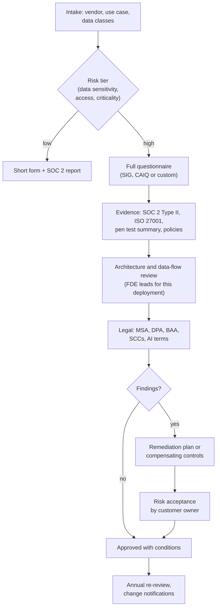

# Security Reviews & Compliance Questionnaires: SOC 2, HIPAA, GDPR, DPAs

!!! abstract "Key takeaways"
    - **The security review is usually the longest lead-time item** in an enterprise deployment (often weeks to months). Start it in week one of the pilot, not after the demo succeeds.
    - **Know what each artefact proves:** a **SOC 2 Type II** report is an auditor's opinion that controls *operated* over a period (Security is the only mandatory Trust Services category); ISO 27001 is a certification of the management system; there is **no such thing as HIPAA certification**.
    - **Contracts carry the obligations:** a **BAA** is required before a business associate handles PHI (45 CFR 164.504(e)); a **DPA** under GDPR Art. 28 binds a processor to the controller's instructions, sub-processor rules, security and deletion. International transfers need adequacy (e.g. the EU-US Data Privacy Framework) or SCCs.
    - **AI adds a predictable set of questions:** is data used for training, how long are prompts retained, who are the model sub-processors, where does inference run, can outputs be audited, how do you handle prompt injection and harmful output. Have reviewed answers ready.
    - **Answer accurately, scoped and with evidence.** Use an answer bank, say which deployment model each answer covers, admit gaps with compensating controls, and never overclaim. One false "Yes" found later destroys the trust the review was meant to build.

## Why it matters

Enterprises run **third-party risk management** (TPRM) on every vendor that touches their data. Before your AI assistant sees a real document, the customer's security, privacy, legal and sometimes AI-governance teams will send a questionnaire, ask for your audit reports, review your architecture and data flows, and negotiate contract terms. Many AI pilots end in "pilot purgatory" not because the model failed but because nobody started this process (see [Pilot to production](../fde-customer-discovery/03-pilot-to-proof-of-concept-to-production-time-boxing-exit-cri.md)).

An FDE doesn't replace the vendor's security and legal teams, but is often the person who:

- knows the actual architecture and data flows of *this* deployment (which differ from the standard SaaS answers),
- translates the customer's concerns into engineering controls,
- unblocks the review by answering the technical follow-ups quickly and correctly.

The legal background for HIPAA and GDPR is in [Compliance & Data Privacy](../compliance-privacy/index.md); keys and encryption in [Cloud KMS](../cryptography-key-management/04-cloud-kms.md) and [HSMs & BYOK/HYOK](../cryptography-key-management/05-hsms-and-byok-hyok.md).

## Core concepts

### The review process


*Notice that the architecture review and legal terms run after the questionnaire and evidence, and that findings rarely block outright: most end as a remediation plan with dates, or a documented risk acceptance by a named customer owner.*

Ways to make it faster:

- **Ask for their process and questionnaire on day one,** along with the names of the security and privacy reviewers.
- **Offer a trust package up front:** SOC 2 Type II report (under NDA), ISO 27001 certificate and Statement of Applicability, latest pen test executive summary, sub-processor list, standard DPA and BAA, architecture and data-flow diagrams, and a completed standard questionnaire (CAIQ or SIG Lite).
- **Scope it to the deployment model.** In a customer-VPC install many controls (network, storage encryption, logging, backups, access) are the customer's; say so explicitly. In hosted mode, they're yours. The answers differ (see [Deployment models](01-deployment-models-hosted-api-vs-customer-vpc-vs-on-prem-and.md)).
- **Hold a live session** with their reviewers to walk through the data flow. One hour of conversation often replaces three rounds of written follow-ups.

{ loading=lazy }
*The review takes just as long in both rows; starting it in parallel is what removes the wait.*

### Standard questionnaires

| Questionnaire | From | Notes |
|---|---|---|
| **SIG** (Standardized Information Gathering) | Shared Assessments | Licensed; full SIG Core is large, SIG Lite much shorter; common in financial services, insurance and healthcare |
| **CAIQ** (Consensus Assessments Initiative Questionnaire) | Cloud Security Alliance | Free; yes/no questions mapped to the Cloud Controls Matrix (CCM and CAIQ v4.1 released January 2026); vendors can publish to the CSA STAR registry (STAR Level 1) |
| **HECVAT** | EDUCAUSE | Higher education |
| **Custom** | Customer TPRM team | Often derived from SIG/NIST CSF/ISO 27001 with AI-specific additions |

Question counts vary by version and source; check the current edition before quoting numbers.

### SOC 2 in one screen

- **What it is:** an attestation report by an independent CPA firm under AICPA standards, against the **Trust Services Criteria** (TSC, 2017, with points of focus revised in 2022). It's an *opinion*, not a certificate.
- **Categories:** **Security** (the common criteria, CC1–CC9) is mandatory; **Availability, Confidentiality, Processing Integrity and Privacy** are optional and chosen by the vendor.
- **Type I vs Type II:** Type I says controls were suitably *designed* at a point in time. Type II says they *operated effectively* over a period (commonly 6–12 months) and includes the auditor's test results and exceptions. Enterprises want Type II.
- **How to read one (what the customer's reviewer does):** the system description and scope (is the product you're buying in scope?), the period, exceptions in testing, **sub-service organisations** (carved out, like the cloud provider, so their own reports matter) and **complementary user entity controls (CUECs)**, which are the controls the customer must operate themselves.
- **Bridge letter:** a vendor statement covering the gap between the report period end and today.
- Related: **ISO/IEC 27001:2022** certifies an information security management system; **ISO/IEC 42001:2023** is the AI management system standard that AI-governance teams increasingly ask about.

### HIPAA and BAAs

- **Who:** HIPAA applies to *covered entities* (health plans, providers, clearinghouses) and their *business associates* (vendors that create, receive, maintain or transmit PHI on their behalf). An AI vendor processing a payer's claims is a business associate; the vendor's cloud and model providers handling PHI are *subcontractor* business associates.
- **BAA:** required before PHI flows (45 CFR 164.502(e), 164.504(e)). It limits use and disclosure to the contracted purpose, requires Security Rule safeguards, breach reporting to the covered entity (without unreasonable delay and within 60 days of discovery under 164.410), flow-down BAAs with subcontractors, and return or destruction of PHI at termination.
- **The chain must be complete.** If your hosted product calls a model API, the model provider must have signed a BAA with you **for the specific endpoints and features you use**: major providers limit BAA coverage to eligible services (for example, AWS lists HIPAA-eligible services, and model providers scope BAAs to particular APIs and zero-retention settings). In a customer-VPC deployment using the customer's own Bedrock or Azure OpenAI, the customer's BAA with their cloud provider covers inference, which is a strong argument for that model.
- **No certification:** HHS does not certify vendors. Say "we sign BAAs and operate controls mapped to the Security Rule, evidenced in our SOC 2 Type II", never "HIPAA certified".
- **Rule changes:** HHS proposed a major Security Rule update in January 2025 (mandatory MFA, encryption, asset inventories); as of October 2026 the regulatory agenda reportedly moved final action to around July 2027 *[verify]*. The current rule remains in force.

![Two panels. Hosted product: the covered entity signs a BAA with your product, the business associate, which signs a BAA with its cloud or model provider for eligible APIs only; a new fallback model or embeddings API without a BAA breaks the chain. Customer-VPC deployment: your software runs in the payer's cloud account beside Bedrock or Azure OpenAI, and inference sits under the payer's own BAA with its cloud provider. Terms include purpose-limited use, Security Rule safeguards, breach reporting within 60 days, flow-down and return or destruction of PHI.](images/04-baa-chain.svg){ loading=lazy }
*The red box is the common way the chain breaks after approval: a new provider added without its own BAA.*

### GDPR, DPAs and transfers

- **Roles:** the customer is usually the **controller**; you (and your sub-processors) are **processors**. Art. 28 requires a written contract, the **DPA**, that binds the processor to: process only on documented instructions; confidentiality; Art. 32 security measures; engaging sub-processors only with prior authorisation and flow-down terms; assisting with data subject requests, breach notification and DPIAs; deleting or returning data at the end; and allowing audits.
- **Breach timing:** the controller notifies the supervisory authority within 72 hours where feasible (Art. 33); the processor must notify the controller "without undue delay". Customers usually push for a fixed number of hours in the DPA.
- **Transfers outside the EEA** (Chapter V) need an adequacy decision, Standard Contractual Clauses (the 2021 SCCs) with a transfer impact assessment, or another Art. 46 mechanism. For the US, the **EU-US Data Privacy Framework** (adequacy decision of July 2023) applies to certified US companies; the EU General Court upheld it in September 2025 (*Latombe*, T-553/23) and an appeal (C-703/25 P) is pending at the Court of Justice as of October 2026. Many customers still require SCCs as a fallback.
- **DPIA:** large-scale processing of special-category data (health) or novel technology often triggers a Data Protection Impact Assessment (Art. 35) on the customer side; provide the technical inputs.
- **EU AI Act:** obligations for general-purpose AI model providers apply from August 2025. High-risk system obligations were scheduled for August 2026, but a provisional Digital Omnibus agreement (May 2026) defers them to December 2027 (stand-alone Annex III systems) and August 2028 (AI in Annex I regulated products) *[verify formal adoption]*. Customers may ask how you'd classify the use case.

### The AI-specific questions

Expect these in every 2026 review, and keep reviewed answers per deployment model:

| Question | What a good answer covers |
|---|---|
| Is our data used to train models? | No for you and for sub-processors; cite the DPA clause and the provider's terms |
| How long are prompts and outputs retained, and where? | App logs (yours or theirs), provider retention (e.g. Bedrock doesn't store prompts by default; Azure OpenAI abuse monitoring stores up to 30 days unless modified abuse monitoring is approved), zero-retention options |
| Which model providers are sub-processors? | Named list, regions, and whether the customer's own cloud contract replaces you as the contracting party |
| Where does inference run? | Region and routing (geographic vs global profiles, Data Zone vs Global deployments), see [Network & data constraints](03-network-and-data-constraints-private-endpoints-proxies-egres.md) |
| How do you prevent prompt injection, data leakage and harmful output? | Layered guardrails, permission-aware retrieval, tool least privilege, red-team results, see [Guardrails](../fde-applied-llm/06-guardrails-prompt-injection-pii-phi-redaction-grounding-chec.md) |
| Can we audit what the AI showed a user? | Audit records: user, time, retrieved document IDs, output, model version |
| How are model changes managed? | Version pinning, eval gates, change notifications, see [Evals](../fde-applied-llm/05-evals-golden-datasets-llm-as-judge-retrieval-vs-answer-metri.md) |
| Is there human oversight? | Human-in-the-loop for consequential actions; disclosure to end users |

## In practice: code & configuration

### Answering questionnaire items: wrong vs right

=== "❌ Common mistake"
    ```text
    Q: Is customer data encrypted at rest?            A: Yes.
    Q: Are you HIPAA certified?                       A: Yes, we are fully HIPAA compliant.
    Q: Is customer data used to train AI models?      A: No.   (but the hosted product sends prompts
                                                              to a provider whose default terms allow
                                                              30-day retention, and nobody checked)
    Q: Do you have a SOC 2?                           A: Yes.  (Type I, product not in scope)
    Q: Describe your incident response process.       A: See attached policy (40 pages, no summary).
    ```
    Problems: no scope, no evidence, overclaims, and answers that a reviewer will contradict from your own SOC 2 report or the provider's documentation.

=== "✅ Correct approach"
    ```yaml
    # answer_bank.yaml - one reviewed answer per control question, reused across SIG/CAIQ/custom forms
    - id: ENC-01
      question: "Is customer data encrypted at rest? Describe algorithms and key management."
      scope: [hosted, customer-vpc]
      answer: >
        Yes. Hosted: AES-256 via AWS KMS with per-tenant customer managed keys (CMKs); keys rotate
        annually. Customer-VPC: data is stored in the customer's account and encrypted with keys in
        the customer's KMS; our product never holds key material.
      evidence: ["SOC 2 Type II report 2025-10-01..2026-09-30, CC6.1", "Architecture doc v3.2 s4"]
      owner: security@vendor.example
      reviewed: 2026-09-15
    - id: AI-03
      question: "Is customer data used to train or improve AI models?"
      scope: [hosted, customer-vpc]
      answer: >
        No. Prompts, outputs and documents are not used to train our or any third-party models.
        Hosted: inference via Amazon Bedrock, which does not store prompts or use them for training.
        Customer-VPC: inference runs on the customer's own model endpoint under their agreement.
      evidence: ["DPA s5.2", "Sub-processor list rev 14", "Bedrock data protection doc (link)"]
      owner: security@vendor.example
      reviewed: 2026-09-15
    - id: HIPAA-01
      question: "Are you HIPAA certified?"
      scope: [hosted]
      answer: >
        There is no official HIPAA certification. We sign a Business Associate Agreement for the
        hosted product, operate controls mapped to the HIPAA Security Rule (covered in our SOC 2
        Type II report), and hold BAAs with our sub-processors that handle PHI (AWS).
      evidence: ["BAA template v4", "HIPAA control mapping 2026"]
      owner: privacy@vendor.example
      reviewed: 2025-08-01
    ```
    A small lint step (ran offline) catches overclaims, missing evidence and stale answers before anything is sent:
    ```python
    # lint_answers.py - catch overclaims and stale answers before a questionnaire goes out.
    import sys, datetime as dt, yaml

    OVERCLAIMS = ["hipaa certified", "hipaa compliant product", "100% secure", "military-grade",
                  "gdpr certified", "fully compliant", "never any breach"]
    MAX_AGE_DAYS = 365

    def lint(items, today):
        for it in items:
            text = it["answer"].lower()
            for phrase in OVERCLAIMS:
                if phrase in text:
                    yield it["id"], f"overclaim: '{phrase}'"
            if not it.get("evidence"):
                yield it["id"], "no evidence reference"
            if (today - it["reviewed"]).days > MAX_AGE_DAYS:
                yield it["id"], f"stale: last reviewed {it['reviewed']}"

    items = yaml.safe_load(open(sys.argv[1]))
    for qid, problem in lint(items, dt.date(2026, 10, 10)):
        print(f"{qid:9} {problem}")
    ```
    ```text
    HIPAA-01  stale: last reviewed 2025-08-01
    SEC-09    overclaim: 'hipaa certified'        # an extra bad entry added to test the lint
    SEC-09    overclaim: 'military-grade'
    SEC-09    overclaim: 'fully compliant'
    SEC-09    no evidence reference
    ```

### Security-questionnaire answer template for a customer-specific deployment

Use this structure for free-text answers; reviewers can scan it and it forces you to state scope and evidence.

```markdown
**Control:** <question ID and text>
**Answer:** Yes | Partially | No | Not applicable
**Scope:** <product, deployment model (hosted / customer VPC / on-prem), environments>
**How:** <2-4 sentences describing the control as it actually operates>
**Responsibility:** Vendor | Customer | Shared (<which part is whose>)
**Evidence:** <SOC 2 criterion + report period | ISO 27001 SoA control | policy name + version | screenshot>
**Gap and plan (if not a full Yes):** <compensating control>; <remediation>, target date <YYYY-MM-DD>, owner <name>
```

Example:

```markdown
**Control:** LOG-04 Are application audit logs retained for at least 6 years?
**Answer:** Partially
**Scope:** Customer-VPC deployment for <Customer>, production
**How:** The assistant writes audit records (user ID, timestamp, retrieved document IDs, model ID,
output hash) to the customer's CloudWatch Logs; retention is a customer setting.
**Responsibility:** Shared (vendor emits complete records; customer sets retention and archive to S3 Object Lock)
**Evidence:** Audit record schema v2; Helm value `audit.sink`; customer runbook section 6
**Gap and plan:** Default chart retention is 400 days; we will document 6-year archive to S3 Object
Lock in the install guide by 2026-11-15, owner: FDE lead.
```

### DPA / BAA technical checklist for the FDE

```markdown
- [ ] Data-flow diagram matches the deployed architecture (incl. logs, traces, backups, eval sets, support access)
- [ ] Sub-processor list names every model provider and region actually used (and fallbacks)
- [ ] Training-use and retention terms checked for each provider endpoint/feature in use (ZDR, abuse monitoring)
- [ ] BAA chain complete for PHI: customer <-> us <-> cloud/model provider, for the exact services used
- [ ] Transfer mechanism for any non-EEA processing or support access (DPF certification or SCCs + TIA)
- [ ] Breach notification timeline we can actually meet (on-call, detection, contact list)
- [ ] Deletion at termination: what, where, how proven (incl. vector indexes and backups)
- [ ] Customer-side controls listed (CUEC-style) for customer-VPC installs
```

## Real-world usage

- **Trust centres** (public pages with SOC 2 summaries, sub-processor lists and NDA-gated reports) are now standard for AI vendors and cut weeks from reviews. Anthropic, OpenAI and the cloud providers all publish compliance documentation and sub-processor lists.
- **Cloud provider inheritance:** in a customer-VPC deployment, much of the infrastructure assurance comes from the customer's own cloud contracts (AWS, Azure and Google publish SOC reports and HIPAA-eligible service lists). The vendor review then focuses on the software supply chain, permissions and data flows.
- **Common findings:** no SOC 2 Type II yet (startup), no MFA for admin access, model provider not listed as a sub-processor, no documented deletion process for embeddings, pen test older than a year, support staff with broad production access.
- **Healthcare and banking specifics:** payers require BAAs and often their own security addendum; banks map vendors to regulatory guidance on third-party risk and ask for exit plans and concentration risk. Both increasingly have AI-governance boards that review use-case risk separately from security.

## Trade-offs & production gotchas

| Approach | Pros | Cons | Use when |
|---|---|---|---|
| Standard questionnaire (CAIQ/SIG) + trust package | Reusable, fast | May not match customer's form | Always offer first |
| Customer's custom questionnaire | Customer comfort | Slow; many duplicate questions | Required by large enterprises; answer from the bank |
| Live architecture review session | Resolves follow-ups fast | Needs the right engineers present | High-risk tier reviews; FDE should lead |
| Customer-VPC deployment to shrink scope | Many controls become the customer's; no new PHI sub-processor | Customer operates more | When hosted review is blocked on data residency or sub-processors |
| Risk acceptance with remediation plan | Unblocks launch | You must deliver by the date | Non-critical gaps with compensating controls |

!!! warning "Gotcha: the answer is about *this* deployment"
    Standard answers describe the hosted SaaS. If this customer runs in their own VPC with their own Bedrock, half the answers change (who encrypts, who logs, who is the sub-processor). Sending the generic answer set creates contradictions the reviewer will find.

!!! warning "Gotcha: AI features change the answers"
    Turning on a new provider, a fallback model, a hosted embeddings API or a "send feedback to vendor" button changes the sub-processor list and data flows. Most DPAs require notice of new sub-processors. Run changes past the review owner before shipping them.

!!! tip "Interview angle"
    Show you're an ally of the security team: "I start the review in week one, bring a data-flow diagram of the actual deployment, answer with scope and evidence, and treat gaps as a dated remediation plan rather than arguing."

## How this connects to my experience

- **Where I used it:**
    - **OptumRx Meteor (Publicis Sapient):** enterprise healthcare applications serving 750K+ users. Working on a PHI platform means HIPAA safeguards, minimum-necessary access and security sign-off are part of normal delivery. *[confirm: whether you contributed to security reviews, risk assessments or audit evidence; which controls you personally owned]*
    - **Deloitte ConvergeHealth:** "secure data discovery platforms" for healthcare analytics with "security controls using IAM, KMS, and Secrets Manager": the controls that questionnaire sections on access control, encryption and secrets ask about. *[confirm: client security reviews or HIPAA assessments you supported]*
    - **Coriolis CCKM:** enterprise key management with HSMs (Thales Luna, SafeNet) and automated key rotation. Key management is what auditors probe in encryption questions (key ownership, rotation, separation of duties, BYOK/HYOK). *[confirm: whether you answered customer or auditor questions on CCKM's controls, e.g. FIPS 140 validation of the HSMs]*
    - **Leadership:** "stakeholder communication, release management, and production support" covers working with security and compliance stakeholders.
- **Talking points:**
    - "In healthcare, nothing reached users without security sign-off, so I'd start the review in week one of a pilot and bring a data-flow diagram of the real deployment."
    - "From key management I know the encryption questions in depth: who holds keys, where, how rotation works, and how BYOK changes the answer."
    - "I'd never say 'HIPAA certified'. I'd say what we sign (a BAA), which controls we operate, and where the evidence is."
- **Likely follow-up chain:** "The customer's security team sends a 300-question spreadsheet. What do you do?" → "They ask whether data is used for training. How do you answer?" → "You don't have SOC 2 Type II yet. Now what?" → "Legal wants a BAA. What do you check technically?". Answer: answer bank plus scoping plus a live session; a scoped "no" with DPA clause and provider terms per endpoint; Type I plus bridge plus compensating controls plus a dated plan, or a customer-VPC deployment to shrink scope; the BAA chain for each service actually used, breach timeline, deletion.

## Interview questions

### Fundamentals

??? question "Q1. What's the difference between SOC 2 Type I and Type II?"
    **Answer:** Both are CPA attestation reports against the AICPA Trust Services Criteria. Type I assesses whether controls are suitably designed at a point in time. Type II also tests whether they operated effectively over a period, typically 6–12 months, and lists exceptions. Enterprises generally require Type II. Security is mandatory; Availability, Confidentiality, Processing Integrity and Privacy are optional.

    **Interviewer listens for:** design vs operating effectiveness; period; mandatory Security.

    **Common wrong answer:** "Type II is a higher certification level."

??? question "Q2. What is a BAA and when is it required?"
    **Answer:** A Business Associate Agreement under HIPAA, required before a business associate creates, receives, maintains or transmits PHI for a covered entity (45 CFR 164.502(e), 164.504(e)). It limits PHI use to the contracted purpose, requires Security Rule safeguards, breach reporting, subcontractor flow-down and return or destruction of PHI. Every link in the chain handling PHI needs one, including cloud and model providers.

    **Interviewer listens for:** business associate definition; chain; scope to eligible services.

    **Common wrong answer:** "It's a HIPAA certification."

??? question "Q3. What must a GDPR Article 28 DPA contain?"
    **Answer:** Subject matter, duration, nature and purpose of processing, data types and data subjects, and processor obligations: act only on documented instructions, confidentiality, Art. 32 security, sub-processors only with authorisation and the same obligations, assist with data subject rights, breach notification and DPIAs, delete or return data at the end, and make information available for audits.

    **Interviewer listens for:** instructions; sub-processors; deletion; audits.

    **Common wrong answer:** "It's the privacy policy."

### Intermediate

??? question "Q4. How do you answer 'Is our data used to train AI models?' accurately?"
    **Answer:** Check every path: your own product (no training, by contract), each model provider endpoint and feature you use (their terms, retention and abuse-monitoring settings), any feedback or logging feature that sends data to you. Then answer scoped: "No. Our DPA section X prohibits it; our provider is Bedrock, which doesn't store prompts or train on them; in your VPC deployment inference runs on your own endpoint." Include retention separately, because "not used for training" doesn't mean "not stored".

    **Interviewer listens for:** per-endpoint checking; training vs retention distinction; evidence.

    **Common wrong answer:** a bare "No".

??? question "Q5. What does a reviewer look for when reading your SOC 2 report?"
    **Answer:** That the product and environment they're buying are in scope; the report period and how current it is (bridge letter for the gap); exceptions and management responses; carved-out sub-service organisations (cloud provider) and their reports; and the complementary user entity controls they must operate themselves. They also check the auditor and whether the opinion is qualified.

    **Interviewer listens for:** scope; exceptions; CUECs; carve-outs.

    **Common wrong answer:** "They check it exists."

??? question "Q6. How does deploying into the customer's VPC change the security review?"
    **Answer:** Data, storage, network, logging and keys live in the customer's account under their controls and existing cloud contracts, so many questions become "customer responsibility" and the vendor may not be a sub-processor at all for runtime data. The review shifts to the software supply chain (image provenance, SBOMs, vulnerability management), required permissions, network calls, update process and vendor access. State responsibilities clearly per control.

    **Interviewer listens for:** responsibility shift; supply chain; vendor access.

    **Common wrong answer:** "No review needed if it's in their VPC."

### Senior

??? question "Q7. Your startup has no SOC 2 Type II and the customer requires one. How do you keep the deal moving?"
    **Answer:** Be honest about status. Offer what exists: a Type I or readiness assessment, the Type II audit window dates, a bridge letter, pen test results, policies, and a completed CAIQ. Propose compensating measures: a customer-VPC deployment that shrinks your scope, the customer's right to audit, contractual security commitments, and a dated commitment to share the Type II. Ask the customer's risk owner whether a time-bound risk acceptance is possible for a pilot with limited data.

    **Interviewer listens for:** honesty; alternatives; scope reduction; risk acceptance path.

    **Common wrong answer:** implying a report exists or is "basically done".

??? question "Q8. A US-based vendor will process EU personal data. What transfer questions come up?"
    **Answer:** Whether processing or access happens outside the EEA (including support and model inference); the transfer mechanism: EU-US Data Privacy Framework certification (adequacy decision from 2023, upheld by the General Court in 2025, appeal pending) or the 2021 SCCs with a transfer impact assessment; sub-processor locations; supplementary measures like encryption with customer-held keys; and options for EU-only processing and support. Many customers want SCCs even with DPF as a fallback.

    **Interviewer listens for:** access counts as transfer; DPF vs SCCs; current legal status; EU-only options.

    **Common wrong answer:** "Privacy Shield covers it" (invalidated in 2020).

??? question "Q9. What AI-specific controls would you expect an AI-governance board to ask about?"
    **Answer:** Use-case risk classification (including EU AI Act category if relevant), training and retention of data, sub-processors and inference location, evaluation results and accuracy limits, guardrails against prompt injection and harmful output, permission-aware retrieval, human oversight for consequential decisions, audit logging of outputs, model change management, user disclosure, and an incident process for AI failures. Management-system standards like ISO/IEC 42001 are increasingly referenced.

    **Interviewer listens for:** breadth beyond security; evals and oversight; change management.

    **Common wrong answer:** only listing encryption and SSO.

### Scenario-based

??? question "Q10. The customer's security team sends a 300-question spreadsheet two weeks before a planned go-live. What do you do?"
    **Answer:** Triage immediately: map questions to the answer bank and fill what's already approved; mark which answers differ for this deployment model; route legal and policy questions to the owners; list genuine gaps with compensating controls and dates. Ask for a live session with their reviewers to cover architecture and data flow in one sitting. Tell the sponsor honestly whether go-live is at risk, and agree what can proceed (for example a pilot on de-identified data) while the review completes.

    **Interviewer listens for:** reuse; scoping; live session; honest timeline and fallback.

    **Common wrong answer:** answering everything "Yes" to hit the date.

??? question "Q11. After approval, the team wants to add a fallback model from a second provider. What has to happen?"
    **Answer:** It's a new sub-processor and data flow. Check that provider's BAA/DPA scope, retention and training terms and regions; update the sub-processor list and data-flow diagram; give the customer the notice their DPA requires (often 30 days with a right to object); re-run evals and red-team tests on the fallback; and only then enable it. Until approved, use a same-provider fallback in an approved region.

    **Interviewer listens for:** sub-processor notice; contract chain; evals; interim option.

    **Common wrong answer:** "It's only for outages, so it doesn't count."

## Cheat sheet

| Concept | Remember |
|---|---|
| Timing | Start the review in week one; longest lead time |
| Trust package | SOC 2 Type II, ISO 27001 + SoA, pen test summary, sub-processors, DPA, BAA, data-flow diagram, CAIQ/SIG Lite |
| SOC 2 | Attestation not certification; Security mandatory; Type II = operated over 6–12 months; read scope, exceptions, CUECs |
| HIPAA | No certification; BAA before PHI; chain incl. cloud/model provider for eligible services; breach report ≤ 60 days |
| GDPR | Controller vs processor; Art. 28 DPA; Art. 33 72h; transfers via DPF or SCCs + TIA |
| DPF status (Oct 2026) | Upheld by General Court Sept 2025; CJEU appeal C-703/25 P pending |
| EU AI Act | GPAI from Aug 2025; high-risk deferred to Dec 2027 / Aug 2028 (provisional, verify) |
| AI questions | Training, retention, sub-processors, inference location, guardrails, audit, model changes, oversight |
| Answering | Scoped, evidenced, honest; answer bank; no overclaims; dated gaps |

## Sources
1. [AICPA: SOC 2 guide – Reporting on an Examination of Controls at a Service Organization](https://www.aicpa-cima.com/cpe-learning/publication/soc-2-reporting-on-an-examination-of-controls-at-a-service-organization-relevant-to-security-availability-processing-integrity-confidentiality-or-privacy-OPL): SOC 2 examinations, Type I/II, the five categories.
2. [AICPA: 2017 Trust Services Criteria (with revised points of focus, 2022)](https://www.aicpa-cima.com/resources/download/2017-trust-services-criteria-with-revised-points-of-focus-2022): criteria and points of focus.
3. [HHS: Business Associate Contracts – sample provisions](https://www.hhs.gov/hipaa/for-professionals/covered-entities/sample-business-associate-agreement-provisions/index.html): required BAA content (45 CFR 164.504(e)).
4. [HHS: Breach Notification Rule](https://www.hhs.gov/hipaa/for-professionals/breach-notification/index.html): business associate notification within 60 days (164.410).
5. [Fierce Healthcare: Feds push back HIPAA security rule overhaul to July 2027](https://www.fiercehealthcare.com/health-tech/feds-push-back-hipaa-security-rule-overhaul-july-2027): Security Rule NPRM status (secondary).
6. [GDPR Art. 28 (EUR-Lex, Regulation 2016/679)](https://eur-lex.europa.eu/eli/reg/2016/679/oj): processor contract requirements; Arts. 33, 35, 44–49.
7. [EDPB Guidelines 07/2020 on controller and processor](https://www.edpb.europa.eu/our-work-tools/our-documents/guidelines/guidelines-072020-concepts-controller-and-processor-gdpr_en): roles and DPA content.
8. [European Commission: Standard Contractual Clauses (2021/914)](https://commission.europa.eu/law/law-topic/data-protection/international-dimension-data-protection/standard-contractual-clauses-scc_en): transfer mechanism.
9. [WilmerHale: CJEU to review challenge to the EU-U.S. Data Privacy Framework](https://www.wilmerhale.com/en/insights/blogs/wilmerhale-privacy-and-cybersecurity-law/20251201-european-court-of-justice-to-review-challenge-to-eu-us-data-privacy-framework): General Court ruling and appeal.
10. [Gibson Dunn: EU AI Act Omnibus Agreement](https://www.gibsondunn.com/eu-ai-act-omnibus-agreement-postponed-high-risk-deadlines/): deferred high-risk deadlines (provisional agreement, May 2026).
11. [Cloud Security Alliance: CAIQ](https://cloudsecurityalliance.org/artifacts/star-level-1-security-questionnaire-caiq-v4-1) and [Shared Assessments: SIG](https://sharedassessments.org/sig/): standard questionnaires.
12. [Amazon Bedrock: Data protection](https://docs.aws.amazon.com/bedrock/latest/userguide/data-protection.html) and [Microsoft Learn: Data, privacy, and security for Foundry Models sold by Azure](https://learn.microsoft.com/en-us/azure/foundry/responsible-ai/openai/data-privacy): provider retention and training terms.
