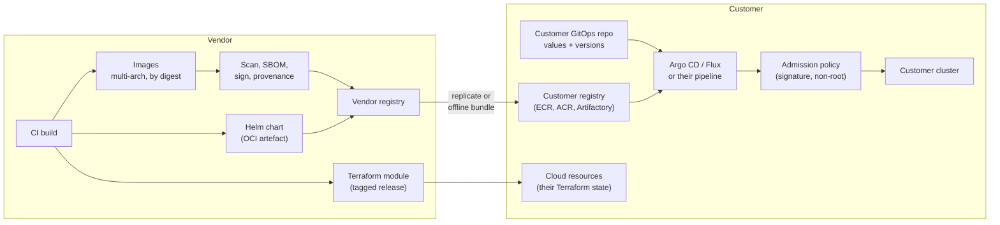
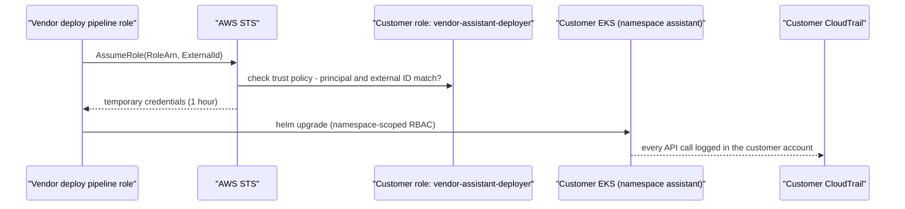

# Packaging & Delivery into a Customer Account: Docker, Helm, Terraform

!!! abstract "Key takeaways"
    - **Ship a product, not a project:** signed container images pinned by digest, a Helm chart whose every environment choice is a value, a Terraform module for the cloud resources, a preflight check and runbooks. The customer's platform team should be able to install it without you in the room.
    - **Images must pass their scanner and their admission policies:** minimal base, non-root, read-only filesystem, no secrets in layers, SBOM and signature attached, multi-arch if they run Graviton/ARM.
    - **Charts must fit their cluster, not yours:** configurable registry and pull secrets, `existingSecret` instead of creating credentials, namespace-scoped RBAC, restricted Pod Security, NetworkPolicy, proxy and CA settings, workload-identity annotations, and fail-fast `required` values.
    - **Cross-account access is a security design:** a dedicated role the customer creates, trusting only your deploy role, with an **external ID** (confused-deputy protection), a permissions boundary, short sessions and resources scoped to the product.
    - **Plan for the disconnected case from day one:** artefacts must be mirrorable into the customer's registry (ECR, ACR, Artifactory, Harbor) and packable into an offline bundle with checksums and signatures.

## Why it matters

In a hosted product your CI/CD deploys to your own cluster. In a customer-VPC or on-prem deployment (see [Deployment models](01-deployment-models-hosted-api-vs-customer-vpc-vs-on-prem-and.md)), **the customer's platform team** installs your software through **their** pipeline into **their** cluster, under **their** policies:

- an image scanner that blocks critical CVEs,
- an admission controller (Kyverno, OPA Gatekeeper, Pod Security Admission) that rejects root containers, `latest` tags or unsigned images,
- a private registry with no access to Docker Hub,
- GitOps (Argo CD, Flux) where every change is a reviewed pull request,
- change windows and a change advisory board.

Packaging that ignores these turns install day into a week of exceptions and back-and-forth. Packaging that respects them is the difference between "the vendor's thing we have to babysit" and "a well-behaved workload we can run". FDEs are often the people who discover these constraints and feed them back to product (see [Field feedback to product](../fde-customer-discovery/07-field-feedback-to-product-and-research-codifying-repeatable.md)).

Fundamentals live elsewhere: images and multi-stage builds in [Containers vs VMs; Docker Images](../docker-kubernetes/01-containers-vs-vms-docker-images-layers-multi-stage-builds.md), Helm basics in [Rolling Updates, Rollbacks & Helm](../docker-kubernetes/07-rolling-updates-rollbacks-and-helm.md), EKS/AKS specifics in [EKS/AKS Specifics](../docker-kubernetes/08-eks-aks-specifics-and-troubleshooting-pods.md), and IAM in [IAM: Users, Roles, Policies](../aws/02-iam-users-roles-policies-least-privilege.md).

## Core concepts

### The delivery pipeline


*Notice that the vendor never pushes directly into the customer's cluster in this model: artefacts are mirrored into the customer's registry, versions and values live in the customer's Git repo, and the customer's admission policy has the last word.*

### Container images that pass enterprise gates

| Requirement | Why the customer cares | How |
|---|---|---|
| Minimal base | Fewer CVEs for their scanner | Distroless, Chainguard/Wolfi, or Red Hat UBI-minimal (often required on OpenShift) |
| Non-root, arbitrary UID | Pod Security "restricted"; OpenShift runs containers with a random UID | `USER 10001`, group-writable dirs owned by GID 0 if OpenShift |
| Read-only root filesystem | Limits tampering | Write only to mounted `emptyDir` (`/tmp`) |
| No secrets or customer config in layers | Images get copied and scanned | Secrets at runtime from Kubernetes Secrets / CSI / workload identity |
| Pinned by digest | Tags can be moved; audits need immutability | `repo@sha256:...` in the chart values |
| SBOM and signature | Supply-chain review, admission policy | SPDX/CycloneDX SBOM, cosign (Sigstore) signature and SLSA provenance attestations |
| Multi-arch | Graviton/ARM node groups are common | `docker buildx` for `linux/amd64,linux/arm64` |
| No runtime downloads | No-egress subnets | Bake models, tokenizers and packages into the image (see [Network constraints](03-network-and-data-constraints-private-endpoints-proxies-egres.md)) |

For an AI product, model weights are a packaging decision too. Small models (rerankers, embedding models, PII detectors) usually go **in the image or a separate OCI artefact** pulled by an init container; large open-weight LLMs live on a volume or object store and are served by a dedicated inference server (vLLM, NIM) the customer may operate separately.

### A customer-installable Helm chart

Design rules that matter more for customers than for your own cluster:

- **Everything environment-specific is a value**: registry, pull secrets, model provider and ID, IdP issuer, proxy, CA bundle, storage class, ingress class and annotations, node selectors and tolerations (GPU pools).
- **Never create credentials.** Accept `existingSecret` names; the customer creates secrets with their own tooling (External Secrets Operator, CSI Secrets Store, Vault).
- **Least cluster privilege.** No `ClusterRole` unless essential; CRDs shipped separately so cluster admins can review them; the chart installs into one namespace.
- **Fail fast.** Use `required` for values with no safe default and a `values.schema.json` so mistakes fail at `helm install`, not as a crash loop.
- **Workload identity, not keys.** ServiceAccount annotations for EKS IRSA / Pod Identity, Azure Workload Identity, GKE Workload Identity.
- **Upgrades are a feature.** Backward-compatible values, documented breaking changes, database migrations that are safe to re-run, tested `helm upgrade` from each supported version.
- **Distribute as an OCI artefact** (`helm push` to an OCI registry) so it can be mirrored with the images.

!!! note "Helm 4"
    Helm 4.0.0 was released in November 2025. Chart `apiVersion: v2` charts keep working, but Helm 4 uses server-side apply by default for new releases and kstatus for `--wait` (needs `watch` permission), and post-renderers must be plugins. Releases created with Helm 3 keep client-side apply on upgrade. Helm 3 gets security fixes until November 2026. Ask which Helm version the customer's pipeline runs and test with it.

### Terraform for the cloud resources

The chart covers what runs in Kubernetes; Terraform covers what the product needs around it: the app's IAM role (IRSA / Pod Identity), KMS key and grants, S3 buckets, a vector store or database, VPC endpoints, log groups. Module hygiene for customer delivery:

- **No provider blocks or backends inside the module**; the customer configures providers, credentials and **their** state backend.
- **Pin provider versions** with a constraint (`~> 6.0` for the AWS provider in 2026) and test against the customer's Terraform version.
- **Inputs for everything the customer owns** (VPC, subnets, KMS key ARN, permissions boundary, tags) and outputs the chart needs (role ARN, bucket name).
- **Least privilege generated from the product's real calls**, reviewed by the customer's cloud security team.

### Vendor access into the customer account

In a vendor-managed customer-VPC model, your deploy pipeline needs to act in the customer's account. The standard pattern:


*Notice that the customer owns every control here: the trust policy, the external ID condition, the session length, the Kubernetes RBAC and the audit trail.*

The **external ID** solves the *confused deputy* problem: without it, anyone who learns the role ARN and can make your pipeline assume roles on their behalf (for example, another customer entering a victim's role ARN in your onboarding form) could trick you into acting in someone else's account. The vendor generates a unique external ID per customer and the customer puts it in the trust policy condition.

### Air-gapped bundles

For disconnected installs, a release is a file set:

```text
assistant-2.7.1-bundle/
├── images/                 # OCI archives (skopeo/oras/crane), one per image, multi-arch index kept
├── charts/assistant-1.4.0.tgz
├── terraform/              # module source at the release tag
├── models/                 # small model artefacts, if any
├── sbom/                   # SPDX or CycloneDX per image
├── signatures/             # cosign signatures + public key for offline verification
├── SHA256SUMS              # checksums for every file
└── INSTALL.md / UPGRADE.md # incl. supported upgrade paths (N-2)
```

The customer verifies checksums and signatures, loads images into their registry, and installs with `global.imageRegistry` pointing at the mirror. Tools such as Zarf and Replicated automate this; a script with `skopeo copy` and `helm package` is enough for a first customer.

## In practice: code & configuration

### Dockerfile: wrong vs right

=== "❌ Common mistake"
    ```dockerfile
    FROM python:latest                         # floating tag, full OS, hundreds of CVEs
    COPY . /app                                # copies .env, tests, .git into the image
    RUN pip install -r /app/requirements.txt   # unpinned, build tools left in the image
    ENV OPENAI_API_KEY=sk-...                  # secret baked into a layer forever
    CMD python /app/main.py                    # runs as root; downloads tokenizer at start-up
    ```

=== "✅ Correct approach"
    ```dockerfile
    # NOT BUILT HERE (no Docker daemon in the scratch environment).
    # syntax=docker/dockerfile:1
    FROM python:3.12-slim AS build
    WORKDIR /src
    COPY requirements.lock .
    RUN pip install --no-cache-dir --require-hashes -r requirements.lock --target /deps
    COPY app/ app/
    # Bake runtime assets so no-egress clusters work (tokenizer, small reranker).
    COPY assets/ assets/

    FROM gcr.io/distroless/python3-debian12:nonroot   # minimal, no shell, UID 65532
    WORKDIR /app
    COPY --from=build /deps /deps
    COPY --from=build /src/app ./app
    COPY --from=build /src/assets ./assets
    ENV PYTHONPATH=/deps HF_HUB_OFFLINE=1 TRANSFORMERS_OFFLINE=1
    USER nonroot
    EXPOSE 8080
    ENTRYPOINT ["python", "-m", "app.server"]
    ```
    Then in CI: build multi-arch with `docker buildx`, scan (Trivy or Grype), generate an SBOM (Syft), sign and attest with cosign, and publish the **digest** that goes into the chart's values. Distroless Python uses the distribution's Python version; check it matches the version you build dependencies for.

### Helm: values and the deployment template

The chart below passed `helm lint` and `helm template --kube-version 1.31.0` (Helm 3.16, built from source) with the customer values file; rendering with default values fails on purpose because `required` values are missing.

```yaml
# values.yaml - every environment-specific choice is a value, not a code change.
global:
  imageRegistry: ""            # customer mirror, e.g. registry.corp.example:5000 (air-gapped)
  imagePullSecrets: []         # e.g. [{name: corp-registry}]

image:
  repository: vendor/assistant-api
  digest: ""                   # sha256:... pin by digest in production; tag is a fallback
  tag: ""                      # defaults to .Chart.AppVersion
  pullPolicy: IfNotPresent

replicaCount: 2

serviceAccount:
  create: true
  name: ""
  annotations: {}              # e.g. eks.amazonaws.com/role-arn for IRSA, azure.workload.identity/client-id

llm:
  provider: bedrock            # bedrock | azure-openai | vertex | openai-compatible (self-hosted)
  endpoint: ""                 # private endpoint URL when not using the provider default DNS
  model: ""                    # model / deployment / inference-profile ID from the customer's approved list
  region: ""

auth:
  oidc:
    issuerUri: ""              # customer IdP, e.g. https://login.microsoftonline.com/<tenant>/v2.0
    clientId: ""
    existingSecret: ""         # Secret holding client-secret; the chart never creates credentials
    groupsClaim: groups

proxy:
  httpsProxy: ""               # e.g. http://proxy.corp.example:3128
  noProxy: ".svc,.cluster.local,10.0.0.0/8,169.254.169.254"
  caBundleConfigMap: ""        # ConfigMap with the corporate TLS-inspection root CA (ca.crt)

telemetry:
  enabled: false               # phone-home is opt-in; air-gapped installs keep it off
  otlpEndpoint: ""             # customer's own collector

networkPolicy:
  enabled: true
  egressCidrs: []              # proxy / private endpoint CIDRs; DNS is always allowed

resources:
  requests: {cpu: 250m, memory: 512Mi}
  limits: {memory: 1Gi}

podSecurityContext:
  runAsNonRoot: true
  seccompProfile: {type: RuntimeDefault}
containerSecurityContext:
  allowPrivilegeEscalation: false
  readOnlyRootFilesystem: true
  capabilities: {drop: [ALL]}
```

```yaml
# templates/_helpers.tpl (excerpt): registry/repository@digest, or :tag when no digest is set
{{- define "assistant.image" -}}
{{- $repo := .Values.image.repository -}}
{{- with .Values.global.imageRegistry }}{{ $repo = printf "%s/%s" . $repo }}{{ end -}}
{{- if .Values.image.digest -}}
{{- printf "%s@%s" $repo .Values.image.digest -}}
{{- else -}}
{{- printf "%s:%s" $repo (default .Chart.AppVersion .Values.image.tag) -}}
{{- end -}}
{{- end -}}
```

```yaml
# templates/deployment.yaml (excerpt: pod spec)
    spec:
      serviceAccountName: {{ include "assistant.serviceAccountName" . }}
      {{- with .Values.global.imagePullSecrets }}
      imagePullSecrets: {{- toYaml . | nindent 8 }}
      {{- end }}
      securityContext: {{- toYaml .Values.podSecurityContext | nindent 8 }}
      containers:
        - name: api
          image: {{ include "assistant.image" . | quote }}
          imagePullPolicy: {{ .Values.image.pullPolicy }}
          securityContext: {{- toYaml .Values.containerSecurityContext | nindent 12 }}
          env:
            - {name: LLM_PROVIDER, value: {{ required "llm.provider is required" .Values.llm.provider | quote }}}
            - {name: LLM_MODEL, value: {{ required "llm.model is required (customer-approved model ID)" .Values.llm.model | quote }}}
            - {name: OIDC_ISSUER_URI, value: {{ required "auth.oidc.issuerUri is required" .Values.auth.oidc.issuerUri | quote }}}
            - name: OIDC_CLIENT_SECRET
              valueFrom:
                secretKeyRef:
                  name: {{ required "auth.oidc.existingSecret is required" .Values.auth.oidc.existingSecret }}
                  key: client-secret
            {{- with .Values.proxy.httpsProxy }}
            - {name: HTTPS_PROXY, value: {{ . | quote }}}
            - {name: NO_PROXY, value: {{ $.Values.proxy.noProxy | quote }}}
            {{- end }}
            {{- if .Values.proxy.caBundleConfigMap }}
            - {name: SSL_CERT_FILE, value: /etc/corp-ca/ca.crt}
            - {name: REQUESTS_CA_BUNDLE, value: /etc/corp-ca/ca.crt}
            {{- end }}
          volumeMounts:
            - {name: tmp, mountPath: /tmp}
            {{- if .Values.proxy.caBundleConfigMap }}
            - {name: corp-ca, mountPath: /etc/corp-ca, readOnly: true}
            {{- end }}
      volumes:
        - {name: tmp, emptyDir: {}}
        {{- with .Values.proxy.caBundleConfigMap }}
        - name: corp-ca
          configMap: {name: {{ . }}}
        {{- end }}
```

```yaml
# values-customer-prod.yaml - lives in the CUSTOMER's GitOps repo, reviewed by their platform team
global:
  imageRegistry: 123456789012.dkr.ecr.eu-central-1.amazonaws.com
image:
  digest: sha256:4f1c2a9be0d4c6a3e9d1b2f7a8c5e6d3b4a1f0e9d8c7b6a5f4e3d2c1b0a9f8e7
serviceAccount:
  annotations:
    eks.amazonaws.com/role-arn: arn:aws:iam::123456789012:role/assistant-app
llm:
  provider: bedrock
  region: eu-central-1
  model: eu.anthropic.claude-sonnet-example-v1:0   # placeholder: the EU inference profile ID they approved
auth:
  oidc:
    issuerUri: https://login.microsoftonline.com/00000000-0000-0000-0000-000000000000/v2.0
    clientId: 11111111-1111-1111-1111-111111111111
    existingSecret: assistant-oidc
proxy:
  httpsProxy: http://proxy.corp.example:3128
  caBundleConfigMap: corp-root-ca
networkPolicy:
  egressCidrs: [10.20.0.0/24, 10.20.8.0/24]   # proxy subnet, VPC endpoint subnet
```

Rendered result (excerpt): `image: "123456789012.dkr.ecr.eu-central-1.amazonaws.com/vendor/assistant-api@sha256:4f1c…"`, plus a NetworkPolicy allowing only DNS and the two CIDRs.

### Terraform: the cross-account deploy role (customer creates it)

=== "❌ Common mistake"
    ```hcl
    # Trusts the vendor's whole account, no external ID, admin rights, 12-hour sessions.
    resource "aws_iam_role" "vendor" {
      name = "vendor-access"
      assume_role_policy = jsonencode({
        Version = "2012-10-17"
        Statement = [{
          Effect    = "Allow"
          Action    = "sts:AssumeRole"
          Principal = { AWS = "arn:aws:iam::111122223333:root" } # any principal the vendor allows
        }]
      })
      max_session_duration = 43200
    }
    resource "aws_iam_role_policy_attachment" "admin" {
      role       = aws_iam_role.vendor.name
      policy_arn = "arn:aws:iam::aws:policy/AdministratorAccess"
    }
    ```

=== "✅ Correct approach"
    ```hcl
    # Created BY THE CUSTOMER in THEIR account: a narrowly scoped role the vendor's
    # deployment pipeline may assume to install and upgrade the product.
    # Validated: terraform fmt -check + validate (Terraform 1.9.8, AWS provider 6.49.0); not applied.
    terraform {
      required_version = ">= 1.6"
      required_providers {
        aws = { source = "hashicorp/aws", version = "~> 6.0" }
      }
    }

    variable "region" { type = string }
    variable "vendor_principal_arn" { type = string } # the vendor's deploy role, not the vendor's account root
    variable "external_id" {
      type      = string # unique per customer, generated by the vendor and given to the customer
      sensitive = true
    }
    variable "cluster_name" { type = string }
    variable "permissions_boundary_arn" { type = string } # customer-owned boundary policy

    provider "aws" { region = var.region }

    data "aws_caller_identity" "current" {}
    data "aws_partition" "current" {}

    data "aws_iam_policy_document" "trust" {
      statement {
        sid     = "VendorDeployPipelineOnly"
        effect  = "Allow"
        actions = ["sts:AssumeRole"]
        principals {
          type        = "AWS"
          identifiers = [var.vendor_principal_arn]
        }
        condition { # confused-deputy protection
          test     = "StringEquals"
          variable = "sts:ExternalId"
          values   = [var.external_id]
        }
      }
    }

    resource "aws_iam_role" "vendor_deployer" {
      name                 = "vendor-assistant-deployer"
      assume_role_policy   = data.aws_iam_policy_document.trust.json
      max_session_duration = 3600 # 1 hour sessions
      permissions_boundary = var.permissions_boundary_arn
      tags                 = { purpose = "vendor-deploy", review = "quarterly" }
    }

    # Least privilege: describe one EKS cluster (Kubernetes RBAC then limits it to one namespace)
    # and push/pull images in one ECR repository. No IAM, no KMS admin, no data access.
    data "aws_iam_policy_document" "deploy" {
      statement {
        sid       = "DescribeOneCluster"
        actions   = ["eks:DescribeCluster"]
        resources = ["arn:${data.aws_partition.current.partition}:eks:${var.region}:${data.aws_caller_identity.current.account_id}:cluster/${var.cluster_name}"]
      }
      statement {
        sid       = "EcrAuth"
        actions   = ["ecr:GetAuthorizationToken"]
        resources = ["*"] # this action does not support resource-level permissions
      }
      statement {
        sid = "EcrOneRepo"
        actions = [
          "ecr:BatchCheckLayerAvailability", "ecr:BatchGetImage", "ecr:GetDownloadUrlForLayer",
          "ecr:InitiateLayerUpload", "ecr:UploadLayerPart", "ecr:CompleteLayerUpload", "ecr:PutImage",
        ]
        resources = ["arn:${data.aws_partition.current.partition}:ecr:${var.region}:${data.aws_caller_identity.current.account_id}:repository/vendor/assistant"]
      }
    }

    resource "aws_iam_role_policy" "deploy" {
      name   = "deploy-assistant"
      role   = aws_iam_role.vendor_deployer.id
      policy = data.aws_iam_policy_document.deploy.json
    }

    # Map the role to a namespace-scoped Kubernetes group via an EKS access entry.
    resource "aws_eks_access_entry" "vendor" {
      cluster_name      = var.cluster_name
      principal_arn     = aws_iam_role.vendor_deployer.arn
      kubernetes_groups = ["vendor-assistant-deployers"] # bound to a Role in namespace "assistant" only
      type              = "STANDARD"
    }

    output "role_arn" { value = aws_iam_role.vendor_deployer.arn }
    ```
    The customer also binds the `vendor-assistant-deployers` group to a namespaced `Role` in Kubernetes, and can add an SCP or a session policy to deny anything outside the product's resources.

### Building an offline bundle (sketch, not run)

```bash
#!/usr/bin/env bash
# make-bundle.sh - NOT RUN HERE (needs skopeo, helm, cosign and registry access).
set -euo pipefail
V=2.7.1; OUT=assistant-$V-bundle; mkdir -p $OUT/{images,charts,sbom,signatures}
for img in assistant-api assistant-worker; do
  DIGEST=$(crane digest registry.vendor.example/vendor/$img:$V)
  skopeo copy --all docker://registry.vendor.example/vendor/$img@$DIGEST oci-archive:$OUT/images/$img.tar
  cosign save registry.vendor.example/vendor/$img@$DIGEST --dir $OUT/signatures/$img   # offline verification
  syft registry.vendor.example/vendor/$img@$DIGEST -o spdx-json > $OUT/sbom/$img.spdx.json
done
helm package charts/assistant --version 1.4.0 --app-version $V -d $OUT/charts
cp -r terraform $OUT/ && cp docs/INSTALL.md docs/UPGRADE.md $OUT/
(cd $OUT && find . -type f ! -name SHA256SUMS -exec sha256sum {} + > SHA256SUMS)
```

## Real-world usage

- **BYOC vendors** (data platforms, vector databases, observability tools) commonly onboard customers with a CloudFormation or Terraform template that creates a cross-account role with an external ID, which is the pattern AWS documents for third-party access.
- **Marketplaces:** AWS Marketplace, Azure Marketplace and Google Cloud Marketplace support container and Helm-based products deployed into the buyer's account, with billing through the customer's cloud commitment, a procurement shortcut for enterprises.
- **OpenShift** is common in banks and telcos; charts that assume a fixed UID or need privileged access fail its default security context constraints.
- **Supply-chain expectations:** after SolarWinds and Log4Shell, enterprises ask for SBOMs, signed artefacts and vulnerability SLAs (for example, criticals patched within a set number of days). US federal buyers require secure-development attestations.
- **Failure modes:** chart creates a `ClusterRole` and is rejected; image pinned by tag gets silently rebuilt; Helm hook for DB migration times out under the customer's slower database; a Terraform module that configures its own provider and fights the customer's credentials; external ID shared across all customers.

## Trade-offs & production gotchas

| Option | Pros | Cons | Use when |
|---|---|---|---|
| Customer pulls from vendor registry | Simple, always current | Needs egress; registry is a dependency | Connected customers with allowlisted registry |
| Replicate into customer registry | No runtime dependency on vendor; their scanner runs | Replication setup; storage | Most enterprise installs |
| Offline bundle | Works air-gapped; full audit | Manual, slow release cadence | Disconnected or highly regulated |
| Vendor-managed via cross-account role | Vendor can upgrade and fix quickly | Customer must trust and audit the role | BYOC managed offering |
| Customer GitOps with vendor PRs | Fits change control; full history | Slower; depends on their reviewers | Customer-managed installs |
| Helm | Ubiquitous; values-driven | Templating complexity; upgrade hooks | Default for Kubernetes delivery |
| Kubernetes operator | Day-2 automation (upgrades, backups) | More code; cluster-scoped CRDs | Complex stateful products at scale |

!!! warning "Gotcha: one external ID for all customers"
    The external ID must be unique per customer and not chosen by the customer. If every customer uses the same value, the confused-deputy protection is gone. Generate it on your side, store it with the customer record, and never let one tenant's onboarding reference another's role.

!!! warning "Gotcha: `helm upgrade` from old versions"
    Customer-managed installs skip versions. Test upgrades from every supported version (N-1, N-2) in CI, keep values backward compatible, and make migrations idempotent; a failed hook mid-upgrade at 2 a.m. in a customer change window is a very bad day.

!!! tip "Interview angle"
    Describe the install from the customer's platform team's point of view: "They mirror our signed images, review a values file in their Git repo, their admission policy checks signatures and non-root, and Terraform creates a scoped role. Nothing needs cluster-admin or internet."

## How this connects to my experience

- **Where I used it:**
    - **Deloitte ConvergeHealth:** "Automated infrastructure provisioning and deployment processes using Terraform" on AWS (EKS, ECS, Lambda, RDS, S3), with "IAM, KMS, and Secrets Manager" security controls. This is the Terraform module and least-privilege half of this page. *[confirm: module structure, state backend, and whether deployments targeted client-owned accounts]*
    - **Coriolis CCKM:** "automated deployments through GitLab CI/CD pipelines" for an enterprise security product; key management products integrate with customer cloud accounts through customer-granted roles and permissions, the same cross-account trust design. *[confirm: how CCKM obtained access to customer AWS/Azure/GCP accounts, e.g. cross-account roles or customer-provided credentials]*
    - **Skills and OptumRx:** Docker, Kubernetes (EKS/AKS), Jenkins and GitLab CI/CD; "Established engineering standards around testing, CI/CD, code quality, and deployment practices" at OptumRx. *[confirm: whether you wrote Helm charts or Kubernetes manifests yourself]*
- **Talking points:**
    - "I've provisioned AWS infrastructure with Terraform and set up IAM, KMS and Secrets Manager controls, so I'd hand a customer a module with inputs for their VPC, keys and boundary, not a console checklist."
    - "From key management I know customers scrutinise every permission a vendor asks for. I'd design the cross-account role with an external ID, a boundary and one namespace from the start."
    - "I'd make the chart customer-shaped: their registry, their secrets, their proxy, no cluster-admin, and fail-fast values."
- **Likely follow-up chain:** "How would a customer install your product?" → "Their cluster blocks root containers and unsigned images. What do you change?" → "You need to upgrade it remotely. What access do you ask for?" → "And for an air-gapped site?". Answer: mirrored images plus chart plus Terraform via their GitOps; non-root distroless images signed with cosign and SBOMs; a cross-account role with external ID, boundary, one-hour sessions and namespace-scoped RBAC; a signed offline bundle with checksums and an internal registry override.

## Interview questions

### Fundamentals

??? question "Q1. Why pin images by digest rather than tag in customer deployments?"
    **Answer:** Tags are mutable: `2.7.1` or `latest` can be re-pushed with different content, so two clusters "on the same version" may run different code and audits can't prove what ran. A digest is the content hash, so the image is immutable and verifiable, and signatures attach to it. Keep tags for humans, deploy by digest.

    **Interviewer listens for:** immutability; audit; signatures bind to digests.

    **Common wrong answer:** "Tags are fine if you don't overwrite them."

??? question "Q2. What makes a Helm chart 'customer-installable'?"
    **Answer:** All environment choices are values (registry, pull secrets, model endpoint, IdP, proxy, CA, storage and ingress classes, node selectors); it uses existing secrets rather than creating credentials; namespace-scoped RBAC and no cluster-admin; restricted pod security (non-root, read-only FS, dropped capabilities); NetworkPolicy; workload-identity annotations; `required` values and a schema for fast failure; tested upgrades; distributed as an OCI artefact that can be mirrored.

    **Interviewer listens for:** existingSecret; least privilege; fail-fast; upgrades.

    **Common wrong answer:** "A chart with a values file."

??? question "Q3. What is the confused deputy problem and how does an external ID help?"
    **Answer:** A deputy (the vendor) with permission to assume roles in many customer accounts can be tricked by one customer into acting on another customer's resources, for example by submitting the victim's role ARN. The external ID is a unique value per customer, generated by the vendor and required by the role's trust policy (`sts:ExternalId` condition). The vendor always sends the external ID tied to the requesting customer, so it can't be used against a role belonging to someone else.

    **Interviewer listens for:** vendor generates; unique per customer; trust-policy condition.

    **Common wrong answer:** "It's a password for the role."

### Intermediate

??? question "Q4. The customer's admission controller rejects your pods. What are the likely reasons?"
    **Answer:** Running as root or a fixed UID that conflicts with OpenShift; writable root filesystem; privileged or added capabilities; missing resource requests/limits; images from an unapproved registry; unsigned images or a missing attestation; `latest` tag; host paths or host networking. Fix in the image and chart defaults, not via an exception request.

    **Interviewer listens for:** concrete policy checks; fix defaults.

    **Common wrong answer:** "Ask them to add an exception for our namespace."

??? question "Q5. What belongs in a Terraform module you hand to a customer, and what doesn't?"
    **Answer:** Resources the product needs (app IAM role and policies, KMS grants, buckets, databases, endpoints, log groups), with inputs for customer-owned things (VPC, subnets, key ARNs, boundary, tags) and outputs for the chart. Not included: provider configuration, credentials, backend/state configuration, or resources the customer's platform owns (VPCs, clusters) unless explicitly agreed. Pin provider version constraints and document required permissions.

    **Interviewer listens for:** no provider/backend; customer-owned inputs; version pinning.

    **Common wrong answer:** a root module that creates its own VPC and stores state in the vendor's S3 bucket.

??? question "Q6. How do you deliver model artefacts with a product?"
    **Answer:** Small models (embeddings, rerankers, PII detectors, tokenizers) are baked into the image or shipped as separate OCI artefacts pulled by an init container, with library offline modes set so nothing downloads at runtime. Large open-weight LLMs live on volumes or object storage and are served by a separate inference server (vLLM, NIM) sized for the customer's GPUs. Version, checksum and sign model artefacts like images, and record which model version each release expects.

    **Interviewer listens for:** offline mode; OCI artefacts; separation of LLM serving; versioning.

    **Common wrong answer:** "Download from Hugging Face on start-up."

### Senior

??? question "Q7. Design vendor access for a managed product running in 40 customer AWS accounts."
    **Answer:** One deploy-pipeline role per environment on the vendor side; in each customer account a customer-created role trusting only that role with a unique external ID, a customer-owned permissions boundary, one-hour sessions and resources scoped to the product (one cluster namespace via EKS access entries, one ECR repo, product-tagged resources). No standing human access: break-glass via a separate role requiring customer approval and MFA. Customer CloudTrail records everything; vendor logs map every action to a change ticket. Rotate external IDs on request and offboard by deleting the role.

    **Interviewer listens for:** per-customer external ID; boundary; scoped resources; break-glass; audit on both sides.

    **Common wrong answer:** a shared IAM user with access keys in each account.

??? question "Q8. How do you keep upgrades safe across customer-managed installs?"
    **Answer:** Publish supported versions and upgrade paths; keep values backward compatible with deprecation warnings; idempotent, backward-compatible migrations (expand-then-contract); CI that installs N-2 and N-1 and upgrades to N with realistic data; preflight that checks prerequisites before upgrading; documented rollback (`helm rollback` plus migration compatibility); release notes that flag breaking changes and required customer actions.

    **Interviewer listens for:** N-2 tests; expand/contract migrations; preflight; rollback.

    **Common wrong answer:** "We only support the latest version."

??? question "Q9. What supply-chain evidence would a bank ask for, and how do you produce it?"
    **Answer:** SBOMs per image (SPDX or CycloneDX, generated in CI with Syft or similar), vulnerability scan results and a patch SLA, signatures and provenance attestations (cosign/Sigstore, SLSA levels), reproducible build information, dependency pinning with hashes, and a secure development policy. Produce them automatically in CI for every release and ship them with the bundle so their admission policy and auditors can verify offline.

    **Interviewer listens for:** automation; offline verification; patch SLA.

    **Common wrong answer:** "We run a scanner sometimes."

### Scenario-based

??? question "Q10. Install day: the customer can't pull your images. Walk through it."
    **Answer:** Check where pods try to pull from (`kubectl describe pod`): wrong registry value, missing pull secret, private registry needing auth, no egress to your registry, image architecture mismatch (ARM nodes, amd64-only image), or the image not replicated yet. Fix the immediate issue (set `global.imageRegistry` to their mirror, add the pull secret, push the multi-arch index) and add a preflight check for registry reachability and architecture.

    **Interviewer listens for:** systematic causes; multi-arch; preflight.

    **Common wrong answer:** "Make the registry public."

??? question "Q11. The customer's cloud security team says your requested IAM permissions are too broad. How do you respond?"
    **Answer:** Treat it as valid input. List each permission with the product feature that needs it, generated from real usage (CloudTrail or IAM Access Analyzer policy generation in a test account). Remove what's unused, scope resources by ARN or tag, split install-time and runtime permissions into different roles, and accept their boundary policy. Offer a customer-managed mode where their pipeline applies changes if they don't want a vendor role at all.

    **Interviewer listens for:** evidence-based least privilege; split roles; boundary; alternative mode.

    **Common wrong answer:** "Our product needs admin to work."

## Cheat sheet

| Concept | Remember |
|---|---|
| Deliverables | Signed images by digest, Helm chart (OCI), Terraform module, preflight, runbooks, SBOMs |
| Images | Minimal base, non-root, read-only FS, no secrets, multi-arch, no runtime downloads |
| Chart | Values for everything, existingSecret, namespace RBAC, restricted PSS, NetworkPolicy, `required`, schema |
| Helm 4 (Nov 2025) | v2 charts work; server-side apply default for new releases; kstatus `--wait`; Helm 3 security fixes until Nov 2026 |
| Terraform module | No provider/backend; customer inputs; pinned `~> 6.0` AWS provider; least privilege from real calls |
| Cross-account | Trust one vendor role, unique external ID, boundary, 1-hour sessions, scoped resources, customer CloudTrail |
| Delivery | Replicate into customer registry; customer GitOps; offline bundle with checksums and signatures |
| Upgrades | Support N-2, test upgrade paths, idempotent migrations, documented rollback |

## Sources
1. [AWS IAM: The confused deputy problem](https://docs.aws.amazon.com/IAM/latest/UserGuide/confused-deputy.html): external ID purpose and usage.
2. [AWS IAM: Access to AWS accounts owned by third parties](https://docs.aws.amazon.com/IAM/latest/UserGuide/id_roles_common-scenarios_third-party.html): third-party roles and `sts:ExternalId`.
3. [AWS APN Blog: Securely using external ID for accessing AWS accounts owned by others](https://aws.amazon.com/blogs/apn/securely-using-external-id-for-accessing-aws-accounts-owned-by-others/): vendor-generated, unique external IDs.
4. [Amazon EKS: Access entries](https://docs.aws.amazon.com/eks/latest/userguide/access-entries.html): mapping IAM principals to Kubernetes groups.
5. [Helm: Helm 4 released](https://helm.sh/blog/helm-4-released): Helm 4.0.0 (Nov 2025), server-side apply, compatibility and support timeline.
6. [Helm: Chart best practices](https://helm.sh/docs/chart_best_practices/) and [Helm: Use OCI-based registries](https://helm.sh/docs/topics/registries/): values, RBAC, OCI distribution.
7. [Kubernetes: Pod Security Standards](https://kubernetes.io/docs/concepts/security/pod-security-standards/): restricted profile requirements.
8. [Sigstore cosign documentation](https://docs.sigstore.dev/cosign/signing/overview/) and [SLSA](https://slsa.dev/): signing and provenance.
9. [Terraform: Module development best practices](https://developer.hashicorp.com/terraform/language/modules/develop) and [Providers within modules](https://developer.hashicorp.com/terraform/language/modules/develop/providers): no provider configuration in reusable modules.
10. [Red Hat OpenShift: Managing security context constraints](https://docs.redhat.com/en/documentation/openshift_container_platform/4.16/html/authentication_and_authorization/managing-pod-security-policies): arbitrary UIDs on OpenShift.
11. [Distroless container images](https://github.com/GoogleContainerTools/distroless): minimal non-root base images.
