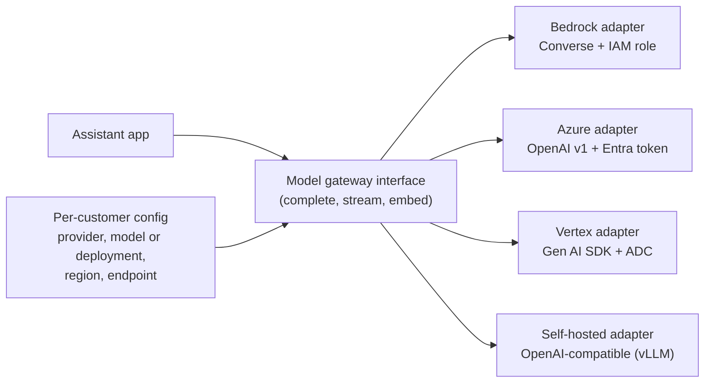

# Cloud AI Platforms: Amazon Bedrock, Azure OpenAI, Vertex AI

!!! abstract "Key takeaways"
    - **Enterprises usually buy models through their cloud,** not directly: it draws down an existing commit, uses their identity (IAM, Entra ID, Google IAM), their private networking, their region and residency controls, and inherits compliance (HIPAA-eligible services under their BAA).
    - **Names moved in 2025–26:** Azure AI Foundry became **Microsoft Foundry** (late 2025; Azure OpenAI now sits inside it as "Foundry Models sold by Azure"); Google renamed and expanded **Vertex AI into Gemini Enterprise Agent Platform** (April 2026). Use both old and new names with customers, who may not have caught up.
    - **The same model behaves like a different product on each platform:** different IDs, quotas, regions, feature timing, routing options (global vs regional), content filters and retention terms. Evaluate on the surface you'll deploy.
    - **Use keyless identity:** IAM roles (IRSA/Pod Identity) for Bedrock, Entra ID managed identity for Azure, service accounts with Workload Identity for Google. API keys in config files fail security reviews.
    - **Know the data-handling defaults:** Bedrock doesn't store prompts and completions (invocation logging is opt-in, in your account); Azure OpenAI may retain prompts up to 30 days for abuse monitoring unless modified abuse monitoring is approved; Google documents per-model residency, CMEK and VPC-SC support in a security-controls table.

## Why it matters

In a customer-VPC deployment (see [Deployment models](01-deployment-models-hosted-api-vs-customer-vpc-vs-on-prem-and.md)) the model endpoint is usually the customer's own cloud AI platform. An FDE has to:

- **get access approved** (model access, quotas, region, sometimes a Limited Access form),
- **wire identity and networking** so the app can call it privately and without keys,
- **choose routing that meets residency** (Bedrock geographic vs global inference profiles, Azure Data Zone vs Global deployments),
- **answer the security team's data questions** precisely for that platform,
- **work around platform differences** (feature lag, quota limits, content filters) without forking the product.

Model *choice* (quality vs latency vs cost, routing and fallbacks) is covered in [Model Selection & Routing](../fde-applied-llm/01-model-selection-and-routing-quality-vs-latency-vs-cost-acros.md); guardrail design in [Guardrails](../fde-applied-llm/06-guardrails-prompt-injection-pii-phi-redaction-grounding-chec.md). This page is about the platforms themselves. Platform facts below are dated **October 2026** and move fast; check the provider docs before quoting them.

## Core concepts

### Why customers prefer their cloud's platform

| Driver | What it means in practice |
|---|---|
| Procurement | Usage bills against an existing enterprise agreement or commit; no new vendor contract with the model lab |
| Identity | Access controlled with existing IAM/Entra/Google IAM roles, audited in CloudTrail / Azure Monitor / Cloud Audit Logs |
| Networking | PrivateLink, Azure private endpoints, Private Service Connect and VPC Service Controls (see [Network & data constraints](03-network-and-data-constraints-private-endpoints-proxies-egres.md)) |
| Compliance | Platform listed as HIPAA-eligible / in scope of the cloud's SOC reports; the customer's BAA with the cloud covers it |
| Residency | Regional, geographic or global processing options; data at rest in the customer's geography |
| Keys | Customer-managed keys for stored artefacts (fine-tunes, knowledge bases, agent memory) |

### Amazon Bedrock

- **What it is:** a fully managed, serverless API to foundation models from Amazon (Nova), Anthropic (Claude), Meta, Mistral, Cohere, DeepSeek, OpenAI's open-weight models and others, plus RAG, guardrails and agent services.
- **APIs:** `InvokeModel` (provider-specific body) and **`Converse` / `ConverseStream`** (one message format across models; use it by default). Batch inference for offline jobs at lower cost.
- **Inference profiles:** cross-region inference spreads load across regions. **Geographic** profiles (IDs prefixed `us.`, `eu.`, `apac.` and similar) keep processing in that geography; **global** profiles route to any supported commercial region with more capacity and a lower price. *Application* inference profiles let you tag usage per app or tenant for cost allocation.
- **Capacity:** on-demand quotas (tokens and requests per minute per model and region) or **provisioned throughput** for guaranteed capacity.
- **Data protection:** AWS states that Bedrock doesn't store or log prompts and completions, doesn't use them to train models, and doesn't share them with model providers; models run in AWS-operated *model deployment accounts* the providers can't access. **Model invocation logging** is off by default; if enabled it writes full requests and responses to the customer's CloudWatch Logs or S3, which then holds PHI and must be secured accordingly.
- **Platform services:** **Knowledge Bases** (managed RAG), **Guardrails** (content filters, denied topics, PII redaction, contextual grounding checks; also callable standalone via `ApplyGuardrail`), and **AgentCore** (generally available October 2025: Runtime, Gateway for MCP tools, Identity, Memory, Observability, Browser and Code Interpreter, with VPC and PrivateLink support).
- **Networking:** interface endpoints for `bedrock` (control plane), `bedrock-runtime` and agent endpoints; endpoint policies; FIPS endpoints in US and GovCloud regions.

### Azure OpenAI in Microsoft Foundry

- **What it is:** OpenAI models (GPT family, reasoning models, embeddings, image and audio models) hosted by Microsoft, now one part of **Microsoft Foundry** (Azure AI Studio → Azure AI Foundry in Nov 2024 → Microsoft Foundry in late 2025). Foundry also offers other providers' models, including Anthropic's Claude and open models.
- **Deployments:** you don't call a model directly; you create a **deployment** (a name bound to a model version, type and quota) and call the deployment name.
- **Deployment types:** **Global** (processed in any Foundry location; highest quota), **Data Zone** (processed within a Microsoft-defined zone such as the EU or US), **Regional/Standard** (one region), each with **Standard** (pay-per-token), **Provisioned** (reserved throughput units) and **Batch** variants. Data at rest stays in the resource's geography in all cases.
- **APIs:** the **v1 API** (`<endpoint>/openai/v1/`) works with the standard OpenAI SDKs; Microsoft recommends the Responses API for OpenAI models. The older `azure-ai-inference` package retired in May 2026 and the Assistants API sunsets in August 2026 in favour of Foundry Agent Service (per Microsoft's migration guide).
- **Identity:** prefer **Entra ID** (managed identity / workload identity, RBAC role such as *Cognitive Services OpenAI User*) over API keys; disable key auth (`disableLocalAuth`) where policy requires.
- **Data handling:** prompts and completions aren't used to train base models. **Abuse monitoring** may retain prompts and outputs for up to 30 days for review; customers who meet Limited Access criteria can apply for **modified abuse monitoring**, after which nothing is stored for review. **Content filters** are on by default and can block legitimate clinical or security text; tuning them is a configuration (and sometimes approval) step.
- **Networking:** private endpoints with the `privatelink.openai.azure.com` DNS zone and public network access disabled; Microsoft documents that some new Foundry experiences don't yet support end-to-end network isolation, so check per feature.

### Google Vertex AI → Gemini Enterprise Agent Platform

- **What it is:** Google's AI platform. At Cloud Next '26 (April 22, 2026) Google introduced **Gemini Enterprise Agent Platform** as the evolution of Vertex AI; Google says Vertex AI services and roadmap are now delivered through it. APIs, endpoints and docs still widely use "Vertex AI" names, so expect both.
- **Models:** Gemini models plus **Model Garden** (Google cites 200+ models, including Anthropic's Claude and open models), with tuning and provisioned throughput.
- **Agents:** Agent Development Kit (ADK), Agent Runtime (formerly Agent Engine), Agent Studio, Agent Gateway, Agent Identity and Agent Registry for governance.
- **Identity:** service accounts with **Workload Identity** (GKE) or Workload Identity Federation (from AWS, Azure, on-prem), via Application Default Credentials; no JSON keys.
- **Location and residency:** regional endpoints or the `global` endpoint; Google's generative AI **security-controls table** lists, per model and feature, support for data residency, CMEK, VPC Service Controls and Access Transparency, and some features (for example Agent Engine at the time of writing) lack data-residency support.
- **Networking:** Private Service Connect and Private Google Access; **VPC Service Controls** perimeters are the standard exfiltration control for regulated customers.

### Side-by-side

| | Amazon Bedrock | Azure OpenAI (Microsoft Foundry) | Vertex AI / Gemini Enterprise Agent Platform |
|---|---|---|---|
| Model catalogue | Multi-provider (Anthropic, Amazon, Meta, Mistral, Cohere, DeepSeek, OpenAI open-weight, ...) | OpenAI models + other Foundry models (incl. Claude) | Gemini + Model Garden (incl. Claude, open models) |
| Unit you call | Model ID or inference profile ID | Deployment name | Model name in a project + location |
| Unified API | Converse | OpenAI v1 API (Responses, Chat Completions) | Gen AI SDK / `generateContent`; OpenAI-compatible endpoint for some models |
| Auth | IAM (SigV4), roles | Entra ID (or keys) | Google IAM, ADC |
| Residency routing | In-region, geographic, global profiles | Regional, Data Zone, Global deployments | Regional or global endpoint; per-model residency table |
| Capacity | On-demand quotas, provisioned throughput, batch | TPM quota per deployment, provisioned (PTU), batch | Quotas, provisioned throughput, batch |
| Private networking | PrivateLink | Private endpoints | PSC, VPC-SC |
| Prompt retention | Not stored by default; invocation logging opt-in | Up to 30 days for abuse monitoring unless modified | Per Google's terms and features (caching, grounding); check per feature |
| Guardrails | Bedrock Guardrails | Content filters / Content Safety, Prompt Shields | Model safety settings, Model Armor |
| Agents | Bedrock Agents, AgentCore | Foundry Agent Service | ADK, Agent Runtime, Agent Gateway |

{ loading=lazy }
*Read the table by row: the same residency decision has a different name on each platform, so ask for it by scope, not by product term.*

### Choosing between them

The short answer is usually **"the one the customer's cloud runs"**. Then check:

1. **Model availability in the approved region(s)** and under the required routing (a model may be global-only or not in the customer's region yet).
2. **Quota** for launch-day load; request increases or provisioned throughput early (weeks, not days).
3. **Feature parity** for what you need (prompt caching, batch, structured outputs, tool use, newest model versions) on *that* platform.
4. **Data terms** (retention, abuse monitoring, logging) acceptable to the customer's privacy team.
5. **Private networking and identity** supported for every API you use, including agent and RAG services, not just inference.

### A provider-neutral client


*Notice that only the adapters know about platform SDKs and identity; business code sees one interface, and the customer's choice of platform is a config value from the Helm chart (see [Packaging & delivery](05-packaging-and-delivery-into-a-customer-account-docker-helm-t.md)).*

## In practice: code & configuration

### Keyless calls on each platform

=== "❌ Common mistake"
    ```python
    # API keys in code/config, public endpoints, model names hard-coded per platform.
    from openai import AzureOpenAI
    client = AzureOpenAI(api_key="3f9c...redacted", api_version="2024-02-01",
                         azure_endpoint="https://contoso-ai.openai.azure.com")
    r = client.chat.completions.create(model="gpt-4o", messages=[...])   # 'model' is really a deployment name
    # Problems: long-lived secret, no rotation, fails "disableLocalAuth" policy,
    # deployment name hard-coded, old API version pinned in code.
    ```

=== "✅ Correct approach"
    ```python
    # adapters.py - NOT RUN HERE (needs cloud credentials). Shapes follow boto3, openai>=1.x with the
    # Azure v1 API, and google-genai as of October 2026; verify against current SDK docs.
    import boto3
    from openai import OpenAI
    from azure.identity import DefaultAzureCredential, get_bearer_token_provider
    from google import genai
    from google.genai import types

    class BedrockAdapter:
        def __init__(self, model_id: str, region: str):
            # Credentials come from the pod's IAM role (IRSA / EKS Pod Identity); traffic uses the
            # PrivateLink endpoint via private DNS. model_id can be a geographic inference profile ID.
            self.client = boto3.client("bedrock-runtime", region_name=region)
            self.model_id = model_id

        def complete(self, system: str, user: str, max_tokens: int = 1024) -> str:
            r = self.client.converse(
                modelId=self.model_id,
                system=[{"text": system}],
                messages=[{"role": "user", "content": [{"text": user}]}],
                inferenceConfig={"maxTokens": max_tokens},
                # guardrailConfig={"guardrailIdentifier": "...", "guardrailVersion": "1"},  # optional
            )
            return r["output"]["message"]["content"][0]["text"]

    class AzureOpenAIAdapter:
        def __init__(self, endpoint: str, deployment: str):
            # Managed identity / workload identity; no key. Token refreshes automatically.
            # Scope: Microsoft Learn shows cognitiveservices.azure.com; some newer pages use
            # https://ai.azure.com/.default *[verify for the customer's resource type]*.
            token = get_bearer_token_provider(DefaultAzureCredential(),
                                              "https://cognitiveservices.azure.com/.default")
            self.client = OpenAI(base_url=f"{endpoint.rstrip('/')}/openai/v1/", api_key=token)
            self.deployment = deployment                      # deployment name, from config

        def complete(self, system: str, user: str, max_tokens: int = 1024) -> str:
            r = self.client.responses.create(model=self.deployment, instructions=system,
                                             input=user, max_output_tokens=max_tokens)
            return r.output_text

    class VertexAdapter:
        def __init__(self, project: str, location: str, model: str):
            # Application Default Credentials: GKE Workload Identity or Workload Identity Federation.
            self.client = genai.Client(vertexai=True, project=project, location=location)
            self.model = model

        def complete(self, system: str, user: str, max_tokens: int = 1024) -> str:
            r = self.client.models.generate_content(
                model=self.model, contents=user,
                config=types.GenerateContentConfig(system_instruction=system,
                                                   max_output_tokens=max_tokens))
            return r.text
    ```

### IAM for Bedrock with a geographic inference profile

A cross-region inference profile routes your request to a foundation model in another region of the geography, so the caller needs permission on **both** the profile and the underlying model ARNs in the destination regions. Not validated against a live account.

```json
{
  "Version": "2012-10-17",
  "Statement": [
    {
      "Sid": "InvokeViaEuProfileOnly",
      "Effect": "Allow",
      "Action": ["bedrock:InvokeModel", "bedrock:InvokeModelWithResponseStream"],
      "Resource": [
        "arn:aws:bedrock:eu-central-1:123456789012:inference-profile/eu.<provider>.<model-id>",
        "arn:aws:bedrock:eu-*::foundation-model/<provider>.<model-id>"
      ]
    }
  ]
}
```

`Converse` and `ConverseStream` are authorised by the `bedrock:InvokeModel` and `bedrock:InvokeModelWithResponseStream` actions. Customers with region-restricting SCPs must allow every destination region of the profile (and the "unspecified" region for global profiles), which is a common cause of `AccessDeniedException` in a correctly written app.

{ loading=lazy }
*The app code never changes; whether a call fails depends only on which region the profile picks.*

### Pre-launch platform checklist

```markdown
- [ ] Model enabled/available in approved region(s) and routing mode (in-region / geographic / Data Zone)
- [ ] Quota: tokens/requests per minute >= 2x expected peak; increase or provisioned throughput requested
- [ ] Identity: workload identity role with least privilege (specific models / deployments only); keys disabled
- [ ] Networking: private endpoint + DNS from the app subnets; public access disabled where supported
- [ ] Data terms: retention, abuse monitoring (Azure), invocation logging (Bedrock) decided and documented
- [ ] Guardrails/content filters configured and tested against domain text (clinical, legal, security)
- [ ] Evals re-run on this platform and model version; fallback region/deployment evaluated too
- [ ] Cost: tags / application inference profiles per app or tenant; budget alerts
- [ ] Deprecation dates of the model version recorded; upgrade plan owner named
```

## Real-world usage

- **Bank or payer on AWS:** Claude or Nova via Bedrock in their account, PrivateLink, EU or US geographic inference profiles, Guardrails for PII, invocation logging off (or on, into a PHI-approved bucket for audit). The model provider never contracts with the bank directly.
- **Microsoft-centric enterprise:** Azure OpenAI deployments in a Data Zone, Entra ID keyless auth, private endpoints, Prompt Shields and content filters, with Microsoft 365 data via Graph connectors. Customers in healthcare often apply for modified abuse monitoring.
- **Google Cloud customer:** Gemini (or Claude through Model Garden) inside a VPC Service Controls perimeter, regional endpoints for residency, CMEK, and the agent stack (ADK, Agent Runtime) for workflows.
- **Multi-cloud customers** use a gateway with adapters (as above) or an LLM gateway product, but still evaluate per platform because outputs and limits differ.
- **Failure modes seen in the field:** launch-day 429s because quota was never raised; an Azure content filter blocking medication names or security terms; a "global" routing mode quietly chosen for capacity and later rejected by the privacy team; invocation logging enabled during debugging and left writing PHI to a broadly readable bucket; a model version retired with too little time to re-run evals.

## Trade-offs & production gotchas

| Option | Pros | Cons | Use when |
|---|---|---|---|
| Customer's cloud AI platform | Their contract, identity, network, compliance; fastest approval | Feature lag vs first-party APIs; per-platform quirks | Default for customer-VPC deployments |
| Model provider's first-party API | Newest features first; one surface | New vendor contract and sub-processor; internet egress | Hosted products; customers already contracted |
| Global / cross-region routing | Capacity, price | Residency | No residency constraint or explicitly approved |
| Provisioned throughput | Predictable latency and capacity | Commitment cost; sizing work | Steady high volume, strict SLOs |
| Self-hosted open weights | Full control, air-gap capable | GPUs, ops, lower quality ceiling | Disconnected or sovereign requirements |

!!! warning "Gotcha: 'same model' is not the same product"
    Model IDs (`anthropic.`-prefixed on Bedrock, deployment names on Azure, publisher paths on Vertex), feature support, default safety filters, quotas and release timing all differ by platform. A prompt and eval suite tuned on one surface needs a re-run on another before you promise anything.

!!! warning "Gotcha: logging can create the data store you promised not to have"
    Bedrock invocation logging, Azure diagnostic settings and your own app traces can all capture full prompts. Decide deliberately where prompts are stored, who can read them, how long, and say so in the security answers.

!!! tip "Interview angle"
    "I'd start with the platform their cloud team already runs, confirm model availability, quota and routing for their region, wire workload identity and private endpoints, check the data-handling defaults for that platform, and re-run evals there."

## How this connects to my experience

- **Where I used it:**
    - **Coriolis CCKM:** "Developed enterprise key management capabilities supporting AWS, Azure, and GCP environments" and "Worked extensively with AWS KMS". Building one product against three clouds' KMS APIs, identity models and regions is the same adapter problem as Bedrock vs Azure OpenAI vs Vertex. *[confirm: whether you built the Azure Key Vault and Google Cloud KMS integrations yourself or mainly AWS]*
    - **Deloitte ConvergeHealth:** "Integrated AWS Personalize recommendation services" on a healthcare analytics platform: integrating a managed AWS ML service with IAM, KMS and Secrets Manager controls is the closest resume analogue to integrating Bedrock. *[confirm: how Personalize was secured and accessed, e.g. IAM roles, VPC endpoints]*
    - **AWS Solutions Architect – Associate (2023), and Azure/AKS** on the resume give working knowledge of IAM, networking and identity on two of the three clouds.
    - **No production LLM work on the resume:** position Bedrock/Azure OpenAI/Vertex as new platforms on familiar foundations.
- **Talking points:**
    - "At CCKM we had to hide three clouds' differences behind one product while respecting each cloud's identity, region and key model. I'd use the same adapter pattern for model platforms."
    - "I'd treat the platform's data-handling defaults like key custody at CCKM: know exactly where data is stored, for how long, and who can read it, and document it for the customer."
    - "I've integrated AWS Personalize under IAM and KMS controls, so Bedrock's IAM, PrivateLink and logging model is familiar territory."
- **Likely follow-up chain:** "The customer is on Azure. What do you need to deploy?" → "Their privacy team asks if prompts are stored." → "Launch day you get 429s." → "They want to move to Bedrock next year." Answer: Foundry resource, deployment of the approved model in a Data Zone, Entra ID managed identity, private endpoint, content-filter testing; up to 30 days for abuse monitoring unless modified abuse monitoring is approved, plus whatever your own logs keep; quota per deployment, raise early, provisioned throughput, backoff and a second deployment; the adapter pattern plus per-platform evals makes it a config change and a re-evaluation, not a rewrite.

## Interview questions

### Fundamentals

??? question "Q1. Why would an enterprise use Bedrock, Azure OpenAI or Vertex instead of calling a model provider directly?"
    **Answer:** Procurement (bills against the existing cloud commitment, no new vendor), identity and audit through existing cloud IAM, private networking, residency options, compliance inheritance (HIPAA-eligible services under their existing BAA, cloud SOC reports), customer-managed keys for stored artefacts, and platform services like guardrails, RAG and agent runtimes. The trade-off is feature lag and platform-specific quotas.

    **Interviewer listens for:** contract, identity, network, compliance; feature-lag trade-off.

    **Common wrong answer:** "The models are better there."

??? question "Q2. What is a Bedrock inference profile and why does it matter for residency?"
    **Answer:** An inference profile is a resource you invoke instead of a single-region model; cross-region profiles route requests across regions for throughput. Geographic profiles (for example the EU or US ones) keep processing inside that geography; global profiles may process in any supported commercial region. Choose geographic for residency requirements, and note IAM needs permission on the profile and the destination-region model ARNs, and SCPs must allow those regions.

    **Interviewer listens for:** geographic vs global; IAM and SCP implications.

    **Common wrong answer:** "It's a saved prompt configuration."

??? question "Q3. In Azure OpenAI, what is a deployment and what are the deployment types?"
    **Answer:** A deployment binds a model version to a name, a deployment type and quota in a resource; API calls target the deployment name. Types: Global (processing in any Foundry location, highest quota), Data Zone (processing within a zone like the EU or US), and Regional/Standard (single region), each with Standard pay-per-token, Provisioned throughput and Batch variants. Data at rest stays in the resource's geography.

    **Interviewer listens for:** deployment name vs model; processing location per type.

    **Common wrong answer:** "You call the model name directly like OpenAI."

### Intermediate

??? question "Q4. A customer asks whether prompts are stored on each platform. What do you say?"
    **Answer:** Bedrock: AWS states prompts and completions aren't stored or used for training; model invocation logging is opt-in and writes to the customer's own CloudWatch/S3. Azure OpenAI: not used for training; abuse monitoring may retain prompts and outputs up to 30 days unless the customer is approved for modified abuse monitoring; stateful features (Responses storage, agents) store data in the customer's resource. Google: depends on feature (caching, grounding, agent memory); check Google's terms and security-controls table. Plus whatever your app and traces log. Answer per platform and feature, with links.

    **Interviewer listens for:** per-platform specifics; app logging; stateful features.

    **Common wrong answer:** "No, cloud providers never store prompts."

??? question "Q5. How do you authenticate to each platform without API keys?"
    **Answer:** Bedrock: an IAM role assumed by the workload (EKS IRSA or Pod Identity, ECS task role), requests signed with SigV4. Azure: Entra ID managed identity or workload identity with an RBAC role on the resource, token provider in the SDK, keys disabled. Google: service account via GKE Workload Identity or Workload Identity Federation (from AWS/Azure/on-prem) through Application Default Credentials, no JSON keys. All scoped to specific models or deployments.

    **Interviewer listens for:** workload identity on each; least privilege; keys disabled.

    **Common wrong answer:** "Store the key in a Kubernetes Secret."

??? question "Q6. Your app gets 429 errors at launch on a cloud AI platform. What do you do?"
    **Answer:** Short term: client-side backoff with jitter, a concurrency limit, queueing for non-interactive work, and a second deployment or region that's already approved and evaluated. Then fix capacity: check per-model, per-region quota usage against peak, request increases, or buy provisioned throughput; reduce tokens (shorter prompts, caching, smaller models for simple steps). Next time, load-test against the real quota before launch.

    **Interviewer listens for:** quota is per model/region/deployment; backoff; approved fallback; load test.

    **Common wrong answer:** "Retry immediately in a loop."

### Senior

??? question "Q7. How do you design a product to run on all three platforms plus self-hosted models?"
    **Answer:** A model-gateway interface (complete, stream, embed, tool calls) with one adapter per platform, owning SDK, identity and error mapping. Model IDs, deployment names, regions and endpoints come from per-customer config. Normalise structured output and tool-calling to your own schema. Keep prompts and eval suites per model/platform. Capability flags for features that differ (caching, batch, tools). CI runs a smoke eval per adapter. Don't let platform SDK types leak into business code.

    **Interviewer listens for:** adapter boundaries; config; per-platform evals; capability flags.

    **Common wrong answer:** "Use one SDK that supports everything and assume parity."

??? question "Q8. What changed in the platform landscape in 2025–26 that matters for customer conversations?"
    **Answer:** Azure AI Foundry became Microsoft Foundry, with Azure OpenAI as one of its model families and the v1 OpenAI-compatible API; legacy SDKs and the Assistants API are being retired in favour of Foundry Agent Service. Google rebranded and expanded Vertex AI as Gemini Enterprise Agent Platform with agent governance features. AWS launched AgentCore (GA October 2025) and expanded cross-region inference with geographic and global profiles. Anthropic models are available on all three clouds. Customers' internal docs may use old names, so map them explicitly.

    **Interviewer listens for:** current names; agent platforms; residency-related routing.

    **Common wrong answer:** describing 2023-era services only.

??? question "Q9. The privacy team requires EU-only processing, and the best model is global-only on the customer's platform. What do you do?"
    **Answer:** Don't quietly use global. Present options with evals: the best EU-available model (geographic profile or Data Zone deployment) and its measured quality gap; the same model on another platform where EU processing is available, if the customer can use it; waiting for regional availability; or a formal privacy decision to accept global routing with documented rationale. Usually an EU-available model with prompt and retrieval improvements closes most of the gap.

    **Interviewer listens for:** no silent compromise; eval-backed options; privacy team decides.

    **Common wrong answer:** "Use global; it's still the same cloud."

### Scenario-based

??? question "Q10. Clinicians report the Azure-hosted assistant refuses questions about overdose thresholds. Diagnose and fix."
    **Answer:** Likely Azure content filters (self-harm category) blocking legitimate clinical content. Confirm from the API error or filter annotations in the response. Options: configure a content-filter policy with adjusted thresholds for the deployment (some changes require Microsoft approval), add system-prompt context about the clinical audience, and keep your own guardrails for genuinely harmful requests. Re-run evals including both clinical and harmful test cases, and document the change for the customer's AI-governance team.

    **Interviewer listens for:** platform filter as the cause; evidence from response; governed change; evals both ways.

    **Common wrong answer:** "Switch models" or "rephrase the questions."

??? question "Q11. A customer on AWS wants agents that call internal APIs on behalf of users. Which Bedrock pieces would you consider and what would you check?"
    **Answer:** AgentCore Runtime to host the agent, Gateway to expose internal APIs and existing MCP servers as tools, Identity for OAuth-based delegated access on behalf of the user, Memory if needed, Observability for traces, all in their VPC with PrivateLink. Check region availability, data residency of memory and logs, IAM and OAuth scopes per tool, how user identity propagates (see [Enterprise identity](02-enterprise-identity-sso-scim-rbac-and-permission-propagation.md)), and compare against running your own agent framework on EKS if the customer wants more control or portability.

    **Interviewer listens for:** delegated identity; private networking; residency; build-vs-platform comparison.

    **Common wrong answer:** "Give the agent an IAM role with access to all internal APIs."

## Cheat sheet

| Concept | Remember |
|---|---|
| Why cloud platforms | Contract, identity, network, compliance, residency, keys |
| Names (Oct 2026) | Microsoft Foundry (ex-Azure AI Foundry); Gemini Enterprise Agent Platform (ex-Vertex AI, Apr 2026); Bedrock AgentCore GA Oct 2025 |
| Bedrock | Converse API; geographic vs global inference profiles; provisioned throughput; Guardrails; Knowledge Bases; invocation logging opt-in |
| Azure OpenAI | Deployments; Global / Data Zone / Regional × Standard / Provisioned / Batch; v1 API; Entra ID; abuse monitoring ≤ 30 days unless modified |
| Google | Model Garden (incl. Claude); regional vs global endpoint; VPC-SC; per-model security-controls table |
| Identity | IRSA/Pod Identity · managed/workload identity · Workload Identity (Federation); no keys |
| Before launch | Region availability, quota, routing, private networking, data terms, filters, evals on that platform |
| Design | Gateway + adapters + per-customer config + per-platform evals |

## Sources
1. [Amazon Bedrock: Data protection](https://docs.aws.amazon.com/bedrock/latest/userguide/data-protection.html): prompts not stored or used for training; model deployment accounts.
2. [Amazon Bedrock: Model invocation logging](https://docs.aws.amazon.com/bedrock/latest/userguide/model-invocation-logging.html): opt-in logging to CloudWatch Logs and S3.
3. [Amazon Bedrock: Cross-Region inference](https://docs.aws.amazon.com/bedrock/latest/userguide/cross-region-inference.html), [geographic](https://docs.aws.amazon.com/bedrock/latest/userguide/geographic-cross-region-inference.html) and [global](https://docs.aws.amazon.com/bedrock/latest/userguide/global-cross-region-inference.html) profiles.
4. [Amazon Bedrock: Converse API](https://docs.aws.amazon.com/bedrock/latest/userguide/conversation-inference.html): unified message API.
5. [AWS What's New: Amazon Bedrock AgentCore is now generally available](https://aws.amazon.com/about-aws/whats-new/2025/10/amazon-bedrock-agentcore-available): GA October 2025, VPC and PrivateLink support.
6. [Microsoft Learn: Azure OpenAI deployment types](https://learn.microsoft.com/en-us/azure/ai-foundry/openai/how-to/deployment-types): Global, Data Zone, Regional; Standard, Provisioned, Batch.
7. [Microsoft Learn: Data, privacy, and security for Foundry Models sold by Azure](https://learn.microsoft.com/en-us/azure/foundry/responsible-ai/openai/data-privacy) and [Abuse monitoring](https://learn.microsoft.com/en-us/azure/foundry/openai/concepts/abuse-monitoring): training, retention, modified abuse monitoring.
8. [Microsoft Learn: Azure OpenAI API version lifecycle (v1 API)](https://learn.microsoft.com/en-us/azure/foundry/openai/api-version-lifecycle): OpenAI client with `/openai/v1/` base URL and Entra token provider.
9. [Directions on Microsoft: Foundry gets new name](https://www.directionsonmicrosoft.com/reports/foundry-gets-new-name-anthropic-models/): Azure AI Foundry → Microsoft Foundry (secondary; dates vary between Nov 2025 and Jan 2026).
10. [Google Cloud: Introducing Gemini Enterprise Agent Platform](https://cloud.google.com/blog/products/ai-machine-learning/introducing-gemini-enterprise-agent-platform) and [product page (formerly Vertex AI)](https://cloud.google.com/products/gemini-enterprise-agent-platform): April 2026 announcement, Model Garden, agent components.
11. [Google Cloud: Generative AI security controls](https://docs.cloud.google.com/vertex-ai/generative-ai/docs/security-controls): per-model data residency, CMEK, VPC-SC support.
