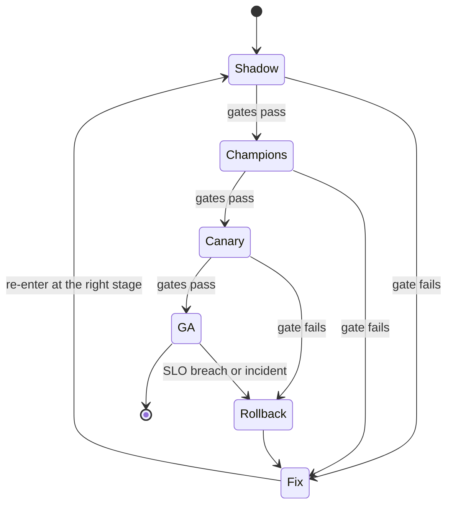
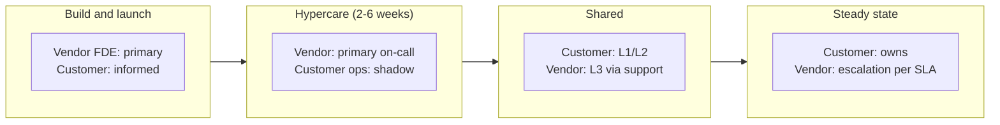

# Production Rollout, Monitoring, On-Call & Handoff to the Customer's Team

!!! abstract "Key takeaways"
    - **The goal is a system the customer can run without you.** Plan the handoff on day one: who will own it, what they need to learn, and how you'll know they're ready.
    - **Roll out progressively:** shadow mode → internal champions → canary cohort or percentage → general availability, each step with explicit gates (errors, latency, eval pass rate, cost per task, user feedback) and a tested **rollback** for code, prompts *and* model versions.
    - **Monitor what users and the business feel,** not just pods: availability, p95 latency and time to first token, error and refusal rates, guardrail triggers, groundedness and online eval scores, cost per task, adoption. Put dashboards and alerts in the customer's tools.
    - **On-call moves in phases:** vendor-led hypercare → shared (customer L1/L2, vendor L3) → customer-owned with vendor escalation via support SLAs. Write a RACI and severity definitions before go-live.
    - **Handoff is a process with exit criteria,** not a meeting: runbooks tied to alerts, an eval harness the customer can run, change procedures for prompts and models, reverse-shadowed incidents and game days, and finally removal of vendor access.

## Why it matters

FDE work is judged on what happens *after* the demo: does the system run in production, do people use it, and does it keep working when the FDE moves to the next customer? The two classic failure modes are:

1. **The hero deployment:** the FDE is the only person who understands the system. It works while they're on site and degrades within weeks of their leaving: prompts drift, a model version is retired, an alert fires and nobody knows what it means.
2. **The big-bang launch:** the assistant goes from pilot to 5,000 users on a Monday, a retrieval bug or a content filter misfire hits everyone at once, and trust is lost faster than it can be rebuilt.

Interviewers probe this through "How do you launch?" and "How do you hand over?" questions, and through behavioural questions about incidents (see [Production Incidents & Postmortems](../leadership-behavioral/08-production-incidents-and-postmortems.md)). The pilot-stage gates that precede this page are in [Pilot → POC → Production](../fde-customer-discovery/03-pilot-to-proof-of-concept-to-production-time-boxing-exit-cri.md); LLM-specific observability and cost control in [LLM Observability, Latency Budgets & Token Cost Control](../fde-applied-llm/07-llm-observability-latency-budgets-and-token-cost-control.md); general observability in [Observability & Production Support](../observability/index.md).

## Core concepts

### Production readiness

Before any real user traffic, confirm with the customer's owners:

| Area | Ready means |
|---|---|
| Security and compliance | Review approved; DPA/BAA signed; data-flow diagram matches what's deployed ([Security reviews](04-security-reviews-and-compliance-questionnaires-soc-2-hipaa-g.md)) |
| Identity and access | SSO, SCIM deprovisioning and permission trimming tested with real test users ([Enterprise identity](02-enterprise-identity-sso-scim-rbac-and-permission-propagation.md)) |
| Capacity | Load test at 2× expected peak against the real model quota; quota increases granted |
| Quality | Offline eval suite passes on the production model, platform and region; red-team results reviewed |
| Observability | Dashboards, alerts with runbook links, audit logging, cost tracking per tenant/route |
| Resilience | Backups and restore tested (DB, vector index), model fallback evaluated and approved, degraded mode defined |
| Change management | Change ticket approved in the customer's process (CAB, change window); rollback plan written and rehearsed |
| Support | RACI, severity levels, escalation contacts, on-call rota for hypercare published |

### Progressive rollout


*Notice that every stage has an exit on failure, and that rollback leads to a fix and a deliberate re-entry, not a quick retry of the same release.*

- **Shadow:** the assistant runs on real inputs but users don't see the output; compare against the human result or the current system. Good for measuring quality and latency safely.
- **Champions:** a small group of trained users who know it's new and give structured feedback. Often 10–50 people across roles.
- **Canary:** a cohort (a team, a site, a percentage of users or requests) on the new version, compared with the stable baseline over the same window.
- **GA:** everyone, with the feature flag and kill switch kept for some time.

LLM systems need rollback for more than code. A release can change **code, prompts, retrieval configuration (chunking, index), model version or provider settings (filters, routing)**. Version all of them, record which combination served each request, and be able to roll back each independently. The "model changed under us" incident (a retired version, an alias moving) is common enough to deserve its own runbook.

### What to monitor

| Layer | Signals | Why |
|---|---|---|
| Service | Availability, request rate, error rate (5xx, timeouts), p50/p95/p99 latency, saturation | Classic golden signals |
| Model calls | Time to first token, tokens in/out, 429s and quota headroom, provider errors, fallback rate | Provider limits and outages are the top external failure |
| Quality | Online eval pass rate (schema valid, grounded, policy passed), refusal rate, guardrail triggers, citation coverage, user thumbs up/down, escalation to human | Silent quality regressions don't throw errors |
| Retrieval | Hit rate, empty results, permission-filtered results, index freshness | Most "bad answers" are retrieval problems |
| Cost | Cost per task, per route, per tenant; daily spend vs budget | Bills spike from loops, retries or cache misses |
| Business | Adoption, tasks completed, time saved, deflection rate | The reason the system exists ([measuring business impact](../fde-customer-discovery/03-pilot-to-proof-of-concept-to-production-time-boxing-exit-cri.md)) |

Define **SLOs** with the customer (for example: 99.5% of requests succeed, p95 time to first token under 2 seconds during business hours, online eval pass rate at least 92% over a rolling day) and alert on burn rate, not every blip. Use OpenTelemetry so traces flow into whatever the customer runs (CloudWatch, Azure Monitor, Grafana, Datadog, Splunk); OpenTelemetry's GenAI semantic conventions give standard attribute names for model calls. Respect the data rules: traces with full prompts may contain PHI and must stay in approved stores (see [Network & data constraints](03-network-and-data-constraints-private-endpoints-proxies-egres.md)).

### On-call and escalation across two organisations


*Notice that ownership moves in steps, and each step needs evidence (see exit criteria below) before the next. Skipping hypercare or the shared phase is how hero deployments are born.*

Agree before go-live:

- **Severity levels** in the customer's language (Sev1: assistant down or exposing data for all users; Sev2: degraded for a site or a key workflow; Sev3: single-user or cosmetic) with response and update times for each.
- **RACI:** who detects, who triages, who fixes infrastructure, who fixes the product, who talks to users, who declares an incident, who calls the cloud provider or the model provider's support.
- **Escalation paths:** customer service desk → customer platform on-call → vendor support (with contract SLA) → vendor engineering; plus the cloud provider's support plan and the model platform status pages.
- **Data-exposure incidents** (a user saw something they shouldn't) go straight to the customer's security incident process, with breach-notification timelines from the DPA/BAA.
- **Postmortems** blameless, shared with the customer, with actions owned by name on both sides.

### Handoff

Handoff means transferring **capability**, not files. A useful handoff package:

1. **Architecture and decisions:** diagrams, data flows, ADRs (why this deployment model, model, routing, chunking).
2. **Runbooks** for every alert and for routine tasks: deploy, rollback, rotate secrets, re-index a source, onboard a new team, change a prompt, upgrade the model version, raise quota.
3. **Dashboards and alerts** in the customer's tools, each alert linked to a runbook.
4. **Eval harness and golden dataset** the customer can run themselves, with the pass thresholds and instructions for adding cases (see [Evals](../fde-applied-llm/05-evals-golden-datasets-llm-as-judge-retrieval-vs-answer-metri.md)).
5. **Change process for prompts and models:** who can change what, the review and eval gate, how to roll back.
6. **Access and secrets inventory:** every credential, role, service account and certificate, with owners and expiry dates.
7. **Cost model** and current spend, with budget alerts.
8. **Known issues and roadmap,** and how to request product changes from the vendor.

Then prove it: **reverse shadowing** (the customer drives, the FDE watches), **game days** (inject a provider outage, an expired certificate, a bad prompt release) and a period where the customer handles real incidents unaided. Only then remove vendor access and close the engagement with a business-outcome review.

## In practice: code & configuration

### Canary gate: promote, hold or roll back

The gate below ran offline. It compares canary and stable over the same window and refuses to decide on too little traffic.

```python
# canary_gate.py - promote, hold or roll back a canary by comparing it with the stable baseline (ran offline).
from dataclasses import dataclass

@dataclass
class Window:                      # metrics for the same time window, same traffic mix
    requests: int
    errors: int                    # 5xx + timeouts
    p95_ms: float
    eval_pass_rate: float          # online checks: schema valid, grounded, policy passed
    cost_per_task_usd: float

GATES = {"max_error_rate_delta": 0.005, "max_p95_ratio": 1.20,
         "max_eval_drop": 0.02, "max_cost_ratio": 1.15, "min_requests": 500}

def decide(stable: Window, canary: Window, g=GATES) -> tuple[str, list[str]]:
    if canary.requests < g["min_requests"]:
        return "HOLD", [f"only {canary.requests} canary requests; need {g['min_requests']}"]
    fails = []
    err_delta = canary.errors / canary.requests - stable.errors / stable.requests
    if err_delta > g["max_error_rate_delta"]:
        fails.append(f"error rate +{err_delta:.2%}")
    if canary.p95_ms > stable.p95_ms * g["max_p95_ratio"]:
        fails.append(f"p95 {canary.p95_ms:.0f}ms vs {stable.p95_ms:.0f}ms")
    if stable.eval_pass_rate - canary.eval_pass_rate > g["max_eval_drop"]:
        fails.append(f"eval pass {canary.eval_pass_rate:.1%} vs {stable.eval_pass_rate:.1%}")
    if canary.cost_per_task_usd > stable.cost_per_task_usd * g["max_cost_ratio"]:
        fails.append(f"cost/task ${canary.cost_per_task_usd:.3f} vs ${stable.cost_per_task_usd:.3f}")
    return ("ROLLBACK", fails) if fails else ("PROMOTE", ["all gates passed"])

stable = Window(requests=18_000, errors=36, p95_ms=4200, eval_pass_rate=0.94, cost_per_task_usd=0.031)
print(decide(stable, Window(300, 0, 3900, 0.95, 0.030)))
print(decide(stable, Window(2_000, 5, 4400, 0.935, 0.032)))
print(decide(stable, Window(2_000, 4, 4300, 0.90, 0.041)))
```
```text
('HOLD', ['only 300 canary requests; need 500'])
('PROMOTE', ['all gates passed'])
('ROLLBACK', ['eval pass 90.0% vs 94.0%', 'cost/task $0.041 vs $0.031'])
```

Note the third case: no errors and acceptable latency, yet a rollback, because quality and cost regressed. An error-rate-only canary would have promoted it.

### Alert rules linked to runbooks

Prometheus rule syntax; metric names are the product's own. Parsed as YAML; not checked with `promtool` (not installed).

```yaml
# assistant-alerts.yaml - every alert has an owner, a severity and a runbook
groups:
  - name: assistant-slo
    rules:
      - alert: AssistantHighErrorBurnRate
        # 99.5% success SLO; fast burn over 1h confirmed over 5m
        expr: |
          (sum(rate(assistant_requests_total{status=~"5..|timeout"}[1h])) / sum(rate(assistant_requests_total[1h]))) > (14.4 * 0.005)
          and
          (sum(rate(assistant_requests_total{status=~"5..|timeout"}[5m])) / sum(rate(assistant_requests_total[5m]))) > (14.4 * 0.005)
        labels: {severity: sev2, team: customer-platform}
        annotations:
          summary: "Assistant error budget burning fast"
          runbook_url: "https://wiki.customer.example/assistant/runbooks#high-error-rate"
      - alert: AssistantModelThrottling
        expr: sum(rate(assistant_llm_calls_total{outcome="throttled"}[10m])) / sum(rate(assistant_llm_calls_total[10m])) > 0.05
        for: 10m
        labels: {severity: sev3, team: customer-platform}
        annotations:
          summary: "More than 5% of model calls throttled (quota)"
          runbook_url: "https://wiki.customer.example/assistant/runbooks#model-throttling"
      - alert: AssistantQualityDrop
        expr: avg_over_time(assistant_online_eval_pass_ratio[2h]) < 0.92
        for: 30m
        labels: {severity: sev3, team: assistant-owners}
        annotations:
          summary: "Online eval pass rate below 92% for 2h window"
          runbook_url: "https://wiki.customer.example/assistant/runbooks#quality-drop"
      - alert: AssistantDailySpendOverBudget
        expr: sum(increase(assistant_llm_cost_usd_total[24h])) > 400
        labels: {severity: sev3, team: assistant-owners}
        annotations:
          summary: "LLM spend over $400 in 24h"
          runbook_url: "https://wiki.customer.example/assistant/runbooks#cost-spike"
```

### Rollout and handoff runbook: wrong vs right

=== "❌ Common mistake"
    ```text
    Go-live plan:
      Monday 9am: switch on for all 5,000 users.
      If problems: FDE will fix.
    Handoff:
      Last week of engagement: 2-hour KT call, share the Confluence space and the repo.
      FDE's personal API key still used by the nightly re-index job.
    ```
    No gates, no rollback, no owner after the FDE leaves, and a credential that dies with the FDE's account.

=== "✅ Correct approach"
    ```yaml
    # rollout-and-handoff.yaml - agreed with the customer, versioned in their repo
    release: assistant 2.7.1 / chart 1.4.0 / prompts v14 / model eu-profile (pinned) / index v6
    change_ticket: CHG-48121 (CAB approved, window Tue 19:00-21:00 CET)

    readiness_gates:            # all must be true before any user traffic
      - security_review: approved 2026-10-02 (risk acceptance RA-77 for audit retention, due 2026-11-15)
      - load_test: 2x peak (60 rpm) for 30 min, p95 TTFT 1.4s, 0 throttles
      - offline_evals: 94.1% on golden set v6 (threshold 92%), red-team report reviewed
      - restore_test: vector index + Postgres restored in staging in 38 min (RTO 2h)
      - rollback_rehearsal: helm rollback + prompt v13 + model pin revert, 7 min in staging
      - oncall: hypercare rota published; Sev definitions + escalation contacts signed off

    rollout:
      - stage: shadow           # 1 week, outputs hidden, compared with agents' actual replies
        gates: {eval_pass: ">=0.92", p95_ttft_s: "<=2.0"}
      - stage: champions        # 30 users across 3 sites, weekly feedback session
        gates: {thumbs_up: ">=0.75", sev1_sev2: 0}
      - stage: canary           # site A (~10% of users), compared with stable via canary_gate.py
        gates: {decision: PROMOTE, min_days: 5}
      - stage: ga
        kill_switch: feature flag assistant.enabled (customer ops can flip it)

    ownership:
      hypercare:   {weeks: 4, primary: vendor FDE, shadow: customer platform on-call}
      shared:      {weeks: 4, l1_l2: customer platform, l3: vendor support (Sev1 response 1h, 24x7)}
      steady:      {owner: customer platform, vendor: escalation per support contract}

    handoff_exit_criteria:      # evidence, not attendance
      - customer engineer performed a release, a rollback and a prompt change unaided
      - customer handled 2 real alerts end to end using runbooks; vendor observed only
      - game day passed: provider throttling + expired IdP certificate + bad prompt release
      - customer ran the eval harness and added 20 new golden cases
      - every credential owned by a customer service identity; vendor and FDE access removed
      - business review held: adoption, handle-time change, cost per task vs target
    ```

### Runbook entry format

```markdown
## Model throttling (alert: AssistantModelThrottling)
**Symptoms:** slow or failed answers; 429/ThrottlingException in logs; throttled ratio > 5%.
**Check:** quota usage dashboard (tokens/min vs limit per model and region); recent traffic jump?
recent prompt change that increased tokens? fallback deployment healthy?
**Act:** 1) confirm fallback is serving (dashboard "fallback rate"); 2) enable queueing for batch
routes (flag `assistant.batch.defer=true`); 3) if sustained > 1h, raise quota request with the cloud
provider (template in /runbooks/quota-request.md) or move routes to provisioned throughput.
**Escalate:** Sev2 if interactive success < 97% for 30 min -> vendor L3 via support portal.
**Owner:** customer platform on-call. **Last tested:** game day 2026-10-01.
```

## Real-world usage

- **Progressive delivery is standard** in mature platform teams (Argo Rollouts, Flagger, feature-flag services, cloud deployment tools with canaries). For AI features, teams add quality and cost gates to the usual error and latency checks.
- **Hypercare** is a familiar term in enterprise IT and consulting: a defined post-go-live period of heightened support before transition to business-as-usual operations. Customers expect it in the statement of work.
- **Forward-deployed teams** (Palantir, AI labs' FDE teams) explicitly measure whether the customer can operate and extend the system after the engagement, and feed repeated deployment friction back to product (see [Field feedback to product](../fde-customer-discovery/07-field-feedback-to-product-and-research-codifying-repeatable.md)).
- **Common incidents after handoff:** a model version retired and the customer didn't know the upgrade procedure; a corporate CA rotation broke outbound TLS; a re-index job ran under a departed engineer's credentials; a prompt edit in production without evals degraded answers for a week; costs doubled after a new team was onboarded without per-tenant budgets.

## Trade-offs & production gotchas

| Option | Pros | Cons | Use when |
|---|---|---|---|
| Big-bang launch | Fast, simple comms | Every defect hits everyone | Almost never for AI features |
| Shadow mode | Real-data quality measurement, zero user risk | Needs a comparison signal; costs tokens | Before any user exposure |
| Cohort canary (team/site) | Clear feedback loop, easy comms | Cohort may not be representative | Enterprise rollouts with distinct sites/teams |
| Percentage canary | Statistically cleaner | Confusing if users compare notes | High-volume, uniform user base |
| Vendor keeps on-call long term | Expertise | Customer never learns; expensive; access risk | Managed-service contracts only |
| Structured handoff with exit criteria | Durable ownership | Takes weeks; needs customer staff | Default for customer-operated deployments |

!!! warning "Gotcha: prompts and models are production changes"
    Treat a prompt edit, a retrieval setting or a model version change exactly like a code release: versioned, reviewed, evaluated, canaried and reversible. Many "the AI got worse" incidents trace back to an unreviewed prompt tweak or an alias that moved to a new model.

!!! warning "Gotcha: credentials that belong to people"
    Before you leave, search for anything running under your identity or a personal token: scheduled jobs, CI variables, connector service accounts, API keys, certificates. Move each to a customer-owned service identity with an owner and an expiry, then remove your access.

!!! tip "Interview angle"
    When asked how you'd launch, name the stages and the gates; when asked how you'd hand over, name the exit criteria. "Shadow, champions, canary, GA with quality and cost gates and a rehearsed rollback; hypercare then shared on-call; handoff complete when they've run a release, a rollback and two incidents without me."

## How this connects to my experience

- **Where I used it:**
    - **Leadership highlights:** "Led sprint planning, estimation, stakeholder communication, release management, and production support." Release management and production support are the core of this page.
    - **OptumRx Meteor (Publicis Sapient):** owned the GraphQL Consumer Service end to end (5 upstream systems, many consumers) for healthcare apps serving 750K+ users, and "Established engineering standards around testing, CI/CD, code quality, and deployment practices". *[confirm: rollout techniques used (feature flags, canaries, phased releases), monitoring stack, on-call rota and severity model]*
    - **Kafka workflows "with retry and DLQ handling"** at OptumRx: the operational pattern behind degraded modes and recovery runbooks.
    - **Services background (Publicis Sapient, Deloitte):** client delivery naturally ends in a transition to the client's or another team's operations. *[confirm: a concrete handover you led, e.g. KT to a client support team, and what went well or badly]*
    - **Mentored 5+ engineers:** the teaching half of handoff (reverse shadowing, runbooks people can actually follow).
- **Talking points:**
    - "On a 750K-user healthcare platform, a launch was a release-management exercise with production support behind it, not a deploy button. I'd bring the same discipline, plus quality and cost gates for LLM behaviour."
    - "My test for handoff is evidence: the customer's engineers do a release, a rollback and handle real alerts without me before I remove my access."
    - "I'd treat prompt and model changes as releases with evals as the gate, the same way we treated schema changes in the GraphQL layer." *[confirm: schema change process]*
- **Likely follow-up chain:** "How would you launch this to 5,000 users?" → "What do you monitor that a normal service doesn't?" → "Week two, quality drops but no errors. What happened?" → "How do you know the customer can run it without you?". Answer: readiness gates then shadow, champions, canary, GA with a kill switch; quality, refusals, guardrails, retrieval and cost signals with SLOs; check for prompt, retrieval, index or model-version changes and data drift, roll back the changed component, add eval cases; exit criteria with reverse shadowing, game days and access removal.

## Interview questions

### Fundamentals

??? question "Q1. What is hypercare and why plan it?"
    **Answer:** A defined period after go-live (often 2–6 weeks) with heightened support: the vendor team is primary on-call, issues are triaged daily, and the customer's operations team shadows. It catches early-life defects and usage surprises quickly and is when the customer learns to operate the system. Planning it sets expectations, staffing and the exit to shared or customer-owned support.

    **Interviewer listens for:** time-boxed; vendor primary with customer shadow; transition plan.

    **Common wrong answer:** "Being available on Slack after launch."

??? question "Q2. What would you monitor for an LLM assistant beyond standard service metrics?"
    **Answer:** Time to first token, tokens and cost per task, throttling and quota headroom, fallback rate, online quality signals (schema validity, groundedness, policy checks, eval pass rate), refusal and guardrail trigger rates, retrieval hit and empty-result rates, index freshness, user feedback and escalations to humans, and adoption. Quality regressions often show no errors, so they need their own signals and alerts.

    **Interviewer listens for:** quality and cost signals; retrieval; adoption.

    **Common wrong answer:** CPU, memory and 5xx only.

??? question "Q3. What can you roll back in an LLM system?"
    **Answer:** Application code and chart (Helm rollback), prompts and templates (versioned), retrieval config and index version, model version and provider settings (routing, content filters), and feature flags. Each should be versioned independently, logged per request, and rollback rehearsed. Data migrations need backward compatibility so code rollback works.

    **Interviewer listens for:** more than code; per-request version logging; rehearsal.

    **Common wrong answer:** "Redeploy the previous image."

### Intermediate

??? question "Q4. How do you design canary gates for an AI feature?"
    **Answer:** Compare canary and stable over the same window and traffic mix on error rate, latency (p95 and time to first token), online eval pass rate and cost per task, with a minimum sample size before deciding. Set thresholds relative to the baseline, hold when data is insufficient, roll back on any gate failure, and include user feedback for cohort canaries. Automate the decision where possible.

    **Interviewer listens for:** relative comparison; quality and cost gates; minimum sample.

    **Common wrong answer:** "If there are no errors for an hour, promote."

??? question "Q5. How do you set SLOs with a customer for an assistant?"
    **Answer:** Start from user experience and business need: success rate, p95 time to first token for interactive use, maybe a quality SLO (online eval pass rate) and freshness of indexed content. Agree measurement windows and business hours, exclude planned maintenance, define error budgets and what happens when they're spent (freeze changes, prioritise reliability). Alert on burn rate. Keep them few and owned.

    **Interviewer listens for:** user-centric; error budget policy; burn-rate alerting.

    **Common wrong answer:** "Five nines."

??? question "Q6. What goes into a handoff package?"
    **Answer:** Architecture and ADRs, runbooks for each alert and routine operation, dashboards and alerts in their tools, the eval harness and golden set, the prompt and model change process, an inventory of credentials and certificates with owners and expiry, the cost model and budgets, known issues, roadmap and the path to request product changes. Then proof through reverse shadowing and game days.

    **Interviewer listens for:** runbooks tied to alerts; evals; credential inventory; proof.

    **Common wrong answer:** "The repo and a recorded KT call."

### Senior

??? question "Q7. How do you split on-call between vendor and customer for a customer-VPC deployment?"
    **Answer:** In phases with a RACI: vendor primary during hypercare with customer shadowing; then customer L1/L2 (alerts, runbooks, infrastructure) with vendor L3 for product defects via support SLAs; then customer-owned with vendor escalation. Define severities, response times, communication owners, and who calls the cloud and model providers. Data-exposure incidents go to the customer's security process. Vendor production access for L3 is break-glass with customer approval.

    **Interviewer listens for:** phases; RACI; break-glass; security incidents path.

    **Common wrong answer:** "We'll just give them our pager number."

??? question "Q8. Quality drops in week two but there are no errors. How do you investigate?"
    **Answer:** Look at what changed: deploys, prompt versions, retrieval settings, index rebuilds, source content changes, model version or provider-side changes (aliases, filters), traffic mix (new team, new question types). Slice online eval and feedback by route, cohort and source. Sample failing cases and classify (retrieval miss, permission filtering, model reasoning, filter refusal). Roll back the changed component if one is found; otherwise add cases to the eval set and fix the root cause. Postmortem and a new alert if detection was slow.

    **Interviewer listens for:** change correlation; slicing; failure taxonomy; eval set grows.

    **Common wrong answer:** "Switch to a bigger model."

??? question "Q9. How do you know the customer is ready to own the system?"
    **Answer:** Evidence-based exit criteria: their engineers performed a release, a rollback and a prompt change unaided; handled real alerts end to end with runbooks while you only observed; passed game days (provider outage, expired certificate, bad prompt release); ran evals and extended the golden set; all credentials moved to customer service identities and vendor access removed; and a business review confirmed outcomes. If any criterion fails, extend the shared phase deliberately.

    **Interviewer listens for:** demonstrated capability; access removal; business outcome.

    **Common wrong answer:** "When the KT sessions are done."

### Scenario-based

??? question "Q10. Launch week: a Sev1 where the assistant shows one region's claims to users in another region. Walk through your response."
    **Answer:** Contain first: flip the kill switch or disable the affected source, and confirm exposure has stopped. Declare the incident in the customer's process and involve their security team, because this may be a reportable privacy event under the BAA/DPA. Preserve logs (who saw what, retrieved document IDs). Root-cause in the permission path: ABAC region filter missing on a code path, stale group sync, wrong ACLs at ingestion. Fix, add regression tests and an alert on permission-filter anomalies, re-enable progressively, and run a blameless postmortem with both organisations.

    **Interviewer listens for:** containment; security process and notification; evidence; progressive re-enable.

    **Common wrong answer:** "Hotfix and redeploy quietly."

??? question "Q11. Your engagement ends in two weeks, but the customer's platform team hasn't staffed an owner. What do you do?"
    **Answer:** Raise it early and explicitly with the sponsor as a risk to the outcome, with options: extend the shared-support phase under a support contract, delay full handoff until an owner is named, or reduce scope to what their current team can operate (fewer sources, simpler routing). Meanwhile finish everything that doesn't depend on the person: runbooks, alerts, evals, credential migration. Don't leave silently with yourself as the only operator.

    **Interviewer listens for:** escalation to sponsor; options; no silent hero exit.

    **Common wrong answer:** "Hand over to whoever is available and leave."

## Cheat sheet

| Concept | Remember |
|---|---|
| Readiness | Security approved, identity tested, 2× load test, evals, restore test, rollback rehearsed, RACI and on-call |
| Rollout | Shadow → champions → canary → GA; kill switch; gates on errors, latency, quality, cost |
| Rollback | Code, chart, prompts, retrieval/index, model version, provider settings; versioned per request |
| Monitor | Golden signals + TTFT, tokens, throttling, fallback, online evals, refusals, retrieval, cost, adoption |
| SLOs | Few, user-centric, burn-rate alerts, error-budget policy |
| On-call phases | Hypercare (vendor) → shared (customer L1/L2, vendor L3) → customer-owned |
| Handoff package | ADRs, runbooks ↔ alerts, dashboards, eval harness, change process, credential inventory, costs |
| Exit criteria | Customer did release + rollback + prompt change, handled real alerts, passed game days; vendor access removed |

## Sources
1. [Google SRE Book: Service Level Objectives](https://sre.google/sre-book/service-level-objectives/) and [SRE Workbook: Alerting on SLOs](https://sre.google/workbook/alerting-on-slos/): SLOs, error budgets, multi-window burn-rate alerts (the 14.4× fast-burn factor).
2. [Google SRE Workbook: Canarying releases](https://sre.google/workbook/canarying-releases/): canary design, baseline comparison, sample size.
3. [OpenTelemetry: Semantic conventions for generative AI](https://opentelemetry.io/docs/specs/semconv/gen-ai/): standard attributes for model-call telemetry.
4. [Prometheus: Alerting rules](https://prometheus.io/docs/prometheus/latest/configuration/alerting_rules/): rule syntax, `for`, labels and annotations.
5. [Argo Rollouts documentation](https://argoproj.github.io/argo-rollouts/): progressive delivery with analysis-based promotion and rollback.
6. [Helm: helm rollback](https://helm.sh/docs/helm/helm_rollback/): release rollback.
7. [AWS Well-Architected Framework: Operational Excellence pillar](https://docs.aws.amazon.com/wellarchitected/latest/operational-excellence-pillar/welcome.html): runbooks, game days, operational readiness reviews.
8. [PagerDuty Incident Response documentation](https://response.pagerduty.com/): severity levels, roles and postmortems.
