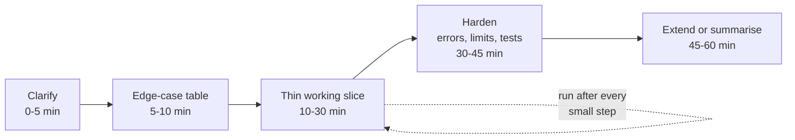
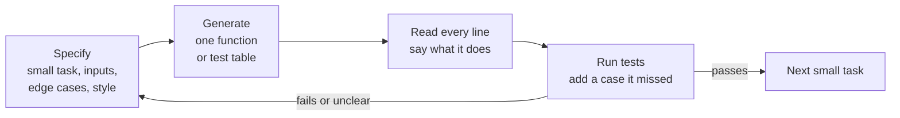

# Practical Coding Round Format: Narrating, Edge Cases First, Using AI Tools in the Round

!!! abstract "Key takeaways"
    - The FDE practical round is **production-style, not LeetCode**: extend or debug an existing codebase, integrate an API (auth, pagination, rate limits, retries), consume webhooks, clean messy data, or build a small endpoint. It's usually **45–60 minutes**, often in **Python**, sometimes TypeScript or your choice (prep-site and candidate reports).
    - It scores **working code, edge cases, code quality, tests, production thinking and communication**. A correct solution delivered in silence scores worse than a slightly smaller one explained well.
    - Run a fixed plan: **clarify (5 min) → edge-case table (5) → thin working slice (20) → harden (15) → extend or summarise (10)**. Get something running by minute 25.
    - **Edge cases first:** write the inputs that break code (empty, duplicate, null, wrong type, boundary, time zone, money, failing dependency) as a test table *before* the code. It's the fastest way to show seniority.
    - **AI tools, when allowed:** you're judged on how you **direct, read and verify** the tool, not on how much it writes. Ask the rules first; companies differ (Meta runs an AI-enabled round; Anthropic's candidate guidance says no AI in live interviews unless told otherwise).

## Why it matters

FDE loops replace (or add to) the classic algorithm round with a coding exercise that looks like the job: a customer's half-working integration, a script that produces the wrong numbers, a webhook endpoint that double-charges. Prep sites describe the format as "extend, debug or refactor real-looking code; call an API; handle pagination, errors and retries" (see [the loop map](../fde-role-interview-loop/03-the-fde-interview-loop-mapped-screens-take-home-practical-co.md)). Candidate reports for OpenAI's FDE loop mention an "AI-enabled coding screen" alongside a take-home; Google's FDE loop is reported to include production-style coding. Treat all of these as candidate-reported, and confirm the format with the recruiter.

The round exists because an FDE's code runs inside someone else's system, often on day one, with the customer watching. The interviewer is asking: *would I trust this person alone at a customer site with our product?* That trust comes from three behaviours you can practise:

1. **You clarify before typing**, so you build the right thing.
2. **You find the edge cases before the customer does**, so your code survives real data.
3. **You think out loud**, so the people around you can follow, correct and trust you.

Engineers from a Java/Spring background usually have the production instincts already (timeouts, retries, validation, logging). What they need to practise is doing it **fast, in Python, while talking**.

## Core concepts

### What the round looks like

| Variant | Typical prompt | What it really tests | Page |
|---|---|---|---|
| API integration | "Pull all orders from this API and compute X" | Auth, pagination, 429/5xx handling, timeouts | [API integration](02-third-party-api-integration-auth-pagination-rate-limits-retr.md) |
| Webhook consumer | "Receive payment events and update order state" | Signature check, dedupe, ordering | [Webhooks](03-webhooks-signature-verification-idempotent-consumers-duplica.md) |
| Debug | "This function returns the wrong totals. Fix it." | Reproduce, hypothesise, verify | [Debugging](04-debugging-and-reading-an-unfamiliar-codebase-fast.md) |
| Refactor and extend | "Add a new pricing rule without breaking tests" | Characterisation tests, small steps | [Refactoring](05-refactoring-and-extending-messy-code-without-breaking-its-te.md) |
| Data wrangling | "Join these two CSVs and report anomalies" | Nulls, duplicates, types, time zones | [Python fluency](06-python-fluency-for-fde-scripting-data-wrangling-fastapi-serv.md) |
| Small service or UI | "Expose this as an endpoint" / "show it in a page" | Validation, errors, a clean demo | [Prototyping](07-rapid-full-stack-prototyping-typescript-service-plus-react-u.md) |

Environments vary: a shared editor (CoderPad-style) with a runnable sandbox, your own IDE over screen share, or a repository you clone. Some rounds are multi-stage: each stage adds a requirement (now handle rate limits; now dedupe; now add a CLI flag), which rewards code that's easy to extend.

### How it's scored

Rubrics aren't published, but prep sites and interviewer write-ups describe the same dimensions. A useful model:

| Dimension | Strong signal | Weak signal |
|---|---|---|
| Working code | Runs early, runs often, ends working | Big-bang code that never ran |
| Correctness and edge cases | Names and tests the tricky inputs | Happy path only |
| Code quality | Small functions, clear names, no clever tricks | One 80-line function |
| Testing | Asserts or pytest cases written as you go | "I'd add tests later" |
| Production thinking | Timeouts, retries, idempotency, logging, limits | Ignores failure entirely |
| Communication | Plan stated, trade-offs explained, asks precise questions | Silence, or narration with no decisions |
| Tool use (if allowed) | Directs, reads and verifies the AI's output | Pastes output it can't explain |


*Notice the self-loop on the working slice: you run the code after every small step. Something should execute by minute 25, even if it only handles the happy path.*

### Clarify: the five questions

Before typing, restate the task in one sentence and ask the questions that change the code:

1. **Inputs:** shape, size, source, and how dirty it is. "Can amounts be strings? Can the list be empty? How big can it get?"
2. **Outputs:** exact type and format; what happens to bad rows (skip, fail, report).
3. **Failure behaviour:** what should happen if the API is down or rate-limits us?
4. **Constraints:** language, libraries allowed, time, whether I can use AI tools.
5. **Done:** "If I get X working with tests, is that a good stopping point before we extend?"

Say your assumptions out loud and write them at the top of the file as a comment. When the interviewer changes a requirement later, you'll see exactly which assumption moved.

### Narrating without slowing down

Narration isn't a running commentary of keystrokes. It's **decisions and reasons**, said at the moments they happen:

| Moment | What to say |
|---|---|
| Start | "Plan: parse, then aggregate, then handle bad rows. I'll get the happy path running first." |
| Choosing | "I'll use `Decimal` here, not float, because this is money." |
| Unsure | "I'm not sure whether `next_cursor` is missing or null on the last page. I'll handle both." |
| Stuck | "This assertion fails. My hypothesis is the duplicate row. Let me print the IDs." |
| Trade-off | "I'm skipping retries for now and leaving a TODO; I'd rather have pagination correct first." |
| Done with a piece | "That passes the empty and duplicate cases. Next: refunds." |

If you need silence to think, ask for it: "Give me a minute to read this function, then I'll tell you what I think it does." Prep guides and candidate reports repeatedly cite **long unexplained silence** as a failure mode in FDE loops, because the round stands in for pairing with a customer's engineer.

### Edge cases first

The fastest seniority signal is naming the inputs that break code **before** you write it. Use a checklist and turn the relevant rows into a test table:

| Category | Ask about |
|---|---|
| Size | Empty, one element, very large (stream instead of loading all) |
| Duplicates | Same ID twice, re-sent rows, retried events |
| Missing and null | Missing keys, `None`, empty strings, `NaN` |
| Types and format | Numbers as strings, whitespace, case, Unicode, BOM in CSV |
| Boundaries | Off-by-one at thresholds (`>` vs `>=`), first and last page |
| Time | Time zones, DST, naive vs aware datetimes, ordering by time |
| Money | Floats (`0.1 + 0.2`), rounding rules, currency |
| Ordering | Out-of-order input, stable sort, ties |
| Dependencies | Timeouts, 429, 5xx, partial failure, retries causing duplicates |
| Security | Untrusted input, secrets in logs, signature checks |

You won't test all of them. Pick the five that matter for this task, say why you picked them, and write them down. That's the visible thinking interviewers listen for.

### Using AI tools in the round

Policies differ, and they change:

- **Meta** began piloting an **AI-enabled coding interview** in late 2025: a 60-minute CoderPad session with a built-in assistant and a multi-file codebase with partially built features, failing tests and bugs (reported by Hello Interview and interviewing.io; candidates choose between several models).
- **Anthropic's** published candidate guidance (updated July 2025) encourages using Claude to refine applications, but asks candidates not to use AI during live interviews or take-homes unless explicitly told they may.
- **OpenAI's** FDE loop includes an "AI-enabled coding screen" in candidate reports. Details vary by team.

So the first rule is: **ask**. "Am I allowed to use an AI assistant, and if so, which one and for what?"

If AI is allowed, the round shifts from "can you write this?" to "can you **direct and verify** a fast but fallible collaborator?". Use a tight loop:


*Notice that the AI never writes more than you can read in a minute, and nothing is accepted without a run. The edge cases come from you; the boilerplate can come from the tool.*

What to delegate and what to keep:

| Delegate to the AI | Keep for yourself |
|---|---|
| Boilerplate: argparse, FastAPI skeleton, dataclasses | The plan and the decomposition |
| Test-case scaffolding from *your* edge-case list | Choosing which edge cases matter |
| Syntax you've forgotten (`pandas` merge options) | Reading and explaining every line |
| A first draft of a regex or parser | Deciding retry, idempotency and error policy |
| Explaining an unfamiliar library function | Verifying claims with a quick experiment |

Prompts that work in a round are short and specific: *"Write a pytest parametrize table for `customer_totals` covering: empty list, duplicate ids, refund status, amount as string with whitespace, missing customer_id. Don't implement the function."* Then read the table aloud and add the case it missed.

Red flags interviewers report noticing: accepting a 60-line answer without reading it, not being able to explain a line when asked, letting the tool choose libraries the environment doesn't have, and debugging by re-prompting instead of by reasoning. The same applies at a customer site: you own every line you ship, whoever typed it.

## In practice: code & configuration

A typical 45-minute prompt: *"Here's an export of transactions. Return the total per customer."* The edge-case conversation turns out to matter more than the loop.

=== "❌ Common mistake"
    ```python
    # Starts typing immediately, happy path only, no questions asked.
    def customer_totals(rows):
        totals = {}
        for r in rows:
            totals[r["customer_id"]] = totals.get(r["customer_id"], 0) + float(r["amount"])
        return totals

    # Problems the interviewer is waiting for you to notice:
    #  - float money: 10.10 + 0.20 == 10.299999999999999
    #  - duplicate transaction ids (exports re-send rows) are double counted
    #  - refunds counted as revenue
    #  - one bad row ("abc", missing customer) crashes the whole run with KeyError/ValueError
    ```

=== "✅ Correct approach"
    ```python
    """Practical-round task: per-customer totals from a messy transaction export."""
    from collections import defaultdict
    from decimal import Decimal, InvalidOperation

    def customer_totals(rows: list[dict]) -> dict[str, Decimal]:
        """Sum settled amounts per customer.

        Decisions agreed with the interviewer (edge cases first):
          - empty input -> {}
          - duplicate transaction ids -> count once (exports re-send rows)
          - status "refunded" -> excluded; amounts are strings like "12.50"
          - missing customer_id or unparseable amount -> skipped and reported, not a crash
        """
        totals: dict[str, Decimal] = defaultdict(Decimal)
        seen: set[str] = set()
        for row in rows:
            tx_id, customer = row.get("id"), row.get("customer_id")
            if not customer or tx_id in seen:
                continue
            if row.get("status") == "refunded":
                continue
            try:
                amount = Decimal(str(row.get("amount", "")).strip())
            except InvalidOperation:
                continue                      # in the real job: log + count rejects
            seen.add(tx_id)
            totals[customer] += amount
        return dict(totals)
    ```

The edge-case table, written **before** the function body and run with `pytest -q`:

```python
from decimal import Decimal
import pytest
from totals import customer_totals

@pytest.mark.parametrize(
    "rows, expected",
    [
        ([], {}),                                                         # empty input
        ([{"id": "t1", "customer_id": "c1", "amount": "10.10"},
          {"id": "t2", "customer_id": "c1", "amount": "0.20"}], {"c1": Decimal("10.30")}),  # no float drift
        ([{"id": "t1", "customer_id": "c1", "amount": "5"},
          {"id": "t1", "customer_id": "c1", "amount": "5"}], {"c1": Decimal("5")}),        # duplicate id
        ([{"id": "t1", "customer_id": "c1", "amount": "5", "status": "refunded"}], {}),    # refund excluded
        ([{"id": "t1", "customer_id": None, "amount": "5"},
          {"id": "t2", "customer_id": "c2", "amount": "abc"}], {}),                        # bad rows skipped
        ([{"id": "t1", "customer_id": "c1", "amount": " 7.5 "}], {"c1": Decimal("7.5")}),  # whitespace
    ],
    ids=["empty", "decimal", "duplicate", "refund", "bad-rows", "whitespace"],
)
def test_customer_totals(rows, expected):
    assert customer_totals(rows) == expected
```

Why this works in the round:

- `ids=` makes failures readable (`test_customer_totals[duplicate]`), which helps you narrate a failure.
- `Decimal("10.10")` from a **string** is exact; `Decimal(10.10)` from a float isn't. Say this out loud; it's a classic follow-up.
- Skipping bad rows is a **decision**, not a default. In production you'd count and log rejects, and maybe fail the run above a threshold (see the CLI script in [Python fluency](06-python-fluency-for-fde-scripting-data-wrangling-fastapi-serv.md)).

### What a good narration sounds like (first five minutes)

```text
"Let me restate: given transaction rows, return total per customer. A few questions:
 Are amounts strings or numbers? ... Strings, OK, so I'll parse with Decimal, not float.
 Can the same transaction appear twice? ... It can, exports re-send rows. I'll dedupe on id.
 Do refunds count? ... No. And if a row is broken, do we fail or skip? ... Skip and report.
Plan: I'll write the edge cases as a pytest table first, then the loop, then run it.
I'll leave logging of rejected rows as a TODO unless we have time."
```

### Practice: three timed prompts

Do each in 45 minutes, out loud, recording yourself. Score with the rubric above.

1. **Late shipments.** A JSON list of shipments with `promised_at` and `delivered_at` (ISO strings with offsets, some missing). Return late shipment IDs per carrier per UTC day. Edge cases to find: missing `delivered_at` (still in transit: late only if now > promised), mixed offsets, duplicates.
2. **Paged users.** A fake `get_page(cursor)` function returns `{"users": [...], "next": str | None}` and raises `RateLimited(retry_after=2)` on every fifth call. Return all active users' emails, deduped and lower-cased. Edge cases: last page with empty list, rate limit mid-stream, duplicate users across pages.
3. **Extend the totals function.** The interviewer now says amounts may come in different currencies with a `rates` dict. Add conversion without breaking the six existing tests. Edge cases: unknown currency, rounding to cents (`quantize(Decimal("0.01"), ROUND_HALF_UP)`).

## Real-world usage

- **Customer sites look like the round.** The first week of a deployment is usually reading someone else's integration code, adding a field, and fixing the bug that made the numbers wrong. The habits are the same: clarify, edge cases, small steps, talk.
- **AI-assisted coding is now normal at work.** Many teams use assistants daily; the engineering skill has shifted towards specifying, reviewing and testing. Interview formats like Meta's AI-enabled round are an explicit response to that shift.
- **Regulated domains raise the bar on edge cases.** In healthcare and banking, a silently skipped row is a compliance issue; in cloud security, a missed signature check is a vulnerability. Saying "I'd count and report rejects, not drop them silently" lands well with interviewers from those domains.

## Trade-offs & production gotchas

| Choice | Pros | Cons | Use when |
|---|---|---|---|
| Edge-case table first | Shows thinking; fast feedback | Costs 5 minutes up front | Almost always |
| Code first, tests after | Quick visible progress | Tests get skipped when time runs out | Tiny tasks you can verify by eye |
| `assert` lines in a script | Zero setup | Stops at first failure; less readable | Sandbox without pytest |
| pytest `parametrize` | One case per row, readable failures | Needs pytest available | Default when allowed |
| Use AI for boilerplate | Saves minutes | Risk of unread code | Allowed rounds, with read-and-run discipline |
| No AI even if allowed | Shows raw fluency | Slower on boilerplate | When you're faster without it |

!!! warning "Gotchas"
    - **Don't gold-plate.** Retries, logging and a CLI are great *after* the core works. A perfect retry decorator with broken pagination fails the round.
    - **Don't silently change the requirement.** If you decide to skip bad rows, say so and get a nod.
    - **Keep the code runnable at every step.** If the sandbox breaks at minute 40 you want a known-good version from minute 35.
    - **AI hallucinated APIs.** An assistant may call a library function that doesn't exist in the installed version. Run it before you build on it.
    - **Time-box debugging.** If a bug takes more than five minutes, state your hypothesis, add a print, and ask whether to keep going or move on.

!!! question "Interview angle"
    Many practical rounds end with "What would you do with another hour?" or "How would you make this production-ready?" Have a ready list: tests for the remaining edge cases, structured logging and metrics, configuration for secrets, retries with backoff, idempotency, and a README for the customer's team.

## How this connects to my experience

- **Where it applies:** not a resume claim as a round. The closest evidence: "Conducted technical interviews and contributed to hiring decisions" (I've been on the other side of the table) and "Established engineering standards around testing, CI/CD, code quality, and deployment practices" (OptumRx Meteor, Publicis Sapient).
- **Talking points:**
    - As an interviewer, I know what I look for: clarifying questions, a plan, tests, and narration. *[confirm: the format of the interviews you ran, e.g. Java coding or system design]*
    - The testing standards I set at OptumRx are the same instincts the round rewards: edge cases first, small verifiable steps. *[confirm: the specific standards, e.g. coverage gates or test review checklists]*
    - Python is on my resume, and FDE rounds lean on it. *[confirm: how much production Python you've written, so you can be honest about fluency and practise accordingly]*
- **Likely follow-up chain:** "How do you approach an unfamiliar coding task?" → "What do you do when you're stuck?" → "How do you use AI tools day to day?" Answer with the plan (clarify, edge cases, thin slice), the stuck protocol (hypothesis, print, ask), and an honest description of how you use assistants and verify their output. *[confirm: which AI coding tools you use at work]*

## Interview questions

### Fundamentals

??? question "Q1. How is an FDE practical coding round different from a LeetCode round?"
    **Answer:** It uses realistic code and tasks: integrate an API, fix a bug in existing code, extend a messy module, clean data, build a small endpoint. It's scored on working code, edge cases, error handling, tests and communication rather than on finding an optimal algorithm. Complexity still comes up, but rarely beyond "don't load everything into memory" or "don't make N+1 calls".

    **Interviewer listens for:** production concerns (errors, retries, data quality) and communication, not just correctness.

    **Common wrong answer:** "It's easier LeetCode." Preparing that way leaves you unready for pagination, retries and messy data.

??? question "Q2. What do you do in the first five minutes?"
    **Answer:** Restate the task, ask about inputs, outputs, failure behaviour, constraints (language, libraries, AI tools) and what "done" means. Write assumptions at the top of the file, then list the edge cases I'll test. Only then start coding the thinnest working slice.

    **Interviewer listens for:** clarifying questions that change the code, and a stated plan.

    **Common wrong answer:** starting to type immediately "to save time".

??? question "Q3. Why write edge cases before the code?"
    **Answer:** It forces you to understand the input, surfaces requirement questions early (do refunds count?), gives you tests to run after every step, and shows the interviewer your thinking. It costs about five minutes and usually saves more in debugging.

    **Interviewer listens for:** edge cases as a design tool, not an afterthought.

    **Common wrong answer:** "I'll add tests at the end if there's time."

??? question "Q4. Why use `Decimal` rather than `float` for money in Python, and how do you construct it?"
    **Answer:** Binary floats can't represent most decimal fractions exactly, so sums drift (`10.10 + 0.20 == 10.299999999999999`). `Decimal` does exact decimal arithmetic. Construct it from a **string** (`Decimal("10.10")`), because `Decimal(10.10)` captures the float's binary error. Round with `quantize` and an explicit rounding mode. In Java the equivalent is `BigDecimal` built with `new BigDecimal("10.10")`.

    **Interviewer listens for:** constructing from strings and explicit rounding.

    **Common wrong answer:** "Round the float at the end", which hides errors in aggregates and comparisons.

### Intermediate

??? question "Q5. What does good narration sound like, and what does bad narration sound like?"
    **Answer:** Good narration states decisions and reasons at the moment they happen: the plan, why `Decimal`, which edge case I'm handling, my hypothesis for a failing test, and what I'm deferring. Bad narration reads keystrokes aloud ("now I type for...") or goes silent for minutes. If I need to think, I say so and give a time.

    **Interviewer listens for:** decisions, trade-offs and hypotheses, not a transcript.

    **Common wrong answer:** "I talk the whole time", which often means describing syntax.

??? question "Q6. You're allowed an AI assistant. How do you use it?"
    **Answer:** In a tight loop: give it a small, specific task with my edge cases and constraints, read every line it produces and explain it, run the tests, and add the case it missed. I use it for boilerplate, scaffolding and forgotten syntax, and I keep the plan, the edge-case choices and the error policy myself. If something fails, I reason about it before re-prompting.

    **Interviewer listens for:** verification discipline and ownership of the code.

    **Common wrong answer:** pasting the whole prompt into the tool and accepting the result.

??? question "Q7. The AI assistant produces code using a library function you don't recognise. What do you do?"
    **Answer:** Check it before relying on it: `help()` or the docs, or a two-line experiment in the REPL. If it doesn't exist in the installed version, rewrite that part. Tell the interviewer what I found. It's the same learning-test habit as in the [learning round](../fde-decomposition-scoping/06-the-learning-round-picking-up-an-unfamiliar-api-language-or.md).

    **Interviewer listens for:** verifying claims cheaply and quickly.

    **Common wrong answer:** trusting it because it looks plausible.

??? question "Q8. How do you decide what to skip when time is short?"
    **Answer:** Protect the core path and correctness first (right answer on realistic input), then the edge cases with the highest business impact (duplicates, money, bad rows), then resilience (retries, timeouts), then polish (CLI, logging format). I say what I'm skipping and leave a TODO so it's a visible decision.

    **Interviewer listens for:** explicit prioritisation; see [cutting scope under time](../fde-decomposition-scoping/04-prioritisation-trade-off-calls-and-cutting-scope-under-time.md).

    **Common wrong answer:** trying to do everything and finishing nothing.

### Senior

??? question "Q9. How would you design a practical coding round if you were the interviewer?"
    **Answer:** A small realistic codebase with a clear first task (fix a bug or call an API), then two or three extension stages (rate limiting, dedupe, a new rule). A rubric covering working code, edge cases, quality, tests, production thinking and communication, with examples of strong and weak signals. Clear AI-tool rules stated at the start. Hints planned in advance so stuck candidates still show the later skills.

    **Interviewer listens for:** understanding that the round measures behaviours, and fairness.

    **Common wrong answer:** "One hard problem and see if they solve it."

??? question "Q10. What production concerns would you mention even if you don't implement them?"
    **Answer:** Timeouts on every network call; retries with backoff and jitter only for retryable errors; idempotency for writes; pagination limits and memory (stream rather than load all); structured logging without secrets or PII; configuration for credentials; metrics for rejects and latency; tests for failure paths. Mentioning them briefly with a TODO shows the instincts without burning time.

    **Interviewer listens for:** breadth with prioritisation.

    **Common wrong answer:** none mentioned, or spending 20 minutes implementing a logging framework.

??? question "Q11. How do you keep AI-generated code from lowering quality in a real customer deployment?"
    **Answer:** The same controls as for human code, applied consistently: small diffs, code review by someone who understands the domain, tests that encode edge cases written by a human, static checks and type checking in CI, and no secrets or customer data pasted into tools the customer hasn't approved. I'd also check the customer's policy on AI tools before using them on their code.

    **Interviewer listens for:** ownership, review discipline, and customer data policy awareness.

    **Common wrong answer:** "The AI is usually right."

### Scenario-based

??? question "Q12. Twenty minutes in, you realise you misunderstood the requirement. What do you do?"
    **Answer:** Say it immediately, restate the corrected understanding, and check it with the interviewer. Then see how much of the existing code survives (often the parsing and tests do) and adjust the plan out loud. Early, honest correction is a positive signal; quietly patching around it isn't.

    **Interviewer listens for:** composure and transparency.

    **Common wrong answer:** carrying on and hoping it doesn't matter.

??? question "Q13. Your code works, but one test fails and you can't see why after five minutes. What now?"
    **Answer:** State the hypothesis, shrink the input to the smallest failing case, print the intermediate values, and compare with the expected result. If it's still unclear, ask the interviewer whether to keep going or move on, and note the failing case. Time-boxing and narrating keeps the round productive.

    **Interviewer listens for:** a debugging method, not random edits.

    **Common wrong answer:** changing code at random until it passes.

??? question "Q14. The interviewer adds a requirement in the last 10 minutes. How do you respond?"
    **Answer:** Restate it, say where it fits in the code, and estimate whether it fits in 10 minutes. If yes, write the test first and implement. If not, describe the design change precisely (which function changes, which new test) and implement the smallest part. Extension stages test whether the code was built to change.

    **Interviewer listens for:** calm scoping and code that's easy to extend.

    **Common wrong answer:** rewriting everything in a panic.

??? question "Q15. You're told AI tools are allowed, but you're faster without them for this task. Is it OK not to use them?"
    **Answer:** Yes, and say why: "This is small enough that I'll write it directly; I might use the assistant for the test scaffolding." What matters is good judgement about when a tool helps. Refusing on principle or using it for everything are both weaker signals than a reasoned choice.

    **Interviewer listens for:** tool choice as a judgement call.

    **Common wrong answer:** using it just because it's allowed, then fighting its output.

## Cheat sheet

| Concept | Remember |
|---|---|
| Format | 45–60 min, realistic code, often Python; confirm with recruiter |
| Plan | Clarify 5 → edge cases 5 → thin slice 20 → harden 15 → extend 10 |
| Clarify | Inputs, outputs, failure behaviour, constraints (incl. AI), done |
| Narrate | Decisions and reasons, hypotheses, deferrals; ask for silence if needed |
| Edge cases | Empty, duplicate, null, type, boundary, time zone, money, dependency failure |
| Tests | pytest `parametrize` with `ids=`; or plain `assert` in a sandbox |
| Money | `Decimal("10.10")` from strings; `quantize` with a rounding mode |
| AI loop | Specify small → generate → read every line → run → add missed case |
| AI rules | Ask first; Meta allows in its AI-enabled round; Anthropic says no unless told |
| End | "With another hour I'd..." list ready |

## Sources
1. [Exponent: OpenAI FDE interview guide](https://www.tryexponent.com/guides/openai-forward-deployed-engineer-interview): practical rounds and AI-enabled coding screen (prep site, candidate reports).
2. [Exponent: the FDE interview loop](https://www.tryexponent.com/courses/forward-deployed-engineering/intro-fde-interviews/fde-loop): practical coding as a round type (prep site).
3. [igotanoffer: OpenAI FDE interview](https://igotanoffer.com/en/advice/openai-forward-deployed-engineer-interview): coding round described as moderate, with emphasis on explaining decisions (candidate reports).
4. [Hello Interview: Meta's AI-enabled coding interview](https://www.hellointerview.com/blog/meta-ai-enabled-coding): format, model choice, multi-file codebase with failing tests (prep site).
5. [interviewing.io: how to use AI in Meta's AI-assisted coding interview](https://interviewing.io/blog/how-to-use-ai-in-meta-s-ai-assisted-coding-interview-with-real-prompts-and-examples): prompting and verification strategy.
6. [Anthropic: How to collaborate with Claude during our hiring process](https://www.anthropic.com/candidate-ai-guidance): official policy on AI use in applications, take-homes and live interviews.
7. [Python docs: decimal](https://docs.python.org/3/library/decimal.html): exact decimal arithmetic, construction from strings, `quantize`.
8. [Python docs: Floating-point arithmetic: issues and limitations](https://docs.python.org/3/tutorial/floatingpoint.html): why `0.1 + 0.2` isn't `0.3`.
9. [pytest docs: parametrizing tests](https://docs.pytest.org/en/stable/how-to/parametrize.html): `@pytest.mark.parametrize` and `ids`.
