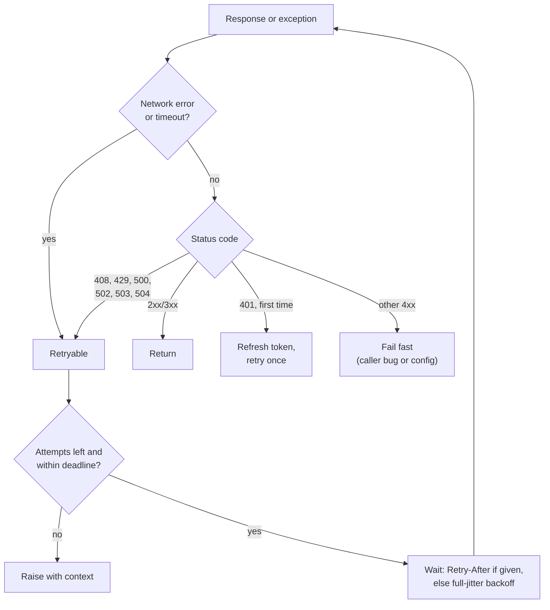
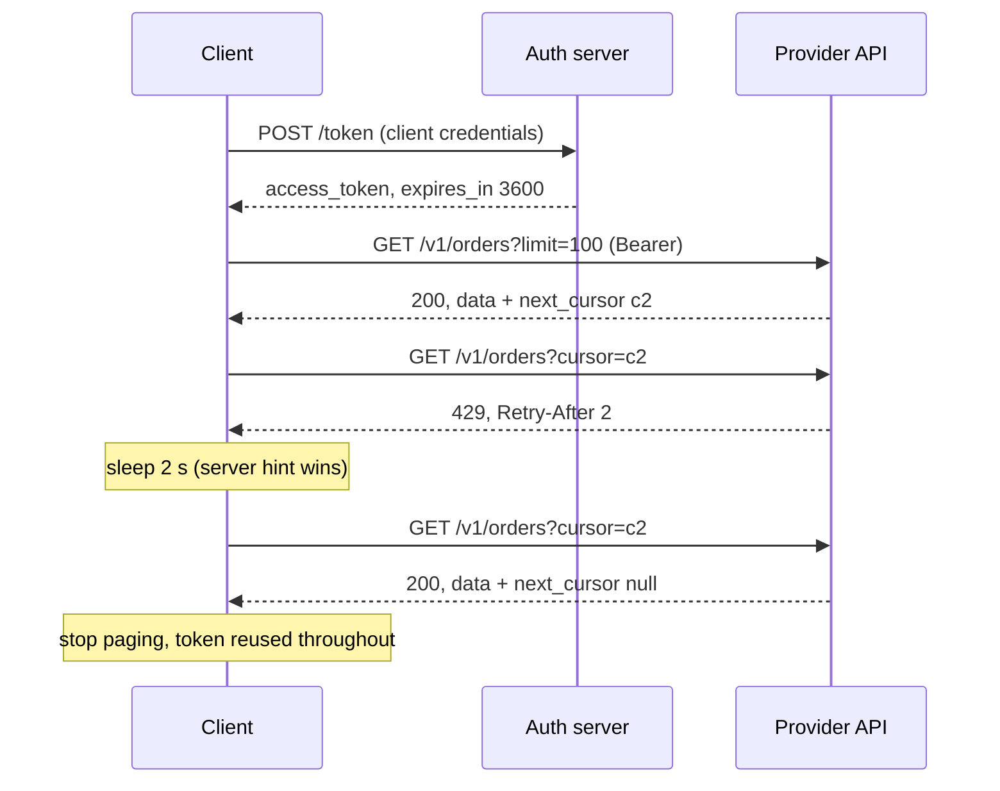

# Third-Party API Integration: Auth, Pagination, Rate Limits, Retries with Backoff

!!! abstract "Key takeaways"
    - Check six things before writing a line: **auth, pagination, rate limits, error format, idempotency, timeouts**. They cause most integration bugs, and asking about them is the senior signal.
    - **Auth:** API keys in a header (never the query string or logs); OAuth2 **client credentials** (RFC 6749 §4.4) with the token **cached and refreshed before expiry**, and **one forced refresh on 401**.
    - **Pagination:** loop until the API says stop (`next_cursor` null, no `rel="next"` Link). Write it as a **generator** so callers stream instead of loading everything.
    - **Rate limits and retries:** retry only **transient** failures (network errors, 408, 429, 500, 502, 503, 504) with **capped exponential backoff and full jitter**, **honour `Retry-After`** (seconds *or* an HTTP date, RFC 9110 §10.2.3), cap attempts, and enforce a **total deadline**. Never retry 400/401/403/404/422 blindly.
    - **Every call has a timeout**, and every retried write carries the **same `Idempotency-Key`**. Test it all offline with `httpx.MockTransport` and an injected `sleep`.

## Why it matters

"Pull the data from this API" is the most common FDE practical prompt because it's the most common FDE task. Real deployments begin by connecting the customer's systems of record: a CRM, an EHR, a ticketing tool, a payments provider. Each has its own auth flow, paging style, rate limits and failure behaviour, and each will eventually return a 429 at 2 a.m.

A naive client works in the demo and fails in production in predictable ways:

| Naive behaviour | What happens in production |
|---|---|
| No timeout | One slow upstream hangs your worker forever |
| Fetch page 1 only | Silent data loss once the customer has more than 100 records |
| Retry immediately in a loop | You amplify the provider's outage and get your key banned |
| Retry POSTs without a key | Duplicate refunds, duplicate tickets, duplicate emails |
| Fetch a token per request | You hit the identity provider's limits; latency doubles |
| Log full requests | Bearer tokens and patient data end up in log aggregation |

Interviewers know these failure modes. The round checks whether you do too, and whether you can code the fixes cleanly in 45 minutes.

## Core concepts

### The integration checklist

Read the docs (or ask the interviewer) in this order. It's the same list as in the [learning round](../fde-decomposition-scoping/06-the-learning-round-picking-up-an-unfamiliar-api-language-or.md), applied to code:

| Concern | Question to ask | Where it bites |
|---|---|---|
| Auth | Key, Basic, Bearer, OAuth2? Token lifetime? | 401s mid-run when tokens expire |
| Pagination | Offset, page number, cursor, Link header? Max page size? | Missing or duplicated records |
| Rate limits | Limit per what (key, user, IP)? Headers? 429 or 403? | Bans, cascading retries |
| Errors | Error body shape? Which codes are retryable? | Retrying 400s forever, giving up on 503s |
| Idempotency | Does the API accept `Idempotency-Key` on POST? | Duplicates after a timeout |
| Timeouts | How slow is p99? Long-running jobs? | Hung workers |
| Versioning | Version in URL or header? Deprecations? | Breakage on upgrade |

### Authentication patterns

| Pattern | How it's sent | Notes |
|---|---|---|
| API key | `Authorization: Bearer <key>` or a vendor header like `X-API-Key` | Identifies the client; keep out of URLs (they're logged by proxies) |
| HTTP Basic | `Authorization: Basic base64(id:secret)` | Only over TLS; common for token endpoints |
| Static bearer token | `Authorization: Bearer <token>` | Rotation is manual |
| OAuth2 client credentials | POST to token endpoint with `grant_type=client_credentials`, then `Bearer <access_token>` | Machine-to-machine; token has `expires_in` |
| OAuth2 authorization code (+ refresh token) | User consents; app stores refresh token | When acting on behalf of a user |
| mTLS | Client certificate | Common in banking and enterprise B2B |

For client credentials (RFC 6749 §4.4), the client authenticates to the token endpoint, receives an access token and `expires_in`, and reuses that token until shortly before it expires. Two production details interviewers like:

- **Refresh early** (for example 60 seconds before expiry) so a token doesn't expire mid-request, and use a **monotonic clock** for expiry maths, not wall time.
- **On 401, force one refresh and retry once.** Tokens can be revoked or rotated early. If the retry also gets 401, stop: it's a configuration problem, not a transient one.

Secrets come from environment variables or a secret manager, never source code, and never appear in logs or exception messages. The [API security page](../api-design/06-api-security-and-rate-limiting.md) covers the server side.

### Pagination styles

| Style | Request | Stop when | Pitfall |
|---|---|---|---|
| Offset/limit | `?offset=200&limit=100` | Page shorter than `limit` or empty | Rows shift if data changes while paging |
| Page number | `?page=3&per_page=100` | Empty page or `page > total_pages` | Same shifting problem |
| Cursor | `?cursor=abc&limit=100` | `next_cursor` is null or missing | Cursors may expire; don't build them yourself |
| Link header (RFC 8288) | Follow `Link: <url>; rel="next"` | No `rel="next"` | Parse the header properly (httpx exposes `response.links`) |
| Time window | `?updated_since=...` | Window reaches now | Clock skew, equal timestamps at boundaries |

GitHub's REST API paginates with the `Link` header; FHIR servers return a search `Bundle` with a `next` link; many SaaS APIs return a `next_cursor` in the body. The server-side design trade-offs are on the [pagination page](../api-design/03-pagination-filtering-and-sorting.md). On the client, the rule is: **let the API tell you when to stop**, and treat "empty page but a non-null cursor" as legal.

### Rate limits

A server that's rate-limiting you returns **429 Too Many Requests** (RFC 6585 §4), which may include a `Retry-After` header. Under RFC 9110 §10.2.3, `Retry-After` is either **delay-seconds** (`Retry-After: 120`) or an **HTTP-date** (`Retry-After: Wed, 21 Oct 2015 07:28:00 GMT`). Handle both.

Vendors add their own headers. GitHub, for example, documents `x-ratelimit-remaining` and `x-ratelimit-reset` (UTC epoch seconds) for the primary limit, returns **403 or 429** when you exceed it, and for secondary limits asks clients to honour `retry-after`, otherwise wait until the reset time, otherwise wait at least a minute, then back off exponentially. It also warns that continuing to send requests while limited can get an integration banned. The IETF `RateLimit` / `RateLimit-Policy` header fields are a draft standard some APIs adopt.

Two layers of defence:

1. **Reactive:** on 429, wait for `Retry-After` (or backoff) and retry.
2. **Proactive:** don't hit the limit at all. Cap concurrency (a semaphore), and if the limit is known (say 10 requests per second), throttle with a token bucket. Watching `remaining` and slowing down before zero is better than reacting to 429s.

### Retries, backoff and jitter


*Notice the three exits: success, fail fast for non-retryable errors, and give up when attempts or the total deadline run out. A retry loop without the third exit is an outage amplifier.*

The usual formula is capped exponential backoff, `min(cap, base × 2^attempt)`. The AWS Architecture Blog's analysis of backoff and jitter showed that without jitter, clients retry in synchronised waves; **full jitter** (`random(0, min(cap, base × 2^attempt))`) spreads them out and reduced both total work and completion time in their simulation. The [retries page](../distributed-systems/05-retries-backoff-jitter-timeouts.md) covers equal and decorrelated jitter, retry budgets and why you retry at one layer only.

Should a **POST** be retried? Only if it's safe: the API supports an **idempotency key** and you send the same key on every retry of the same logical operation (Stripe-style; details on the [idempotency keys page](../api-design/05-idempotency-keys-and-safe-retries.md)). A timeout leaves the outcome unknown, and the key lets the server replay the stored result instead of acting twice.

### Timeouts

A missing timeout is the most common production bug in integration code. Python's `requests` has **no default timeout** (a call can hang indefinitely); `httpx` defaults to **5 seconds** for connect, read, write and pool. Set them explicitly anyway, with a short connect timeout and a read timeout based on the endpoint's real latency.

Note what library-level retries cover: `httpx.HTTPTransport(retries=N)` retries only **connection failures** (`ConnectError`, `ConnectTimeout`), not read timeouts or 5xx responses. Status-based retries and `Retry-After` handling are yours to write (or delegate to a library such as `tenacity`, or `urllib3.Retry` under `requests`).


*Notice that the token is fetched once and reused, the retry repeats the same cursor (no skipped page), and the server's `Retry-After` overrides the client's own backoff.*

## In practice: code & configuration

=== "❌ Common mistake"
    ```python
    import requests, time

    def get_all_orders(api_key):
        orders, page = [], 1
        while True:
            r = requests.get(f"https://api.example.com/v1/orders?page={page}&api_key={api_key}")  # key in URL, no timeout
            if r.status_code != 200:
                time.sleep(1)                 # retries EVERYTHING (400s too), forever, in lockstep
                continue
            data = r.json()["data"]
            orders += data                    # loads everything into memory
            if len(data) < 100:               # assumes page size; breaks if the server caps at 50
                return orders
            page += 1
    ```

=== "✅ Correct approach"
    ```python
    # Same job: header auth, timeouts, bounded retries for transient errors only,
    # Retry-After honoured, API-driven stop condition, streaming generator.
    def iter_orders(self, page_size: int = 100, **filters) -> Iterator[dict]:
        """Cursor pagination: follow next_cursor until it is null."""
        params = {"limit": page_size, **filters}
        while True:
            body = self.request("GET", "/v1/orders", params=params).json()
            yield from body["data"]
            cursor = body.get("next_cursor")
            if not cursor:
                return
            params["cursor"] = cursor
    # self.request() is the retrying core shown below.
    ```

### The full client

This is the shape to aim for in a round: a token provider, a single `request()` method that owns retries, and thin, readable methods on top. Everything that touches time or randomness is injected so it can be tested.

```python
"""A production-style client for a third-party Orders API (httpx, sync)."""
from __future__ import annotations

import email.utils
import random
import time
import uuid
from collections.abc import Callable, Iterator
from dataclasses import dataclass, field

import httpx

RETRYABLE_STATUS = {408, 429, 500, 502, 503, 504}


class ApiError(Exception):
    def __init__(self, status: int, body: str):
        super().__init__(f"HTTP {status}: {body[:200]}")
        self.status = status


@dataclass
class TokenProvider:
    """OAuth2 client-credentials (RFC 6749 s4.4) with caching and early refresh."""
    token_url: str
    client_id: str
    client_secret: str
    http: httpx.Client
    clock: Callable[[], float] = time.monotonic
    skew_s: float = 60.0                          # refresh a minute before expiry
    _token: str | None = field(default=None, init=False)
    _expires_at: float = field(default=0.0, init=False)

    def get(self, force: bool = False) -> str:
        if force or self._token is None or self.clock() >= self._expires_at - self.skew_s:
            r = self.http.post(self.token_url, data={"grant_type": "client_credentials"},
                               auth=(self.client_id, self.client_secret))
            r.raise_for_status()
            body = r.json()
            self._token = body["access_token"]
            self._expires_at = self.clock() + float(body.get("expires_in", 300))
        return self._token


def parse_retry_after(value: str | None, now: float | None = None) -> float | None:
    """Retry-After is delay-seconds or an HTTP-date (RFC 9110 s10.2.3)."""
    if not value:
        return None
    value = value.strip()
    if value.isdigit():
        return float(value)
    try:
        dt = email.utils.parsedate_to_datetime(value)
    except (TypeError, ValueError):
        return None
    now = time.time() if now is None else now
    return max(0.0, dt.timestamp() - now)


@dataclass
class OrdersClient:
    base_url: str
    tokens: TokenProvider
    http: httpx.Client
    max_attempts: int = 4                         # 1 try + 3 retries
    base_delay_s: float = 0.5
    max_delay_s: float = 20.0
    deadline_s: float = 60.0                      # total budget across all attempts
    sleep: Callable[[float], None] = time.sleep
    rng: random.Random = field(default_factory=random.Random)

    def _backoff(self, attempt: int) -> float:
        # "Full jitter" (AWS Architecture Blog): random between 0 and the capped exponential.
        return self.rng.uniform(0, min(self.max_delay_s, self.base_delay_s * 2 ** attempt))

    def request(self, method: str, path: str, *, idempotency_key: str | None = None,
                **kwargs) -> httpx.Response:
        start = time.monotonic()
        refreshed = False
        headers = kwargs.pop("headers", {})
        if idempotency_key:                       # SAME key on every retry of this logical call
            headers["Idempotency-Key"] = idempotency_key
        for attempt in range(self.max_attempts):
            headers["Authorization"] = f"Bearer {self.tokens.get()}"
            try:
                r = self.http.request(method, self.base_url + path, headers=headers, **kwargs)
            except httpx.TransportError:          # connect/read timeouts, resets
                if attempt == self.max_attempts - 1:
                    raise
                delay = self._backoff(attempt)
            else:
                if r.status_code == 401 and not refreshed:
                    self.tokens.get(force=True)   # token revoked/rotated early: refresh ONCE
                    refreshed = True
                    continue
                if r.status_code < 400:
                    return r
                if r.status_code not in RETRYABLE_STATUS or attempt == self.max_attempts - 1:
                    raise ApiError(r.status_code, r.text)
                server_hint = parse_retry_after(r.headers.get("Retry-After"))
                delay = server_hint if server_hint is not None else self._backoff(attempt)
            if time.monotonic() - start + delay > self.deadline_s:
                raise TimeoutError(f"retry budget of {self.deadline_s}s exhausted")
            self.sleep(delay)
        raise RuntimeError("unreachable")

    def iter_orders(self, page_size: int = 100, **filters) -> Iterator[dict]:
        """Cursor pagination: follow next_cursor until it is null."""
        params = {"limit": page_size, **filters}
        while True:
            body = self.request("GET", "/v1/orders", params=params).json()
            yield from body["data"]
            cursor = body.get("next_cursor")
            if not cursor:
                return
            params["cursor"] = cursor

    def create_refund(self, order_id: str, amount_cents: int, key: str | None = None) -> dict:
        key = key or str(uuid.uuid4())            # caller can pass a deterministic key instead
        r = self.request("POST", f"/v1/orders/{order_id}/refunds", idempotency_key=key,
                         json={"amount_cents": amount_cents})
        return r.json()


def iter_link_pages(http: httpx.Client, url: str, **params) -> Iterator[dict]:
    """GitHub-style pagination: follow the rel="next" URL in the Link header."""
    next_url: str | None = url
    while next_url:
        r = http.get(next_url, params=params if next_url == url else None)
        r.raise_for_status()
        yield from r.json()
        next_url = r.links.get("next", {}).get("url")
```

Wire it up with explicit timeouts:

```python
http = httpx.Client(timeout=httpx.Timeout(10.0, connect=3.0))   # read/write/pool 10 s, connect 3 s
tokens = TokenProvider(os.environ["TOKEN_URL"], os.environ["CLIENT_ID"], os.environ["CLIENT_SECRET"], http)
client = OrdersClient(os.environ["API_BASE"], tokens, http)
late = [o["id"] for o in client.iter_orders(status="late")]
```

Points worth saying aloud as you write it:

- "Retries live in **one** method so the policy is in one place and I can't accidentally nest them."
- "The 401 refresh doesn't count as a retry attempt, but it can happen only once."
- "A retried page request repeats the **same cursor**, so a 429 can't skip a page."
- "For a refund, the idempotency key is created **once per logical refund**, outside the retry loop. If the caller has a business identity, a deterministic key like `refund-{order_id}-{n}` is even better, because it survives a process restart."

### Testing it offline

`httpx.MockTransport` takes a handler function and returns canned responses without a network. Inject `sleep` to record waits instead of sleeping.

```python
import httpx
import pytest
from orders_client import ApiError, OrdersClient, TokenProvider

def make(handler, **kw):
    http = httpx.Client(transport=httpx.MockTransport(handler), timeout=httpx.Timeout(10.0, connect=3.0))
    sleeps: list[float] = []
    tokens = TokenProvider("https://auth.test/token", "id", "secret", http)
    client = OrdersClient("https://api.test", tokens, http, sleep=sleeps.append, **kw)
    return client, sleeps

def token_ok(request):
    return httpx.Response(200, json={"access_token": "tok-1", "expires_in": 3600})

def test_honours_retry_after_on_429_then_succeeds():
    calls = {"n": 0}
    def handler(request):
        if request.url.host == "auth.test":
            return token_ok(request)
        calls["n"] += 1
        if calls["n"] == 1:
            return httpx.Response(429, headers={"Retry-After": "2"}, text="slow down")
        return httpx.Response(200, json={"data": [], "next_cursor": None})
    client, sleeps = make(handler)
    assert list(client.iter_orders()) == []
    assert sleeps == [2.0]                          # server hint wins over our own backoff

def test_does_not_retry_400():
    def handler(request):
        if request.url.host == "auth.test":
            return token_ok(request)
        return httpx.Response(400, text="bad filter")
    client, sleeps = make(handler)
    with pytest.raises(ApiError) as e:
        list(client.iter_orders(status="nope"))
    assert e.value.status == 400 and sleeps == []

def test_post_reuses_idempotency_key_across_retries():
    seen_keys = []
    def handler(request):
        if request.url.host == "auth.test":
            return token_ok(request)
        seen_keys.append(request.headers["Idempotency-Key"])
        if len(seen_keys) == 1:
            return httpx.Response(503, text="try later")
        return httpx.Response(201, json={"id": "rf_1", "status": "pending"})
    client, _ = make(handler)
    assert client.create_refund("o1", 500)["id"] == "rf_1"
    assert len(seen_keys) == 2 and seen_keys[0] == seen_keys[1]
```

The full test file also covers paging until the cursor is null, retrying `ReadTimeout` with bounded jittered waits, refreshing the token once on 401, parsing an HTTP-date `Retry-After`, and following `Link` headers. All eight tests pass in under 0.1 seconds.

### Concurrency without tripping the limit

If the task needs a detail call per record, go concurrent but **cap requests in flight**:

```python
"""Fetch many orders concurrently without tripping the provider's rate limit."""
import asyncio
import httpx

async def fetch_details(client: httpx.AsyncClient, ids: list[str], max_in_flight: int = 5) -> dict[str, dict]:
    sem = asyncio.Semaphore(max_in_flight)            # cap concurrency, like a bulkhead

    async def one(order_id: str) -> tuple[str, dict]:
        async with sem:
            r = await client.get(f"/v1/orders/{order_id}")
            r.raise_for_status()
            return order_id, r.json()

    results = await asyncio.gather(*(one(i) for i in ids))   # first exception propagates
    return dict(results)
```

A test with a mock transport confirms that 20 requests with `max_in_flight=3` never exceed 3 concurrent calls. Mention the next step: ask whether the API has a **bulk or list endpoint with expansions**, which beats N detail calls every time.

### Java 21 comparison

A Java engineer will recognise the shape. The JDK's `java.net.http.HttpClient` has a connect timeout on the client and a request timeout per request; retries are yours:

```java
static final Set<Integer> RETRYABLE = Set.of(408, 429, 500, 502, 503, 504);

static HttpResponse<String> getWithRetry(HttpClient http, URI uri, int maxAttempts) throws Exception {
    for (int attempt = 0; ; attempt++) {
        var req = HttpRequest.newBuilder(uri).timeout(Duration.ofSeconds(10)).GET().build();
        var res = http.send(req, HttpResponse.BodyHandlers.ofString());
        if (!RETRYABLE.contains(res.statusCode()) || attempt == maxAttempts - 1) return res;
        long capMs = Math.min(20_000, 500L << attempt);
        long delayMs = res.headers().firstValue("Retry-After")
                .filter(v -> v.chars().allMatch(Character::isDigit))
                .map(v -> Long.parseLong(v) * 1000)
                .orElseGet(() -> ThreadLocalRandom.current()       // full jitter
                        .nextLong(capMs + 1));
        Thread.sleep(delayMs);
    }
}
// Built with HttpClient.newBuilder().connectTimeout(Duration.ofSeconds(3)).build()
```

In Spring Boot 3 you'd typically use `RestClient` with configured timeouts plus Resilience4j (or Spring Retry) for the retry policy, as covered on the [validation and REST clients page](../spring-boot/09-validation-rest-clients.md). The trade-off is the same as in Python: declarative retry annotations are convenient, but make sure they only retry the right status codes and honour `Retry-After`.

### Practice: the Orders API client spec

Hand yourself this spec, set a 50-minute timer, and build it with tests (no network: use `MockTransport`).

```text
Orders API (fictional)
  POST /oauth/token        Basic auth (client_id:client_secret), form grant_type=client_credentials
                           -> {"access_token": str, "expires_in": int}
  GET  /v1/orders          ?limit (max 100) &cursor &status=open|late|closed &updated_since=ISO-8601
                           -> {"data": [Order], "next_cursor": str | null}
  GET  /v1/orders/{id}     -> Order
  POST /v1/orders/{id}/refunds   body {"amount_cents": int}; accepts Idempotency-Key header
  Errors: {"error": {"code": str, "message": str}}
  Limits: 10 req/s per client. 429 with Retry-After (seconds). 503 during deploys.

Tasks
  1. iter_orders(status, updated_since) as a generator; stop on null cursor.
  2. Token caching with early refresh; one forced refresh on 401.
  3. Retries: transport errors, 408/429/5xx; full jitter; max 4 attempts; 60 s deadline.
  4. refund(order_id, amount_cents) safe to retry.
  5. Stretch: proactive throttle to 10 req/s; async detail fetch with a semaphore.
Tests to write first
  - pages until null cursor; empty page with non-null cursor keeps going
  - 429 then 200 waits exactly Retry-After
  - 400 is not retried; 503 x4 raises after 3 waits
  - 401 -> refresh -> 200; 401 twice -> raises
  - refund retried after 503 sends the same Idempotency-Key
```

## Real-world usage

- **GitHub** documents exactly the client behaviour this page teaches: honour `retry-after`, otherwise wait for `x-ratelimit-reset`, otherwise back off, and stop if limits persist. It's a good model answer when an interviewer asks how you'd handle an unknown provider.
- **Stripe** popularised idempotency keys for POSTs; its client libraries retry with backoff and attach keys automatically. Many payment, messaging and ticketing APIs now follow the pattern.
- **AWS SDKs** retry throttling and transient errors with exponential backoff and jitter by default; the AWS Builders' Library and Architecture Blog explain why.
- **Healthcare (FHIR):** FHIR search returns a `Bundle` with paging links (`next`), and EHR vendors impose rate limits. An FDE pulling patient schedules from an EHR writes exactly the generator-plus-retry client above, with the added rule that payloads never hit logs.
- **Banking and enterprise B2B:** OAuth2 client credentials or mTLS, strict quotas, and change windows. Expect 503s during maintenance; your retry deadline and alerting matter more than raw speed.

## Trade-offs & production gotchas

| Option | Pros | Cons | Use when |
|---|---|---|---|
| Hand-rolled retry loop | Full control, easy to explain in an interview | More code to test | Interviews; unusual policies |
| `tenacity` decorator | Declarative, well-tested | Easy to retry the wrong things; `Retry-After` needs a custom wait | Production Python |
| Vendor SDK | Auth, paging and retries built in | Hides behaviour; version lock-in | When a maintained SDK exists |
| Sync `httpx.Client` | Simple, debuggable | One request at a time per thread | Scripts, small volumes |
| `httpx.AsyncClient` + semaphore | High throughput with bounded concurrency | Async complexity | Many independent calls |
| Proactive throttling | Avoids 429s entirely | Needs the limit to be known | Known, strict quotas |

!!! warning "Gotchas"
    - **Retrying at several layers multiplies calls.** An SDK retry × your retry × a gateway retry can turn one failure into dozens of requests. Pick one layer.
    - **`time.sleep` in tests makes them slow and flaky.** Inject `sleep` (and `clock`) as shown.
    - **Some APIs signal rate limits with 403**, not 429 (GitHub does both). Read the error body and headers, not just the status.
    - **Cursor expiry:** a long pause (or a crash and restart) may invalidate a cursor. For big syncs, checkpoint by `updated_since` plus last ID, so you can resume.
    - **`Retry-After` can be huge.** Cap it against your deadline and fail with a clear message rather than sleeping for an hour inside a request handler.
    - **Don't log the `Authorization` header or full bodies.** Log method, path, status, attempt, latency and a request ID.

!!! question "Interview angle"
    A common extension is "now the API also returns 503 sometimes during deploys, and the job must finish within five minutes." The strong answer adds a total deadline, separates retryable from non-retryable failures, and decides what happens to partial progress (checkpoint the cursor, make writes idempotent so a rerun is safe).

## How this connects to my experience

- **Where I used it:** "Owned the GraphQL Consumer Service end-to-end, acting as the integration layer between 5 upstream systems and multiple downstream consumers" and "Built secure enterprise APIs using OAuth2, PingFederate, and Active Directory integration" (OptumRx Meteor, Publicis Sapient). Also "Integrated AWS Personalize recommendation services" (Deloitte) and multi-cloud KMS integrations "supporting AWS, Azure, and GCP environments" (Coriolis, CCKM).
- **Talking points:**
    - The GraphQL Consumer Service is an integration layer: five upstreams, each with its own auth, latency and failure behaviour. *[confirm: which upstreams used OAuth2 client credentials via PingFederate, and how tokens were cached and refreshed]*
    - Timeouts, retries and fallbacks per upstream. *[confirm: whether you used Resilience4j or Spring Retry, the timeout values, and whether partial GraphQL responses were returned when one upstream failed]*
    - Redis caching for reference data reduced load on upstreams, which is also a rate-limit strategy. *[confirm: cache TTLs and which upstreams it protected]*
    - The cloud KMS work is a "three different APIs for the same concept" story: different auth, pagination and throttling across AWS, Azure and GCP. *[confirm: throttling or pagination differences you handled]*
- **Likely follow-up chain:** "How did the consumer service handle a slow upstream?" → "What did you retry, and how did you avoid a retry storm?" → "How would you do the same in Python for a customer's API?" Answer with the per-upstream timeout and retry policy, the rule of retrying only transient failures with jittered backoff at one layer, then sketch the `request()` method above. If they push on duplicates, bring in idempotency keys and the Kafka retry and DLQ design you built.

## Interview questions

### Fundamentals

??? question "Q1. What do you check in an API's docs before writing a client?"
    **Answer:** Auth (method and token lifetime), pagination style and maximum page size, rate limits and how they're signalled, error format and which errors are retryable, idempotency support for writes, timeouts and typical latency, and versioning. These are where integrations break.

    **Interviewer listens for:** the list, ordered by risk.

    **Common wrong answer:** only the endpoint and response fields.

??? question "Q2. Which HTTP failures should a client retry?"
    **Answer:** Transient ones: connection errors and timeouts, 408, 429, 502, 503, 504, and 500 with care (only if the operation is idempotent or keyed). Not 400, 401 (except one refresh), 403, 404 or 422, which won't succeed on retry. Always cap attempts and total time.

    **Interviewer listens for:** retryable vs non-retryable and the idempotency caveat.

    **Common wrong answer:** "Retry anything that isn't 200."

??? question "Q3. What is `Retry-After` and what formats can it take?"
    **Answer:** A response header telling the client how long to wait before retrying, used with 429 and 503 (and redirects). RFC 9110 defines it as either a number of seconds or an HTTP-date. The client should honour it over its own backoff, capped by its deadline.

    **Interviewer listens for:** both formats and precedence over client backoff.

    **Common wrong answer:** "It's always seconds."

??? question "Q4. Why add jitter to exponential backoff?"
    **Answer:** Without jitter, clients that failed together retry together, creating synchronised load spikes that can keep the server down. Jitter randomises the wait. Full jitter, `random(0, min(cap, base × 2^attempt))`, is a good default; the AWS analysis found it reduced total work and completion time compared with no jitter.

    **Interviewer listens for:** thundering herd and the formula.

    **Common wrong answer:** "Jitter makes retries faster."

### Intermediate

??? question "Q5. How do you implement OAuth2 client credentials in a client?"
    **Answer:** POST to the token endpoint with `grant_type=client_credentials` and client authentication (often Basic). Cache the access token with its expiry, computed on a monotonic clock, and refresh a little before it expires. On a 401, force one refresh and retry once; a second 401 is a configuration error. Load secrets from the environment or a secret manager and never log them.

    **Interviewer listens for:** caching, early refresh, one forced refresh.

    **Common wrong answer:** fetching a new token on every request.

??? question "Q6. How do you make pagination robust?"
    **Answer:** Let the API's signal decide when to stop (null cursor, missing `rel="next"`), not an assumed page size. Use a generator so callers stream. On retry, repeat the same cursor. Handle empty pages with a non-null cursor. For long syncs, checkpoint progress so a crash can resume, and prefer cursor or keyset paging over offset when data changes during the sync.

    **Interviewer listens for:** API-driven termination, streaming, resume.

    **Common wrong answer:** "Stop when the page has fewer than 100 items."

??? question "Q7. How do you retry a POST safely?"
    **Answer:** Only with an idempotency key the server supports: generate one key per logical operation outside the retry loop (or derive it from business identity), send the same key on every attempt, and let the server replay the stored result. Without server support, don't retry automatically after an unknown outcome; check state first (a GET) or reconcile later.

    **Interviewer listens for:** same key across retries, outcome-unknown reasoning.

    **Common wrong answer:** a new UUID per attempt.

??? question "Q8. What timeouts do you set, and what does `httpx.HTTPTransport(retries=3)` actually retry?"
    **Answer:** A short connect timeout (a few seconds), a read timeout based on the endpoint's real p99, and an overall deadline for the operation including retries. `requests` has no default timeout; `httpx` defaults to 5 seconds. `HTTPTransport(retries=3)` retries only connection establishment failures (`ConnectError`, `ConnectTimeout`), not read timeouts or 5xx, so status-based retries are still my job.

    **Interviewer listens for:** explicit timeouts and knowing library limits.

    **Common wrong answer:** "The library retries for me."

### Senior

??? question "Q9. How do you avoid retry storms across a system?"
    **Answer:** Retry at one layer only; cap attempts and use a total deadline; use jittered backoff; honour `Retry-After`; add a retry budget (for example retries at most 10% of requests) or a circuit breaker so a failing dependency gets fewer calls, not more; and cap concurrency. Make retries visible in metrics.

    **Interviewer listens for:** amplification awareness and budgets or breakers.

    **Common wrong answer:** "Use exponential backoff" and nothing else.

??? question "Q10. How would you handle a provider limit of 10 requests per second across several workers?"
    **Answer:** A shared limiter: a token bucket in Redis (or the provider's quota headers) checked before each call, or route all calls through one integration service that owns the limit. Each worker still handles 429 with `Retry-After` as a safety net. Prefer bulk endpoints to cut call volume.

    **Interviewer listens for:** shared state for a shared limit, plus reactive fallback.

    **Common wrong answer:** each worker limits itself to 10 per second (which gives N × 10).

??? question "Q11. How do you test an API client without the real API?"
    **Answer:** Inject the HTTP transport (`httpx.MockTransport`, or `respx`, or WireMock in Java) and script responses: pages, 429 with `Retry-After`, 503 sequences, 401 then success, timeouts raised from the handler. Inject `sleep` and `clock` so tests are fast and deterministic. Add one contract or sandbox test against the provider's test environment in CI.

    **Interviewer listens for:** deterministic failure-path tests.

    **Common wrong answer:** "I test against production with a test account."

??? question "Q12. How do you design an initial sync plus incremental sync from a SaaS API?"
    **Answer:** Initial: page through everything with checkpoints (cursor or last `updated_at` and ID), writing idempotently (upsert by external ID). Incremental: poll `updated_since` with an overlap window to absorb clock skew and equal timestamps, dedupe by ID and version, or switch to webhooks with a periodic reconciliation poll. Track lag and reject counts.

    **Interviewer listens for:** idempotent upserts, overlap windows, reconciliation.

    **Common wrong answer:** "Fetch everything every hour."

### Scenario-based

??? question "Q13. The client works in testing but production runs get 429s and then the provider disables your key. What happened and what do you change?"
    **Answer:** Likely concurrency or retries exceeded the limit and the client kept hammering after 429s (immediate retries, multiple layers, or ignoring `Retry-After`). Change: honour `Retry-After`, add jittered backoff with a cap, a shared limiter across workers, a concurrency cap, and a circuit breaker that pauses after repeated 429s. Talk to the provider about quota and bulk endpoints.

    **Interviewer listens for:** diagnosis plus reactive and proactive fixes.

    **Common wrong answer:** "Ask for a higher limit."

??? question "Q14. A refund call timed out. Did the refund happen? What do you do?"
    **Answer:** Unknown: the request may have been processed. If I sent an idempotency key, retry with the same key and the server returns the original result. If not, query the refunds for that order before retrying, or reconcile later. I'd add idempotency keys to all writes going forward.

    **Interviewer listens for:** unknown outcome, same-key retry or check-then-act.

    **Common wrong answer:** "Retry; worst case they get two refunds."

??? question "Q15. Halfway through a 2-million-record sync, the job crashes. How should the design have handled it?"
    **Answer:** Checkpoint progress after each page (cursor or `updated_at` plus ID) to durable storage; write records idempotently so reprocessing a page is harmless; resume from the checkpoint; and if the cursor has expired, resume from the time-based checkpoint with an overlap. Emit progress metrics so we know where it stopped.

    **Interviewer listens for:** checkpoints plus idempotent writes.

    **Common wrong answer:** "Restart from the beginning."

??? question "Q16. The interviewer says the API returns an empty `data` array but a non-null `next_cursor`. Is that a bug?"
    **Answer:** Not necessarily: some APIs filter after paging, or hit a time budget per page. Keep following the cursor, but protect against infinite loops: stop if the cursor repeats, and cap the number of pages or total time. Ask the interviewer how the real API behaves.

    **Interviewer listens for:** API-driven termination with loop protection.

    **Common wrong answer:** stopping on the first empty page.

## Cheat sheet

| Concept | Remember |
|---|---|
| Checklist | Auth, pagination, rate limits, errors, idempotency, timeouts, versioning |
| Client credentials | Cache token, refresh ~60 s early, one forced refresh on 401 |
| Pagination | Generator; stop on API signal; same cursor on retry; checkpoint |
| Retryable | Transport errors, 408, 429, 500*, 502, 503, 504 (*idempotent only) |
| Backoff | `random(0, min(cap, base × 2^n))`, max attempts, total deadline |
| 429 | RFC 6585; honour `Retry-After` (seconds or HTTP-date, RFC 9110) |
| Writes | Same `Idempotency-Key` on every retry of one logical operation |
| Timeouts | `requests`: none by default; `httpx`: 5 s; set connect and read explicitly |
| httpx retries | `HTTPTransport(retries=)` covers connection failures only |
| Testing | `httpx.MockTransport`, injected `sleep` and `clock` |
| Concurrency | `asyncio.Semaphore`; shared limiter for many workers |

## Sources
1. [RFC 6749 §4.4: OAuth 2.0 Client Credentials Grant](https://www.rfc-editor.org/rfc/rfc6749#section-4.4): token request and response for machine-to-machine auth.
2. [RFC 6585 §4: 429 Too Many Requests](https://www.rfc-editor.org/rfc/rfc6585#section-4): status code meaning and optional `Retry-After`.
3. [RFC 9110 §10.2.3: Retry-After](https://www.rfc-editor.org/rfc/rfc9110#section-10.2.3): delay-seconds or HTTP-date.
4. [RFC 8288: Web Linking](https://www.rfc-editor.org/rfc/rfc8288): the `Link` header and `rel="next"`.
5. [AWS Architecture Blog: Exponential Backoff and Jitter](https://aws.amazon.com/blogs/architecture/exponential-backoff-and-jitter/): full, equal and decorrelated jitter, simulation results.
6. [GitHub docs: Rate limits for the REST API](https://docs.github.com/en/rest/using-the-rest-api/rate-limits-for-the-rest-api): `x-ratelimit-*` headers, 403/429, secondary-limit retry rules, ban warning.
7. [GitHub docs: Using pagination in the REST API](https://docs.github.com/en/rest/using-the-rest-api/using-pagination-in-the-rest-api): `Link` header pagination.
8. [HTTPX docs: Timeouts](https://www.python-httpx.org/advanced/timeouts/) and [Transports](https://www.python-httpx.org/advanced/transports/): 5-second default, `MockTransport`, `HTTPTransport(retries=)` (connection retries only, verified in httpcore 1.x source).
9. [Requests docs: Timeouts](https://requests.readthedocs.io/en/latest/user/advanced/#timeouts): no timeout unless set.
10. [IETF draft: RateLimit header fields for HTTP](https://datatracker.ietf.org/doc/draft-ietf-httpapi-ratelimit-headers/): `RateLimit` and `RateLimit-Policy`.
11. [Stripe docs: Idempotent requests](https://docs.stripe.com/api/idempotent_requests): idempotency keys for safe POST retries.
12. [HL7 FHIR R4: RESTful API, paging](https://hl7.org/fhir/R4/http.html#paging): search result bundles with `next` links.
