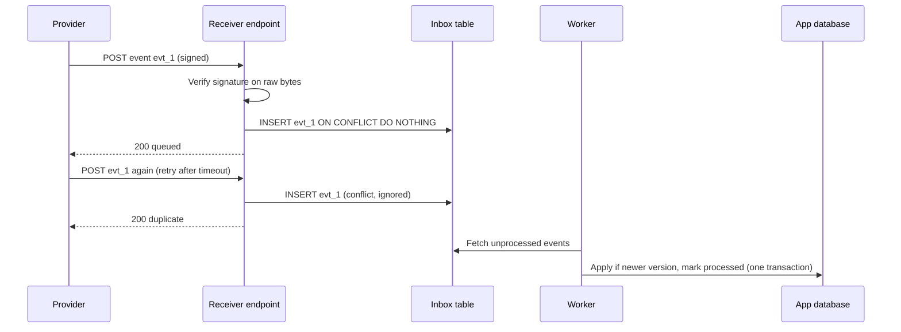
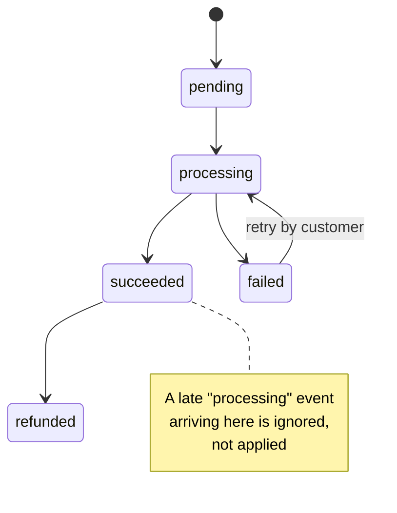

# Webhooks: Signature Verification, Idempotent Consumers, Duplicate & Out-of-Order Delivery

!!! abstract "Key takeaways"
    - Webhook delivery is **at-least-once and unordered**: providers retry on timeouts and non-2xx responses, so **duplicates are normal** and events can arrive **out of order**. Design for both from the start.
    - **Verify the signature on the raw request bytes** with HMAC-SHA256 and a **constant-time comparison** (`hmac.compare_digest`), and **reject old timestamps** (a 5-minute tolerance is the common library default) to stop replays. Never parse and re-serialise JSON before verifying.
    - **Acknowledge fast, process later:** verify, store the event in an **inbox table keyed by event ID** (`INSERT ... ON CONFLICT DO NOTHING`), return 2xx, and let a worker apply it. A duplicate is a **success** response, not an error.
    - **Out-of-order:** apply an event only if it's newer (object **version**, sequence or `updated_at`), use a state machine that refuses backwards transitions, or treat the event as a **notification and re-fetch** the current object from the API.
    - Webhooks get lost too. Pair them with a **reconciliation poll** and a way to replay from the provider's dashboard or API.

## Why it matters

Webhooks are how SaaS products tell you something happened: a payment succeeded, a ticket changed, a document was signed, a lab result is ready. In an FDE deployment, they're often the bridge between the customer's systems and yours. They're also a favourite practical-round prompt because a naive receiver is easy to write and wrong in four distinct ways:

1. **Anyone can call it.** Without signature verification, an attacker can POST `{"type": "payment.succeeded"}` and get goods for free.
2. **It double-processes.** The provider didn't get your 200 in time (your handler was slow), so it retried; you shipped the order twice.
3. **It goes backwards.** `payment.succeeded` arrived before `payment.processing`, and the late event overwrote the final state.
4. **It drops events.** Your service was down during a deploy; the provider gave up after its retry window, and nobody noticed.

The interviewer is checking whether you know these, and whether you can code the defences in under an hour. The same reasoning applies to Kafka or SQS consumers; webhooks are just at-least-once messaging over HTTP.

## Core concepts

### The delivery model


*Notice that the endpoint does almost nothing: verify, store, acknowledge. The duplicate gets a 200 too, otherwise the provider keeps retrying it. The business change and the "processed" flag commit together in the worker.*

What providers generally do (check each provider's docs):

- **Retry on failure:** non-2xx responses and timeouts trigger retries with backoff, sometimes for days (Stripe documents retries for up to three days in live mode). Some providers don't retry automatically: GitHub's docs say failed deliveries aren't redelivered automatically and you redeliver them yourself.
- **Expect a fast response:** GitHub's best-practices guide says to respond with a 2XX quickly and process the payload asynchronously; slow handlers cause timeouts, which cause retries, which cause duplicates.
- **No ordering guarantee:** Stripe's docs state it doesn't guarantee events arrive in the order they were generated. Assume the same of any provider unless it documents otherwise.
- **A unique delivery or event ID:** Stripe's event `id`, GitHub's `X-GitHub-Delivery` GUID (which stays the same on redelivery), Standard Webhooks' `webhook-id`. This is your dedupe key.

### Signature verification

Most providers sign with **HMAC-SHA256** using a shared secret, but the exact bytes signed and the header format differ:

| Provider / spec | Header | Signed content | Encoding |
|---|---|---|---|
| Stripe | `Stripe-Signature: t=<unix>,v1=<sig>` | `"{t}." + raw body` | hex; ignore schemes other than `v1` |
| GitHub | `X-Hub-Signature-256: sha256=<sig>` | raw body | hex (the old SHA-1 `X-Hub-Signature` is legacy) |
| Standard Webhooks (Svix and others) | `webhook-id`, `webhook-timestamp`, `webhook-signature: v1,<sig>` | `"{id}.{timestamp}." + raw body` | base64; secret is base64 after the `whsec_` prefix |
| Shopify | `X-Shopify-Hmac-Sha256` | raw body | base64 |

The rules that apply to all of them:

1. **Use the raw body bytes.** Frameworks love to parse JSON for you. Parsing and re-serialising changes whitespace and key order, and the signature no longer matches. In FastAPI, read `await request.body()` before anything else; in Spring, accept `@RequestBody byte[]` or `String`.
2. **Compare in constant time.** `==` on strings can return early at the first differing byte, leaking timing information. Use `hmac.compare_digest` (Python), `MessageDigest.isEqual` (Java), `crypto.timingSafeEqual` (Node).
3. **Check the timestamp** if the scheme signs one. A valid signature on a week-old payload is a replay. Stripe's libraries and the Standard Webhooks reference libraries default to a **5-minute (300-second)** tolerance. GitHub's scheme doesn't sign a timestamp, so dedupe on `X-GitHub-Delivery` covers replays there.
4. **Support several secrets during rotation.** Stripe can send more than one `v1` signature while secrets roll; Standard Webhooks allows a space-separated list. Accept a match against any active secret.
5. **Fail closed** with a 400 or 401 and a generic message. Don't log the secret or the full payload.

The cryptographic background (HMAC, why constant time matters) is on the [cryptography topic](../cryptography-key-management/index.md).

### Idempotent consumers

Deduplication has two layers:

| Layer | Technique | Protects against |
|---|---|---|
| Delivery | Unique constraint on event ID in an inbox table | The same event delivered twice |
| Effect | Idempotent business operation (upsert, conditional update, idempotency key to downstream APIs) | Two *different* events that imply the same effect, or a crash between effect and marking processed |

The inbox insert and the business change should be **atomic** where possible: mark the event processed in the same database transaction as the state change, so a crash can't leave one without the other. If the side effect is external (send an email, call a payments API), pass a deterministic idempotency key derived from the event ID. The general theory is on the [idempotency page](../distributed-systems/04-idempotency-and-idempotency-keys.md) and the Kafka version on [idempotent consumers](../kafka/08-idempotent-consumers-and-deduplication.md).

A Redis `SET key NX EX 86400` works as a fast first-line dedupe, but it isn't transactional with your database, so keep the database constraint as the source of truth.

### Out-of-order delivery

Four strategies, from simplest to most robust:

| Strategy | How | Trade-off |
|---|---|---|
| Version or sequence check | Store the object's version; apply only if `incoming.version > stored.version` | Needs a version field from the provider |
| Timestamp check | Compare the object's `updated_at` (not delivery time) | Equal timestamps and clock issues |
| State machine | Allow only forward transitions (`processing → succeeded`, never back) | Encodes business rules; handles missing versions |
| Re-fetch ("thin events") | Treat the event as "something changed on X", GET the current object from the API | Extra API call (rate limits); always correct |


*Notice that there's no arrow from `succeeded` back to `processing`. A late event that would move the state backwards is a no-op, which makes the consumer tolerant of reordering even without version numbers.*

Re-fetching is often the most practical answer in a round: "Because ordering isn't guaranteed, I'll use the event as a trigger and fetch the current payment from the API." Mention its cost (an API call per event, which needs the [rate-limit handling](02-third-party-api-integration-auth-pagination-rate-limits-retr.md) from the previous page).

### Status codes your endpoint returns

| Situation | Return | Why |
|---|---|---|
| Valid, stored (new or duplicate) | 200 (or 202/204) | Stops provider retries |
| Bad or missing signature, stale timestamp | 400 or 401 | Not retryable; don't do work |
| Unknown event type | 200 | Ignore gracefully; don't make the provider retry forever |
| Your database is down | 5xx | You *want* the provider to retry later |
| Malformed JSON with a valid signature | 400, and alert | Provider bug or version change |

### Lost events and reconciliation

At-least-once only holds while the provider is still retrying. If your endpoint is down longer than the retry window, or misconfigured and returning 400s, events are lost. Production receivers add:

- **Monitoring:** alert on signature failures, 5xx rate, and "no events received in N minutes" during business hours.
- **Replay:** most providers offer redelivery from a dashboard or API (GitHub lets you redeliver deliveries; Stripe can resend events and lists past events via its API).
- **Reconciliation:** a scheduled job that lists recently changed objects from the API (`updated_since`) and repairs anything the webhooks missed. This turns webhooks from "the source of truth" into "a fast path".

## In practice: code & configuration

=== "❌ Common mistake"
    ```python
    from fastapi import FastAPI
    from pydantic import BaseModel
    import hashlib, hmac, json

    app = FastAPI()

    class Event(BaseModel):
        id: str
        type: str
        data: dict

    @app.post("/webhooks/payments")
    def receive(event: Event, signature: str):          # body already parsed into a model
        raw = json.dumps(event.model_dump()).encode()     # re-serialised: NOT the bytes that were signed
        expected = hmac.new(b"secret", raw, hashlib.sha256).hexdigest()
        if expected != signature:                         # timing-unsafe compare; no timestamp check
            return {"ok": False}                          # 200 on a forged request
        charge_card_and_ship(event)                       # slow work inline -> timeouts -> retries
        return {"ok": True}                               # no dedupe: every retry ships again
    ```

=== "✅ Correct approach"
    ```python
    @app.post("/webhooks/payments")
    async def receive(request: Request):
        raw = await request.body()                     # read bytes BEFORE any JSON parsing
        try:
            verify_signature(secrets, request.headers.get("Provider-Signature", ""), raw)
        except ValueError as e:
            raise HTTPException(status_code=400, detail=str(e))
        event = json.loads(raw)
        cur = conn.execute(
            "INSERT OR IGNORE INTO inbox (event_id, type, payload, received_at) VALUES (?, ?, ?, ?)",
            (event["id"], event["type"], raw.decode(), time.time()),
        )
        conn.commit()
        # 2xx quickly either way: a duplicate is success, not an error (or the provider retries forever)
        return {"status": "queued" if cur.rowcount == 1 else "duplicate"}
    ```

### The full receiver

A complete, tested implementation: Stripe-style signature scheme, SQLite inbox (swap for PostgreSQL's `INSERT ... ON CONFLICT DO NOTHING` in production), and a worker that applies events only when they're newer.

```python
"""Webhook receiver: verify signature, dedupe, ack fast, apply in order-tolerant way."""
import hashlib
import hmac
import json
import sqlite3
import time

from fastapi import FastAPI, HTTPException, Request

TOLERANCE_S = 300                                      # 5 minutes, the common library default


def verify_signature(secrets: list[str], header: str, raw: bytes, now: float | None = None,
                     tolerance: int = TOLERANCE_S) -> None:
    """Stripe-style header: 't=<unix>,v1=<hex>[,v1=<hex>]'. Signed payload = f'{t}.' + raw body."""
    parts = [p.split("=", 1) for p in header.split(",") if "=" in p]
    ts = next((v for k, v in parts if k == "t"), None)
    sigs = [v for k, v in parts if k == "v1"]          # several during secret rotation
    if ts is None or not ts.isdigit() or not sigs:
        raise ValueError("malformed signature header")
    now = time.time() if now is None else now
    if abs(now - int(ts)) > tolerance:
        raise ValueError("timestamp outside tolerance (possible replay)")
    signed = ts.encode() + b"." + raw                  # RAW bytes, never re-serialised JSON
    for secret in secrets:                             # accept old + new secret while rotating
        expected = hmac.new(secret.encode(), signed, hashlib.sha256).hexdigest()
        if any(hmac.compare_digest(expected, s) for s in sigs):   # constant-time compare
            return
    raise ValueError("no matching signature")


def init_db(conn: sqlite3.Connection) -> None:
    conn.executescript("""
        CREATE TABLE IF NOT EXISTS inbox (
            event_id    TEXT PRIMARY KEY,              -- dedupe key: provider's event id
            type        TEXT NOT NULL,
            payload     TEXT NOT NULL,
            received_at REAL NOT NULL,
            processed   INTEGER NOT NULL DEFAULT 0
        );
        CREATE TABLE IF NOT EXISTS payments (
            id      TEXT PRIMARY KEY,
            status  TEXT NOT NULL,
            version INTEGER NOT NULL                   -- provider's object version / sequence
        );
    """)


def create_app(conn: sqlite3.Connection, secrets: list[str]) -> FastAPI:
    app = FastAPI()
    init_db(conn)

    @app.post("/webhooks/payments")
    async def receive(request: Request):
        raw = await request.body()                     # read bytes BEFORE any JSON parsing
        try:
            verify_signature(secrets, request.headers.get("Provider-Signature", ""), raw)
        except ValueError as e:
            raise HTTPException(status_code=400, detail=str(e))
        event = json.loads(raw)
        cur = conn.execute(
            "INSERT OR IGNORE INTO inbox (event_id, type, payload, received_at) VALUES (?, ?, ?, ?)",
            (event["id"], event["type"], raw.decode(), time.time()),
        )
        conn.commit()
        # 2xx quickly either way: a duplicate is success, not an error (or the provider retries forever)
        return {"status": "queued" if cur.rowcount == 1 else "duplicate"}

    return app


def process_inbox(conn: sqlite3.Connection) -> int:
    """Worker: apply unprocessed events. Safe to run twice; tolerant of out-of-order delivery."""
    rows = conn.execute("SELECT event_id, payload FROM inbox WHERE processed = 0").fetchall()
    for event_id, payload in rows:
        obj = json.loads(payload)["data"]
        with conn:                                     # one transaction: state change + processed flag
            # Upsert only if the incoming version is newer: stale events become no-ops.
            conn.execute("""
                INSERT INTO payments (id, status, version) VALUES (:id, :status, :version)
                ON CONFLICT(id) DO UPDATE SET status = excluded.status, version = excluded.version
                WHERE excluded.version > payments.version
            """, obj)
            conn.execute("UPDATE inbox SET processed = 1 WHERE event_id = ?", (event_id,))
    return len(rows)
```

The tests pin each production failure mode. Each one is a sentence you can say in the round:

```python
import hashlib, hmac, json, sqlite3, time
import pytest
from fastapi.testclient import TestClient
from webhooks import create_app, process_inbox, verify_signature

SECRET = "whsec_test"

def sign(raw: bytes, secret=SECRET, ts=None) -> str:
    ts = int(time.time()) if ts is None else ts
    sig = hmac.new(secret.encode(), f"{ts}.".encode() + raw, hashlib.sha256).hexdigest()
    return f"t={ts},v1={sig}"

def event(eid, status, version, pid="pay_1"):
    return json.dumps({"id": eid, "type": f"payment.{status}",
                       "data": {"id": pid, "status": status, "version": version}}).encode()

@pytest.fixture
def env():
    conn = sqlite3.connect(":memory:", check_same_thread=False)
    return conn, TestClient(create_app(conn, [SECRET]))

def post(client, raw, header=None):
    return client.post("/webhooks/payments", content=raw,
                       headers={"Provider-Signature": header or sign(raw), "Content-Type": "application/json"})

def test_tampered_body_rejected(env):
    _, client = env
    raw = event("evt_1", "processing", 1)
    r = post(client, raw.replace(b"processing", b"succeeded"), header=sign(raw))
    assert r.status_code == 400

def test_old_timestamp_rejected(env):
    _, client = env
    raw = event("evt_1", "processing", 1)
    assert post(client, raw, header=sign(raw, ts=int(time.time()) - 3600)).status_code == 400

def test_duplicate_delivery_processed_once(env):
    conn, client = env
    raw = event("evt_1", "processing", 1)
    assert post(client, raw).json()["status"] == "queued"
    assert post(client, raw).json()["status"] == "duplicate"     # provider retried
    assert process_inbox(conn) == 1 and process_inbox(conn) == 0

def test_out_of_order_keeps_newest_state(env):
    conn, client = env
    post(client, event("evt_2", "succeeded", 2))                 # newer event arrives first
    post(client, event("evt_1", "processing", 1))                # stale event arrives late
    process_inbox(conn)
    assert conn.execute("SELECT status, version FROM payments").fetchone() == ("succeeded", 2)

def test_reserialised_json_breaks_signature():
    raw = b'{"id": "evt_1",  "amount": 100}'                   # sender's exact bytes
    header = sign(raw)
    reserialised = json.dumps(json.loads(raw)).encode()          # what a framework model gives you
    assert reserialised != raw
    with pytest.raises(ValueError):
        verify_signature([SECRET], header, reserialised)
```

The full suite (seven tests, including a valid delivery and secret rotation) passes with FastAPI 0.14x and pytest 9.

!!! tip "Production upgrades to mention, not build"
    In production the worker would be a real queue consumer (SQS, a Kafka topic, or `SELECT ... FOR UPDATE SKIP LOCKED` on PostgreSQL), failed events would go to a dead-letter table with the error and attempt count, and the inbox would be pruned after the provider's retry window. For a GitHub-style scheme, verification is just `hmac.compare_digest("sha256=" + hex_digest, header)` over the raw body.

### Java 21 comparison

The same verification in plain Java. In a Spring controller, take the body as `@RequestBody byte[] raw` (not a DTO) so you verify the exact bytes, then map to a DTO yourself.

```java
// GitHub-style: X-Hub-Signature-256: sha256=<hex HMAC of raw body>
static boolean verify(String secret, byte[] rawBody, String header) throws Exception {
    if (header == null || !header.startsWith("sha256=")) return false;
    Mac mac = Mac.getInstance("HmacSHA256");
    mac.init(new SecretKeySpec(secret.getBytes(StandardCharsets.UTF_8), "HmacSHA256"));
    byte[] expected = mac.doFinal(rawBody);
    byte[] given;
    try { given = HexFormat.of().parseHex(header.substring(7)); }
    catch (IllegalArgumentException e) { return false; }
    return MessageDigest.isEqual(expected, given);            // constant-time
}
```

`HexFormat` arrived in Java 17. Comparing decoded bytes with `MessageDigest.isEqual` avoids the timing leak of `String.equals`.

### Practice: the webhook receiver kata

Set 45 minutes. Build `POST /webhooks/tickets` for a fictional helpdesk:

```text
Helpdesk webhooks (fictional, Standard Webhooks style)
  Headers: webhook-id: msg_<id>   webhook-timestamp: <unix seconds>
           webhook-signature: v1,<base64(HMAC-SHA256(secret, f"{id}.{ts}.{raw_body}"))>
  Secret:  "whsec_" + base64(key bytes); use the decoded bytes as the HMAC key
  Body:    {"type": "ticket.updated", "data": {"ticket_id": "T1", "status": "open|pending|solved",
            "updated_at": "2026-10-10T09:00:00Z", "sequence": 17}}
Requirements
  1. Reject bad signatures and timestamps older than 5 minutes (400).
  2. Duplicate webhook-id -> 200, processed once.
  3. Apply only if sequence is newer than stored; solved tickets never reopen from a stale event.
  4. Unknown type -> 200 and ignored.
  5. Stretch: a reconcile(tickets_from_api) function that fixes drift.
Tests to write first: valid, tampered, stale timestamp, duplicate id, out-of-order pair,
unknown type, secret rotation (two secrets), signature list with one valid entry.
```

## Real-world usage

- **Payments (Stripe):** signed events with timestamped signatures, retries for up to three days, no ordering guarantee, and a documented recommendation to handle duplicates by logging processed event IDs. Most payment-integration incidents in the wild are double fulfilment or missed events.
- **Developer tools (GitHub):** `X-Hub-Signature-256` over the raw body, `X-GitHub-Delivery` for dedupe, manual redelivery of failed deliveries. Good model for "the provider won't retry for you".
- **Standard Webhooks:** an open specification (used by Svix and a growing list of vendors) that standardises the headers, signing input and rotation, so one verification library works across providers.
- **Healthcare:** FHIR defines Subscriptions for servers to notify clients of changes; many EHR integrations still poll. Either way, notifications are a trigger and the FHIR read is the source of truth, which is the re-fetch strategy above.
- **Cloud security:** a forged webhook is an injection path. Signature checks, replay windows and minimal logging are security controls, not niceties.

## Trade-offs & production gotchas

| Option | Pros | Cons | Use when |
|---|---|---|---|
| Process inline in the handler | Simple | Slow responses cause timeouts, retries and duplicates | Trivial, fast handlers only |
| Inbox table + worker | Durable, dedupe built in, easy replay | Needs a worker and pruning | Default for production |
| Push straight to a queue (SQS/Kafka) | Scales, decouples | Dedupe still needed downstream | High volume |
| Apply event payload | No extra API calls | Ordering and staleness risks | Payload has versions |
| Re-fetch object on each event | Always current | API call per event; rate limits | No versions; correctness matters |
| Redis `SET NX` dedupe | Very fast | Not transactional with the DB | First-line filter only |

!!! warning "Gotchas"
    - **Middleware that consumes the body.** Logging or JSON middleware can read the request stream before your handler. Verify the signature first, on the bytes you actually received.
    - **Character encoding.** Hash the bytes, not a decoded-then-re-encoded string.
    - **Returning 500 for an unknown event type** makes the provider retry it for days and may get your endpoint disabled.
    - **Dedupe on the right ID.** Use the event or delivery ID, not the object ID: one payment legitimately produces many events.
    - **Clock skew** on your server breaks timestamp checks. Run NTP, and log the skew on rejection.
    - **Pruning too early.** Keep inbox rows at least as long as the provider's retry window, or a late retry looks new.

!!! question "Interview angle"
    The usual follow-up chain is: "What if the same event arrives twice?" → "What if they arrive out of order?" → "What if your service is down for a day?" Answer with the inbox unique key, the version check or state machine (or re-fetch), and reconciliation plus replay.

## How this connects to my experience

- **Where I used it:** "Designed Kafka-based event-driven workflows with retry and DLQ handling" (OptumRx Meteor, Publicis Sapient) and "Developed event-driven healthcare analytics workflows" with SQS and SNS (Deloitte, ConvergeHealth). The delivery problems are the same: at-least-once, duplicates, ordering, poison messages.
- **Talking points:**
    - Kafka retry topics and a DLQ map directly onto webhook retries and a dead-letter table. *[confirm: how many retry stages you used and how DLQ messages were replayed]*
    - Idempotent consumers: how duplicates were detected in the Kafka workflows. *[confirm: dedupe key and store, e.g. processed-message table in MongoDB or Redis]*
    - Ordering: per-key ordering via partition keys in Kafka; for webhooks there's no partitioning, so versions or re-fetching replace it. *[confirm: the partition key you used]*
    - JWT and OAuth2 work at Johnson Controls and OptumRx is the same family of "verify before trusting" checks as webhook signatures. *[confirm: whether you have consumed third-party webhooks directly; if not, say so and use the Kafka parallel]*
- **Likely follow-up chain:** "How did you handle duplicate messages in Kafka?" → "How would that change for webhooks from a payment provider?" → "How do you know you didn't miss any?" Answer with the processed-ID store in the same transaction, then the inbox table and signature checks for HTTP, then reconciliation polling and DLQ alerting.

## Interview questions

### Fundamentals

??? question "Q1. What delivery guarantees do webhooks usually have?"
    **Answer:** At-least-once, with no ordering guarantee, and only while the provider is still retrying. Providers retry on timeouts and non-2xx responses, so the same event can arrive more than once, events can arrive out of order, and events can be lost if your endpoint is down beyond the retry window (or if the provider doesn't retry at all).

    **Interviewer listens for:** duplicates, reordering, and loss all named.

    **Common wrong answer:** "Exactly once, in order."

??? question "Q2. How do you verify a webhook signature?"
    **Answer:** Read the raw body bytes, rebuild the signed string exactly as the provider documents (for example `"{timestamp}." + body`), compute HMAC-SHA256 with the shared secret, and compare with the header value using a constant-time function. Check the timestamp is within tolerance (often 5 minutes). Accept any currently active secret during rotation.

    **Interviewer listens for:** raw bytes, constant time, timestamp.

    **Common wrong answer:** comparing a hash of the re-serialised JSON with `==`.

??? question "Q3. Why must you use the raw body instead of the parsed JSON?"
    **Answer:** The signature covers exact bytes. Parsing and re-serialising can change whitespace, key order, number formatting and Unicode escaping, so the HMAC won't match, or worse, you might verify a different representation from the one you process.

    **Interviewer listens for:** byte-level exactness.

    **Common wrong answer:** "JSON is JSON; it's the same data."

??? question "Q4. Why constant-time comparison?"
    **Answer:** A normal string comparison can stop at the first mismatched byte, so response time leaks how many leading bytes were correct. An attacker could use that to guess a valid signature byte by byte. `hmac.compare_digest` and `MessageDigest.isEqual` take time independent of where the mismatch is.

    **Interviewer listens for:** the timing side channel.

    **Common wrong answer:** "It's faster."

### Intermediate

??? question "Q5. Why should the endpoint respond quickly, and how?"
    **Answer:** Providers time out slow responses and retry, which creates duplicates and can get the endpoint disabled. So the handler only verifies, stores the event durably (inbox table or queue) and returns 2xx; a worker does the real work. GitHub's guidance is explicitly to respond quickly and process asynchronously.

    **Interviewer listens for:** ack-then-process with durable storage first.

    **Common wrong answer:** "Make the processing faster."

??? question "Q6. How do you make the consumer idempotent?"
    **Answer:** Store each event ID under a unique constraint (inbox insert with `ON CONFLICT DO NOTHING`), and treat a conflict as success. Make the business change itself idempotent too: upserts, conditional updates, and deterministic idempotency keys for external calls. Mark the event processed in the same transaction as the state change.

    **Interviewer listens for:** dedupe key plus effect-level idempotency plus atomicity.

    **Common wrong answer:** "Check if we've seen it in memory."

??? question "Q7. Events arrive out of order. What are your options?"
    **Answer:** Apply only if the object's version or sequence is newer than stored; use a state machine that refuses backward transitions; compare the object's `updated_at`; or treat the event as a notification and re-fetch the current object from the API. Re-fetching is simplest and always correct but costs API calls.

    **Interviewer listens for:** several strategies and their costs.

    **Common wrong answer:** "Sort by arrival time."

??? question "Q8. What status code do you return for a duplicate, an unknown type, a bad signature, and a database outage?"
    **Answer:** Duplicate: 2xx (it's already handled). Unknown type: 2xx and ignore. Bad signature or stale timestamp: 400 or 401, no work done. Database outage: 5xx, because I want the provider to retry later.

    **Interviewer listens for:** using status codes to steer provider retries.

    **Common wrong answer:** 409 for duplicates (which triggers retries with many providers).

### Senior

??? question "Q9. How do you rotate a webhook secret without dropping events?"
    **Answer:** Generate the new secret at the provider; deploy the receiver accepting both old and new (verify against a list); switch the provider to sign with the new one (some send both signatures during an overlap); once no traffic verifies with the old secret, remove it. Store secrets in a secret manager, not config files.

    **Interviewer listens for:** overlap period and verification against multiple secrets.

    **Common wrong answer:** "Change it in both places at the same time."

??? question "Q10. How do you detect and recover from missed webhooks?"
    **Answer:** Monitor (signature failures, 5xx rate, gaps in expected traffic), use provider redelivery for known outages, and run a reconciliation job that lists objects changed since the last check via the API and repairs drift. Webhooks become the fast path; reconciliation is the safety net.

    **Interviewer listens for:** reconciliation as a design element.

    **Common wrong answer:** "The provider retries, so we won't miss any."

??? question "Q11. How would you scale a receiver handling bursts of thousands of events per second?"
    **Answer:** Keep the endpoint stateless and thin; write straight to a durable queue (SQS, Kafka) with the event ID as the dedupe or message key; scale workers horizontally; partition by object ID if order per object matters; use a database unique constraint or a dedupe table for idempotency; and apply backpressure in the workers, not the endpoint.

    **Interviewer listens for:** thin edge, queue, per-key ordering, idempotency at the sink.

    **Common wrong answer:** "Add more threads to the handler."

??? question "Q12. Compare webhook consumers with Kafka consumers."
    **Answer:** Both are at-least-once and need idempotent processing. Kafka gives per-partition ordering, consumer-controlled replay via offsets, and retention; webhooks give no ordering, replay only through the provider, and a limited retry window. Kafka retry topics and DLQs map to the inbox's retry counter and dead-letter table. See [Kafka error handling](../kafka/07-error-handling-retry-topics-dlq-poison-messages-replay.md).

    **Interviewer listens for:** precise differences in ordering and replay.

    **Common wrong answer:** "They're the same thing."

### Scenario-based

??? question "Q13. Customers were shipped twice after a provider incident. Walk me through the likely cause and fix."
    **Answer:** During the incident, responses were slow or failed, the provider retried, and the handler processed each delivery because it had no dedupe, or it did the shipment before recording the event. Fix: inbox with unique event ID, ack fast, process in a worker, record processed in the same transaction as the state change, pass an idempotency key to the shipping API, and add a test that posts the same event twice.

    **Interviewer listens for:** root cause in delivery semantics, layered fix, regression test.

    **Common wrong answer:** "Ask the provider not to retry."

??? question "Q14. Signature verification fails for every request after you added a logging middleware. Why?"
    **Answer:** The middleware probably reads or re-encodes the body (for example parsing JSON for logging and passing a re-serialised version on), so the handler no longer sees the original bytes, or the stream was consumed. Verify on the raw bytes before any middleware touches them, or make the middleware cache and pass through the exact bytes.

    **Interviewer listens for:** raw-body awareness in a real stack.

    **Common wrong answer:** "The secret must be wrong."

??? question "Q15. The provider sends thin events with only an object ID. What changes?"
    **Answer:** The handler still verifies and dedupes, but the worker fetches the current object from the API. Ordering problems mostly disappear (you always read the latest state) but you need rate-limit handling, retries, and possibly coalescing several events for the same object into one fetch.

    **Interviewer listens for:** re-fetch trade-offs and coalescing.

    **Common wrong answer:** "Thin events are less useful, so poll instead."

??? question "Q16. In the round, the interviewer asks you to add replay protection to a GitHub-style scheme with no timestamp. What do you do?"
    **Answer:** GitHub's signature doesn't include a timestamp, so I'd dedupe on the delivery ID (`X-GitHub-Delivery`) with a stored set of recent IDs, which rejects exact replays. I'd mention HTTPS, IP allow-listing using GitHub's published ranges as defence in depth, and that a signed timestamp (as in Stripe or Standard Webhooks) is the stronger design.

    **Interviewer listens for:** knowing what the scheme does and doesn't protect.

    **Common wrong answer:** adding a timestamp check on a header the provider doesn't sign.

## Cheat sheet

| Concept | Remember |
|---|---|
| Semantics | At-least-once, unordered, lossy beyond retry window |
| Verify | HMAC-SHA256 over raw bytes; `hmac.compare_digest`; 300 s tolerance |
| Stripe | `t=...,v1=...`; signed `"{t}." + body`; hex |
| GitHub | `X-Hub-Signature-256: sha256=<hex>` over body; `X-GitHub-Delivery` ID |
| Standard Webhooks | `"{id}.{ts}." + body`; `v1,<base64>`; key = base64-decoded secret |
| Ack | Verify → inbox insert → 2xx; worker processes |
| Dedupe | Unique event ID; duplicate = 200 |
| Ordering | Version check, state machine, or re-fetch |
| Codes | Dup/unknown → 2xx; bad sig → 400; DB down → 5xx |
| Safety net | Monitoring, provider replay, reconciliation poll |

## Sources
1. [Stripe docs: Receive Stripe events in your webhook endpoint](https://docs.stripe.com/webhooks): retries up to three days, duplicate events, event ordering not guaranteed, quick 2xx.
2. [Stripe docs: Verify webhook signatures manually](https://docs.stripe.com/webhooks/signature): `Stripe-Signature` format, signed payload, `v1` scheme, tolerance.
3. [GitHub docs: Validating webhook deliveries](https://docs.github.com/en/webhooks/using-webhooks/validating-webhook-deliveries): `X-Hub-Signature-256`, HMAC over raw body, constant-time comparison.
4. [GitHub docs: Best practices for using webhooks](https://docs.github.com/en/webhooks/using-webhooks/best-practices-for-using-webhooks): respond quickly, process asynchronously, use `X-GitHub-Delivery`, redeliver after outages.
5. [GitHub docs: Handling failed webhook deliveries](https://docs.github.com/en/webhooks/using-webhooks/handling-failed-webhook-deliveries): failed deliveries aren't redelivered automatically.
6. [Standard Webhooks specification](https://www.standardwebhooks.com/): `webhook-id`, `webhook-timestamp`, `webhook-signature`, signing input, rotation.
7. [Python docs: hmac](https://docs.python.org/3/library/hmac.html): `hmac.new` and `compare_digest`.
8. [FastAPI docs: Using the Request directly](https://fastapi.tiangolo.com/advanced/using-request-directly/): access to the raw request.
9. [SQLite docs: UPSERT](https://www.sqlite.org/lang_upsert.html): `ON CONFLICT ... DO UPDATE ... WHERE`.
10. [Shopify docs: Verify webhooks](https://shopify.dev/docs/apps/build/webhooks/subscribe/https#step-5-verify-the-webhook): base64 `X-Shopify-Hmac-Sha256`.
11. [HL7 FHIR: Subscriptions framework](https://hl7.org/fhir/subscriptions.html): server-to-client change notifications in healthcare.
