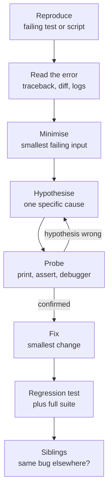
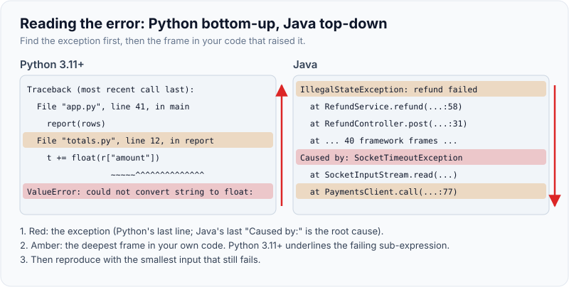
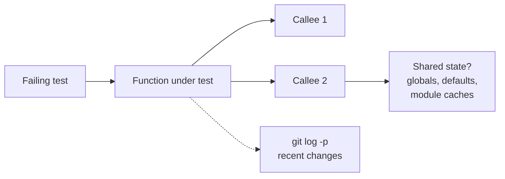

# Debugging & Reading an Unfamiliar Codebase Fast

!!! abstract "Key takeaways"
    - Debug with a **loop, not luck**: **reproduce → read the error → minimise → hypothesise → probe → fix → regression test → look for siblings**. Say each step out loud; the interviewer scores the method as much as the fix.
    - **Read Python tracebacks bottom-up** (the last line is the exception, the frame above it is where it happened); Java stack traces read **top-down** with `Caused by:` at the bottom. Python 3.11+ underlines the exact sub-expression that failed.
    - Use the **cheapest probe** that answers the question: a print or assert, `breakpoint()` and pdb, `pytest -x --lf -l --pdb`, or `git bisect run` when the bug is a regression.
    - Interview bugs are **predictable**: mutable default arguments, off-by-one slices, `timedelta.seconds` vs `total_seconds()`, naive vs aware datetimes, float money, string vs number comparison, aliasing and shallow copies, swallowed exceptions. Know the list.
    - In an unfamiliar codebase, spend **10 minutes on recon** (run tests, find entry points, read tests as specs, trace one path) before changing anything, then **make one small change to prove your model**.

## Why it matters

"This function returns the wrong output. Find and fix the bug" is a staple of FDE practical rounds, and the multi-file variant ("here's a small service; a customer reports X") is common in AI-enabled formats too (Meta's AI-enabled round is described as a codebase with failing tests and bugs). It's popular because it's exactly what happens at customer sites: you inherit code you didn't write, a report that says "the numbers are wrong", and a stakeholder waiting.

Interviewers aren't only checking whether you find the bug. They're watching *how*:

- Do you **reproduce** first, or start editing?
- Do you form **hypotheses** and test them, or change things at random?
- Do you **narrate**, so they can follow (and hint)?
- After the fix, do you add a **regression test** and ask "where else could this bug be?"

A disciplined method also protects you under pressure. When nerves kick in, the method tells you what to do next.

## Core concepts

### The debugging loop


*Notice the inner loop between hypothesis and probe. Each wrong hypothesis is cheap if the probe is cheap, which is why minimising the input comes first.*

**1. Reproduce.** Get a failing test or a one-line script that shows the bug. If you can't reproduce it, you can't know you've fixed it. In an interview, the failing test is often given; run it first and read the actual output.

**2. Read the error.** The message usually tells you more than you think. Read the whole assertion diff; pytest shows exactly which keys differ.

{ loading=lazy }
*Red is the exception, amber is the deepest frame in your own code.*

**3. Minimise.** Shrink the input until removing anything makes the bug disappear. One row instead of 500; one field instead of 20.

**4. Hypothesise.** Say a *specific*, *testable* cause: "I think the first row is being skipped", not "something's wrong with the loop".

**5. Probe.** The cheapest experiment that confirms or kills the hypothesis. A print of `len(rows)` inside the loop beats ten minutes of reading.

**6. Fix.** The smallest change that addresses the cause, not the symptom.

**7. Regression test.** Add the minimised case as a test, then run the whole suite.

**8. Siblings.** "This pattern appears in two other functions. Do you want me to fix those too?" This is a strong senior signal.

### Reading tracebacks

```text
Traceback (most recent call last):
  File "tb.py", line 3, in <module>
    total([{"qty": "2"}, {"qty": "two"}])
  File "tb.py", line 2, in total
    def total(rows): return sum(parse(r) for r in rows)
                            ~~~^^^^^^^^^^^^^^^^^^^^^^^^
  File "tb.py", line 2, in <genexpr>
    def total(rows): return sum(parse(r) for r in rows)
                                ~~~~~^^^
  File "tb.py", line 1, in parse
    def parse(row): return int(row["qty"])
                           ~~~^^^^^^^^^^^^
ValueError: invalid literal for int() with base 10: 'two'
```

- **Python:** "most recent call last", so read **from the bottom**: the exception type and message, then the frame where it was raised, then up through the callers. Since Python 3.11 (PEP 657), the `~~~^^^` markers point at the exact sub-expression, which matters on dense one-liners.
- **Java:** the **first** line is the exception and the frame where it was thrown; callers follow below; the root cause is the last `Caused by:` block.
- **The bug is often not where the exception is raised.** `int("two")` failed in `parse`, but the real question is why `"two"` got that far: is validation missing upstream?

### Probes, from cheapest to heaviest

| Probe | Use when | Commands |
|---|---|---|
| `print` / `assert` | Quick check of one value or invariant | `print(f"{row=}")` (the `=` specifier prints name and value) |
| pytest flags | Iterating on failing tests | `-x` stop at first failure, `--lf` rerun last failures, `-k name` select, `-l` show locals, `-vv` full diffs, `--pdb` debugger on failure |
| `breakpoint()` | Need to inspect several values or step | Built in since 3.7 (PEP 553); `PYTHONBREAKPOINT=0` disables all |
| pdb | Stepping through logic | `n` next, `s` step in, `c` continue, `l`/`ll` list, `p`/`pp` print, `w` where, `u`/`d` up/down frames, `b file:line` breakpoint, `interact` REPL |
| Logging | Behaviour over time, or in a service | `logging.debug(...)` with context (IDs, counts) |
| `git bisect run` | It used to work | Binary search over commits with a test as the oracle |
| `git log -S`, `git blame` | Who changed this line and why | `git log -S "seconds" -p`, `git blame -L 10,20 file.py` |

`git bisect run` is underused and impressive in a multi-commit exercise. Given a good and a bad commit and a command that exits non-zero on failure, git finds the first bad commit in about log₂(N) steps:

{ loading=lazy }
*Four tests for sixteen commits: log₂ of the range, whoever wrote the bug.*

```bash
git bisect start HEAD HEAD~4          # bad, then good
git bisect run python -m pytest -q test_price.py
# ... "2b7b63f is the first bad commit" ... v4
git bisect reset
```

### Bug classes that show up in interviews

Planted bugs are rarely exotic. They're the mistakes everyone makes in real code. Recognising the class is half the fix.

| Bug class | Symptom | Example | Fix |
|---|---|---|---|
| Mutable default argument | Results grow across calls; tests pass alone, fail together | `def f(x, acc={})` | `acc=None`, create inside |
| Off-by-one / slicing | First or last item missing | `rows[1:]` left over from a header-skipping era | Check ranges at both ends |
| `timedelta.seconds` | Durations over a day look tiny | `timedelta(days=1, minutes=10).seconds == 600` | `.total_seconds()` |
| Naive vs aware datetimes | `TypeError` comparing, or wrong day | `datetime.now()` vs parsed `+00:00` | Make everything aware; convert to UTC |
| Date from string slice | Local date, not UTC date | `s[:10]` on `"2026-03-03T01:30+05:30"` | Parse, `astimezone(timezone.utc).date()` |
| Float money | Pennies off; equality fails | `0.1 + 0.2 != 0.3` | `Decimal` from strings, integer cents |
| String vs number | Wrong sort or comparison | `"10" < "9"` is `True` | Convert types at the boundary |
| Truthiness | Zero treated as missing | `qty = row.get("qty") or 1` turns 0 into 1 | `if qty is None` |
| Aliasing | Changing one row changes all | `[[0] * 2] * 2` | `[[0] * 2 for _ in range(2)]` |
| Shallow copy | Copy shares nested lists | `copy.copy(d)["items"].append(...)` | `copy.deepcopy` or rebuild |
| Late-binding closures | All callbacks see the last value | `[lambda: i for i in range(3)]` → `[2, 2, 2]` | `lambda i=i: i` |
| Mutating while iterating | `RuntimeError` or skipped items | `del d[k]` inside `for k in d` | Iterate over `list(d)` or build new |
| Swallowed exceptions | Silent wrong output | `except Exception: pass` | Catch specific errors, log, re-raise |
| Rounding surprises | `round(2.5) == 2` | Banker's rounding on floats | `Decimal.quantize(..., ROUND_HALF_UP)` |
| Pagination end | Last page lost or infinite loop | `while len(page) == size` | Use the API's stop signal |

Java has its own list (`==` on `String`s or boxed `Integer` outside the cache range, `ConcurrentModificationException`, `equals` without `hashCode`, integer overflow, `LocalDateTime` without a zone), which maps closely onto the Python one.

### Reading an unfamiliar codebase in 10 minutes

The [learning round page](../fde-decomposition-scoping/06-the-learning-round-picking-up-an-unfamiliar-api-language-or.md) covers the basic sequence (run it, find the entry point, trace one request, tests as intent). For a debugging round, compress it into a recon checklist:

| Minute | Do | Say |
|---|---|---|
| 0–2 | `ls`, README, `pyproject.toml`/`requirements.txt`, Makefile | "It's a FastAPI app with pytest; entry point is `main.py`." |
| 2–4 | Run the tests; note what fails | "Two failures, both in `billing`." |
| 4–6 | Read the failing tests as specifications | "The test expects refunds to be excluded." |
| 6–8 | Find the code under test: grep the function name, follow imports | "`calculate_invoice` calls `apply_discounts`, which mutates the input." |
| 8–10 | Sketch the path and data model in a comment | "Request → router → service → repo. Invoice has lines, lines have discounts." |

Useful moves:

- `rg "def calculate_invoice|calculate_invoice\("` to find definition and callers; IDE "go to definition" if available.
- `git log --oneline -10` and `git log -p -- path/file.py` for recent changes: bugs cluster in recently changed code.
- Read **types and data shapes** first (dataclasses, Pydantic models, DB schema); behaviour follows from them.
- Note **invariants** as you find them ("amounts are in cents", "status only moves forward").
- **Prove your model** with one small change: add a print or a trivial test and confirm it does what you predicted.


*Notice the box for shared state. When a test passes alone but fails in the suite, look for state that outlives a call: mutable defaults, module-level caches, class attributes, singletons.*

## In practice: code & configuration

=== "❌ Common mistake"
    ```text
    Candidate reads the function for 6 minutes in silence.
    Changes `> sla_minutes` to `>= sla_minutes` "just in case". Runs tests: still red.
    Changes `[1:]` to `[0:]`. One test passes. Says "fixed!"
    Doesn't notice the other three failures have different causes.
    No regression test, no explanation of why the bug happened.
    ```

=== "✅ Correct approach"
    ```text
    "Let me run the tests first... 4 failures. The first is the simplest: one late delivery,
     expected 1, got {}. Hypothesis: the row is skipped. I see `deliveries[1:]`, which looks
     like a leftover header skip. I'll remove it and rerun.
     Now test 1 passes but test 2 shows 3 instead of 1, and the count grows between tests.
     Growing state across calls means shared state: the `result={}` default is created once.
     Test 3: a 24h10m delivery isn't late. `.seconds` is the seconds part only, 600 here;
     I need total_seconds(). Test 4: the day comes from slicing the string, which is local
     time. I'll convert to UTC first. All green. I'll grep for `.seconds` elsewhere."
    ```

### The kata: a buggy function to debug

Set 25 minutes. Don't read the solution until the tests pass. The function counts late deliveries per UTC day.

```python
from datetime import datetime

def late_deliveries_by_day(deliveries, sla_minutes=60, result={}):
    """Count deliveries that took longer than the SLA, per UTC day of drop-off."""
    for d in deliveries[1:]:
        picked = datetime.fromisoformat(d["picked_at"])
        dropped = datetime.fromisoformat(d["dropped_at"])
        minutes = (dropped - picked).seconds // 60
        if minutes > sla_minutes:
            day = d["dropped_at"][:10]
            result[day] = result.get(day, 0) + 1
    return result
```

The tests (all four fail against the code above):

```python
from deliveries import late_deliveries_by_day

def row(picked, dropped):
    return {"picked_at": picked, "dropped_at": dropped}

def test_single_late_delivery_is_counted():
    rows = [row("2026-03-02T09:00:00+00:00", "2026-03-02T10:30:00+00:00")]
    assert late_deliveries_by_day(rows) == {"2026-03-02": 1}

def test_calls_do_not_leak_into_each_other():
    rows = [row("2026-03-02T09:00:00+00:00", "2026-03-02T10:30:00+00:00")]
    late_deliveries_by_day(rows)
    assert late_deliveries_by_day(rows) == {"2026-03-02": 1}

def test_multi_day_delivery_is_late():
    rows = [row("2026-03-01T09:00:00+00:00", "2026-03-02T09:10:00+00:00")]   # 24h10m
    assert late_deliveries_by_day(rows) == {"2026-03-02": 1}

def test_day_is_utc_not_local():
    # 01:30 in India (+05:30) on 3 March is 20:00 UTC on 2 March
    rows = [row("2026-03-02T18:00:00+00:00", "2026-03-03T01:30:00+05:30")]
    assert late_deliveries_by_day(rows) == {"2026-03-02": 1}
```

??? example "Solution (four bugs)"
    ```python
    from datetime import datetime, timezone

    def late_deliveries_by_day(deliveries, sla_minutes=60):
        """Count deliveries that took longer than the SLA, per UTC day of drop-off."""
        result: dict[str, int] = {}                          # fix 1: fresh dict per call
        for d in deliveries:                                 # fix 2: no header row to skip
            picked = datetime.fromisoformat(d["picked_at"])
            dropped = datetime.fromisoformat(d["dropped_at"])
            minutes = (dropped - picked).total_seconds() / 60    # fix 3: .seconds drops the days
            if minutes > sla_minutes:
                day = dropped.astimezone(timezone.utc).date().isoformat()   # fix 4: UTC day
                result[day] = result.get(day, 0) + 1
        return result
    ```

    What the failures look like along the way, and what they tell you:

    - Before any fix: test 1 returns `{}`. One row in, nothing counted: the row is skipped (`[1:]`).
    - After removing `[1:]`: test 1 passes, but tests 2–4 report `{'2026-03-02': 3}`. **A count that grows across tests** is the fingerprint of shared mutable state: the default `{}` is evaluated once, when the function is defined (Python FAQ: "Why are default values shared between objects?").
    - After fixing the default: test 3 fails with `{}`. `timedelta(days=1, minutes=10).seconds` is `600`, so a 24-hour delivery looks like 10 minutes.
    - After `total_seconds()`: test 4 reports `{'2026-03-03': 1}`. The string slice takes the *local* date from the offset timestamp.
    - Siblings to mention: any other `.seconds`, any other `[:10]` date slicing, any other mutable defaults (`grep -n "=\[\]\|={}" -r .`).

### Debugging a service, not just a function

For a multi-file exercise ("customers report duplicate invoices"), the same loop applies with service tools:

```bash
python -m pytest -x -q                 # what's red right now?
python -m pytest tests/test_billing.py -k duplicate -vv -l   # one test, full diff, locals
python -m pytest --lf --pdb            # rerun last failures, drop into pdb at the failure
git log --oneline -15 -- app/billing/  # what changed recently in this area?
rg -n "def create_invoice|create_invoice\(" app/   # definition and all callers
```

Inside pdb at a failure, the most useful commands are `w` (where am I in the stack), `u` (go up to the caller, which often holds the wrong input), `pp locals()`, and `interact` for a full REPL in that frame.

## Real-world usage

- **Customer escalations** follow this loop with production tools: reproduce from a captured payload or a log line with a correlation ID, minimise in a test, fix, add the regression test, and check sibling services. Good structured logging (IDs, counts, decisions) is what makes the "read the error" step possible; see [Observability](../observability/index.md).
- **Time zones** cause a disproportionate share of data bugs in healthcare scheduling, logistics and banking cut-off times. "Which time zone is this day in?" is a question worth asking in every data task.
- **Regressions after upgrades** (a library changed a default) are where `git bisect` and learning tests pay off; a bisect over a dependency lockfile change finds them quickly.
- **AI assistants** are good at explaining an unfamiliar function and suggesting hypotheses, and poor at knowing which hypothesis is true. Use them to generate candidates, then probe yourself.

## Trade-offs & production gotchas

| Technique | Pros | Cons | Use when |
|---|---|---|---|
| Print / f-string `=` | Instant, works anywhere | Clutters code; remove after | One value, quick check |
| pdb / `breakpoint()` | Inspect everything, step through | Slower; awkward in some sandboxes | Complex state, loops |
| pytest `--pdb` / `-l` | Debugger exactly at the failure | Needs pytest | Test-driven debugging |
| Logging | Works in services and production | Needs setup; can leak data | Behaviour over time |
| `git bisect` | Finds the breaking commit mechanically | Needs a reliable test and history | Regressions |
| Reading code | No setup | Slow; easy to misread | Small functions; after a probe narrows it |

!!! warning "Gotchas"
    - **Fixing the symptom.** Wrapping `int(x)` in `try/except` makes the crash go away and leaves bad data flowing. Ask why the bad value got there.
    - **Several bugs at once.** Planted exercises often hide two to four bugs. When a fix changes the failure message, re-read it: it's a new clue, not a failed fix.
    - **Tests that pass alone and fail together** point to shared state (mutable defaults, module globals, caches) or test-order dependence.
    - **Leftover `breakpoint()` calls** hang CI or production. Search for them before you finish; `PYTHONBREAKPOINT=0` is a safety net, not a fix.
    - **Don't refactor while debugging.** Fix the bug with a minimal change and a test first; clean up after, as a separate step.

!!! question "Interview angle"
    Expect "How would you prevent this class of bug in future?" Good answers: a linter rule (Ruff's flake8-bugbear rule B006 flags mutable default arguments), type checking (mypy catches some naive/aware mix-ups when types are explicit), a shared time-handling helper, property-based tests for boundaries, and code review checklists.

## How this connects to my experience

- **Where it applies:** not a ★ claim, but debugging is constant in the resume: "Led sprint planning, estimation, stakeholder communication, release management, and production support", "Contributed to the migration of a legacy monolithic application to microservices" (Johnson Controls), and mentoring "through code reviews" (reading other people's code quickly).
- **Talking points:**
    - Production support on a healthcare platform serving 750K+ users: one incident told with this loop (reproduce, minimise, hypothesis, fix, regression test, siblings). *[confirm: a specific incident, its root cause and how you found it]*
    - Reading legacy code during the monolith-to-microservices migration: how you found seams and understood behaviour before moving it. *[confirm: how you approached understanding the legacy code, e.g. characterisation tests or tracing]*
    - Code reviews as fast reading of unfamiliar code: what you look for first. *[confirm: your review checklist]*
- **Likely follow-up chain:** "Tell me about the hardest bug you've fixed." → "How did you narrow it down?" → "What did you change so it couldn't happen again?" Answer with the loop as structure, and finish with the prevention step (test, alert, lint rule, or design change).

## Interview questions

### Fundamentals

??? question "Q1. Walk me through how you debug a function that returns the wrong output."
    **Answer:** Reproduce with a failing test, read the full error and diff, minimise the input, form one specific hypothesis, test it with the cheapest probe (print, assert or debugger), make the smallest fix, add the minimised case as a regression test, run the whole suite, and check for the same bug elsewhere.

    **Interviewer listens for:** a method, especially reproduce first and regression test last.

    **Common wrong answer:** "I read the code until I see the problem."

??? question "Q2. How do you read a Python traceback versus a Java stack trace?"
    **Answer:** Python prints the most recent call last, so read bottom-up: exception and message, then the raising frame, then callers. Java prints the exception and throwing frame first, callers below, and the root cause in the last `Caused by:` block. In both, the raising line isn't always the bug; ask where the bad value came from.

    **Interviewer listens for:** direction, root cause, and "where did the value come from".

    **Common wrong answer:** reading only the first line.

??? question "Q3. Why are mutable default arguments a bug?"
    **Answer:** Default values are evaluated once, when the function is defined, so a default list or dict is shared across calls and accumulates state. The symptom is results that grow between calls, or tests that pass alone and fail together. Use `None` and create the object inside the function.

    **Interviewer listens for:** "evaluated once at definition time".

    **Common wrong answer:** "Python copies defaults each call."

??? question "Q4. What's the difference between `timedelta.seconds` and `timedelta.total_seconds()`?"
    **Answer:** `.seconds` is only the seconds component (0 to 86,399) after days are split off; `.total_seconds()` is the whole duration as a float. A 1-day-10-minute delta has `.seconds == 600`. Using `.seconds` makes multi-day durations look short.

    **Interviewer listens for:** precise distinction with an example.

    **Common wrong answer:** "They're the same, one is a float."

### Intermediate

??? question "Q5. A test passes when run alone but fails in the full suite. What do you suspect?"
    **Answer:** Shared state that outlives a test: mutable defaults, module-level caches or globals, class attributes, singletons, environment variables, files or a database not reset between tests, or test-order dependence. I'd run the failing pair together (`pytest a b`), use `-p no:randomly` or a fixed order to reproduce, and look for state that isn't reset.

    **Interviewer listens for:** shared state and a way to reproduce.

    **Common wrong answer:** "The test is flaky; rerun it."

??? question "Q6. When do you use a debugger instead of print statements?"
    **Answer:** Print when I want one or two values and a fast loop. A debugger when I need to inspect many variables, step through branching logic, or move up the stack to see what the caller passed. `pytest --pdb` is a good middle ground: it stops exactly at the failure.

    **Interviewer listens for:** cost-based choice, comfort with both.

    **Common wrong answer:** "Real engineers always use the debugger" (or never).

??? question "Q7. How do you find which commit introduced a regression?"
    **Answer:** `git bisect`: mark a known bad and a known good commit, then let `git bisect run <test command>` binary-search, using the test's exit code as the oracle. It needs about log₂(N) test runs. Then read that commit's diff. `git log -S "term"` finds commits that added or removed a string.

    **Interviewer listens for:** bisect with an automated oracle.

    **Common wrong answer:** "Revert commits one by one."

??? question "Q8. How do you get oriented in an unfamiliar codebase in ten minutes?"
    **Answer:** Read the README and dependency file, run the tests, read the failing tests as specifications, find the code under test by grepping and following imports, sketch the request path and data model, note invariants, and make one small change to prove my model. I narrate as I go.

    **Interviewer listens for:** behaviour first, then structure, then verification.

    **Common wrong answer:** opening files alphabetically.

### Senior

??? question "Q9. You found and fixed the bug. What else do you do?"
    **Answer:** Add the minimised case as a regression test, run the full suite, look for the same pattern elsewhere (grep), explain the root cause in one sentence, and suggest prevention: a lint rule, a type, a shared helper, or a review checklist item. In production, also check whether bad data was already written and needs repair.

    **Interviewer listens for:** siblings, prevention, and data repair.

    **Common wrong answer:** "Done, it passes."

??? question "Q10. How do you debug something you can't reproduce locally?"
    **Answer:** Gather evidence from production: logs and traces by correlation ID, the exact input payload, configuration and version differences, timing and concurrency. Form hypotheses from the differences (data, config, load, time zone), add targeted logging or metrics if needed, and reproduce with the captured input in a test. Feature flags can limit impact while investigating.

    **Interviewer listens for:** evidence gathering and environment differences.

    **Common wrong answer:** "Add print statements in production."

??? question "Q11. How do you handle time zones to avoid bugs?"
    **Answer:** Store and compute in UTC with aware datetimes; convert to local time only at the edges (display, business-day rules), with an explicit zone (`zoneinfo`). Never mix naive and aware values. When a business question says "per day", ask which time zone defines the day. Test DST transitions and offsets.

    **Interviewer listens for:** UTC internally, explicit zones, asking which day.

    **Common wrong answer:** "Use the server's local time."

### Scenario-based

??? question "Q12. The interviewer gives you a 400-line module and says invoices are sometimes duplicated. Where do you start?"
    **Answer:** Ask for or write a failing test that reproduces a duplicate. Read how invoices are created and find every caller. Look for retry loops without idempotency, missing unique constraints, check-then-insert races, and event handlers without dedupe. Check recent changes in that area. Form a hypothesis and probe it with the test.

    **Interviewer listens for:** reproduction first, plus knowledge of duplicate causes.

    **Common wrong answer:** "Add a `DISTINCT` to the report."

??? question "Q13. You fix one bug and a different test starts failing. What does that mean?"
    **Answer:** Either the fix broke something (check the diff and the newly failing test's expectations), or the first bug was masking a second one, which is common in planted exercises. Read the new failure message carefully: a changed message is new information. Don't revert by reflex.

    **Interviewer listens for:** treating new failures as clues.

    **Common wrong answer:** "Revert and try something else."

??? question "Q14. You've spent ten minutes and you're stuck. What do you do in the interview?"
    **Answer:** Summarise what I know and what I've ruled out, state my current best hypothesis, and ask whether the interviewer wants me to continue or would like to give a hint. Interviewers usually value that more than silent struggle, and the summary often unblocks me.

    **Interviewer listens for:** composure and communication.

    **Common wrong answer:** silence until time runs out.

??? question "Q15. With an AI assistant allowed, how do you use it for debugging?"
    **Answer:** Ask it to explain unfamiliar code or list possible causes for a specific symptom, then test those hypotheses myself with probes. Don't let it rewrite the function wholesale: that may hide the bug rather than fix it, and I can't explain the change. Keep the regression test as proof.

    **Interviewer listens for:** AI for hypotheses, human for verification.

    **Common wrong answer:** "Paste the error and apply the suggested fix."

## Cheat sheet

| Concept | Remember |
|---|---|
| Loop | Reproduce → read → minimise → hypothesise → probe → fix → test → siblings |
| Tracebacks | Python bottom-up; Java top-down plus last `Caused by:` |
| pytest | `-x`, `--lf`, `-k`, `-l`, `-vv`, `--pdb` |
| pdb | `n s c l p pp w u d b interact` |
| `breakpoint()` | PEP 553; `PYTHONBREAKPOINT=0` disables |
| Bisect | `git bisect start BAD GOOD; git bisect run <test>` |
| Top bug classes | Mutable default, off-by-one, `.seconds`, naive/aware, float money, `"10" < "9"`, aliasing, swallowed exceptions |
| Shared state | Passes alone, fails together |
| Recon | README → run tests → tests as spec → grep → sketch path → prove model |
| Finish | Regression test, siblings, prevention, data repair |

## Sources
1. [Python docs: pdb, the Python debugger](https://docs.python.org/3/library/pdb.html): commands and `breakpoint()` integration.
2. [PEP 553: Built-in breakpoint()](https://peps.python.org/pep-0553/): `breakpoint()` and `PYTHONBREAKPOINT`.
3. [PEP 657: Include fine-grained error locations in tracebacks](https://peps.python.org/pep-0657/): the 3.11 `~~~^^^` markers.
4. [Python docs: Programming FAQ, why are default values shared between objects?](https://docs.python.org/3/faq/programming.html#why-are-default-values-shared-between-objects): mutable defaults.
5. [Python docs: datetime (timedelta attributes, aware and naive objects)](https://docs.python.org/3/library/datetime.html): `.seconds` range, `total_seconds()`, aware vs naive.
6. [pytest docs: How to handle test failures](https://docs.pytest.org/en/stable/how-to/failures.html): `-x`, `--pdb`, `--lf` and related options.
7. [Git docs: git-bisect](https://git-scm.com/docs/git-bisect): `bisect run` with exit codes.
8. [Ruff rules: mutable-argument-default (B006)](https://docs.astral.sh/ruff/rules/mutable-argument-default/): lint rule for the bug class.
9. [Hello Interview: Meta's AI-enabled coding interview](https://www.hellointerview.com/blog/meta-ai-enabled-coding): codebase-with-bugs format (prep site).
10. Andreas Zeller, *Why Programs Fail* (2nd ed.): scientific debugging and minimising failure-inducing input.
