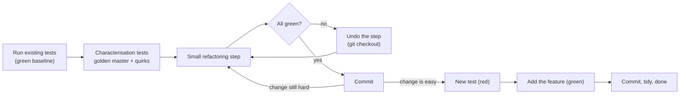

# Refactoring & Extending Messy Code Without Breaking Its Tests

!!! abstract "Key takeaways"
    - **Refactoring changes structure, not behaviour**, in small steps, with tests run after each one (Fowler). If behaviour changes, it's not a refactoring: it's a feature or a fix, and it gets its own test.
    - The existing tests are rarely enough. Before touching messy code, write **characterisation tests** (Feathers): tests that record what the code *does today*, quirks included. A **golden master** over a grid of boundary inputs gets you there in minutes.
    - When you find a quirk (US express shipping is free over $100?), **ask: bug or feature?** Preserve it until someone decides. Silent "fixes" break customers.
    - **Make the change easy, then make the easy change** (Kent Beck): refactor until the new requirement is a one-line addition (a new row in a rules table), then add it test-first.
    - Use **seams** to get code under test without rewriting it: inject dependencies as parameters, **sprout** new logic in a new tested function, or **wrap** the old one. Commit after every green step so you can always go back.

## Why it matters

"Here's our pricing module. Add support for Germany without breaking anything" is one of the most realistic FDE practical prompts. Customer code is rarely clean: long functions, nested conditionals, magic numbers, two tests written years ago. The requirement is small; the risk is everything around it.

Two failure modes dominate:

1. **The cowboy patch.** Copy an `elif` branch, tweak the numbers, run the two existing tests, done. It works until the new branch interacts with the coupon logic nobody tested.
2. **The big rewrite.** "This code is terrible, let me redo it properly." Forty minutes later there's a half-finished elegant design, the old quirks are gone, and the tests are red.

The interviewer wants the middle path: **pin the current behaviour, refactor in small verified steps until the change is easy, then make it test-first**. At customer sites, this is the difference between shipping a change on Friday and spending the weekend on a rollback.

## Core concepts

### What refactoring is (and isn't)

Martin Fowler defines refactoring as a change to the internal structure of software that makes it easier to understand and cheaper to modify **without changing its observable behaviour**, done as a series of small behaviour-preserving transformations. Two hats, never worn at once:

| Hat | You're allowed to | Tests |
|---|---|---|
| Refactoring | Rename, extract, move, restructure | Must stay green throughout, unchanged |
| Adding behaviour | New features, bug fixes | New tests added; existing tests stay green |

Say which hat you're wearing: "I'm refactoring now, no behaviour change; the golden master will tell me if I slip."

### The legacy code change algorithm

Michael Feathers (*Working Effectively with Legacy Code*) defines legacy code as code without tests, and gives a five-step algorithm:

1. **Identify change points:** where must the change go?
2. **Find test points:** where can I observe the behaviour? (A return value, a database row, a call to a collaborator.)
3. **Break dependencies:** introduce seams so the code can run in a test.
4. **Write tests:** characterisation tests around the change points.
5. **Make changes and refactor.**


*Notice the undo arrow. When a step breaks tests, you revert it rather than debug forward; small steps make reverting cheap. The feature is only added once the code makes it easy.*

### Characterisation tests and golden masters

A **characterisation test** asserts what the code actually does, not what it should do. Feathers' recipe: call the code, write an assertion you know will fail, let the failure tell you the real value, and make that the expected value.

A **golden master** (also called a snapshot or approval test) does the same at scale:

1. Generate a grid of inputs that covers **boundaries on both sides** of every threshold you can see in the code (99.99, 100, 100.01), every branch value (each country), and every flag combination.
2. Run the current code on all of them and **record the outputs** to a file.
3. After each refactoring step, run again and **compare**. Any difference is a behaviour change.

It's crude, and it's exactly right for a 45-minute round: it takes five minutes and gives you a safety net over hundreds of cases. Libraries like ApprovalTests and syrupy (a pytest snapshot plugin) do the same with nicer diffs.

!!! tip "Read the code for thresholds"
    Every `if t > 100` is a boundary to test at 100 and 100.01. Every `==` on a string is a branch to cover. Reading the conditions is how you build the input grid; you don't need to understand the whole function first.

### Bug or feature? Ask, then preserve

Characterisation tests surface quirks. In the kata below, US orders over $100 get free shipping **even with express**, and Canadian express orders over $150 pay $15 instead of $30. Maybe intentional, maybe a bug. In the round, say: "This looks odd. I'll preserve it in the refactor and flag it; do you want me to change it?" At a customer site, it's a question for the product owner. Changing behaviour silently inside a refactor is how integrations break in production.

### Seams: getting code under test

A **seam** (Feathers) is a place where you can change behaviour without editing the code at that place. In Python, the common seams are:

| Seam | How | Example |
|---|---|---|
| Parameter with default | Add an optional parameter for the dependency | `def send(order, clock=time.time, http=None)` |
| Constructor injection | Pass collaborators into a class | `Billing(repo, payments_client)` |
| Module attribute | Patch in tests | `monkeypatch.setattr(billing, "now", lambda: FIXED)` |
| Subclass and override | Override a method that does I/O | `class TestableBilling(Billing): def _fetch(...)` |

And two techniques for adding behaviour when the old code is too risky to touch:

- **Sprout method/class:** write the new logic in a **new, fully tested function**, and call it from the old code with a one-line change. The messy code barely changes.
- **Wrap method:** rename the old function, create a new one with the old name that calls it and adds behaviour before or after (logging, validation, a new rule).

### Small refactoring steps that matter in a round

| Refactoring (Fowler's catalogue) | Use when | Python move |
|---|---|---|
| Extract Function | A block has a nameable purpose | `subtotal(order)` from a loop |
| Rename Variable | `t`, `s`, `o` | `subtotal`, `fee`, `order` |
| Replace Magic Literal | Numbers with meaning | `FREE_SHIPPING_OVER = 100` |
| Decompose Conditional | Nested `if` trees | Named predicates, early returns |
| Replace Conditional with Polymorphism | Branching on a type code | A rules table or strategy objects |
| Introduce Parameter Object | Several values travel together | A `@dataclass` |
| Split Phase | One function parses *and* computes | `parse()` then `compute()` |
| Slide Statements | Related lines scattered | Group them before extracting |

In Python, "replace conditional with polymorphism" is often a **dict of data** rather than a class hierarchy: a table of rules is easier to read, test and extend than an `if/elif` ladder. The [behavioural patterns page](../lld-design-patterns/04-behavioural-patterns.md) covers Strategy in Java terms.

Kent Beck's line summarises the approach: *"for each desired change, make the change easy (warning: this may be hard), then make the easy change."*

## In practice: code & configuration

### The kata: add Germany to a messy checkout

The code you're given, and the only two tests it shipped with:

```python
def calc(o):
    t = 0
    for i in o["items"]:
        t = t + i["price"] * i["qty"]
    if o["country"] == "US":
        if t > 100:
            s = 0
        else:
            if o.get("express"):
                s = 25
            else:
                s = 10
    elif o["country"] == "CA":
        if o.get("express"):
            s = 30
        else:
            s = 15
        if t > 150: s = s - 15   # free standard over 150
    else:
        s = 40
        if o.get("express"):
            s = s + 20
    if o.get("coupon") == "SHIP5":
        s = s - 5
    if s < 0: s = 0
    return round(t + s, 2)
```

```python
# The two tests the codebase shipped with.
from checkout import calc

def test_us_standard():
    assert calc({"items": [{"price": 20, "qty": 2}], "country": "US"}) == 50

def test_rest_of_world_express():
    assert calc({"items": [{"price": 10, "qty": 1}], "country": "FR", "express": True}) == 70
```

**The requirement:** add Germany (DE): standard shipping 12, express 22, free standard shipping over 80. The SHIP5 coupon must still never make shipping negative.

=== "❌ Common mistake"
    ```python
    # Copy-paste a branch, run the two old tests, ship it.
        elif o["country"] == "DE":
            if o.get("express"):
                s = 22
            else:
                s = 12
            if t >= 80: s = s - 12      # ">=" vs the spec's "over 80"? Nobody checked.
    # Problems:
    #  - no test for DE at all, let alone at the 80 boundary or with the coupon
    #  - the function gets longer and harder to change next time (France is next sprint)
    #  - the two existing tests don't cover CA, coupons or thresholds, so a slip elsewhere goes unseen
    ```

=== "✅ Correct approach"
    ```text
    1. Run existing tests: 2 green (baseline).
    2. Golden master over countries x boundary subtotals x express x coupon: record, commit.
    3. Refactor in small steps, golden master green after each, commit after each:
         rename t/s/o -> extract subtotal() -> extract shipping() -> constants
         -> rules table with a ShippingRule dataclass (quirks preserved and named).
    4. Flag the quirks to the interviewer: "US express is free over 100; CA express over 150
       pays 15. Preserved. Bug or feature?"
    5. Write DE tests first (red), including 80 vs 80.01 and the coupon case.
    6. Add one row to the rules table (green). Commit.
    ```

### Step 2: the golden master

```python
"""Characterization (golden master) tests: pin what calc() DOES today, quirks included."""
import itertools, json, pathlib
import pytest
from checkout import calc

GOLDEN = pathlib.Path(__file__).with_name("calc_golden.json")
COUNTRIES = ["US", "CA", "FR"]
SUBTOTALS = [0, 99.99, 100, 100.01, 150, 150.01, 300]   # boundaries on both sides
FLAGS = [(express, coupon) for express in (False, True) for coupon in (None, "SHIP5")]

def cases():
    for country, sub, (express, coupon) in itertools.product(COUNTRIES, SUBTOTALS, FLAGS):
        order = {"items": [{"price": sub, "qty": 1}], "country": country}
        if express:
            order["express"] = True
        if coupon:
            order["coupon"] = coupon
        yield order

def key(order):
    return json.dumps(order, sort_keys=True)

def test_record_or_compare_golden():
    actual = {key(o): calc(o) for o in cases()}
    if not GOLDEN.exists():                       # first run records today's behaviour
        GOLDEN.write_text(json.dumps(actual, indent=1, sort_keys=True))
        pytest.skip("golden master recorded; re-run to compare")
    assert actual == json.loads(GOLDEN.read_text())
```

84 cases (3 countries × 7 subtotals × 4 flag combinations), recorded in one run against the original code. Note that `FR` stands in for "rest of the world": DE isn't in the grid because its behaviour is **meant** to change (from the default 40 to its own rule). Say that explicitly; it's the one intentional difference.

### Step 3: the refactored code, then the easy change

After a handful of small steps (each one run against the golden master and committed), the shipping logic becomes data:

```python
from dataclasses import dataclass

@dataclass(frozen=True)
class ShippingRule:
    standard: float
    express: float
    free_standard_over: float | None = None   # subtotal threshold, strictly greater than
    free_express_too: bool = False            # US quirk: express is also free over the threshold

    def fee(self, subtotal: float, express: bool) -> float:
        free = self.free_standard_over is not None and subtotal > self.free_standard_over
        if free and (self.free_express_too or not express):
            return 0
        if free:                              # CA quirk: express over threshold pays the difference
            return self.express - self.standard
        return self.express if express else self.standard

RULES: dict[str, ShippingRule] = {
    "US": ShippingRule(standard=10, express=25, free_standard_over=100, free_express_too=True),
    "CA": ShippingRule(standard=15, express=30, free_standard_over=150),
    "DE": ShippingRule(standard=12, express=22, free_standard_over=80),   # new requirement
}
DEFAULT_RULE = ShippingRule(standard=40, express=60)
COUPON_DISCOUNTS = {"SHIP5": 5}

def subtotal(order: dict) -> float:
    return sum(item["price"] * item["qty"] for item in order["items"])

def shipping(order: dict, sub: float) -> float:
    rule = RULES.get(order["country"], DEFAULT_RULE)
    fee = rule.fee(sub, bool(order.get("express")))
    fee -= COUPON_DISCOUNTS.get(order.get("coupon"), 0)
    return max(fee, 0)

def calc(order: dict) -> float:
    sub = subtotal(order)
    return round(sub + shipping(order, sub), 2)
```

The DE tests, written **before** adding the `"DE"` row (they fail against the default rule, then pass):

```python
import pytest
from checkout import calc

def de(sub, **flags):
    return {"items": [{"price": sub, "qty": 1}], "country": "DE", **flags}

@pytest.mark.parametrize("order, expected", [
    (de(50), 62), (de(50, express=True), 72),
    (de(80), 92),                       # threshold is "over 80", so 80 still pays
    (de(80.01), 80.01), (de(90, express=True), 100),
    (de(90, coupon="SHIP5"), 90),       # coupon never makes shipping negative
])
def test_germany(order, expected):
    assert calc(order) == expected
```

Final state: the 2 original tests, the 84-case golden master and 6 new DE tests all pass. Things to point out:

- The quirks have **names** now (`free_express_too`, the CA comment). The next engineer can see them and the product owner can decide.
- Adding France next sprint is one line plus its tests.
- `calc` still uses floats because the original did; changing money to `Decimal` is a **behaviour change** (rounding could differ) and belongs in a separate, agreed step. Mention it; don't sneak it in.

### Java 21 comparison

The same move in Java uses a `record` and a `Map`; an `enum` with fields works too when the set is closed.

```java
record Rule(BigDecimal standard, BigDecimal express, BigDecimal freeOver, boolean freeExpressToo) {
    BigDecimal fee(BigDecimal subtotal, boolean isExpress) {
        boolean free = freeOver != null && subtotal.compareTo(freeOver) > 0;
        if (free && (freeExpressToo || !isExpress)) return BigDecimal.ZERO;
        if (free) return express.subtract(standard);
        return isExpress ? express : standard;
    }
}

static final Map<String, Rule> RULES = Map.of(
    "US", new Rule(bd("10"), bd("25"), bd("100"), true),
    "CA", new Rule(bd("15"), bd("30"), bd("150"), false),
    "DE", new Rule(bd("12"), bd("22"), bd("80"), false));
static final Rule DEFAULT = new Rule(bd("40"), bd("60"), null, false);
// RULES.getOrDefault("DE", DEFAULT).fee(bd("80"), false)    -> 12
// RULES.getOrDefault("DE", DEFAULT).fee(bd("80.01"), false) -> 0
```

Java tooling makes some steps safer (IDE-automated Extract Method and Rename are behaviour-preserving by construction). In Python, IDE refactorings exist but dynamic typing makes them less certain, which is one more reason for the golden master.

### Commit rhythm

```bash
git commit -am "test: golden master for calc() (84 cases)"
git commit -am "refactor: rename t/s/o in calc()"
git commit -am "refactor: extract subtotal() and shipping()"
git commit -am "refactor: shipping rules as data; quirks named"
git commit -am "feat: Germany shipping rule (DE)"
```

In a sandbox without git, keep a copy of the last green version (`cp checkout.py checkout_green.py`) for the same effect.

### Practice: extend the kata

After the DE change, take these on one at a time, each with tests first:

1. **A `FREESHIP` coupon** that makes standard shipping free but not express. Where does it belong: the coupon table or the rule? (Hint: the coupon table currently holds amounts; you may need to change its shape. Refactor first.)
2. **Heavy item surcharge:** items with `weight_kg > 20` add 15 per item to shipping, before coupons. Which function changes? Does the golden master still pass (it should, since existing orders have no weight)?
3. **Money as integer cents.** Propose the change, list which golden-master cases might change due to rounding, and get "approval" before doing it.

## Real-world usage

- **Customer codebases** at deployments are often years old, lightly tested and business-critical. FDEs routinely add a field, a rule or an integration point; characterisation tests and sprout methods are how you do it in days rather than weeks.
- **Approval and snapshot testing** is common for report generators, pricing engines, document templates and API responses, anywhere the output is large and the exact current behaviour matters.
- **Strangler fig migrations** (Fowler) apply the same idea at system scale: wrap the old system, route new behaviour to new code, and move piece by piece behind a stable interface, with comparison testing between old and new.
- **Regulated domains:** in banking and healthcare, an unintended change in a calculation can be a compliance incident. Golden masters over realistic data, plus sign-off on intentional changes, are standard practice.

## Trade-offs & production gotchas

| Approach | Pros | Cons | Use when |
|---|---|---|---|
| Patch in place (no refactor) | Fastest | Code gets worse; risk grows | Truly one-off, well-tested code |
| Sprout method/class | Old code barely touched; new code clean and tested | Two styles side by side | Risky legacy code, little time |
| Wrap method | Adds behaviour at the edges | Only fits before/after logic | Logging, validation, new pre-step |
| Refactor then extend | Leaves code better; change becomes trivial | Needs a safety net first | Default when tests or a golden master exist |
| Rewrite | Clean slate | Loses quirks; high risk; slow | Almost never in a round |

!!! warning "Gotchas"
    - **Golden masters pin bugs too.** That's the point during a refactor, but don't let the snapshot become "the spec" forever; replace it with intention-revealing tests over time.
    - **Non-deterministic output** (timestamps, random IDs, dict ordering in old code) breaks snapshots. Inject the clock and seed, or normalise before comparing.
    - **Floating-point equality** in snapshots: compare rounded values, or the snapshot will flicker after harmless refactors that reorder arithmetic.
    - **Refactoring and changing behaviour in the same step** makes failures impossible to interpret. One hat at a time.
    - **Over-engineering:** a plugin system for shipping rules is not what a 45-minute round wants. A dict and a dataclass are enough.

!!! question "Interview angle"
    Interviewers often add the next requirement right after you finish ("now add France, with free express over 200"). If your refactor was right, it's a one-line change and a test. If you patched, you're back in the `if` ladder. This is why the round is called "extend", not "fix".

## How this connects to my experience

- **Where it applies:** not a ★ claim, but closely related bullets: "Contributed to the migration of a legacy monolithic application to microservices" (Johnson Controls, Metasys), "Established engineering standards around testing, CI/CD, code quality, and deployment practices" (OptumRx Meteor), and "Mentored 5+ engineers through code reviews, design reviews, and technical coaching".
- **Talking points:**
    - The monolith migration is a system-scale version of this page: understanding legacy behaviour and preserving it while moving it. *[confirm: how you verified behaviour stayed the same, e.g. comparison tests, parallel runs or contract tests]*
    - Code quality standards at OptumRx: what you required for refactoring PRs. *[confirm: e.g. separate refactor and feature PRs, test coverage gates, SonarQube]*
    - Teaching juniors to make the change easy first, in code reviews. *[confirm: an example review where you suggested a preparatory refactor]*
- **Likely follow-up chain:** "How do you change code that has no tests?" → "What if the existing behaviour looks wrong?" → "How do you convince a team to refactor instead of patching?" Answer with characterisation tests and seams; ask-then-preserve for quirks; and the business case (next change becomes cheaper, fewer incidents), backed by a small, low-risk first step.

## Interview questions

### Fundamentals

??? question "Q1. What is refactoring?"
    **Answer:** A change to a program's internal structure that keeps its observable behaviour the same, done in small steps, with tests run after each, to make the code easier to understand and change. Fixing a bug or adding a feature isn't refactoring; those change behaviour and need new tests.

    **Interviewer listens for:** behaviour preservation and small steps.

    **Common wrong answer:** "Cleaning up and improving the code" (which can include behaviour changes).

??? question "Q2. What is a characterisation test?"
    **Answer:** A test that records what the code currently does, not what it should do (Michael Feathers' term). You call the code, observe the output, and assert it. It protects behaviour during refactoring, including quirks that someone may rely on.

    **Interviewer listens for:** "current behaviour", including quirks.

    **Common wrong answer:** "A test that checks the requirements."

??? question "Q3. What is a golden master test and when would you use one?"
    **Answer:** Run the existing code over a large grid of inputs, record all outputs to a file, and compare future runs with that recording. Use it to get a fast safety net over messy code before refactoring, especially when outputs are large or the logic has many branches. Design the input grid around boundaries and branch values you can see in the code.

    **Interviewer listens for:** boundary-driven input grids, and a temporary safety net.

    **Common wrong answer:** "A test with the right answers from the spec."

??? question "Q4. What does "make the change easy, then make the easy change" mean?"
    **Answer:** Kent Beck's advice: first refactor (behaviour-preserving) until the new requirement fits naturally, then add it as a small, test-first change. It separates risky restructuring from the feature, so each is easy to verify.

    **Interviewer listens for:** two separate phases, both verified.

    **Common wrong answer:** "Do the easy parts first."

### Intermediate

??? question "Q5. What's a seam, and give Python examples."
    **Answer:** A place where you can change behaviour without editing the code there (Feathers). In Python: an optional parameter for a dependency (`clock=time.time`), constructor injection, patching a module attribute with `monkeypatch`, or subclassing and overriding a method that does I/O. Seams let you test code that calls the network, the clock or a database.

    **Interviewer listens for:** concrete seams and why they matter for testing.

    **Common wrong answer:** "A seam is where two modules meet."

??? question "Q6. Sprout method versus wrap method?"
    **Answer:** Sprout: write the new logic in a new, fully tested function and call it from the old code with a minimal edit. Wrap: rename the old function and create a new function with the original name that calls it and adds behaviour before or after. Sprout suits new logic in the middle of a flow; wrap suits cross-cutting additions like logging or validation.

    **Interviewer listens for:** both techniques and when each fits.

    **Common wrong answer:** confusing them, or not knowing either.

??? question "Q7. You find behaviour in the code that looks like a bug. What do you do during a refactor?"
    **Answer:** Preserve it, pin it in a characterisation test, name it in the code, and raise it: "Bug or feature?" If it's a bug, fix it as a separate, explicit change with its own test after the refactor. Customers or downstream systems may depend on the current behaviour.

    **Interviewer listens for:** ask, preserve, separate the fix.

    **Common wrong answer:** "Fix it as I go."

??? question "Q8. How do you refactor a long `if/elif` chain on a type code in Python?"
    **Answer:** Extract the per-branch logic, then replace the chain with a lookup table: a dict from code to data (a dataclass of parameters) or to functions or strategy objects. Keep a default for unknown codes. Run tests after each step. Use a class hierarchy only when the branches differ in behaviour, not just parameters.

    **Interviewer listens for:** data-driven dispatch, defaults, small steps.

    **Common wrong answer:** "Use a big class hierarchy."

### Senior

??? question "Q9. How do you decide between patching, refactoring and rewriting?"
    **Answer:** Patch when the code is well tested and the change is truly one-off. Refactor then extend when the code will keep changing and I can build a safety net (tests or a golden master). Rewrite only when the code can't be made testable and I can run old and new side by side (strangler fig, comparison testing). In a timed round, refactor-then-extend or sprout is almost always right.

    **Interviewer listens for:** risk-based reasoning, not taste.

    **Common wrong answer:** "Rewrite, it's faster with modern tools."

??? question "Q10. A golden master fails after a refactor. How do you investigate?"
    **Answer:** Look at which cases differ and by how much. Small float differences suggest arithmetic reordering (compare rounded values, or the refactor changed rounding). Differences on a boundary suggest a `>` became `>=`. Differences for one country or flag point at one branch. If I can't see it quickly, revert the last step (they're small) and redo it more carefully.

    **Interviewer listens for:** systematic diffing and willingness to revert.

    **Common wrong answer:** "Re-record the golden master."

??? question "Q11. How do you make a non-deterministic function testable without rewriting it?"
    **Answer:** Introduce seams for the sources of non-determinism: inject a clock function, a random generator or seed, and an ID generator as parameters with production defaults. Normalise outputs (sort, strip timestamps) before comparing in snapshot tests.

    **Interviewer listens for:** injection of time and randomness.

    **Common wrong answer:** "Mock `datetime` globally everywhere."

### Scenario-based

??? question "Q12. You have 45 minutes, a 200-line function with two tests, and a new rule to add. Plan it."
    **Answer:** Five minutes reading conditions to list thresholds and branches; five minutes on a golden master over those boundaries; 15–20 minutes on small refactors (rename, extract, rules table), committing after each green run; ten minutes adding the rule test-first; the rest to summarise, flag quirks and suggest next steps. If time is short, sprout the new rule in a tested function and call it from the old code.

    **Interviewer listens for:** a time-boxed plan with a fallback.

    **Common wrong answer:** "Start rewriting it cleanly."

??? question "Q13. Halfway through refactoring, the tests go red and you don't know why. What now?"
    **Answer:** Revert to the last green commit and redo the step in smaller pieces. Debugging forward through a large, uncommitted refactor wastes time. This is why I commit after every green step.

    **Interviewer listens for:** revert over debug-forward.

    **Common wrong answer:** "Keep going and fix the tests at the end."

??? question "Q14. The interviewer says: "These tests are slow and flaky because they hit a real database. Add a feature anyway." What do you do?"
    **Answer:** Find a seam: inject the repository so the logic can be tested with an in-memory fake, write fast tests for the new feature against the fake, and keep one integration test for the real database path. Mention fixing the flakiness (isolated test data, transactions rolled back per test, or Testcontainers) as follow-up.

    **Interviewer listens for:** a seam for fast tests, honest follow-up.

    **Common wrong answer:** "Skip the tests."

??? question "Q15. How do you convince a customer team to let you refactor before adding their feature?"
    **Answer:** Keep it small and visible: show that the refactor is behaviour-preserving (golden master), time-boxed, and makes this change and the next ones cheaper and safer. Offer to do it in a separate reviewed PR. If they still say no, sprout the feature in clean, tested code so at least the new part is good.

    **Interviewer listens for:** business framing and a fallback.

    **Common wrong answer:** "Refactoring is always worth it; I'd just do it."

## Cheat sheet

| Concept | Remember |
|---|---|
| Refactoring | Structure changes, behaviour doesn't; small steps; tests after each |
| Two hats | Refactor or add behaviour, never both at once |
| Characterisation test | Asserts what the code does now (Feathers) |
| Golden master | Grid of boundary inputs → record outputs → compare after each step |
| Quirks | Ask "bug or feature?"; preserve and name; fix separately |
| Seams | Parameter defaults, constructor injection, monkeypatch, subclass |
| Sprout / wrap | New tested function called from old code / rename and wrap |
| Python dispatch | Dict of rules (dataclass) over `if/elif` ladders |
| Beck | Make the change easy, then make the easy change |
| Safety | Commit after every green step; revert, don't debug forward |

## Sources
1. Martin Fowler, *Refactoring: Improving the Design of Existing Code* (2nd ed., 2018): definition, small steps, catalogue (Extract Function, Replace Conditional with Polymorphism, Split Phase).
2. [refactoring.com catalog](https://refactoring.com/catalog/): online catalogue of refactorings.
3. Michael Feathers, *Working Effectively with Legacy Code* (2004): legacy code definition, change algorithm, characterisation tests, seams, sprout and wrap.
4. [Martin Fowler: Definition of Refactoring](https://martinfowler.com/bliki/DefinitionOfRefactoring.html): behaviour-preserving transformations.
5. [Martin Fowler: Strangler Fig Application](https://martinfowler.com/bliki/StranglerFigApplication.html): incremental replacement at system scale.
6. [ApprovalTests](https://approvaltests.com/): approval/golden master testing libraries for Python, Java and others.
7. [pytest docs: monkeypatch](https://docs.pytest.org/en/stable/how-to/monkeypatch.html): patching attributes, environment and dictionaries in tests.
8. [Python docs: dataclasses](https://docs.python.org/3/library/dataclasses.html): `@dataclass(frozen=True)` for rule objects.
9. Kent Beck, 2012 post: "for each desired change, make the change easy (warning: this may be hard), then make the easy change."
