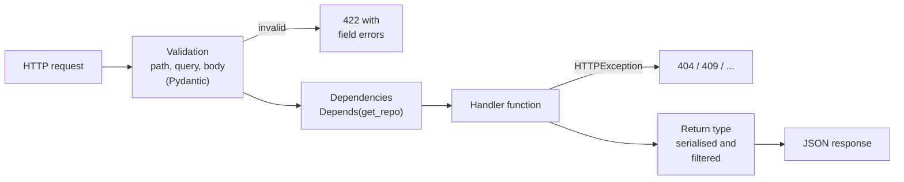

# Python Fluency for FDE: Scripting, Data Wrangling, FastAPI Services

!!! abstract "Key takeaways"
    - FDE rounds are **Python-heavy**; fluency means the **standard library comes without thinking**: comprehensions, generators, `collections` (`Counter`, `defaultdict`, `deque`), `itertools` (`batched` is new in 3.12), `pathlib`, `csv`, `json`, `datetime` + `zoneinfo`, `dataclasses`, `logging`, `argparse`.
    - **Scripts** that customers run need a `main(argv) -> int`, `argparse`, **streaming** (generators, not `read()` of a 4 GB file), a **reject file**, logging and **non-zero exit codes** on failure so pipelines notice.
    - **pandas:** set **dtypes** on read, parse times with **`utc=True`**, **dedupe** explicitly, `merge(..., validate="many_to_one", indicator=True)` to catch row explosions and orphans, and assign with **`.loc`**. In **pandas 3.0**, Copy-on-Write is always on and **chained assignment never works**.
    - **FastAPI** maps closely onto Spring: Pydantic models ≈ DTOs with Bean Validation (bad input → **422**), `Depends` ≈ dependency injection, `HTTPException` ≈ `ResponseStatusException`. Test with `TestClient` and **`app.dependency_overrides`**.
    - Write tests as you go with **pytest** (`parametrize`, `tmp_path`, `monkeypatch`, fixtures). It's faster than debugging by print, and visible quality.

## Why it matters

FDE job descriptions consistently list Python (often alongside TypeScript), and most practical-round reports describe Python sandboxes: call an API, parse a file, aggregate, expose an endpoint. A strong Java engineer can solve every one of those problems; the risk is **speed**. Looking up how to read a CSV, or fighting a pandas `SettingWithCopyWarning`, burns minutes the round doesn't have, and hesitation reads as unfamiliarity.

The good news is that the surface you need is small. This page is that surface: the idioms, three production-shaped templates (a script, a wrangling job, a service) and drills to make them automatic. The [learning round page](../fde-decomposition-scoping/06-the-learning-round-picking-up-an-unfamiliar-api-language-or.md) has a Java-to-Python map and the classic gotchas (`groupby`, mutable defaults, `/` vs `//`); this page builds on it. The general [Python topic](../python/index.md) covers the language basics.

## Core concepts

### Standard-library reflexes

| Need | Python 3.12+ | Java equivalent |
|---|---|---|
| Transform and filter | `[f(x) for x in xs if p(x)]` | `stream().filter().map().toList()` |
| Lazy pipeline | Generator expression or `yield` | `Stream` (lazy) |
| Count things | `Counter(xs).most_common(3)` | `groupingBy(..., counting())` |
| Group into lists | `defaultdict(list)` loop | `groupingBy` |
| Sliding window / last N | `deque(maxlen=n)` | `ArrayDeque` with manual eviction |
| Chunks of N | `itertools.batched(xs, n)` (3.12) | Guava `Lists.partition` |
| First N of an iterator | `itertools.islice(it, n)` | `limit(n)` |
| Pairwise iteration safely | `zip(a, b, strict=True)` (3.10) raises if lengths differ | Manual index check |
| Sort by several keys | `sorted(xs, key=lambda r: (r.prio, r.name))` | `Comparator.comparing().thenComparing()` |
| Memoise | `@functools.cache` | Manual `Map` cache |
| Immutable record | `@dataclass(frozen=True)` | `record` |
| Pattern matching | `match event: case {"type": "x", "data": {...}}:` (3.10) | `switch` with patterns (21) |
| Type alias / generics | `type Row = dict[str, str]`; `def first[T](xs: list[T]) -> T` (PEP 695, 3.12) | Generics |
| Optional | `str \| None` (PEP 604) | `Optional<String>` / nullable |
| Resource cleanup | `with open(...) as f:` | try-with-resources |
| Exception chaining | `raise RuntimeError("bad row 7") from e` | `new RuntimeException(msg, e)` |
| Time zones | `zoneinfo.ZoneInfo("Europe/London")`, aware datetimes | `ZonedDateTime`, `ZoneId` |
| Files and paths | `pathlib.Path("data") / "in.csv"` | `java.nio.file.Path` |
| Debug print | `print(f"{row=}")` prints `row={...}` | none built in |

`match` with mapping patterns is handy for webhook-style dispatch:

```python
def kind(event):
    match event:
        case {"type": "payment.succeeded", "data": {"amount": int(a)}} if a > 0:
            return f"paid {a}"
        case {"type": t}:
            return f"ignored {t}"
```

### Scripting: what a customer-ready script looks like

FDEs write lots of scripts: backfills, one-off migrations, data cleanups, health checks. A script someone else will run (at 2 a.m., from cron, in a pipeline) needs more than a happy path:

| Concern | Practice |
|---|---|
| Entry point | `def main(argv: list[str] \| None = None) -> int` and `sys.exit(main())`, so tests can call `main([...])` |
| Arguments | `argparse` with types (`type=Path`), defaults and `--help` from the docstring |
| Memory | Stream rows with generators; never `f.read()` a file of unknown size |
| Bad data | Write rejects to a file **with a reason**; don't silently drop |
| Failure | Non-zero exit codes (1 = data problem, 2 = usage/config) so cron and CI notice |
| Visibility | `logging` with counts at the end; no `print` of personal data |
| Encoding | `encoding="utf-8-sig"` to strip Excel's BOM; `newline=""` for `csv` |
| Idempotency | Safe to rerun (write to a new file, or upsert) |

### Data wrangling: plain Python or pandas?

| Situation | Choose |
|---|---|
| Streaming a large file row by row, simple per-row rules | `csv` module + generators |
| Joins, group-bys, pivots, time series on data that fits in memory | pandas |
| Quick SQL over files, or larger-than-memory analytics | DuckDB or Polars (mention; check they're installed) |
| Interview sandbox with no pandas | `csv` + `defaultdict` + `Counter` |

pandas essentials for a round:

- **Read with types:** `pd.read_csv(path, dtype={"id": "string"})` keeps IDs like `"00123"` from becoming integers.
- **Times:** `pd.to_datetime(col, utc=True)` converts mixed offsets to one UTC column. Without it, pandas 3.0 raises `ValueError: Mixed timezones detected` (pandas 2.x returned an object column with a warning).
- **Duplicates:** `drop_duplicates(subset="visit_id", keep="first")`, and say which one you keep.
- **Nulls:** count them (`isna().sum()`) and decide (`fillna`, drop, or reject); report the count.
- **Joins:** `merge(..., how="left", validate="many_to_one", indicator=True)`. `validate` raises `MergeError` if the "one" side has duplicate keys (which would silently multiply rows); `indicator` adds `_merge` so you can list orphans.
- **Aggregation:** named aggregation, `groupby([...], as_index=False).agg(revenue=("amount", "sum"))`.
- **Assignment:** `df.loc[mask, "col"] = value`, never `df[mask]["col"] = value`.

!!! warning "pandas 3.0 changed defaults"
    pandas 3.0 (January 2026) made **Copy-on-Write** the only mode: any indexing result behaves as a copy, so **chained assignment never updates the original** and emits a `ChainedAssignmentError` warning (the old `SettingWithCopyWarning` is gone). It also introduced a dedicated **string dtype** by default (`pd.Series(["x"]).dtype` prints `str`), which breaks code that checks `dtype == object`. If the sandbox has pandas 2.x, behaviour differs; check `pd.__version__`.

### FastAPI in one diagram


*Notice that validation happens before your code runs, and the return type annotation shapes the response. Your handler only sees typed, valid input, much like a Spring controller with `@Valid` DTOs.*

| Spring Boot | FastAPI |
|---|---|
| `@RestController`, `@GetMapping("/tickets/{id}")` | `@app.get("/tickets/{ticket_id}")` |
| DTO with Bean Validation (`@NotBlank`, `@Min`) | Pydantic `BaseModel` with `Field(min_length=1, ge=1)` |
| `@Valid` failure → 400 `MethodArgumentNotValidException` | Validation failure → **422** with a `detail` list |
| Constructor injection of `@Service` beans | `Annotated[Repo, Depends(get_repo)]` |
| `ResponseStatusException(HttpStatus.NOT_FOUND)` | `raise HTTPException(status_code=404, detail=...)` |
| `@MockBean` / test configuration | `app.dependency_overrides[get_repo] = lambda: fake` |
| `MockMvc` / `WebTestClient` | `fastapi.testclient.TestClient` |
| Virtual threads / thread pool | `def` handlers run in a thread pool; `async def` runs on the event loop (don't block it) |
| springdoc OpenAPI | Built-in OpenAPI at `/docs` |

The `def` vs `async def` rule matters: an `async def` handler that calls a blocking library (like `requests` or a sync DB driver) blocks the whole event loop. If you're not sure, use plain `def`; FastAPI runs it in a thread pool.

## In practice: code & configuration

=== "❌ Common mistake"
    ```python
    import pandas as pd

    visits = pd.read_csv("visits.csv")                      # clinic_id "007" becomes 7
    visits["visited_at"] = pd.to_datetime(visits["visited_at"])   # mixed offsets: ValueError in pandas 3
    visits[visits["amount"].isna()]["amount"] = 0           # chained assignment: no effect in pandas 3
    joined = visits.merge(clinics, on="clinic_id")          # inner join silently drops orphans;
                                                            # duplicate clinic rows multiply visits
    monthly = joined.groupby("clinic_id").sum()             # sums every numeric column, IDs included
    ```

=== "✅ Correct approach"
    ```python
    visits = pd.read_csv(VISITS, dtype={"visit_id": "string", "clinic_id": "string"})
    clinics = pd.read_csv(CLINICS, dtype={"clinic_id": "string"})

    visits["visited_at"] = pd.to_datetime(visits["visited_at"], utc=True)   # mixed offsets -> UTC
    visits = visits.drop_duplicates(subset="visit_id", keep="first")        # exports re-send rows
    missing_amount = visits["amount"].isna().sum()                           # report, don't hide
    visits["amount"] = visits["amount"].fillna(0)

    joined = visits.merge(clinics, on="clinic_id", how="left", validate="many_to_one", indicator=True)
    orphans = joined.loc[joined["_merge"] == "left_only", "visit_id"].tolist()
    ```

### Template 1: a customer-ready CLI script

```python
"""Clean a vendor CSV export: stream rows, validate, write good rows and a reject file."""
import argparse
import csv
import logging
import sys
from collections.abc import Iterator
from pathlib import Path

log = logging.getLogger("cleanup")
REQUIRED = ("patient_id", "visit_date", "amount")


def read_rows(path: Path) -> Iterator[dict[str, str]]:
    with path.open(newline="", encoding="utf-8-sig") as f:      # utf-8-sig strips Excel's BOM
        yield from csv.DictReader(f)                             # streams: constant memory


def validate(row: dict[str, str]) -> str | None:
    missing = [c for c in REQUIRED if not (row.get(c) or "").strip()]
    if missing:
        return f"missing {','.join(missing)}"
    try:
        float(row["amount"])
    except ValueError:
        return f"bad amount {row['amount']!r}"
    return None


def main(argv: list[str] | None = None) -> int:
    p = argparse.ArgumentParser(description=__doc__)
    p.add_argument("src", type=Path)
    p.add_argument("--out", type=Path, default=Path("clean.csv"))
    p.add_argument("--rejects", type=Path, default=Path("rejects.csv"))
    p.add_argument("--max-reject-rate", type=float, default=0.05)
    args = p.parse_args(argv)
    logging.basicConfig(level=logging.INFO, format="%(levelname)s %(message)s")

    if not args.src.exists():
        log.error("input not found: %s", args.src)
        return 2
    good = bad = 0
    with args.out.open("w", newline="") as out_f, args.rejects.open("w", newline="") as rej_f:
        out = rej = None
        for row in read_rows(args.src):
            reason = validate(row)
            if out is None:                                      # header from the first row
                out = csv.DictWriter(out_f, fieldnames=list(row))
                rej = csv.DictWriter(rej_f, fieldnames=[*row, "reason"])
                out.writeheader(); rej.writeheader()
            if reason:
                bad += 1
                rej.writerow({**row, "reason": reason})
            else:
                good += 1
                out.writerow(row)
    total = good + bad
    log.info("rows=%d good=%d rejected=%d", total, good, bad)
    if total and bad / total > args.max_reject_rate:
        log.error("reject rate %.1f%% above threshold", 100 * bad / total)
        return 1                                                 # non-zero exit fails the pipeline
    return 0


if __name__ == "__main__":
    sys.exit(main())
```

Tested by calling `main()` directly with pytest's `tmp_path` fixture:

```python
import csv
from cleanup import main

def test_cleanup_splits_good_and_bad(tmp_path):
    src = tmp_path / "in.csv"
    src.write_text("patient_id,visit_date,amount\np1,2026-01-02,10.5\n,2026-01-03,4\np3,2026-01-04,abc\n",
                   encoding="utf-8")
    out, rej = tmp_path / "out.csv", tmp_path / "rej.csv"
    code = main([str(src), "--out", str(out), "--rejects", str(rej), "--max-reject-rate", "0.9"])
    assert code == 0
    assert [r["patient_id"] for r in csv.DictReader(out.open())] == ["p1"]
    assert [r["reason"] for r in csv.DictReader(rej.open())] == ["missing patient_id", "bad amount 'abc'"]

def test_high_reject_rate_fails(tmp_path):
    src = tmp_path / "in.csv"
    src.write_text("patient_id,visit_date,amount\n,x,1\n")
    assert main([str(src), "--out", str(tmp_path / "o"), "--rejects", str(tmp_path / "r")]) == 1

def test_missing_file_exit_2(tmp_path):
    assert main([str(tmp_path / "nope.csv")]) == 2
```

The first test includes a BOM on purpose: without `utf-8-sig`, the first column would be named `"patient_id"` and every row would be rejected as missing `patient_id`. That bug shows up constantly with spreadsheet exports.

### Template 2: a wrangling job with pandas

"Revenue per clinic per month (UTC), from two messy exports":

```python
"""Join two messy exports and answer: revenue per clinic per month (UTC), top clinics."""
import io
import pandas as pd

VISITS = io.StringIO("""visit_id,clinic_id,amount,visited_at
v1,c1,100.00,2026-01-31T23:30:00-05:00
v2,c1,50.50,2026-02-01T10:00:00+00:00
v2,c1,50.50,2026-02-01T10:00:00+00:00
v3,c2,,2026-02-03T09:00:00+00:00
v4,c3,75,2026-02-04T12:00:00+00:00
""")
CLINICS = io.StringIO("""clinic_id,name,region
c1,North Clinic,EU
c2,South Clinic,EU
""")

visits = pd.read_csv(VISITS, dtype={"visit_id": "string", "clinic_id": "string"})
clinics = pd.read_csv(CLINICS, dtype={"clinic_id": "string"})

visits["visited_at"] = pd.to_datetime(visits["visited_at"], utc=True)   # mixed offsets -> UTC
visits = visits.drop_duplicates(subset="visit_id", keep="first")        # exports re-send rows
missing_amount = visits["amount"].isna().sum()                           # report, don't hide
visits["amount"] = visits["amount"].fillna(0)

# validate= raises if the "one" side has duplicate keys (a silent row explosion otherwise);
# indicator= shows visits whose clinic is missing from the reference file.
joined = visits.merge(clinics, on="clinic_id", how="left", validate="many_to_one", indicator=True)
orphans = joined.loc[joined["_merge"] == "left_only", "visit_id"].tolist()

monthly = (
    joined.assign(month=joined["visited_at"].dt.strftime("%Y-%m"))
          .groupby(["month", "clinic_id"], as_index=False)
          .agg(revenue=("amount", "sum"), visits=("visit_id", "count"))
          .sort_values(["month", "revenue"], ascending=[True, False])
)
print(monthly.to_string(index=False))
print("missing amounts:", missing_amount, "| orphan visits:", orphans)
```

Output (pandas 3.0):

```text
  month clinic_id  revenue  visits
2026-02        c1    150.5       2
2026-02        c3     75.0       1
2026-02        c2      0.0       1
missing amounts: 1 | orphan visits: ['v4']
```

The interesting line is `v1`: `2026-01-31T23:30:00-05:00` is **04:30 UTC on 1 February**, so it lands in February. If the business means "the clinic's local month", that's a different answer; ask which one they want. Saying this out loud is worth more than the code.

### Template 3: a small FastAPI service

```python
"""A small FastAPI service: typed models, validation, injected repository, clear errors."""
from datetime import date
from typing import Annotated, Protocol

from fastapi import Depends, FastAPI, HTTPException, Query, status
from pydantic import BaseModel, Field


class TicketIn(BaseModel):
    customer_id: str = Field(min_length=1)
    subject: str = Field(min_length=3, max_length=200)
    priority: int = Field(default=3, ge=1, le=5)


class Ticket(TicketIn):
    id: int
    opened_on: date


class TicketRepo(Protocol):                       # like a Java interface, matched by shape
    def add(self, t: TicketIn) -> Ticket: ...
    def get(self, ticket_id: int) -> Ticket | None: ...
    def list(self, customer_id: str | None, limit: int) -> list[Ticket]: ...


class InMemoryRepo:
    def __init__(self) -> None:
        self._rows: dict[int, Ticket] = {}

    def add(self, t: TicketIn) -> Ticket:
        ticket = Ticket(id=len(self._rows) + 1, opened_on=date.today(), **t.model_dump())
        self._rows[ticket.id] = ticket
        return ticket

    def get(self, ticket_id: int) -> Ticket | None:
        return self._rows.get(ticket_id)

    def list(self, customer_id: str | None, limit: int) -> list[Ticket]:
        rows = [t for t in self._rows.values() if customer_id in (None, t.customer_id)]
        return rows[:limit]


_repo = InMemoryRepo()
def get_repo() -> TicketRepo:                     # the seam tests override
    return _repo

Repo = Annotated[TicketRepo, Depends(get_repo)]
app = FastAPI(title="Tickets")


@app.post("/tickets", status_code=status.HTTP_201_CREATED)
def create_ticket(body: TicketIn, repo: Repo) -> Ticket:
    return repo.add(body)


@app.get("/tickets/{ticket_id}")
def read_ticket(ticket_id: int, repo: Repo) -> Ticket:
    ticket = repo.get(ticket_id)
    if ticket is None:
        raise HTTPException(status_code=404, detail=f"ticket {ticket_id} not found")
    return ticket


@app.get("/tickets")
def list_tickets(repo: Repo, customer_id: str | None = None,
                 limit: Annotated[int, Query(ge=1, le=100)] = 20) -> list[Ticket]:
    return repo.list(customer_id, limit)


@app.get("/healthz")
def health() -> dict[str, str]:
    return {"status": "ok"}
```

```python
import pytest
from fastapi.testclient import TestClient
from service import InMemoryRepo, app, get_repo

@pytest.fixture
def client():
    repo = InMemoryRepo()                         # fresh state per test
    app.dependency_overrides[get_repo] = lambda: repo
    yield TestClient(app)
    app.dependency_overrides.clear()

def test_create_and_read(client):
    r = client.post("/tickets", json={"customer_id": "c1", "subject": "Login fails"})
    assert r.status_code == 201 and r.json()["priority"] == 3
    assert client.get(f"/tickets/{r.json()['id']}").json()["subject"] == "Login fails"

def test_validation_error_is_422(client):
    r = client.post("/tickets", json={"customer_id": "", "subject": "x", "priority": 9})
    assert r.status_code == 422
    assert {e["loc"][-1] for e in r.json()["detail"]} == {"customer_id", "subject", "priority"}

def test_not_found_is_404(client):
    assert client.get("/tickets/999").status_code == 404

def test_limit_is_bounded(client):
    assert client.get("/tickets?limit=1000").status_code == 422
```

Run it with `uvicorn service:app --reload` and open `/docs` for the generated OpenAPI UI, which is a good thing to show in a demo. All the code on this page was run with Python 3.13, pandas 3.0, FastAPI 0.14x and pytest 9.

### Practice: 30-minute drills

Do one a day, timed, out loud, no AI. Each should end with at least three pytest tests.

1. **Log parser:** read a 1 GB log file line by line (generate one), count 5xx responses per endpoint per minute, print the top 5. Constraint: constant memory.
2. **CSV diff:** given yesterday's and today's customer exports, output added, removed and changed rows by `customer_id`, with the changed fields listed.
3. **pandas join:** orders, customers and refunds CSVs; net revenue per customer segment per week (ISO week, UTC), with orphan and duplicate reports.
4. **FastAPI endpoint:** `POST /quotes` validating a body, calling an injected pricing function, returning 201 or 422; tests with an override.
5. **Retry decorator:** write `@retry(times=3, on=(ConnectionError,), backoff=0.1)` with jitter and an injected sleep; test that it retries the right exceptions only.
6. **JSON normaliser:** flatten nested API responses into rows (`pd.json_normalize` and a pure-Python version), handling missing nested keys.

## Real-world usage

- **Glue code is most of an FDE's Python:** API clients, ETL scripts, backfills, evaluation harnesses for LLM features, and small internal services. The three templates on this page cover the majority.
- **FastAPI is common for AI services** because it's async-capable, typed and self-documenting; many LLM application stacks and model-serving wrappers expose FastAPI endpoints.
- **Spreadsheet exports** (BOMs, mixed date formats, IDs with leading zeros, thousands separators) are the default input in healthcare, logistics and finance deployments. Setting dtypes and encodings explicitly prevents a whole class of bugs.
- **Customers run your scripts without you.** Exit codes, reject files and clear logs are what let their operations team trust a cron job you wrote.

## Trade-offs & production gotchas

| Option | Pros | Cons | Use when |
|---|---|---|---|
| `csv` + generators | Constant memory, no dependencies | Verbose joins and group-bys | Large files, simple rules, bare sandboxes |
| pandas | Expressive joins, group-bys, time handling | Memory-bound; version differences | Analysis-style tasks that fit in memory |
| Polars / DuckDB | Fast, larger-than-memory, SQL (DuckDB) | May not be installed; less familiar to reviewers | Big local data, if allowed |
| FastAPI | Validation, DI, OpenAPI built in | Async pitfalls if misused | Small services and demos |
| Flask | Minimal, familiar | Validation and docs are add-ons | Tiny endpoints, legacy codebases |
| `def` handlers | Safe with blocking libraries | Thread-pool bound | Default unless you need async I/O |
| `async def` handlers | High concurrency for I/O | Blocking calls freeze the loop | With async clients (httpx, asyncpg) |

!!! warning "Gotchas"
    - **IDs as numbers:** pandas and `json` will happily turn `"00123"` into `123`. Set `dtype` or keep strings.
    - **Naive datetimes:** `datetime.now()` is naive local time. Use `datetime.now(timezone.utc)`.
    - **`requests` without a timeout** can hang forever; `httpx` defaults to 5 seconds. Set one either way.
    - **Blocking in `async def`** (calling `requests`, `time.sleep`) stalls every request on that worker.
    - **Global state in FastAPI apps** (module-level dicts) leaks between tests; use dependency overrides and fixtures.
    - **pandas version drift:** 2.x and 3.x differ on Copy-on-Write and string dtypes. Pin versions in `requirements.txt`.

!!! question "Interview angle"
    A frequent follow-up is "This file is now 50 GB. What changes?" Answer: stream with `csv` and generators, or chunk with `pd.read_csv(chunksize=...)`, or push the work into DuckDB or the database; aggregate incrementally; write outputs incrementally; and make the job resumable.

## How this connects to my experience

- **Where it applies:** Python is listed under Languages on my resume; most of my production work is Java and Spring Boot. Data-heavy work: "Developed event-driven healthcare analytics workflows and secure data discovery platforms" and AWS Lambda services (Deloitte, ConvergeHealth Data Asset Explorer).
- **Talking points:**
    - Be precise about Python depth. *[confirm: where you've used Python, e.g. Lambda functions, scripts, data tooling, and roughly how much]*
    - Healthcare analytics workflows involved messy data; mention the data quality problems you handled. *[confirm: which language the analytics workflows used, and examples of data issues]*
    - FastAPI maps onto Spring Boot skills I already have (validation, DI, exception handling, OpenAPI), so the learning curve is syntax, not concepts.
- **Likely follow-up chain:** "How comfortable are you in Python?" → "Walk me through how you'd structure a small Python service" → "How would you test it?" Answer honestly about depth, then show the FastAPI template's structure (models, DI seam, errors), and the test fixture with dependency overrides. Practise the drills so the honesty is backed by speed.

## Interview questions

### Fundamentals

??? question "Q1. List comprehension versus generator expression: when do you use each?"
    **Answer:** A list comprehension builds the whole list in memory, which is fine for small data you'll reuse. A generator expression yields items lazily, so memory stays constant; use it for large inputs, pipelines, or when you'll consume once (`sum(x for x in rows)`). Functions with `yield` make reusable generators.

    **Interviewer listens for:** laziness and memory.

    **Common wrong answer:** "They're the same, one uses brackets."

??? question "Q2. How do you count and group in Python without pandas?"
    **Answer:** `collections.Counter` for counts (`Counter(r["carrier"] for r in rows).most_common(3)`), `defaultdict(list)` to group rows by key, and `sorted` plus `itertools.groupby` only on sorted data. These are the standard-library equivalents of `groupingBy` and `counting()` in Java streams.

    **Interviewer listens for:** `Counter`, `defaultdict`, and the `groupby` caveat.

    **Common wrong answer:** using `groupby` on unsorted data.

??? question "Q3. How should a command-line script signal failure?"
    **Answer:** Return a non-zero exit code (`sys.exit(main())` with `main` returning an int), log an error message to stderr, and leave partial outputs in a clearly identifiable state. Cron, CI and orchestrators decide success by exit code, so printing "error" and exiting 0 hides failures.

    **Interviewer listens for:** exit codes and pipelines.

    **Common wrong answer:** "Print an error message."

??? question "Q4. What HTTP status does FastAPI return for invalid input, and how does that compare with Spring?"
    **Answer:** 422 Unprocessable Content, with a `detail` list of field errors from Pydantic. Spring's default for a failed `@Valid` body is 400. Either is defensible; what matters is consistency and a useful error body.

    **Interviewer listens for:** 422 and awareness of the difference.

    **Common wrong answer:** "500."

### Intermediate

??? question "Q5. How do you read a CSV safely with pandas?"
    **Answer:** Set dtypes for identifiers (`dtype={"id": "string"}`), parse dates explicitly (`pd.to_datetime(..., utc=True)`), choose encoding (`utf-8-sig` for Excel exports), count nulls and duplicates and decide what to do with them, and chunk with `chunksize` if the file is large.

    **Interviewer listens for:** dtypes, UTC, data-quality checks.

    **Common wrong answer:** `pd.read_csv(path)` and go.

??? question "Q6. What does `merge(..., validate="many_to_one")` protect against?"
    **Answer:** It raises `MergeError` if the right-hand keys aren't unique. Without it, a duplicate key in a reference table silently multiplies rows in the result, inflating sums. `indicator=True` adds a `_merge` column to find rows that didn't match.

    **Interviewer listens for:** row explosion and orphans.

    **Common wrong answer:** "It checks data types."

??? question "Q7. What changed in pandas 3.0 that affects everyday code?"
    **Answer:** Copy-on-Write is always on, so chained assignment (`df[mask]["col"] = v`) never updates the original and raises a `ChainedAssignmentError` warning; use `df.loc[mask, "col"] = v`. A dedicated string dtype is the default for text, so checks like `dtype == object` break. The pandas team recommends upgrading to 2.3 and fixing warnings first.

    **Interviewer listens for:** CoW, chained assignment, string dtype.

    **Common wrong answer:** "Nothing major" (or only knowing pandas 1.x behaviour).

??? question "Q8. `def` versus `async def` in FastAPI?"
    **Answer:** `def` handlers run in a thread pool, so blocking libraries are safe. `async def` handlers run on the event loop and must only await non-blocking I/O (httpx `AsyncClient`, async DB drivers); a blocking call inside freezes all requests on that worker. Default to `def` unless the whole call path is async.

    **Interviewer listens for:** event-loop blocking.

    **Common wrong answer:** "`async def` is always faster."

### Senior

??? question "Q9. How do you structure a FastAPI service so it's testable?"
    **Answer:** Keep handlers thin; put logic in plain functions or services; depend on interfaces (Protocols) provided through `Depends`; configure from environment via settings objects; and in tests use `TestClient` with `app.dependency_overrides` to swap repositories and clients for fakes. Business logic gets unit tests without HTTP at all.

    **Interviewer listens for:** dependency seams and layered tests.

    **Common wrong answer:** "Patch everything with `mock.patch`."

??? question "Q10. A script processes a 50 GB file. How do you design it?"
    **Answer:** Stream (generators, `csv` module) or chunk (`read_csv(chunksize=...)`); aggregate incrementally (dicts or Counters per chunk, merged); write output incrementally; checkpoint progress so it can resume; log counts and rejects; keep memory constant. Or load into DuckDB or the warehouse and use SQL if allowed.

    **Interviewer listens for:** constant memory and resumability.

    **Common wrong answer:** "Get a bigger machine."

??? question "Q11. How would you package and hand over a Python tool to a customer's team?"
    **Answer:** A repo with `pyproject.toml` and pinned dependencies, a README (install, configure, run, troubleshoot), a CLI entry point, tests runnable with one command, configuration via environment variables, logging with sensible defaults, and ideally a Dockerfile so their environment matches mine. Include a sample input and expected output.

    **Interviewer listens for:** reproducibility and documentation for someone else.

    **Common wrong answer:** "Email them the script."

??? question "Q12. How do you handle time zones in data tasks?"
    **Answer:** Parse everything into aware datetimes and convert to UTC for storage and computation; convert to a named local zone (`zoneinfo`) only for business rules like "local day" or display; ask which zone defines a day or month; test across DST transitions.

    **Interviewer listens for:** UTC internally, explicit business zone.

    **Common wrong answer:** "Strip the offsets."

### Scenario-based

??? question "Q13. Your join result has more rows than the left table. What happened?"
    **Answer:** The right table has duplicate keys, so each left row matched several right rows. Check with `right[key].duplicated().sum()`, decide how to dedupe (latest record, or fix upstream), and add `validate="many_to_one"` so it fails loudly next time.

    **Interviewer listens for:** duplicate keys and prevention.

    **Common wrong answer:** "Drop duplicates from the result."

??? question "Q14. Every row of a customer's CSV is rejected as missing the first column. Why?"
    **Answer:** Most likely a UTF-8 byte order mark from Excel: the first header becomes `"patient_id"`. Open with `encoding="utf-8-sig"`. Other suspects: a different delimiter (`;` in European locales) or a title row above the header.

    **Interviewer listens for:** BOM, delimiter, header row.

    **Common wrong answer:** "The customer's file is broken; ask for a new one."

??? question "Q15. The interviewer asks you to expose your data script as an endpoint in ten minutes. How?"
    **Answer:** Wrap the core function (already separate from `main`) in a FastAPI handler with a Pydantic model for parameters, run blocking work in a `def` handler, return a typed result, add one TestClient test, and mention what's missing for production (auth, background jobs for long runs, limits).

    **Interviewer listens for:** reuse of a clean core function, and honesty about gaps.

    **Common wrong answer:** copying the script into the handler.

??? question "Q16. You need pandas but the sandbox doesn't have it. What do you do?"
    **Answer:** Ask whether installing is allowed; if not, use `csv`, `defaultdict`, `Counter`, `datetime` and `sorted` to do the same join and aggregation. Explain the trade-off: more code, but no dependency and constant memory. Interviewers often remove pandas on purpose.

    **Interviewer listens for:** standard-library fallback.

    **Common wrong answer:** "I can't do it without pandas."

## Cheat sheet

| Concept | Remember |
|---|---|
| Counting / grouping | `Counter`, `defaultdict(list)`; `groupby` only on sorted data |
| 3.10–3.12 syntax | `match`, `zip(strict=True)`, `X \| None`, `type` alias, `def f[T]`, `itertools.batched` |
| Script shape | `main(argv) -> int`, argparse, streaming, reject file, exit codes 0/1/2 |
| CSV | `newline=""`, `encoding="utf-8-sig"`, `DictReader` |
| pandas read | `dtype=` for IDs; `to_datetime(utc=True)` |
| pandas join | `how="left", validate="many_to_one", indicator=True` |
| pandas assign | `.loc[mask, col] = v`; pandas 3: CoW always, chained assignment never works |
| FastAPI | Pydantic models → 422; `Depends`; `HTTPException`; return type = response model |
| FastAPI tests | `TestClient`, `app.dependency_overrides`, fixture clears it |
| Async | `def` safe for blocking; `async def` only with async I/O |
| pytest | `parametrize`, `tmp_path`, `monkeypatch`, fixtures |

## Sources
1. [Python docs: What's New in Python 3.12](https://docs.python.org/3/whatsnew/3.12.html): PEP 695 type parameter syntax and `type` statement, `itertools.batched`.
2. [Python docs: collections](https://docs.python.org/3/library/collections.html) and [itertools](https://docs.python.org/3/library/itertools.html): `Counter`, `defaultdict`, `deque`, `batched`, `islice`.
3. [Python docs: csv](https://docs.python.org/3/library/csv.html) and [codecs, utf-8-sig](https://docs.python.org/3/library/codecs.html#module-encodings.utf_8_sig): `newline=""`, BOM handling.
4. [Python docs: argparse](https://docs.python.org/3/library/argparse.html) and [zoneinfo](https://docs.python.org/3/library/zoneinfo.html).
5. [PEP 636: Structural Pattern Matching tutorial](https://peps.python.org/pep-0636/): `match` with mapping patterns and guards.
6. [pandas docs: What's new in 3.0.0](https://pandas.pydata.org/docs/whatsnew/v3.0.0.html): Copy-on-Write default, chained assignment, string dtype.
7. [pandas docs: DataFrame.merge](https://pandas.pydata.org/docs/reference/api/pandas.DataFrame.merge.html): `validate` and `indicator`.
8. [pandas docs: to_datetime](https://pandas.pydata.org/docs/reference/api/pandas.to_datetime.html): `utc=True` and mixed offsets.
9. [FastAPI docs: Testing dependencies with overrides](https://fastapi.tiangolo.com/advanced/testing-dependencies/): `app.dependency_overrides`.
10. [FastAPI docs: Concurrency and async/await](https://fastapi.tiangolo.com/async/): `def` handlers run in a thread pool; when to use `async def`.
11. [FastAPI docs: Handling errors](https://fastapi.tiangolo.com/tutorial/handling-errors/): `HTTPException` and 422 validation errors.
12. [pytest docs: tmp_path](https://docs.pytest.org/en/stable/how-to/tmp_path.html) and [fixtures](https://docs.pytest.org/en/stable/how-to/fixtures.html).
