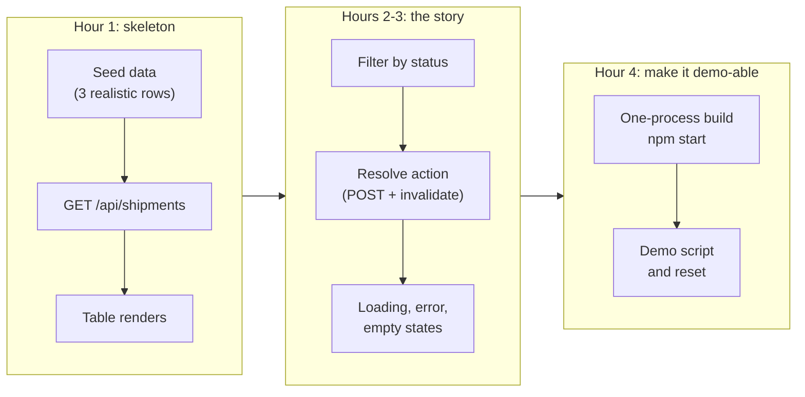
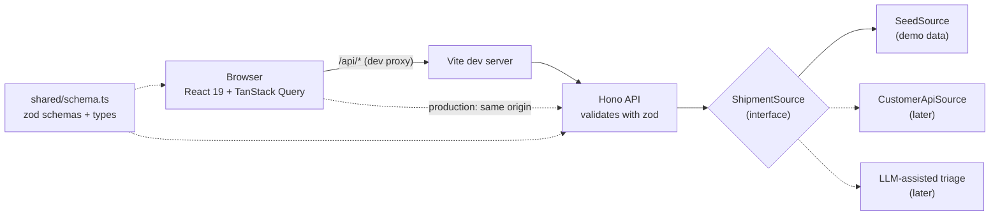

# Rapid Full-Stack Prototyping: TypeScript Service plus React UI for a Demo

!!! abstract "Key takeaways"
    - A demo prototype answers **one question for one user**: "Can an operations lead triage shipment exceptions in one screen?" Scope to **one workflow, one decision, one screen**; everything else is out.
    - Build a **walking skeleton** first: UI → API → data, end to end, ugly but working, within the first hour. Then deepen the parts the demo story needs.
    - Keep the stack boring and typed: **Vite + React 19 + TypeScript**, a small **Node API (Hono or Express)**, and a **shared zod schema** used by both sides so the contract can't drift. **TanStack Query** handles fetching, caching and invalidation.
    - Put a **seam** in front of data (`ShipmentSource`): seed data today, the customer's API tomorrow, an LLM call next week. Be **honest in the demo** about what's real and what's stubbed.
    - Show **real states** (loading, error, empty, saving), validate input on the server, keep **secrets out of the browser** (anything in a Vite client bundle is public), and serve UI and API from **one process** so the demo runs anywhere with `npm start`.

## Why it matters

FDEs demo constantly: to win a pilot, to show progress to an executive sponsor, to get feedback from the people who'll use the tool. Several interview formats test the same skill: take-homes that end in a presentation, practical rounds with a "now show it in a page" stage, and customer simulations where you're asked what you'd build first. A working prototype in the customer's language beats a slide deck, and the ability to produce one in hours is part of what makes the role valuable.

Prototypes fail in recognisable ways:

| Failure | What the audience sees |
|---|---|
| Built breadth, not one flow | Six half-working screens, none of which tells the story |
| Backend first, UI on the last day | No demo until it's too late to get feedback |
| Hard-coded data in components | Can't switch to real data without a rewrite |
| No loading or error states | The demo freezes on slow Wi-Fi and nobody knows why |
| Types differ between client and server | "undefined" in the UI during the executive demo |
| API key in the frontend | A security reviewer stops the pilot |

The [executive vs engineer demos page](../fde-customer-discovery/05-talking-to-executives-vs-engineers-demos-executive-pitch-sta.md) covers *how* to present; the [pilot page](../fde-customer-discovery/03-pilot-to-proof-of-concept-to-production-time-boxing-exit-cri.md) covers what happens after. This page covers how to *build* the thing quickly and credibly.

## Core concepts

### Scope: one user, one workflow, one decision

Before writing code, write three lines (they double as the demo opening):

1. **User:** "Operations lead at a logistics customer."
2. **Workflow:** "Each morning, review shipment exceptions and resolve or escalate them."
3. **Decision the tool supports:** "Which exceptions need action today, and what action?"

Everything that doesn't serve those lines is out of scope for the demo: auth, user management, settings pages, export, mobile layout. List them as "next steps" instead; that list is also useful in the demo. The decomposition topic has the method for getting to these lines from a vague brief ([decomposing into an MVP](../fde-decomposition-scoping/03-decomposing-into-a-working-extensible-mvp-in-a-live-pairing.md)).

### Walking skeleton first

A walking skeleton is the thinnest end-to-end slice that runs: one screen calls one endpoint that reads one data source and shows a result. It proves the plumbing (build, proxy, types, deployment) before you invest in features.


*Notice that the skeleton is end to end before any feature work starts, and the last hour is reserved for making it demo-able, not for one more feature.*

### Choosing the stack

| Option | Strengths | Weaknesses | Pick when |
|---|---|---|---|
| Vite + React + small Node API (Hono/Express) | Fast dev loop, one language, shared types | Two processes in dev (proxy fixes it) | Default for a TS demo |
| Next.js (full stack) | One framework for UI and API routes, easy hosting | More concepts (server/client components, caching) | Team already uses Next; see [Next.js](../nextjs-ssr/index.md) |
| FastAPI + React | Python for data/AI logic, OpenAPI docs | Two languages; types need generating | Heavy Python or ML backend |
| Spring Boot + React | Matches Java enterprise customers | Slower to scaffold for a one-day demo | Customer is a Java shop; demo will evolve into their codebase |
| Low-code / notebook | Fastest for data exploration | Hard to evolve; looks less like a product | Internal analysis, not a product demo |

Whatever you pick, use what you're fastest in **and** what the customer's team can pick up after you. A prototype that the customer's engineers can't read becomes a liability.

### The shape of the code


*Notice the two dotted dependencies on the shared schema: client and server import the same zod definitions, so a field rename breaks the type check instead of the demo. The `ShipmentSource` seam is where real data and AI features plug in later.*

Four design choices carry most of the value:

1. **Shared schema (zod):** define request and response shapes once; infer TypeScript types from them; validate on the server and parse responses on the client.
2. **Data-source seam:** an interface with a seed implementation. Swapping to the customer's API is one class, not a rewrite.
3. **Server state in TanStack Query:** query keys include filters, mutations invalidate queries, and loading/error states come for free. See [state management](../frontend-architecture/03-state-management-redux-toolkit-react-query-tanstack-query-wh.md).
4. **One process in production:** the API serves the built UI as static files; no CORS, one URL, one command.

### Demo hygiene

| Concern | Practice |
|---|---|
| Data | Realistic seed rows in the customer's vocabulary (their carrier names, their statuses); deterministic so the demo is repeatable |
| Reset | A way to restore seed state between runs (restart, or a reset endpoint guarded to non-production) |
| Secrets | Server-side only. Vite exposes only `VITE_`-prefixed variables to client code, and anything in the bundle is public |
| Config | `PORT` and data-source selection from environment variables |
| States | Loading, error, empty and saving states visible; disable buttons while saving |
| Honesty | Label stubbed parts ("sample data", "simulated carrier API") and say so out loud |
| Fallback | A screen recording of the happy path in case the venue's network fails |

## In practice: code & configuration

=== "❌ Common mistake"
    ```tsx
    // Fetch in useEffect, no types, no states, no error handling, key in the bundle.
    function Shipments() {
      const [rows, setRows] = useState<any[]>([]);
      useEffect(() => {
        fetch(`https://carrier.example.com/v1/shipments?key=${import.meta.env.VITE_CARRIER_KEY}`) // public key!
          .then((r) => r.json())          // a 500 page or HTML error still gets parsed as JSON
          .then(setRows);                 // no loading state; races when filters change quickly
      }, []);
      return <table>{rows.map((r) => <tr><td>{r.id}</td></tr>)}</table>;   // missing key prop; any-typed
    }
    ```

=== "✅ Correct approach"
    ```tsx
    function ShipmentTable() {
      const [status, setStatus] = useState<string>("");
      const { data, isPending, isError, error } = useQuery({
        queryKey: ["shipments", status],            // the filter is part of the cache key
        queryFn: () => listShipments(status || undefined),   // our API, which holds any secrets
      });
      // ...renders explicit loading, error, empty and table states (full code below)
    }
    ```

### Layout and scripts

```text
demo/
  shared/schema.ts       zod schemas + inferred types (used by both sides)
  server/source.ts       ShipmentSource interface + SeedSource
  server/app.ts          Hono app factory (testable without a network)
  server/main.ts         entry point: API + static UI in production
  server/app.test.ts     Vitest tests calling app.request()
  web/index.html, web/main.tsx, web/App.tsx, web/api.ts
  vite.config.ts         dev proxy /api -> :8787
  package.json           "type": "module"
```

```json
"scripts": {
  "dev:api": "tsx watch server/main.ts",
  "dev:web": "vite",
  "test": "vitest run --root .",
  "typecheck": "tsc -p .",
  "build": "vite build",
  "start": "NODE_ENV=production tsx server/main.ts"
}
```

### The shared contract

```ts
// shared/schema.ts: one source of truth for API types, used by server AND web.
import { z } from "zod";

export const ShipmentStatus = z.enum(["delayed", "lost", "damaged", "resolved"]);

export const Shipment = z.object({
  id: z.string(),
  customer: z.string(),
  carrier: z.string(),
  status: ShipmentStatus,
  delayHours: z.number().int().nonnegative(),
  note: z.string().optional(),
});
export type Shipment = z.infer<typeof Shipment>;

export const ResolveRequest = z.object({ note: z.string().min(3).max(500) });
export type ResolveRequest = z.infer<typeof ResolveRequest>;
```

### The API: a seam and a testable app factory

```ts
// server/source.ts: the seam. Seed data today, the customer's real API tomorrow.
import type { Shipment } from "../shared/schema.js";

export interface ShipmentSource {
  list(status?: Shipment["status"]): Promise<Shipment[]>;
  resolve(id: string, note: string): Promise<Shipment | undefined>;
}

export class SeedSource implements ShipmentSource {
  constructor(private rows: Shipment[]) {}

  async list(status?: Shipment["status"]) {
    return this.rows.filter((r) => !status || r.status === status);
  }

  async resolve(id: string, note: string) {
    const row = this.rows.find((r) => r.id === id);
    if (!row) return undefined;
    Object.assign(row, { status: "resolved", note });
    return row;
  }
}

export const SEED: Shipment[] = [
  { id: "S-1001", customer: "Acme Pharma", carrier: "FastFreight", status: "delayed", delayHours: 30 },
  { id: "S-1002", customer: "Acme Pharma", carrier: "BlueLine", status: "damaged", delayHours: 0 },
  { id: "S-1003", customer: "Northwind", carrier: "FastFreight", status: "lost", delayHours: 96 },
];
```

```ts
// server/app.ts: Hono app, built by a factory so tests can inject a source.
import { Hono } from "hono";
import { ResolveRequest, ShipmentStatus } from "../shared/schema.js";
import type { ShipmentSource } from "./source.js";

export function buildApp(source: ShipmentSource) {
  const app = new Hono();

  app.get("/api/health", (c) => c.json({ ok: true }));

  app.get("/api/shipments", async (c) => {
    const raw = c.req.query("status");
    const status = raw ? ShipmentStatus.safeParse(raw) : undefined;
    if (status && !status.success) return c.json({ error: `unknown status '${raw}'` }, 400);
    return c.json(await source.list(status?.data));
  });

  app.post("/api/shipments/:id/resolve", async (c) => {
    const body = ResolveRequest.safeParse(await c.req.json().catch(() => null));
    if (!body.success) return c.json({ error: "note must be 3-500 characters" }, 400);
    const updated = await source.resolve(c.req.param("id"), body.data.note);
    return updated ? c.json(updated) : c.json({ error: "not found" }, 404);
  });

  app.onError((err, c) => {
    console.error(err);                                   // demo-grade logging
    return c.json({ error: "internal error" }, 500);
  });
  return app;
}
```

```ts
// server/main.ts: entry point. One process serves the API and, in production, the built UI.
import { serve } from "@hono/node-server";
import { serveStatic } from "@hono/node-server/serve-static";
import { buildApp } from "./app.js";
import { SEED, SeedSource } from "./source.js";

const app = buildApp(new SeedSource(structuredClone(SEED)));
if (process.env.NODE_ENV === "production") {
  app.use("/*", serveStatic({ root: "./dist/web" }));              // built React app
}
const port = Number(process.env.PORT ?? 8787);                      // PORT from env for containers/PaaS
serve({ fetch: app.fetch, port });
console.log(`API on http://localhost:${port}`);
```

Hono's `app.request()` runs a request through the app without opening a port, so API tests are fast:

```ts
import { describe, expect, it } from "vitest";
import { buildApp } from "./app.js";
import { SEED, SeedSource } from "./source.js";

const fresh = () => buildApp(new SeedSource(structuredClone(SEED)));

describe("shipments API", () => {
  it("filters by status", async () => {
    const res = await fresh().request("/api/shipments?status=lost");
    expect(res.status).toBe(200);
    expect((await res.json()).map((s: { id: string }) => s.id)).toEqual(["S-1003"]);
  });

  it("rejects an unknown status with 400", async () => {
    expect((await fresh().request("/api/shipments?status=nope")).status).toBe(400);
  });

  it("resolves a shipment and validates the note", async () => {
    const app = fresh();
    const bad = await app.request("/api/shipments/S-1001/resolve", {
      method: "POST", body: JSON.stringify({ note: "x" }), headers: { "Content-Type": "application/json" },
    });
    expect(bad.status).toBe(400);
    const ok = await app.request("/api/shipments/S-1001/resolve", {
      method: "POST", body: JSON.stringify({ note: "Rebooked on next truck" }),
      headers: { "Content-Type": "application/json" },
    });
    expect((await ok.json()).status).toBe("resolved");
  });
});
```

`structuredClone(SEED)` gives each test (and each server start) its own copy, so a resolved shipment in one test can't leak into another, and restarting the server resets the demo.

### The UI: typed fetch, real states, one mutation

```ts
// web/api.ts: typed fetch helpers. Parse responses with the SAME zod schema the server uses.
import { z } from "zod";
import { Shipment, type ResolveRequest } from "../shared/schema.js";

async function call<T>(path: string, schema: z.ZodType<T>, init?: RequestInit): Promise<T> {
  const res = await fetch(path, { headers: { "Content-Type": "application/json" }, ...init });
  const body = await res.json().catch(() => ({}));
  if (!res.ok) throw new Error(body.error ?? `HTTP ${res.status}`);
  return schema.parse(body);              // fail loudly if the API drifts from the contract
}

export const listShipments = (status?: string) =>
  call(`/api/shipments${status ? `?status=${encodeURIComponent(status)}` : ""}`, z.array(Shipment));

export const resolveShipment = (id: string, req: ResolveRequest) =>
  call(`/api/shipments/${id}/resolve`, Shipment, { method: "POST", body: JSON.stringify(req) });
```

```tsx
// web/App.tsx: one screen, real states (loading, error, empty), one mutation.
import { useState } from "react";
import { QueryClient, QueryClientProvider, useMutation, useQuery, useQueryClient } from "@tanstack/react-query";
import { listShipments, resolveShipment } from "./api.js";
import type { Shipment } from "../shared/schema.js";

const queryClient = new QueryClient({ defaultOptions: { queries: { retry: 1, staleTime: 10_000 } } });

export default function App() {
  return (
    <QueryClientProvider client={queryClient}>
      <main style={{ fontFamily: "system-ui", maxWidth: 900, margin: "2rem auto", padding: "0 1rem" }}>
        <h1>Shipment exceptions</h1>
        <ShipmentTable />
      </main>
    </QueryClientProvider>
  );
}

function ShipmentTable() {
  const [status, setStatus] = useState<string>("");
  const { data, isPending, isError, error } = useQuery({
    queryKey: ["shipments", status],            // the filter is part of the cache key
    queryFn: () => listShipments(status || undefined),
  });

  return (
    <section>
      <label>
        Status{" "}
        <select value={status} onChange={(e) => setStatus(e.target.value)}>
          <option value="">All</option>
          <option value="delayed">Delayed</option>
          <option value="lost">Lost</option>
          <option value="damaged">Damaged</option>
          <option value="resolved">Resolved</option>
        </select>
      </label>
      {isPending && <p>Loading…</p>}
      {isError && <p role="alert">Could not load shipments: {error.message}</p>}
      {data && data.length === 0 && <p>No shipments match this filter.</p>}
      {data && data.length > 0 && (
        <table>
          <thead>
            <tr><th>ID</th><th>Customer</th><th>Carrier</th><th>Status</th><th>Delay (h)</th><th /></tr>
          </thead>
          <tbody>
            {data.map((s) => <Row key={s.id} shipment={s} />)}
          </tbody>
        </table>
      )}
    </section>
  );
}

function Row({ shipment }: { shipment: Shipment }) {
  const qc = useQueryClient();
  const resolve = useMutation({
    mutationFn: (note: string) => resolveShipment(shipment.id, { note }),
    onSuccess: () => qc.invalidateQueries({ queryKey: ["shipments"] }),   // refetch every filter
  });

  return (
    <tr>
      <td>{shipment.id}</td><td>{shipment.customer}</td><td>{shipment.carrier}</td>
      <td>{shipment.status}</td><td>{shipment.delayHours}</td>
      <td>
        {shipment.status !== "resolved" && (
          <button disabled={resolve.isPending} onClick={() => resolve.mutate("Rebooked with carrier")}>
            {resolve.isPending ? "Saving…" : "Resolve"}
          </button>
        )}
        {resolve.isError && <span role="alert"> {resolve.error.message}</span>}
      </td>
    </tr>
  );
}
```

```ts
// vite.config.ts: dev server proxies /api to the Node API, so the browser sees one origin (no CORS).
import { defineConfig } from "vite";
import react from "@vitejs/plugin-react";

export default defineConfig({
  plugins: [react()],
  root: "web",
  server: { proxy: { "/api": "http://localhost:8787" } },
  build: { outDir: "../dist/web", emptyOutDir: true },
});
```

All of this was run: four Vitest API tests pass, `tsc` type-checks server, shared and web code in strict mode, `vite build` produces the bundle, and `npm start` serves the UI and API from one port (verified with React 19, Vite 8, Hono 4, zod 4, TanStack Query 5 and Node 22; nothing here depends on the newest versions). Points to make while building:

- "The query key includes the filter, so switching filters caches each result and back-navigation is instant."
- "After a resolve, I invalidate all `shipments` queries, because the item may move between filters."
- "The client parses responses with the same schema. If someone renames a field on the server, the type check fails before the demo does."
- "The `ShipmentSource` interface is where the customer's carrier API plugs in. For the pilot, I'd write `CarrierApiSource` with the retry and pagination rules from the [API integration page](02-third-party-api-integration-auth-pagination-rate-limits-retr.md)."

### From prototype to pilot: what changes

| Prototype | Pilot | Production |
|---|---|---|
| Seed data in memory | Real read-only data via the seam | Real reads and writes, with audit |
| No auth | Customer SSO (OIDC) in front | Roles, object-level authorisation |
| `console.error` | Structured logs, error tracking | SLOs, alerts, dashboards |
| One process, `tsx` | Container, CI build, environment config | Hardened image, IaC, rollbacks |
| Manual demo reset | Test data per environment | Data retention and privacy controls |

### Practice: a half-day prototype brief

Give yourself four hours, then present for ten minutes to a friend playing an operations director.

```text
Brief: A regional clinic network wants to reduce missed follow-up appointments.
User:  front-desk coordinator. Workflow: each morning, see patients due for follow-up this week
       who haven't booked, and log an outreach attempt (called / texted / no answer).
Data:  seed 15 realistic patients (fake names), appointment history, outreach log.
Must:  one screen; filter by clinic; "log outreach" action with validation; states for
       loading, error, empty; API tests; one-command start.
Stretch: "priority" column computed server-side (days overdue x risk flag), with the rule
       explained in the UI; a CSV export.
Present: user + workflow + decision (30 s), live demo, what's real vs stubbed,
       three next steps for a pilot, and the risks (PHI handling, SSO, data access).
```

## Real-world usage

- **FDE pilots** often start exactly like this: a single-workflow tool on seed or exported data, shown to users in week one, then wired to real systems behind the seam. Early user feedback on a working screen saves weeks of building the wrong thing.
- **AI features** slot in behind the same seam: an LLM-suggested resolution note, a classification of exception type, or a summary. The UI and contract stay the same; the source gets smarter. Evaluation and guardrails for those features belong to the [applied LLM topic](../fde-applied-llm/index.md).
- **Healthcare and banking demos** must avoid real personal data. Use synthetic seed data, say so on screen, and mention data-handling plans before anyone asks.
- **Handover:** customers often keep prototypes running longer than intended. A typed contract, tests, a README and a clean seam are what make that survivable.

## Trade-offs & production gotchas

| Choice | Pros | Cons | Use when |
|---|---|---|---|
| Shared zod schema | One contract, runtime validation both sides | Extra dependency; schema discipline | Any TS full-stack demo |
| OpenAPI-generated client | Works across languages | Generation step | Python or Java backend |
| TanStack Query | Caching, states, invalidation built in | Another library to learn | Any server data in React |
| `useEffect` + `fetch` | No dependencies | Races, no cache, manual states | Truly one-off fetches |
| Component library (MUI, shadcn/ui) | Looks finished quickly | Bundle size, styling lock-in | Executive-facing demos |
| Plain HTML table + system font | Zero setup | Looks rough | Engineering audiences, early skeletons |
| One-process deploy | One URL, no CORS | Couples UI and API releases | Demos and pilots |

!!! warning "Gotchas"
    - **Secrets in the client bundle.** Vite inlines `import.meta.env.VITE_*` values into the JavaScript the browser downloads. Third-party API keys belong on the server; the browser talks only to your API.
    - **Demo data that's too clean.** Real data has nulls, long names and odd statuses. Include a couple of messy rows so the UI doesn't break in front of the customer when real data arrives.
    - **Mutable seed data** shared across tests or requests leaks state. Clone per server start and per test.
    - **Network dependency at the venue.** Run locally, cache fonts and assets, and keep a recording as a fallback.
    - **Over-polishing.** An extra hour on CSS rarely changes the decision; an extra hour on the workflow often does.
    - **Calling it production-ready.** Say what a pilot needs (SSO, real data access, logging, security review) so expectations stay honest.

!!! question "Interview angle"
    In a take-home presentation or a "show it in a page" stage, expect: "What would you change to put this in front of 500 users?" Strong answers walk the prototype → pilot → production table: auth via the customer's SSO, real data through the seam with retries and rate limits, structured logging and alerts, a container and CI pipeline, and a data-privacy review.

## How this connects to my experience

- **Where I used it:** "Built the ReactJS application from the ground up and established a micro-frontend architecture" (OptumRx Meteor, Publicis Sapient), with ReactJS, Redux, React Query, Material UI and Storybook in my skills, TypeScript among my languages, and the "GraphQL Consumer Service" as the backend integration layer.
- **Talking points:**
    - Building a React app from scratch means I've made the scaffolding decisions (build tool, state management, data fetching, component library) that a fast prototype needs; in a demo I make them in minutes. *[confirm: the build tool and the TypeScript usage on the OptumRx app]*
    - React Query in production: query keys, invalidation after mutations, and loading/error states are the same patterns as this page. *[confirm: whether you used React Query with GraphQL, and how cache invalidation worked]*
    - Material UI and Storybook: a component library and a component catalogue make demo screens look finished quickly and let stakeholders review components in isolation. *[confirm: whether Storybook was used for stakeholder reviews]*
    - Micro-frontends are the opposite of a prototype; knowing when *not* to use them (one team, one workflow, a demo) is itself a good answer.
- **Likely follow-up chain:** "Tell me about the React app you built from the ground up." → "If you had one day to build a demo for a new customer, what would you do differently?" → "How would you take that demo to production?" Answer with the OptumRx architecture decisions, then the one-workflow walking-skeleton approach on this page (shared schema, seam, TanStack Query, one process), then the prototype → pilot → production table.

## Interview questions

### Fundamentals

??? question "Q1. What is a walking skeleton and why build it first?"
    **Answer:** The thinnest end-to-end slice that runs: one screen, one endpoint, one data source, deployed or runnable with one command. It proves the plumbing (build, proxy, types, hosting) early, gives something to show within an hour, and makes every later feature an increment on a working system.

    **Interviewer listens for:** end to end early, before depth.

    **Common wrong answer:** "Build the backend completely, then the UI."

??? question "Q2. How do you scope a demo prototype?"
    **Answer:** One user, one workflow, one decision the tool supports, written down before coding. Everything else (auth, settings, export, extra screens) goes on a "next steps" list. The demo's job is to test whether the workflow is valuable, not to be complete.

    **Interviewer listens for:** a ruthless scope tied to a user decision.

    **Common wrong answer:** "Build as many features as possible to impress."

??? question "Q3. Why share a schema between client and server?"
    **Answer:** So the contract has one definition: TypeScript types are inferred from it on both sides, the server validates input with it, and the client can validate responses. A rename or type change breaks compilation rather than the live demo. zod does this in TypeScript; with a Python or Java backend, generate a client from OpenAPI.

    **Interviewer listens for:** single source of truth plus runtime validation.

    **Common wrong answer:** "Copy the interfaces into both projects."

??? question "Q4. What does TanStack Query give you over `useEffect` + `fetch`?"
    **Answer:** Caching keyed by query key (including filters), request deduplication, loading and error states, retries, background refetching, and invalidation after mutations. With `useEffect`, you hand-roll all of that and usually get races (an older response overwriting a newer one) and missing states.

    **Interviewer listens for:** query keys, invalidation, races avoided.

    **Common wrong answer:** "It's just a fetch wrapper."

### Intermediate

??? question "Q5. How do you keep API keys out of a React prototype?"
    **Answer:** Never put third-party keys in client code. Vite exposes `VITE_`-prefixed variables to the bundle, so anything there is public. The browser calls my own API, which holds secrets in server-side environment variables (or a secret manager) and calls the third party.

    **Interviewer listens for:** client bundles are public; a server-side proxy.

    **Common wrong answer:** "Use an environment variable", without noting it's bundled.

??? question "Q6. Why put a data-source interface in a prototype?"
    **Answer:** It lets the demo run on seed data while making the switch to the customer's API (or an AI-assisted source) a single new implementation. It also makes the API testable with a fake source and keeps the prototype honest: you can say exactly what's stubbed.

    **Interviewer listens for:** a seam for evolution and testing.

    **Common wrong answer:** "Over-engineering for a demo."

??? question "Q7. How do you avoid CORS problems in development and production?"
    **Answer:** In development, the Vite dev server proxies `/api` to the API server, so the browser sees one origin. In production, the API serves the built static files, so UI and API share an origin. If they must be separate, configure CORS on the API for the specific UI origin, not `*` with credentials.

    **Interviewer listens for:** same-origin by design.

    **Common wrong answer:** "Set `Access-Control-Allow-Origin: *`."

??? question "Q8. Which UI states must a demo screen handle?"
    **Answer:** Loading, error (with a readable message), empty ("no shipments match"), success, and in-progress for mutations (disable the button, show "Saving…"), plus a mutation error. These are what keep a demo credible on slow or flaky networks.

    **Interviewer listens for:** empty and mutation states, not just loading.

    **Common wrong answer:** "A spinner."

### Senior

??? question "Q9. How do you decide between Next.js, Vite + Node, and a Python backend for a customer demo?"
    **Answer:** By who will own it next and where the logic lives. Vite + a small Node API is fastest for a TypeScript team. Next.js if the customer already uses it or SEO and server rendering matter. FastAPI + React if the core logic is Python data or ML. Spring Boot + React if it will grow inside a Java enterprise codebase. I'd pick what I'm fastest in among the options the customer can maintain.

    **Interviewer listens for:** ownership and handover, not hype.

    **Common wrong answer:** "Always Next.js."

??? question "Q10. What changes between a prototype and a pilot?"
    **Answer:** Real data via the seam (with retries, rate limits, error handling), customer SSO in front, structured logging and error tracking, a container and CI build, environment-based config, synthetic data replaced by controlled real data with privacy review, and agreed success metrics. The UI and contract often survive; the plumbing hardens.

    **Interviewer listens for:** a concrete hardening list tied to customer constraints.

    **Common wrong answer:** "Add tests and deploy it."

??? question "Q11. How would you add an LLM-powered feature to this prototype safely?"
    **Answer:** Behind the source or a separate service on the server: call the model with the API key server-side, validate and constrain its output with a schema, show it as a suggestion the user accepts or edits, log inputs and outputs for evaluation (without sensitive data where possible), and set timeouts and fallbacks. Evaluate on a small labelled set before demoing it as reliable.

    **Interviewer listens for:** server-side, schema-validated, human in the loop, evaluated.

    **Common wrong answer:** "Call the model from the browser."

### Scenario-based

??? question "Q12. The demo is tomorrow and the customer's API access hasn't come through. What do you do?"
    **Answer:** Build against a realistic stub behind the seam, shaped from their docs or sample payloads (including messy cases), label it clearly as simulated in the demo, and show the plan and effort to connect real data. Don't fake it as live. Use the demo to unblock access ("here's what we can show once we're connected").

    **Interviewer listens for:** honesty plus momentum.

    **Common wrong answer:** "Postpone the demo" or "pretend it's live".

??? question "Q13. During the demo, the executive asks for a feature you haven't built. How do you respond?"
    **Answer:** Acknowledge it, ask what decision it would help them make, note it visibly, and explain where it would fit (often "behind this same screen, a new column"). Don't build live unless it's trivial and safe. Follow up with a scoped estimate. The demo's purpose is learning what matters.

    **Interviewer listens for:** discovery over instant promises.

    **Common wrong answer:** "Yes, we can have it by Friday."

??? question "Q14. A month later, the prototype is still running and people rely on it. What do you do?"
    **Answer:** Treat it as a production system or retire it deliberately: add auth, monitoring, backups and an owner, or migrate users to the real build with a date. Make the risk visible to the sponsor. Unowned prototypes in daily use are a common source of incidents and security findings.

    **Interviewer listens for:** ownership and explicit decisions.

    **Common wrong answer:** "It's fine as long as it works."

??? question "Q15. In a practical round, you're asked to "put a quick UI on" your API in 20 minutes. What do you build?"
    **Answer:** One component that calls the existing endpoint, renders a table, and handles loading, error and empty states, plus one action if time allows. Plain HTML elements, no styling framework, the typed fetch helper, and a minute at the end to say what I'd add next (filters, optimistic updates, tests with React Testing Library and MSW; see [testing React](../react/10-testing-react.md)).

    **Interviewer listens for:** a minimal, correct slice and stated next steps.

    **Common wrong answer:** installing a component library and running out of time.

## Cheat sheet

| Concept | Remember |
|---|---|
| Scope | One user, one workflow, one decision; everything else is "next steps" |
| Order | Walking skeleton (hour 1) → story → demo-able (reserve the last hour) |
| Stack | Vite + React 19 + TS; Hono/Express on Node LTS; or match the customer |
| Contract | Shared zod schema; infer types; validate on server, parse on client |
| Data | `Source` interface; seed now, real API or LLM later; clone seed per start |
| Fetching | TanStack Query: key includes filters; invalidate after mutations |
| States | Loading, error, empty, saving, mutation error |
| Secrets | Server only; `VITE_*` values are public |
| Deploy | API serves built UI; one origin; `npm start`; `PORT` from env |
| Demo | Say what's real vs stubbed; keep a recording; next steps list |

## Sources
1. [Vite docs: Server options, `server.proxy`](https://vite.dev/config/server-options.html#server-proxy): dev proxy configuration.
2. [Vite docs: Env variables and modes](https://vite.dev/guide/env-and-mode.html): only `VITE_`-prefixed variables are exposed to client code.
3. [React docs](https://react.dev/): React 19, components and hooks.
4. [TanStack Query docs: Query keys](https://tanstack.com/query/latest/docs/framework/react/guides/query-keys) and [Query invalidation](https://tanstack.com/query/latest/docs/framework/react/guides/query-invalidation): cache keys and invalidation after mutations.
5. [zod docs](https://zod.dev/): schemas, `safeParse`, `z.infer`.
6. [Hono docs: Testing](https://hono.dev/docs/guides/testing) and [Node.js adapter](https://hono.dev/docs/getting-started/nodejs): `app.request()`, `@hono/node-server`, `serveStatic`.
7. [Vitest docs](https://vitest.dev/): test runner used for the API tests.
8. [Node.js release schedule](https://nodejs.org/en/about/previous-releases): LTS lines.
9. Alistair Cockburn, "Walking Skeleton" (as described in *Growing Object-Oriented Software, Guided by Tests*, Freeman and Pryce): thinnest end-to-end implementation first.
10. [MDN: Cross-Origin Resource Sharing (CORS)](https://developer.mozilla.org/en-US/docs/Web/HTTP/Guides/CORS): why same-origin serving avoids CORS configuration.
