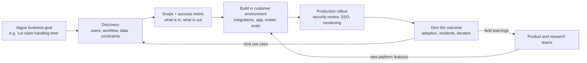
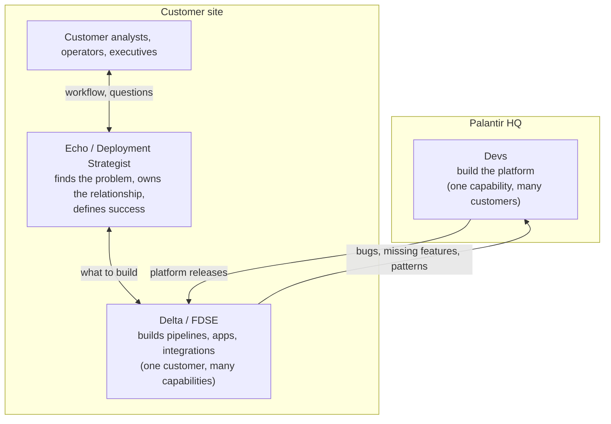
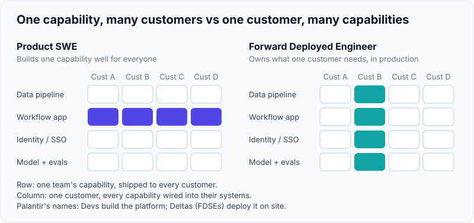
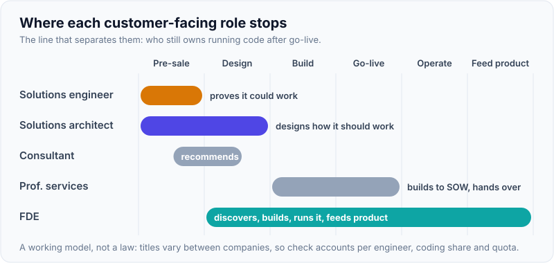
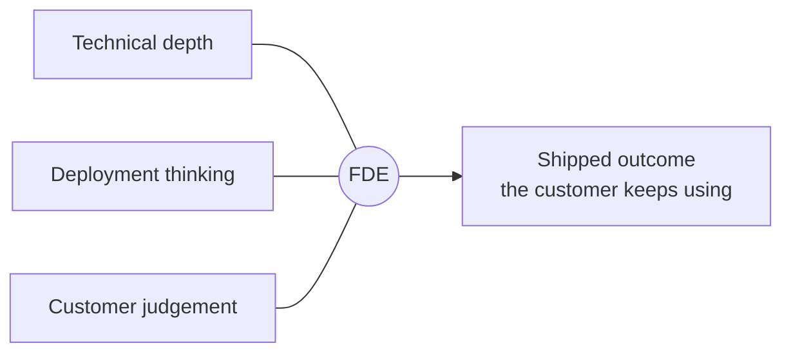

# What an FDE Is: Palantir Origins (Echo/Delta), FDE vs SWE vs Solutions Engineer vs Consultant

!!! abstract "Key takeaways"
    - A **Forward Deployed Engineer (FDE)** is a software engineer who **embeds with one or a few customers** and owns the path from a vague business problem to **working software in production inside the customer's environment**, then feeds what they learn back to the product team.
    - The model comes from **Palantir**. Its engineers who build the platform are "**Devs**"; the forward deployed software engineers are "**Deltas**" (named after the NATO-alphabet team names of Palantir's early business development group); the more product/strategy-leaning deployment strategists are "**Echos**". Shyam Sankar (employee #13, joined 2006, now CTO) is credited with creating the model.
    - Short form: a product SWE works on **one capability for many customers**; an FDE works on **many capabilities for one customer**.
    - The cleanest line between the customer-facing roles is **who owns running code**: a solutions engineer proves the product *could* work (pre-sale), a solutions architect designs it, a consultant recommends what to do, and an **FDE ships it and is accountable when it breaks**.
    - Titles are inconsistent across companies. Judge a role by the job description: number of accounts, how much of the week is coding, whether there's a sales quota, travel, and whether you own production.

## Why it matters

Every FDE loop starts with some version of "What do you think an FDE does?" or "Why this role and not a normal engineering job?". A vague answer ("it's like a solutions engineer who codes more") is a weak signal: it suggests you'll either drift into advisory work or retreat into backlog tickets. A precise answer shows you know what you're signing up for: ambiguity, customers, travel, and production ownership.

The role also matters because it is now one of the fastest-growing engineering titles. The Financial Times, using Indeed data, reported FDE postings up roughly **800% between January and September 2025**; later coverage based on Indeed data put April 2026 postings at about **5,330, up from 643 a year earlier** (both are posting counts from a low base, so read them as direction, not size). In 2025–26 OpenAI, Anthropic, Google Cloud, Databricks, Scale AI and Cognition all built FDE teams, and IT services firms followed: in July 2026 TCS said it plans up to 8,900 forward deployed engineers (1–1.5% of its workforce). The AI-lab side is covered in [The AI-lab FDE model](02-the-ai-lab-fde-model-openai-anthropic-google-databricks-scal.md).

The reason the model exists is the same in 2008 and 2026: a powerful general platform (Palantir Gotham/Foundry then, a frontier LLM now) doesn't create value until someone connects it to messy customer data, legacy systems, security rules and real workflows. That "last mile" is engineering work, and it can't be done well from headquarters.

## Core concepts

### The definition, precisely

An FDE:

1. **Embeds with a customer** (on site or deeply remote), usually one to three accounts at a time.
2. **Discovers the real problem**, which is rarely the one first requested.
3. **Scopes and designs** a solution that fits the customer's data, systems, identity and security constraints.
4. **Builds and ships production code**, often inside the customer's cloud account, VPC or on-prem environment.
5. **Owns the outcome** after go-live: adoption, incidents, iteration.
6. **Feeds patterns back** to product and research so the next customer needs less custom work.

The last point separates an FDE from a professional-services engineer. PostHog's FDE handbook puts it directly: unlike professional services, "every engagement compounds", because patterns seen across customers become reusable artifacts, skills and product improvements. OpenAI's Global Head of FDE, Colin Jarvis, has said the team's job is to help customers "build the capabilities so that they can build the next use cases themselves", not to create dependency.


*Notice the two loops: the outcome loop back to discovery (the next use case at the same customer) and the product loop back to the platform. A consultant stops at "Scope"; a solutions engineer stops at a demo before "Build"; the FDE goes all the way round.*

### Palantir origins: Devs, Deltas and Echos

Palantir was founded in 2003 to build data-integration software for intelligence and defence customers. Its software was powerful but generic, and early customers (analysts in government agencies) needed it adapted to their data and missions. Palantir's answer was to send engineers into the field.

- **Shyam Sankar** joined in 2006 as employee #13. His official US House biography says he "envisaged the role of the Forward Deployed Engineer"; profiles describe him working on-site with US military users, adapting the software in place. Some sources say he coined the term; treat "invented the title" as reported rather than documented.
- **Deltas (Forward Deployed Software Engineers, FDSEs).** Palantir's own blog post *Dev versus Delta* says the two biggest engineering roles by headcount are Devs and Deltas, and that the name "Delta" dates from the early days, when each business-development team was named after a letter of the NATO alphabet.
- **Devs (Software Engineers)** build and own components of the platforms (Gotham, Foundry, later AIP) for all customers.
- **Echos (Deployment Strategists).** Palantir's blog *A Day in the Life of a Palantir Deployment Strategist* says the role is known internally as "Echo" and works alongside Deltas. In theory Echos are closer to product managers and Deltas are more technical; the post says that in practice both are a mix of product manager, engineer and strategist. Echos go on site, find the questions customer analysts need answered, identify datasets, run training, and present results up to the C-suite.


*Notice that the Delta is the bridge in both directions: towards the customer through the Echo, and towards the platform through the Devs. AI-lab FDE roles usually merge the Echo and Delta jobs into one person.*

{ loading=lazy }
*Read the row as Devs and the column as Deltas: same matrix, opposite cut.*

**Why this matters for you:** most AI-lab FDE postings describe a combined Echo + Delta: you do discovery and stakeholder work *and* write the production code. Palantir still separates the titles. When you read a job description, work out which half it leans to.

### The Palantir job description, in its own words

Palantir's FDSE postings (on its Lever job board) describe the role as being like a **startup CTO**: small teams, minimal supervision, end-to-end ownership of "high stakes projects", and work that can start from an open question such as "Why are we delaying so many flights?". A typical day mixes architecture discussions, large-scale data work, building custom web apps and talking to customer executives. Travel of roughly 25–50% is common in postings; deployment strategist postings mention 25–75%.

### FDE vs the neighbouring roles

| Dimension | Product SWE | **FDE** | Solutions engineer (SE) / sales engineer | Solutions architect (SA) | Consultant (strategy/IT) | Professional-services engineer |
|---|---|---|---|---|---|---|
| Core question | How do we build this capability well for everyone? | **Is it working in production for this customer?** | Can the product work for them? | What is the right design? | What should they do? | Can we deliver this statement of work? |
| Timing | Continuous | **Post-sale, through rollout and beyond** | Pre-sale | Pre-sale to early delivery | Advisory, any stage | Post-sale, fixed scope |
| Accounts | All (indirectly) | **1–3, deep** | Many | Several | One per engagement | One per SOW |
| Coding | Most of the week | **A lot, production grade** | Demos, PoCs | Light, reference code | Little or none | A lot, to spec |
| Owns running code? | Yes (platform) | **Yes (customer deployment)** | No | Usually hands off | No | Until handover |
| Comp shape | Salary + equity | Salary + equity, **usually no quota** | Often OTE / quota | Often OTE / variable | Salary + bonus | Salary, billable utilisation |
| Feeds product? | It *is* product | **Yes, by design** | Some | Some | No | Rarely |
| Typical failure | Builds the wrong thing for real users | Becomes a free consultancy, or builds one-off code that can't be maintained | Overpromises in the demo | Designs without owning the build | Recommendations never implemented | Scope disputes |

Sources disagree at the edges (some SAs code a lot; some "FDE" jobs are really SE jobs), so the table is a working model, not a law. One useful test from a practitioner write-up: **an FDE covering fifteen accounts is really a solutions engineer**. Another from an Accenture FDE posting: "This is not a support role and it is not an advisory role. FDEs are senior technical practitioners who own outcomes end-to-end."

{ loading=lazy }
*Watch where each bar ends: only the FDE's runs past go-live.*

### What FDEs are evaluated on

From job descriptions and prep guides (details in [The FDE interview loop mapped](03-the-fde-interview-loop-mapped-screens-take-home-practical-co.md)), three things carry roughly equal weight:

1. **Technical depth**: can you build real, production-grade software fast, in an unfamiliar environment?
2. **Deployment thinking**: identity, networks, data access, security review, rollout, monitoring, what happens when it's wrong.
3. **Customer judgement and communication**: discovery, saying no, explaining trade-offs to non-engineers, keeping trust when things slip.


*Notice that the output is a used outcome, not code or a slide deck. Interviewers look for all three legs; a strong engineer who can't run a discovery conversation fails just as surely as a good communicator who can't ship.*

## In practice: describing the role in an interview

The question "What does an FDE do, in your own words?" comes up in recruiter screens and hiring-manager rounds. Here's a weak answer and a strong one.

=== "❌ Common mistake"
    ```text
    "An FDE is basically a solutions engineer who codes more. You go to the customer,
    understand their requirements, and build a POC with the product so they buy it.
    I like talking to clients, so it's a good fit."
    - Confuses FDE with pre-sale SE work (demo to close a deal).
    - "Requirements" suggests you expect a spec; FDEs are judged on discovering the real problem.
    - No production ownership, no feedback loop to product, no mention of constraints.
    ```

=== "✅ Correct approach"
    ```text
    "An FDE embeds with one or a few strategic customers and owns getting the product
    into production in their environment: discovery, scoping, building the integrations
    and application, rolling it out through their security and identity setup, and owning
    the outcome after go-live. The difference from a solutions engineer is ownership of
    running code after the sale; the difference from a consultant is that I build and run
    what I recommend. The other half of the job is bringing patterns back to the product
    team, so each deployment makes the next one cheaper.
    That's close to what I already do as the owner of an integration service in front of
    five upstream systems; the gap I'm closing is doing it directly with the customer."
    ```

### A job-description checklist

Use this when you read a posting (or ask the recruiter) to see what kind of role it really is.

```yaml
role_reality_check:
  accounts_per_engineer: "1-3 = true FDE; 10+ = solutions engineer in disguise"
  coding_share: "ask: what fraction of a typical week is writing code that ships?"
  ownership_after_go_live: "who is paged when the deployment breaks?"
  sales_quota_or_OTE: "quota or OTE = sales-aligned role (SE/SA)"
  feedback_loop: "how do field learnings reach product/research? examples?"
  environment: "hosted API only, or customer VPC / on-prem / air-gapped?"
  travel: "percentage, domestic or international, notice period"
  team_shape: "paired with a deployment strategist / account exec, or solo?"
  success_metric: "how is an FDE's performance measured? (adoption, revenue, use cases shipped)"
```

## Real-world usage

- **Palantir** runs FDSEs (Deltas) and Deployment Strategists (Echos) across commercial and government accounts. Its postings stress "multiple pathways to success rather than traditional career ladders" and progression "based purely on merit and impact".
- **AI labs** (OpenAI, Anthropic, Google Cloud, Databricks, Scale AI, Cognition) adopted the model in 2024–26 to get frontier models from pilot into production. Anthropic's postings place FDEs in its **Applied AI** team and list deliverables such as **MCP servers, sub-agents and agent skills**. OpenAI went further in May 2026 and launched the **OpenAI Deployment Company**, a separate business built around FDEs. See [The AI-lab FDE model](02-the-ai-lab-fde-model-openai-anthropic-google-databricks-scal.md).
- **Product companies outside AI** use it too. PostHog's FDE team works in the customer's codebase on migration, instrumentation, dashboards and experiments, or teaches the customer's team to be self-sufficient without touching code.
- **IT services and consulting firms** are rebadging and building FDE practices: Accenture and Deloitte post FDE roles (including Palantir-focused ones), and TCS announced plans for up to 8,900 FDEs in July 2026. Be careful: some of these are consulting roles with a new title (see [Positioning a consulting background](04-positioning-a-consulting-and-services-background-for-fde.md)).
- **Domains:** healthcare (claims, prior authorisation, clinical documentation), banking (KYC, fraud, customer service) and government/defence are heavy FDE users because the data is sensitive, systems are old, and generic SaaS rarely fits as-is.

**Known failure modes** of the model:

- **Bespoke-code trap:** every deployment is custom, nothing goes back to product, margins look like a consultancy's.
- **Hero dependency:** the customer depends on one FDE; when they leave, the deployment decays.
- **Sales capture:** FDEs end up doing pre-sale demos full time.
- **Burnout:** travel, context-switching and on-call for customer systems.

## Trade-offs & production gotchas

| Option | Pros | Cons | Use when |
|---|---|---|---|
| Combined FDE (Echo + Delta in one person, AI-lab style) | One owner from discovery to production; fast | Needs rare all-round people; easy to overload | Engagements are small to medium; product is mature enough to configure |
| Split roles (Palantir Echo + Delta) | Specialisation; strategist manages stakeholders while engineer builds | Coordination cost; risk of "throw it over the wall" | Large, multi-year, multi-stakeholder deployments |
| Solutions engineer + professional services | Clear handoffs; scales sales | Discovery knowledge lost at handoff; no product feedback | Product is mostly self-serve; integrations are standard |
| Partner / system integrator delivery | Scales without headcount | Quality varies; vendor loses field insight | Long tail of customers; well-documented patterns |

!!! warning "Gotcha: the title doesn't tell you the job"
    "FDE" now appears on roles that are pre-sale demos, support escalation or staff augmentation. In the recruiter screen, ask how many accounts an FDE carries, what share of time is coding, who owns production, and whether there's a quota. Interviewers respect the question: it shows you understand the role.

!!! tip "One-line definitions to memorise"
    - **SWE:** one capability, many customers.
    - **FDE:** one customer, many capabilities, and owns it in production.
    - **SE:** proves it *could* work, before the sale.
    - **SA:** designs how it *should* work.
    - **Consultant:** recommends what to do.

## How this connects to my experience

- **Where I used it:** not an FDE title, but several resume bullets are FDE-shaped:
    - **OptumRx Meteor (Publicis Sapient):** owned the GraphQL Consumer Service end to end as the integration layer between **5 upstream systems** and multiple downstream consumers; collaborated with architects on "data integration patterns"; stakeholder communication, release management and production support. That's "integrate messy systems of record and own it in production".
    - **CipherTrust CCKM (Coriolis):** key management across AWS, Azure and GCP with HSM integrations (Thales Luna, SafeNet). That's deployment-environment depth: customer cloud accounts, security boundaries.
    - **Deloitte ConvergeHealth:** secure data discovery on AWS with IAM, KMS and Secrets Manager; Terraform automation.
- **Talking points:**
    - "I've worked on the customer side of the boundary for years as a services engineer; I want the version of that job where I also own the product feedback loop." (Expanded in [Positioning a consulting background](04-positioning-a-consulting-and-services-background-for-fde.md).)
    - Use the "one capability, many customers / one customer, many capabilities" line, then map your integration-layer ownership onto it.
    - Be honest about the gap: no production LLM deployment on the resume yet *[confirm any GenAI work, PoC or side project]*. Point to the prep in [Applied LLM engineering for deployments](../fde-applied-llm/index.md).
- **Likely follow-up chain:** "What's an FDE?" → "How is that different from what you do at Publicis Sapient?" → "Where did you own a customer outcome, not just a ticket?" → "What did you feed back to the product or platform?". Answer the last two with the GraphQL integration layer story: the upstream constraints you discovered, the decisions you owned, and any standards or reusable patterns you pushed back into the platform or team *[confirm specifics]*.

## Interview questions

### Fundamentals

??? question "Q1. In your own words, what does a Forward Deployed Engineer do?"
    **Answer:** An FDE embeds with one or a few strategic customers and owns getting the product to work in production in their environment: discovery, scoping, design, building integrations and applications, rollout through security and identity, and the outcome after go-live. The second half of the job is feeding field learnings back to product and research so each deployment makes the next one cheaper.

    **Interviewer listens for:** production ownership, customer environment, the product feedback loop, and ambiguity.

    **Common wrong answer:** "A solutions engineer who codes" or "a consultant who builds POCs".

??? question "Q2. Where does the FDE model come from?"
    **Answer:** Palantir, in the late 2000s. Its platforms were powerful but generic, and early government customers needed them adapted to their own data and missions, so Palantir sent engineers into the field. Shyam Sankar, employee #13 (joined 2006), is credited with creating the model. Internally, platform engineers are "Devs", forward deployed software engineers are "Deltas" (from the NATO-alphabet names of early business-development teams), and deployment strategists are "Echos". AI labs adopted the model from about 2024.

    **Interviewer listens for:** knowing the history without overclaiming exact dates.

    **Common wrong answer:** "OpenAI invented it."

??? question "Q3. What is the difference between an Echo and a Delta at Palantir?"
    **Answer:** The Echo (Deployment Strategist) is closer to a product manager and strategist: they find the customer's critical questions, identify data, own the relationship and present results. The Delta (FDSE) is the engineer who builds pipelines, applications and integrations. Palantir's own blog says that in practice both are a mix of product manager, engineer and strategist. Many AI-lab FDE roles merge both into one person.

    **Interviewer listens for:** the split and the blur.

    **Common wrong answer:** "Echos are sales."

??? question "Q4. How is an FDE different from a product software engineer?"
    **Answer:** A product SWE builds one capability for many customers and is insulated from any single customer. An FDE builds many capabilities for one customer and is measured on that customer's outcome. FDEs trade depth in one codebase for breadth across stacks, data and people. Good FDEs still write production-grade code; they just do it in someone else's environment and under more ambiguity.

    **Interviewer listens for:** "one capability, many customers / one customer, many capabilities" and respect for code quality.

    **Common wrong answer:** "FDEs write throwaway code."

### Intermediate

??? question "Q5. How is an FDE different from a solutions engineer and a solutions architect?"
    **Answer:** The key is who owns running code. A solutions engineer works pre-sale across many accounts and proves the product *could* work, often with demos and PoCs on sample data, frequently with a quota or OTE. A solutions architect designs the implementation and usually hands off the build. An FDE works post-sale on one to three accounts, builds in the customer's environment and owns production. Titles vary, so I check accounts per engineer, coding share and quota.

    **Interviewer listens for:** ownership, timing (pre vs post sale), account count.

    **Common wrong answer:** treating them as synonyms.

??? question "Q6. How is an FDE different from a consultant at a firm like Deloitte or Accenture?"
    **Answer:** A consultant's output is usually a recommendation, a design or a delivered statement of work; the consultant can leave when the SOW ends. An FDE is employed by the product company, builds and runs what they recommend, and stays accountable for the outcome. The FDE also has a feedback loop into the product, which a consultant doesn't. Consultants bring transferable strengths: client handling, discovery, delivery discipline.

    **Interviewer listens for:** honest contrast without disparaging consulting.

    **Common wrong answer:** "Consultants don't code" (many do) or trashing your current employer.

??? question "Q7. Why do product companies employ FDEs instead of leaving integration to customers or partners?"
    **Answer:** Because the last mile is where value is won or lost. Generic platforms (Palantir's, or a frontier LLM) don't create value until connected to the customer's data, systems, identity and workflows, and customers often can't do that alone. FDEs also generate the field insight that tells product what to build next. Partners scale delivery, but the vendor loses that insight and quality varies.

    **Interviewer listens for:** value capture plus product feedback.

    **Common wrong answer:** "Because customers are lazy."

??? question "Q8. What does 'every engagement compounds' mean, and how would you make it true?"
    **Answer:** It means each deployment leaves reusable assets: connectors, templates, eval sets, runbooks, product feature requests, documentation. To make it true: spot the pattern by the second customer, factor it out into a reusable component or a product request, write it up for other FDEs, and track how much custom work each new deployment needs.

    **Interviewer listens for:** concrete mechanisms, not slogans.

    **Common wrong answer:** "We just reuse code."

### Senior

??? question "Q9. What are the failure modes of the FDE model, and how would you guard against them?"
    **Answer:**
    - **Bespoke-code trap:** margins and maintenance look like a consultancy's. Guard: productise patterns, keep custom code thin on top of the platform.
    - **Hero dependency:** one engineer holds everything. Guard: docs, runbooks, customer enablement, paired ownership.
    - **Sales capture:** FDEs end up demoing. Guard: clear engagement criteria and exit criteria.
    - **Scope creep and burnout.** Guard: scope briefs, time-boxed pilots, travel norms.

    **Interviewer listens for:** systems thinking about the operating model.

    **Common wrong answer:** none identified.

??? question "Q10. How would you measure whether an FDE team is working?"
    **Answer:** Customer outcomes (use cases in production, adoption, business metric moved), commercial results (expansion, renewal), efficiency (time to first production use case, share of custom vs reusable work trending down), and product impact (field-originated features shipped). Avoid vanity metrics such as demos given.

    **Interviewer listens for:** a balanced scorecard with leading and lagging measures.

    **Common wrong answer:** "Number of POCs."

??? question "Q11. When should a company *not* use forward deployed engineers?"
    **Answer:** When the product is self-serve and integrations are standard, when contract values can't support senior engineers on site, or when customers want a long-term outsourced team (better served by partners). FDEs pay off for high-value, complex, regulated or novel deployments where field insight shapes the product.

    **Interviewer listens for:** cost awareness and judgement.

    **Common wrong answer:** "Always."

### Scenario-based

??? question "Q12. A recruiter describes an 'FDE' role where you'd cover 20 accounts and run demos for the sales team. What do you say?"
    **Answer:** I'd ask how much of the week is spent building production code, who owns deployments after go-live, and whether there's a quota. If it's 20 accounts and demos, it's a solutions-engineering role; I'd say so politely and decide whether that fits my goals. It's not a bad role, but it isn't the one I'm targeting.

    **Interviewer listens for:** role clarity and assertiveness.

    **Common wrong answer:** accepting the title at face value.

??? question "Q13. Your customer asks you to build a feature that three other customers also need. What do you do?"
    **Answer:** Build the customer's version in a way that can be generalised (configurable, behind a clean interface), then bring the pattern to product with the evidence (three customers, their use cases, effort saved). Agree with product whether it becomes a platform feature, a reusable template, or stays custom. Tell the customer what's happening so they aren't surprised by a later migration.

    **Interviewer listens for:** the feedback loop in action.

    **Common wrong answer:** building it four times.

??? question "Q14. You've been on site for three weeks and the customer now treats you as an extra member of their team for unrelated work. How do you handle it?"
    **Answer:** Acknowledge it as a sign of trust, then reset scope: restate the agreed success criteria, show progress against them, list the new asks, and agree with the customer sponsor and my account team which are in scope, which go to a change request or the next phase, and which I can point them to self-serve. Do it early, in writing.

    **Interviewer listens for:** saying no without losing trust (see [Customer discovery & stakeholder management](../fde-customer-discovery/index.md)).

    **Common wrong answer:** doing everything, or refusing bluntly.

## Cheat sheet

| Concept | Remember |
|---|---|
| FDE | Embeds with 1–3 customers; discovery → production; owns the outcome; feeds product |
| Origin | Palantir; Shyam Sankar (joined 2006, employee #13) credited with the model |
| Delta | Palantir FDSE; name from NATO-alphabet BD team names |
| Echo | Palantir Deployment Strategist; PM/strategist side |
| Dev | Palantir platform engineer |
| SWE vs FDE | One capability, many customers vs one customer, many capabilities |
| SE / SA / consultant | Proves it could work / designs it / recommends it |
| FDE test | Accounts per engineer, coding share, quota, who owns production |
| Weighting | Technical depth ≈ deployment thinking ≈ customer judgement |
| Market signal | FT/Indeed: postings up ~800% Jan–Sep 2025; TCS plans up to 8,900 FDEs (Jul 2026) |

## Sources
1. [Palantir blog: Dev versus Delta: Demystifying engineering roles at Palantir](https://blog.palantir.com/dev-versus-delta-demystifying-engineering-roles-at-palantir-ad44c2a6e87): Devs and Deltas, NATO-alphabet origin of "Delta".
2. [Palantir blog: A Day in the Life of a Palantir Deployment Strategist](https://blog.palantir.com/a-day-in-the-life-of-a-palantir-deployment-strategist-951cb59a5a96): Echo role, Echo vs Delta in practice.
3. [Palantir blog: Who Wants to be a Delta?](https://blog.palantir.com/who-wants-to-be-a-delta-8d2ea948035): Delta work on Foundry and Gotham.
4. [Palantir FDSE posting (Lever)](https://jobs.lever.co/palantir/b46312f7-89c8-4447-bf01-931e45243d1a): startup-CTO framing, example questions, daily work, travel.
5. [US House Armed Services Committee: Shyam Sankar biography (2024)](https://docs.house.gov/meetings/AS/AS00/20240916/117651/HHRG-118-AS00-Bio-SankarS-20240916.pdf): employee #13, joined 2006, "envisaged the role of the Forward Deployed Engineer".
6. [PostHog handbook: Forward deployed engineering](https://posthog.com/handbook/forward-deployed-engineering/how-we-work): FDE vs professional services, "every engagement compounds".
7. [The Next Web: OpenAI's Colin Jarvis on enterprise AI deployment](https://thenextweb.com/news/openai-colin-jarvis-enterprise-ai-deployment-fde-humanx): building customer capability, not dependency.
8. [Anthropic FDE, Applied AI posting (Greenhouse)](https://job-boards.greenhouse.io/anthropic/jobs/5302966008): Applied AI team, MCP servers, sub-agents, skills, travel.
9. [Exponent: Forward deployed engineer vs solutions architect](https://www.tryexponent.com/blog/forward-deployed-engineer-vs-solutions-architect-key-differences-2026): role comparison (prep site).
10. [Interview Query: FDE postings up 800% (reporting FT/Indeed analysis)](https://www.interviewquery.com/p/ai-forward-deployed-engineer-jobs-2025): 2025 posting growth (secondary report of FT analysis).
11. [The Next Web: TCS bets on 8,900 AI deployment engineers](https://thenextweb.com/news/tcs-forward-deployed-ai-engineers-acquisitions): TCS plan, July 2026 (Reuters-based).
12. [Wikipedia: Forward Deployed Engineer](https://en.wikipedia.org/wiki/Forward_Deployed_Engineer): overview and history (secondary).
