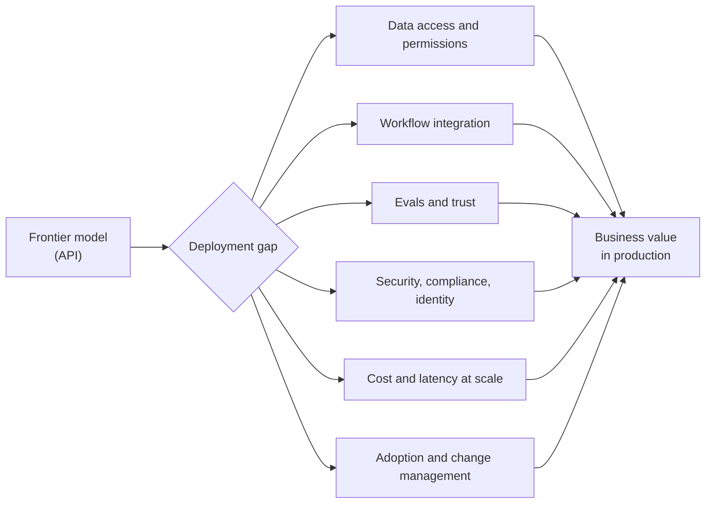
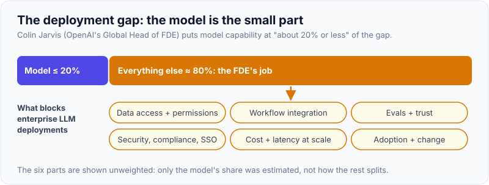
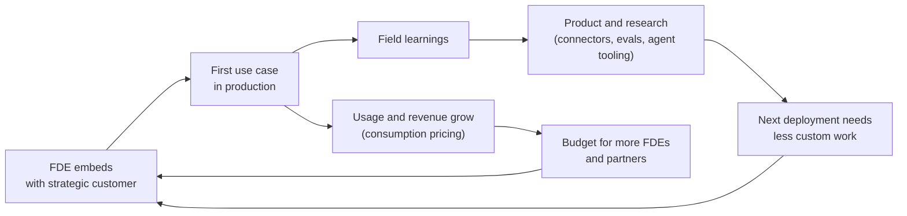

# The AI-Lab FDE Model: OpenAI, Anthropic, Google, Databricks, Scale & Services-Led Growth

!!! abstract "Key takeaways"
    - AI labs adopted FDEs because **the bottleneck moved from model capability to deployment**. OpenAI's Global Head of FDE, Colin Jarvis, has estimated model capability is "about 20% or less" of the gap; the rest is data, integration, workflow and trust.
    - Each company frames the role a little differently: **OpenAI** (frontier-model deployments end to end; in May 2026 a separate **OpenAI Deployment Company**), **Anthropic** (Applied AI team; MCP servers, sub-agents, agent skills, evals), **Google Cloud** (GenAI and Gemini Enterprise agents on Vertex AI, ADK), **Databricks** (full-stack data + AI apps on the Data Intelligence Platform), **Scale AI** (custom AI systems and agents inside enterprise and government security boundaries), **Cognition** (driving adoption of Devin/Windsurf).
    - **Services-led growth**: AI vendors accept low-margin, people-heavy deployment work early to win large accounts, learn what to productise, and expand usage. The risk is turning into a consultancy, so good FDE teams **productise patterns** and **enable the customer**.
    - Common AI-lab FDE requirements (2025–26 postings): **4+ years** customer-facing engineering, production LLM work (RAG, agents, tool use/MCP, evals), Python plus TypeScript, cloud, and **25–50% travel**.
    - Details change fast. Every company fact below is dated; **check the live posting and ask the recruiter**.

## Why it matters

In an FDE interview at an AI company you'll be asked some version of "Why do you think we need FDEs?" or "What's the hardest part of getting LLMs into production at an enterprise?". A good answer shows you understand the company's business model, not just the job. It also helps you pick where to apply: an FDE at OpenAI, at Databricks and at an IT services firm do noticeably different work.

Before 2024, most AI vendors sold APIs and left integration to customers, with solutions engineers helping before the sale. Customers ran many pilots and few reached production. The labs concluded that the "last mile" needs engineers who sit with the customer, and they borrowed Palantir's model (see [What an FDE is](01-what-an-fde-is-palantir-origins-fde-vs-swe-vs-solutions-engi.md)).

## Core concepts

### Why LLMs need forward deployment

LLM deployments fail for reasons that are mostly not about the model:

1. **Data and access:** the knowledge is in SharePoint, a claims system, a mainframe and people's heads, with permissions that must be respected in retrieval.
2. **Workflow fit:** a chatbot nobody opens doesn't help; the AI has to sit inside the tool people already use, with human approval where it matters.
3. **Evaluation:** non-deterministic output means you need task-specific evals before the business will trust it.
4. **Security and compliance:** SSO, data residency, PII/PHI handling, audit logs, vendor security review (see [Enterprise deployment environments](../fde-enterprise-deployment/index.md)).
5. **Cost and latency** at production volume.
6. **Change management:** users, legal, risk and IT all have to say yes.


*Notice that only one box on the path is the model. The FDE's job is everything in the middle, which is why AI-lab interviews test deployment thinking as much as LLM knowledge.*

{ loading=lazy }
*The model is a fifth of the bar; the FDE's job is the rest.*

### Company by company (as of October 2026)

All facts come from company announcements and job postings unless marked; loop details are in [The FDE interview loop mapped](03-the-fde-interview-loop-mapped-screens-take-home-practical-co.md).

| Company | How the role is framed | Typical work | Notable facts (dated) |
|---|---|---|---|
| **Palantir** | FDSE ("Delta") + Deployment Strategist ("Echo") | Foundry/AIP data integration, ontology, apps, government and commercial | The original model; "startup CTO" framing in postings |
| **OpenAI** | FDE: end-to-end deployments of frontier models, from discovery and scoping to production rollout, with feedback into product and model roadmaps | Custom agents and apps on OpenAI models inside large enterprises; government roles | Postings in SF, NYC, London, Dublin, Paris, Munich, Tokyo, Seoul, Singapore and others; "up to 50%" travel in several. **May 11, 2026:** launched the **OpenAI Deployment Company**, majority-owned by OpenAI, with TPG leading 19 partner firms, a reported $4B start and the acquisition of applied-AI consultancy **Tomoro** for a base of ~150 FDEs |
| **Anthropic** | FDE in the **Applied AI** team; embeds with strategic customers | Production apps on Claude; **MCP servers, sub-agents, agent skills**; evaluation frameworks; codifying repeatable deployment patterns | Postings ask for 4+ years technical customer-facing work and 25–50% travel. **May 2026:** a new enterprise AI services firm with Blackstone, Hellman & Friedman, Goldman Sachs and others (reported ~$1.5B) to bring Claude into PE-owned mid-market companies, with Anthropic Applied AI engineers working alongside it (secondary reports) |
| **Google Cloud** | FDE, Generative AI / Gemini Enterprise (several variants, incl. Partner FDE in Cloud Consulting) | Conversational and multi-agent systems (ADK, LangGraph, CrewAI), RAG over enterprise knowledge, on Vertex AI; acting as feedback loop to the Cloud roadmap | Some postings list a Master's/PhD as required or preferred; GECX role described as high-travel |
| **Databricks** | FDE / AI FDE, in professional services | Custom full-stack data + AI applications on the Data Intelligence Platform; owning architecture across data engineering, ML/GenAI and UI | Posted US band (Oct 2025 listing) about **$161K–$226K base + equity** |
| **Scale AI** | Forward Deployed AI Engineer (Enterprise; also public sector) | Custom AI systems and agents deployed within customer security and compliance boundaries; connectors to warehouses and internal APIs | Levels from FDAE to Staff and Sr. Director; one listing ~$179K–$224K, Staff ~$252K–$315K (aggregator data) |
| **Cognition** | "Deployed Engineer" | Demos, pilots, integrations and adoption of Devin/Windsurf | Loop reportedly includes a take-home done inside Devin and a simulated customer call (candidate reports) |
| **AI-native startups** (Sierra, Decagon, Harvey, Distyl and others) | FDE / Agent engineer / Deployment engineer | Configuring and extending an agent product per customer | Very varied; ask about account count and coding share |
| **IT services** (TCS, Accenture, Deloitte) | FDE practices | Delivering AI on behalf of clients, often on a lab or Palantir platform | TCS: up to 8,900 FDEs planned (July 2026); CIEL HR reported Indian FDE hiring up ~130% in a year (secondary) |

!!! warning "Treat numbers as perishable"
    Team sizes, office lists, pay bands and partnership terms in this table come from 2025–26 postings and press. Several job-board copies were already marked closed when researched. Quote them in an interview only as "I read that…" and check the company's careers page first.

### Services-led growth: the economics

Software companies traditionally avoid services: gross margins on software licences and subscriptions are much higher than on people-heavy services, and investors value the two very differently. Yet the AI vendors are hiring hundreds of FDEs. The logic, often called **services-led growth** (a16z wrote about it under that name), runs like this:

1. **Win the account.** Large enterprises won't buy a platform that might not work for them. Senior engineers on site reduce that risk.
2. **Land the first production use case.** Nothing expands an account like a working system that users depend on.
3. **Expand usage.** With LLMs, revenue is consumption-based: every production workflow means ongoing token spend, so a successful deployment keeps paying.
4. **Learn and productise.** Field problems become product features (connectors, evals, agent frameworks, admin controls), which lowers the cost of the next deployment.
5. **Hand off or scale out.** Enable the customer, or hand repeatable work to partners and system integrators, and move FDEs to the next frontier use case.


*Notice the two flywheels: revenue (usage pays for more deployment) and product (learnings reduce the cost of the next deployment). If the product loop breaks, the business turns into a low-margin consultancy.*

Jarvis has described this shift in OpenAI's own work: with tools such as Codex, the custom share of a project fell from about 90% to about 50%, and engagements usually start with a two-day visit. He has also said OpenAI's internal FDE group stays relatively small and focused on insight for product and research, while the Deployment Company grows to serve customers (reported August 2026).

{ loading=lazy }
*Watch the orange shrink: that's services-led growth turning into software margins.*

### Why the labs built separate deployment companies in 2026

Both OpenAI (Deployment Company, May 2026) and Anthropic (PE-backed services firm, May 2026) moved part of deployment into separate, partner-funded entities. A reasonable reading, labelled as interpretation:

- **Scale:** the demand for deployment far exceeds what a lab's own FDE team can serve.
- **Margins and focus:** the lab keeps a small, high-signal FDE team close to research; the services entity carries the people-heavy work.
- **Distribution:** private-equity and consulting partners bring hundreds of portfolio companies as ready customers.

For a candidate, this means "FDE at OpenAI" may now mean the core team, the Deployment Company, or a partner. **Ask which entity employs you**, how pay and equity work there, and how close you are to product and research.

### What the role demands technically

Across OpenAI, Anthropic, Google and Scale postings, the recurring requirements are:

- **Production LLM engineering:** prompt design and structured outputs, RAG with permission-aware retrieval, tool use and agents, MCP servers, evals, guardrails, cost control. See [Applied LLM engineering for deployments](../fde-applied-llm/index.md) and the [GenAI topic](../genai/index.md).
- **Full-stack building:** Python for AI/data work, TypeScript/React for user-facing tools, APIs and integrations ([Practical coding for FDE](../fde-practical-coding/index.md)).
- **Data integration:** getting data out of systems of record ([Data integration & pipelines](../fde-data-integration/index.md)).
- **Deployment environments:** customer cloud accounts and VPCs, Bedrock, Azure OpenAI, Vertex AI, SSO, security reviews.
- **Customer skills:** discovery, scoping, executive communication ([Customer discovery](../fde-customer-discovery/index.md)).

## In practice: talking about the company's model

A frequent question is "Why do you think [company] invests in FDEs?". Two answers:

=== "❌ Common mistake"
    ```text
    "Because AI is the future and every company wants to use it, so you need people
    to help customers. Also FDEs are the hottest job right now."
    - Generic; could be said about any company.
    - Shows no understanding of the deployment gap or the business model.
    - Quoting hype ("hottest job") signals you're chasing a trend.
    ```

=== "✅ Correct approach"
    ```text
    "Because the gap between what the models can do and what enterprises have in
    production is mostly not the model: it's data access, workflow fit, evals, security
    review and adoption. FDEs close that gap on the highest-value accounts, which drives
    consumption revenue, and they bring back the patterns that become product - for you,
    things like [MCP connectors / agent tooling / evals features: pick what is true for
    the company]. The risk is becoming a consultancy, so I'd want to understand how your
    team decides what to productise and when to hand off to partners - especially now
    that [the Deployment Company / the PE partnership] exists."
    ```

A company research template for each application:

```yaml
company_brief:
  name: "<company>"
  product_surface: "<APIs, agent platform, data platform, coding agent...>"
  fde_team_framing: "<quote 1-2 lines from the live posting>"
  deliverables_named: "<e.g. MCP servers, sub-agents, skills, full-stack apps>"
  deployment_environments: "<hosted API, customer VPC, Bedrock/Vertex/Azure, on-prem>"
  recent_moves: "<dated news: partnerships, deployment companies, launches>"
  customers_public: "<named customer stories in your domains: healthcare, banking>"
  why_me: "<2 resume facts that map to their deliverables>"
  questions_for_them: "<entity, accounts per FDE, productisation loop, travel>"
```

## Real-world usage

- **Domain fit:** healthcare (prior authorisation, clinical documentation, pharmacy benefits), financial services (KYC, customer service, document processing) and the public sector are prominent FDE domains because they have high-value workflows, sensitive data and legacy systems. Google, Scale and OpenAI all post government FDE roles; Anthropic's PE venture reportedly targets healthcare, manufacturing, financial services, retail and real estate.
- **Agent deployments** are the 2026 centre of gravity: postings now name multi-agent frameworks, MCP and human-in-the-loop approval explicitly.
- **India:** demand is growing (CIEL HR reported ~130% growth in FDE hiring in a year, concentrated in Bengaluru, Delhi-NCR and Hyderabad; TCS's 8,900 plan), but the title is used inconsistently by Indian employers, and lab FDE openings in India are fewer than in the US and Europe. Anthropic has opened a Bengaluru office (2026 press); whether it hires FDEs there is unconfirmed.
- **Known failure modes:** pilots that never leave the sandbox ("pilot purgatory"), demos built on clean sample data that fail on real data, and agents deployed without evals that lose user trust after a few visible errors.

## Trade-offs & production gotchas

| Employer type | Pros | Cons | Choose when |
|---|---|---|---|
| Frontier lab (core FDE team) | Closest to models and research; highest signal; strong comp | Small teams; intense bar; heavy travel; few India roles | You want to shape the product and can show production LLM work |
| Lab deployment company / PE venture | Many deployments; growing fast | Further from research; new structures and equity terms to understand | You want deployment volume and breadth |
| Data/AI platform (Databricks, Scale, Google Cloud) | Data engineering + AI; mature enterprise motion | More services-like at times; platform-specific | Your strength is data integration and cloud |
| AI-native startup (agents) | Ownership, speed, equity upside | Risk; role may drift into support or sales | You like ambiguity and product building |
| Palantir | The original; well-defined model; strong training | Platform-specific (Foundry/AIP); demanding culture | You like data integration and ontology work |
| IT services FDE practice | Many India roles; uses your services background directly | May be consulting with a new title; less product feedback | You want an FDE title quickly in India |

!!! warning "Gotcha: 'FDE' at a services firm vs a product company"
    At a product company, the FDE's leverage comes from changing the product. At a services firm, the client owns the product decision and you deliver against a statement of work. Both are valid jobs; only one has the product feedback loop that makes the FDE model distinctive. Ask which you're joining.

!!! tip "Interview angle"
    When asked about the company, connect three things: **their product surface**, **the deployment gap their customers face**, and **a resume fact that shows you've closed a similar gap**. Hype ("hottest job", "800%") is fine as context, never as your reason.

## How this connects to my experience

- **Where I used it:** no AI-lab experience on the resume. Transferable pieces:
    - **Integration of systems of record:** GraphQL Consumer Service between 5 upstream systems and multiple consumers (OptumRx Meteor), in healthcare, which is a priority FDE domain.
    - **Enterprise identity and security:** OAuth2, PingFederate and Active Directory integration (OptumRx); IAM, KMS, Secrets Manager (Deloitte); multi-cloud key management with HSMs (CCKM). These are exactly the security-review and deployment-environment issues that block LLM rollouts.
    - **AWS breadth and AWS Personalize integration** at Deloitte: a managed ML service integrated into a product, the nearest thing to an AI deployment on the resume.
    - **Python** is listed in skills *[confirm depth: production Python or scripting?]*.
- **Talking points:**
    - "The model is the easy 20%. My background is the other 80%: integrating messy upstream systems, enterprise SSO and security controls, in regulated healthcare."
    - Name one company-specific deliverable you've prepared for, e.g. "I built an MCP server over a REST API and an eval harness for it" *[confirm: only if you have actually built it; this KB's FDE track suggests building one]*.
- **Likely follow-up chain:** "Why do labs need FDEs?" → "What's the hardest part of an enterprise LLM deployment?" → "Tell me about a time you got a system through a security review or identity integration" → "How would that change with an LLM in the loop?". Answer the third with PingFederate/AD and OAuth2 work on OptumRx *[confirm details: which review, what blocked, how you resolved it]*, and the fourth with permission-aware retrieval and audit logging.

## Interview questions

### Fundamentals

??? question "Q1. Why have AI labs adopted the forward deployed engineer model?"
    **Answer:** Because enterprise value is limited by deployment, not model capability: data access, workflow integration, evals, security and adoption. FDEs close that gap on strategic accounts, which grows consumption revenue and brings field insight back to product and research. It's Palantir's model applied to frontier models.

    **Interviewer listens for:** the deployment gap and the feedback loop.

    **Common wrong answer:** "Because the models are hard to use."

??? question "Q2. What is services-led growth?"
    **Answer:** A go-to-market approach where a software company deliberately invests in hands-on services (here, FDEs) to win and expand large accounts and to learn what to productise, accepting lower margins early. It works if services lead to product improvements and expanding usage; it fails if the company becomes a consultancy with bespoke code for each customer.

    **Interviewer listens for:** both the upside and the margin risk.

    **Common wrong answer:** "Giving away free consulting."

??? question "Q3. Name three things that block enterprise LLM deployments that aren't the model."
    **Answer:** Permission-aware access to the right data; integration into the existing workflow and tools; evals that give the business confidence; security/compliance review (SSO, data residency, PII); cost and latency at scale; user adoption. Any three, with an example.

    **Interviewer listens for:** concrete, enterprise-flavoured examples.

    **Common wrong answer:** "Hallucinations" alone.

??? question "Q4. How does an FDE at Databricks differ from one at Anthropic?"
    **Answer:** Databricks FDEs build full-stack data and AI applications on the Databricks platform, with heavy data engineering, and sit in professional services. Anthropic FDEs sit in Applied AI and build production applications on Claude: agents, MCP servers, sub-agents and skills, with evals, and feed patterns back to product. Both embed with strategic customers.

    **Interviewer listens for:** awareness that the job follows the product surface.

    **Common wrong answer:** "Same job, different logo."

### Intermediate

??? question "Q5. Why might an FDE team's custom-work share fall over time, and why does it matter?"
    **Answer:** Because patterns get productised (connectors, templates, evals tooling) and because AI coding tools speed up the custom part. Jarvis has said OpenAI projects went from about 90% custom to about 50%. It matters because a falling custom share is how services-led growth turns into software margins.

    **Interviewer listens for:** connecting the metric to the business model.

    **Common wrong answer:** "It doesn't change."

??? question "Q6. Why did OpenAI and Anthropic set up separate, partner-funded deployment businesses in 2026?"
    **Answer:** Reported facts: OpenAI launched the OpenAI Deployment Company in May 2026 with TPG and other partners and acquired Tomoro; Anthropic formed a services firm with Blackstone, H&F, Goldman Sachs and others. My interpretation: demand for deployment exceeds what a lab's own team can serve, partners bring distribution (portfolio companies, clients), and the lab keeps its core FDE team small and close to research.

    **Interviewer listens for:** facts separated from interpretation.

    **Common wrong answer:** confident speculation presented as fact.

??? question "Q7. What should an AI-lab FDE bring back to product and research?"
    **Answer:** Recurring integration needs (connectors, MCP servers), failure modes the models show on real tasks (with eval cases), missing enterprise controls (admin, audit, data residency), latency/cost pain points, and evidence of which use cases drive value. Packaged as reproducible examples and data, not anecdotes.

    **Interviewer listens for:** evidence-based feedback.

    **Common wrong answer:** "Customer complaints."

??? question "Q8. How do consumption-based pricing and FDE work interact?"
    **Answer:** With token-based pricing, a production workflow generates ongoing revenue, so getting a use case from pilot to production is directly valuable to the vendor. That justifies senior engineers on site. It also creates a duty to optimise cost for the customer (model routing, caching), because runaway bills kill adoption.

    **Interviewer listens for:** commercial awareness plus customer advocacy.

    **Common wrong answer:** maximising token usage.

### Senior

??? question "Q9. You lead a new FDE team at an AI company. How do you stop it becoming a consultancy?"
    **Answer:** Engagement criteria (strategic accounts, novel use cases), time-boxed engagements with exit criteria and customer enablement, a required "productisation" output per engagement (reusable component, eval set or product request), a shared pattern library, a partner channel for repeatable work, and metrics that track custom share and time-to-production, not just hours.

    **Interviewer listens for:** operating-model design.

    **Common wrong answer:** "Hire better engineers."

??? question "Q10. How would you decide whether a customer request should become a product feature?"
    **Answer:** Frequency across customers, strategic fit, how general the solution can be, cost to maintain, and whether a platform primitive would let customers build it themselves. Bring evidence (customers, usage, effort saved) to product, and keep the custom version thin and replaceable.

    **Interviewer listens for:** judgement and evidence.

    **Common wrong answer:** "Whatever the biggest customer wants."

### Scenario-based

??? question "Q11. A bank's pilot works on sample data, but the CISO blocks production. What do you do?"
    **Answer:** Find out the specific concerns (data leaving the boundary, residency, logging, model training on data, access control). Map each to controls: private connectivity or a cloud-provider deployment (Bedrock/Azure/Vertex), zero-retention terms, permission-aware retrieval, audit logs, DLP/PII redaction, a security questionnaire and architecture doc. Agree a phased rollout with a limited user group and monitoring.

    **Interviewer listens for:** treating security as a requirement, not an obstacle.

    **Common wrong answer:** escalating to the account exec to override the CISO.

??? question "Q12. The customer wants a custom feature that duplicates something on the product roadmap for next quarter. What do you do?"
    **Answer:** Check the roadmap date and confidence with product; if it's close, build the smallest bridge that will be replaced cleanly and tell the customer the plan; if it's uncertain, build it as a candidate implementation with product's input. Avoid a hidden fork that becomes permanent.

    **Interviewer listens for:** working with product, not around it.

    **Common wrong answer:** building it silently.

??? question "Q13. You're offered FDE roles at a lab's core team and at a services firm's FDE practice. How do you compare them?"
    **Answer:** Compare accounts per FDE, coding share, closeness to product/research, the feedback loop, deployment environments, travel, level and comp structure (equity vs bonus), and growth path. Decide on what I want to learn in the next two to three years, not the title.

    **Interviewer listens for:** clear criteria.

    **Common wrong answer:** "Whichever pays more."

## Cheat sheet

| Concept | Remember |
|---|---|
| Why labs need FDEs | Deployment gap: data, workflow, evals, security, cost, adoption. Model ≈ "20% or less" (Jarvis) |
| Services-led growth | Services win and expand accounts and teach product; risk = consultancy margins |
| OpenAI | FDE end to end; Deployment Company launched May 11, 2026 (TPG-led partners, Tomoro, ~150 FDEs) |
| Anthropic | Applied AI; MCP servers, sub-agents, skills, evals; PE services venture May 2026 |
| Google Cloud | GenAI / Gemini Enterprise agents; Vertex AI, ADK; feedback to roadmap |
| Databricks | Full-stack data + AI apps; professional services |
| Scale AI | Custom AI systems and agents in customer security boundaries; enterprise + government |
| Cognition | Deployed engineers for Devin/Windsurf adoption |
| Typical asks | 4+ yrs customer-facing eng, Python + TS, production LLM, cloud, 25–50% travel |
| India | Growing demand, inconsistent titles; TCS up to 8,900 FDEs |

## Sources
1. [OpenAI: OpenAI launches the Deployment Company](https://openai.com/index/openai-launches-the-deployment-company): May 2026 launch, partners, Tomoro, FDE focus.
2. [OpenAI careers: Forward Deployed Engineer (London)](https://openai.com/careers/forward-deployed-engineer-london/) and [Washington DC (Gov)](https://openai.com/careers/forward-deployed-engineer-gov-washington-dc/): role scope, travel.
3. [The Next Web: OpenAI's Colin Jarvis says enterprise AI is stuck on deployment](https://thenextweb.com/news/openai-colin-jarvis-enterprise-ai-deployment-fde-humanx): "20% or less", custom share 90%→50%, two-day visits, team structure.
4. [Anthropic FDE posting (Greenhouse)](https://job-boards.greenhouse.io/anthropic/jobs/5302966008) and [Anthropic FDE, Applied AI](https://www.anthropic.com/careers/jobs/5012991008): Applied AI team, MCP servers, sub-agents, skills, 4+ years, travel.
5. [CoinCentral: Anthropic partners with Blackstone and Goldman Sachs in $1.5B AI deal](https://coincentral.com/anthropic-partners-with-blackstone-bx-and-goldman-sachs-gs-in-1-5b-ai-deal/): PE services venture (secondary report).
6. [Google Careers: Forward Deployed Engineer, Generative AI, Google Cloud](https://google.com/about/careers/applications/jobs/results/83353124541997766): GenAI FDE scope, frameworks, roadmap feedback.
7. [Databricks FDE (Built In listing)](https://builtin.com/job/forward-deployed-engineer-fde/8023905): role scope and posted band (aggregator).
8. [Scale AI careers](https://scale.com/careers/4597399005): Forward Deployed AI Engineer scope.
9. [Exponent: Cognition FDE interview guide](https://www.tryexponent.com/guides/cognition-forward-deployed-engineer-interview): Deployed Engineer loop (candidate reports).
10. [a16z: Services-led growth](https://a16z.com/services-led-growth/): the services-led growth argument.
11. [PostHog handbook: Forward deployed engineering](https://posthog.com/handbook/forward-deployed-engineering/how-we-work): productising engagements.
12. [The Next Web: TCS bets on 8,900 AI deployment engineers](https://thenextweb.com/news/tcs-forward-deployed-ai-engineers-acquisitions) and [CXOToday: CIEL HR on 130% FDE demand surge](https://cxotoday.com/ai/ai-boom-fuels-130-surge-in-demand-for-forward-deployed-engineers-ciel-hr/): India market.
13. [MarkTechPost: What is a forward deployed engineer (May 2026)](https://www.marktechpost.com/2026/05/20/what-is-a-forward-deployed-engineer-the-ai-role-openai-anthropic-and-google-are-hiring-in-2026/): 2026 market overview.
