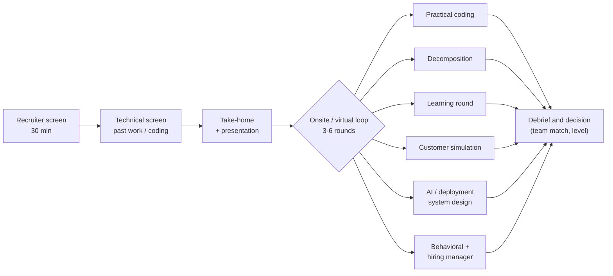
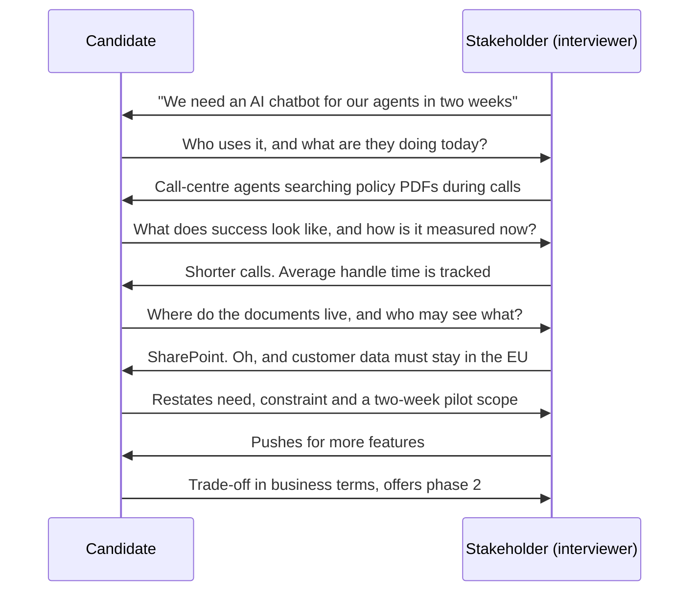
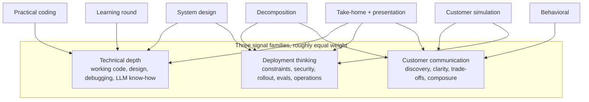

# The FDE Interview Loop Mapped: Screens, Take-Home, Practical Coding, Decomposition, Learning, Customer Simulation, Behavioral

!!! abstract "Key takeaways"
    - FDE loops typically run **4–6 rounds over 3–5 weeks** (prep-site estimate), assembled from a menu: **recruiter screen → technical screen / past-work deep dive → take-home with presentation → practical coding → decomposition → learning round → customer simulation → AI/deployment system design → behavioral**. No company runs all of them.
    - The loop tests **three things in roughly equal weight**: technical depth, real-world deployment thinking, and customer-facing communication. Strong algorithm skills alone don't pass.
    - Coding is **practical, not LeetCode**: extend, debug or refactor real-looking code, call an API, handle pagination, errors and retries, often with AI tools allowed. **Narrate** while you code.
    - **Decomposition** (vague business goal → buildable model) and **customer simulation** (stakeholder hiding a constraint) are the FDE-specific rounds. You're graded on the questions you ask and the order you ask them in.
    - The two most-reported failure modes: **waiting for guidance** and **going silent**. Most loop details come from prep sites and candidate reports, not the companies: **confirm the format with your recruiter**, round by round.

## Why it matters

FDE loops look unfamiliar to engineers used to "two LeetCode rounds, one system design, one behavioral". Candidates who prepare for that loop over-invest in algorithms and under-invest in discovery, scoping and explaining. A map of the rounds tells you where to spend preparation time and what each interviewer is actually scoring.

The loop is also a preview of the job: each round simulates a part of an FDE's week (a vague customer goal, an unfamiliar API, a frustrated stakeholder, a demo to defend). Treat each round as "show me how you'd behave on site", and the right behaviours follow.

## Core concepts

### The menu of rounds


*Notice that the onsite is a menu, not a fixed sequence. The take-home is optional at some companies and replaces a coding screen at others. Ask which boxes your loop contains.*

### Round by round

#### 1. Recruiter screen (≈30 minutes)

- **Tests:** motivation ("why FDE, why us"), understanding of the role, **travel and location** acceptance, work authorisation, level and compensation expectations, communication.
- **Prepare:** a 60–90 second story of your background aimed at the FDE role, a crisp "why FDE" and "why this company" ([page 5](05-why-fde-why-this-company-travel-level-and-compensation-conve.md)), and your questions about the loop.
- **Fails when:** you can't explain what an FDE does ([page 1](01-what-an-fde-is-palantir-origins-fde-vs-swe-vs-solutions-engi.md)), hesitate on travel, or anchor compensation too early.

#### 2. Technical screen / past-work deep dive (45–60 minutes)

- **Tests:** whether you really built what your resume says, and the depth of your decisions. Expect "defend your past work": architecture, trade-offs, what broke, what you'd change. Some companies (OpenAI per candidate reports) use an AI-enabled coding screen here instead or as well.
- **Prepare:** one flagship project you can draw from memory, with numbers, failure stories and alternatives considered (see [Tell me about yourself & project deep dive](../leadership-behavioral/02-tell-me-about-yourself-and-project-deep-dive-narrative.md)).
- **Fails when:** "we" with no "I", no numbers, no trade-offs.

#### 3. Take-home with presentation

- **Format:** a scoped build over a few days to a week, then a live walkthrough to a panel. One OpenAI candidate reported building semantic search over product data, then presenting the same solution again to a panel of about four interviewers plus the hiring manager. Cognition candidates report a task done inside Devin. Anthropic reportedly gives no feedback on take-homes.
- **Tests:** can you build something clean, deploy it, explain it to mixed audiences, and adapt it to customer needs? Reviewers care about scope choices, README quality, evals/tests and the demo, not maximum features.
- **Prepare:** a template repo (lint, tests, Docker, README skeleton, eval script), and a 10-minute presentation structure: problem → assumptions → design → demo → evaluation → limitations → what's next. Details in [Take-home project](../fde-behavioral-take-home/index.md).
- **Fails when:** you overbuild and run out of time, skip the write-up, or can't answer "what would you do with two more weeks?".

#### 4. Practical coding (45–60 minutes)

- **Format:** extend, debug or refactor an existing codebase; integrate a third-party API (auth, pagination, rate limits, retries); parse messy data; build a small endpoint or script. Usually Python or TypeScript, sometimes your choice. Google's FDE loop is reported to include production-style coding.
- **Tests:** working code quickly, edge cases, reading unfamiliar code, error handling, and **thinking aloud**. AI coding tools are allowed at some companies; you're then judged on how you direct and verify them.
- **Prepare:** see [Practical coding for FDE](../fde-practical-coding/index.md): API clients with backoff, webhooks, debugging drills, Python fluency.
- **Fails when:** silence, no tests or examples, ignoring errors and timeouts, or diving into code before clarifying input and output.

#### 5. Decomposition (45–60 minutes)

- **Format:** a deliberately vague, real-world problem ("help a hospital reduce no-shows", "Why are we delaying so many flights?") with no defined inputs. Palantir's version is often run in a shared coding pad for about 60 minutes; prep guides call it the round most Palantir candidates get.
- **Tests:** turning ambiguity into something buildable: users, decisions they make, data available, constraints, success metrics, then a data/object model and an MVP that can be extended.
- **Prepare:** [Problem decomposition & scoping](../fde-decomposition-scoping/index.md). Practise a framework until it's automatic, then practise *not* reciting it robotically.
- **Fails when:** jumping to technology ("I'd use RAG"), not asking who the user is, or producing a model that can't extend to the next requirement the interviewer adds.

#### 6. Learning round (≈60 minutes, mainly Palantir)

- **Format:** you're given an unfamiliar library, API, codebase or concept and asked to understand and extend it over several short stages, using the interviewer as a resource.
- **Tests:** how fast you learn, whether you read docs efficiently, ask good questions instead of guessing, and adapt when the next stage changes the rules.
- **Prepare:** practise picking up a new API from docs alone in 30 minutes (e.g. a payments, mapping or graph library) and narrating your mental model as it forms.
- **Fails when:** pretending to know, not asking, or not testing assumptions with small experiments.

Palantir loops can also include **re-engineering** (working on an existing system rather than building from scratch) and a standard **system design** round.

#### 7. Customer simulation (30–60 minutes)

- **Format:** the interviewer plays a stakeholder, often a frustrated operations lead or an executive, with a badly specified request and **a constraint they won't mention unless asked** (data can't leave the country, the system has no API, legal hasn't approved, budget ends this quarter). Variants: an executive pitch to a panel (Cognition reports), a hostile internal engineering team, scope that grows mid-conversation.
- **Tests:** discovery questions and their order, listening, restating the real need, surfacing constraints, scoping live, saying no without damaging the relationship, and composure.
- **Prepare:** [Customer discovery & stakeholder management](../fde-customer-discovery/index.md). Practise with a partner who hides a constraint.
- **Fails when:** pitching a solution in the first five minutes, accepting impossible timelines, showing frustration, or never summarising back.


*Notice that the hidden constraint (EU data residency) only appears because the candidate asked about data and access before proposing anything. The restatement and the phase-2 offer are the moments interviewers score most.*

#### 8. AI / deployment system design (45–60 minutes)

- **Format:** design an enterprise knowledge assistant, a document-extraction pipeline, an agentic workflow with human approval, or a data integration platform, with the customer's deployment constraints (VPC, SSO, residency) front and centre.
- **Tests:** classic design skills plus RAG/agent architecture, evals, guardrails, cost, rollout plan and operations.
- **Prepare:** [FDE system design](../fde-system-design/index.md) and [Applied LLM engineering](../fde-applied-llm/index.md).
- **Fails when:** a generic web-scale design with no customer context, no evals, no rollout plan.

#### 9. Behavioral and hiring manager (45–60 minutes)

- **Tests:** ambiguity, ownership of customer outcomes, scope creep, client conflict, quick fix vs proper fix, recovering trust after a failure, travel resilience, and values (Anthropic weights mission alignment; Palantir asks about its mission and customers).
- **Prepare:** an FDE-specific story bank ([FDE behavioral](../fde-behavioral-take-home/index.md), built on [STAR & story bank](../leadership-behavioral/01-star-framework-and-building-a-story-bank.md)).
- **Fails when:** stories with no customer in them, blaming the client, or no failure stories.

### Company variations (candidate-reported, 2025–26)

| Company | Reported shape | Distinctive elements |
|---|---|---|
| **Palantir** (FDSE) | Recruiter → online assessment or phone screen → onsite of 3–5 from a menu | **Decomposition** (near universal), **learning**, re-engineering, system design; strong mission questions |
| **OpenAI** | Two phone screens *or* take-home + review call → virtual onsite of 4–6, ~3–4 weeks | One-week take-home presented repeatedly from different angles; AI-enabled coding screen; scenario-based deployment thinking |
| **Anthropic** | Recruiter → technical use-case screen with Claude/MCP → coding exercise → hiring manager → final panel (solution design + values) | Live use of Claude in rounds; customer conversation; values alignment; little feedback |
| **Google Cloud** | Standard Google process adapted | Production coding, agentic/ML system design, client-facing conversation |
| **Databricks** | Screens → technical + customer rounds | Data engineering and Spark/SQL depth alongside AI |
| **Cognition** | Recruiter → take-home in Devin → project presentation → leadership 1:1s → exec pitch + customer simulation | Little traditional coding; heavy "why" questioning |

!!! warning "Source quality"
    These shapes come from prep sites (Exponent, igotanoffer, Educative, Dataford, techinterview.org) and individual candidate reports. They contradict each other on round counts and the processes change often. Use them to decide what to practise, then **ask the recruiter for the exact rounds, the language for each, whether AI tools are allowed, and the take-home time limit**.

### How the loop is scored


*Notice that most rounds feed more than one signal, and the take-home feeds all three. A brilliant coding round can't rescue a weak customer simulation, because nothing else gives the panel the communication signal.*

Behaviours interviewers consistently reward across rounds:

- **Clarify before building:** inputs, outputs, users, constraints, success metric.
- **State assumptions aloud** and check them.
- **Narrate:** "I'm going to stub the API first so I can test the parsing."
- **Drive:** propose a plan and start, rather than waiting for the interviewer to unblock you.
- **Scope ruthlessly:** a working thin slice beats an unfinished grand design.
- **Translate:** explain trade-offs in business terms to non-engineers.

## In practice: a preparation plan

=== "❌ Common mistake"
    ```text
    Week 1-4: 150 LeetCode mediums and hards.
    Week 5:   Read about RAG.
    Day before: Look up what an FDE does.
    - Over-invests in the least-weighted signal.
    - No practice speaking with a stakeholder, no decomposition reps, no take-home template.
    ```

=== "✅ Correct approach"
    ```text
    Week 1: Role and company research (pages 1, 2, 5); recruiter questions; story bank
            draft; 90-second pitch. Daily: 1 practical coding drill (API client, parsing).
    Week 2: Decomposition: 6 timed prompts out loud (record yourself). Build the
            take-home template repo. Daily coding drill.
    Week 3: Customer simulation with a partner (3 sessions, hidden constraints).
            Applied LLM: build a small RAG/agent project with evals and an MCP server.
    Week 4: FDE system design: 4 cases. Learning-round drills (new API from docs in 30 min).
    Week 5: Mock full loop; refine stories; company-specific prep for each onsite.
    ```

A per-loop checklist to fill in after the recruiter call:

```yaml
loop_plan:
  company: "<company>"
  rounds_confirmed:
    - {name: "technical screen", format: "<past-work deep dive / coding>", language: "<py/ts/any>", ai_tools: "<yes/no>"}
    - {name: "take-home", time_limit: "<hours/days>", presentation: "<length, audience>"}
    - {name: "practical coding", format: "<extend/debug/API>", environment: "<IDE/CoderPad>"}
    - {name: "decomposition", length: "<min>"}
    - {name: "customer simulation", persona: "<exec/ops/engineer>"}
    - {name: "system design", focus: "<AI / data / deployment>"}
    - {name: "behavioral / HM", values_doc: "<link to company values>"}
  travel_expectation: "<% and region>"
  level_target: "<as discussed>"
  decision_timeline: "<weeks>"
```

## Real-world usage

- **Why companies built these rounds:** Palantir designed decomposition and learning rounds because its FDSEs face open-ended customer questions and new technology constantly; AI labs added customer simulations and take-homes because their FDEs must run discovery and demo to executives.
- **Pass rates:** prep sources claim customer-style scoping rounds have low pass rates (one says about four in ten clear a 45-minute vague-problem round). Treat as anecdotal, but it shows where candidates fail.
- **AI tools in rounds:** OpenAI's coding screen and Anthropic's technical screen are reported to involve AI tools (Claude with MCP for Anthropic). Expect to be judged on how you prompt, verify and correct the tool, and on whether you still understand the code.
- **Interviewer training:** customer-simulation interviewers often follow a script with a hidden constraint and planned pushback. If something feels "withheld", it probably is: ask.

## Trade-offs & production gotchas

| Round | What to over-prepare | What not to over-prepare |
|---|---|---|
| Recruiter | Why FDE, why us, travel answer, loop questions | Comp numbers (deflect politely early) |
| Technical screen | One flagship project, numbers, failures | Reciting every technology on your resume |
| Take-home | Scope, README, evals, demo | Feature count, fancy UI |
| Practical coding | API integration, errors, narration, Python fluency | Hard dynamic programming |
| Decomposition | Users → decisions → data → model → MVP, extensibility | Technology name-dropping |
| Learning | Reading docs fast, asking questions | Pretending familiarity |
| Customer sim | Discovery questions, restating, saying no | A polished solution pitch |
| System design | Customer constraints, evals, rollout | Web-scale numbers for 500 internal users |
| Behavioral | Customer-centred stories, failures, conflict | Generic leadership stories with no customer |

!!! warning "Gotcha: the silent coder"
    Candidate reports and prep guides repeatedly cite silence while coding as a failure mode in FDE loops, more than in SWE loops, because the round stands in for pairing with a customer engineer. If you think best in silence, say so: "Give me 60 seconds to read this, then I'll talk you through my plan."

!!! tip "Ask the recruiter these five questions"
    1. Which rounds are in my loop, in what order, and how long is each?
    2. What language and environment for coding? Are AI tools allowed?
    3. Is there a take-home? Time limit? Who sees the presentation?
    4. Which signals matter most for this team (data, LLM, full-stack)?
    5. What does the team's travel look like in practice?

## How this connects to my experience

- **Where I used it:** the resume says I've **conducted technical interviews and contributed to hiring decisions**, so I've seen loops from the interviewer side ([Hiring & interviewing others](../leadership-behavioral/09-hiring-and-interviewing-others.md)).
- **Talking points:**
    - Map rounds to resume material: past-work deep dive → GraphQL Consumer Service over 5 upstreams (OptumRx); system design with deployment constraints → OAuth2/PingFederate/AD and Kafka retry/DLQ; customer simulation → stakeholder communication as team lead; learning round → picking up HSMs (Thales Luna, SafeNet) and three clouds' KMS at Coriolis *[confirm how quickly and how you learned them]*.
    - Gap to practise: **Python** practical coding (resume lists Python, but day-to-day work is Java/Spring) *[confirm your Python depth]*, and **production LLM** work for the AI system design and take-home.
    - Use the interviewer view: "When I interview, I look for candidates who clarify first and narrate; I hold myself to that."
- **Likely follow-up chain:** "Walk me through a system you owned" → "What would you change?" → "How would you add an LLM feature to it, deployed for this customer?" → "How would you evaluate it before go-live?". Prepare the third and fourth on the GraphQL service: a natural-language query layer or a support assistant over its data, permission-aware via the existing OAuth2 scopes, with an eval set from real queries *[hypothetical design; present as such]*.

## Interview questions

These are questions *about* the loop that recruiters and hiring managers ask, plus representative prompts from each round type.

### Fundamentals

??? question "Q1. (Recruiter) Walk me through your background and why you're interested in an FDE role."
    **Answer:** 60–90 seconds: current role and scope (lead, 8–10 engineers, healthcare integration layer over 5 upstream systems), the thread through your career (integration, security, cloud), the customer-facing part you enjoy, and why FDE is the natural next step (own outcomes end to end with the customer, plus building with LLMs). End with why this company.

    **Interviewer listens for:** coherence, role understanding, energy.

    **Common wrong answer:** a chronological resume read-out.

??? question "Q2. (Recruiter) This role involves 25–50% travel. How do you feel about that?"
    **Answer:** A direct yes or a clear, honest condition, plus evidence you understand why travel matters (discovery and trust are faster in person). If there are constraints, state them now (e.g. notice for international travel) *[confirm your actual constraints]*.

    **Interviewer listens for:** a clear answer; no surprises later.

    **Common wrong answer:** "Sure" with hesitation, then negotiating it down at offer stage.

??? question "Q3. What do you expect in the practical coding round, and how will you approach it?"
    **Answer:** Real-world tasks such as extending code, calling an API with pagination and retries, or debugging. I'll clarify inputs and outputs, sketch a plan aloud, get a thin version working, then handle edge cases and errors, testing as I go and narrating throughout.

    **Interviewer listens for:** awareness that it isn't LeetCode, and a process.

    **Common wrong answer:** "I've done 300 LeetCode problems."

??? question "Q4. How is a decomposition round scored?"
    **Answer:** On how you turn ambiguity into a buildable plan: clarifying users and the decisions they make, identifying data and constraints, defining success metrics, building a sensible data/object model and an MVP that extends when the interviewer adds requirements. Communication and driving the conversation matter as much as the final design.

    **Interviewer listens for:** process over a single right answer.

    **Common wrong answer:** "Getting the right architecture."

### Intermediate

??? question "Q5. (Decomposition) A regional hospital network says: 'We want to use AI to reduce patient no-shows.' Go."
    **Answer:** Clarify: who acts on predictions (schedulers? nurses?), what decisions they can make (reminders, overbooking, transport help), current no-show rate and cost, data available (appointment history, demographics, reminders sent) and constraints (PHI, EHR integration, consent). Define success (no-show rate down X% in a pilot clinic). Model: Patient, Appointment, Clinic, Reminder, Outcome. MVP: a risk score plus a targeted reminder workflow in one clinic, measured against a control. Extensions: transport offers, overbooking suggestions, an LLM to draft personalised reminders.

    **Interviewer listens for:** users and decisions first; a measurable pilot; extensibility.

    **Common wrong answer:** "I'd train a deep learning model on all the data."

??? question "Q6. (Customer simulation) 'Our board wants a GenAI chatbot live in two weeks.' How do you open?"
    **Answer:** Acknowledge the goal, then discovery: who would use it and for what task, what happens today, how success will be judged by the board, where the data lives and who may see it, constraints (security, residency, approvals), and who signs off. Restate the real need, propose a two-week pilot that is achievable with a clear success metric, and name what will come in phase 2.

    **Interviewer listens for:** questions before solutions; restating; a realistic scope.

    **Common wrong answer:** "Sure, we can use our API and have it live in two weeks."

??? question "Q7. (Learning round) You're given an unfamiliar SDK and 10 minutes. What do you do?"
    **Answer:** Read the overview and quickstart, find the core abstractions and one end-to-end example, run it, then make a small change to test my understanding. Ask the interviewer targeted questions ("Is pagination cursor-based here?") instead of guessing, and narrate my mental model.

    **Interviewer listens for:** efficient learning and good questions.

    **Common wrong answer:** reading every page, or guessing silently.

??? question "Q8. How do you present a take-home?"
    **Answer:** Problem and assumptions (1 min), design and key decisions with alternatives (3 min), live demo on realistic inputs (3 min), evaluation results and known failure cases (2 min), what I'd do next and how it would be deployed for a real customer (1 min). Keep code tours short and invite questions.

    **Interviewer listens for:** structure, honesty about limits, a customer lens.

    **Common wrong answer:** a 20-minute code walkthrough.

### Senior

??? question "Q9. (System design) Design an internal knowledge assistant for a bank's 5,000 operations staff, deployed in the bank's AWS account."
    **Answer:** Clarify users, documents, permissions, residency and success. Architecture: ingestion from document stores with ACLs, chunking and embeddings in a vector store inside the VPC, a model via a private endpoint (e.g. Bedrock), permission-aware retrieval filtered by the user's SSO groups, answer generation with citations, guardrails and audit logs. Evals: a golden question set with expected sources; offline then online feedback. Rollout: pilot team, then waves. Operations: cost dashboards, drift in retrieval quality, incident runbook.

    **Interviewer listens for:** deployment constraints, permissions, evals, rollout.

    **Common wrong answer:** a public chatbot design with no identity or evals.

??? question "Q10. What's the difference between how you'd approach an FDE system design round and a big-tech SWE one?"
    **Answer:** FDE design starts with the customer's context and constraints (their cloud, identity, data, regulators, team skills) and ends with a rollout and operations plan the customer can run. Scale is usually modest; integration, security, evals and adoption dominate. SWE design leans to scale, throughput and generic architecture.

    **Interviewer listens for:** customer-first framing.

    **Common wrong answer:** "Same thing."

??? question "Q11. Your take-home wasn't finished in time. How do you present it?"
    **Answer:** Lead with what works and a demo, be explicit about what's missing and why I prioritised as I did, show the plan and design for the rest, and cover how I'd validate it. Never hide gaps; scope decisions are part of what's being assessed.

    **Interviewer listens for:** honest prioritisation.

    **Common wrong answer:** apologising throughout or bluffing.

### Scenario-based

??? question "Q12. Halfway through a practical coding round, you realise your approach won't handle the second requirement. What do you do?"
    **Answer:** Say so out loud, explain why, and propose the change (e.g. refactor the parser into a function I can reuse). Check the time and agree with the interviewer whether to refactor or finish a working version first. Then execute and test.

    **Interviewer listens for:** transparency and steering.

    **Common wrong answer:** silently starting over.

??? question "Q13. In a customer simulation, the stakeholder becomes hostile and says your team has wasted their time. How do you respond?"
    **Answer:** Stay calm, acknowledge the frustration without being defensive, ask what specifically went wrong, restate it, own our part, propose a concrete next step and a check-in date, and follow up in writing.

    **Interviewer listens for:** composure and trust repair.

    **Common wrong answer:** arguing about who was at fault.

??? question "Q14. The interviewer gives you no direction in a decomposition round. What do you do?"
    **Answer:** Drive: state the framework I'll use, ask the first clarifying questions, make explicit assumptions where answers are missing, and move to a model and MVP, checking in at milestones. Silence from the interviewer is part of the test.

    **Interviewer listens for:** initiative.

    **Common wrong answer:** waiting to be told what to do.

??? question "Q15. You're allowed to use an AI coding assistant in the round. How do you use it?"
    **Answer:** For boilerplate and quick lookups, with clear prompts. I read and test everything it produces, explain the generated code, and write the critical logic and edge-case handling myself or verify it carefully. I'd say aloud what I'm delegating and why.

    **Interviewer listens for:** judgement, verification and ownership.

    **Common wrong answer:** pasting the whole problem and accepting the output.

## Cheat sheet

| Round | Tests | Key move |
|---|---|---|
| Recruiter | Motivation, role fit, travel, level | Crisp "why FDE, why us"; clear travel answer |
| Technical screen | Depth of past work | One flagship project with numbers and failures |
| Take-home | Build, explain, adapt | Scope small; README; evals; 10-minute story |
| Practical coding | Real-world code, edge cases | Clarify → plan aloud → thin slice → errors → tests |
| Decomposition | Ambiguity → buildable plan | Users → decisions → data → constraints → metric → model → MVP |
| Learning | Speed of learning | Docs fast; small experiments; ask |
| Customer sim | Discovery and composure | Ask before proposing; find the hidden constraint; restate; say no well |
| System design | AI + deployment design | Customer context, permissions, evals, rollout, ops |
| Behavioral | Ownership, ambiguity, conflict, trust | Customer-centred STAR stories |
| Overall | Tech ≈ deployment ≈ communication | Never silent; never waiting |

## Sources
1. [Exponent: The FDE interview loop](https://www.tryexponent.com/courses/forward-deployed-engineering/intro-fde-interviews/fde-loop): 4–6 rounds over 3–5 weeks; round types (prep site).
2. [Exponent: Palantir FDE interview guide](https://www.tryexponent.com/guides/palantir-forward-deployed-engineer-interview): decomposition, learning, re-engineering rounds (prep site).
3. [techinterview.org: Inside the Palantir engineering interview loop](https://www.techinterview.org/post/3233476805/palantir-interview-process/): Palantir round menu and lengths (prep site).
4. [Exponent: OpenAI FDE interview guide](https://www.tryexponent.com/guides/openai-forward-deployed-engineer-interview) and [igotanoffer: OpenAI FDE interview](https://igotanoffer.com/en/advice/openai-forward-deployed-engineer-interview): OpenAI loop shape, take-home and presentation (candidate reports).
5. [Exponent: Anthropic FDE interview guide](https://www.tryexponent.com/guides/anthropic-forward-deployed-engineer-interview): Anthropic stages (candidate reports).
6. [Exponent: Google FDE interview guide](https://www.tryexponent.com/guides/google-forward-deployed-engineer-interview): production coding, agentic design, client conversation.
7. [Exponent: Databricks FDE interview guide](https://www.tryexponent.com/guides/databricks-forward-deployed-engineer-interview) and [Cognition FDE interview guide](https://www.tryexponent.com/guides/cognition-forward-deployed-engineer-interview): company variations.
8. [Educative: The four interview rounds](https://www.educative.io/courses/forward-deployed-engineer/the-four-interview-rounds): decomposition, customer simulation, technical, behavioral.
9. [Medium (Shivanath D.): The FDE interview has six rounds](https://medium.com/@shivanathd/the-forward-deployed-engineer-interview-has-six-rounds-365df0544e2c): customer simulation with a hidden constraint.
10. [techinterview.org: What the forward deployed engineer interview really tests](https://www.techinterview.org/post/3233477236/forward-deployed-engineer-interview/): vague-problem round, pass-rate claim (anecdotal).
11. [FDE Academy: FDE interview questions](https://fde.academy/blog/forward-deployed-engineer-interview-questions) and [Dataford FDE guide](https://dataford.io/roles/forward-deployed-engineer): question bank and prep (prep sites).
12. [Palantir FDSE posting (Lever)](https://jobs.lever.co/palantir/b46312f7-89c8-4447-bf01-931e45243d1a): example open-ended customer question.
