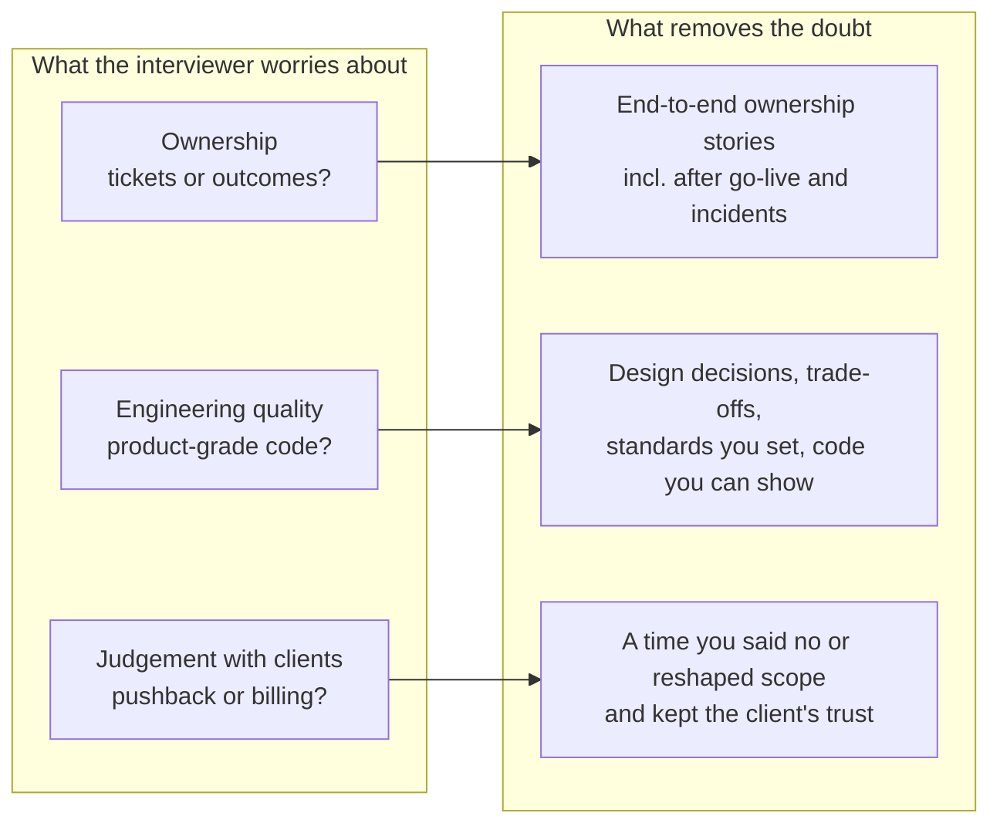
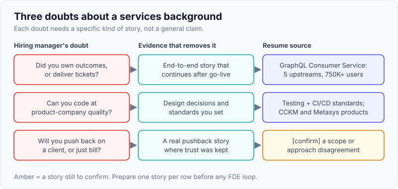
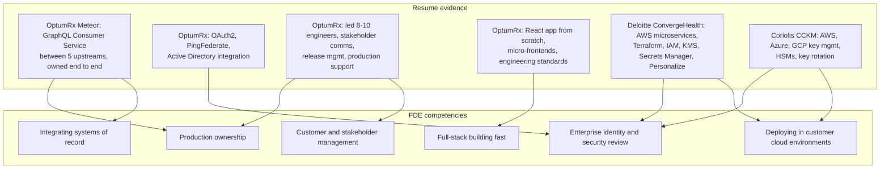
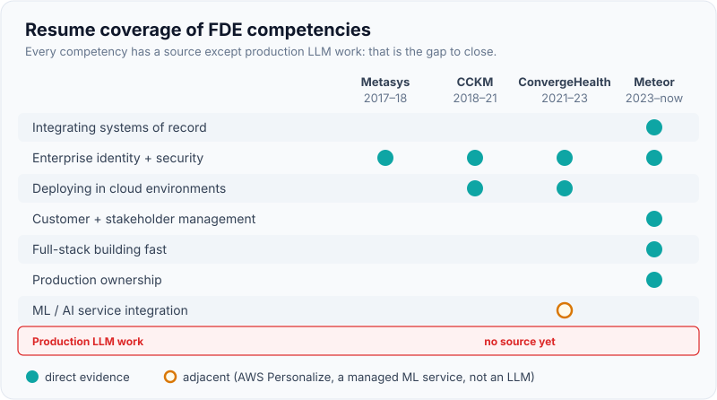

# Positioning a Consulting & Services Background (Publicis Sapient, Deloitte) for FDE

!!! abstract "Key takeaways"
    - A services background is **close to the FDE job** (client-facing delivery, unfamiliar environments, integration with systems you don't own, regulated domains) but hiring managers have **three doubts**: *Did you own outcomes or just deliver tickets? Can you code at product-company quality? Will you push back on a client, or just bill?*
    - Answer the doubts with **evidence of ownership**: "owned end to end", "in production", "I decided", "when it broke I…", numbers, and what happened *after* go-live.
    - **Map each resume bullet to an FDE competency**: integration of systems of record, enterprise identity and security, cloud deployment, stakeholder management, production support, leading a delivery team.
    - **Name the gaps honestly and show what you're doing about them**: production LLM work (RAG, agents, MCP, evals) and, for some loops, Python fluency. A small, deployed, evaluated project beats claims.
    - Never disparage your employer or "consulting". Frame the move as "**same customer focus, plus product ownership and the feedback loop**".

## Why it matters

FDE hiring managers often describe the ideal candidate as "an engineer who has worked with customers". Consultancy engineers have exactly that, yet many FDE teams are cautious about them. Practitioner write-ups describe the distinction bluntly: a consultant's output is "a recommendation… a decision somebody else will implement", and "the consultant can walk away from a failed implementation. An FDE cannot." Accenture's own FDE postings say the role is "not a support role and it is not an advisory role".

If you don't address this framing, the interviewer fills the gap with the stereotype. If you do, the services background becomes a differentiator: you've already lived the hard, non-coding half of the FDE job that product-company engineers have to learn.

The timing helps. In 2026 the consultancies themselves are building FDE practices (Accenture, Deloitte; TCS plans up to 8,900 FDEs) and the AI labs are partnering with consulting and private-equity firms for deployment (see [The AI-lab FDE model](02-the-ai-lab-fde-model-openai-anthropic-google-databricks-scal.md)). Services delivery experience is now explicitly part of the FDE market.

## Core concepts

### The three doubts, and the evidence that removes each


*Notice that each doubt maps to a specific kind of story, not to a general claim. Prepare at least one story per box before any FDE loop.*

{ loading=lazy }
*The amber box is the story to prepare before your first loop.*

### The consulting-to-FDE translation

Services work and FDE work share most activities; the difference is the stance. The table shows how the same activity reads in each world.

| Services framing (weak for FDE) | FDE framing (strong) | Why it lands |
|---|---|---|
| "The client gave us requirements" | "I worked out what the users actually needed, and it differed from the first ask" | Discovery, not order-taking |
| "We delivered the SOW on time" | "It went live, users adopted it, and I owned it through production issues" | Outcome, not deliverable |
| "The architect designed it; I implemented" | "I co-designed it with the architect and made these decisions…" | Design ownership |
| "Integration with client systems" | "Integrated 5 upstream systems of record I didn't control, with their constraints" | The core FDE problem |
| "Handled stakeholder communication" | "Told stakeholders no on X, offered Y, and kept the relationship" | Judgement with clients |
| "Followed client standards" | "Established engineering standards (testing, CI/CD) the team adopted" | Raises the bar, not just complies |
| "Supported production" | "Owned incidents and fixed root causes" | Accountability |
| "Worked on many projects" | "Went deep on one platform for years, then repeated patterns elsewhere" | Depth plus pattern recognition |

### Mapping the resume to FDE competencies


*Notice that every FDE competency except production LLM work has at least one resume source. That missing box is the gap to close before interviewing (see "Gaps" below).*

{ loading=lazy }
*The red row is the one to close with a real, deployed project.*

| FDE competency | Resume evidence (verbatim facts) | Story to prepare *[confirm details]* |
|---|---|---|
| Integrating systems of record | GraphQL Consumer Service as "the integration layer between 5 upstream systems and multiple downstream consumers"; "data integration patterns" with architects (Publicis Sapient) | An upstream system that was slow, inconsistent or changed its contract, and how you handled it |
| Enterprise identity & security | "Secure enterprise APIs using OAuth2, PingFederate, and Active Directory integration" (Publicis Sapient); IAM, KMS, Secrets Manager (Deloitte); JWT/SSO end to end (Johnson Controls) | Getting an integration through the client's identity or security team |
| Deploying in cloud environments | AWS Lambda, ECS, EKS, API Gateway, RDS, DynamoDB, SQS, SNS, S3; Terraform (Deloitte); keys across AWS, Azure, GCP (Coriolis); AWS SA Associate (2023) | Deploying into an account or environment you didn't control |
| Event-driven reliability | Kafka workflows with retry and DLQ (Publicis Sapient) | A failure the DLQ caught, and how you replayed |
| Full-stack building | "Built the ReactJS application from the ground up", micro-frontends (Publicis Sapient) | Starting from zero under ambiguity |
| Stakeholder management & delivery | Sprint planning, estimation, stakeholder communication, release management, production support | A scope or date negotiation |
| Raising the bar | "Established engineering standards around testing, CI/CD, code quality" | Getting buy-in for standards |
| Regulated domains | Healthcare (OptumRx, ConvergeHealth), cloud security (CCKM) | Handling PHI or key material constraints |
| Hiring and mentoring | Technical interviews; mentored 5+ engineers | Raising team capability (an FDE also enables the customer's team) |
| ML/AI integration | Integrated AWS Personalize recommendation services (Deloitte) | The nearest AI deployment on the resume; what made it work in production |

### The honest gaps

| Gap | Why it matters for FDE | How to close it before interviewing |
|---|---|---|
| **Production LLM experience** (RAG, agents, MCP, evals) | AI-lab FDE roles list it explicitly; take-homes and system design assume it | Build and deploy one small but real project: permission-aware RAG or an agent with tools, an MCP server over a REST API, an eval set and cost tracking. Write it up. See [Applied LLM engineering](../fde-applied-llm/index.md) |
| **Python fluency** (if day-to-day is Java) | Many practical coding rounds default to Python | Daily practical drills in Python: API clients, parsing, pandas basics. See [Python](../python/index.md) |
| **Direct end-customer contact** (if mediated by client leads or account managers) | Customer simulation and discovery rounds | Identify real moments where you spoke to client stakeholders directly *[confirm]*; practise discovery with a partner |
| **Product-company experience** | Doubts about code quality and ownership | Lead with standards you set, design decisions and production ownership |

!!! warning "Don't overclaim AI experience"
    The resume has no production LLM project. Saying "I've built RAG systems" without one invites a deep dive that will fail. Say: "I haven't shipped an LLM system in production at work yet. Here's what I built to learn it, what broke, and what I'd do differently for a customer." That's credible and shows the learning-round behaviour interviewers want.

### The 90-second positioning pitch (structure)

1. **Who:** "Lead engineer, 9+ years, healthcare, banking and cloud security, mostly in client-facing services."
2. **FDE-shaped proof:** "On OptumRx Meteor I own the GraphQL integration layer in front of five upstream systems for an app with 750K+ users, plus the team of 8–10 that builds it."
3. **The customer half:** "I run stakeholder communication, release and production support, so I'm used to working inside someone else's systems and constraints."
4. **Why FDE now:** "I want to own outcomes end to end with the customer, and feed what I learn back into a product, rather than hand over at the end of a statement of work."
5. **The gap, owned:** "I've been building production-style LLM work: [project] *[confirm]*."
6. **Why you:** one sentence specific to the company ([page 5](05-why-fde-why-this-company-travel-level-and-compensation-conve.md)).

## In practice: answers that position well

=== "❌ Common mistake"
    ```text
    "At Publicis Sapient I work on the OptumRx project for our client. The client
    gives us requirements and we deliver features in sprints. I led the team and we
    used Java, Spring Boot, Kafka, GraphQL, React, Redis and MongoDB. I want to move
    to a product company because consulting is very process-heavy and the client
    makes all the decisions."
    - "Client gives requirements" confirms the order-taker stereotype.
    - Technology list instead of outcomes and decisions.
    - Negative about consulting and the client: a red flag for a client-facing role.
    ```

=== "✅ Correct approach"
    ```text
    "At Publicis Sapient I own the GraphQL Consumer Service for OptumRx Meteor, a
    healthcare app with 750K+ users. It's the integration layer between five upstream
    systems we don't control and several consumers, so most of my job is understanding
    each upstream's constraints, agreeing contracts with their teams, and making the
    whole thing reliable - caching with Redis, Kafka retries and DLQs, OAuth2 through
    PingFederate and AD. I lead the 8-10 engineers who build it and I'm the one who
    talks to stakeholders when scope or dates move.
    That's why FDE appeals: it's the same work of making a system succeed inside
    someone else's environment, but with ownership of the outcome and a direct line
    back into the product."
    [confirm: who 'we don't control' covers, and which stakeholder conversations you led]
    ```

A worksheet for converting each resume bullet into an FDE story:

```yaml
bullet: "Owned the GraphQL Consumer Service end-to-end (5 upstreams)"
fde_competency: [integrating-systems-of-record, production-ownership, stakeholder-management]
customer_or_stakeholder: "<who: client product owner? upstream team leads?>  [confirm]"
discovery_moment: "<what you learned that changed the plan>  [confirm]"
constraint_you_worked_within: "<upstream rate limit, data freshness, security rule>  [confirm]"
decision_you_owned: "<e.g. Redis caching for reference data, TTLs agreed with owners>  [confirm]"
after_go_live: "<incident, adoption, iteration>  [confirm]"
number: "<latency, error rate, users, release cadence>  [confirm]"
what_went_back_to_platform: "<standard, reusable pattern, library>  [confirm]"
```

## Real-world usage

- **Services firms are now FDE employers.** Accenture posts FDE roles (including Palantir-focused ones) that describe a "boots on the ground" model; Deloitte has posted FDE roles; TCS plans up to 8,900 FDEs (July 2026). These value a services background directly, but check whether the role is real FDE work (see [page 1](01-what-an-fde-is-palantir-origins-fde-vs-swe-vs-solutions-engi.md)).
- **AI labs partner with services firms.** OpenAI's Deployment Company launched with consulting and system-integrator partners; Anthropic's services venture works with private-equity partners. People who understand how consultancies deliver are useful in those structures.
- **Palantir and AI labs hire ex-consultants** when they show engineering depth. Practitioner advice for consultants converges on: build a portfolio of shipped projects, learn one production stack well, and show ownership.
- **Domain advantage:** healthcare and financial services are leading FDE domains; years inside a large US healthcare client's environment (OptumRx) is a relevant credential for healthcare-focused deployments. Keep client confidentiality: describe scale and patterns, never internal details.

## Trade-offs & production gotchas

| Positioning choice | Pros | Cons | Use when |
|---|---|---|---|
| Lead with client delivery | Directly relevant to the FDE's customer half | Can trigger the "consultant" stereotype | Pair with ownership evidence |
| Lead with engineering depth | Removes the code-quality doubt | May hide your biggest differentiator | Technical screens and deep dives |
| Lead with domain (healthcare) | Distinctive for healthcare-heavy teams | Narrow if the company isn't in that domain | Healthcare customers or verticals |
| Emphasise leadership (8–10 engineers) | Shows senior scope | FDE is often an IC role; may read as "wants to manage" | Senior or lead FDE roles; otherwise frame as delivery ownership |
| Lead with the AI project | Addresses the main gap | Weak if it's a toy | Only when it's deployed, evaluated and written up |

!!! warning "Gotchas"
    - **Don't trash consulting or the client.** You're interviewing for a client-facing job; negativity about clients is the fastest way to fail.
    - **Don't hide behind "we".** Services work is team-heavy, so be deliberate about "I decided", "I wrote", "I negotiated".
    - **Confidentiality:** say "a large US pharmacy benefits client" if needed; don't share internal systems, data or incidents in detail.
    - **The IC question:** many FDE roles are individual contributor roles. If you've been leading 8–10 engineers, be ready for "Are you OK writing code most of the week again?" with a clear yes and evidence that you still code *[confirm how much you code today]*.

!!! tip "Interview angle"
    Turn the stereotype into a strength in one sentence: "Consulting taught me the half of this job that's hardest to learn: working inside someone else's systems, constraints and politics. What I want now is to own the outcome and feed it back into a product."

## How this connects to my experience

- **Where I used it:** the whole resume. Publicis Sapient (Senior Associate L2, Jan 2023–present, OptumRx Meteor) and Deloitte (Product Engineer II, Jun 2021–Jan 2023, ConvergeHealth Data Asset Explorer) are services/consulting employers; Coriolis (CCKM) and Johnson Controls (Metasys) were product-side engineering roles, which helps rebut the "never built a product" doubt.
- **Talking points:**
    - **Not only services:** "Three of my four roles were building products: CCKM key management at Coriolis, Metasys at Johnson Controls, and ConvergeHealth Data Asset Explorer, which was a product at Deloitte." *[confirm ConvergeHealth was a Deloitte product, as the "Product Engineer" title suggests]*
    - **Integration ownership:** the 5-upstream GraphQL layer is the flagship FDE-shaped story.
    - **Security and identity depth** across OAuth2/PingFederate/AD, JWT/SSO, IAM/KMS/Secrets Manager and HSMs: enterprise deployments stall on exactly these.
    - **Delivery leadership:** stakeholder communication, estimation, release management and production support as the lead of 8–10 engineers.
    - **Gap closure:** the LLM project you build for this track *[confirm what you've built and deployed]*.
- **Likely follow-up chain:**
    1. "You've mostly worked at consultancies. How is that different from what an FDE does?" → ownership + product feedback loop; no disparagement.
    2. "Give me an example where you owned an outcome, not just delivered a feature." → GraphQL Consumer Service, including after go-live *[confirm an incident or iteration]*.
    3. "Did you ever push back on the client?" → a real scope or approach disagreement and how trust was kept *[confirm a real example; if none, use an internal stakeholder]*.
    4. "What would you do differently if you'd been the vendor's FDE rather than the services team?" → feed recurring integration pain back as product features; build for handover; measure adoption.
    5. "What's your experience with LLMs in production?" → honest: none at work yet; here's the project, evals and lessons.

## Interview questions

### Fundamentals

??? question "Q1. You've spent the last five years at Deloitte and Publicis Sapient. Why should we see that as relevant to an FDE role?"
    **Answer:** Because the hardest part of FDE work, making a system succeed inside someone else's environment, is what I've done daily: integrating five upstream systems I didn't own for a 750K-user healthcare app, enterprise identity with PingFederate and AD, AWS deployments with IAM/KMS controls, stakeholder communication and production support. What I'm adding is product ownership and the feedback loop.

    **Interviewer listens for:** specific, outcome-framed evidence.

    **Common wrong answer:** "I'm good with clients."

??? question "Q2. What's the difference between consulting and forward deployed engineering?"
    **Answer:** A consultant's output is often a recommendation or a delivered scope, and the engagement ends at the SOW. An FDE works for the product company, builds and runs what they recommend, is accountable after go-live, and feeds patterns back into the product. The overlap is large: discovery, client management, delivery in unfamiliar environments.

    **Interviewer listens for:** accurate contrast, respect for both.

    **Common wrong answer:** "Consultants just make slides."

??? question "Q3. Tell me about a time you owned an outcome, not just a feature."
    **Answer structure:** GraphQL Consumer Service: the outcome (reliable integrated data for multiple consumers), your decisions (caching, retries, contracts with upstream teams), what happened after go-live (incident, iteration, adoption), and a number *[confirm]*.

    **Interviewer listens for:** post-go-live accountability.

    **Common wrong answer:** a story that ends at "we released it".

??? question "Q4. Have you worked directly with end customers, or through client managers?"
    **Answer:** Be precise and honest about who you spoke to (client product owners, upstream team leads, business stakeholders) and how often *[confirm]*. Then give one example where your direct conversation changed the plan.

    **Interviewer listens for:** honesty plus a real example.

    **Common wrong answer:** overstating access.

### Intermediate

??? question "Q5. Tell me about a time you pushed back on a client request."
    **Answer structure:** the request, why it was a problem (risk, cost, scope), how you presented options in their terms, the agreed outcome, and how the relationship held *[confirm a real example]*.

    **Interviewer listens for:** judgement and trust-keeping.

    **Common wrong answer:** "The client is always right" or "I refused."

??? question "Q6. Consultancy code is often seen as lower quality than product code. How do you respond?"
    **Answer:** Not defensively: "Quality depends on the team's standards. On OptumRx I established engineering standards for testing, CI/CD and code quality, and the services I own run in production for 750K+ users. Happy to go deep on any design." Then offer a design decision with trade-offs.

    **Interviewer listens for:** evidence, not indignation.

    **Common wrong answer:** arguing the stereotype.

??? question "Q7. How did you work within constraints you didn't control?"
    **Answer:** Use upstream systems (rate limits, data freshness, contract changes) and identity/security requirements (PingFederate, AD): how you discovered the constraint, designed around it (caching, timeouts, retries/DLQ), and agreed it with the owning team *[confirm specifics]*.

    **Interviewer listens for:** constraint discovery and negotiation.

    **Common wrong answer:** "We asked them to change it."

??? question "Q8. You've led 8–10 engineers. Are you comfortable being an individual contributor writing code most of the week?"
    **Answer:** A clear yes with evidence: how much you code now, what you built yourself (e.g. the React app foundation, the GraphQL service), and why IC FDE work attracts you (direct ownership). Mention that leadership skills transfer to leading customer teams *[confirm current coding share]*.

    **Interviewer listens for:** genuine IC appetite.

    **Common wrong answer:** hesitation, or "I'd want to lead a team soon."

??? question "Q9. What's your experience with LLMs in production?"
    **Answer:** Honest: no production LLM system at work yet. Then what you've built to close the gap (project, architecture, evals, deployment, cost, what failed) *[confirm]*, and how your integration and security experience applies to LLM deployments.

    **Interviewer listens for:** honesty, real learning, transferable depth.

    **Common wrong answer:** inflating a tutorial into "production experience".

### Senior

??? question "Q10. If you'd been the vendor's FDE on a project you delivered as a services engineer, what would you have done differently?"
    **Answer:** Fed recurring integration pain back into the product as features, designed for customer handover from day one (runbooks, training), measured adoption and business outcomes rather than SOW completion, and pushed earlier on scope that didn't serve the outcome.

    **Interviewer listens for:** understanding of the FDE's product loop.

    **Common wrong answer:** "Nothing, it went well."

??? question "Q11. How does your healthcare experience help in a deployment at a hospital or insurer?"
    **Answer:** Familiarity with regulated data and access controls, enterprise identity, audit expectations, slow change processes and the stakeholder mix (clinical, operations, compliance, IT). I'd still learn the customer's specific workflows and rules; the domain gives me the right questions faster. Keep client confidentiality.

    **Interviewer listens for:** domain relevance without overclaiming (you're not a clinician).

    **Common wrong answer:** claiming HIPAA expertise you haven't used *[confirm your exact compliance exposure]*.

??? question "Q12. What would you bring to our FDE team that engineers from product companies usually lack?"
    **Answer:** Comfort inside other organisations' systems and politics; delivery discipline (estimation, release, stakeholder updates); experience in regulated enterprise environments; and pattern recognition from multiple domains and clouds (AWS, Azure, GCP).

    **Interviewer listens for:** specific, differentiated value.

    **Common wrong answer:** "Communication skills" with no example.

### Scenario-based

??? question "Q13. A customer asks you, as their FDE, to take on work outside the agreed scope, the way a services client would. What do you do?"
    **Answer:** Separate what serves the agreed outcome from general staff augmentation. Restate success criteria, put new asks in a list with impact and effort, agree with the sponsor and my account team, and redirect what doesn't belong (to their team, a partner or a later phase). The difference from services: I optimise for the outcome and the product, not billable hours.

    **Interviewer listens for:** outcome focus, saying no well.

    **Common wrong answer:** doing it all to keep the client happy.

??? question "Q14. The interviewer says: 'Honestly, we've had bad experiences hiring ex-consultants.' How do you respond?"
    **Answer:** Acknowledge it calmly, ask what went wrong (often: waiting for specs, weak ownership, slow coding), and address each with evidence: end-to-end ownership of the integration layer, standards I set, production support, and the code I can show or walk through. Offer to go deep on anything.

    **Interviewer listens for:** composure under a challenge, and evidence.

    **Common wrong answer:** getting defensive.

??? question "Q15. You're asked to present a past project as if to a customer executive. Which do you choose and how?"
    **Answer:** OptumRx Meteor's integration layer or the React app, framed by business outcome (users served, faster feature delivery, reliability) *[confirm metrics]*, then the key decision and risk, then what's next. Three minutes, no jargon, one diagram.

    **Interviewer listens for:** audience awareness.

    **Common wrong answer:** a technology tour.

## Cheat sheet

| Item | Remember |
|---|---|
| Three doubts | Ownership? Code quality? Client judgement? |
| Removal | End-to-end + post-go-live stories; design decisions and standards; a real pushback story |
| Flagship story | GraphQL Consumer Service, 5 upstreams, 750K+ users (OptumRx Meteor) |
| Security story | OAuth2 + PingFederate + AD; IAM/KMS/Secrets Manager; HSMs |
| Product-side proof | Coriolis CCKM, Johnson Controls Metasys, Deloitte ConvergeHealth |
| Gaps | Production LLM work; Python practical fluency; direct customer contact *[confirm]* |
| Language | "I owned", "in production", "after go-live", "I decided", numbers |
| Never | Trash consulting/clients; claim LLM production work you haven't done; leak client details |
| One-liner | "Consulting taught me the hard half; now I want the outcome and the product loop." |

## Sources
1. [Accenture: Forward Deployed Engineer Specialist (Palantir) posting](https://flexa.careers/jobs/accenture-forward-deployed-engineer-specialist-palantir-69fbe7d920b6f48bd97c948a): "boots on the ground", technical depth plus client EQ (aggregator copy).
2. [Deloitte: Forward Deployed Engineer posting (Sydney)](https://jobs.deloitte.com.au/job/Sydney-Forward-Deployed-Engineer-NSW/1362718766/): consultancies hiring FDEs.
3. [Shivanath D.: The difference between an FDE and a consultant with a better title](https://shivanathd.substack.com/p/the-difference-between-a-forward): designer-also-builds test (practitioner essay).
4. [rohitraj.tech: FDE vs solutions engineer vs consultant (2026)](https://rohitraj.tech/notes/fde-vs-solutions-engineer-vs-consultant-2026): consultant output and walk-away contrast (practitioner notes).
5. [MindStudio: How to become a forward deployed engineer](https://www.mindstudio.ai/blog/how-to-become-forward-deployed-engineer/): transition paths from consulting and other roles (vendor blog).
6. [The Next Web: TCS bets on 8,900 AI deployment engineers](https://thenextweb.com/news/tcs-forward-deployed-ai-engineers-acquisitions): services firms building FDE practices.
7. [OpenAI: OpenAI launches the Deployment Company](https://openai.com/index/openai-launches-the-deployment-company): consulting and SI partners in deployment.
8. [Palantir FDSE posting (Lever)](https://jobs.lever.co/palantir/b46312f7-89c8-4447-bf01-931e45243d1a): end-to-end ownership expectations.
9. [Anthropic FDE posting (Greenhouse)](https://job-boards.greenhouse.io/anthropic/jobs/5302966008): production LLM requirements that define the gap.
10. Vishal Hulawale, résumé (10 Jan 2026): all experience facts on this page.
