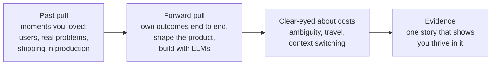
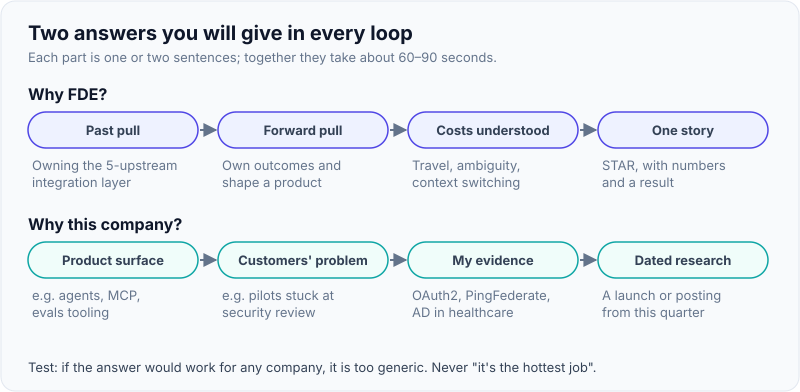
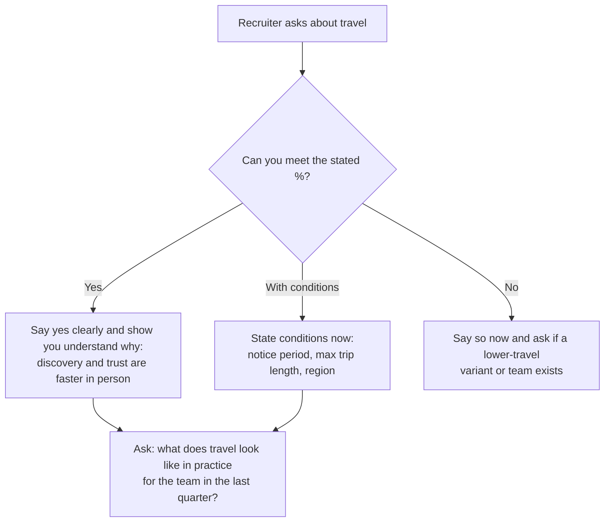
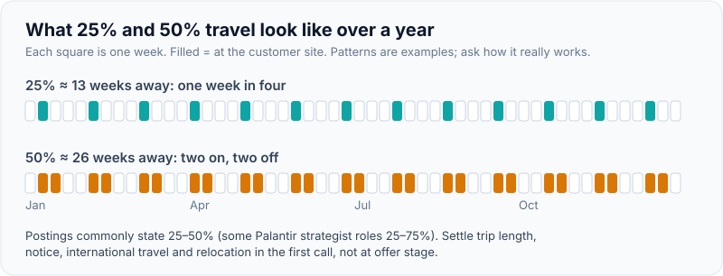

# "Why FDE, Why This Company", Travel, Level & Compensation Conversations

!!! abstract "Key takeaways"
    - **"Why FDE"** = a past pull (moments you loved working with users on real problems) + a forward pull (owning outcomes end to end and shaping a product) + evidence you understand the costs (ambiguity, travel, context switching). Avoid "it's the hottest job".
    - **"Why this company"** = their product surface + a deployment problem their customers face + a resume fact that shows you've solved a similar one + one specific, dated piece of research. If the answer works for any company, it's too generic.
    - **Travel:** FDE postings commonly state **25–50%** (some Palantir strategist roles 25–75%). Answer clearly in the recruiter screen; surprises at offer stage cost trust.
    - **Level:** with 9+ years and team leadership, target **senior FDE** (staff where scope supports it). Ask how levels map and how FDE impact is measured; Palantir avoids traditional ladders.
    - **Compensation:** ranges vary enormously by company, entity, country and level, and change quarterly. **Don't give a number first**; research bands (posted ranges, Levels.fyi), negotiate on total compensation, and get travel, relocation and equity terms in writing.

## Why it matters

Motivation questions bracket every FDE loop: the recruiter opens with "Why FDE?", and the hiring manager closes with "Why us, and why now?". Because the FDE role is demanding (customers, travel, ambiguity, on-call for someone else's systems), interviewers use these questions to filter out people chasing a trendy title. Weak answers here can sink an otherwise strong loop.

The practical conversations (travel, location, level, pay) are where many candidates either undersell themselves or create friction. FDE roles add complications that SWE roles don't have: travel percentages, customer-site work, sometimes security clearance or language requirements, variable structures at new deployment entities, and pay that differs by multiples across companies and countries.

## Core concepts

### "Why FDE": the three-part answer


*Notice that the answer moves from your history to the future and then proves itself with a story. Interviewers trust "I've done the hard parts and liked them" more than "I think I'd like it".*

{ loading=lazy }
*If you can swap in another company's name and the answer still works, rewrite it.*

Good themes for the past pull, from the resume:

- Owning an **integration layer** between 5 upstream systems: understanding each system's constraints and making them work together.
- Being the person who handles **stakeholder communication, release management and production support** as a lead.
- **Security and identity** work where you had to fit into an enterprise's rules (PingFederate, AD, IAM, KMS).
- **Building from zero**: the React application and micro-frontend architecture.

Forward-pull themes:

- **Ownership of the outcome**, not just the deliverable.
- **Product feedback loop**: turning field problems into platform improvements.
- **Building with LLMs** where the hard problems are integration, evaluation and trust, which matches your strengths.
- **Breadth**: many systems, domains and stakeholders.

### "Why this company": the four-part answer

| Part | What to say | Example scaffold |
|---|---|---|
| 1. Their product surface | What they sell and what the FDE ships | "Your FDEs build MCP servers, sub-agents and skills on Claude for large enterprises…" |
| 2. A customer deployment problem | A real gap their customers face | "…and the hard part in regulated customers is permission-aware access to data and security review…" |
| 3. Your matching evidence | One resume fact | "…which is the work I've done on OAuth2/PingFederate/AD and a 5-system integration layer in healthcare." |
| 4. Specific research | One dated, verifiable fact | "I read that you launched [X] in [month, year]; I'd like to understand how FDEs work with it." |

Plus, where honest, a **values** element: Anthropic interviews weight mission and safety alignment, Palantir asks about its mission and customers, OpenAI and Google about impact. Use their published values documents, not slogans.

### Why now

A short, honest reason: "I've spent five years in services delivery and leadership; the move to LLM-based products makes integration, security and deployment the bottleneck, and that's my strongest area. I want to be in the role where that matters most." Avoid: "AI is going to replace normal engineering jobs."

### Travel and location

What postings say (2025–26):

| Company | Travel stated in postings | Notes |
|---|---|---|
| Palantir FDSE | ~25–50% commonly | Deployment strategist postings 25–75% within country |
| OpenAI FDE | "Up to 50%" in several (Munich, NYC, London, DC Gov) | Tokyo: mainly within Japan; hybrid 3 days/week in office in several postings |
| Anthropic FDE | 25–50% to customer sites | Hybrid; offices incl. SF, NYC, Seattle, London, Munich |
| Google Cloud GECX FDE | "High-travel" | Some variants require local languages |
| Databricks, Scale | Varies; customer-site work expected | Ask |

**Location for a Pune-based candidate:** lab FDE roles are concentrated in the US, Europe and a few Asian hubs (Tokyo, Seoul, Singapore); India-based lab FDE roles are rare as of October 2026. Options: India-based FDE roles at platforms, AI-native startups and services firms (Bengaluru, Hyderabad, Delhi-NCR concentrate demand); relocation with visa sponsorship (some Anthropic and OpenAI postings mention relocation or sponsorship); or roles serving APAC customers. Your own willingness to relocate, travel internationally and the notice you need are *[confirm]* items to settle before the first recruiter call.


*Notice that every branch is resolved in the first conversation. The worst outcome is agreeing vaguely and renegotiating at offer stage.*

{ loading=lazy }
*Half the year away is what 50% means; decide before the recruiter call, not at offer stage.*

### Level

- **Years are not levels.** Companies level on scope and impact. With 9+ years, leading 8–10 engineers and owning a critical integration service, a **senior** FDE level is the natural target; **staff** needs evidence of multi-team or multi-customer impact and setting technical direction.
- **Palantir** postings stress "multiple pathways to success rather than traditional career ladders" and merit-based progression; ask how scope and pay grow.
- **Labs and platforms** (OpenAI, Anthropic, Google, Databricks, Scale) post FDE roles at several levels (e.g. Scale: FDAE, Senior, Staff, Manager, Director). Ask which level the req is, and how the interview calibrates level (often the system design and behavioral rounds).
- **IC vs management:** many FDE roles are IC. If you've been a lead, state that you want IC FDE work and how you'd use leadership skills with customer teams.

### Compensation: what the data says (dated, cautious)

| Source / company | Figure | Basis and caveat |
|---|---|---|
| Palantir FDSE (US) | Levels.fyi FDSE total comp ≈ $171K–$295K, median ≈ $207K; posted NYC base ≈ $135K–$200K | Levels.fyi self-reports and posted bands, 2026 |
| OpenAI FDE (US) | Posted base ≈ $185K–$300K + equity in one Sept 2026 analysis; other reports "up to $280K" base | From postings; equity terms vary; Deployment Company terms may differ |
| Anthropic FDE | US postings ≈ $200K–$320K base; Munich ≈ €205K–€220K; London ≈ £225K–£255K | Aggregator copies of postings; verify on anthropic.com |
| Databricks FDE (US) | ≈ $161K–$226K base + equity (Oct 2025 listing) | Single listing |
| Scale AI | ≈ $179K–$224K (FDAE); Staff ≈ $252K–$315K | Aggregator listings |
| India (market) | Very wide: Glassdoor ≈ ₹9.5–18 LPA typical (few reports, July 2026); CIEL HR (reported) ≈ ₹35–45 LPA entry, ₹70–90 LPA experienced specialists | Title used inconsistently in India; small samples; secondary sources |

!!! warning "Use ranges to prepare, not to quote"
    These figures come from postings, Levels.fyi and secondary reports, gathered in 2025–26. Bands change quarterly, US postings don't apply to India-based roles, and new deployment entities may have different equity. Before any compensation conversation, check the live posting's band (many US states require it), Levels.fyi for the company and level, and recent offers in your network.

### Negotiation mechanics

1. **Defer the number early:** "I'd like to understand the level and scope first. Could you share the band for this role?"
2. **If pushed,** give a researched range anchored on total compensation for the level, not your current salary.
3. **Negotiate the whole package:** base, equity (type, vesting, refreshers; liquidity at private companies), bonus, sign-on, relocation, visa, travel policy (class, per diem, comp time), remote/hybrid, start date.
4. **Level before money:** being levelled correctly is worth more than a few percent on base.
5. **Get FDE specifics in writing:** travel expectations, which entity employs you (core company vs deployment company vs partner), on-call expectations for customer systems.
6. **Competing offers** help, honestly stated. Never invent one.

See also [Questions to ask the interviewer & salary conversations](../leadership-behavioral/12-questions-to-ask-the-interviewer-salary-role-conversations.md).

## In practice: answers

=== "❌ Common mistake"
    ```text
    Recruiter: "Why FDE?"
    "FDE is the hottest role in AI right now, and the pay is really good. I'm tired of
    consulting and want to work at an AI company. I can travel if needed I guess.
    My current CTC is X, so I'm looking for X plus 50%."
    - Trend and money as the reason; negative about current work.
    - Vague on travel ("I guess") - a red flag for a high-travel role.
    - Anchors on current salary and gives a number first.
    ```

=== "✅ Correct approach"
    ```text
    "Two reasons. The part of my work I've enjoyed most is making a system succeed
    inside a complex environment I don't control: I own a GraphQL integration layer in
    front of five upstream systems for a 750K-user healthcare app, and I'm the one who
    works through constraints and talks to stakeholders when things move. FDE is that
    job with ownership of the outcome and a direct line back into the product.
    Second, with LLMs the bottleneck is now integration, security and evaluation, not
    the model, and that's where my experience is strongest.
    On travel: yes, I'm comfortable with the 25-50% in the posting [confirm]. Could you
    tell me what travel has looked like for the team recently?
    On compensation: I'd like to understand the level first. Could you share the band?"
    ```

A "why this company" builder to fill in per application:

```yaml
why_this_company:
  company: "<name>"
  product_surface: "<what FDEs ship there, from the posting>"
  customer_problem: "<a deployment gap their customers face>"
  my_evidence: "<one resume fact, e.g. OAuth2/PingFederate/AD at OptumRx>"
  dated_research: "<e.g. 'Deployment Company launched May 2026'>"
  values_link: "<one value from their published values that you genuinely share, with a story>"
  why_now: "<one sentence>"
  questions_for_them:
    - "How many accounts does an FDE carry, and how much of the week is coding?"
    - "What did travel look like for the team last quarter?"
    - "How do field learnings reach product? A recent example?"
    - "Which entity would employ me, and how are level and equity set?"
```

## Real-world usage

- **Recruiters screen hard on travel and location** for FDE roles because the job fails without customer presence; several postings state travel percentages up front and require local languages (Japanese for Tokyo, Mandarin for some Google roles).
- **Motivation in the hiring-manager round** often probes "What will you find hardest about this job?". Strong answers name a real cost (context switching across customers, travel fatigue, being the face of product gaps) and how you'll manage it.
- **Compensation structures differ by entity.** In 2026 OpenAI and Anthropic set up separate deployment businesses with external investors; equity and pay structures there may differ from the core company's. Ask.
- **India market:** demand is rising (CIEL HR reported ~130% hiring growth in a year, strongest at 5–8 years' experience), but titles and pay are inconsistent, so compare roles on content, not title.

## Trade-offs & production gotchas

| Approach | Pros | Cons | Use when |
|---|---|---|---|
| Give your expected number early | Saves time if far apart | Anchors low; loses leverage | Only if the band is already public and you're inside it |
| Ask for the band first | Keeps leverage; shows professionalism | Some recruiters push back | Default |
| Negotiate base only | Simple | Leaves equity, sign-on, relocation on the table | Rarely |
| Negotiate level first | Biggest long-term effect | Needs evidence of scope | When you believe you're under-levelled |
| Accept vague travel | Avoids friction now | Misery or conflict later | Never |

!!! warning "Gotcha: comparing CTC across countries and entities"
    An Indian CTC and a US total comp figure aren't comparable without cost of living, taxes, equity liquidity and currency. And an "FDE at OpenAI" offer might come from the core company, the Deployment Company or a partner firm. Compare offers on the same basis: annualised cash, realistic equity value, and the work itself.

!!! tip "Interview angle"
    End the "why" answers with a question that shows you understand the role's costs ("What did travel look like last quarter?", "How do you protect FDEs from becoming a free consultancy?"). It turns a motivation check into a two-way conversation.

## How this connects to my experience

- **Where I used it:** motivation comes from resume facts: integration-layer ownership (OptumRx Meteor), stakeholder communication and production support as lead, enterprise security and identity, building from zero (React app). The resume also shows **interviewing others**, so you can speak about how motivation is assessed from the other side.
- **Talking points:**
    - "Why FDE": the integration layer + stakeholder ownership story, then "LLMs make integration and trust the bottleneck".
    - "Why this company": prepare one per target (Anthropic, OpenAI, Google Cloud, Databricks, Palantir, an India-based option) using the builder above *[confirm target list]*.
    - Travel and location: decide your real answer (travel %, international travel, relocation from Pune, visa needs) *[confirm]*.
    - Level: target senior FDE; prepare evidence of multi-team impact (5 upstream teams, architects, standards) for a staff conversation *[confirm scope]*.
    - Compensation: current CTC and expectations are private; research the band for each role before the recruiter call *[confirm your target range]*.
- **Likely follow-up chain:** "Why FDE?" → "What will you find hardest?" → "You're a lead now; why go back to IC?" → "What are your compensation expectations?". Answer: the integration story; context switching and travel, with how you'll manage them; ownership and building with LLMs, with leadership used to enable customer teams; ask for the band and discuss total compensation for the level.

## Interview questions

### Fundamentals

??? question "Q1. Why do you want to be a Forward Deployed Engineer?"
    **Answer:** Past pull (integration-layer ownership, stakeholder work, production support), forward pull (owning outcomes, shaping product, LLM deployments where integration and trust are the bottleneck), awareness of costs, and one story as evidence.

    **Interviewer listens for:** genuine pull, role understanding, evidence.

    **Common wrong answer:** "It's the hottest job" or "better pay".

??? question "Q2. Why this company?"
    **Answer:** Product surface + customer deployment problem + matching resume evidence + one dated piece of research (and values, where honest). Specific enough that it wouldn't work for a competitor.

    **Interviewer listens for:** research depth and fit.

    **Common wrong answer:** "You're a leader in AI."

??? question "Q3. Are you comfortable with 25–50% travel?"
    **Answer:** A clear yes, or clear conditions stated now, plus a question about how travel actually works on the team *[confirm your answer]*.

    **Interviewer listens for:** clarity, no hedging.

    **Common wrong answer:** "I guess, if needed."

??? question "Q4. What are your compensation expectations?"
    **Answer:** "I'd like to understand the level and scope first. Could you share the band for this role?" If pressed: a researched total-compensation range for the level, based on posted bands and market data, not current salary.

    **Interviewer listens for:** professionalism and preparation.

    **Common wrong answer:** a number based on a percentage hike over current CTC.

### Intermediate

??? question "Q5. What do you think you'll find hardest about being an FDE?"
    **Answer:** Name a real cost, e.g. context switching between customer priorities and product work, or being the face of product gaps to a frustrated customer, and how you'll manage it (clear scope briefs, timeboxing, honest communication, escalation paths), ideally with a story where you handled something similar.

    **Interviewer listens for:** self-awareness.

    **Common wrong answer:** "Nothing; I'm adaptable."

??? question "Q6. Why leave a lead role for an IC FDE role?"
    **Answer:** Ownership of outcomes directly with customers, building with LLMs, and the product loop. Leadership skills carry over: leading customer teams, enabling their engineers, aligning stakeholders. Show you still code *[confirm]*.

    **Interviewer listens for:** genuine IC appetite.

    **Common wrong answer:** "It's a step to management at your company."

??? question "Q7. What level do you think you should be, and why?"
    **Answer:** Senior, based on scope: leading 8–10 engineers, owning a critical integration service across 5 upstream teams, setting engineering standards. Open to the company's calibration; ask what distinguishes senior from staff for FDEs there.

    **Interviewer listens for:** scope-based reasoning, openness.

    **Common wrong answer:** "Staff, because I have 9 years."

??? question "Q8. Why now?"
    **Answer:** LLMs have shifted the bottleneck to integration, security and deployment, which is your strongest area, and you've built the LLM skills to match *[confirm]*. Five years in services delivery have prepared you for the customer half.

    **Interviewer listens for:** timing logic.

    **Common wrong answer:** fear-driven ("AI will replace normal jobs").

### Senior

??? question "Q9. Which other companies are you interviewing with, and why?"
    **Answer:** Honest at the category level ("FDE roles at AI labs and data platforms"), consistent with your "why this company" logic, and specific about what draws you to this one. You needn't name companies.

    **Interviewer listens for:** coherence of your search.

    **Common wrong answer:** naming everyone, or claiming they're your only option.

??? question "Q10. How would you evaluate an FDE offer from a lab's deployment company versus its core team?"
    **Answer:** Closeness to product and research, number and type of deployments, equity and pay structure, career path, travel, and stability of a new entity. Ask each for specifics before deciding.

    **Interviewer listens for:** clear criteria about a 2026 market reality.

    **Common wrong answer:** "Same company, same thing."

??? question "Q11. Our team values mission alignment. What does our mission mean to you?"
    **Answer:** Use the company's published mission and values, connect one value to a real story (e.g. careful handling of sensitive health data, or security work on key management), and be honest about what you're still learning. Don't recite slogans.

    **Interviewer listens for:** authenticity.

    **Common wrong answer:** reading back the website.

### Scenario-based

??? question "Q12. The recruiter says the band tops out below your expectation. What do you do?"
    **Answer:** Ask whether the level is fixed and what the full package looks like (equity, sign-on, refreshers). Make the case for a higher level with scope evidence if justified. If the gap remains, decide on what matters (work, learning, trajectory) and be willing to walk away politely.

    **Interviewer listens for:** calm, structured negotiation.

    **Common wrong answer:** accepting immediately or issuing ultimatums.

??? question "Q13. You receive an offer with vague travel terms. What do you ask for?"
    **Answer:** Expected percentage, typical trip length, domestic vs international, notice, travel class and per diem, comp time, and who decides. Get it in writing or in the offer discussion summary.

    **Interviewer listens for:** practical thinking.

    **Common wrong answer:** signing and hoping.

??? question "Q14. You're based in Pune and the role is in London or San Francisco. How do you handle it?"
    **Answer:** Be clear about willingness to relocate and timeline, ask about visa sponsorship and relocation support, and whether the team supports APAC customers from a nearer hub. Raise it in the first call *[confirm your relocation stance]*.

    **Interviewer listens for:** clarity and realism.

    **Common wrong answer:** avoiding the topic until the offer.

## Cheat sheet

| Question | Formula |
|---|---|
| Why FDE | Past pull + forward pull + costs understood + one story |
| Why this company | Product surface + customer problem + my evidence + dated research (+ values) |
| Why now | LLMs moved the bottleneck to integration and trust, my strongest area |
| Travel | Clear yes / clear conditions in the first call; ask how it works in practice |
| Level | Scope, not years; senior target; ask what separates senior from staff |
| Comp | Ask for the band; total comp; level first; whole package; in writing |
| Market (dated 2026) | Palantir FDSE TC ≈ $171K–$295K (Levels.fyi); OpenAI base ≈ $185K–$300K; Anthropic US base ≈ $200K–$320K; India very wide |
| Never | "Hottest job"; vague travel; current-CTC anchoring; invented offers |

## Sources
1. [OpenAI careers: FDE (London)](https://openai.com/careers/forward-deployed-engineer-london/), [Tokyo](https://openai.com/careers/forward-deployed-engineer-tokyo/) and [Washington DC (Gov)](https://openai.com/careers/forward-deployed-engineer-gov-washington-dc/): travel up to 50%, hybrid, language requirements.
2. [Anthropic FDE posting (Greenhouse)](https://job-boards.greenhouse.io/anthropic/jobs/5302966008): travel 25–50%, requirements, posted ranges.
3. [Palantir FDSE posting (Lever)](https://jobs.lever.co/palantir/b46312f7-89c8-4447-bf01-931e45243d1a) and [Palantir Deployment Strategist posting](https://jobs.lever.co/palantir/e0ab8226-b928-4e3a-bf87-08fe7b1ea595): travel, career-path language.
4. [Levels.fyi: Forward Deployed Software Engineer](https://www.levels.fyi/t/software-engineer/title/fdse/locations/united-kingdom.md) and [Levels.fyi: Palantir](https://www.levels.fyi/companies/palantir/salaries/software-engineer/levels/software-engineer): self-reported compensation.
5. [Valletta Software: FDE salary in 2026](https://vallettasoftware.com/blog/post/forward-deployed-engineer-salary): OpenAI posted base analysis (secondary).
6. [Databricks FDE (Built In listing)](https://builtin.com/job/forward-deployed-engineer-fde/8023905) and [Scale AI FDAE (Built In listing)](https://builtin.com/job/forward-deployed-engineer/6934349): posted bands (aggregators).
7. [Glassdoor India: FDE salaries](https://www.glassdoor.co.in/Salaries/forward-deployed-engineer-software-development-engineer-salary-SRCH_KO0,55.htm) and [CXOToday: CIEL HR on FDE demand](https://cxotoday.com/ai/ai-boom-fuels-130-surge-in-demand-for-forward-deployed-engineers-ciel-hr/): India market (small samples, secondary).
8. [Google Careers: FDE, Generative AI, Google Cloud](https://google.com/about/careers/applications/jobs/results/83353124541997766): high-travel GECX role, language variants.
9. [OpenAI: OpenAI launches the Deployment Company](https://openai.com/index/openai-launches-the-deployment-company): separate deployment entity.
10. [Exponent: The FDE interview loop](https://www.tryexponent.com/courses/forward-deployed-engineering/intro-fde-interviews/fde-loop): recruiter screen content (prep site).
