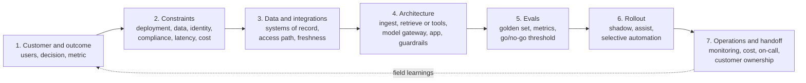
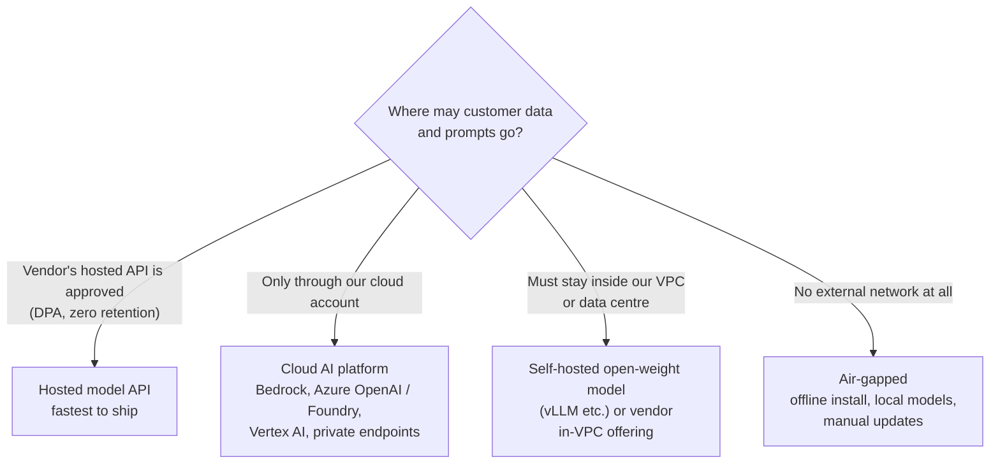
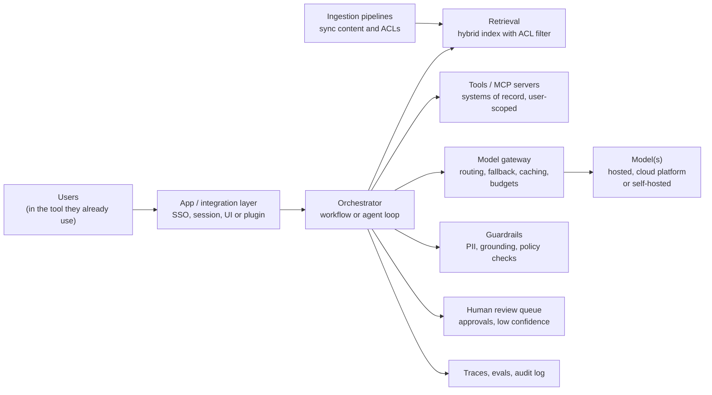
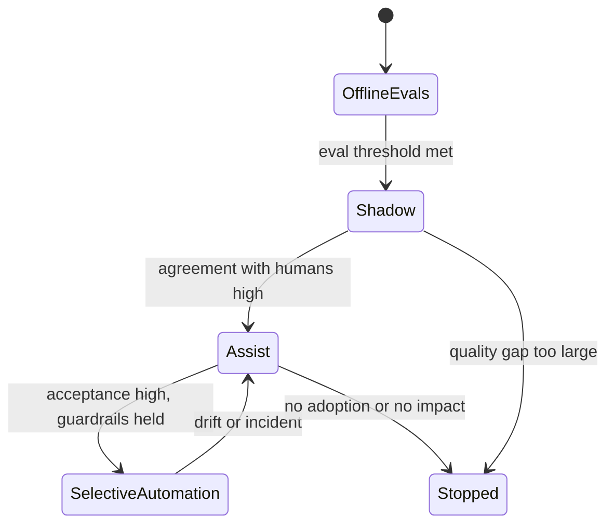

# FDE System Design Framework: Customer Context, Deployment Constraint, Rollout Plan

!!! abstract "Key takeaways"
    - The FDE system design round is **not a scale contest**. Most enterprise AI systems serve thousands of users, not billions. The hard parts are **customer context, data access, identity, security review, evals, rollout and ownership**.
    - Use a fixed seven-step spine: **Customer & outcome → Constraints → Data & integrations → Architecture → Evals → Rollout → Operations & handoff**. Spend the first 8–10 minutes on the first two; they decide everything else.
    - **The deployment constraint shapes the architecture.** "Hosted API is fine", "must run through our AWS account (Bedrock)", "must stay in our VPC" and "air-gapped" are four different designs. Ask early, and ask who signs off.
    - **No design is complete without an eval plan and a rollout plan.** Name the eval set, the go/no-go threshold, and the stages: offline evals → shadow → assist (human decides) → selective automation.
    - Close with **operations**: monitoring (quality, latency, cost), the failure modes you expect, who is on call, and how the customer's team takes ownership.

## Why it matters

Most FDE loops include a design round, and candidates who have practised big-tech system design often fail it in a predictable way: they start drawing load balancers and sharding schemes for a system whose real problem is that the data lives in SharePoint behind Active Directory groups, the CISO hasn't approved any external model provider, and nobody has agreed what "good" looks like.

Interviewers in these rounds play a customer or a hiring manager who knows the customer. They're listening for whether you can turn a vague business ask into something that would **actually ship inside that customer's environment**, and whether you know where AI systems fail in production: retrieval and permissions, evaluation, cost, and trust. The prompts are usually one of a few archetypes (knowledge assistant, workflow agent with approvals, document extraction, support agent, operational dashboard), each covered on its own page in this topic. This page is the spine you hang every one of them on.

The [interview loop page](../fde-role-interview-loop/03-the-fde-interview-loop-mapped-screens-take-home-practical-co.md) describes the round's format; the [decomposition topic](../fde-decomposition-scoping/index.md) covers the framing skill this page builds on.

## Core concepts

### Big-tech design round vs FDE design round

| Dimension | Big-tech SWE round | FDE round |
|---|---|---|
| Opening | Functional + non-functional requirements, scale estimates | **Who the customer is, which decision changes, how success is measured** |
| Hard part | Throughput, storage, partitioning, consistency | **Data access and permissions, deployment environment, evals, adoption** |
| Typical scale | Millions of QPS, petabytes | Hundreds of users to tens of thousands; a few QPS at peak |
| Model of the world | You own the whole stack | You integrate with **systems you don't own** and must pass the customer's security review |
| "Done" | Architecture that scales | Architecture **plus an eval plan, a rollout plan and an owner** |
| Common failure | Missing a bottleneck | Designing a chatbot nobody is allowed to deploy |

Scale still matters for cost and latency (an LLM call is slow and expensive compared with a database query), so do a quick back-of-envelope estimate. It just isn't the headline.

### The seven-step spine


*Notice that the architecture is step 4 of 7. Steps 1–3 decide it, and steps 5–7 are what make it deployable. The dashed arrow is the next use case at the same customer.*

A time budget for a 45–60 minute round:

| Minutes | Step | Output on the whiteboard |
|---|---|---|
| 0–5 | Customer and outcome | One user, one decision, one metric with a baseline |
| 5–10 | Constraints | 5–8 bullets, including the deployment constraint and who signs off |
| 10–15 | Data and integrations | Systems of record, access method, volumes, freshness, permissions |
| 15–30 | Architecture | One diagram; then deep-dive the riskiest component |
| 30–38 | Evals | Eval set source, metrics, threshold, how it runs in CI |
| 38–45 | Rollout | Stages, pilot group, exit criteria |
| 45–50 | Operations and handoff | Monitoring, cost model, failure modes, owner |
| Remaining | Interviewer's twist | A changed constraint absorbed by the design |

### Step 1: customer and outcome

Ask the questions from [discovery](../fde-customer-discovery/01-discovery-interviews-workflow-mapping-hidden-constraints-res.md), compressed:

- **Who uses it, and what do they do today?** "Claims handlers, 300 of them, searching four systems and a 600-page policy manual."
- **Which decision or task changes?** "Deciding whether a claim needs a clinical review."
- **How will we know it worked?** "Handling time from ~14 to ≤9 minutes, with no rise in appeal rate (guardrail)."
- **What's the cost of a wrong answer?** This single question decides how much human review the design needs.

Say your assumptions out loud with a default: "I'll assume English-only and 300 users unless you say otherwise."

### Step 2: constraints, starting with deployment

Sweep the categories: **deployment, data, identity, compliance, latency, cost, timeline, people**. The deployment constraint goes first because it removes options fastest.


*Notice that each branch changes the model choice, the network design, the identity integration and the release process. Ask this in the first ten minutes, and ask who approves it (CISO, data protection officer, architecture board).*

Details of each option are on the [deployment models page](../fde-enterprise-deployment/01-deployment-models-hosted-api-vs-customer-vpc-vs-on-prem-and.md). Two facts worth knowing for the cloud-platform branch: Amazon Bedrock's documentation states that it doesn't store or log prompts and completions, doesn't use them to train AWS models and doesn't distribute them to third parties, and that model providers have no access to the accounts where their models are deployed. That is often what makes a security team say yes. Verify the equivalent terms for Azure and Vertex for the customer's specific region and features.

Other constraints to name explicitly:

| Category | Question that changes the design |
|---|---|
| Data | Where does the data live, who owns it, how fresh must it be, can we get a sample this week? |
| Identity | SSO provider (Entra ID, Okta, PingFederate)? Must answers respect per-user permissions? |
| Compliance | PHI / PCI / GDPR? Data residency? Audit requirements? |
| Latency | Interactive (seconds) or batch (minutes to hours)? |
| Cost | Is there a budget per user or per task? Who pays for tokens? |
| Timeline | Is there a real date (regulatory deadline, board meeting)? |
| People | Who maintains this after we leave? |

### Step 3: data and integrations

List the systems of record and how you'll reach each: API, database replica, file drop, change data capture, or an existing connector ([legacy integration patterns](../fde-data-integration/01-integrating-with-legacy-systems-of-record-databases-files-sf.md)). For each, note volume, freshness, the identity that reads it, and how permissions are represented. In AI designs the permission model is usually the deciding detail: if you can't say how a user's access is enforced at retrieval time, the design won't pass security review.

### Step 4: architecture

Most FDE designs are variations of one reference shape:


*Notice that the model is one box among many, and that permissions appear twice: on retrieval (ACL filter) and on tools (user-scoped access). Most production incidents come from the boxes around the model.*

Then **go deep on the riskiest component**, not the most familiar one. For a knowledge assistant that's permission-aware retrieval; for a workflow agent it's the approval gate and idempotent actions; for extraction it's evals and the human-review threshold. The interviewer will usually push on it anyway; going there first shows judgement.

Start with a **workflow, not an agent**, unless the task needs open-ended decisions. Anthropic's *Building effective agents* puts it plainly: find the simplest solution possible and only increase complexity when needed; workflows give predictability for well-defined tasks, while agents trade latency and cost for flexibility. See [agents in production](../fde-applied-llm/04-agents-in-production-tool-use-mcp-servers-sub-agents-skills.md).

### Step 5: evals

Say where the eval set comes from (real, de-identified cases labelled by the customer's experts), what you measure (retrieval recall, answer correctness and groundedness, field-level accuracy, task success), the threshold agreed with the sponsor, and that it runs on every prompt, model or retrieval change ([evals page](../fde-applied-llm/05-evals-golden-datasets-llm-as-judge-retrieval-vs-answer-metri.md)). Mention the confidence interval: 46/50 is anywhere from about 81% to 97%.

### Step 6: rollout


*Notice the backwards arrow. Automation is earned per slice and can be withdrawn; a rollout plan that only goes forwards isn't a plan for an AI system.*

- **Offline evals** on the golden set.
- **Shadow mode:** the system runs on live traffic but nobody sees its output; compare with what humans did.
- **Assist:** humans see suggestions and decide; measure acceptance and edit rates.
- **Selective automation:** automate only slices where evals and the pilot showed it's safe, keep humans on the rest.

Pilot with one team and a comparison group, with a decision date booked ([pilots page](../fde-customer-discovery/03-pilot-to-proof-of-concept-to-production-time-boxing-exit-cri.md)).

### Step 7: operations and handoff

- **Monitoring:** one trace per request; quality (sampled online evals, user feedback), latency at p95, cost per task, error and refusal rates ([observability](../fde-applied-llm/07-llm-observability-latency-budgets-and-token-cost-control.md)).
- **Failure modes and fallbacks:** model outage → fallback route or graceful "I can't answer now"; retrieval empty → say so, don't guess; tool failure → retry with idempotency key, then human queue.
- **Ownership:** runbooks, on-call, and the customer team that will own it ([rollout and handoff](../fde-enterprise-deployment/07-production-rollout-monitoring-on-call-and-handoff-to-the-cus.md)).

### Back-of-envelope estimation for AI systems

Do it in one minute, out loud, with round numbers:

```text
Users 5,000 × 20 questions/day      = 100,000 requests/day
Over 8 working hours                ≈ 3.5 requests/s average, ~10/s peak (×3)
Tokens per request: 6,000 in, 400 out
Example price (Oct 2026, verify): $2 / $10 per 1M input / output tokens
Cost per request ≈ 6,000×2e-6 + 400×10e-6 = $0.012 + $0.004 = $0.016
Per day ≈ $1,600; per month (22 working days) ≈ $35,000 before caching
Prompt caching on a stable 4,000-token prefix cuts input cost sharply
```

The numbers tell you three things the interviewer cares about: whether rate limits matter (10 requests/s is fine for most provider quotas, but check), whether cost needs a lever (caching, routing to a smaller model), and whether output length dominates latency (400 output tokens is often 3–5 seconds without streaming).

## In practice: running the round

### The opening: wrong vs right

=== "❌ Common mistake"
    ```text
    Interviewer: "A bank wants an AI assistant for its operations staff."
    Candidate:   "Sure. I'd use a vector database, chunk the documents into 512 tokens,
                  embed them with an embedding model, put an API Gateway in front, Lambda
                  behind it, and use GPT for generation. For scale I'd shard the vector DB..."
    - No user, no decision, no metric.
    - No deployment constraint: can the bank even send data to that API?
    - No permissions: operations staff can't all see the same documents.
    - Scale talk for a system with a few requests per second.
    ```

=== "✅ Correct approach"
    ```text
    Candidate: "Before I draw anything, three quick questions. Who are the users and what
      task takes them longest today? ... Reconciliation analysts, 400 of them, searching
      procedures and past cases. How would the business measure success? ... Time to resolve
      a break. I'll assume a baseline we'd measure in week one. And where is the bank
      comfortable sending data: a vendor API, its own AWS account, or nothing outside its
      network? ... AWS only, via Bedrock. Last one: do all analysts see all documents? ...
      No, desk-level entitlements in AD groups.
      So: an assistant inside their case tool, hybrid retrieval with an AD-group filter,
      Bedrock in their account, evals on 200 real breaks labelled by senior analysts, and a
      pilot with one desk in shadow mode first. Let me draw it, then go deep on the
      entitlement filter, because that's what the security review will focus on."
    ```

### A one-page answer template

Write this skeleton on the whiteboard as you go; it doubles as your summary at the end.

```yaml
design:
  customer: "<who>, <how many users>, <task today>"
  outcome: "<metric> from <baseline> to <target> by <date>; guardrail: <what must not get worse>"
  cost_of_error: "<low | medium | high> -> <human review policy>"
  constraints:
    deployment: "<hosted API | cloud platform | VPC | air-gapped>, approved by <who>"
    data: "<systems of record>, <freshness>, <sample available when>"
    identity: "<SSO>, permissions enforced at <retrieval | tool | both>"
    compliance: "<PHI/PCI/GDPR>, <residency>, <audit>"
    latency_cost: "<p95 target>, <budget per task>"
  architecture: "<workflow | agent>; components: ingest, retrieve/tools, gateway, guardrails, HITL, audit"
  deep_dive: "<riskiest component and why>"
  evals: "<source of cases>, <metrics>, <threshold>, <CI gate>"
  rollout: "offline -> shadow -> assist -> selective automation; pilot <team>, decision <date>"
  operations: "<traces, dashboards, alerts>, <fallbacks>, <owner and handoff>"
  open_questions: ["<to confirm with customer>"]
```

### Handling the twist

Interviewers almost always change a constraint near the end: "Legal says data can't leave the EU", "the CISO won't approve any external model", "now it has to take actions, not just answer". Handle it the way you handle a [hidden constraint in a simulation](../fde-customer-discovery/06-customer-simulation-round-role-play-scenarios-and-how-they-a.md): acknowledge it, ask its edges, then show which boxes change. A good design absorbs a twist by swapping one component (the model gateway's backend, an approval step on a tool) rather than being redrawn.

## Real-world usage

- **AWS Well-Architected Generative AI Lens** (April 2025) organises guidance for generative AI workloads across the six Well-Architected pillars and a lifecycle from scoping through model selection, customisation, integration, deployment and iteration. It's a useful checklist for steps 2, 6 and 7, and a vocabulary AWS-centric customers recognise.
- **Accountability for AI answers is the deployer's.** In *Moffatt v. Air Canada* (2024 BCCRT 149), the tribunal held the airline liable for a chatbot's incorrect description of its bereavement-fare policy and rejected the argument that the chatbot was a separate entity. The practical lesson for design rounds: grounding, citing the authoritative source and escalation paths are not optional extras.
- **Pilot purgatory** is the common failure mode for enterprise AI: demos built on clean sample data that never pass security review or never meet a quality bar on real data. Steps 2, 5 and 6 exist to prevent it.
- **Domains:** healthcare (prior authorisation, clinical documentation, claims), banking (operations, KYC, complaints) and the public sector dominate FDE work because the data is sensitive and the systems are old, which is exactly where the constraint and permission steps carry the most weight.

## Trade-offs & production gotchas

| Choice | Pros | Cons | Use when |
|---|---|---|---|
| Workflow (fixed steps) | Predictable, testable, cheaper | Less flexible | The task has a known shape (most enterprise tasks) |
| Agent (model chooses steps) | Handles open-ended tasks | Harder to evaluate, costlier, needs strong guardrails | Steps genuinely vary per case and tools are safe or gated |
| Hosted model API | Fastest, newest models | Data leaves the customer boundary | Approved by security; non-regulated or contract covers it |
| Cloud AI platform in customer account | Fits existing cloud contract, IAM, private networking | Model and feature lag vs vendor API; quotas per region | Regulated customer already on that cloud |
| Self-hosted open weights | Full control, data never leaves | You own GPUs, scaling, safety, upgrades | Hard residency or air-gap requirement |

!!! warning "Gotcha: designing the happy path only"
    The interviewer is waiting for failure handling: empty retrieval, a wrong answer that sounds confident, a tool call that times out after doing the work, a model outage, a cost spike, a permission change that hasn't synced yet. Name at least three failure modes and what the system does in each, unprompted.

!!! tip "Interview angle"
    State your deep-dive choice and the reason: "I'll spend the next ten minutes on permission-aware retrieval because it's the component most likely to block go-live." That one sentence shows prioritisation better than any diagram.

## How this connects to my experience

- **Where it applies:** not a resume claim as a framework, but the steps map onto real work. On OptumRx Meteor (Publicis Sapient) I *"owned the GraphQL Consumer Service end-to-end, acting as the integration layer between 5 upstream systems and multiple downstream consumers"* and *"built secure enterprise APIs using OAuth2, PingFederate, and Active Directory integration"*: steps 3 and 4 (integrations, identity). *"Led sprint planning, estimation, stakeholder communication, release management, and production support"*: steps 6 and 7.
- **Talking points:**
    - "Healthcare taught me to ask about data and identity first: PHI decides where things can run and who can see what." *[confirm: one design decision on Meteor that PHI or PingFederate/AD forced]*
    - Deloitte ConvergeHealth on AWS (*"IAM, KMS, and Secrets Manager"*, Terraform) is the cloud-platform branch of the deployment decision: deploying into an account with its own IAM and encryption controls.
    - CCKM (Coriolis) gives credibility on customer-managed keys across AWS, Azure and GCP, which comes up in security reviews of AI systems.
    - Be honest about the gap: no production LLM system on the resume yet *[confirm]*; the framework is how I'd apply the same delivery discipline.
- **Likely follow-up chain:** "Walk me through a system you designed" → "What constraints shaped it?" → "How would you add an AI feature to it for this customer?" → "How would you roll it out safely?". Answer with the GraphQL integration layer (upstreams, identity, caching), then the seven steps applied to an assistant over that data, permission-aware via existing OAuth2 scopes, rolled out shadow → assist.

## Interview questions

### Fundamentals

??? question "Q1. How does an FDE system design round differ from a standard system design round?"
    **Answer:** The standard round centres on scale: throughput, storage, partitioning, consistency. The FDE round centres on deployment inside a specific customer: who the users are, what decision changes, where data may go, how permissions are enforced, how quality is evaluated, how it's rolled out and who owns it. Scale still matters for cost and latency, but it's rarely the bottleneck for an enterprise AI system with a few requests per second.

    **Interviewer listens for:** customer, constraints, evals, rollout and ownership as first-class parts of the design.

    **Common wrong answer:** Treating it as a scaling exercise and leading with sharding.

??? question "Q2. What are the first questions you ask in an AI system design round?"
    **Answer:** Who uses it and for which task; how success is measured, with a baseline; the cost of a wrong answer; where data and prompts may go (hosted API, the customer's cloud, VPC, air-gapped) and who approves that; and whether answers must respect per-user permissions. Each answer removes whole classes of design.

    **Interviewer listens for:** the deployment and permission questions early, and the cost-of-error question.

    **Common wrong answer:** "How many users and what QPS?" as the only opening.

??? question "Q3. What are the components of a typical enterprise LLM application?"
    **Answer:** An app or integration layer with SSO; an orchestrator (workflow or agent loop); retrieval with ACL filtering and ingestion pipelines that sync content and permissions; tools or MCP servers over systems of record with user-scoped access; a model gateway (routing, fallback, caching, budgets); guardrails (PII, grounding, policy); a human review queue; and traces, evals and an audit log.

    **Interviewer listens for:** the boxes around the model, and permissions appearing in two places.

    **Common wrong answer:** "Vector DB plus LLM."

??? question "Q4. Why does the deployment constraint come so early?"
    **Answer:** Because it changes model choice, network design, identity integration and release process all at once. A hosted API, a cloud platform in the customer's account, a self-hosted model in their VPC and an air-gapped install are four different architectures with different timelines. Discovering it at minute 40 means redrawing everything.

    **Interviewer listens for:** knowing the four branches and who signs off.

    **Common wrong answer:** Assuming a public API is always allowed.

### Intermediate

??? question "Q5. How do you decide between a workflow and an agent?"
    **Answer:** Default to a workflow (fixed steps, LLM calls inside them) when the task has a known shape, because it's predictable, testable and cheaper. Use an agent only when the steps genuinely vary per case and the tools are safe or gated. Anthropic's guidance is to find the simplest solution and add complexity only when needed; often a single well-built LLM call with retrieval is enough.

    **Interviewer listens for:** simplicity first, with a reason to escalate.

    **Common wrong answer:** "Agents are more powerful, so always use an agent."

??? question "Q6. How do you estimate cost for an LLM feature in the round?"
    **Answer:** Users × requests per user per day × tokens per request (input and output separately) × price per token, then per month. Example: 100,000 requests/day × (6,000 input, 400 output) at $2/$10 per million ≈ $1,600/day before caching. Then name levers: cache the stable prefix, trim context, route simple tasks to a smaller model, batch non-interactive work.

    **Interviewer listens for:** input/output split, a monthly figure, and levers.

    **Common wrong answer:** No numbers, or cost per request without volume.

??? question "Q7. What goes into the rollout plan for an AI system?"
    **Answer:** Offline evals on a golden set, then shadow mode on live traffic, then assist mode where humans decide, then selective automation of slices that earned it, with the ability to move back. A pilot team plus a comparison group, a decision date, exit criteria and readiness gates (security review, SSO, monitoring, support owner) started in week one.

    **Interviewer listens for:** staged autonomy and reversibility.

    **Common wrong answer:** "Deploy to everyone and monitor."

??? question "Q8. Which component do you deep-dive, and how do you choose?"
    **Answer:** The riskiest one, meaning the one most likely to block go-live or cause harm, and say why. For a knowledge assistant: permission-aware retrieval. For an agent: approvals and idempotent actions. For extraction: evals and the review threshold. For a dashboard: identity resolution across systems.

    **Interviewer listens for:** explicit prioritisation.

    **Common wrong answer:** Deep-diving the part you know best regardless of risk.

### Senior

??? question "Q9. How do you design for failure in an LLM system?"
    **Answer:** List the failure modes and the behaviour for each: empty or weak retrieval → say so and offer the source search; low-confidence or ungrounded answer → abstain or route to a human; tool timeout → retry with the same idempotency key, then queue; model outage or 429 → fallback route that's already approved for the data, else graceful degradation; cost spike → per-tenant budgets and alerts; permission change → ACL sync SLA plus a late check for sensitive sources.

    **Interviewer listens for:** concrete behaviours and approved fallbacks.

    **Common wrong answer:** "We'll add retries."

??? question "Q10. How do you make a design survive a change of model provider or deployment environment?"
    **Answer:** Put a thin model gateway between the app and providers, keep prompts and routing in versioned config, use structured outputs as contracts, keep retrieval and tools independent of the model, and gate every model change on the eval suite. Then moving from a hosted API to a cloud platform or a self-hosted model swaps one backend, plus a re-run of evals.

    **Interviewer listens for:** reversibility and evals as the gate.

    **Common wrong answer:** Provider SDK calls scattered across the codebase.

??? question "Q11. Who owns the system after go-live, and how do you design for that?"
    **Answer:** Agree it up front: usually the customer's platform or application team, with the vendor on escalation. Design for their skills: their cloud, their CI/CD, their monitoring stack, infrastructure as code, runbooks, dashboards they already read, and a handover period with shared on-call. A system only the FDE can operate is a hero dependency.

    **Interviewer listens for:** ownership as a design input.

    **Common wrong answer:** "We'll support it."

### Scenario-based

??? question "Q12. Halfway through your design, the interviewer says the CISO won't approve any external model. What do you do?"
    **Answer:** Acknowledge it, then ask the edges: does a model hosted in their own cloud account count as external, is there an approved list, is it all data or only PHI? If cloud-platform models in their account are allowed, swap the gateway backend to Bedrock, Azure or Vertex with private endpoints. If nothing outside the VPC is allowed, move to a self-hosted open-weight model, re-run evals (quality may drop), and adjust timeline and GPU cost. The rest of the design stays.

    **Interviewer listens for:** absorbing the constraint by swapping one component.

    **Common wrong answer:** Arguing for an exception.

??? question "Q13. The interviewer asks, 'How do you know this will work before we spend six months on it?'"
    **Answer:** A two-week proof on a de-identified sample of their real data that tests the riskiest assumption (usually retrieval quality or extraction accuracy), measured on an eval set their experts label, with a go/no-go threshold agreed in advance. Then a pilot with one team in shadow and assist mode against a baseline.

    **Interviewer listens for:** the riskiest assumption tested first, on real data, with a threshold.

    **Common wrong answer:** "We'll build an MVP and see."

??? question "Q14. You've drawn the architecture with ten minutes left. What do you cover?"
    **Answer:** Evals (source, metrics, threshold), the rollout stages and pilot, the top three failure modes and their handling, a cost estimate, and who owns it. Then summarise from the template and list open questions for the customer.

    **Interviewer listens for:** finishing with deployability, not more boxes.

    **Common wrong answer:** Adding a caching layer and a message queue.

## Cheat sheet

| Concept | Remember |
|---|---|
| Spine | Customer → Constraints → Data → Architecture → Evals → Rollout → Operations |
| First questions | Users, decision, metric, cost of error, where data may go, permissions |
| Deployment branches | Hosted API · cloud platform in their account · VPC self-hosted · air-gapped |
| Reference shape | App + SSO → orchestrator → retrieval (ACL) / tools (user-scoped) → gateway → model; guardrails, HITL, audit |
| Deep dive | The riskiest component, and say why |
| Default | Workflow before agent |
| Estimate | Requests/day × tokens in/out × price → $/month; then levers |
| Rollout | Offline evals → shadow → assist → selective automation; reversible |
| Failure modes | Empty retrieval, confident wrong answer, tool timeout, outage, cost spike, stale ACL |
| Close | Template summary + open questions + owner |

## Sources
1. [Anthropic: Building effective agents](https://www.anthropic.com/engineering/building-effective-agents): workflows vs agents, start simple, stopping conditions, human checkpoints.
2. [AWS Well-Architected Framework: Generative AI Lens](https://docs.aws.amazon.com/wellarchitected/latest/generative-ai-lens/generative-ai-lens.html) and [announcement](https://aws.amazon.com/blogs/architecture/announcing-the-aws-well-architected-generative-ai-lens): lifecycle and pillar guidance for generative AI workloads (April 2025).
3. [Amazon Bedrock: Data protection](https://docs.aws.amazon.com/bedrock/latest/userguide/data-protection.html): prompts and completions not stored, not used for training, providers without access.
4. [AWS Security Blog: Authorizing access to data with RAG implementations](https://aws.amazon.com/blogs/security/authorizing-access-to-data-with-rag-implementations/): why RAG needs authorization at retrieval, LLM as untrusted.
5. [Moffatt v. Air Canada, 2024 BCCRT 149 (summary, American Bar Association Business Law Today)](https://businesslawtoday.org/topic/ethics/page/19) and [CX Today report](https://www.cxtoday.com/conversational-ai/court-orders-air-canada-to-pay-out-for-chatbots-bad-advice/): deployer liability for chatbot answers.
6. [OpenAI: A practical guide to building agents (summary)](https://www.maginative.com/article/how-to-build-ai-agents-a-detailed-practical-guide-from-openai/): layered guardrails, human intervention for high-risk actions and failure thresholds (April 2025).
7. Related pages in this knowledge base: [deployment models](../fde-enterprise-deployment/01-deployment-models-hosted-api-vs-customer-vpc-vs-on-prem-and.md), [evals](../fde-applied-llm/05-evals-golden-datasets-llm-as-judge-retrieval-vs-answer-metri.md), [pilots](../fde-customer-discovery/03-pilot-to-proof-of-concept-to-production-time-boxing-exit-cri.md).
