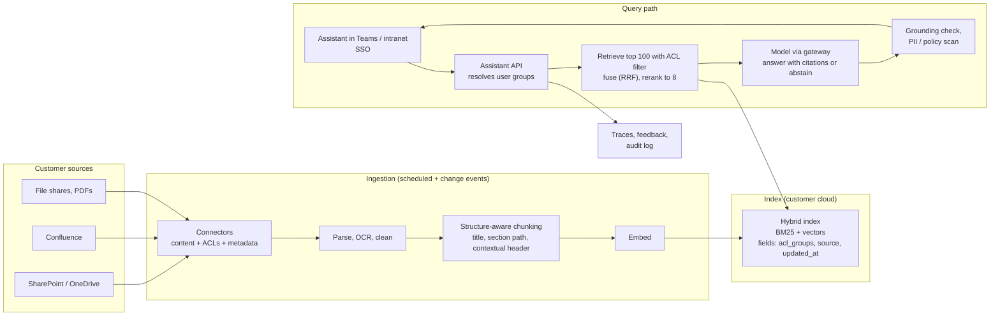
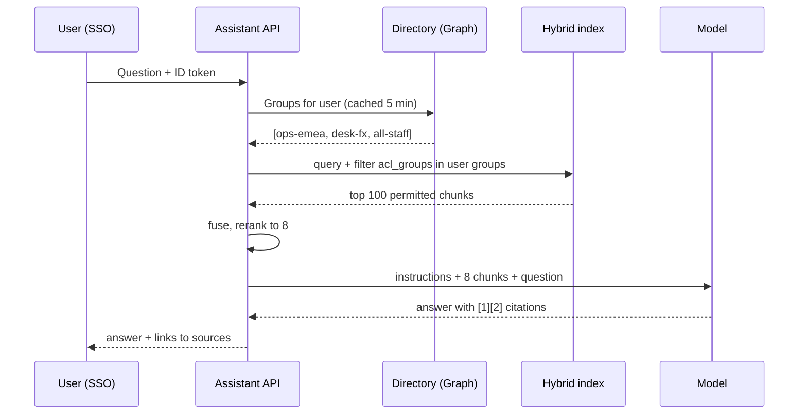
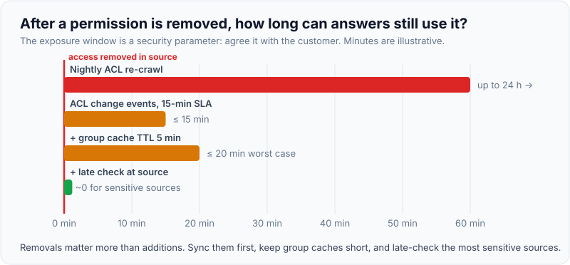
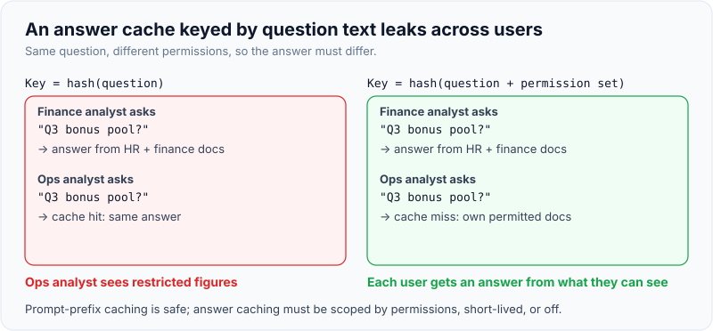

# Case: Enterprise Knowledge Assistant (RAG over Internal Docs with Access Control)

!!! abstract "Key takeaways"
    - The prompt sounds easy ("a ChatGPT for our documents"); the round is decided by **permissions, freshness, citations and evals**, not by which vector database you pick.
    - **Authorise at retrieval, as the end user.** Index each chunk with its ACL (users and groups from the source system), filter inside the index query using the user's groups from the SSO token, and treat the LLM as untrusted: anything in the prompt may come back to the user.
    - **Hybrid retrieval + reranking** (BM25 for codes, IDs and names; vectors for paraphrase; fused and reranked) and **structure-aware chunking** with titles and section paths. Measure retrieval separately from answers.
    - **Answers cite their sources and abstain** when retrieval is weak. Freshness and deletion are pipeline requirements with SLAs, including ACL changes.
    - Roll out to one department, measure deflected questions and time-to-answer against a baseline, and watch the **"no answer" rate** and citation accuracy as the leading signals.

## Why it matters

The internal knowledge assistant is the most common first deployment for enterprise AI and the most common FDE design prompt: "Our 5,000 operations staff can't find anything in SharePoint. Build us an assistant." It's popular because it has obvious value and looks simple. It's dangerous for the same reason. The naive design (crawl everything with a service account, embed, retrieve the top five chunks, answer) leaks HR documents to junior staff, quotes last year's policy, invents procedures when retrieval misses, and can't tell anyone why it said what it said.

The AWS Security Blog makes the core point well: a search engine returns links, and the source system checks permissions when the user clicks. RAG returns **content**, synthesised by a model, so permission checks must happen before the content ever reaches the model.

The underlying techniques are on the [production RAG page](../fde-applied-llm/03-production-rag-chunking-hybrid-search-reranking-permission-a.md). This page shows how to assemble them into a design you can defend in 45 minutes.

## Core concepts

### Step 1–2: customer, outcome and constraints (the questions to ask)

| Ask | Why it changes the design | Default if unanswered |
|---|---|---|
| Who are the users and which questions waste their time today? | Scope of corpus, UX surface | Ops staff; procedures, policies, past cases |
| What does success look like? | Metric and baseline | Time to answer, questions escalated to SMEs, satisfaction |
| Which sources? (SharePoint, Confluence, file shares, ticket history, PDFs) | Connectors, ACL models, volume | SharePoint + Confluence, ~2M documents |
| Do all users see all documents? | **Permission-aware retrieval** | No: AD/Entra groups per site and folder |
| How fresh must answers be? | Sync frequency, ACL sync SLA | Content within 1 hour; permission removals within 15 minutes |
| Where may data go? | Model and hosting | Customer's cloud account (Bedrock / Azure / Vertex) |
| Languages, attachments, scanned PDFs? | OCR, multilingual embeddings | English, some scanned PDFs |
| Cost of a wrong answer? | Abstention, citations, review | Medium: wrong procedure → rework or compliance issue |

**Outcome statement to write on the board:** "Reduce time to find an answer for operations analysts from a ~12-minute baseline (measured in week one) to under 3 minutes, with citation accuracy ≥ 95% and no permission leaks, in a pilot with one desk of 150 people."

### Back-of-envelope

```text
Corpus: 2M documents × ~10 chunks = 20M chunks
Embeddings: 20M × 1,024 dims × 4 bytes ≈ 80 GB raw vectors (before index overhead;
            quantisation can cut this several times)
Queries: 5,000 users × 10/day = 50,000/day ≈ 2/s average, ~6/s peak
Per query: ~8 chunks × 400 tokens + instructions ≈ 4,000 input tokens, ~300 output
```

So: storage and indexing cost matter more than query QPS, and the initial ingestion (OCR, chunking, embedding 20M chunks) is a project in itself. Plan it as a backfill with throttling against the source systems' API limits.

### The architecture


*Notice that ACLs travel with the content from connector to index, and the filter is applied inside the index query. Unauthorised chunks never reach the API, the prompt, the logs or the model.*

### Deep dive 1: permission-aware retrieval (the riskiest component)

This is where to spend the most time, because it's what blocks security approval.

1. **Ingest ACLs with content.** Connectors read each document's permissions (users and groups) and store them as a filterable field on every chunk. Expand nested groups at ingestion or resolve them at query time; be explicit about which.
2. **Resolve the user at query time.** From the SSO token (Entra ID / Okta / PingFederate), get the user's ID and group memberships. Large group counts are a known challenge: Entra ID tokens include a groups overage indicator when a user is in too many groups, in which case you fetch groups from Microsoft Graph.
3. **Filter inside the index query (pre-filter).** Azure AI Search's documented pattern is a string collection field of principals and a `search.in` filter, which performs far better than long chains of `eq`. Amazon Bedrock Knowledge Bases support metadata filtering for the same purpose. Post-filtering (retrieve then drop) both leaks content into your application and starves the answer of relevant chunks.
4. **Keep ACLs fresh.** Permission removals matter more than additions. Sync ACL changes on a short SLA, and for the most sensitive sources consider a **late check** against the source system (or a grants service such as S3 Access Grants, which AWS describes for exactly this) before content is passed to the model.
5. **Never use a super-user to answer.** Indexing with a service account is fine; answering must be scoped to the user.


*Notice the cache on group lookups: short enough that removals propagate quickly, long enough to keep latency down. State the TTL as a security decision, not a performance tweak.*

{ loading=lazy }
*The exposure window is a number to agree with security, not an accident of the sync schedule.*

!!! warning "Gotcha: the answer cache"
    A response cache keyed only on the question text will serve one user's answer, built from documents they could see, to another user who can't. Scope any cache by the user's permission set (or by a hash of the retrieved document IDs plus the groups), or don't cache answers at all.

{ loading=lazy }
*Same question, different permissions: the cache key must know the difference.*

### Deep dive 2: chunking, retrieval and answering

- **Chunk by structure:** headings, sections, tables (row-wise with headers repeated). Keep a breadcrumb (`Doc title > Section > Subsection`) and add a short contextual header per chunk when chunks are ambiguous on their own; Anthropic's contextual retrieval experiments reported large reductions in retrieval failures when combined with BM25 and reranking.
- **Hybrid retrieval:** BM25 finds exact terms (form numbers, product codes, people's names); vectors find paraphrases. Fuse with reciprocal rank fusion, then rerank the top 50–150 with a cross-encoder and send the best 5–10.
- **Prompt:** answer only from the provided sources, cite them by number, say "I couldn't find this in the documents you have access to" when the sources don't cover the question. Put stable instructions first so they can be cached.
- **Grounding check:** verify that cited passages support each claim (an NLI model or LLM judge on sampled traffic; mandatory for high-risk answer types).
- **Freshness:** prefer the newest version when documents conflict, show the document date in the citation, and exclude archived content by default.

### Deep dive 3: evals

| Layer | Metric | How |
|---|---|---|
| Retrieval | Recall@k, MRR on a labelled set | 200–300 real questions with the documents SMEs say answer them |
| Answer | Correctness, groundedness (faithfulness), citation accuracy | Binary LLM judges validated against SME labels, plus SME spot checks |
| Permissions | **Zero tolerance** leak test | Synthetic users in different groups ask questions whose answers sit in restricted documents; any leak fails the build |
| Abstention | Correct "I don't know" rate | Questions whose answers aren't in the corpus |
| Online | Thumbs up/down, no-answer rate, escalations to SMEs | Dashboards, weekly review of failures |

Every change to chunking, embeddings, prompts or models runs the suite in CI ([evals](../fde-applied-llm/05-evals-golden-datasets-llm-as-judge-retrieval-vs-answer-metri.md)).

### Rollout

1. **Week 0–2:** connectors for two sources, ACL ingestion, 300-question eval set built with SMEs, permission leak tests green.
2. **Week 3–4:** shadow: SMEs answer real questions with and without the assistant; compare.
3. **Week 5–8:** pilot with one desk (150 users) in the tool they already use (Teams, the intranet), comparison desk without it; measure time to answer and SME escalations.
4. **Expand by source and department**, each new source with its own ACL tests.

## In practice: code & configuration

### Wrong vs right retrieval call

=== "❌ Common mistake"
    ```python
    # Retrieve with a service account, filter afterwards, cache by question text.
    def answer(question: str, user: User) -> str:
        if (hit := cache.get(question)):                  # leaks across users
            return hit
        chunks = index.search(question, top_k=5)          # no ACL filter: sees everything
        chunks = [c for c in chunks if user.can_read(c)]  # post-filter: HR text already loaded,
                                                          # and maybe 0 chunks left
        text = llm(f"Answer: {question}\n\n{chunks}")      # no citations, no abstention
        cache[question] = text
        return text
    ```

=== "✅ Correct approach"
    ```python
    def answer(question: str, user: AuthenticatedUser) -> Answer:
        groups = directory.groups_for(user.id)            # from SSO / Graph, short TTL cache
        candidates = index.hybrid_search(                 # BM25 + vectors, fused with RRF
            query=question,
            top_k=100,
            filter={"acl_groups": {"any_of": groups},     # pre-filter INSIDE the index query
                    "status": "current"},
        )
        top = reranker.rerank(question, candidates)[:8]
        if not top or top[0].score < MIN_RELEVANCE:
            return Answer.abstain("I couldn't find this in the documents you can access.",
                                  suggestions=search_links(question, groups))
        result = llm.generate(
            system=ANSWER_RULES,                          # stable prefix: cacheable
            sources=[s.as_cited_block(i + 1) for i, s in enumerate(top)],
            question=question,
            schema=AnswerWithCitations,                   # structured: claims + source ids
        )
        if not grounding.supported(result, top):
            return Answer.abstain("I'm not confident in this answer.", sources=top)
        audit.log(user=user.id, question_hash=hash(question),
                  doc_ids=[s.doc_id for s in top], model=llm.version)
        return result
    ```

### Index schema (illustrative, Azure AI Search style)

```json
{
  "name": "kb-chunks-v3",
  "fields": [
    {"name": "id", "type": "Edm.String", "key": true},
    {"name": "doc_id", "type": "Edm.String", "filterable": true},
    {"name": "title_path", "type": "Edm.String", "searchable": true},
    {"name": "content", "type": "Edm.String", "searchable": true},
    {"name": "content_vector", "type": "Collection(Edm.Single)", "dimensions": 1024},
    {"name": "acl_groups", "type": "Collection(Edm.String)", "filterable": true},
    {"name": "source", "type": "Edm.String", "filterable": true, "facetable": true},
    {"name": "updated_at", "type": "Edm.DateTimeOffset", "filterable": true, "sortable": true},
    {"name": "status", "type": "Edm.String", "filterable": true}
  ]
}
```

Query filter: `acl_groups/any(g: search.in(g, 'ops-emea,desk-fx,all-staff'))`. Version the index name and switch an alias when you change chunking or embeddings, so you can roll back.

## Real-world usage

- **Cloud platforms ship the building blocks:** Azure AI Search documents security trimming with principal fields and `search.in`, plus newer preview support for preserving source ACLs at ingestion; Amazon Bedrock Knowledge Bases support metadata filtering, and AWS publishes patterns for authorising RAG results with S3 Access Grants. In a customer engagement, using these is usually faster to approve than a new vector database.
- **Microsoft 365 Copilot** made "oversharing" a mainstream concern: assistants surface whatever a user technically has access to, so badly permissioned SharePoint sites become visible. Many deployments start with a permissions clean-up. Raise this in discovery: the assistant respects permissions; it doesn't fix them.
- **Healthcare and banking:** policy manuals, clinical protocols and operational procedures are high-value corpora, but answers must cite the authoritative, current version, and some content (patient data, HR, M&A) must never appear for most users.

## Trade-offs & production gotchas

| Option | Pros | Cons | Use when |
|---|---|---|---|
| Managed RAG (Bedrock KB, Azure AI Search + Foundry, Vertex AI Search) | Fast, fits the customer's cloud and IAM | Less control over chunking and ranking; connector limits | First deployment in that cloud |
| Custom pipeline (own chunking, hybrid index, reranker) | Full control and tuning | More to build and operate | Quality bar not met by managed; unusual sources |
| Long context instead of RAG | Simple for a small, stable corpus | Can't scale to millions of documents; per-user permissions still needed | A few hundred pages shared by everyone |
| Pre-filter by ACL | No leakage; full top-k of permitted content | Needs ACL ingestion and sync | Always for permissioned corpora |
| Late check at the source | Strongest freshness of permissions | Extra latency and source load | Highly sensitive sources |

!!! warning "Gotcha: deleted and superseded documents"
    A document deleted in SharePoint must disappear from the index on the same SLA as a permission removal, and a superseded policy must not outrank the current one. Track deletes in the connector, store `status` and `updated_at`, and include "answered from an old version" as a failure category in evals.

!!! tip "Interview angle"
    When the interviewer asks "which vector database?", answer in one sentence ("whatever the customer's cloud offers that supports hybrid search and filters, for example Azure AI Search or OpenSearch") and move to permissions and evals. Spending five minutes on vector database trade-offs is a signal you're optimising the wrong thing.

## How this connects to my experience

- **Where I used it:** not an LLM assistant, but the two hardest parts are on the resume. At Deloitte (ConvergeHealth Data Asset Explorer): *"Implemented Elasticsearch-powered search capabilities"* and *"secure data discovery platforms"* with *"IAM, KMS, and Secrets Manager"*: the BM25 half of hybrid search and access-controlled discovery. At OptumRx Meteor: *"Built secure enterprise APIs using OAuth2, PingFederate, and Active Directory integration"*: resolving user identity and groups for the ACL filter.
- **Talking points:**
    - "I've built the search side: index design, analysers, filters. Hybrid search adds vectors and rank fusion on top." *[confirm: Elasticsearch features you built, e.g. analysers, relevance tuning, filters by entitlement]*
    - "I'd resolve AD groups from the SSO token exactly as our APIs enforced OAuth2 scopes, and filter in the index query. The model never decides access."
    - *[confirm: whether the Data Asset Explorer restricted search results by user entitlements, and how]*
- **Likely follow-up chain:** "How do you enforce permissions?" → "A permission was removed 10 minutes ago; can the user still get the answer?" → "How do you prove there are no leaks?" → "Answer: pre-filter on synced ACLs; removal SLA plus a late check for sensitive sources; a zero-tolerance leak test suite with synthetic users in CI."

## Interview questions

### Fundamentals

??? question "Q1. Why can't you rely on the source system's permissions the way a search engine does?"
    **Answer:** A search engine returns links, and the source system checks permissions when the user opens the document. RAG returns synthesised content, so if an unauthorised chunk reaches the model, its content can appear in the answer without the source ever being asked. Authorisation has to happen before retrieval results reach the prompt.

    **Interviewer listens for:** content vs links; the model as untrusted.

    **Common wrong answer:** "The LLM will only show what the user is allowed to see."

??? question "Q2. Pre-filtering or post-filtering for permissions?"
    **Answer:** Pre-filter inside the index query using the user's groups. Post-filtering loads unauthorised content into the application (logs, caches, prompts), and can leave you with zero relevant chunks after filtering. Pre-filtering returns a full top-k of permitted content.

    **Interviewer listens for:** leakage and recall reasons.

    **Common wrong answer:** "Post-filter, it's simpler."

??? question "Q3. How do you chunk a 300-page policy manual?"
    **Answer:** By structure: headings and sections, tables row-wise with headers repeated, a breadcrumb of document title and section path on every chunk, and a short contextual header if chunks are ambiguous alone. Keep metadata (document ID, version, date, ACL). Evaluate chunk size against retrieval recall rather than picking a number.

    **Interviewer listens for:** structure-aware chunking and metadata.

    **Common wrong answer:** "Fixed 512-token chunks."

??? question "Q4. Why hybrid search for an enterprise corpus?"
    **Answer:** Enterprise questions mix exact terms (form numbers, product codes, people, error codes) that embeddings handle poorly, with paraphrased questions that keyword search misses. BM25 plus vectors, fused with reciprocal rank fusion and reranked, covers both.

    **Interviewer listens for:** a concrete exact-term example.

    **Common wrong answer:** "Vectors understand meaning, so BM25 is obsolete."

### Intermediate

??? question "Q5. How do you keep the index in sync with sources, including deletes and permission changes?"
    **Answer:** Incremental sync via change APIs or events where available, scheduled delta crawls otherwise; deletes and ACL changes processed with a stricter SLA than content edits; a versioned index with an alias for re-embedding; a reconciliation job that compares source and index counts. For very sensitive content, a late permission check at query time.

    **Interviewer listens for:** deletes and ACLs as first-class, with SLAs.

    **Common wrong answer:** "Re-crawl nightly."

??? question "Q6. How do you make the assistant say 'I don't know' instead of guessing?"
    **Answer:** A relevance threshold after reranking below which it abstains and offers search links; instructions to answer only from sources and cite them; a grounding check that rejects unsupported claims; and evals that include unanswerable questions so abstention is measured and tuned.

    **Interviewer listens for:** a mechanism, not just a prompt line.

    **Common wrong answer:** "Tell the model not to hallucinate."

??? question "Q7. How do you evaluate this system before go-live?"
    **Answer:** A labelled set of 200–300 real questions with the documents that answer them (retrieval recall@k, MRR); answer correctness, groundedness and citation accuracy with validated judges and SME review; unanswerable questions for abstention; and a zero-tolerance permission leak suite using synthetic users in different groups. All in CI.

    **Interviewer listens for:** retrieval vs answer metrics and the leak test.

    **Common wrong answer:** "Users will give thumbs up or down."

??? question "Q8. How would you cache to reduce cost without leaking data?"
    **Answer:** Prompt caching of the stable instruction prefix is safe. Response caching must be scoped to the permission set (e.g. key includes a hash of the user's groups or of the retrieved document IDs), with short TTLs and invalidation on document change, or not used for permissioned content.

    **Interviewer listens for:** permission-scoped keys.

    **Common wrong answer:** "Cache answers by question text."

### Senior

??? question "Q9. A user's access to a confidential folder was removed ten minutes ago. Can they still get answers from it?"
    **Answer:** Depends on the ACL sync SLA and group-cache TTL, which is why both are security parameters agreed with the customer. Design: removals processed within minutes via change notifications, group lookups cached briefly, and for the most sensitive sources a late check against the source or a grants service before the chunk enters the prompt. State the residual window explicitly in the security review.

    **Interviewer listens for:** an explicit, bounded window and mitigations.

    **Common wrong answer:** "No, permissions are enforced."

??? question "Q10. Long-context models take a million tokens. Why still build RAG?"
    **Answer:** The corpus is millions of documents, far beyond any context window; per-user permissions require selecting content per user anyway; cost and latency scale with input tokens; and citations need identifiable sources. Long context is great for a small, stable, shared corpus with prompt caching, or for reading the retrieved documents in full.

    **Interviewer listens for:** scale, permissions, cost and citations.

    **Common wrong answer:** "RAG is obsolete."

??? question "Q11. The customer's SharePoint permissions are a mess. What do you do?"
    **Answer:** Say it early: the assistant respects permissions; it doesn't fix them, and it will surface oversharing. Run an access report on the pilot sources, agree a clean-up or an allow-list of sources for the pilot, exclude sensitive libraries by default, and involve the data owners. Make this a readiness gate.

    **Interviewer listens for:** treating it as a customer-side prerequisite.

    **Common wrong answer:** Building a separate permission model in the assistant.

### Scenario-based

??? question "Q12. Users say the assistant can't answer questions about specific form numbers. What's wrong?"
    **Answer:** Likely vector-only retrieval, which handles exact identifiers poorly, or chunking that separated form numbers from their content. Check retrieval recall on those questions, add BM25 to a hybrid search, make sure identifiers survive parsing and are in chunk metadata, and add these questions to the eval set.

    **Interviewer listens for:** diagnosing retrieval before changing the model.

    **Common wrong answer:** "Use a bigger model."

??? question "Q13. A security reviewer asks how you guarantee a nurse can't see answers drawn from HR documents. What do you say?"
    **Answer:** HR chunks carry HR-group ACLs from ingestion; the query filter uses the nurse's groups from the SSO token, inside the index query, so HR chunks are never retrieved; the model only sees permitted chunks; caches are permission-scoped; a leak test suite with synthetic users runs in CI; and the audit log records which document IDs fed each answer.

    **Interviewer listens for:** defence in layers, with evidence.

    **Common wrong answer:** "The system prompt tells it not to reveal HR information."

??? question "Q14. Two documents give conflicting answers (an old and a new policy). How does the system behave?"
    **Answer:** Prefer current documents via `status` and `updated_at` (filter or boost), show document dates in citations, and when sources still conflict, say so and cite both rather than picking silently. Add conflicting-version cases to evals and raise stale content with the document owners.

    **Interviewer listens for:** recency handling and transparency.

    **Common wrong answer:** "The model will figure it out."

## Cheat sheet

| Concept | Remember |
|---|---|
| Hard parts | Permissions, freshness, citations, evals |
| Permissions | ACLs indexed with chunks; user groups from SSO; pre-filter in the index query; LLM untrusted |
| Freshness | Deletes and ACL removals on a short SLA; late check for sensitive sources |
| Retrieval | Structure-aware chunks + breadcrumb; BM25 + vectors; RRF; rerank top 50–150 → 5–10 |
| Answering | Cite sources, abstain below threshold, grounding check |
| Cache | Prefix caching OK; answer cache scoped by permissions or not at all |
| Evals | Recall@k, groundedness, citation accuracy, abstention, zero-tolerance leak test |
| Rollout | Two sources → shadow with SMEs → one-desk pilot vs comparison → expand by source |
| Gotcha | The assistant exposes oversharing; it doesn't fix it |

## Sources
1. [AWS Security Blog: Authorizing access to data with RAG implementations](https://aws.amazon.com/blogs/security/authorizing-access-to-data-with-rag-implementations/): links vs content, LLM untrusted, S3 Access Grants pattern.
2. [Microsoft Learn: Security filters for trimming results in Azure AI Search](https://learn.microsoft.com/en-us/azure/search/search-security-trimming-for-azure-search) and [Document-level access overview](https://learn.microsoft.com/en-us/azure/search/search-document-level-access-overview): principal fields, `search.in`, preview ACL support.
3. [AWS ML Blog: Access control for vector stores using metadata filtering with Knowledge Bases for Amazon Bedrock](https://aws.amazon.com/blogs/machine-learning/access-control-for-vector-stores-using-metadata-filtering-with-knowledge-bases-for-amazon-bedrock): metadata filters for access control.
4. [Anthropic: Introducing Contextual Retrieval](https://www.anthropic.com/news/contextual-retrieval): contextual chunk headers with BM25 and reranking.
5. [Microsoft identity platform: groups overage claim](https://learn.microsoft.com/en-us/entra/identity-platform/id-token-claims-reference): group claims limits and fetching groups from Graph.
6. Related: [Production RAG](../fde-applied-llm/03-production-rag-chunking-hybrid-search-reranking-permission-a.md), [Enterprise identity](../fde-enterprise-deployment/02-enterprise-identity-sso-scim-rbac-and-permission-propagation.md), [Evals](../fde-applied-llm/05-evals-golden-datasets-llm-as-judge-retrieval-vs-answer-metri.md).
