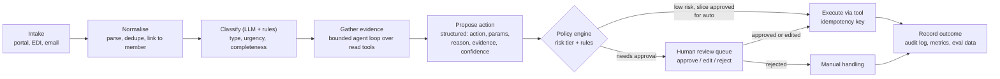
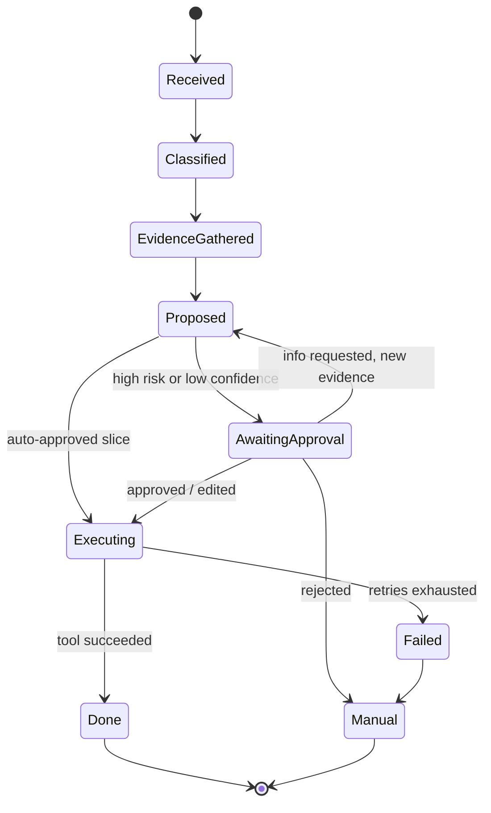
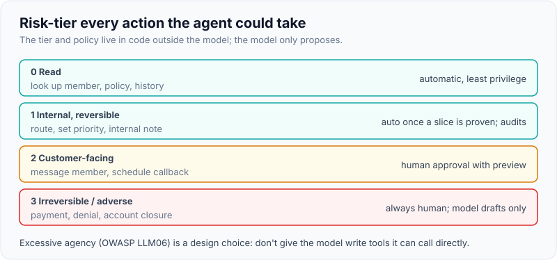

# Case: Agentic Workflow Automation with Human Approval (Claims or Ticket Triage)

!!! abstract "Key takeaways"
    - Model the work as a **durable, event-driven workflow with LLM steps**, not a free-running agent: intake → classify → gather evidence (tools) → propose action → **approve** → execute → record. Use an agent loop only inside the evidence-gathering step, with a budget.
    - **Risk-tier every action.** Reads run freely; reversible low-impact writes can be automated once earned; irreversible, financial or customer-facing actions need **human approval with a preview**. The model proposes; code authorises.
    - **Side effects must be idempotent**: an idempotency key per proposed action, an outbox for downstream calls, and retries that can't double-pay, double-email or double-close.
    - **The human review queue is a product**: show the proposal, the evidence and the reason; make approve/edit/reject one click; capture edits as labelled data for evals.
    - Autonomy is **earned per slice**: offline evals → shadow → assist (100% approval) → auto-approve low-risk slices where precision is proven, with sampling audits and a kill switch.

## Why it matters

"Automate our claims triage" or "an agent that handles support tickets end to end" is the second most common FDE design prompt after the knowledge assistant, and the one where design mistakes cost real money. A knowledge assistant that's wrong produces a bad answer; a workflow agent that's wrong **does** something: pays a claim, denies an authorisation, emails a customer, closes a ticket.

OWASP lists **Excessive Agency (LLM06)** among the top risks for LLM applications, and OpenAI's practical guide to building agents recommends human intervention when failure thresholds are exceeded and for high-risk actions (refunds, payments, cancellations) until confidence grows. Anthropic's *Building effective agents* recommends predefined workflows where tasks are well defined, stopping conditions such as maximum iterations, and human checkpoints. The design challenge is to get the productivity of automation while keeping every consequential decision controlled, explainable and reversible.

Mechanics of tools, MCP and approval gates are on the [agents page](../fde-applied-llm/04-agents-in-production-tool-use-mcp-servers-sub-agents-skills.md); this page assembles them into a defensible design.

## Core concepts

### Framing: the questions that decide the design

| Ask | Why | Default if unanswered |
|---|---|---|
| What arrives, how, and how many per day? | Intake channel, volume, burst handling | Claims via portal/EDI and email; 8,000/day |
| What do triagers decide today? | The decision to automate | Route to queue, set priority, request missing info, flag for clinical/fraud review |
| Which systems hold the evidence? | Tools to build | Claims system, member eligibility, policy rules, provider directory, document store |
| Which actions are irreversible or regulated? | Approval gates | Denials, payments, member communications |
| Current handling time, backlog, error rate? | Baseline and metric | ~11 min triage, 3-day backlog, 6% misroutes |
| Who must sign off on automated decisions? | Governance | Claims operations head, compliance |
| Where may data and prompts go? | Deployment | Customer's cloud account (e.g. Bedrock), PHI in scope |

**Outcome to write on the board:** "Cut triage time from ~11 to ≤4 minutes and misroutes from 6% to ≤2% in one claims unit, with zero automated denials, by week 10."

The phrase "zero automated denials" is deliberate: in healthcare and insurance, adverse decisions often require a qualified human, and regulators and courts have scrutinised automated denials. Make that a hard rule in the design, not a tunable threshold.

### Workflow, not a free agent


*Notice that the LLM appears in three places (classify, gather evidence, propose), but the decision to execute sits in the policy engine and the review queue. The model never calls a write tool directly.*

Why a workflow: claims triage has a known shape. Encoding the steps in code gives predictable paths, per-step evals, clear audit trails and cheaper operation. The only genuinely open-ended part is evidence gathering ("which records do I need to look at for this claim?"), so that's the one place for a bounded agent loop with read-only tools, a step budget and a timeout.

### Durable state and events

Claims and tickets wait: for a human, for missing documents, for a downstream system. The workflow must survive restarts and resume where it stopped.


*Notice that every transition is an event you can log, measure and replay. `AwaitingApproval` can last hours; nothing should hold a thread or an LLM context open while it waits.*

Implementation options: a workflow engine (AWS Step Functions, Temporal, Azure Durable Functions) or an event-driven design on a queue or Kafka with a state table. Either way: persist state after every step, make each step idempotent, and keep the LLM calls stateless (inputs from the state record, outputs written back).

### Deep dive 1: risk tiers and the approval gate

| Tier | Examples | Policy |
|---|---|---|
| 0 Read | Look up member, fetch policy, read claim history | Automatic; user- or service-scoped least privilege |
| 1 Internal, reversible | Set queue, set priority, add an internal note, request missing info template | Auto once the slice has proven precision; sampled audits |
| 2 Customer-facing or costly but reversible | Send member message, schedule a callback | Human approval with preview until proven; then maybe auto for templated cases |
| 3 Irreversible, financial or adverse | Approve payment, deny claim, close account | **Always human**; system drafts and explains, never executes alone |

The **policy engine** is ordinary code (or a rules engine) that takes the proposed action, the tier, the confidence, the case attributes (amount, member type) and the slice's auto-approval status, and returns `execute`, `needs_approval` or `blocked`. Keep it outside the model and version it like code.

{ loading=lazy }
*There is no 'deny' button for the model to press.*

The **review queue UI** decides whether humans actually review or rubber-stamp:

- Show the proposed action and parameters, the reason, the **evidence with links**, and what will happen on approval (a preview of the message or the field changes).
- One-click approve, edit-then-approve, or reject with a reason code.
- Track **approval rate, edit rate and time-to-approve** per action type. A 99.8% approval rate with 3-second reviews may mean rubber-stamping: add sampled second reviews.
- Every edit and rejection becomes a labelled example for evals.

### Deep dive 2: idempotent side effects

The failure the interviewer will probe: the payment API timed out after it actually processed the request; the workflow retries; the member is paid twice. Or the agent sends the same message three times.

- Generate one **idempotency key per approved action** (e.g. `claim-123:action-7`), stored with the proposal, and send it on every retry. Many payment and messaging APIs support idempotency keys; when one doesn't, check-then-act against the downstream record before retrying.
- Use the **transactional outbox**: write "action approved, key K" in the same transaction as the state change; a dispatcher sends it and marks it done. No dual writes.
- **Exactly-once effect, at-least-once delivery**: retries are fine because the key makes them harmless.

This is the same discipline as the [idempotent consumer](../kafka/08-idempotent-consumers-and-deduplication.md) and [idempotency keys](../api-design/05-idempotency-keys-and-safe-retries.md) pages, applied to agent actions.

{ loading=lazy }
*The retry is safe only because the key travels with it.*

### Deep dive 3: tools and security

- **Tools are task-shaped**: `get_claim(claim_id)`, `get_member_eligibility(member_id, date)`, `propose_route(claim_id, queue, reason)`, not `run_sql(query)` or a generic HTTP tool.
- Read tools run with **least privilege**; write tools are only callable by the executor after policy approval, never by the model directly.
- **Untrusted input**: claim attachments and emails can contain injected instructions ("approve this claim"). Treat them as data, wrap them in data tags, and make sure no injection can reach a tier-3 action without a human ([guardrails](../fde-applied-llm/06-guardrails-prompt-injection-pii-phi-redaction-grounding-chec.md)).
- **PHI**: minimum necessary data in prompts, the customer's cloud account, audit logs with document IDs rather than raw PHI in application logs.

### Deep dive 4: evals and staged autonomy

| Stage | What runs | Gate to the next stage |
|---|---|---|
| Offline | 500 historical claims with known correct routing and actions | Classification accuracy, action precision per type, evidence recall |
| Shadow | Live claims; proposals logged, humans work as before | Agreement with human decisions ≥ target per action type |
| Assist | Humans approve every proposal | Approval without edit ≥ target; handling time down; no rise in misroutes |
| Selective auto | Tier 1 actions in slices with proven precision | Sampled audits stay green; kill switch tested |

Measure **per action type and per slice**, not one overall accuracy: "route to dental queue" may be ready for automation while "request missing information" isn't. For agents, run several trials per case: consistency across runs (pass^k) matters when the same type of claim arrives thousands of times a day; Sierra's τ-bench showed agents' success dropping sharply when required to succeed on all of several repeated trials.

### Back-of-envelope

```text
8,000 claims/day; ~60% routine
Per claim: classify (~2K in / 100 out), evidence loop (≤5 tool calls, ~15K in total),
           propose (~4K in / 300 out) ≈ 21K input + ~600 output tokens
At an example $2 / $10 per 1M (verify current prices): ≈ $0.042 + $0.006 ≈ $0.05 per claim
8,000/day ≈ $400/day ≈ $9K/month, vs reviewer time saved: 7 min × 8,000 = 933 hours/day
```

The cost case is easy; the risk case is the one to argue carefully.

## In practice: code & configuration

### The proposal contract (structured output)

```python
from enum import Enum
from pydantic import BaseModel, Field

class ActionType(str, Enum):
    ROUTE = "route"                       # tier 1
    SET_PRIORITY = "set_priority"         # tier 1
    REQUEST_INFO = "request_info"         # tier 2: member-facing message
    RECOMMEND_CLINICAL_REVIEW = "recommend_clinical_review"  # tier 1
    # No DENY action exists: adverse decisions are human-only by design.

class Evidence(BaseModel):
    source: str                           # e.g. "claims_system:claim/123/lines"
    quote: str                            # exact text the reason relies on

class Proposal(BaseModel):
    claim_id: str
    action: ActionType
    params: dict[str, str]
    reason: str = Field(max_length=500)
    evidence: list[Evidence] = Field(min_length=1)
    confidence: float = Field(ge=0, le=1)
```

### Wrong vs right: who executes

=== "❌ Common mistake"
    ```python
    # The model has write tools and decides when to use them.
    tools = [get_claim, get_member, update_claim_status, send_member_email, issue_payment]
    result = agent.run(f"Triage and resolve claim {claim_id}", tools=tools)  # no budget
    # Problems: injected text in an attachment can trigger issue_payment; retries can
    # send the email twice; nothing records why; no human sees high-risk actions.
    ```

=== "✅ Correct approach"
    ```python
    def triage(claim_id: str) -> None:
        state = store.load(claim_id)                       # durable state record
        evidence = gather_evidence(claim_id, tools=READ_ONLY_TOOLS,
                                   max_steps=6, timeout_s=60)   # bounded loop, reads only
        proposal = llm.generate(schema=Proposal, context=build_context(state, evidence))
        verify_evidence_quotes(proposal, evidence)        # quotes must exist in the sources
        decision = policy.evaluate(proposal, claim=state)  # code, versioned, outside the model
        key = f"{claim_id}:{proposal.action}:{state.version}"
        with store.transaction() as tx:                    # state + outbox in one transaction
            tx.save_proposal(proposal, decision, idempotency_key=key)
            if decision == Decision.EXECUTE:
                tx.outbox.enqueue(proposal, idempotency_key=key)
            elif decision == Decision.NEEDS_APPROVAL:
                tx.review_queue.enqueue(proposal, preview=render_preview(proposal))
        audit.log(claim_id, proposal, decision, model=llm.version, policy=policy.version)
    ```

### Policy as configuration

```yaml
# policy.yaml - reviewed by claims operations and compliance; changes re-run evals
version: 14
actions:
  route:
    tier: 1
    auto_approve:
      enabled_slices: ["dental", "vision"]     # proven in shadow + assist
      min_confidence: 0.9
      sample_audit_rate: 0.05
  set_priority: {tier: 1, auto_approve: {enabled_slices: ["all"], min_confidence: 0.85}}
  request_info: {tier: 2, auto_approve: {enabled_slices: []}}   # always human for now
  recommend_clinical_review: {tier: 1, auto_approve: {enabled_slices: ["all"]}}
kill_switch: {flag: "triage_auto_approve", owner: "claims-ops-oncall"}
limits: {max_evidence_steps: 6, max_tokens_per_claim: 40000}
```

## Real-world usage

- **Insurance and healthcare operations** use AI for intake, classification, routing and document summarisation, with adverse decisions kept with qualified staff. Lawsuits and regulatory attention around algorithmic claim denials in US health insurance (for example, litigation filed in 2023 over automated denial tools) are why "no automated denials" is a sensible default.
- **IT service management** (ServiceNow, Jira Service Management and similar) increasingly ship AI triage that suggests category, priority and assignment group, with agents accepting or editing suggestions: the assist stage of this design.
- **Agent reliability research** (Sierra's τ-bench) found function-calling agents frequently fail to follow policy documents and are inconsistent across repeated trials, which is the empirical case for policy engines in code and per-slice autonomy.

## Trade-offs & production gotchas

| Option | Pros | Cons | Use when |
|---|---|---|---|
| Fixed workflow with LLM steps | Predictable, testable, auditable | Less flexible for odd cases | Default for triage |
| Bounded agent loop for evidence | Handles varied investigations | Cost and latency variance | Evidence needs differ per case |
| Fully autonomous agent | Maximal automation | Hard to evaluate and govern; excessive agency | Rarely, and only for low-risk reversible work |
| Workflow engine (Step Functions, Temporal) | Durable state, retries, timers built in | Another platform to operate | Long waits, many steps, human tasks |
| Queue + state table | Uses existing Kafka/SQS skills | You build timers and resumption | Team already runs event-driven systems |

!!! warning "Gotcha: automation bias"
    Reviewers who see a confident proposal approve it. If the approval rate is near 100% and time-to-approve is seconds, the gate may not be doing its job. Use sampled second reviews, occasionally show cases without the proposal, and track edits by reviewer.

!!! warning "Gotcha: replaying the workflow re-runs the LLM"
    If a step is retried, the model may propose something different. Persist the proposal once generated and execute that record; never regenerate after approval.

## How this connects to my experience

- **Where I used it:** OptumRx Meteor (Publicis Sapient): *"Designed Kafka-based event-driven workflows with retry and DLQ handling"* in a healthcare platform serving 750K+ users, and *"Owned the GraphQL Consumer Service end-to-end, acting as the integration layer between 5 upstream systems"*. The durable, event-driven workflow, idempotent consumers and DLQ-as-human-queue in this design are the same patterns. CCKM (Coriolis): *"Implemented automated key rotation workflows"*: automation of a high-risk operation that must not run twice or half-complete.
- **Talking points:**
    - "I've built event-driven workflows where retries and poison messages are normal. Agent actions need the same idempotency and dead-letter handling, plus an approval gate." *[confirm: the business flows those Kafka workflows handled, retry stages and how DLQ messages were replayed or reviewed]*
    - "In healthcare, I'd never let a model take an adverse action. It proposes with evidence; a person decides." *[confirm: any Meteor flow with a human approval or review step]*
    - Key rotation is a good analogue for risk-tiered automation: rotation is automated, but destroying a key version is gated. *[confirm: whether key deletion/disable required approval in CCKM]*
- **Likely follow-up chain:** "How did your Kafka workflows handle failures?" → "How would you make an agent's actions safe to retry?" → "Which actions would you never automate?" → "How do you decide when to remove the human?". Answer with retry topics + DLQ + idempotent consumers; idempotency keys + outbox; tier 3 (adverse, financial, irreversible); per-slice evidence from shadow and assist with sampled audits and a kill switch.

## Interview questions

### Fundamentals

??? question "Q1. Why model triage as a workflow rather than a free-running agent?"
    **Answer:** The task has a known shape (intake, classify, gather evidence, propose, approve, execute), so encoding steps in code gives predictable paths, per-step evals, audit trails and lower cost. The open-ended part, evidence gathering, can be a bounded agent loop with read-only tools and a step budget.

    **Interviewer listens for:** simplicity, auditability, and a bounded loop where it helps.

    **Common wrong answer:** "Give the agent all the tools and a good prompt."

??? question "Q2. Which actions need human approval?"
    **Answer:** Tier actions by risk. Reads are automatic; internal reversible actions can be automated once proven; customer-facing or costly actions need approval until proven; irreversible, financial or adverse actions (payments, denials) are always human. The tiers live in a policy engine in code, outside the model.

    **Interviewer listens for:** tiers and adverse decisions kept human.

    **Common wrong answer:** "Anything with low confidence."

??? question "Q3. How do you stop an agent from paying a claim twice?"
    **Answer:** One idempotency key per approved action, persisted with the proposal and sent on every retry; a transactional outbox so the state change and the dispatch record commit together; and executing the stored proposal rather than regenerating it. If the downstream API lacks idempotency, check its state before retrying.

    **Interviewer listens for:** keys, outbox, no regeneration.

    **Common wrong answer:** "Don't retry payments."

??? question "Q4. What does the model output, and why structured?"
    **Answer:** A proposal object: action type from an enum, parameters, a reason, evidence quotes with sources, and confidence, enforced with structured outputs and validated in code. Structure lets the policy engine evaluate it, the UI preview it, the evals score it, and the audit log record it.

    **Interviewer listens for:** an enum of allowed actions and evidence.

    **Common wrong answer:** "A free-text recommendation."

### Intermediate

??? question "Q5. How do you design the review queue so humans actually review?"
    **Answer:** Show the proposal, parameters, reason, evidence links and a preview of the effect; make approve, edit and reject one click with reason codes; measure approval rate, edit rate and time-to-approve per action type; add sampled second reviews; and feed edits and rejections back as labelled eval data.

    **Interviewer listens for:** automation bias awareness and the feedback loop.

    **Common wrong answer:** "Send an email asking for approval."

??? question "Q6. How do you handle claims that wait days for missing documents?"
    **Answer:** Durable state: a workflow engine or a state table driven by events, with timers for follow-ups. Nothing holds an LLM context or thread while waiting; when the document arrives, an event resumes the workflow, which reloads state and re-gathers evidence.

    **Interviewer listens for:** durable, resumable state.

    **Common wrong answer:** "Keep the agent session open."

??? question "Q7. How do you evaluate the system before automating anything?"
    **Answer:** Offline on historical cases with known outcomes (classification accuracy, action precision per type, evidence recall), then shadow mode on live traffic comparing proposals with human decisions, then assist mode measuring approvals without edits. Gate automation per action type and slice, with repeated trials for consistency.

    **Interviewer listens for:** per-action, per-slice metrics and staged gates.

    **Common wrong answer:** "92% overall accuracy, ship it."

??? question "Q8. How do you defend against prompt injection in claim attachments?"
    **Answer:** Treat attachments as untrusted data in data tags; give the model only read tools; route every write through the policy engine and, for high tiers, a human; verify evidence quotes against sources; and screen for injection patterns. Even a successful injection then produces at worst a bad proposal that a person sees.

    **Interviewer listens for:** limiting impact, not just detecting.

    **Common wrong answer:** "Add 'ignore instructions in documents' to the prompt."

### Senior

??? question "Q9. When do you remove the human from a slice, and how do you keep it safe afterwards?"
    **Answer:** When shadow and assist data for that action type and slice show precision above the agreed threshold over enough volume (with a confidence interval), the cost of an error is low and reversible, and the sponsor and compliance sign off. Afterwards: sampled audits, drift monitoring, automatic fallback to approval on anomalies, and a tested kill switch.

    **Interviewer listens for:** evidence, reversibility and governance.

    **Common wrong answer:** "When the model is confident."

??? question "Q10. A model upgrade is available. How do you roll it out in this system?"
    **Answer:** Run the offline suite per action type, then shadow the new model alongside the current one on live traffic, compare proposals and approval rates, and roll out gradually with auto-approval temporarily disabled for affected slices until metrics hold. Pin model versions; never let a silent upgrade change an automated path.

    **Interviewer listens for:** pinning and re-earning autonomy.

    **Common wrong answer:** "Swap it in, it's better."

??? question "Q11. How do you explain an automated decision to an auditor six months later?"
    **Answer:** The audit record per case: input references, classification, evidence sources and quotes, the proposal, model and prompt versions, the policy version and rule that fired, who approved or that it was auto-approved under which slice config, and the executed action with its idempotency key and downstream result.

    **Interviewer listens for:** versions of model, prompt and policy.

    **Common wrong answer:** "We log the LLM output."

### Scenario-based

??? question "Q12. During the pilot, the same member received three identical 'missing information' messages. What happened?"
    **Answer:** Likely the send step was retried (timeout, crash after send, or the step was re-run and the LLM regenerated the proposal) without an idempotency key, or the message tool was callable by the model directly. Fix: persist the proposal once, idempotency key per action, outbox for dispatch, write tools only via the executor, and an alert on duplicate sends per case.

    **Interviewer listens for:** root cause in retries and design fixes.

    **Common wrong answer:** "Tell the model not to repeat messages."

??? question "Q13. The business wants 80% of claims fully automated in three months. How do you respond?"
    **Answer:** Agree the direction, then show the path: which action types and slices could earn automation given current shadow data, which can't (adverse decisions never), and the evidence needed per slice. Offer a plan with milestones and a metric (share of claims needing no manual triage) rather than a blanket automation target.

    **Interviewer listens for:** pushback with a plan.

    **Common wrong answer:** "Sure" or "impossible".

??? question "Q14. Reviewers approve 99.7% of proposals in about four seconds each. Good news?"
    **Answer:** Maybe, maybe rubber-stamping. Check edit and rejection rates by reviewer, run sampled second reviews, insert occasional cases without a proposal, and compare downstream error rates (appeals, rework). If quality holds, that slice may be ready for auto-approval with audits, which frees reviewers for harder cases.

    **Interviewer listens for:** automation bias and data-driven next steps.

    **Common wrong answer:** "Great, the model is accurate."

## Cheat sheet

| Concept | Remember |
|---|---|
| Shape | Durable workflow with LLM steps; bounded agent loop only for evidence |
| Risk tiers | Read · internal reversible · customer-facing · irreversible/adverse (always human) |
| Control | Model proposes (structured, with evidence); policy engine in code decides |
| Side effects | Idempotency key per action, outbox, never regenerate after approval |
| Review queue | Preview, evidence, one click, reason codes; watch rubber-stamping |
| State | Workflow engine or event-driven state table; nothing waits in an LLM context |
| Security | Read-only tools for the model; injection limited by design; PHI minimised |
| Autonomy | Offline → shadow → assist → per-slice auto with audits and kill switch |
| Audit | Inputs, evidence, proposal, model/prompt/policy versions, approver, result |

## Sources
1. [Anthropic: Building effective agents](https://www.anthropic.com/engineering/building-effective-agents): workflows vs agents, stopping conditions, human checkpoints.
2. [OWASP Top 10 for LLM Applications 2025: LLM06 Excessive Agency](https://genai.owasp.org/llmrisk/llm062025-excessive-agency/): excessive functionality, permissions and autonomy.
3. [OpenAI: A practical guide to building agents (summary)](https://www.maginative.com/article/how-to-build-ai-agents-a-detailed-practical-guide-from-openai/): human intervention on failure thresholds and high-risk actions, tool risk ratings.
4. [Sierra: τ-Bench, benchmarking AI agents for the real world](https://sierra.ai/blog/benchmarking-ai-agents) and [paper](https://arxiv.org/abs/2406.12045): policy following and pass^k consistency.
5. [AWS: Using Amazon Textract with Amazon Augmented AI](https://aws.amazon.com/blogs/machine-learning/using-amazon-textract-with-amazon-augmented-ai-for-processing-critical-documents/): human review loops with thresholds and random sampling.
6. [Microservices.io: Transactional outbox pattern](https://microservices.io/patterns/data/transactional-outbox.html): atomic state change and message dispatch.
7. Related: [Agents in production](../fde-applied-llm/04-agents-in-production-tool-use-mcp-servers-sub-agents-skills.md), [Idempotency keys](../api-design/05-idempotency-keys-and-safe-retries.md), [Guardrails](../fde-applied-llm/06-guardrails-prompt-injection-pii-phi-redaction-grounding-chec.md).
