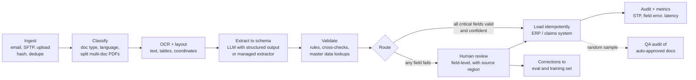
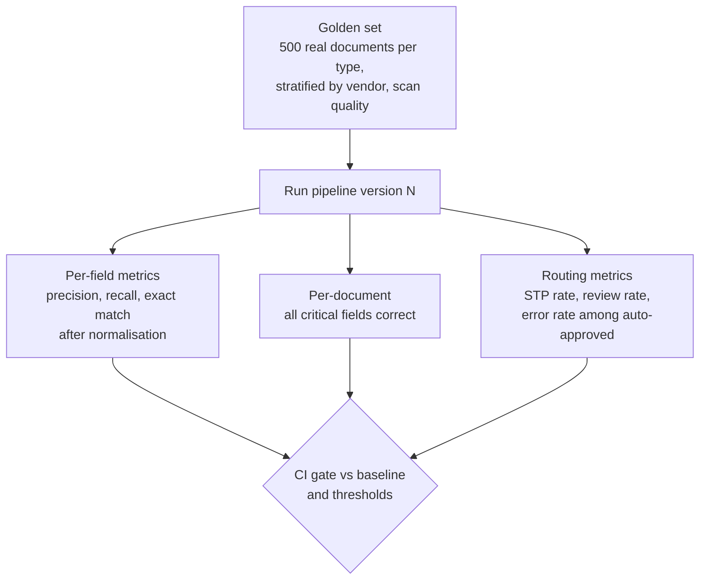
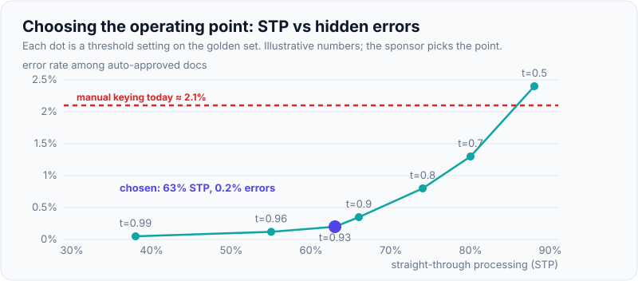

# Case: Document Extraction Pipeline (Forms, Invoices) with Evals

!!! abstract "Key takeaways"
    - The business metric is **straight-through processing (STP)**: the share of documents that go from inbox to system of record with **no human touch and no error**. Accuracy alone isn't the goal; accuracy at a known human-review cost is.
    - Pipeline: **ingest → classify → OCR/layout → extract (schema) → validate (rules + cross-checks) → route by confidence → human review → load idempotently**. Each stage is measurable.
    - **Evals are field-level**: precision, recall and exact match per field and per document type, on a labelled set of real documents, plus a document-level "all critical fields correct" rate. Average accuracy hides the field that breaks payments.
    - **Validation beats confidence scores**: totals that add up, dates in range, a vendor that exists in the master data, a member ID with a valid check digit. LLM confidence is poorly calibrated; business rules are not.
    - **Human review is part of the design**: thresholds per field, a review UI that shows the source region, random sampling of auto-approved documents, and every correction fed back into the eval set.

## Why it matters

Every regulated business runs on documents: prior authorisation forms, claims attachments, invoices, KYC packs, bills of lading. "Extract the data from these PDFs into our system" is a classic FDE engagement because it has a measurable ROI, it touches messy real data on day one, and it's easy to get wrong in ways that are expensive (a wrong invoice amount paid, a wrong member ID on a claim).

Before LLMs, this was template-based OCR (brittle when layouts change) or trained extraction models per document type (slow to set up, needing labelled data). Managed services such as Amazon Textract, Azure AI Document Intelligence and Google Document AI added pre-built and custom extractors with confidence scores. Multimodal LLMs with structured outputs now handle unseen layouts well, which shifts the hard part from "can we extract it?" to "how do we know it's right, at scale, and what do humans review?". That is an evals and operations problem, which is why interviewers like this case.

## Core concepts

### Framing questions

| Ask | Why | Default |
|---|---|---|
| Which document types, how many layouts? | Classification, per-type schemas | Invoices from ~3,000 vendors; 4 form types |
| Volume and arrival pattern? | Batch vs streaming, cost | 40,000 pages/day, peaks at month end |
| Scanned, digital, handwritten? | OCR quality, model choice | 60% digital PDF, 35% scanned, 5% handwriting |
| Which fields matter most? | Per-field thresholds | Invoice total, vendor, invoice number, due date, line items |
| What happens today, at what cost and error rate? | Baseline | 9 FTE keying, ~2% error, 3-day lag |
| Where does output go? | Load design, idempotency | ERP via API; claims system via staging table |
| Data constraints? | Hosting | PII/PHI; customer's cloud only |

**Outcome:** "Raise STP from 0% to ≥60% of invoices in 12 weeks with field-level error on critical fields ≤ 0.5% (lower than today's 2% manual keying error), and cut posting lag from 3 days to same day."

### The pipeline


*Notice the two feedback paths: corrections from review become eval cases, and a random sample of auto-approved documents is audited so you can measure the error rate you can't otherwise see.*

{ loading=lazy }
*The audit sample is how you measure the errors nobody reviewed.*

### Stage by stage

**Ingest.** Store the original file immutably with a content hash (dedupe resent invoices), source, received time and a document ID. Everything downstream references that ID.

**Classify and split.** A single PDF often contains several documents (invoice + delivery note + remittance). Classify page by page, split, and reject or route unknown types to a person.

**OCR and layout.** For scanned documents, OCR with layout (tables, key-value pairs, coordinates). Coordinates matter: the review UI highlights the region a value came from, and evidence checks can confirm that an extracted value really appears on the page.

**Extract.** Two families:

| Approach | Strengths | Weaknesses |
|---|---|---|
| Managed extractors (Textract AnalyzeExpense/queries, Azure Document Intelligence prebuilt invoice, Google Document AI) | Calibrated-ish per-field confidence, bounding boxes, stable, cheap at volume | Fixed schemas or training per custom type; weaker on unusual layouts |
| Multimodal LLM with structured outputs | Handles unseen layouts and messy forms; one schema per type; reasons over context | Cost per page higher; confidence not calibrated; must verify values exist in source |
| Hybrid | OCR/managed for text and boxes, LLM to map to schema and handle exceptions | More moving parts |

Many production pipelines are hybrid: OCR gives text and coordinates, the LLM maps them to the target schema, and code verifies every extracted value appears in the OCR text (or matches after normalisation).

**Validate.** The most important stage. Examples:

- **Arithmetic:** line items × quantities sum to the subtotal; subtotal + tax = total.
- **Formats and checksums:** IBAN check digits, NPI Luhn check, date formats, currency codes.
- **Master data:** vendor exists and is active; PO number exists and is open; member ID exists and was eligible on the service date.
- **Cross-document:** invoice total ≤ open PO amount; no duplicate invoice number for the same vendor.
- **Evidence:** each critical value is found in the OCR text near its label.

**Route.** A document goes straight through only if **every critical field** passes validation and meets its confidence threshold. Otherwise, only the failing fields go to review, pre-filled.

**Human review.** Side-by-side page image with the field region highlighted, the extracted value, the reason it was flagged, keyboard-first correction, and reason codes. Amazon Augmented AI (A2I), for example, supports routing low-confidence Textract results to human reviewers by threshold and sending a random sample for audit, which is the same pattern.

**Load.** Idempotent: an upsert keyed by `(vendor_id, invoice_number)` or the document ID, so reprocessing never creates duplicate payables ([idempotent loads](../fde-data-integration/04-data-quality-schema-drift-idempotent-loads-and-backfills.md)).

### Evals: field-level, per type, with a hidden-error estimate


*Notice the third box: the number that matters most is the error rate among documents you let through without review, because those errors reach the ERP unseen.*

{ loading=lazy }
*Engineers draw the curve; the sponsor chooses the point.*

- **Golden set:** real documents, stratified (top vendors, long tail, poor scans, handwriting, multi-page), labelled by two people with disagreements resolved; keep a held-out split.
- **Normalisation before comparison:** dates to ISO, amounts to decimals, whitespace and case; otherwise you measure formatting, not extraction.
- **Precision and recall per field:** a field that's extracted wrongly (precision) differs from one that's missed (recall); a missed field goes to review, a wrong one may go straight through.
- **The key trade-off curve:** for each threshold setting, STP rate vs error rate among auto-approved documents. The sponsor picks the operating point, not the engineer.
- **Production monitoring:** review rate, correction rate per field, sampled audit error rate, drift by vendor (a vendor changing its invoice layout shows up as a spike).

## In practice: code & configuration

### The extraction schema and evidence check

```python
from datetime import date
from decimal import Decimal
from pydantic import BaseModel, Field

class LineItem(BaseModel):
    description: str
    quantity: Decimal
    unit_price: Decimal
    amount: Decimal

class Invoice(BaseModel):
    vendor_name: str
    vendor_tax_id: str | None
    invoice_number: str
    invoice_date: date
    due_date: date | None
    currency: str = Field(pattern=r"^[A-Z]{3}$")
    subtotal: Decimal
    tax: Decimal
    total: Decimal
    line_items: list[LineItem]

def validate(inv: Invoice, ocr_text: str, master: MasterData) -> list[str]:
    """Return a list of failure reasons; empty means the document can go straight through."""
    errors = []
    if sum(li.amount for li in inv.line_items) != inv.subtotal:
        errors.append("line_items_do_not_sum_to_subtotal")
    if inv.subtotal + inv.tax != inv.total:
        errors.append("subtotal_plus_tax_not_total")
    vendor = master.vendor_by_tax_id(inv.vendor_tax_id) if inv.vendor_tax_id else None
    if vendor is None or not vendor.active:
        errors.append("vendor_not_found_or_inactive")
    if master.invoice_exists(vendor_id=vendor.id if vendor else None, number=inv.invoice_number):
        errors.append("duplicate_invoice_number")
    for name in ("invoice_number", "total"):                 # evidence: value must be on the page
        if normalise(str(getattr(inv, name))) not in normalise(ocr_text):
            errors.append(f"{name}_not_found_in_source")
    return errors
```

### Wrong vs right: what "accuracy" means

=== "❌ Common mistake"
    ```text
    "We tested on 50 invoices and the model got 96% of fields right."
    - 50 hand-picked, clean, digital invoices from three big vendors.
    - One number across all fields: the invoice total might be the 4% that's wrong.
    - No routing: every document goes straight to the ERP.
    - No estimate of errors that will reach the ERP unseen.
    ```

=== "✅ Correct approach"
    ```text
    Golden set: 600 invoices, stratified (top 50 vendors, long tail, 35% scanned, 5% handwritten),
    double-labelled; 100 held out.
    Per-field: total P=99.6% R=99.1%; invoice_number P=99.4%; due_date P=97.8% (non-critical).
    Routing at chosen thresholds: STP 63%; error rate among auto-approved critical fields 0.2%
    (95% CI 0.05-0.6%); review rate 37%, median review 40 s.
    Baseline manual keying: 2.1% error. Sponsor chose this operating point; audit samples 3% of
    auto-approved documents weekly.
    ```

### Routing configuration

```yaml
document_type: invoice
critical_fields: [vendor_tax_id, invoice_number, invoice_date, currency, total]
thresholds:            # per field; tuned on the golden set's STP-vs-error curve
  total: {min_confidence: 0.95, require_validation: [sum_check, evidence_check]}
  invoice_number: {min_confidence: 0.93, require_validation: [evidence_check, duplicate_check]}
  vendor_tax_id: {min_confidence: 0.9, require_validation: [master_data_check]}
auto_approve: {max_total: 25000, currencies: [USD, EUR, GBP, INR]}   # big invoices always reviewed
audit_sample_rate: 0.03
```

## Real-world usage

- **Managed document AI services** all follow the confidence-plus-human-review pattern: Amazon Textract with Amazon A2I (human loops triggered by confidence thresholds, plus random sampling for monitoring), Azure AI Document Intelligence (prebuilt and custom models with per-field confidence), Google Document AI (custom extractors evaluated with F1, precision and recall per label on a test set).
- **Accounts payable automation** measures STP ("touchless" invoice rates) as its headline KPI; industry benchmarks vary widely, so measure the customer's own baseline instead of quoting one.
- **Healthcare:** prior authorisation and claims attachments mix typed forms, faxes and clinical notes; member IDs, NPIs, CPT/ICD codes and dates are critical fields with strong validation (check digits, code-set lookups, eligibility on the date of service).

## Trade-offs & production gotchas

| Choice | Pros | Cons | Use when |
|---|---|---|---|
| Managed extractor only | Cheap, fast, boxes and confidences | Limited to supported fields/layouts | Standard documents (invoices, receipts, IDs) |
| LLM extraction only | Any layout, flexible schema | Cost, uncalibrated confidence, needs evidence checks | Long tail, unusual forms, low volume |
| Hybrid OCR + LLM + rules | Best accuracy and control | More components to operate | Most production pipelines |
| Strict thresholds | Low error reaching the ERP | Higher review cost, lower STP | High-value or regulated fields |
| Looser thresholds | Higher STP | More hidden errors | Low-value, reversible downstream actions |

!!! warning "Gotcha: model confidence is not a probability of being right"
    LLM-reported confidence and even token log-probabilities are poorly calibrated for extraction. Use validation rules and evidence checks as the primary gate, and calibrate any confidence threshold empirically on the golden set (STP vs error curve), per field.

!!! warning "Gotcha: the long tail of vendors"
    A golden set drawn from the top vendors overstates accuracy. Stratify by vendor frequency and scan quality, and watch per-vendor correction rates in production: a new layout shows up as a spike for one vendor.

## How this connects to my experience

- **Where it applies:** not an extraction pipeline on the resume, but adjacent pieces: Deloitte ConvergeHealth (*"event-driven healthcare analytics workflows"* on AWS with S3, SQS, SNS and Lambda) is the event-driven ingestion shape this pipeline uses; OptumRx Meteor's *"Kafka-based event-driven workflows with retry and DLQ handling"* map to stage retries and a review queue for failures; healthcare domain knowledge (member IDs, eligibility) gives the validation rules.
- **Talking points:**
    - "I'd build it as an event-driven pipeline: S3 upload event, SQS per stage, idempotent processing by document ID, and a DLQ that feeds the human review queue." *[confirm: whether ConvergeHealth workflows used S3 → SQS/SNS → Lambda in this way]*
    - "In healthcare I'd validate member IDs against eligibility on the service date, and never auto-approve a field that fails a check."
    - Honest gap: no OCR or document AI service in production *[confirm]*; position as transferable via AWS breadth and evals discipline.
- **Likely follow-up chain:** "How would you know the extraction is good enough?" → "What happens to low-confidence documents?" → "How do you catch errors that pass all checks?" → "Answer: field-level evals on a stratified golden set and an STP-vs-error curve the sponsor signs off; field-level review with source highlighting; random audits of auto-approved documents and per-vendor drift alerts."

## Interview questions

### Fundamentals

??? question "Q1. What metric would you optimise for an invoice extraction pipeline?"
    **Answer:** Straight-through processing rate at an agreed maximum error rate among auto-approved documents, plus review cost and latency. Field accuracy is an input, not the goal: the business wants fewer touches without more errors reaching the ERP.

    **Interviewer listens for:** STP and hidden-error rate, not just accuracy.

    **Common wrong answer:** "Overall accuracy."

??? question "Q2. Why evaluate per field rather than per document or overall?"
    **Answer:** Fields differ in importance and difficulty. A 96% overall accuracy can hide a 90% accuracy on the total, which is the field that causes wrong payments. Per-field precision and recall, plus a document-level "all critical fields correct" metric, shows where to set thresholds and where to invest.

    **Interviewer listens for:** critical fields and precision vs recall.

    **Common wrong answer:** "Average accuracy is enough."

??? question "Q3. LLM or managed document AI service?"
    **Answer:** Managed services for standard document types (cheap, fast, bounding boxes, per-field confidence); multimodal LLMs with structured outputs for unusual layouts and the long tail; usually a hybrid with OCR for text and coordinates, an LLM to map to the schema, and rules to validate. Decide on the golden set, per type.

    **Interviewer listens for:** hybrid and evidence-based choice.

    **Common wrong answer:** "LLMs replaced OCR."

??? question "Q4. What validations would you apply to an extracted invoice?"
    **Answer:** Arithmetic (lines sum to subtotal, subtotal plus tax equals total), formats and checksums, master-data lookups (vendor active, PO open), duplicate detection (vendor + invoice number), and evidence checks that critical values appear in the OCR text.

    **Interviewer listens for:** business rules as the primary gate.

    **Common wrong answer:** "Check the JSON schema."

### Intermediate

??? question "Q5. How do you set the human-review thresholds?"
    **Answer:** On the golden set, plot STP rate against error rate among auto-approved documents for different per-field thresholds, then let the sponsor choose the operating point given review cost and error cost. Require validation passes in addition to confidence, and always review high-value documents.

    **Interviewer listens for:** an empirical curve and sponsor decision.

    **Common wrong answer:** "Confidence above 0.9."

??? question "Q6. How do you build the golden set?"
    **Answer:** Sample real documents stratified by type, vendor frequency, scan quality and handwriting; label with two annotators and resolve disagreements; normalise values; keep a held-out split; and add every production correction and new layout over time.

    **Interviewer listens for:** stratification and double labelling.

    **Common wrong answer:** "Use 50 clean examples."

??? question "Q7. How do you make the load into the ERP safe to retry?"
    **Answer:** Upsert keyed by a business key (vendor ID + invoice number) or the document ID, duplicate checks before posting, and the original file hash to detect resubmissions. Reprocessing a document then updates rather than duplicates.

    **Interviewer listens for:** idempotency by business key.

    **Common wrong answer:** "Insert and rely on no retries."

??? question "Q8. What does a good review UI look like?"
    **Answer:** Only the flagged fields, pre-filled; the page image with the source region highlighted; the reason for the flag; keyboard-first editing; reason codes on corrections; and throughput metrics. Corrections feed the eval set.

    **Interviewer listens for:** field-level review and feedback loop.

    **Common wrong answer:** "Show the whole document and the JSON."

### Senior

??? question "Q9. How do you estimate errors that pass all your checks?"
    **Answer:** Randomly sample auto-approved documents for human audit at a fixed rate, compute the error rate with a confidence interval, and track it over time and per vendor. Downstream signals (vendor disputes, payment reversals) add a lagging check.

    **Interviewer listens for:** random audits and intervals.

    **Common wrong answer:** "If it passed validation, it's right."

??? question "Q10. A large vendor changes its invoice layout. What happens and how do you detect it?"
    **Answer:** Extraction errors and review rates spike for that vendor. Detect it with per-vendor correction-rate and review-rate monitoring; respond by adding examples of the new layout to the golden set and prompts (or retraining a custom extractor), and temporarily lowering auto-approval for that vendor.

    **Interviewer listens for:** per-vendor drift monitoring.

    **Common wrong answer:** "The LLM will adapt automatically."

??? question "Q11. How do you control cost at 40,000 pages a day?"
    **Answer:** Classify first and skip irrelevant pages; use managed extractors or a small model for standard types and a larger multimodal model only for exceptions; send text plus layout rather than images where accuracy allows; batch non-urgent work (batch APIs are often around half price); and cache per-vendor instructions as a stable prompt prefix.

    **Interviewer listens for:** routing by difficulty and batch.

    **Common wrong answer:** "Use the best model on every page."

### Scenario-based

??? question "Q12. The CFO asks for 95% touchless processing by quarter end. What do you say?"
    **Answer:** Show the current STP-vs-error curve: what 95% STP would cost in hidden errors, and what it would take (more validations, master-data clean-up, vendor e-invoicing). Propose a target the evidence supports (e.g. 65% now, 80% after master-data fixes) with the error rate the CFO accepts, and the levers that move it.

    **Interviewer listens for:** trade-off explained in business terms.

    **Common wrong answer:** "Lower the thresholds."

??? question "Q13. Reviewers keep correcting the due date, but it's not a critical field. Do you care?"
    **Answer:** Yes: it costs review time and may cause late payments. Check whether due dates are often absent (payment terms instead), add a rule to compute due date from terms, and measure whether the correction rate drops. Low-impact fields can also be excluded from review triggers if the business agrees.

    **Interviewer listens for:** using review data to improve.

    **Common wrong answer:** "Ignore it."

??? question "Q14. Prior-auth forms arrive as faxes with handwriting. How does the design change?"
    **Answer:** Stronger OCR with handwriting support, more fields routed to review, stricter validation (member eligibility on the date, NPI checks, code-set lookups), a smaller STP target, and clinical judgement kept with staff. Evals stratified by fax quality; PHI handled in the customer's cloud with audit logging.

    **Interviewer listens for:** realism about handwriting and healthcare validation.

    **Common wrong answer:** "Same pipeline."

## Cheat sheet

| Concept | Remember |
|---|---|
| Goal | STP at an agreed error rate among auto-approved documents |
| Pipeline | Ingest (hash) → classify/split → OCR + layout → extract → validate → route → review → idempotent load |
| Extraction | Managed for standard types; LLM for long tail; hybrid common |
| Validation | Arithmetic, checksums, master data, duplicates, evidence in source |
| Evals | Stratified golden set; per-field P/R; doc-level critical-correct; STP vs error curve |
| Review | Field-level, source highlighted, reason codes, corrections → evals |
| Hidden errors | Random audit of auto-approved docs; per-vendor drift |
| Confidence | Not calibrated; calibrate empirically, rules first |

## Sources
1. [AWS ML Blog: Using Amazon Textract with Amazon Augmented AI for processing critical documents](https://aws.amazon.com/blogs/machine-learning/using-amazon-textract-with-amazon-augmented-ai-for-processing-critical-documents/): confidence-triggered human review and random sampling.
2. [Amazon SageMaker AI docs: Create a human review workflow (A2I)](https://docs.aws.amazon.com/sagemaker/latest/dg/a2i-create-flow-definition.html): thresholds for Textract key-value review.
3. [Google Cloud: Document AI custom-based extraction](https://docs.cloud.google.com/document-ai/docs/custom-based-extraction): F1, precision and recall per label on a test set.
4. [Microsoft Learn: Azure AI Document Intelligence overview](https://learn.microsoft.com/en-us/azure/ai-services/document-intelligence/overview): prebuilt and custom models with field confidence.
5. Related: [Structured outputs](../fde-applied-llm/02-production-prompt-engineering-structured-outputs-and-prompt.md), [Evals](../fde-applied-llm/05-evals-golden-datasets-llm-as-judge-retrieval-vs-answer-metri.md), [Idempotent loads](../fde-data-integration/04-data-quality-schema-drift-idempotent-loads-and-backfills.md).
