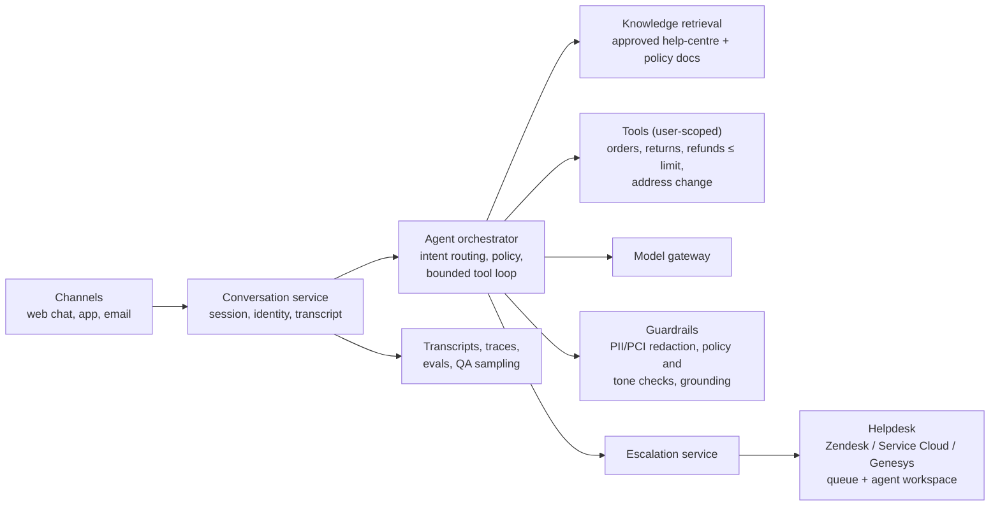
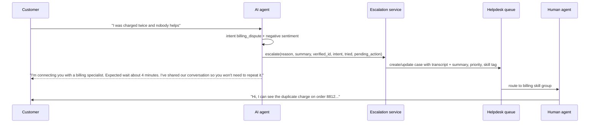

# Case: Customer-Support Agent with Escalation & Handoff

!!! abstract "Key takeaways"
    - A support agent is **customer-facing**: the company is responsible for what it says (*Moffatt v. Air Canada*, 2024). Answer from **approved, current knowledge**, cite policy, and never invent terms, prices or exceptions.
    - Scope it in **intents**: informational (answer from knowledge), transactional (authenticated, task-shaped tools with limits) and **always-human** (complaints with legal risk, vulnerable customers, bereavement, fraud, anything outside policy).
    - **Escalation is a feature, not a failure.** Escalate when the customer asks, on repeated failure, on low confidence, on sensitive topics or negative sentiment, and before any action above a limit. Measure escalation precision and recall.
    - **Handoff with context:** the human agent receives the transcript, a summary, the customer's verified identity, detected intent, what was tried, and any pending action, so the customer never repeats themselves.
    - Measure **verified resolution** (problem actually solved, no repeat contact within 7 days), CSAT, escalation quality, policy-violation rate and cost per resolved conversation. "Deflection" alone rewards a bot that frustrates people into leaving.

## Why it matters

Customer support is the flagship agent use case. Anthropic's *Building effective agents* singles it out as a natural fit because it combines conversation with actions (look up orders, issue refunds) and has measurable resolutions. Vendors price on it: Intercom charges for its Fin agent per outcome, counting a resolution when the customer confirms it helped or leaves without asking for more help.

It's also where public failures happen. Air Canada was held liable when its website chatbot described a bereavement-fare policy incorrectly; the tribunal rejected the idea that the chatbot was a separate entity. Klarna announced in 2024 that its AI assistant handled about two-thirds of customer service chats (the work of roughly 700 agents), then in 2025 said it was hiring human agents again so customers could always reach a person, with its CEO acknowledging quality issues. The lesson interviewers want to hear: optimise for **resolved customers and safe answers**, with humans one step away.

## Core concepts

### Framing questions

| Ask | Why | Default |
|---|---|---|
| Channels and volume? | Architecture, latency | Web chat + app, 30,000 conversations/day; voice later |
| Top contact reasons (from ticket data)? | Which intents to automate first | Order status, returns, address change, billing questions, card issues |
| Which actions should the agent take? | Tools, auth, limits | Look up orders; start a return; refunds ≤ $50; update address with verification |
| What must always go to a human? | Escalation policy | Complaints, disputes, fraud, bereavement, vulnerable customers, legal threats |
| Existing helpdesk? | Handoff integration | Zendesk / Salesforce Service Cloud / Genesys |
| Languages, hours, regulation? | Model, staffing, compliance | 6 languages; human agents 8–20h; GDPR, PCI (cards) |
| Baseline metrics? | Success measure | First-contact resolution, CSAT, handle time, cost per contact |

**Outcome:** "Resolve 40% of chats end to end with verified resolution (no repeat contact within 7 days) and CSAT within 2 points of human agents, with zero policy violations in audits, in 10 weeks."

### Intent tiers

```mermaid
flowchart TD
    C["Customer message"] --> ID["Detect intent, sentiment, risk signals<br/>verify identity when needed"]
    ID --> I1["Informational<br/>shipping times, policies"]
    ID --> I2["Transactional<br/>order status, return, address change"]
    ID --> I3["Always human<br/>complaint, fraud, bereavement,<br/>vulnerable customer, legal"]
    I1 --> KB["Answer from approved knowledge<br/>with policy citation"]
    I2 --> AUTH{"Customer verified?"}
    AUTH -->|"no"| VER["Step-up verification<br/>(login, OTP)"]
    AUTH -->|"yes"| TOOL["Task-shaped tool<br/>within limits"]
    TOOL --> LIM{"Within policy limits?"}
    LIM -->|"yes"| DONE["Confirm with customer"]
    LIM -->|"no"| H["Escalate with context"]
    I3 --> H
    KB -->|"low confidence or<br/>customer unhappy"| H
```


*Notice that the always-human branch bypasses the model's judgement entirely: it's triggered by intent and risk detection, and it goes straight to a person.*

### Architecture


*Notice that the helpdesk stays the system of record for cases and human agents. The AI agent is a front line that creates or updates cases there, not a parallel support system.*

### Deep dive 1: escalation triggers

| Trigger | Detection | Example |
|---|---|---|
| Customer asks for a human | Intent / keywords, in every language | "agent", "real person", "speak to someone" |
| Repeated failure | Same intent unresolved after N turns, or rephrased questions | Third attempt at a billing question |
| Low confidence | Retrieval below threshold, grounding check fails | Question not covered by knowledge base |
| Sensitive or risky topic | Intent classifier + rules | Fraud, complaint, legal threat, bereavement, self-harm signals |
| Negative sentiment rising | Sentiment over turns | Frustration after a failed action |
| Action beyond limits | Policy engine | Refund over $50, address change on a flagged account |
| Tool failure | Error after retries | Returns API down |

Two principles:

- **Never trap the customer.** A visible "talk to a person" option at all times, and an immediate handoff when asked. Hiding it inflates deflection and destroys trust.
- **Escalation quality is measurable.** Precision: of escalated conversations, how many needed a human? Recall: of conversations that needed a human (from QA samples, repeat contacts, complaints), how many were escalated? Both matter; a bot that escalates everything is useless, one that escalates nothing is dangerous.

### Deep dive 2: handoff with context


*Notice the message to the customer: it says who, how long, and that context travels. A cold transfer into a queue that starts with "How can I help?" is the most common complaint about bot handoffs.*

The handoff payload:

```json
{
  "conversation_id": "c-7781",
  "customer": {"id": "u-551", "verified": true, "method": "app_session"},
  "intent": "billing_dispute",
  "escalation_reason": "sensitive_topic+negative_sentiment",
  "summary": "Customer reports two charges of $84.20 for order 8812 on 3 Oct. Agent confirmed one order exists. No refund attempted (dispute policy requires human).",
  "attempted": ["order_lookup(8812)", "kb: duplicate charges"],
  "pending_action": null,
  "language": "en",
  "priority": "high",
  "transcript_ref": "s3://support-transcripts/c-7781.json"
}
```

Out of hours: say so, offer a callback or an email follow-up with a case number, and never pretend a human is coming.

### Deep dive 3: actions with limits

- **Authenticate before acting**: in-app sessions are already verified; on web chat use login or a one-time code before any account-specific information or action.
- **Task-shaped tools** with server-side limits: `start_return(order_id, item_ids, reason)`, `issue_refund(order_id, amount)` where the tool itself rejects amounts over the limit regardless of what the model asks.
- **Confirm before executing**: "I'll start a return for the blue jacket from order 8812 and email a label to j***@mail.com. Shall I go ahead?"
- **Idempotency keys** on every write, so a retried refund can't pay twice.
- **No card data in the model**: route payment details to a PCI-compliant capture form; redact before prompts and logs.

### Deep dive 4: knowledge, policy and grounding

- Answers come only from **approved, versioned** help-centre articles and policy documents, with the article cited or linked.
- **Policy exceptions are human-only.** The agent can explain policy; it can't grant exceptions or make promises ("I'll waive the fee").
- **Grounding check** on answers that state terms, prices, deadlines or eligibility; fail closed to "Let me connect you with someone who can confirm."
- Content owners get a report of questions the knowledge base couldn't answer: support data improves the knowledge base, not just the bot.

### Evals and metrics

| Layer | Metric |
|---|---|
| Offline | Intent accuracy; answer correctness and groundedness on 500 real conversations; tool-call correctness; policy-violation tests (red-team prompts asking for exceptions, refunds over limit, other customers' data) |
| Simulation | Simulated customers run multi-turn tasks against mock systems; grade the final state (did the return get created correctly?) over several trials, as τ-bench does |
| Online | Verified resolution rate; repeat contact within 7 days; CSAT vs human baseline; escalation precision/recall from QA samples; containment; cost per resolved conversation; policy violations found in audits |

Watch for **gaming**: an "assumed resolution" counted when a frustrated customer closes the window looks like success. Pair it with repeat-contact rate and sampled QA.

### Back-of-envelope

```text
30,000 conversations/day × ~6 turns; per turn ~3K input (instructions + retrieved articles
+ history), ~150 output tokens
Per conversation ≈ 18K in + 0.9K out; with prompt caching on the stable prefix, effective
input cost drops substantially
At an example $2 / $10 per 1M (verify): ≈ $0.036 + $0.009 ≈ $0.045 before caching
30,000/day ≈ $1,350/day; compare with the fully loaded cost of a human-handled contact
Latency: first token in ~1 s with streaming; total turn ≤ 3-4 s
```

## In practice: code & configuration

### Escalation policy as configuration

```yaml
escalation:
  always_human_intents: [complaint_formal, fraud_report, bereavement, legal_threat,
                         vulnerable_customer, account_closure_dispute]
  customer_requested: {immediate: true}             # never ask "are you sure?"
  repeated_failure: {same_intent_unresolved_turns: 3}
  low_confidence: {retrieval_min_score: 0.45, grounding_required: true}
  sentiment: {negative_streak: 2}
  action_limits:
    issue_refund: {max_amount: 50, currency: any}
    change_address: {blocked_if_account_flag: [fraud_watch, recent_password_reset]}
  out_of_hours: {offer: [callback, email_case]}
handoff:
  include: [summary, transcript_ref, verified_identity, intent, attempted, pending_action]
  target: zendesk
  routing: {billing_dispute: billing_l2, fraud_report: fraud_team}
```

### Wrong vs right: an exception request

=== "❌ Common mistake"
    ```text
    Customer: My father died last week. Can I get the bereavement fare refunded after I fly?
    Bot:      I'm sorry for your loss. Yes, you can apply for the bereavement discount within
              90 days after travel by filling in our form.
    - Invented or outdated policy: the company is liable for it.
    - A bereavement conversation handled entirely by a bot.
    ```

=== "✅ Correct approach"
    ```text
    Customer: My father died last week. Can I get the bereavement fare refunded after I fly?
    Agent:    I'm very sorry for your loss. Our bereavement policy page says [citation: Bereavement
              travel, updated 2 Sep 2026]: requests must be made before travel. Because your
              situation is important to get right, I'm connecting you with a specialist now who
              can review your options. You won't need to repeat anything. Expected wait: 3 minutes.
    - Quotes the current policy with a citation.
    - Sensitive intent triggers a warm handoff.
    ```

## Real-world usage

- **Moffatt v. Air Canada (2024 BCCRT 149):** the airline was liable for its chatbot's incorrect bereavement-policy answer; the tribunal said the company is responsible for all information on its website, chatbot included.
- **Klarna (2024–2025):** announced its assistant handled about two-thirds of chats (the equivalent of ~700 agents) in early 2024, then in 2025 said it would hire human agents again so customers can always reach a person, citing quality. A balanced design keeps humans in the loop from the start.
- **Outcome-based pricing:** Intercom prices Fin per outcome ($0.99 per resolution at the time of writing, verify), counting confirmed and "assumed" resolutions. Useful for cost comparisons, and a reminder to measure verified resolution yourself.
- **Agent benchmarks:** Sierra's τ-bench simulates retail and airline customers against policy documents and APIs, grading final database state; it found agents often fail to follow policy and degrade sharply when required to succeed on every one of several repeated trials.

## Trade-offs & production gotchas

| Option | Pros | Cons | Use when |
|---|---|---|---|
| Buy a support-agent platform (Intercom Fin, Zendesk AI, Salesforce Agentforce, Sierra, Decagon) | Fast, integrated with helpdesk, analytics | Per-resolution cost, less control, data residency questions | Standard B2C support on a supported helpdesk |
| Build on a model API with your helpdesk | Full control of policy, tools, data | More to build and operate | Complex actions, regulated data, unusual systems |
| Answers only (no actions) | Low risk, quick | Limited resolution rate | First phase |
| Actions with limits | Real resolution | Needs auth, idempotency, audits | Phase 2, earned per intent |

!!! warning "Gotcha: deflection is not resolution"
    A bot that makes it hard to reach a human, or counts a closed window as success, will report great containment while CSAT, repeat contacts and churn get worse. Track verified resolution and repeat contacts, and always offer a human.

!!! warning "Gotcha: identity in chat"
    Never act on an account based on details typed in chat ("my email is…"). Use the authenticated app session or a one-time code, and treat social-engineering attempts as an escalation trigger.

## How this connects to my experience

- **Where it applies:** not a support agent on the resume. Adjacent: OptumRx Meteor is a member-facing healthcare platform serving *750K+ users*, where I *"built the ReactJS application from the ground up"* and owned the GraphQL integration layer to member data across *5 upstream systems*: the customer-facing context, identity and data access a support agent needs. *"Built secure enterprise APIs using OAuth2, PingFederate, and Active Directory"*: verified identity before acting.
- **Talking points:**
    - "In a member-facing healthcare app, the bar is: never show or change data without verified identity, and always give people a route to a human." *[confirm: how Meteor connected members to support, e.g. click-to-call or secure messaging]*
    - "The tools I'd give the agent are the same task-shaped operations our GraphQL layer exposed, with the user's token, not a service account." *[confirm: example member operations exposed by the consumer service]*
- **Likely follow-up chain:** "When should the bot escalate?" → "How do you hand off without the customer repeating themselves?" → "How do you measure success?" → "The business wants 70% containment; what do you say?". Answer with the trigger table, the handoff payload into the helpdesk, verified resolution plus repeat contact and CSAT, and a plan to grow containment intent by intent with evidence.

## Interview questions

### Fundamentals

??? question "Q1. What should always go to a human in a support agent design?"
    **Answer:** Explicit requests for a human, complaints with legal or regulatory risk, fraud, bereavement and vulnerable-customer situations, policy exceptions, actions beyond limits, and anything the agent can't answer from approved knowledge. These are triggered by intent and rules, not left to the model's judgement.

    **Interviewer listens for:** a concrete list and rule-based triggers.

    **Common wrong answer:** "Only when the model isn't confident."

??? question "Q2. What does a good handoff include?"
    **Answer:** Verified identity, intent, escalation reason, a summary, what was tried, any pending action, the transcript, language and priority, delivered into the helpdesk case and routed to the right skill group, plus a message to the customer about who, how long, and that they won't need to repeat themselves.

    **Interviewer listens for:** context and customer messaging.

    **Common wrong answer:** "Transfer the chat to the queue."

??? question "Q3. Why is deflection a poor primary metric?"
    **Answer:** It counts conversations that didn't reach a human, including customers who gave up. Verified resolution (problem solved, no repeat contact within a window), CSAT relative to humans and escalation quality show whether customers were actually helped.

    **Interviewer listens for:** verified resolution and repeat contact.

    **Common wrong answer:** "Deflection shows cost savings."

??? question "Q4. How does the agent take actions safely?"
    **Answer:** Authenticate the customer first; expose task-shaped tools with server-side limits; confirm with the customer before executing; idempotency keys on writes; escalate anything beyond limits; never handle raw card data in the model.

    **Interviewer listens for:** server-side limits and confirmation.

    **Common wrong answer:** "The prompt says refunds must be under $50."

### Intermediate

??? question "Q5. How do you measure escalation quality?"
    **Answer:** Precision (escalated conversations that needed a human, from agent feedback) and recall (conversations that needed a human but weren't escalated, from QA samples, repeat contacts and complaints). Tune triggers against both.

    **Interviewer listens for:** both sides of the trade-off.

    **Common wrong answer:** "Lower escalation rate is better."

??? question "Q6. How do you stop the agent from inventing policy?"
    **Answer:** Retrieve only from approved, versioned policy and help content; cite it; grounding checks on answers stating terms, prices, deadlines or eligibility; no ability to grant exceptions; red-team tests for exception requests; and escalate when sources don't cover the question.

    **Interviewer listens for:** approved sources, citations, checks.

    **Common wrong answer:** "Instruct it not to make things up."

??? question "Q7. How do you evaluate a multi-turn support agent before launch?"
    **Answer:** Offline on real conversations (intent, answer quality, tool calls), simulated customers running tasks against mock systems with final-state grading over several trials, policy-violation red-team suites, then a soft launch to a share of traffic with QA sampling and comparison to human-handled conversations.

    **Interviewer listens for:** simulation with state-based grading and repeated trials.

    **Common wrong answer:** "Test a few chats manually."

??? question "Q8. Build or buy?"
    **Answer:** Buy a support-agent platform when the use case is standard and the helpdesk is supported: faster, integrated analytics, per-outcome pricing. Build on a model API when actions are complex, data is regulated or systems are unusual. Either way, own the evals, policy and escalation rules.

    **Interviewer listens for:** criteria, and owning evals regardless.

    **Common wrong answer:** "Always build" or "always buy".

### Senior

??? question "Q9. The business wants 70% containment. How do you respond?"
    **Answer:** Show containment by intent from current data, the verified-resolution and CSAT for contained conversations, and which intents could be added safely with actions and knowledge improvements. Propose a path with quality guardrails (CSAT within N points, repeat contact not rising, zero policy violations). Avoid hitting the number by hiding the human option.

    **Interviewer listens for:** quality guardrails on a target.

    **Common wrong answer:** "Make it harder to reach an agent."

??? question "Q10. How do you handle the company's liability for what the agent says?"
    **Answer:** Answers from approved content with citations; no exceptions or promises; grounding checks on commitments; transcripts retained; legal and compliance review of high-risk intents; clear disclosure that the customer is talking to an AI; and humans for sensitive topics. The *Air Canada* ruling makes clear the company owns the agent's statements.

    **Interviewer listens for:** treating answers as company statements.

    **Common wrong answer:** "Add a disclaimer."

??? question "Q11. How would you add voice to this design?"
    **Answer:** Speech-to-text and text-to-speech around the same orchestrator, with tighter latency budgets (sub-second turn starts, streaming), barge-in handling, shorter answers, voice-friendly verification, and handoff into the contact-centre platform (e.g. Genesys, Amazon Connect) with the same context payload. Evaluate on real call audio, including accents and noise.

    **Interviewer listens for:** latency and contact-centre integration.

    **Common wrong answer:** "Read the chat answers aloud."

### Scenario-based

??? question "Q12. A customer writes, 'My card was stolen and someone ordered things on my account.' Walk through it."
    **Answer:** Fraud intent triggers immediate escalation to the fraud team with high priority; the agent may guide immediate safety steps from approved content (freeze card in app) but takes no account actions itself; the handoff carries the summary and verified identity status; the customer is told what happens next.

    **Interviewer listens for:** immediate escalation, no improvisation.

    **Common wrong answer:** "Cancel the orders and issue refunds."

??? question "Q13. CSAT for bot-resolved chats is fine, but repeat contacts rose 30% after launch. What's happening?"
    **Answer:** Likely false resolutions: answers that look helpful but don't solve the problem, or customers leaving without help counted as resolved. Segment repeat contacts by intent, sample transcripts, check whether answers were wrong, incomplete or the action didn't complete, fix knowledge or tools, and tighten what counts as resolved.

    **Interviewer listens for:** repeat contact as a truth signal.

    **Common wrong answer:** "CSAT is fine, so it's fine."

??? question "Q14. Midway through the design, legal says the bot can't take any account actions in the first release. What changes?"
    **Answer:** Release 1 is informational plus guided self-service links (deep links to the app's return or address forms) and warm handoffs with context. Tools are built but disabled behind flags; actions are added intent by intent after legal review with limits and audits. Metrics shift to answer quality and handoff quality.

    **Interviewer listens for:** absorbing the constraint and phasing.

    **Common wrong answer:** "Then there's no value."

## Cheat sheet

| Concept | Remember |
|---|---|
| Responsibility | The company owns the agent's statements (*Air Canada*, 2024) |
| Intent tiers | Informational · transactional (authenticated, limited) · always human |
| Escalate on | Request, repeated failure, low confidence, sensitive topic, negative sentiment, limits, tool failure |
| Handoff | Identity, intent, reason, summary, attempted, pending action, transcript → helpdesk; tell the customer |
| Actions | Verify identity, task-shaped tools, server-side limits, confirm, idempotency, no card data |
| Knowledge | Approved, versioned, cited; no exceptions; grounding check |
| Metrics | Verified resolution, repeat contact (7 days), CSAT vs humans, escalation P/R, violations, cost |
| Lessons | Air Canada (liability), Klarna (keep humans reachable) |

## Sources
1. [Anthropic: Building effective agents](https://www.anthropic.com/engineering/building-effective-agents): customer support as an agent use case with tools and measurable resolutions.
2. [Moffatt v. Air Canada (law-firm summary)](https://www.dww.com/articles/bc-tribunal-finds-air-canada-liable-for-inaccurate-advice-given-by-website-chatbot) and [CX Today](https://www.cxtoday.com/conversational-ai/court-orders-air-canada-to-pay-out-for-chatbots-bad-advice/): liability for chatbot statements.
3. [Entrepreneur: Klarna hiring customer service agents again](https://www.entrepreneur.com/business-news/klarna-ceo-reverses-course-by-hiring-more-humans-not-ai/491396) and [CX Dive](https://www.customerexperiencedive.com/news/klarna-reinvests-human-talent-customer-service-AI-chatbot/): 2024 claims and 2025 reversal.
4. [Intercom Help: Fin resolutions](https://www.intercom.com/help/en/articles/8205718-fin-resolutions): per-outcome pricing and resolution definitions.
5. [Sierra: τ-Bench](https://sierra.ai/blog/benchmarking-ai-agents): simulated customers, policy following, pass^k.
6. [OpenAI: A practical guide to building agents (summary)](https://www.maginative.com/article/how-to-build-ai-agents-a-detailed-practical-guide-from-openai/): escalation on failure thresholds and high-risk actions.
7. Related: [Agents in production](../fde-applied-llm/04-agents-in-production-tool-use-mcp-servers-sub-agents-skills.md), [Guardrails](../fde-applied-llm/06-guardrails-prompt-injection-pii-phi-redaction-grounding-chec.md), [Evals](../fde-applied-llm/05-evals-golden-datasets-llm-as-judge-retrieval-vs-answer-metri.md).
