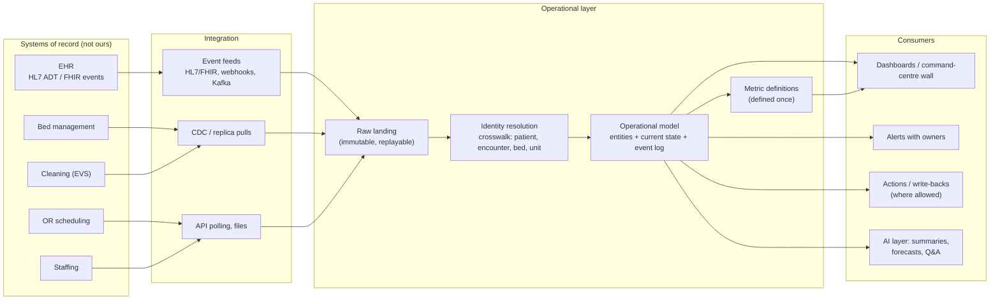
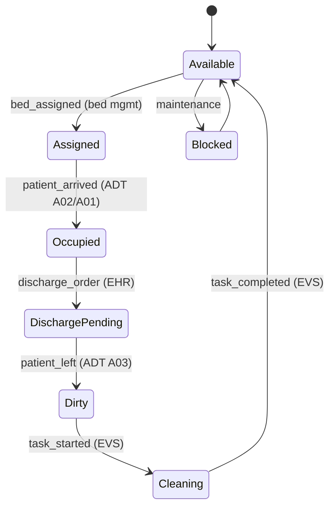

# Case: Unifying Siloed Systems into an Operational Dashboard

!!! abstract "Key takeaways"
    - Start from the **decisions the dashboard must support** ("which patient gets the next ICU bed?", "which shipments will miss SLA today?"), not from "show all the data". Every tile should trace to a decision and an owner.
    - The hard parts are **integration and identity**: getting changes out of 5–15 systems you don't own (events, CDC, APIs, files), resolving the same entity across them (a crosswalk), and keeping **one definition per metric**.
    - **Freshness is a per-metric requirement.** Bed status needs seconds to minutes; staffing forecasts are fine hourly; financials daily. Design tiers (streaming, micro-batch, batch) instead of making everything real time.
    - Model an **operational layer** (entities, states, events, links: the ontology idea) between raw sources and the UI, so dashboards, alerts, actions and AI agents all read the same truth.
    - A dashboard nobody acts on is decoration. Add **alerts with owners, actions or write-backs where allowed, and data-quality signals** (last updated, source health) on the screen.

## Why it matters

"Our data is in a dozen systems and nobody can see what's happening" is one of the oldest enterprise problems and one of the most common FDE engagements, particularly at Palantir, where unifying siloed systems into an operational picture is the core product motion. It shows up as hospital capacity command centres, airline and logistics operations centres, bank operations dashboards and supply-chain control towers.

A well-known example: the Johns Hopkins Hospital opened its Judy Reitz Capacity Command Center in 2016 with GE Healthcare, receiving on the order of 500 messages a minute from 14 different hospital IT systems and showing them on a shared "wall of analytics" so staff could manage beds, transfers and discharges together. Many health systems built similar centres afterwards.

Interviewers use this case to test data integration judgement (how you get data out of systems of record without hurting them), modelling (identity across systems, one metric definition), freshness and cost trade-offs, and whether you design for **action**, not just display. It also connects directly to [semantic layers and ontologies](../fde-data-integration/05-semantic-layer-and-ontology-modelling-the-customer-s-domain.md).

## Core concepts

### Framing: decisions first

| Ask | Why | Default (hospital capacity example) |
|---|---|---|
| Who looks at it, and what do they decide? | Tiles, latency, alerts | Bed managers: assign beds; charge nurses: discharge readiness; execs: daily capacity |
| Which systems hold the facts? | Integrations | EHR (ADT events), bed management, environmental services (cleaning), OR scheduling, staffing, transport |
| How fresh must each fact be? | Freshness tiers | Bed status ≤ 2 min; ED boarding ≤ 5 min; staffing 15 min; finance daily |
| How do systems identify a patient/bed/unit? | Identity resolution | MRN in EHR, encounter ID, bed codes differ between systems |
| What actions follow? | Alerts, write-backs | Page a bed manager; request cleaning; escalate boarding over 4 h |
| Who owns each source and its change process? | Access, SLAs | Each system's IT owner; interface team for HL7 feeds |
| Baseline metrics? | Success | ED boarding hours, time from discharge order to bed clean, OR holds |

**Outcome:** "Reduce median time from discharge to bed ready from ~3.2 h to ≤ 2 h, and ED boarding hours by 20%, within one quarter, measured from ADT and cleaning events."

### Architecture


*Notice that every consumer reads the same operational model. Dashboards, alerts, actions and any AI features never query source systems directly, so they can't disagree.*

### Deep dive 1: getting changes out of the sources

| Source behaviour | Integration choice | Notes |
|---|---|---|
| Emits events (HL7 ADT feed, FHIR subscriptions, webhooks, Kafka) | Consume events | Best freshness; handle duplicates and out-of-order delivery |
| Database you may read (replica) | Log-based CDC (Debezium) or watermark pulls | Agree with the DBA; watch replication-slot disk risk |
| API only | Poll with `updated_since`, respect rate limits | Freshness bounded by polling interval and limits |
| Files only (SFTP exports) | Scheduled pickup | Daily/hourly; label tiles as such |

Hospital ADT (admit, discharge, transfer) messages are the classic event feed: HL7 v2 messages flow through the hospital's integration engine, and FHIR R4 APIs and subscriptions are increasingly available. The integration patterns and their risks are on the [legacy systems page](../fde-data-integration/01-integrating-with-legacy-systems-of-record-databases-files-sf.md).

Every path lands **raw first** (immutable, timestamped), so a modelling bug is a replay, not a request to the hospital's interface team.

### Deep dive 2: identity resolution

The bed management system calls it `4B-12`, the EHR calls it `NUR4-B-012`, cleaning calls it `Room 412 bed 2`. Patients have MRNs in the EHR and different IDs in transport and scheduling.

- Build **crosswalks** per entity type: `(system, source_id) → enterprise_id`, with the match rule and confidence, owned and reviewed.
- Prefer deterministic keys (encounter ID, MRN, bed code mapping table maintained with facilities) over fuzzy matching; send ambiguous matches to a review queue.
- Treat unmapped IDs as a **data-quality signal on the dashboard** ("3 beds unmapped"), not as silently dropped rows.

### Deep dive 3: the operational model (state + events)

Model the domain the way staff talk about it ([ontology thinking](../fde-decomposition-scoping/02-from-vague-business-goal-to-data-and-object-model.md)): `Bed`, `Unit`, `Patient`, `Encounter`, `BedRequest`, `CleaningTask`, with **current state** for fast reads and an **append-only event log** for history and metrics.


*Notice that the bed's state is assembled from events in four different systems. That's the value of the unified model: no single source knows a bed's full lifecycle, and the "Dirty → Available" duration is exactly the metric the outcome targets.*

Metrics are **derived from events** (time in each state, boarding duration = bed assigned − admit decision) and defined once in a metrics layer, so the wall, the daily report and the executive deck agree.

### Deep dive 4: freshness tiers and cost

| Tier | Latency | Mechanism | Examples |
|---|---|---|---|
| Real-time | Seconds | Event stream → state store → push to UI (WebSocket/SSE) | Bed state, ED arrivals |
| Near-real-time | 1–15 min | Micro-batch, CDC | Staffing, OR schedule changes |
| Batch | Hourly/daily | Scheduled ELT | Finance, length-of-stay trends |

Show freshness on screen: every tile has "updated 40 s ago" and turns grey if a source is late. Staff stop trusting a dashboard the first time it's silently stale.

### Deep dive 5: from display to action

- **Alerts with owners:** "ED boarding > 4 h for 3 patients: bed manager on call", routed to a person, with acknowledgement tracked.
- **Actions:** request priority cleaning, flag a bed for discharge, reassign transport. Prefer writing back to the system of record through its API or creating a task there; avoid making the dashboard a shadow system of record.
- **AI layer (optional, later):** shift-handover summaries, discharge-likelihood forecasts, natural-language questions over the operational model. It reads the same governed model, inherits its permissions, and is evaluated like any other AI feature.

### Back-of-envelope

```text
Hospital with 1,000 beds, 14 source systems
ADT + bed + EVS events: ~500 messages/min at peak ≈ 8-10 msg/s  (order of the Hopkins figure)
Event size ~2 KB → ~1.5 GB/day raw; years of history fit comfortably in a warehouse
Dashboard users: ~200 concurrent; push updates on state change, not polling
```

Volume is modest; correctness, identity and latency are the design drivers.

## In practice: code & configuration

### Wrong vs right: computing a metric

=== "❌ Common mistake"
    ```sql
    -- Each dashboard tile queries a different source system directly, with its own definition.
    -- Tile A (bed system):  "available beds" = status = 'VACANT'
    -- Tile B (EHR report):  "available beds" = licensed beds - census
    -- The two tiles disagree on the wall; staff stop trusting both.
    SELECT count(*) FROM bedsys.beds WHERE status = 'VACANT';
    ```

=== "✅ Correct approach"
    ```sql
    -- One definition in the operational model, used by every consumer.
    -- available = in service, not occupied, not assigned, cleaned, not blocked.
    CREATE VIEW ops.available_beds AS
    SELECT b.enterprise_bed_id, b.unit_id, s.state, s.state_since
    FROM ops.bed b
    JOIN ops.bed_current_state s USING (enterprise_bed_id)
    WHERE b.in_service
      AND s.state = 'Available';

    -- Derived metric from the event log: discharge-to-ready time, per unit, per day.
    SELECT unit_id,
           date_trunc('day', left_at) AS day,
           percentile_cont(0.5) WITHIN GROUP (ORDER BY ready_at - left_at) AS median_turnaround
    FROM ops.bed_turnarounds          -- built from patient_left and task_completed events
    GROUP BY 1, 2;
    ```

### Event consumer that tolerates duplicates and reordering

```python
def apply_bed_event(evt: BedEvent, store: StateStore) -> None:
    """Idempotent and order-tolerant: dedupe by event id, apply only newer source timestamps."""
    if store.seen(evt.event_id):                      # duplicate delivery (at-least-once feeds)
        return
    bed_id = crosswalk.resolve("bed", evt.source_system, evt.source_bed_id)
    if bed_id is None:
        dq.record_unmapped("bed", evt.source_system, evt.source_bed_id)   # visible on dashboard
        store.mark_seen(evt.event_id)
        return
    with store.transaction() as tx:
        tx.append_event(bed_id, evt)                  # full history, used for metrics
        current = tx.current_state(bed_id)
        if current is None or evt.occurred_at > current.updated_at:   # ignore stale events
            tx.set_state(bed_id, transition(current, evt), updated_at=evt.occurred_at)
        tx.mark_seen(evt.event_id)
    publisher.push(bed_id)                            # notify dashboards via SSE/WebSocket
```

## Real-world usage

- **Hospital command centres:** Johns Hopkins (with GE Healthcare, 2016) aggregates real-time data from 14 IT systems at hundreds of messages per minute; other health systems built similar centres. Published outcomes are reported by the hospitals and vendors, so treat them as directional, not audited.
- **Palantir Foundry and similar platforms** sell exactly this pattern: integrate siloed systems into an ontology of business objects, then build operational apps and actions on top. Knowing the generic version (crosswalk, state + events, metrics once, write-back) lets you discuss Foundry without having used it.
- **Common failure modes:** dashboards that query sources directly (load on production systems, conflicting numbers), "real-time everything" that costs a fortune and still shows stale data from a batch source, and screens with no owner or action, which quietly stop being used.

## Trade-offs & production gotchas

| Choice | Pros | Cons | Use when |
|---|---|---|---|
| Query sources live (federated) | No pipeline to build | Load on systems of record, inconsistent definitions, fragile | Quick prototype only |
| Central operational model (events + state) | Consistent, fast, enables alerts and AI | Integration and identity work | Production command centre |
| Streaming for everything | Freshest | Costly; batch sources stay stale anyway | Only for decision-critical metrics |
| Tiered freshness | Cost matches value | More than one pipeline type | Default |
| BI tool on warehouse | Familiar, cheap | Minutes-to-hours latency, weak for actions | Daily/weekly views |
| Custom operational app | Real-time, actions, workflows | More to build | Live operations and write-back |

!!! warning "Gotcha: the dashboard becomes a shadow system of record"
    If staff start updating bed status on the dashboard because it's easier than the bed system, the two diverge. Write actions back to the system of record (or create tasks there), and make the operational model a read model of those systems.

!!! warning "Gotcha: silent staleness"
    One late batch feed can make a whole wall wrong. Show per-tile freshness, alert when a source stops sending, and grey out tiles past their freshness SLA.

## How this connects to my experience

- **Where I used it:** OptumRx Meteor (Publicis Sapient): *"Owned the GraphQL Consumer Service end-to-end, acting as the integration layer between 5 upstream systems and multiple downstream consumers"*, *"Collaborated with senior architects to design ... data integration patterns"*, *"Designed Kafka-based event-driven workflows with retry and DLQ handling"* and *"Implemented Redis-based caching for frequently accessed queries and UI reference data"*. That is a unified read layer over siloed systems for many consumers. Deloitte ConvergeHealth: *"event-driven healthcare analytics workflows"* and *"Elasticsearch-powered search"* over data assets.
- **Talking points:**
    - "The consumer service is a unified view over five upstream systems: one schema, consistent identifiers and definitions, and consumers that never call upstreams directly. An operational dashboard is the same pattern with events and alerts." *[confirm: which upstream domains (claims, eligibility, pharmacy, prescriber, member) and how IDs were reconciled]*
    - "Redis caching for reference data was a freshness-tier decision: reference data could be minutes old, member-specific data couldn't." *[confirm: TTLs and which data was cached]*
    - "Kafka with retry and DLQ is how I'd ingest event feeds that arrive duplicated or out of order." *[confirm: idempotency key used in consumers]*
- **Likely follow-up chain:** "How did your integration layer handle five upstreams with different IDs and latencies?" → "How would you give operations staff a real-time view across them?" → "Two tiles disagree; how do you fix it permanently?" → "How do you keep the dashboard from becoming stale?". Answer with the schema and identifier mapping in the GraphQL layer; events into an operational model with state + log; one metric definition in a metrics layer; per-tile freshness and source-health alerts.

## Interview questions

### Fundamentals

??? question "Q1. Where do you start when asked to 'unify our systems into a dashboard'?"
    **Answer:** With the decisions it must support and who makes them: which actions follow from which tiles, how fresh each fact must be, and the baseline metric to improve. That determines which sources to integrate first, the freshness tiers and the alerts. "Show all the data" isn't a requirement.

    **Interviewer listens for:** decisions, owners and freshness per metric.

    **Common wrong answer:** "Connect all the systems to a BI tool."

??? question "Q2. How do you get data out of systems of record without hurting them?"
    **Answer:** Prefer events the system already emits (HL7/FHIR feeds, webhooks, Kafka); otherwise log-based CDC or watermark pulls from a read replica agreed with the DBA; otherwise rate-limited API polling or file drops. Land raw data first so you never need to re-extract.

    **Interviewer listens for:** least-invasive options and raw landing.

    **Common wrong answer:** "Query production databases from the dashboard."

??? question "Q3. Why build an operational model instead of querying sources directly?"
    **Answer:** Consistency (one definition per metric), performance (sources aren't built for dashboard queries), resilience (a slow source doesn't break the wall), history (event log for metrics and replay), and reuse (alerts, actions and AI read the same model).

    **Interviewer listens for:** consistency and reuse.

    **Common wrong answer:** "It's faster."

??? question "Q4. What is identity resolution and why is it central here?"
    **Answer:** Mapping the same real-world entity (patient, bed, unit, shipment) across systems with different IDs into one enterprise ID, via crosswalks with match rules and confidence. Without it, counts are wrong, joins drop rows, and the dashboard can't follow an entity across its lifecycle.

    **Interviewer listens for:** crosswalks and handling unmapped IDs visibly.

    **Common wrong answer:** "Join on names."

### Intermediate

??? question "Q5. How do you decide what must be real time?"
    **Answer:** Per metric, ask what decision changes if the data is five minutes or a day old. Bed status and ED arrivals drive minute-by-minute decisions; finance doesn't. Tier the pipelines accordingly, and remember a real-time pipeline can't make a daily-batch source fresh.

    **Interviewer listens for:** decision latency and cost.

    **Common wrong answer:** "Everything real time."

??? question "Q6. How do you handle duplicate and out-of-order events from source feeds?"
    **Answer:** Dedupe by event ID; apply a state change only if the event's source timestamp (or version) is newer than the current state; keep every event in the log for history; and reconcile periodically against the source's current state.

    **Interviewer listens for:** idempotency and ordering guards.

    **Common wrong answer:** "Assume the feed is ordered."

??? question "Q7. Two tiles show different 'available beds'. How do you fix it for good?"
    **Answer:** Define the metric once in the operational/metrics layer, agreed with the business owner (in service, not occupied, not assigned, cleaned, not blocked), and make every tile and report reference it. Document the definition on the dashboard and retire the source-specific queries.

    **Interviewer listens for:** one definition, owned.

    **Common wrong answer:** "Pick the bigger number."

??? question "Q8. How do you make sure people act on the dashboard?"
    **Answer:** Every tile maps to a decision and an owner; thresholds become alerts routed to a person with acknowledgement; actions write back to the system of record or create tasks there; and adoption is measured (alerts acknowledged, time to action), not just page views.

    **Interviewer listens for:** owners, alerts, actions, adoption metrics.

    **Common wrong answer:** "Make it look good."

### Senior

??? question "Q9. Should the dashboard allow edits?"
    **Answer:** Only through the system of record: actions call its API or create tasks there, and the dashboard reflects the result via the normal feed. Direct edits in the dashboard create a shadow system of record and divergence. Exceptions (dashboard-native objects such as a command-centre note) are modelled explicitly as new entities.

    **Interviewer listens for:** write-back, not shadow data.

    **Common wrong answer:** "Yes, store edits in the dashboard database."

??? question "Q10. How would you add AI to this system?"
    **Answer:** On top of the operational model: shift-handover summaries, discharge-likelihood or demand forecasts, natural-language questions over governed metrics, and anomaly explanations. It inherits permissions and definitions, is evaluated against labelled cases, and suggests rather than acts, until evidence supports more.

    **Interviewer listens for:** AI as a consumer of the governed model.

    **Common wrong answer:** "Point an LLM at all the source databases."

??? question "Q11. How do you show data quality on the screen?"
    **Answer:** Per-tile "last updated" and freshness SLA, greyed tiles when late, source health indicators, counts of unmapped entities, and a link to the definition. Alerts to the data owner when a feed stops. Trust comes from visible honesty.

    **Interviewer listens for:** freshness and unmapped counts visible.

    **Common wrong answer:** "Hide incomplete data."

### Scenario-based

??? question "Q12. The cleaning system only exports a CSV every hour. The bed tile needs minutes. What do you do?"
    **Answer:** Be honest on the tile (cleaning state up to an hour old), ask whether the vendor offers events or an API, consider a lightweight event source (cleaning staff scanning a QR code or tapping a mobile app that writes to the system of record), and prioritise it because the turnaround metric depends on it.

    **Interviewer listens for:** not faking freshness, and finding a better source.

    **Common wrong answer:** "Poll the CSV every minute."

??? question "Q13. Executives want the same dashboard for 12 hospitals in the network. What changes?"
    **Answer:** Tenancy and identity per hospital (different EHR instances and codes), a shared model with per-site crosswalks, metric definitions agreed across sites, role-based views (site vs network), and onboarding each site as a repeatable package (connectors, mappings, validation checklist).

    **Interviewer listens for:** repeatable site onboarding and governance.

    **Common wrong answer:** "Copy the database twelve times."

??? question "Q14. After launch, numbers are right but usage drops after three weeks. Why might that be?"
    **Answer:** No clear owner or action per tile, alerts too noisy or not routed, data stale at key moments, or the workflow still lives elsewhere. Interview users, check which tiles drive actions, cut noise, route alerts to owners, and integrate actions into their existing tools.

    **Interviewer listens for:** adoption as a design problem.

    **Common wrong answer:** "Send a reminder email."

## Cheat sheet

| Concept | Remember |
|---|---|
| Start | Decisions, owners, freshness per metric, baseline |
| Ingest | Events > CDC/replica > API polling > files; land raw first |
| Identity | Crosswalk per entity; unmapped IDs visible |
| Model | Entities + current state + append-only events; metrics derived, defined once |
| Freshness | Real-time / near-real-time / batch tiers; show "updated X ago" |
| Consumers | Dashboards, alerts (owners), write-back actions, AI, all on the same model |
| Gotchas | Shadow system of record; silent staleness; tiles with no owner |
| Example | Johns Hopkins command centre: 14 systems, ~500 messages/min, GE Healthcare (2016) |

## Sources
1. [Johns Hopkins Medicine: Capacity Command Center celebrates 5 years](https://www.hopkinsmedicine.org/news/articles/capacity-command-center-celebrates-5-years-of-improving-patient-safety-access) and [Becker's Hospital Review: How Johns Hopkins uses a command center](https://www.beckershospitalreview.com/healthcare-information-technology/johns-hopkins-hospital-launches-nasa-inspired-command-center-to-enhance-hospital-operations.html): command centre, GE Healthcare, 14 systems, ~500 messages per minute.
2. [HL7 FHIR R4: Subscriptions framework](https://hl7.org/fhir/R4/subscription.html): event notifications from clinical systems.
3. [Debezium documentation](https://debezium.io/documentation/): log-based change data capture.
4. [Palantir: Foundry Ontology overview](https://www.palantir.com/docs/foundry/ontology/overview/): object types, links and actions over integrated data.
5. Related: [Legacy integration](../fde-data-integration/01-integrating-with-legacy-systems-of-record-databases-files-sf.md), [Semantic layer and ontology](../fde-data-integration/05-semantic-layer-and-ontology-modelling-the-customer-s-domain.md), [Data quality and idempotent loads](../fde-data-integration/04-data-quality-schema-drift-idempotent-loads-and-backfills.md).
