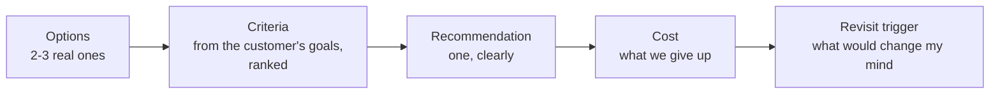
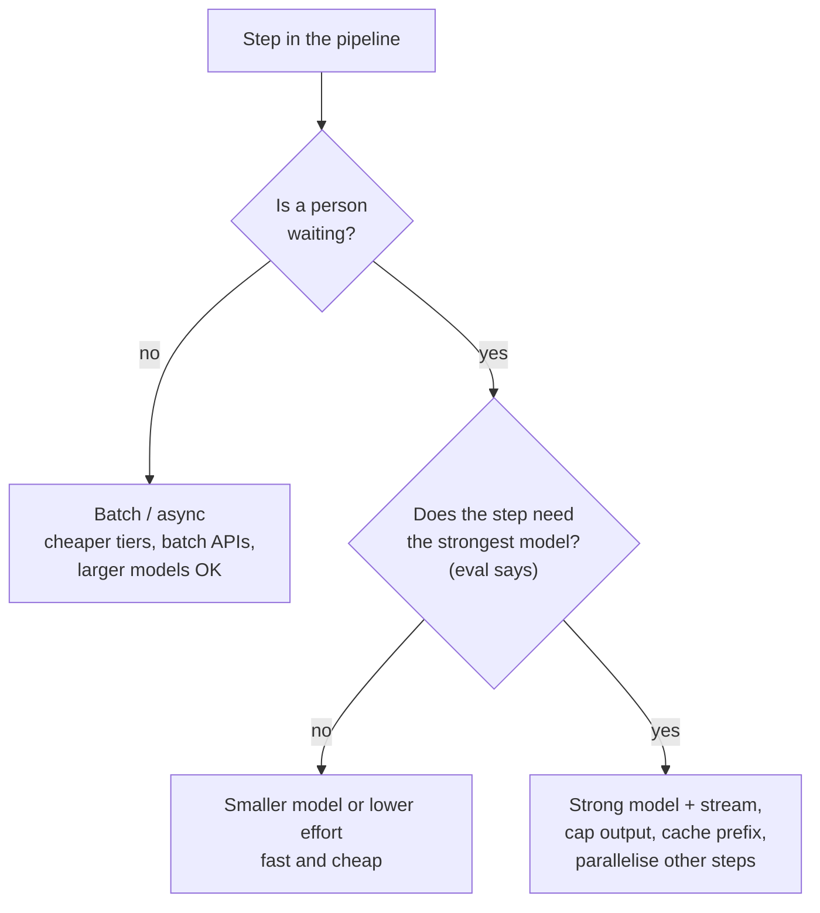

# Defending Trade-offs: Build vs Buy, Latency vs Cost, Cloud vs On-Prem

!!! abstract "Key takeaways"
    - A trade-off answer has five parts: **options → criteria (from the customer's goals) → recommendation → cost of the choice → what would make you revisit it**. Say all five, in that order, in under a minute.
    - **Build vs buy:** buy (or use a platform) for capabilities that don't differentiate the customer (Fowler's utility vs strategic distinction); build the thin layer that encodes their workflow, data and policy. Always own the **evals, data and integration contracts**, whichever you choose.
    - **Latency vs cost vs quality:** decide per step with numbers. Output tokens dominate latency and cost; stream, cap output, cache stable prefixes, route easy work to smaller models, batch what isn't interactive. Quote p95, not averages.
    - **Cloud vs on-prem:** start from **where data may go and who approves it**, then compare hosted API, the customer's cloud AI platform, self-hosting in their VPC, and air-gapped on time to value, model quality, operating burden and cost at the customer's real volume.
    - Prefer **reversible** choices and say how you'd reverse them: a model gateway, versioned prompts, eval gates and infrastructure as code turn many one-way doors into two-way doors.

## Why it matters

Every FDE design round ends with "why did you choose X over Y?", and every real engagement has the same three arguments, usually with someone senior on the other side: the CTO who wants to build everything in-house, the CFO who thinks the token bill is out of control, the CISO who doesn't want data leaving the building. Interviewers aren't looking for the "right" option; they're looking for whether you reason from the customer's goals, use numbers, admit the cost of your choice, and leave room to change your mind.

This page gives a reusable structure and the specific arguments for the three trade-offs that come up most. It builds on [prioritisation and trade-off calls](../fde-decomposition-scoping/04-prioritisation-trade-off-calls-and-cutting-scope-under-time.md), [model selection](../fde-applied-llm/01-model-selection-and-routing-quality-vs-latency-vs-cost-acros.md), [deployment models](../fde-enterprise-deployment/01-deployment-models-hosted-api-vs-customer-vpc-vs-on-prem-and.md) and [talking to executives](../fde-customer-discovery/05-talking-to-executives-vs-engineers-demos-executive-pitch-sta.md).

## Core concepts

### The five-part trade-off script


*Notice that the criteria come before the recommendation and come from the customer. A recommendation defended with your own preferences ("I like Postgres") loses to one defended with theirs ("you need this live before the regulatory deadline").*

Example, said aloud:

> "Two options: Bedrock in your AWS account, or a self-hosted open-weight model in your VPC. Your criteria, in order: data stays in your AWS boundary, live in 10 weeks, answer quality on your eval set. I recommend Bedrock: it meets the boundary requirement through your existing AWS agreement, we can be live in weeks, and the strongest models scored 9 points higher on your eval set. The cost is per-token spend and dependence on what Bedrock offers in your region. I'd revisit if monthly spend passes about $X, where self-hosting becomes cheaper, or if security rules out third-party models entirely."

### Reversibility: one-way and two-way doors

Spend decision time in proportion to how hard the choice is to undo (Bezos's one-way vs two-way doors). Many AI-system choices can be made reversible on purpose:

| Choice | Make it reversible by |
|---|---|
| Model / provider | A thin model gateway, prompts and routing in config, structured-output contracts, evals as the gate for any switch |
| Vector store / search | An index-builder pipeline you can re-run, versioned indexes behind an alias |
| Agent framework | Keep tools and policies framework-independent (plain functions, MCP servers) |
| Hosting | Infrastructure as code (Terraform, Helm), containers, no hand-built environments |
| Vendor platform | Own the data, the eval set, the integration contracts and an export path |

Say this out loud in the round: "This is a two-way door because of the gateway and the eval suite, so I'll pick the faster option now."

### Trade-off 1: build vs buy

Martin Fowler's *Utility vs Strategic Dichotomy* separates software that's a utility (necessary but not differentiating, like payroll) from software that's strategic (a source of competitive advantage), and argues they should be run differently. In AI deployments the question is usually narrower: buy a platform or product for a whole capability, assemble from managed components, or build custom.

| Option | Examples | Pros | Cons | Pick when |
|---|---|---|---|---|
| Buy a product | Support-agent platforms, document AI products, Copilot-style assistants | Fastest, maintained, vendor carries roadmap | Fit gaps, per-seat/per-outcome pricing, less control, data terms | Capability is a utility for this customer; the product fits ≥ 80% |
| Assemble managed components | Bedrock/Azure/Vertex models, managed search, managed extraction, workflow engines | Fast, fits their cloud and contracts, less to operate | Integration work; platform limits | Most FDE engagements |
| Build custom | Own orchestration, retrieval, models or UI | Full control, differentiation, no per-unit fees | Build and maintenance cost, hero dependency risk | It's strategic for them, or no product meets the constraints |

Criteria to rank with the customer:

1. **Differentiation:** is this how they compete, or plumbing?
2. **Fit:** does a product cover the workflow, data and policy needs, or will customisation eat the savings?
3. **Constraints:** data residency, deployment environment, identity integration; many products fail here first.
4. **Total cost of ownership:** licences and per-unit fees vs build plus **3 years of maintenance** (people, on-call, upgrades, model changes).
5. **Time to value:** is there a date that matters?
6. **Exit cost:** data export, lock-in, contract terms.

Two things you never outsource, even when buying: the **eval set** (so you can compare vendors and catch regressions) and the **integration contracts** to their systems of record.

!!! tip "The FDE's honest position"
    If you work for a model or platform vendor, the customer knows you prefer your product. Credibility comes from saying where it doesn't fit ("for payroll-style utilities, use your existing SaaS; let's focus our work on the claims workflow, where your process is the differentiator").

### Trade-off 2: latency vs cost (vs quality)

The three axes move together; decide per step of the pipeline, not per system.


*Notice the first question isn't about models at all. Moving work off the interactive path (precomputing summaries, nightly batch) is often the biggest win for both latency and cost.*

Facts to use:

- **Output tokens dominate.** They're generated one at a time and usually priced several times higher than input tokens. Shorter, structured output cuts both latency and cost.
- **Streaming** makes perceived latency roughly the time to first token.
- **Prompt caching** discounts a repeated stable prefix (Anthropic bills cache reads at about 10% of the base input price; OpenAI caches long prompts automatically) and lowers time to first token.
- **Batch APIs** are typically around half price for work that can wait hours.
- **Effort/thinking controls** trade latency and cost for quality inside one model; test a strong model at low effort before building a multi-model cascade.
- **Cost per completed task**, not per request: a cheap model that needs retries and human fixes can be the expensive option.

Worked comparison (illustrative prices, verify before quoting):

```text
Task: draft a reply for a complaints agent. 6,000 input tokens (4,000 stable), 500 output.
Strong model at $2 / $10 per 1M:   6,000×2e-6 + 500×10e-6 = $0.012 + $0.005 = $0.017
  with caching of the 4,000-token prefix (reads at 10%): 2,000×2e-6 + 4,000×0.2e-6 + $0.005 ≈ $0.010
Small model at $0.10 / $0.50:      6,000×0.1e-6 + 500×0.5e-6 ≈ $0.0009
Eval: strong model 94% acceptable drafts; small model 81%.
If each unacceptable draft costs 4 minutes of an agent's time (~$2), expected cost per task:
  strong: $0.010 + 0.06×$2 = $0.13      small: $0.0009 + 0.19×$2 = $0.38
```

The numbers make the argument: the cheaper model is the more expensive task.

### Trade-off 3: cloud vs on-prem (and everything between)

| Option | Data path | Model quality | Time to value | Operating burden | Cost shape |
|---|---|---|---|---|---|
| Vendor hosted API | Leaves customer boundary (under DPA, retention terms) | Newest models first | Days | Lowest | Per token |
| Cloud AI platform in customer account (Bedrock, Azure OpenAI/Foundry, Vertex AI) | Stays in their cloud tenancy; private endpoints | Strong models, sometimes lagging features/regions | Weeks | Low | Per token, on their cloud bill |
| Self-hosted open weights in their VPC/data centre | Never leaves | Good and improving; may trail frontier on hard tasks | Weeks to months | High: GPUs, serving (vLLM etc.), scaling, safety, upgrades | Capacity (GPUs), whether used or not |
| Air-gapped | Physically isolated | Whatever you can ship offline | Months | Highest: offline updates, manual patching | Capacity + operations |

How to decide:

1. **Start with the rule, not the preference:** what may leave the boundary, under which contract, approved by whom? Bedrock's documentation, for example, states that prompts and completions aren't stored, aren't used to train models and aren't shared with model providers; that's often what unlocks the cloud-platform option. Get the equivalent statements for the customer's chosen platform and region.
2. **Run the eval set on each candidate.** If a self-hosted model is 10 points worse on their task, that's a business cost, not a technical footnote.
3. **Model cost at their real volume.** Self-hosting has a fixed GPU cost; per-token pricing scales with use. There's a break-even volume, and utilisation matters: GPUs at 15% utilisation are expensive.
4. **Count the people.** Self-hosting means someone owns model serving, upgrades, security patches and capacity at 3 a.m.
5. **Choose the reversible path:** a gateway lets you start on a cloud platform and move steps to self-hosted models later (or the reverse) without rewriting the application.

!!! warning "Gotcha: 'on-prem for security' without a threat model"
    Self-hosting doesn't automatically make a system safer: unpatched GPU servers and homegrown model serving can be riskier than a managed service with strong contractual and technical controls. Ask what threat the requirement addresses (data exfiltration, provider training on data, residency, availability) and match the control to it.

## In practice: code & configuration

### A decision record you leave with the customer

```markdown
# ADR-007: Model hosting for the claims assistant
Status: Accepted (2026-10-08) · Owners: <FDE>, <customer architect> · Review by: 2027-04-01

## Context
PHI in prompts; customer runs on AWS; security requires data to stay in the AWS organisation.
Volume: ~120K requests/day; p95 latency target 3 s; go-live before the Q1 audit.

## Options
1. Model via Amazon Bedrock in the customer's account (private endpoint)
2. Self-hosted open-weight model on EKS GPU nodes
3. Vendor hosted API (ruled out: data boundary)

## Decision
Option 1.

## Criteria and evidence
- Boundary: meets requirement under existing AWS agreement (security sign-off 2026-10-02).
- Quality: eval set (600 cases) acceptable-answer rate 93% vs 84% for the best self-hosted candidate.
- Time: live in ~6 weeks vs ~14 weeks including GPU procurement and serving hardening.
- Cost: ~$X/month at forecast volume vs ~$Y/month GPU capacity at expected utilisation.

## Consequences
- Per-token cost scales with usage; budgets and alerts per business unit.
- Dependence on model availability in eu-west-1.

## Revisit if
- Monthly spend exceeds $Z (break-even estimate) or volume triples.
- Security policy changes to prohibit third-party models.
- A self-hosted candidate reaches ≥ 91% on the eval set.

## Reversibility
Model gateway + versioned prompts + eval gate: switching hosting changes one adapter and
requires an eval run, not an application rewrite.
```

### Wrong vs right: answering "why not build it ourselves?"

=== "❌ Common mistake"
    ```text
    CTO:  "Why don't we just build this ourselves?"
    FDE:  "Our platform is much better than anything you could build, and it's what we
           recommend for all our customers."
    - Defensive, vendor-centred, no criteria, no numbers.
    ```

=== "✅ Correct approach"
    ```text
    FDE:  "You could, and for some parts you should. Let's split it. The workflow logic,
           your claims rules and the integration with your adjudication system are your
           differentiators: your team should own those, and we'll build them with you so
           you can. The model hosting, evaluation tooling and connectors are utilities;
           building them costs roughly two engineers for a year plus ongoing upgrades,
           against [cost] for the managed option. The deciding factor is your Q1 audit
           date. I'd use managed components now behind a gateway, so if your volume makes
           self-hosting cheaper next year, you can move without a rewrite."
    ```

## Real-world usage

- **Klarna** publicly moved away from some SaaS tools in 2024, citing AI-assisted in-house development; the broader industry debate since has been about which systems are worth owning. The useful takeaway for interviews is Fowler's lens: rebuild only what differentiates you.
- **Regulated industries** frequently land on the middle option: frontier models through their existing cloud provider (Bedrock, Azure OpenAI, Vertex AI) with private networking and customer-managed keys, rather than either a public API or full self-hosting.
- **Public sector and defence** drive the air-gapped end of the spectrum; vendors including Palantir, Google, Microsoft and AWS offer classified or sovereign-cloud environments, at the cost of slower model availability.

## Trade-offs & production gotchas

| Pitfall | Why it happens | Fix |
|---|---|---|
| Recommending without criteria | Habit or vendor bias | Ask the customer to rank criteria first |
| Comparing list prices only | Ignoring people and maintenance | 3-year TCO including on-call and upgrades |
| Averages for latency | Easy to compute | p95/p99 per step |
| Cost per request | Ignores retries and human fixes | Cost per completed task at equal quality |
| Self-hosting for "security" | No threat model | Map requirement to threat, then to control |
| Irreversible choices early | Speed | Gateway, IaC, eval gates; record revisit triggers |

!!! tip "Interview angle"
    End every trade-off with the revisit trigger. "I'd revisit if volume triples" shows you understand that the right answer depends on conditions that change, which is the senior signal in these rounds.

## How this connects to my experience

- **Where it applies:** trade-off calls are constant in the resume: *"Collaborated with senior architects to design scalable service architecture, API strategies, and data integration patterns"* (OptumRx Meteor); *"Implemented Redis-based caching for frequently accessed queries"* (latency vs freshness vs cost); multi-cloud key management at Coriolis CCKM across *"AWS, Azure, and GCP environments"* with HSMs (*"Thales Luna and SafeNet"*), which is the cloud vs customer-controlled (HSM) trade-off in security form; AWS Solutions Architect Associate (2023).
- **Talking points:**
    - "CCKM existed because customers wanted control of their keys in someone else's cloud: bring-your-own-key and HSM-backed keys are the same conversation as 'cloud model vs self-hosted model'." *[confirm: the customer reasons you heard for HSM-backed or external key management]*
    - "Redis caching was a latency/cost/freshness trade-off: I'd explain the TTL choice per data type and when we'd revisit it." *[confirm: TTLs and the data types cached]*
    - A build-vs-buy decision you were part of. *[confirm: e.g. PingFederate vs custom auth, a managed AWS service vs self-managed]*
- **Likely follow-up chain:** "Tell me about a trade-off you made" → "What were the options?" → "What did it cost you?" → "Would you make the same call today?". Use the five-part script; end with what would change your mind.

## Interview questions

### Fundamentals

??? question "Q1. How do you structure a trade-off answer?"
    **Answer:** Options, criteria ranked from the customer's goals, a clear recommendation, the cost of choosing it, and the trigger that would make you revisit. Under a minute, with at least one number.

    **Interviewer listens for:** criteria before the recommendation, and a revisit trigger.

    **Common wrong answer:** "It depends" without committing.

??? question "Q2. When should a customer build rather than buy?"
    **Answer:** When the capability is strategic (how they compete), no product meets their constraints (data, deployment, workflow fit), or the 3-year total cost of a product exceeds building and maintaining it. Buy or assemble managed components for utilities. Own the evals, data and integration contracts either way.

    **Interviewer listens for:** differentiation, constraints, TCO.

    **Common wrong answer:** "Build when you have engineers."

??? question "Q3. What drives LLM latency and cost most?"
    **Answer:** Output tokens (generated sequentially and priced higher), then input length (prefill, mitigated by caching), reasoning effort, model size, and the number of sequential LLM calls. Stream, cap output, cache stable prefixes, parallelise independent steps, and move non-interactive work to batch.

    **Interviewer listens for:** output tokens and sequential calls.

    **Common wrong answer:** "Network latency."

??? question "Q4. What are the options between 'public API' and 'on-prem'?"
    **Answer:** Vendor hosted API under a DPA; the customer's cloud AI platform (Bedrock, Azure OpenAI/Foundry, Vertex AI) with private endpoints; self-hosted open-weight models in their VPC or data centre; and air-gapped. Each changes model quality, time to value, operating burden and cost shape.

    **Interviewer listens for:** the middle option.

    **Common wrong answer:** Treating it as binary.

### Intermediate

??? question "Q5. How do you compare a cheap model and an expensive one fairly?"
    **Answer:** On the same eval set, then cost per completed task including retries, escalations and human fixes, at the latency the workflow needs. A cheaper model with lower acceptance can cost more per task once human time is counted.

    **Interviewer listens for:** cost per completed task.

    **Common wrong answer:** Comparing price per million tokens.

??? question "Q6. When does self-hosting become cheaper than per-token pricing?"
    **Answer:** When sustained volume keeps GPUs well utilised: compute the fixed monthly cost of the capacity needed for peak (GPUs, serving, people) against per-token cost at forecast volume. Low or spiky volume favours per-token; high, steady volume and a model that meets the quality bar favour self-hosting. Include engineering and on-call cost.

    **Interviewer listens for:** utilisation and people cost.

    **Common wrong answer:** "Self-hosting is always cheaper at scale."

??? question "Q7. How do you make a model or hosting choice reversible?"
    **Answer:** A model gateway with provider adapters, prompts and routing in versioned config, structured-output contracts, retrieval and tools independent of the model, infrastructure as code, and an eval suite that gates any switch. Then changing hosting is an adapter plus an eval run.

    **Interviewer listens for:** evals as the gate.

    **Common wrong answer:** "Use an open-source framework."

??? question "Q8. A customer wants everything real time. How do you push back?"
    **Answer:** Ask which decisions change if data is minutes or hours old, cost the real-time pipeline per metric, and propose tiers: real time only where a decision needs it. Show the numbers and the operational burden.

    **Interviewer listens for:** decision latency and cost per tier.

    **Common wrong answer:** "Real time is best practice."

### Senior

??? question "Q9. You work for the vendor. How do you keep build-vs-buy advice credible?"
    **Answer:** Use the customer's criteria, say where your product isn't the right fit, separate their differentiators (which they should own) from utilities, put TCO numbers on both sides, and make the decision reversible. Trusted-advisor credibility comes from low self-orientation.

    **Interviewer listens for:** honesty that sometimes costs the sale.

    **Common wrong answer:** "Always recommend our platform."

??? question "Q10. The CISO insists on self-hosting 'for security'. What do you do?"
    **Answer:** Ask which threat it addresses: exfiltration, provider training on data, residency, insider access, availability. Show the controls each option offers (contractual terms, private networking, customer-managed keys, no training, logging), and the risks of self-hosting (patching, serving security). If self-hosting is still required, run the eval set on candidate models and plan the operations properly.

    **Interviewer listens for:** threat model before control.

    **Common wrong answer:** Arguing the CISO is wrong.

??? question "Q11. How do you document a trade-off so it survives your departure?"
    **Answer:** An architecture decision record: context, options, criteria with evidence (eval scores, costs, timelines), decision, consequences, revisit triggers and the reversibility mechanism, owned jointly with the customer's architect and reviewed on a date.

    **Interviewer listens for:** revisit triggers and shared ownership.

    **Common wrong answer:** "It's in the slide deck."

### Scenario-based

??? question "Q12. Finance says the LLM bill is too high three months after launch. Walk through your response."
    **Answer:** Break cost down by route, tenant and step from usage data; check cache hit rate, output lengths, retries and agent turns; then apply levers in order: caching, trimming context and output, routing easy steps to smaller models or lower effort, batch for async work, per-tenant budgets. Re-run evals after each change and report cost per completed task before and after.

    **Interviewer listens for:** measure first, levers, evals.

    **Common wrong answer:** "Switch to the cheapest model."

??? question "Q13. A self-hosted model scores 8 points lower on the eval set but satisfies a strict residency rule. What do you recommend?"
    **Answer:** If the rule is hard, the self-hosted model is the option; then close the gap: better retrieval, prompts, task decomposition, human review on low-confidence cases, maybe tuning, and a narrower initial scope where it performs well. Show the sponsor the quality difference in business terms and the plan to improve it.

    **Interviewer listens for:** respecting the constraint and managing the quality gap.

    **Common wrong answer:** "Push for an exception."

??? question "Q14. The CTO says, 'We'll build our own LLM platform so we're not locked in.' Respond."
    **Answer:** Agree on the goal (avoid lock-in), then show cheaper ways to get it: a thin gateway, open standards (MCP for tools, OpenTelemetry for traces), owning prompts, evals and data, and infrastructure as code. Building a full platform is a multi-year commitment; reserve in-house effort for what differentiates them.

    **Interviewer listens for:** meeting the interest without the position.

    **Common wrong answer:** "Lock-in isn't a real concern."

## Cheat sheet

| Concept | Remember |
|---|---|
| Script | Options → criteria (theirs) → recommendation → cost → revisit trigger |
| Reversibility | Gateway, versioned prompts, contracts, IaC, eval gate |
| Build vs buy | Strategic → build; utility → buy/assemble; always own evals, data, contracts; 3-year TCO |
| Latency/cost | Output tokens dominate; stream, cap, cache, smaller model/effort, batch, parallelise; p95 |
| Unit | Cost per completed task at equal quality |
| Hosting | Hosted API · cloud platform in their account · self-hosted VPC · air-gapped |
| Hosting decision | Rule first, evals per option, cost at real volume, people, reversibility |
| Record | ADR with revisit triggers and review date |

## Sources
1. [Martin Fowler: Utility Vs Strategic Dichotomy](https://www.martinfowler.com/bliki/UtilityVsStrategicDichotomy.html): utility vs strategic software.
2. [Amazon: 2015 Letter to Shareholders (one-way and two-way doors)](https://www.aboutamazon.com/news/company-news/2015-letter-to-shareholders): reversibility and decision speed.
3. [Amazon Bedrock: Data protection](https://docs.aws.amazon.com/bedrock/latest/userguide/data-protection.html): prompts and completions not stored, not used for training, not shared with providers.
4. [Anthropic: Prompt caching](https://docs.anthropic.com/en/docs/build-with-claude/prompt-caching): cache read and write pricing multipliers.
5. [Michael Nygard: Documenting Architecture Decisions](https://cognitect.com/blog/2011/11/15/documenting-architecture-decisions): the ADR format.
6. Related: [Model selection](../fde-applied-llm/01-model-selection-and-routing-quality-vs-latency-vs-cost-acros.md), [Deployment models](../fde-enterprise-deployment/01-deployment-models-hosted-api-vs-customer-vpc-vs-on-prem-and.md), [Observability and cost](../fde-applied-llm/07-llm-observability-latency-budgets-and-token-cost-control.md).
