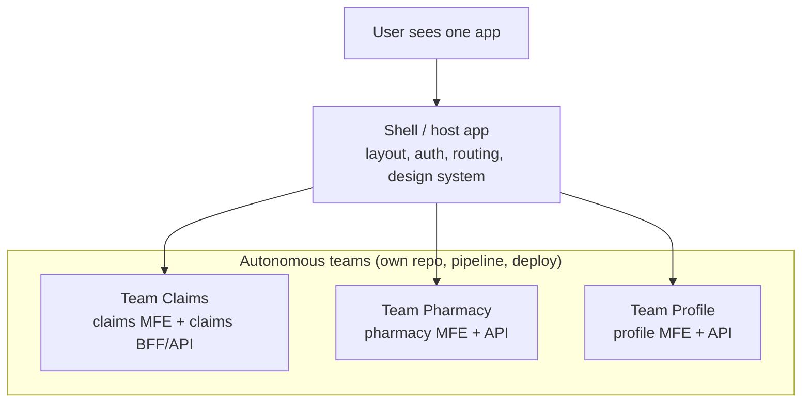
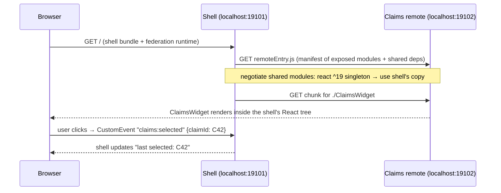
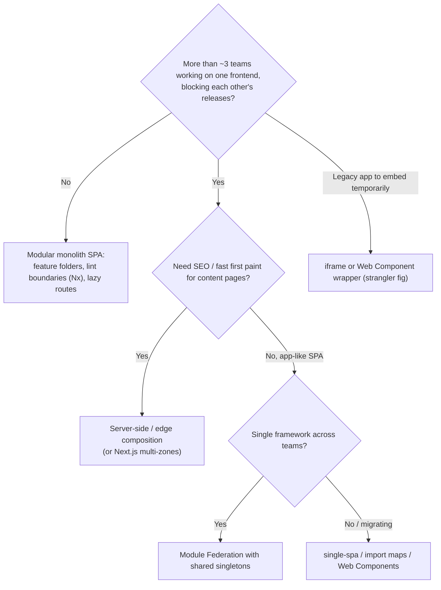

# Micro-Frontends: Approaches & Trade-offs

!!! abstract "TL;DR"
    - **Micro-frontends** apply microservice ideas to the UI: a large web app is split into **vertical slices owned by autonomous teams** (claims, pharmacy, profile), each **deployed independently**, then composed into one experience by a **shell** (host).
    - Composition options: **build-time** (npm packages: simple, but couples releases), **server-side** (SSI/ESI, edge or Node composition), **iframes** (strong isolation, poor UX integration), **runtime JavaScript** (**Module Federation**, single-spa, Native Federation, import maps), and **Web Components** (framework-agnostic boundaries).
    - Demo: a webpack 5 **Module Federation** shell loaded a `claims/ClaimsWidget` remote from another origin at runtime. With React shared as a **singleton**, it rendered, and a `CustomEvent` reached the shell ("last selected: C42"). Without sharing, two React copies loaded and the remote crashed with **"Cannot read properties of null (reading 'useState')"**. Shared dependency management is the heart of runtime composition.
    - Benefits: team autonomy, independent deploys, incremental migration (strangler fig for legacy frontends), smaller blast radius. Costs: **duplicated dependencies and payload**, cross-app consistency (design system), shared state and routing complexity, harder testing and observability, version skew at runtime.
    - Use them when **organisational scale** demands it (several teams on one product, different release cadences, legacy migration). For one team, a well-structured **modular monolith** frontend is usually better.

## Why it matters

Micro-frontends are a frequent senior-frontend and full-stack interview topic, and they're on my resume: I "built the ReactJS application from the ground up and established a micro-frontend architecture" at OptumRx. Interviewers want to know why you chose them, which composition technique, how you handled shared dependencies, routing, state and styling, what it cost in performance, and whether you'd do it again. A good answer weighs organisational benefits against technical costs instead of presenting micro-frontends as automatically better.

The Module Federation behaviour on this page was reproduced with **webpack 5.111**, **React 19** and headless **Chromium** (Playwright) while writing this page: a host on one port loading a remote from another.

## Core concepts

### The idea


*Notice that the split is vertical, by business capability, from UI to API. Splitting by technical layer (a "header team", a "buttons team") recreates coordination problems instead of removing them.*

Principles (Cam Jackson / martinfowler.com, Michael Geers): technology agnosticism where useful, isolated team code (no shared runtime state), team prefixes for CSS, events and storage keys, native browser features for communication, and resilient composition (a failing MFE degrades, it doesn't take down the page).

### Composition approaches

| Approach | How | Independent deploy | Performance | Isolation | Typical use |
|---|---|---|---|---|---|
| **Build-time packages** | Each MFE published as an npm package, shell bundles them | **No**: shell rebuild per change | Best (one optimised bundle) | Low | Shared components, small orgs |
| **Server-side composition** | SSI/ESI, Node or edge (Podium, Tailor, Next.js, edge workers) stitches HTML fragments | Yes | Good first paint, SEO-friendly | Medium | Content sites, e-commerce |
| **iframes** | Each MFE in an iframe | Yes | Heavier, separate document per frame | **Strong** (separate JS/CSS context) | Legacy embedding, third-party widgets |
| **Runtime JS: Module Federation** | Shell loads remote modules at runtime via `remoteEntry.js`, shares dependencies | Yes | Good with shared singletons | Low–medium (same JS context) | React/Angular SPAs at scale |
| **Runtime JS: single-spa / import maps** | Router mounts/unmounts framework apps, modules resolved via import maps (SystemJS or native) | Yes | Depends on sharing | Medium | Multi-framework migration |
| **Web Components** | MFEs exposed as custom elements (`<claims-widget>`), Shadow DOM for styles | Yes (with runtime loading) | Good | Medium (Shadow DOM CSS isolation) | Framework-agnostic boundaries |

### Module Federation, measured


*Notice that the remote is deployed and versioned separately, and the shell discovers it at runtime by URL. The share scope negotiation decides which copy of React everyone uses.*

| Configuration | React copies at runtime | Widget | Events | Errors |
|---|---|---|---|---|
| `shared: { react: { singleton: true, requiredVersion: "^19.0.0" }, "react-dom": {…} }` | **1** | Rendered | "last selected: C42" | none |
| No `shared` (each app bundles React) | **2** | **Not rendered** | n/a | `Cannot read properties of null (reading 'useState')` |

React's hooks rely on a single dispatcher, so a component from one React copy rendered by another breaks. The same class of problem affects any library with global state or singletons (routers, styled-components themes, Redux stores, i18n instances).

### Benefits and costs

| Benefit | Cost / risk |
|---|---|
| Teams ship independently, smaller codebases | Coordination moves to contracts: shared deps, events, routes, design tokens |
| Incremental modernisation (strangle a legacy Angular/JSP app) | Temporary mixed stacks increase payload and complexity |
| Fault isolation (a broken MFE shows a fallback) | Runtime integration errors appear only in production-like environments |
| Technology choice per team | Multiple frameworks = multiple runtimes downloaded |
| Scales with organisation size | Overhead for small teams: more pipelines, infra and versioning |
| Clear ownership | UX consistency needs a strong design system and governance |

### Decision guide


*Notice that the first question is organisational, not technical. Micro-frontends solve a team-scaling problem and are rarely worth it otherwise.*

## In practice: code & configuration

### Module Federation configuration (webpack 5)

```js
// remote: claims (deployed at https://claims.example.com/)
new ModuleFederationPlugin({
  name: "claims",
  filename: "remoteEntry.js",
  exposes: { "./ClaimsWidget": "./src/ClaimsWidget.jsx" },     // public contract of this MFE
  shared: {
    react: { singleton: true, requiredVersion: "^19.0.0" },    // one React for the whole page
    "react-dom": { singleton: true, requiredVersion: "^19.0.0" },
  },
});

// host: shell
new ModuleFederationPlugin({
  name: "shell",
  remotes: { claims: "claims@https://claims.example.com/remoteEntry.js" },   // or resolved at runtime from a manifest
  shared: { react: { singleton: true, requiredVersion: "^19.0.0" }, "react-dom": { singleton: true, requiredVersion: "^19.0.0" } },
});
```

```jsx
// shell: lazy-load with a fallback and an error boundary so one MFE can't break the page
const ClaimsWidget = lazy(() => import("claims/ClaimsWidget"));

export function ClaimsSlot({ memberId }) {
  return (
    <ErrorBoundary fallback={<p>Claims are temporarily unavailable.</p>}>
      <Suspense fallback={<Spinner />}>
        <ClaimsWidget memberId={memberId} />
      </Suspense>
    </ErrorBoundary>
  );
}
```

Note the `import("./bootstrap")` entry pattern used in the demo: an async boundary lets the federation runtime negotiate shared modules before React initialises (otherwise you get "Shared module is not available for eager consumption"). Newer tooling (`@module-federation/enhanced`, Rspack, Vite plugins, Native Federation for Angular) adds runtime manifests, type sharing and dynamic remotes.

=== "❌ Common mistake"

    ```text
    Split by technical layer ("header MFE", "footer MFE", "button library MFE"),
    no shared-dependency policy (each MFE bundles its own React/Redux/MUI),
    remotes pinned to "latest" URLs with no versioning, no error boundaries,
    and a global Redux store that every MFE reads and writes.
    ```

=== "✅ Better"

    ```text
    Split by business capability with clear ownership, a shell that owns layout/auth/routing,
    shared singletons for framework + design system with semver ranges,
    versioned remote URLs or a manifest service for rollout/rollback,
    error boundaries and fallbacks per slot, communication via events/URL, not shared stores,
    contract tests for exposed modules, and performance budgets per MFE.
    ```

### Web Component boundary (framework-agnostic)

```js
// claims team ships a custom element; the shell (any framework) just uses <claims-widget member-id="M42">
class ClaimsWidgetElement extends HTMLElement {
  static observedAttributes = ["member-id"];
  connectedCallback() { this.root = createRoot(this.attachShadow({ mode: "open" })); this.render(); }
  attributeChangedCallback() { this.render(); }
  disconnectedCallback() { this.root?.unmount(); }
  render() { this.root?.render(<ClaimsWidget memberId={this.getAttribute("member-id")} />); }
}
customElements.define("claims-widget", ClaimsWidgetElement);
```

## Real-world usage

- **IKEA, Zalando (Project Mosaic, Tailor), Spotify (desktop app, historically iframes), DAZN, SAP, Upwork** have published micro-frontend architectures. Zalando and IKEA leaned on server-side composition for performance.
- **Module Federation** is common in large React/Angular enterprises (banking, insurance, healthcare portals) to let product teams deploy features into a shared shell.
- **single-spa** is used for migrating AngularJS/legacy SPAs incrementally to React or Angular.
- **Next.js Multi-Zones** splits a site into separately deployed Next.js apps under one domain (route-level composition).
- Many organisations later **consolidate** back when the coordination cost outweighs autonomy, a useful warning.

## Trade-offs & production gotchas

!!! warning "Micro-frontend pitfalls"
    - **Duplicate or mismatched shared libraries:** two React copies break hooks (measured). Version drift across singletons triggers warnings or subtle bugs.
    - **Payload bloat:** each MFE bringing its own framework, polyfills and UI library. Enforce shared singletons and budgets.
    - **Runtime coupling hidden as "independence":** an MFE changing its exposed props breaks the shell in production. Treat exposed modules as versioned APIs with contract tests.
    - **Global CSS collisions:** use CSS Modules, prefixes or Shadow DOM, and a shared token-based design system.
    - **Shared state stores** across MFEs recreate a distributed monolith. Communicate via URL, events and backend.
    - **No resilience:** a remote that fails to load blanks the page. Use error boundaries, timeouts and fallbacks.
    - **Observability gaps:** errors need MFE/version tags. Use RUM with per-MFE attribution.
    - **Too fine-grained:** dozens of tiny MFEs multiply pipelines and runtime requests.

- **Autonomy vs consistency:** more independence means more effort to keep UX and dependencies aligned.
- **Runtime vs build-time integration:** runtime gives independent deploys but moves integration testing to runtime. Build-time is safer but couples releases.

## How this connects to my experience

- **Resume bullet (OptumRx, Publicis Sapient):** "**Built the ReactJS application from the ground up and established a micro-frontend architecture.**" Also: "Led a cross-functional team of 8–10 engineers delivering enterprise healthcare applications serving 750K+ users" and frontend skills "ReactJS, Redux, React Query, Material UI, Storybook".
- **How to talk about it (STAR outline):**
    - *Situation:* a healthcare portal for 750K+ users with several feature areas and teams. *[confirm: number of teams/MFEs, which domains]*
    - *Task:* let teams deliver independently without a monolithic frontend release train. *[confirm the main driver: team scale, release cadence, legacy migration]*
    - *Action:* a React shell owning layout, authentication (OAuth2/PingFederate) and routing; domain MFEs composed at runtime *[confirm: Module Federation vs single-spa vs other]*; shared React, router and Material UI-based design system as singletons; communication via events and URL; Storybook for shared components. *[confirm specifics]*
    - *Result:* *[confirm measurable outcomes: deploy frequency, lead time, performance budgets — don't invent numbers]*
- **Talking points:**
    - "I'd only choose micro-frontends for organisational scale. For one team, a modular monolith with lazy routes is simpler."
    - "The hard parts are contracts: shared singletons and versions, events and routes, and the design system, not the loading mechanism."
    - "Every remote gets an error boundary and fallback, so one team's bad deploy can't blank the portal."
- **Likely follow-up chain:** "Why micro-frontends?" → "Which composition approach and why?" → "How did you share React/MUI?" → "How do MFEs communicate?" ([shared deps, routing and communication](02-shared-dependencies-routing-and-communication-between-micro.md)) → "How did you keep the UI consistent?" ([design systems](04-design-systems-and-component-libraries.md)) → "What about performance and testing?" → "Would you do it again?"

## Interview questions

### Fundamentals

??? question "Q1. What are micro-frontends, and what problem do they solve?"
    **Answer:** An architectural style where a frontend is split into independently developed and deployed pieces owned by autonomous teams, usually aligned to business domains, composed into one application at build time, on the server or at runtime. They solve organisational scaling problems: many teams blocked by a single frontend codebase and release train, different release cadences, and incremental migration away from legacy frontends. They don't make a small app faster or simpler.

    **Interviewer listens for:** team autonomy, independent deployment, domain alignment, and organisational motivation.

    **Common wrong answer:** "Splitting React components into separate npm packages."

??? question "Q2. Name the main ways to compose micro-frontends."
    **Answer:** Build-time integration (packages bundled by the shell, simple but couples releases), server-side composition (SSI/ESI or a Node/edge layer stitching HTML fragments, good for SEO and first paint), iframes (strong isolation, poor integration), runtime JavaScript integration (Module Federation, single-spa with import maps, Native Federation), and Web Components as framework-agnostic boundaries, often combined with runtime loading.

    **Interviewer listens for:** several approaches with one trade-off each.

    **Common wrong answer:** "Only iframes."

??? question "Q3. What is Module Federation?"
    **Answer:** A webpack 5 feature (also in Rspack, and via plugins in Vite) that lets a build expose modules and consume modules from other independently deployed builds at runtime. A remote publishes a `remoteEntry.js` manifest, the host loads it by URL, and both negotiate shared dependencies through a share scope with version ranges and singleton rules. In the demo, the shell rendered `claims/ClaimsWidget` from another origin, sharing one React instance.

    **Interviewer listens for:** runtime loading, exposes/remotes, shared dependency negotiation.

    **Common wrong answer:** "A way to put several apps in iframes."

??? question "Q4. When should you not use micro-frontends?"
    **Answer:** When a single team (or a few closely collaborating teams) owns the frontend, when the app is small or medium, when there's no release-coupling pain, or when performance budgets are very tight. The costs (extra pipelines, runtime integration, dependency coordination, payload, testing complexity, UX consistency) then outweigh the benefits. A modular monolith with clear feature boundaries, lazy-loaded routes and lint-enforced module boundaries is the better default.

    **Interviewer listens for:** organisational criteria and the modular-monolith alternative.

    **Common wrong answer:** "Always, because microservices are best practice."

### Intermediate

??? question "Q5. Why must React be shared as a singleton in Module Federation?"
    **Answer:** React's hooks use a module-level dispatcher. If the remote component imports its own React copy while being rendered by the host's React, the remote's `useState` reads a dispatcher that's null, crashing with "Invalid hook call" / "Cannot read properties of null (reading 'useState')" (reproduced: two React copies, widget failed). Sharing react and react-dom with `singleton: true` and a compatible `requiredVersion` ensures one instance. The same applies to other stateful libraries (router, Redux, emotion/styled-components, i18n).

    **Interviewer listens for:** dispatcher mechanism, singleton config, version ranges, other affected libraries.

    **Common wrong answer:** "It's just to reduce bundle size."

??? question "Q6. Compare iframes with runtime JavaScript composition."
    **Answer:** iframes give strong isolation: separate JS globals, CSS, and a crash stays inside. They suit embedding legacy apps or third-party content. But they cost a separate document per frame, awkward sizing and responsive layout, duplicated frameworks, complex cross-frame communication (postMessage), accessibility, focus and deep-linking problems. Runtime JS composition (Module Federation, single-spa) integrates seamlessly into one DOM and router and can share dependencies, but shares the global context, so collisions in CSS, globals and libraries must be managed.

    **Interviewer listens for:** isolation vs integration, concrete UX and performance costs.

    **Common wrong answer:** "iframes are outdated and never appropriate."

??? question "Q7. What's server-side composition, and when is it better?"
    **Answer:** The server or edge assembles the page from fragments produced by different teams' services (SSI/ESI includes, a Node layer like Tailor/Podium, edge workers, or framework zones), sending complete HTML to the browser. It gives fast first paint, SEO, and less client JS, and each fragment can still be deployed independently. It's better for content-heavy, public, SEO-sensitive sites (e-commerce, media). App-like dashboards behind login often prefer client-side runtime composition.

    **Interviewer listens for:** HTML stitching, SEO and performance, use-case fit.

    **Common wrong answer:** "It's the same as SSR in one Next.js app."

??? question "Q8. How do you keep micro-frontends from failing the whole page?"
    **Answer:** Wrap each remote in an error boundary with a meaningful fallback, use Suspense with loading states and timeouts for remote loading, version remote URLs (or use a manifest service) so a bad deploy can be rolled back quickly, avoid shared mutable globals, load non-critical MFEs lazily, monitor load failures and errors per MFE and version with RUM, and run contract and smoke tests against deployed remotes.

    **Interviewer listens for:** error boundaries, loading resilience, rollback, observability.

    **Common wrong answer:** "Each team tests their own MFE well."

??? question "Q9. How do you handle CSS conflicts between micro-frontends?"
    **Answer:** Scope styles: CSS Modules or CSS-in-JS with generated class names, team prefixes (BEM with a namespace), Shadow DOM for Web Components, and avoid global resets in MFEs (the shell owns global CSS). Share a design system via tokens (CSS custom properties) and a component library as a singleton, so styles are consistent rather than duplicated. Watch for UI libraries injecting global styles (MUI/emotion caches), which need a single shared instance.

    **Interviewer listens for:** scoping strategies, shell ownership of globals, shared design tokens.

    **Common wrong answer:** "Use !important where needed."

### Senior

??? question "Q10. How would you migrate a large legacy AngularJS app to React incrementally?"
    **Answer:** A strangler-fig approach: introduce a shell (single-spa, Module Federation host, or a server-side router) that can mount both the legacy app and new React micro-frontends per route. Migrate route by route (or domain by domain), starting with high-value, low-coupling areas. Share authentication via the shell (tokens, not app globals), pass context through URL, events and a thin shared API, and wrap legacy pieces as Web Components or iframes where needed. Keep a design system that styles both. Retire legacy routes as replacements land, measure performance (two frameworks downloaded temporarily), and set a deadline so the mixed state doesn't become permanent.

    **Interviewer listens for:** a shell, route-level migration, shared auth, temporary cost awareness.

    **Common wrong answer:** "Big-bang rewrite."

??? question "Q11. How do you version and deploy micro-frontends safely?"
    **Answer:** Each MFE has its own pipeline producing immutable, versioned assets on a CDN (e.g. `/claims/1.8.2/remoteEntry.js`). The shell resolves which version to load from a runtime manifest or configuration service (per environment, per user cohort for canaries) rather than a hard-coded "latest" URL. Rollback means flipping the manifest. Exposed modules are treated as APIs: semantic versioning, backward-compatible props, contract tests in the shell's pipeline against new remote versions, and shared dependency ranges checked in CI.

    **Interviewer listens for:** immutable assets, a manifest-driven rollout, contracts and canaries.

    **Common wrong answer:** "Overwrite remoteEntry.js on each deploy."

??? question "Q12. What are the performance costs of micro-frontends, and how do you control them?"
    **Answer:** Duplicate frameworks and libraries, more network requests (remoteEntry plus chunks per MFE), waterfalls when remotes are discovered late, larger total JS, and slower hydration. Control them with shared singletons for framework, router and design system, preloading or prefetching remote entries for likely routes, HTTP/2 or 3 and CDN caching with immutable hashes, performance budgets per MFE in CI, lazy-loading below-the-fold MFEs, server-side or edge composition for critical pages, and RUM (Core Web Vitals) tagged by MFE.

    **Interviewer listens for:** concrete costs and concrete controls, measurement.

    **Common wrong answer:** "Micro-frontends are faster because each piece is small."

### Scenario-based

??? question "Q13. After a remote team upgraded a library, the shell shows 'Invalid hook call' in production. Diagnose."
    **Answer:** Most likely two copies of React are on the page: the remote now requires a React version outside the shell's shared range, or someone removed `singleton`/sharing, so the federation runtime loaded the remote's own React (reproduced: two copies → hooks crash). Check the share scope at runtime (`__webpack_share_scopes__`), the console warnings about unsatisfied versions, and the remote's federation config. Fix by aligning version ranges, sharing as singleton with `strictVersion` decisions made deliberately, and adding a CI check that compares shared dependency ranges across MFEs. Roll back the remote via the manifest meanwhile.

    **Interviewer listens for:** duplicate React diagnosis, share scope inspection, governance fix, rollback.

    **Common wrong answer:** "A bug in the remote's component."

??? question "Q14. Your company has one frontend team of six engineers and wants to adopt micro-frontends 'for scalability'. What do you advise?"
    **Answer:** Probably not now. Micro-frontends solve team coordination problems, which one team of six doesn't have, and they add pipelines, runtime integration, dependency management and performance overhead. Recommend a modular monolith: domain-based feature folders, enforced module boundaries (Nx or ESLint boundaries), lazy-loaded routes, a shared design system with Storybook, and good CI. Define the triggers for revisiting (more teams, conflicting release cadences, a legacy migration), and design module boundaries now so a later split is cheap.

    **Interviewer listens for:** pushback grounded in trade-offs and a concrete alternative.

    **Common wrong answer:** "Yes, it's the modern approach."

## Cheat sheet

| Topic | Remember |
|---|---|
| Definition | Vertical slices by domain, autonomous teams, independent deploys, composed by a shell |
| Approaches | Build-time, server-side (SSI/ESI/edge), iframes, runtime JS (Module Federation, single-spa, import maps), Web Components |
| Module Federation | exposes / remotes / shared; remoteEntry.js; async bootstrap |
| Measured | Shared singleton React: 1 copy, works, events OK; no sharing: 2 copies, "reading 'useState'" crash |
| Benefits | Autonomy, independent releases, incremental migration, fault isolation |
| Costs | Payload, consistency, contracts, testing, observability |
| Resilience | Error boundary + Suspense + versioned remotes + manifest rollback |
| Use when | Multiple teams blocked on one frontend; legacy strangling |
| Avoid when | One team, small app → modular monolith |

## Sources
1. Cam Jackson, [Micro Frontends](https://martinfowler.com/articles/micro-frontends.html) (martinfowler.com).
2. Michael Geers, [micro-frontends.org](https://micro-frontends.org/) and *Micro Frontends in Action* (Manning).
3. [webpack: Module Federation](https://webpack.js.org/concepts/module-federation/) and [Module Federation documentation](https://module-federation.io/).
4. [single-spa documentation](https://single-spa.js.org/docs/getting-started-overview).
5. [Next.js Multi-Zones](https://nextjs.org/docs/app/building-your-application/deploying/multi-zones).
6. [Zalando Project Mosaic](https://www.mosaic9.org/) and [IKEA engineering on micro-frontends](https://medium.com/ikea-tech).
7. [React: Rules of Hooks / duplicate React](https://react.dev/warnings/invalid-hook-call-warning).
8. Demonstrations on this page: webpack 5.111 Module Federation host and remote with React 19, loaded in headless Chromium via Playwright, run while writing this page (shared singleton vs duplicated React, CustomEvent communication).
