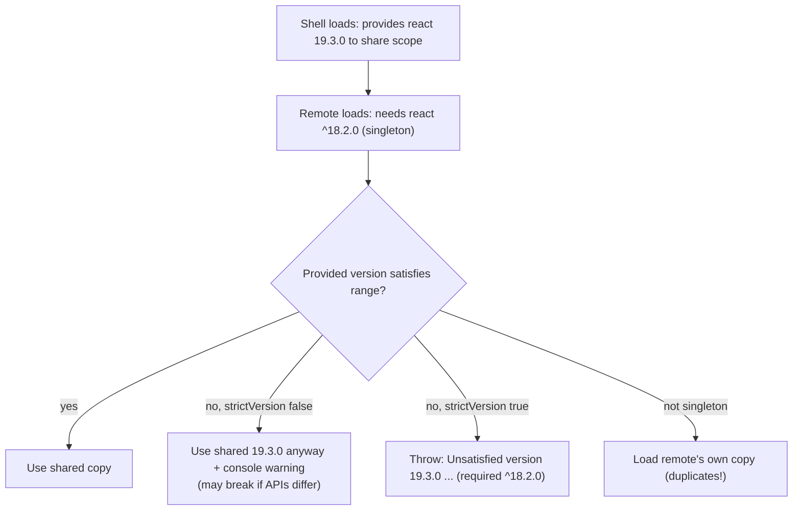
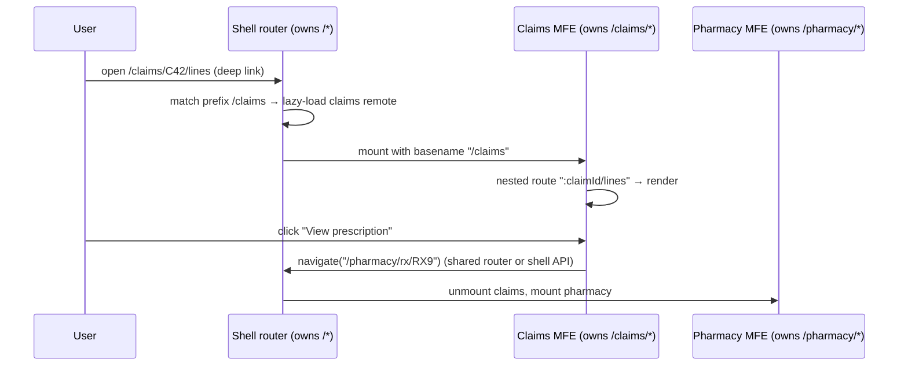
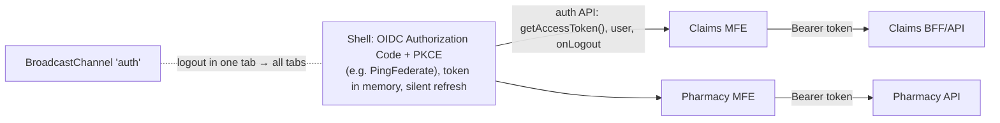

# Shared Dependencies, Routing & Communication Between Micro-Frontends

!!! abstract "TL;DR"
    - **Share** the things that must be single instances or are big and common: the framework (React/ReactDOM), router, design system/UI library, and possibly state or query libraries. Don't share app-specific code. Measured with Module Federation: a remote requiring `^18.2.0` while the shell provided React 19 still **ran on the single 19.3 copy** when `strictVersion` was off (a console warning), and **failed** with **"Unsatisfied version 19.3.0 … (required ^18.2.0)"** when `strictVersion: true`. Without sharing at all, two React copies broke hooks ([previous page](01-micro-frontends-approaches-and-trade-offs.md)).
    - **Routing:** the **shell owns top-level routes** (`/claims/*`, `/pharmacy/*`) and mounts the owning MFE. Each MFE owns its **nested** routes under its prefix with a shared router instance or a basename. The URL is the shared state for deep links, refresh and back/forward.
    - **Communication**, in order of preference: **URL** (navigational state) → **props/attributes** from the shell (context such as `memberId`) → **custom DOM events / typed event bus** for fire-and-forget notifications (demo: `claims:selected` reached the shell) → **backend** as the source of truth for shared business data. Avoid a global shared store that every MFE mutates.
    - **Auth and session** live in the shell (OIDC/OAuth2 with PKCE, token in memory, refresh), exposed to MFEs through a small, versioned API (`getAccessToken()`), never copied into each MFE's own login flow.
    - Treat all of these as **contracts**: documented, versioned, type-checked (shared TypeScript types for events and exposed props) and tested in CI.

## Why it matters

The composition mechanism is the easy part of micro-frontends. Most production problems come from integration: duplicate or mismatched libraries, MFEs fighting over the URL, state that drifts between apps, broken deep links, and each team re-implementing login. Interviewers who hear "I built a micro-frontend architecture" will ask exactly how dependencies were shared, how routing worked and how MFEs talked to each other. This page is ★ for the OptumRx React micro-frontend work.

Version negotiation results come from the same webpack 5.111 / React 19 / Chromium setup as the previous page, with the remote's shared configuration changed between runs.

## Core concepts

### What to share

| Share | Why | How |
|---|---|---|
| **React + ReactDOM** | Hooks require one instance | `singleton: true`, `requiredVersion` range |
| **Router** (react-router) | One history/navigation context | Singleton, or shell passes `navigate`/basename |
| **Design system / UI library** (MUI, internal components) | Consistent look, one theme/emotion cache, smaller payload | Singleton, semver range, tokens as CSS variables |
| **Data libraries with caches** (React Query, Apollo) | Optional: share only if you want one cache | Usually each MFE owns its own client |
| **Utilities** (date-fns, lodash) | Payload only | Share if many MFEs use them, otherwise let bundling handle it |
| **App code, domain models** | — | **Don't share**: publish APIs or events instead |

### How version negotiation works


*Notice the three outcomes: silently adapting, failing fast, or duplicating. For React, duplicating is the worst (hooks break), so singletons with aligned ranges and a governance check are the safest policy.*

Measured:

| Remote config (shell provides React 19.3) | Outcome |
|---|---|
| `singleton: true, requiredVersion: "^19.0.0"` | 1 copy, works |
| `singleton: true, requiredVersion: "^18.2.0"` (loose) | 1 copy (19.3), **works with a warning** |
| `singleton: true, requiredVersion: "^18.2.0", strictVersion: true` | **Error:** "Unsatisfied version 19.3.0 from mf of shared singleton module react (required ^18.2.0)", widget not rendered |
| No sharing | 2 copies, hooks crash |

Other settings: `eager: true` puts a shared module in the initial chunk (avoids the async bootstrap but increases initial size). `import: false` means "never bundle a fallback, always expect the host to provide it". `shareScope` separates scopes for different sets of apps.

### Routing


*Notice that only the shell decides which MFE owns a URL prefix, and MFEs navigate across boundaries through the shell. That keeps the back button, refresh and deep links working.*

Rules:

- **Prefix ownership:** each MFE gets a route prefix, and the shell maps prefixes to remotes (from a manifest).
- **One history:** use a single shared router instance, or give each MFE `basename` and a `navigate` function from the shell. Never let two routers listen to `popstate` independently.
- **Cross-MFE links** use absolute paths via the shell's navigation API, not hard-coded knowledge of another MFE's internals.
- **404s and redirects** for unknown prefixes belong to the shell.
- With **single-spa**, `activeWhen` functions decide which applications are mounted for a URL.

### Communication patterns

| Pattern | Use for | Pros | Cons |
|---|---|---|---|
| **URL / query params** | Navigational state (selected claim, filters) | Shareable, survives refresh, no coupling | Only serialisable, limited size |
| **Props / attributes from the shell** | Context: user, member, locale, feature flags | Explicit contract, typed | Only shell → MFE |
| **Custom DOM events** (`window.dispatchEvent(new CustomEvent("claims:selected", {detail}))`) | Notifications between siblings | Native, framework-agnostic, decoupled | Fire-and-forget, no late subscribers, needs naming discipline |
| **Typed event bus** (small shared module or `mitt` wrapper) | Same, with types and validation | Type safety, replay option | Shared module to version |
| **BroadcastChannel / storage events** | Cross-tab sync (logout everywhere) | Works across tabs | Same-origin only |
| **Backend as source of truth** (APIs, GraphQL, WebSocket) | Shared business data (cart, claims status) | Consistent, durable | Latency, needs cache invalidation |
| **Shared global store** (one Redux store for all MFEs) | Rarely justified | Familiar | Couples teams, versioning pain, a distributed monolith |

Demo recap: the claims remote dispatched `CustomEvent("claims:selected", {detail: {claimId: "C42"}})` and the shell, listening on `window`, displayed "last selected: C42", with no shared code beyond the event contract.

### Authentication and shared session


*Notice that only the shell talks to the identity provider. MFEs ask the shell for a token right before each call, so refresh logic and logout live in one place.*

Alternatives: a **BFF (backend-for-frontend)** holding tokens server-side with HttpOnly session cookies (the most secure for browsers), with each MFE calling through the BFF. See [frontend security](05-frontend-security.md).

## In practice: code & configuration

### A typed event contract

```ts
// @portal/contracts (tiny shared package, versioned, types only + helpers)
export type PortalEvents = {
  "claims:selected": { claimId: string; memberId: string };
  "member:changed": { memberId: string };
  "auth:logout": Record<string, never>;
};

export function emit<K extends keyof PortalEvents>(type: K, detail: PortalEvents[K]) {
  window.dispatchEvent(new CustomEvent(type, { detail }));
}

export function on<K extends keyof PortalEvents>(type: K, handler: (d: PortalEvents[K]) => void) {
  const listener = (e: Event) => handler((e as CustomEvent<PortalEvents[K]>).detail);
  window.addEventListener(type, listener);
  return () => window.removeEventListener(type, listener);   // always unsubscribe on unmount
}
```

```tsx
// Claims MFE (emitter)
<ClaimRow onClick={() => emit("claims:selected", { claimId: c.id, memberId })} />

// Shell (listener)
useEffect(() => on("claims:selected", ({ claimId }) => setContext(ctx => ({ ...ctx, claimId }))), []);
```

### Shell routing with lazy remotes

```tsx
const routes = manifest.remotes.map(r => ({
  path: `${r.prefix}/*`,                                      // "/claims/*" owned by the claims team
  element: (
    <ErrorBoundary fallback={<MfeUnavailable name={r.name} />}>
      <Suspense fallback={<PageSpinner />}>
        <RemoteApp scope={r.scope} module="./App" basename={r.prefix} auth={authApi} />
      </Suspense>
    </ErrorBoundary>
  ),
}));
const router = createBrowserRouter([{ element: <ShellLayout />, children: [...routes, { path: "*", element: <NotFound /> }] }]);
```

```tsx
// Inside the claims MFE: nested routes under the basename it receives
export default function ClaimsApp({ basename }: { basename: string }) {
  return (
    <Routes>                                   {/* uses the shell's shared router context */}
      <Route index element={<ClaimsList />} />
      <Route path=":claimId/*" element={<ClaimDetail />} />
    </Routes>
  );
}
```

=== "❌ Common mistake"

    ```text
    Each MFE creates its own BrowserRouter (two routers fighting over history),
    each MFE implements its own OAuth login and stores tokens in localStorage,
    MFEs read and write one global Redux store with no ownership,
    and shared dependencies are declared with "*" version ranges.
    ```

=== "✅ Better"

    ```text
    Shell owns the router and auth; MFEs get basename, navigate and getAccessToken via props;
    URL for navigational state, typed events for notifications, APIs for business data;
    shared singletons with aligned semver ranges, checked in CI (fail the build on drift);
    contracts package with types; contract tests for exposed modules and events.
    ```

## Real-world usage

- **Large enterprise portals** (banking, insurance, healthcare) typically use a shell with Module Federation, a shared MUI- or tokens-based design system, events for cross-MFE notifications and BFFs per domain.
- **single-spa** setups rely on `activeWhen` routing and a "utility module" (shared auth/events) loaded via import maps.
- **Spotify and others** used iframes with postMessage contracts historically, later moving to tighter integration.
- **Server-composed sites** (Zalando, IKEA) pass context through HTML attributes and use custom events in the browser.
- **Nx/Turborepo monorepos** host contracts packages and run dependency-alignment checks across MFEs ([frontend CI/CD](06-frontend-ci-cd-and-monorepos.md)).

## Trade-offs & production gotchas

!!! warning "Integration pitfalls"
    - **Unaligned shared versions:** silent mismatches (loose) or runtime failures (strict) (both measured). Pick one policy and enforce it in CI.
    - **Multiple routers or popstate listeners:** broken back button and duplicate renders.
    - **Events without contracts:** typos and payload changes break silently. Use typed contracts and versioning (`claims:selected.v2` for breaking changes).
    - **Lost events:** custom events aren't replayed. An MFE that mounts later misses earlier notifications, so put durable state in the URL or backend.
    - **Memory leaks:** listeners not removed on unmount.
    - **Token sprawl:** each MFE handling OAuth and storing tokens in localStorage (XSS-exposed) ([frontend security](05-frontend-security.md)).
    - **Shared store coupling:** one team's reducer change breaks another's UI.

- **Loose vs strict singletons:** loose keeps the page working through minor drift but can hide incompatibilities. Strict fails fast, which is safer with good CI but riskier in production without it.
- **Sharing more vs less:** more sharing means smaller payload and tighter coupling (coordinated upgrades). Less sharing gives more independence and more bytes.

## How this connects to my experience

- **Resume bullet (OptumRx):** "Built the ReactJS application from the ground up and established a micro-frontend architecture." Frontend skills: ReactJS, Redux, React Query, Material UI, Storybook. Security: "secure enterprise APIs using OAuth2, PingFederate, and Active Directory integration." Backend: "Owned the GraphQL Consumer Service end-to-end, acting as the integration layer between 5 upstream systems and multiple downstream consumers."
- **How to talk about it:** the shell owned authentication (PingFederate OAuth2), layout and top-level routing, MFEs were mounted per route prefix, React, the router and the Material UI-based design system were shared, and business data came from the GraphQL layer rather than a shared client store. *[confirm: composition tool, how shared versions were governed, event bus vs URL vs shared state, where tokens were held (BFF vs in-memory), React Query per MFE or shared]*
- **Talking points:**
    - "Share the framework, router and design system as singletons with aligned ranges, enforced in CI. Don't share app code."
    - "The shell owns routing and auth. MFEs get a basename, navigate and getAccessToken through a small versioned contract."
    - "URL for navigation state, typed events for notifications, backend for shared business data, never a global store everyone mutates."
- **Likely follow-up chain:** "How did MFEs share React and MUI?" → "What happens on version mismatch?" → "How does routing work across MFEs?" → "How do they communicate?" → "How did auth work?" → "How did you prevent regressions in contracts?"

## Interview questions

### Fundamentals

??? question "Q1. Which dependencies should micro-frontends share, and which shouldn't they?"
    **Answer:** Share libraries that must be single instances (React/ReactDOM, the router, CSS-in-JS engines and themes, i18n instances) and large common libraries such as the design system, to reduce payload and keep UI consistent. Don't share application code or domain models. Expose behaviour through events, props and APIs instead. Optional: data-fetching clients (sharing them couples caches). Without sharing React, two copies broke hooks (measured on the previous page).

    **Interviewer listens for:** singleton-required vs payload-motivated vs never-share.

    **Common wrong answer:** "Share everything to minimise bundle size."

??? question "Q2. How should routing work in a micro-frontend architecture?"
    **Answer:** The shell owns top-level routing: it maps URL prefixes (`/claims/*`) to MFEs and lazy-loads the owner. Each MFE owns nested routes under its prefix, using the shell's router (shared singleton) or a basename plus a navigate function. Cross-MFE navigation goes through the shell's API. The URL is the source of truth for navigational state, so deep links, refresh and back/forward work. Only one router listens to browser history.

    **Interviewer listens for:** prefix ownership, one history, nested routes, cross-MFE navigation.

    **Common wrong answer:** "Each MFE has its own BrowserRouter."

??? question "Q3. What are the options for communication between micro-frontends?"
    **Answer:** The URL for navigational state, props or attributes from the shell for context, custom DOM events or a typed event bus for notifications (demo: `claims:selected` reached the shell), BroadcastChannel for cross-tab messages, and the backend for shared business data. Avoid a single shared global store that all MFEs mutate, because it couples teams like a monolith.

    **Interviewer listens for:** a ranked set of patterns and the shared-store warning.

    **Common wrong answer:** "Put everything in one Redux store."

??? question "Q4. Where should authentication live?"
    **Answer:** In the shell (or a BFF): it performs the OIDC Authorization Code flow with PKCE against the IdP (e.g. PingFederate), keeps tokens in memory (or server-side with HttpOnly session cookies via a BFF), refreshes them, and exposes a small API to MFEs (`getAccessToken()`, current user, logout events). MFEs never run their own login flows. Logout broadcasts to all MFEs and tabs.

    **Interviewer listens for:** a single auth owner, secure token handling, a small contract.

    **Common wrong answer:** "Each MFE logs in separately and stores tokens in localStorage."

### Intermediate

??? question "Q5. Explain singleton, requiredVersion and strictVersion in Module Federation."
    **Answer:** `singleton: true` means only one version of the module may be loaded in the share scope. `requiredVersion` is the semver range a consumer accepts. If the provided version doesn't satisfy it, a singleton still uses the loaded version and logs a warning (measured: a `^18.2.0` remote ran on React 19.3), unless `strictVersion: true`, which throws instead (measured: "Unsatisfied version 19.3.0 … (required ^18.2.0)"). Non-singletons can load a second, matching version. `eager` bundles the module into the initial chunk.

    **Interviewer listens for:** accurate semantics of each, with the warning vs error behaviour.

    **Common wrong answer:** "requiredVersion makes webpack download the right version automatically."

??? question "Q6. Why are custom DOM events a popular communication mechanism, and what are their limits?"
    **Answer:** They're native, framework-agnostic and loosely coupled: the emitter doesn't know the listeners, nothing beyond an event name and payload is shared, and they work across React, Angular and Web Components. Limits: fire-and-forget (no response), no replay (MFEs mounting later miss earlier events), no built-in typing or validation (use a typed contracts package), global namespace collisions (use prefixes), and listeners must be removed on unmount to avoid leaks.

    **Interviewer listens for:** decoupling benefits and specific limitations with mitigations.

    **Common wrong answer:** "Events are unreliable, so never use them."

??? question "Q7. How do you keep shared dependency versions aligned across many teams?"
    **Answer:** A policy (framework and design-system majors aligned, upgraded together on a schedule), shared version ranges defined in one place (a monorepo root, a platform config or a federation preset), CI checks that fail when a remote's shared ranges drift from the shell's, automated dependency updates (Renovate) with coordinated rollout, runtime monitoring of federation warnings, and canary deploys of upgraded remotes. Strict mode can be enabled once CI enforcement exists.

    **Interviewer listens for:** governance plus automation plus runtime monitoring.

    **Common wrong answer:** "Each team upgrades whenever it wants."

??? question "Q8. How should MFEs share business data such as the selected member or cart?"
    **Answer:** Navigational context in the URL (`/members/M42/claims`), passed down as props by the shell. Durable shared business data from the backend (APIs, GraphQL), with each MFE caching what it needs (React Query) and invalidating on events ("cart:updated" → refetch). Avoid duplicating authoritative state in a client-side global store shared by all MFEs. If something truly global is needed client-side (user profile, feature flags), the shell owns it and exposes read-only access plus change events.

    **Interviewer listens for:** URL + backend as source of truth, events for invalidation, shell ownership.

    **Common wrong answer:** "A shared localStorage key everyone writes to."

??? question "Q9. How do you test the contracts between a shell and its micro-frontends?"
    **Answer:** Shared TypeScript types for exposed props and events (compile-time checks), consumer-driven contract tests where the shell's expectations of a remote's exposed module are verified in the remote's pipeline, integration tests that load real remote builds in the shell (Playwright against deployed preview URLs), shared-dependency alignment checks, and smoke tests after each remote deploy with automatic rollback via the manifest.

    **Interviewer listens for:** compile-time types, contract tests, integration and smoke tests.

    **Common wrong answer:** "Unit tests in each MFE are enough."

### Senior

??? question "Q10. Design the integration contract for a shell hosting six domain MFEs owned by different teams."
    **Answer:** A manifest service listing each remote (name, prefix, version URL, required shell API version). A shell API package (typed) providing auth (`getAccessToken`, user, logout), navigation (`navigate`, basename), context (member, locale, feature flags) and telemetry (logger tagged with MFE name/version). A typed event catalogue with versioned names. Shared singletons (React, router, design system) with aligned ranges. Rules: no shared mutable stores, URL for navigation state, BFFs per domain. Governance: CI alignment checks, contract tests, performance budgets and an architecture decision record per contract change.

    **Interviewer listens for:** manifest, shell API, events, shared deps, rules and governance.

    **Common wrong answer:** "Each team integrates however they like."

??? question "Q11. How would you implement logout across all MFEs and tabs?"
    **Answer:** The shell owns logout: it revokes or clears tokens (or ends the BFF session), emits an `auth:logout` event so mounted MFEs clear their caches and in-memory state (React Query `clear()`), posts on a `BroadcastChannel("auth")` so other tabs do the same, and redirects to the IdP's end-session endpoint (OIDC RP-initiated logout). It also handles back-channel or front-channel logout notifications from the IdP. MFEs never keep their own token copies, so there's nothing left behind.

    **Interviewer listens for:** a central owner, events, cross-tab sync, IdP session end.

    **Common wrong answer:** "Clear localStorage and reload."

??? question "Q12. A shared design system needs a breaking major upgrade. How do you roll it out across MFEs?"
    **Answer:** Avoid forcing a big-bang upgrade at runtime. Options: support both majors temporarily under different share keys (`@portal/ui@5` and `@portal/ui@6`, non-singleton if styles are scoped and the library allows it), migrate MFEs team by team with codemods, visual regression tests (Storybook + Chromatic) and design tokens kept compatible, then remove the old major. If the library must be a singleton (shared theme or context), coordinate a release train: all MFEs upgrade in a window, behind feature flags, with canaries.

    **Interviewer listens for:** dual-version strategy or coordinated train, tooling, deprecation plan.

    **Common wrong answer:** "Upgrade the shell and let MFEs break until they catch up."

### Scenario-based

??? question "Q13. After a remote deploy, users report that the browser back button skips pages or shows the wrong MFE. Diagnose."
    **Answer:** Likely two routers are listening to history: the remote started bundling its own router instance (not shared as a singleton, or a version mismatch causing a second copy) or created its own `BrowserRouter`, so both push and handle popstate differently. Or the remote navigates with `window.location` or `history.pushState` directly, bypassing the shell's router. Check shared config, React DevTools for multiple router contexts, and the remote's navigation calls. Fix: share the router as a singleton, use the shell's navigate API or basename, and add an integration test for back/forward across MFEs.

    **Interviewer listens for:** router duplication and bypassing as causes, verification and fix.

    **Common wrong answer:** "Browser caching issue."

??? question "Q14. Two MFEs show different values for the same member's address after an edit. What's wrong, and how do you fix it?"
    **Answer:** Each MFE caches member data independently (separate React Query or Redux caches), and only the editing MFE refreshed after the mutation. Fix: treat the backend as the source of truth, emit a `member:updated` event after a successful edit, and have other MFEs invalidate the relevant queries; or move the address display into the owning MFE's exposed component, so there's only one implementation; or use server push (WebSocket or SSE) for updates. Avoid "fixing" it by sharing one global store across MFEs.

    **Interviewer listens for:** cache duplication, event-driven invalidation, single ownership.

    **Common wrong answer:** "Put the address in a shared global variable."

## Cheat sheet

| Topic | Remember |
|---|---|
| Share | React, ReactDOM, router, design system (singletons); not app code |
| Version negotiation | Loose singleton: warning, uses loaded version (19.3 for ^18.2); strict: "Unsatisfied version" error; non-shared: duplicate copies |
| Bootstrap | Async `import("./bootstrap")` or `eager` |
| Routing | Shell owns prefixes; MFEs nested routes via basename/shared router; one history |
| Communication | URL → props → typed custom events → backend; avoid shared global store |
| Events | Prefixed names, typed contracts, unsubscribe, no replay |
| Auth | Shell/BFF owns OIDC + PKCE; `getAccessToken()`; logout event + BroadcastChannel |
| Governance | Manifest, contracts package, CI alignment checks, contract tests |

## Sources
1. [webpack Module Federation: shared configuration (singleton, requiredVersion, strictVersion, eager)](https://webpack.js.org/plugins/module-federation-plugin/#sharing-hints).
2. [Module Federation documentation: shared dependencies and runtime](https://module-federation.io/configure/shared.html).
3. Cam Jackson, [Micro Frontends: cross-application communication](https://martinfowler.com/articles/micro-frontends.html#Cross-applicationCommunication).
4. [single-spa: Applications, activeWhen and utility modules](https://single-spa.js.org/docs/module-types).
5. [React Router: createBrowserRouter and basename](https://reactrouter.com/start/data/routing).
6. [MDN: CustomEvent](https://developer.mozilla.org/en-US/docs/Web/API/CustomEvent) and [BroadcastChannel](https://developer.mozilla.org/en-US/docs/Web/API/BroadcastChannel).
7. [OAuth 2.0 for Browser-Based Apps (IETF draft, BFF pattern)](https://datatracker.ietf.org/doc/draft-ietf-oauth-browser-based-apps/).
8. Demonstrations on this page: webpack 5.111 Module Federation with React 19 in headless Chromium, run while writing this page (loose vs strict singleton version mismatch, custom event communication).
