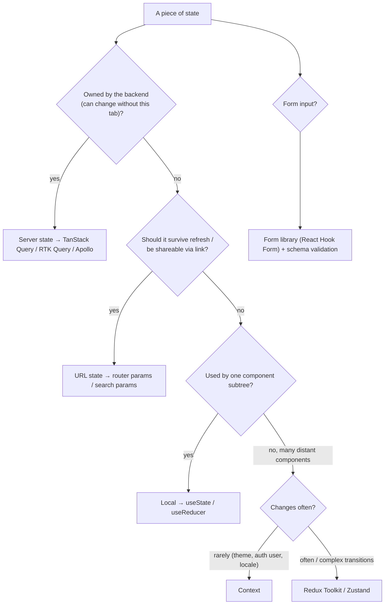
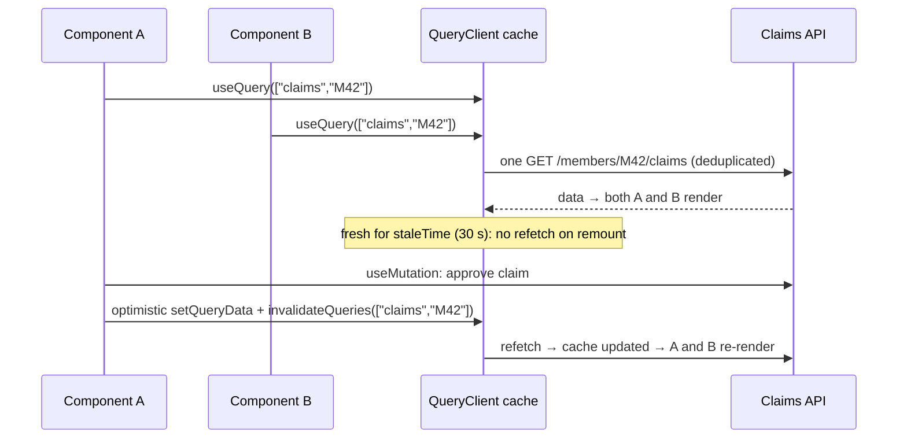
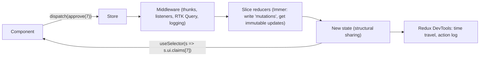

# State Management: Redux Toolkit, React Query (TanStack Query) & When to Use What

!!! abstract "Key takeaways"
    - First classify the state: **server state** (data owned by the backend: claims, members), **client/UI state** (modals, selections, wizard steps), **URL state** (filters, page, selected id), and **form state**. Most "state management" pain comes from treating server state as client state.
    - **TanStack Query (React Query)** manages server state: caching by **query key**, **request deduplication** (5 concurrent requests for the same key → **1** network call, measured), **staleness** (`staleTime`: refetch skipped within it), **invalidation** after mutations, **optimistic updates with rollback**, and **retries** (3 attempts with `retry: 2`, measured).
    - **Redux Toolkit** manages complex shared client state with predictable updates: `createSlice` + **Immer** (new state object, untouched branches shared, frozen in dev, measured), selectors, DevTools and middleware. **RTK Query** is its server-state counterpart if you're already all-in on Redux.
    - **Re-renders:** a Context value holding several fields re-rendered **50/50** consumers when an unrelated field changed. `useSelector` (Redux) and Zustand selectors re-rendered **0/50**, and changing one claim re-rendered **1/50**. A selector returning a **new object** each time re-rendered on unrelated updates (with a dev warning).
    - Rule of thumb: **local state first, URL for shareable state, TanStack Query for server data, Context for rarely changing dependencies (theme, auth), Redux Toolkit/Zustand for genuinely global, frequently updated client state.**

## Why it matters

State management is one of the most-discussed frontend topics, and it's on my resume (Redux, React Query at OptumRx). Senior interviewers want to hear a principled split (server vs client state), why React Query replaced much of what teams used Redux for, how Redux Toolkit modernised Redux, how to avoid unnecessary re-renders, and how state works across micro-frontends. Wrong choices show up as duplicated caches, stale data, spaghetti actions and slow UIs.

Measurements come from `@tanstack/query-core` 5, Redux Toolkit 2 / react-redux 9, Zustand 5 and React 19 under jsdom (Node 22), run while writing this page.

## Core concepts

### Kinds of state


*Notice that only a small residue ends up in a global client store. Most data is server state (a cache, not a store) or belongs in the URL or a component.*

### Server state with TanStack Query

Server state is asynchronous, shared, can be stale, and is owned elsewhere, so it needs caching, deduplication, background refresh and invalidation, which TanStack Query provides.


*Notice that components don't own the data. They subscribe to a cache entry by key, and the cache decides when to fetch, which removes most hand-written loading/error/refetch code.*

Measured with `query-core`:

| Scenario | Network calls |
|---|---|
| 5 concurrent `fetchQuery(["claims","M42"])` | **1** (deduplicated) |
| Again within `staleTime: 30s` | still **1** (served from cache) |
| Different key `["claims","M43"]` | 2 |
| `invalidateQueries(["claims","M42"])` then fetch | 3 |
| Optimistic `setQueryData` → APPROVED, then rollback to the snapshot | APPROVED → PENDING |
| `retry: 2` on a failing query | **3 attempts**, then error `503` |

Key concepts: **query keys** (arrays that identify data and its parameters: `["claims", memberId, {status}]`), **staleTime** (how long data is fresh: default 0, so refetch on mount/focus), **gcTime** (how long unused cache entries are kept: default 5 min), **refetchOnWindowFocus**, **mutations** with `onMutate`/`onError`/`onSettled`, **prefetching**, **infinite queries**, and **Suspense** support.

### Client state with Redux Toolkit


*Notice the single direction: actions describe what happened, reducers compute the next state purely, and components subscribe to slices through selectors. That predictability is Redux's real value.*

Redux Toolkit (the official way to write Redux) adds `configureStore` (DevTools, thunk, serializability and immutability checks), `createSlice` (actions + reducer with Immer), `createAsyncThunk`, `createEntityAdapter`, `createListenerMiddleware` and **RTK Query**.

Measured Immer behaviour: after `approve(3)`, the root state was a **new object**, the `claims` array was **replaced**, the untouched `filter` was **shared** with the previous state, and the new state was **frozen** in development, which is why `===` comparisons in selectors work.

### Re-render behaviour, measured

50 rows each reading one claim, plus a `filter` field in the same state:

| Mechanism | Change `filter` | Change one claim |
|---|---|---|
| Context value `{filter, claims}` | **50/50** rows re-render | 50/50 |
| Redux `useSelector(s => s.ui.claims[i])` | **0/50** | **1/50** |
| Zustand `useStore(s => s.claims[i])` | **0/50** | 1/50 (by design) |
| Redux selector returning a new object `s => ({ f: s.ui.filter })` | re-rendered on an unrelated update + dev warning | — |

Context re-renders every consumer when its value changes. It's a dependency-injection mechanism, not a selective subscription store. Fixes: split contexts, memoise values, or use a store with selectors. In Redux, return primitives or memoised selectors (`createSelector`), or use `shallowEqual`.

### Comparison

| Tool | Best for | Strengths | Watch out for |
|---|---|---|---|
| `useState`/`useReducer` | Local UI state | Simple, colocated | Prop drilling when shared widely |
| Context | Rarely changing globals (theme, auth, locale) | Built-in | Re-renders all consumers |
| **TanStack Query** | Server state | Caching, dedup, invalidation, retries, devtools | Key design, staleTime tuning |
| **Redux Toolkit** | Complex, cross-cutting client state; large teams | Predictability, DevTools, middleware, conventions | Boilerplate (reduced), overuse for server data |
| RTK Query | Server state in Redux apps | Integrated with store and DevTools | Less flexible than TanStack for some cases |
| Zustand / Jotai | Lightweight global client state | Minimal API, selectors | Fewer conventions for big teams |
| Apollo / urql | GraphQL server state | Normalised cache | Cache normalisation complexity |
| URL (router) | Filters, pagination, selection | Shareable, survives refresh | Serialisation only |

## In practice: code & configuration

### TanStack Query for server data

```tsx
const claimsKeys = {
  all: ["claims"] as const,
  byMember: (memberId: string, status?: string) => [...claimsKeys.all, memberId, { status }] as const,
};

export function useMemberClaims(memberId: string, status?: string) {
  return useQuery({
    queryKey: claimsKeys.byMember(memberId, status),
    queryFn: ({ signal }) => api.get(`/members/${memberId}/claims`, { params: { status }, signal }),  // abort on unmount
    staleTime: 30_000,                       // fresh for 30 s: no refetch on remount
    enabled: !!memberId,
  });
}

export function useApproveClaim(memberId: string) {
  const qc = useQueryClient();
  return useMutation({
    mutationFn: (claimId: string) => api.post(`/claims/${claimId}/approve`),
    onMutate: async claimId => {                                      // optimistic update
      await qc.cancelQueries({ queryKey: claimsKeys.byMember(memberId) });
      const previous = qc.getQueryData(claimsKeys.byMember(memberId));
      qc.setQueryData(claimsKeys.byMember(memberId), (old: Claim[] = []) =>
        old.map(c => (c.id === claimId ? { ...c, status: "APPROVED" } : c)));
      return { previous };
    },
    onError: (_e, _id, ctx) => qc.setQueryData(claimsKeys.byMember(memberId), ctx?.previous),   // rollback
    onSettled: () => qc.invalidateQueries({ queryKey: claimsKeys.byMember(memberId) }),         // resync
  });
}
```

### Redux Toolkit for client state

```ts
const claimsUi = createSlice({
  name: "claimsUi",
  initialState: { selectedIds: [] as string[], panel: "list" as "list" | "detail" },
  reducers: {
    toggleSelected(state, action: PayloadAction<string>) {          // Immer: "mutate" safely
      const i = state.selectedIds.indexOf(action.payload);
      i >= 0 ? state.selectedIds.splice(i, 1) : state.selectedIds.push(action.payload);
    },
    openDetail(state) { state.panel = "detail"; },
  },
});

export const store = configureStore({ reducer: { claimsUi: claimsUi.reducer } });
export type RootState = ReturnType<typeof store.getState>;

export const selectSelectedCount = (s: RootState) => s.claimsUi.selectedIds.length;   // primitive: stable
export const selectSelectedSet = createSelector(                                     // memoised derived data
  [(s: RootState) => s.claimsUi.selectedIds], ids => new Set(ids));
```

=== "❌ Common mistake"

    ```tsx
    // Server data copied into Redux by hand: stale, duplicated, re-implemented loading/error/retry/caching
    useEffect(() => { dispatch(setLoading(true)); api.getClaims(id).then(d => dispatch(setClaims(d))); }, [id]);

    // One giant context for everything → every consumer re-renders on every change (50/50 measured)
    <AppContext.Provider value={{ user, theme, filter, claims, setFilter }}>

    // Selector creating a new object each time → re-render on unrelated updates
    const view = useSelector(s => ({ filter: s.ui.filter, count: s.ui.items.length }));
    ```

=== "✅ Better"

    ```tsx
    const { data: claims, isPending, error } = useMemberClaims(memberId, status);   // server state
    const [searchParams, setSearchParams] = useSearchParams();                       // shareable filter
    const selectedCount = useSelector(selectSelectedCount);                           // client state, primitive
    // Context only for stable dependencies (theme, auth API), split per concern
    ```

## Real-world usage

- **Most modern React apps** use TanStack Query (or RTK Query/Apollo) for data and keep a small client store or none at all. Redux remains common in large enterprise codebases for complex workflows and its DevTools.
- **Healthcare and finance portals** use optimistic updates sparingly (approvals and payments usually wait for server confirmation), relying on invalidation and clear pending states instead.
- **GraphQL frontends** use Apollo Client's normalised cache, or TanStack Query with per-query caching.
- **Micro-frontends:** each MFE usually owns its own QueryClient and store, sharing data via backend and events ([communication](02-shared-dependencies-routing-and-communication-between-micro.md)).
- **Forms:** React Hook Form or Formik with Zod/Yup validation, separate from global stores.

## Trade-offs & production gotchas

!!! warning "State management pitfalls"
    - **Server data in Redux by hand:** stale data, duplicated caches, lots of boilerplate. Use a server-state library.
    - **One big Context:** every consumer re-renders (measured 50/50). Split contexts or use selectors.
    - **Selectors returning new objects/arrays:** extra renders. Return primitives or use `createSelector`/`shallowEqual`.
    - **Bad query keys:** missing parameters in keys show the wrong cached data (e.g. a filter not in the key).
    - **staleTime 0 everywhere:** refetch storms on focus and mount. Tune per data type.
    - **Optimistic updates without rollback** or for operations that often fail or need server validation.
    - **Non-serialisable values in Redux** (Dates, class instances, functions) break DevTools and persistence.
    - **Derived state stored instead of computed:** state that can drift. Compute with selectors or `useMemo`.

- **Redux vs lightweight stores:** Redux brings conventions, middleware and DevTools for big teams at some ceremony. Zustand is minimal and great for small/medium apps.
- **Normalised vs per-query caches:** normalised caches (Apollo, entity adapters) avoid duplication but add complexity. Per-query caches (TanStack) are simpler with invalidation.

## How this connects to my experience

- **Resume bullets (OptumRx):** "Built the ReactJS application from the ground up and established a micro-frontend architecture." Frontend skills: "ReactJS, **Redux, React Query**, Material UI, Storybook." Backend context: "Owned the GraphQL Consumer Service end-to-end … integration layer between 5 upstream systems."
- **How to talk about it:** server data from the GraphQL/REST layer handled by React Query (query keys per member and filter, invalidation after mutations), Redux for cross-cutting UI and workflow state, URL params for filters and selections, and per-MFE ownership of stores and caches. *[confirm: which data lived in Redux vs React Query, whether RTK was used, staleTime choices, optimistic updates, how MFEs shared or didn't share state]*
- **Talking points:**
    - "I separate server state from client state. React Query owns server data with caching, dedup and invalidation, and Redux is for the small set of genuinely global UI state."
    - "Context is for stable dependencies. For frequently changing state I use selectors, because Context re-renders every consumer."
    - "Each micro-frontend owns its own cache and store. Shared data flows through the backend and events."
- **Likely follow-up chain:** "Redux or React Query?" → "How does React Query caching work?" → "How do you handle mutations and invalidation?" → "Why Redux Toolkit over classic Redux?" → "How do you avoid unnecessary re-renders?" → "How did state work across micro-frontends?"

## Interview questions

### Fundamentals

??? question "Q1. What's the difference between server state and client state?"
    **Answer:** Server state is data owned by the backend that the UI caches: it's asynchronous, shared with other users, can become stale, and needs fetching, caching, deduplication, refetching and invalidation (claims, profiles). Client state is owned by the UI: modal open, selected rows, wizard step, theme. They need different tools: server-state libraries (TanStack Query, RTK Query, Apollo) vs local state, Context or a client store. Mixing them (copying server data into Redux by hand) causes staleness and boilerplate.

    **Interviewer listens for:** ownership, staleness and the tool split.

    **Common wrong answer:** "All state should go in Redux."

??? question "Q2. What does React Query (TanStack Query) do?"
    **Answer:** It manages server state as a cache keyed by query keys: fetches data, deduplicates concurrent requests (5 → 1 measured), caches with configurable staleness (no refetch within `staleTime`), refetches in the background (on focus, reconnect, intervals), retries failures (3 attempts with `retry: 2` measured), garbage-collects unused data, and supports mutations with invalidation and optimistic updates. Components get `data`, `isPending`, `error` without hand-written effects.

    **Interviewer listens for:** keys, dedup, staleness, invalidation, mutations.

    **Common wrong answer:** "A replacement for axios."

??? question "Q3. What problems does Redux Toolkit solve compared with classic Redux?"
    **Answer:** Classic Redux needed lots of boilerplate (action types, creators, switch reducers, manual immutable updates, store setup). RTK provides `configureStore` (DevTools, thunk, dev-time immutability and serializability checks), `createSlice` (actions and reducer together, Immer for "mutating" syntax that produces immutable updates: measured new object, shared untouched branches, frozen state), `createAsyncThunk`, entity adapters, listener middleware and RTK Query. It's the officially recommended way to write Redux.

    **Interviewer listens for:** boilerplate reduction, Immer, built-in checks, RTK Query.

    **Common wrong answer:** "RTK is a different library from Redux."

??? question "Q4. When is React Context appropriate, and when isn't it?"
    **Answer:** Context passes values through the tree without props: ideal for stable or rarely changing dependencies (theme, locale, authenticated user, service clients). It isn't a selective subscription store: when its value changes, every consumer re-renders (measured: a filter change re-rendered 50/50 rows that only read claims). For frequently changing or large shared state, use a store with selectors (Redux, Zustand) or split contexts and memoise values.

    **Interviewer listens for:** DI use case, re-render behaviour, mitigations.

    **Common wrong answer:** "Context replaces Redux in all cases."

### Intermediate

??? question "Q5. How do you design query keys?"
    **Answer:** As hierarchical arrays that include every parameter affecting the result: `["claims", memberId, { status, page }]`. That makes caching correct (different params, different entries) and enables targeted invalidation by prefix (`invalidateQueries({queryKey: ["claims", memberId]})` refreshes all pages and filters for that member). Centralise them in key factories to avoid typos. Missing a parameter in the key shows the wrong cached data.

    **Interviewer listens for:** completeness, hierarchy, prefix invalidation, factories.

    **Common wrong answer:** "Use a string like 'claims'."

??? question "Q6. Explain staleTime vs gcTime."
    **Answer:** `staleTime` is how long fetched data counts as fresh: while fresh, mounting components or refocusing the window doesn't refetch (measured: a second fetch within 30 s made no network call). The default is 0, so data is immediately stale and refetched on triggers. `gcTime` (formerly cacheTime) is how long *inactive* cache entries (no subscribers) stay in memory before garbage collection, default 5 minutes. Tune staleTime per data volatility (reference data: hours; claim status: seconds).

    **Interviewer listens for:** freshness vs retention, defaults, tuning.

    **Common wrong answer:** "They're the same."

??? question "Q7. How do you implement an optimistic update safely?"
    **Answer:** In `onMutate`: cancel in-flight queries for the key, snapshot the current data, apply the optimistic change with `setQueryData`, and return the snapshot as context. In `onError`: restore the snapshot (measured: APPROVED rolled back to PENDING). In `onSettled`: invalidate to resync with the server. Use it for low-risk, likely-successful actions (toggles, likes), not for operations requiring server validation or with serious consequences (payments, approvals with business rules), where a pending state is clearer.

    **Interviewer listens for:** cancel, snapshot, rollback, invalidate, appropriateness.

    **Common wrong answer:** "Update the UI and ignore errors."

??? question "Q8. Why might a component re-render even though the data it uses didn't change, and how do you fix it?"
    **Answer:** Causes: it consumes a Context whose value changed (any field, 50/50 measured), a Redux selector returns a new object or array each time (re-render on every store update, with a dev warning, measured), parent re-renders with new inline props or callbacks, or a non-memoised derived value. Fixes: split or memoise Context values, select primitives or use `createSelector`/`shallowEqual`, `React.memo` plus stable callbacks where profiling shows it matters, and the React Compiler (auto-memoisation) where adopted. Measure with the React Profiler first.

    **Interviewer listens for:** specific causes and targeted fixes, measuring first.

    **Common wrong answer:** "Wrap everything in React.memo."

??? question "Q9. Redux Toolkit vs Zustand: how do you choose?"
    **Answer:** Both give a global store with selective subscriptions (measured: 0/50 re-renders for unrelated changes in both). Redux Toolkit brings strong conventions (actions, slices), middleware, excellent DevTools (time travel, action logs) and RTK Query, which suits large teams and complex workflows needing auditability. Zustand is minimal (a hook-based store, no providers or action types), great for small/medium apps or isolated features, with fewer guard rails. For server data, use TanStack Query (or RTK Query) with either.

    **Interviewer listens for:** conventions and tooling vs simplicity, team size, server-state separation.

    **Common wrong answer:** "Redux is outdated, always use Zustand."

### Senior

??? question "Q10. How would you structure state for a large healthcare portal with several teams?"
    **Answer:** Server data in TanStack Query (or RTK Query) per domain with key factories and staleTime per data type, owned by the domain team. URL for navigational state (member, claim, filters). Local state by default. A small Redux Toolkit store (or Zustand) for cross-cutting client state (notifications, workflow state spanning screens), with slices per domain and lint rules preventing cross-domain imports. Context for auth, theme and feature flags. Forms via React Hook Form + Zod. In a micro-frontend setup, each MFE owns its client and store, and shared context flows from the shell. Add devtools in non-prod and PHI-safe logging (no persisted PHI in localStorage).

    **Interviewer listens for:** a layered split, ownership, conventions and PHI awareness.

    **Common wrong answer:** "One global Redux store for all teams."

??? question "Q11. How do you keep multiple components or MFEs consistent after a mutation?"
    **Answer:** Within one app, invalidate the relevant query keys (prefix invalidation), or update the cache directly with `setQueryData` from the mutation response so every subscriber re-renders. Across tabs, use BroadcastChannel or `refetchOnWindowFocus`. Across micro-frontends with separate caches, emit a domain event (`claims:updated`) so others invalidate, or rely on server push (WebSocket/SSE). Across users, rely on polling, refetch on focus, or real-time subscriptions. Avoid copying server data into multiple client stores.

    **Interviewer listens for:** invalidation, cache updates, cross-boundary events, server push.

    **Common wrong answer:** "Reload the page."

??? question "Q12. When would you still choose Redux for server data instead of TanStack Query?"
    **Answer:** When the app is already deeply invested in Redux and wants one store, one DevTools view and middleware integration, use **RTK Query** (not hand-written thunks): it gives caching, dedup, invalidation tags and codegen from OpenAPI. Or when server data must be normalised and heavily cross-referenced with client workflows (entity adapters). Otherwise TanStack Query is usually simpler and more flexible. Hand-rolled fetch-and-store in Redux is rarely justified now.

    **Interviewer listens for:** RTK Query as the Redux answer, normalisation cases.

    **Common wrong answer:** "Redux is required for any API data."

### Scenario-based

??? question "Q13. Users see another member's claims briefly after switching members. What's the likely bug?"
    **Answer:** The query key doesn't include `memberId` (e.g. `["claims"]`), so the cache serves the previous member's data until the refetch completes. Or `placeholderData: keepPreviousData` shows old data without indicating it. Fix: include every parameter in the key (`["claims", memberId, filters]`), show loading states when the key changes (`isPlaceholderData`), and clear sensitive caches on member switch or logout (`queryClient.removeQueries`). In healthcare, that's a privacy issue, not just a UX glitch.

    **Interviewer listens for:** key completeness, placeholder behaviour, privacy implications.

    **Common wrong answer:** "Add a delay before showing data."

??? question "Q14. Typing in a search box makes the whole page sluggish. The search term is stored in a top-level Context. Fix it."
    **Answer:** Every keystroke changes the Context value, so all consumers re-render (measured: 50/50 rows re-rendered on a filter change). Fix: keep the input state local to the search component and debounce what's published (or `useDeferredValue`/`useTransition`), move the committed search term to the URL or a store with selectors so only components that read it re-render (0/50 for unrelated rows with selectors), split the Context so stable values aren't mixed with volatile ones, and memoise expensive lists or virtualise long ones. Verify with the React Profiler.

    **Interviewer listens for:** Context re-render cause, local + debounced input, selectors/URL, profiling.

    **Common wrong answer:** "Use useMemo on the provider value." (That doesn't help when the value really changes.)

## Cheat sheet

| Topic | Remember |
|---|---|
| Classify | Server / client / URL / form state |
| TanStack Query | Keys, dedup (5 → 1), staleTime (fresh = no refetch), gcTime 5 min, invalidate, optimistic + rollback, retry (3 attempts) |
| Query keys | Include every parameter; prefix invalidation; key factories |
| Redux Toolkit | configureStore, createSlice + Immer (new root, shared branches, frozen), createSelector, RTK Query |
| Context | DI for stable values; re-renders all consumers (50/50) |
| Selectors | Redux/Zustand 0/50 for unrelated changes; avoid new objects in selectors |
| Choose | Local → URL → TanStack Query → Context (stable) → RTK/Zustand (global client) |
| MFEs | Each owns its cache/store; events + backend for sharing |

## Sources
1. [TanStack Query documentation (v5)](https://tanstack.com/query/latest/docs/framework/react/overview): [important defaults](https://tanstack.com/query/latest/docs/framework/react/guides/important-defaults), [query keys](https://tanstack.com/query/latest/docs/framework/react/guides/query-keys), [optimistic updates](https://tanstack.com/query/latest/docs/framework/react/guides/optimistic-updates).
2. [Redux Toolkit documentation](https://redux-toolkit.js.org/) and [Redux style guide](https://redux.js.org/style-guide/).
3. [RTK Query overview](https://redux-toolkit.js.org/rtk-query/overview).
4. [React docs: Passing data deeply with Context](https://react.dev/learn/passing-data-deeply-with-context) and [useSyncExternalStore](https://react.dev/reference/react/useSyncExternalStore).
5. [react-redux: useSelector and equality](https://react-redux.js.org/api/hooks#useselector).
6. [Zustand documentation](https://zustand.docs.pmnd.rs/).
7. TkDodo (Dominik Dorfmeister), [Practical React Query](https://tkdodo.eu/blog/practical-react-query) series.
8. Demonstrations on this page: @tanstack/query-core 5, Redux Toolkit 2, react-redux 9, Zustand 5 and React 19 under jsdom on Node 22, run while writing this page.
