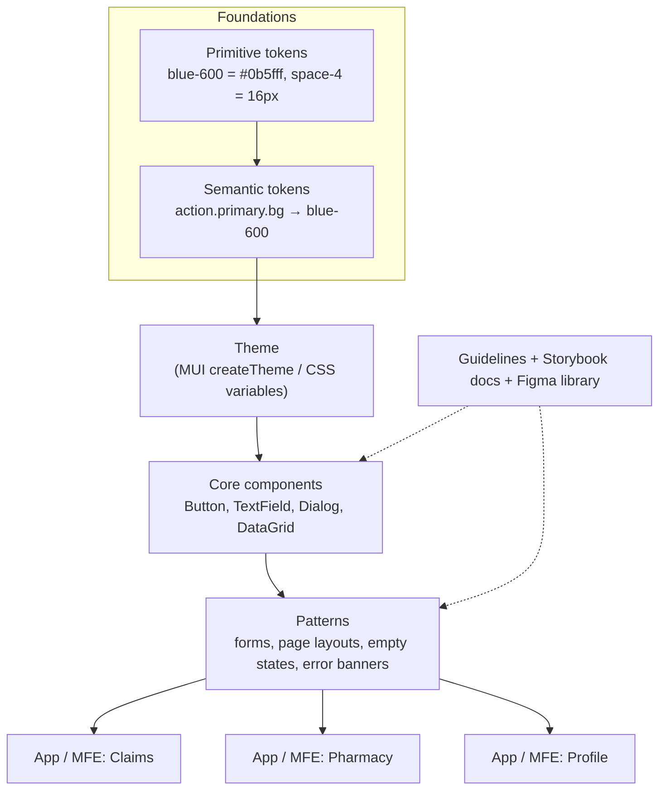
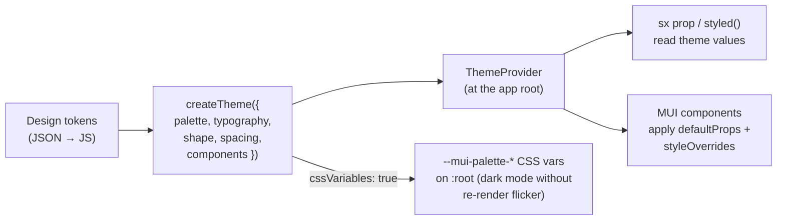
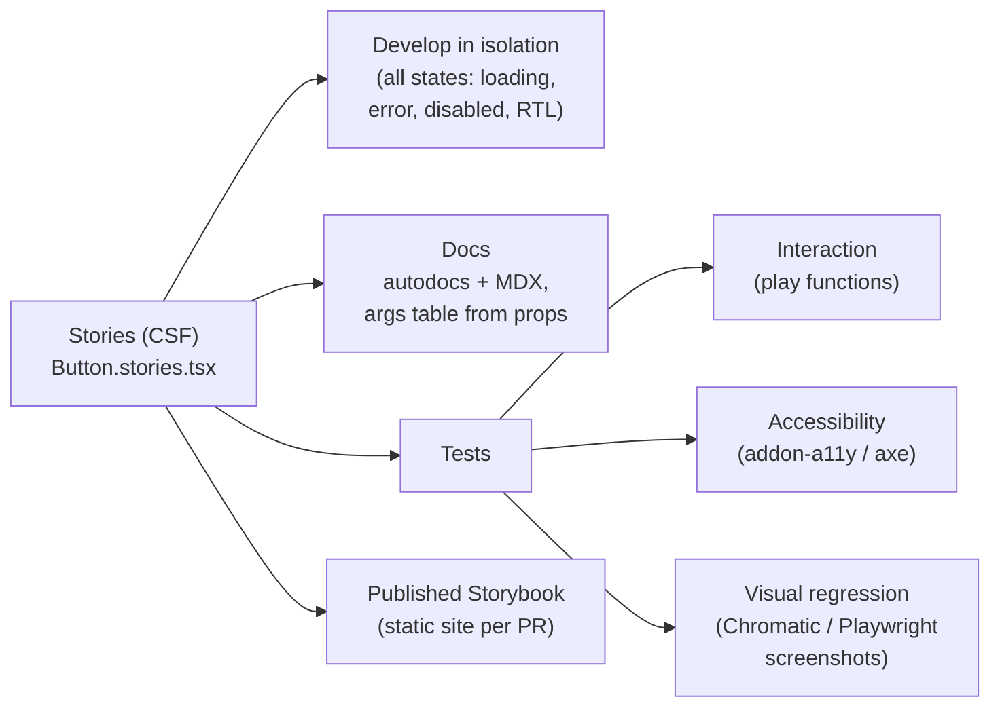
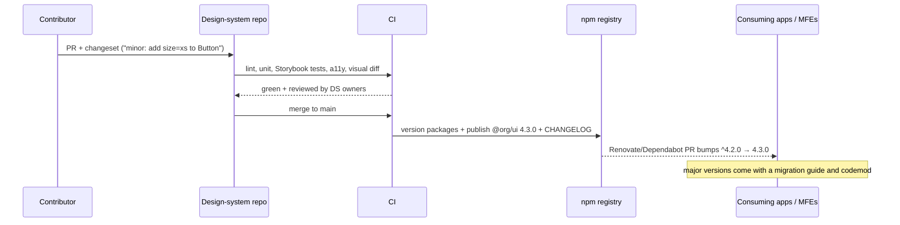

# Design Systems & Component Libraries (Storybook, MUI)

!!! abstract "Key takeaways"
    - A **design system** is more than a component library: it's **design tokens** (colour, spacing, typography as named decisions), **components** built on those tokens, **patterns and guidelines** (when to use what, content, accessibility), **tooling** (Storybook, Figma library, lint rules) and **governance** (who owns it, how changes get in, how it's versioned).
    - **Tokens** are the single source of truth. A tool such as **Style Dictionary** turns one JSON file into CSS variables, JS constants, iOS/Android values. Semantic tokens reference primitives (`action.primary.bg → brand.primary`), and with `outputReferences` the CSS keeps the alias (`var(--color-brand-primary)`), so a rebrand changes one line (measured).
    - **MUI** gives a complete styled, accessible component set. Brand it with `createTheme`: palette (MUI derives `dark` and `contrastText` from `main`, measured), typography, shape, and per-component `defaultProps` and `styleOverrides`. With `cssVariables: true` the theme emits `--mui-*` custom properties and components read them (measured). Wrap MUI in your own components only where you need to constrain the API.
    - **Storybook** is the workshop: develop components in isolation, document them (autodocs, MDX), and **test** them: interaction tests (play functions), **accessibility** (axe addon), and **visual regression** (Chromatic or Playwright screenshots).
    - **Accessibility is a library feature:** an icon button without a label and an input without one failed axe (`button-name`, `label`). Adding `aria-label` and using MUI's `TextField` with `label` passed with **no violations** (measured). Fix it once in the library and every app benefits.
    - **Ship it like a product:** semver, changelogs (Changesets), deprecation periods, codemods for breaking changes, and tree-shakeable ESM. A named import from MUI's barrel bundled to **38 KB gzip** (same as a path import). `import * as M` used whole pulled in **171 KB** (measured).

## Why it matters

Design systems come up in every senior frontend interview for multi-team products, and my resume lists **Material UI** and **Storybook** and says I built the OptumRx React app from scratch with micro-frontends. Interviewers probe: how do you keep several teams' UIs consistent, how do you theme a third-party library without forking it, how do you version a shared library without breaking consumers, how do you build in accessibility, and how does it work across micro-frontends with independent deploys.

Measurements on this page come from Style Dictionary 5, MUI 9 with Emotion, React 19 under jsdom, axe-core 4.13 and esbuild on Node 22, run while writing this page.

## Core concepts

### The layers of a design system


*Notice that apps never use raw hex values. They sit on top of patterns and components, which sit on semantic tokens, so a brand change flows from one file.*

A design system has three audiences: **designers** (Figma library that mirrors the code), **engineers** (components, tokens, docs) and **product teams** (consistent, accessible UX by default). The code part is usually a monorepo package such as `@org/design-system` (or several: `tokens`, `react`, `icons`).

### Design tokens

Tokens are named design decisions stored as data. The **W3C Design Tokens Community Group (DTCG)** format uses `$value` and `$type` keys and `{alias}` references, which Style Dictionary 4+ supports.

- **Primitive (global) tokens:** the raw palette and scale: `color.blue.600`, `space.4`, `font.size.300`.
- **Semantic (alias) tokens:** intent: `color.action.primary.bg`, `color.text.danger`, `space.inset.md`. Components use these.
- **Component tokens** (optional): `button.primary.bg`, for fine-grained overrides.

Demo (Style Dictionary 5, measured): one token file with `color.action.primary.bg = {color.brand.primary}` built to two platforms:

```css
/* build/tokens.css (generated, outputReferences: true) */
:root {
  --color-brand-primary: #0b5fff;
  --color-neutral-0: #ffffff;
  --space-4: 16px;
  --color-action-primary-bg: var(--color-brand-primary); /* alias kept */
  --color-action-primary-fg: var(--color-neutral-0);
}
```

```js
// build/tokens.js (generated)
export const ColorActionPrimaryBg = "#0b5fff"; // resolved for JS consumers
export const Space4 = "16px";
```

*The CSS keeps the reference chain, so changing `--color-brand-primary` at runtime (or per tenant or theme) updates every semantic token that points at it. JS gets resolved values.*

**Theming** (light/dark, brands, high contrast) then means swapping the primitive-to-semantic mapping, not touching components: `[data-theme="dark"] { --color-action-primary-bg: var(--color-blue-300); }`.

{ loading=lazy }
*Notice that only the primitive changes. The semantic token and the button follow through the alias, but the resolved JS constant needs a rebuild.*

### Component libraries: build, buy, or wrap

| Approach | Examples | Pros | Cons |
|---|---|---|---|
| **Styled library** | MUI, Ant Design, Chakra, Mantine | Huge set (data grid, date pickers), accessible, fast to start | Look "MUI-ish" unless themed; upgrades are big; bundle cost |
| **Headless library** | Radix UI, React Aria, Headless UI, Base UI | Behaviour + a11y done, full visual control | You build all styling; more work |
| **Copy-in components** | shadcn/ui (Radix + Tailwind) | You own the code, easy to customise | No central upgrades; drift across apps |
| **Fully custom** | Large companies' own systems | Exact brand and API | Very expensive; a11y is hard to get right |
| **Wrap a library** | `@org/ui` re-exporting themed MUI | Consistent API, swap vendor later, enforce rules | Wrapper maintenance; don't wrap everything |

Common senior answer: **start with a styled or headless library, theme it with your tokens, and wrap only where you need to constrain or compose** (e.g. `<PrimaryButton>` with no `color` prop, `<FormField>` that always pairs a label, error text and `aria-describedby`).

### MUI theming


*Notice that customisation happens centrally in the theme: component-level `defaultProps` and `styleOverrides` mean teams don't restyle Buttons in each app.*

Measured with MUI 9 under jsdom:

- `palette.primary.main = '#0b5fff'` → MUI derived `dark = rgb(7, 66, 178)` and `contrastText = #fff` (it picks the contrast text using `contrastThreshold`, default 3).
- `components.MuiButton.defaultProps = { variant: 'contained', disableElevation: true }` → a bare `<Button>` rendered with `MuiButton-contained MuiButton-disableElevation` classes.
- `styleOverrides.root = { textTransform: 'none' }` → the emitted CSS contained `text-transform: none`.
- `cssVariables: true` → `theme.vars.palette.primary.main` was `var(--mui-palette-primary-main, #0b5fff)`, the stylesheet defined `--mui-palette-primary-main: #0b5fff`, and button styles used the variable.

Other levers: `theme.typography` (font family, variants), `theme.spacing` (`theme.spacing(2)` = 16px by default), `theme.breakpoints`, `colorSchemes: { light, dark }` with `cssVariables` for flicker-free dark mode, **custom variants** (`variants: [{ props: { variant: 'dashed' }, style: {...} }]`) and TypeScript **module augmentation** so custom palette colours and variants type-check.

### Storybook

Storybook runs components in isolation. Each **story** is a named state of a component, written in Component Story Format (CSF): a default export with metadata and named exports for stories.


*Notice that one set of stories feeds development, documentation and three kinds of tests, so stories are worth keeping up to date.*

Key ideas:

- **Args and controls:** stories take props as `args`, so designers and reviewers can try combinations in the UI.
- **Decorators:** wrap stories in providers (ThemeProvider, router, QueryClient), and toggle themes or locales from the toolbar.
- **Play functions:** script user interactions with Testing Library inside the story and assert the outcome. Storybook's test runner (and in Storybook 8.3+/9 the Vitest addon) runs them in CI.
- **Accessibility addon:** runs axe on every story and reports violations in the panel and in tests.
- **Visual regression:** Chromatic (from the Storybook maintainers) snapshots every story per PR and highlights pixel diffs for review. Open-source alternatives use Playwright's `toHaveScreenshot`.
- **Published Storybook per PR** is the review surface for designers and the living documentation.

### Accessibility as a library feature

Accessibility bugs are cheapest to fix once, in shared components. Demo (axe-core 4.13 on MUI 9 under jsdom, WCAG 2 A/AA rules):

| Markup | axe result |
|---|---|
| `<IconButton><svg aria-hidden/></IconButton>` | **`button-name`** violation (no accessible name) |
| bare `<input>` with no label | **`label`** violation |
| `<IconButton aria-label="Delete claim">` + `<TextField label="Member ID" id="m">` | **no violations** |

A library can make the accessible path the default: make `aria-label` a required prop in the `IconButton` wrapper type, have `FormField` always render a label and wire up `aria-describedby` for errors, manage focus in dialogs (MUI's `Modal` traps and restores focus), and ship colour tokens that meet contrast (4.5:1 for body text, 3:1 for large text and UI components under WCAG 2.x AA). Note that jsdom can't compute colour contrast, so run contrast checks in a real browser (Storybook a11y addon, Playwright + axe).

### Versioning, distribution and governance


*Notice that consumers opt in to upgrades through normal dependency PRs, and every published version has a changelog generated from the changesets.*

- **Semver:** a removed prop, renamed token or changed default is a **major**. Visual changes are debated: many teams treat significant visual changes as minor but call them out, and gate them with visual-regression review.
- **Deprecate before removing:** keep the old prop with a dev-only warning for one major, then remove it. Provide **codemods** (jscodeshift) for mechanical migrations, as MUI does for its majors.
- **Distribution:** ESM with `"sideEffects": false` (MUI's package sets it) so bundlers tree-shake, TypeScript types, CSS shipped or generated, React as a **peer dependency** (never bundled).
- **Governance models:** centralised team (consistent, can bottleneck), federated (contributors from product teams, DS team reviews), or hybrid. Track adoption (which apps use which version, how many local overrides) and treat the DS as a product with a roadmap and support channel.

### Design systems and micro-frontends

With independently deployed MFEs, the design system is a shared dependency with a choice to make:

| Option | Behaviour | Risk |
|---|---|---|
| Each MFE bundles its own version | Independent upgrades | Visual drift, duplicate CSS-in-JS runtimes, larger downloads |
| Shared singleton via Module Federation | One copy, consistent look | Version coordination; a major upgrade needs all MFEs ([shared deps](02-shared-dependencies-routing-and-communication-between-micro.md)) |
| Tokens as CSS variables from the shell | Consistent theme even across versions or frameworks | Only covers tokens, not component behaviour |

A pragmatic setup: tokens delivered as CSS variables by the shell (one source of theme), `@mui/material`, Emotion and React shared as singletons with compatible ranges, and the in-house `@org/ui` wrappers either shared or bundled per MFE, with a policy such as "stay within one major of latest".

{ loading=lazy }
*Notice the three different buttons in the top row: users see one product, so version drift between teams shows up as an inconsistent UI.*

## In practice: code & configuration

### Theme from tokens

=== "❌ Styling in every app"

    ```tsx
    // Each team restyles MUI locally: drift, duplicated hex values, no dark mode
    <Button
      variant="contained"
      sx={{ backgroundColor: "#0b5fff", textTransform: "none", boxShadow: "none" }}
    >
      Submit claim
    </Button>
    ```

=== "✅ One theme, built from tokens"

    ```tsx
    // packages/ui/src/theme.ts
    import { createTheme } from "@mui/material/styles";
    import * as t from "@org/tokens"; // generated by Style Dictionary

    declare module "@mui/material/styles" {
      interface Palette { brand: Palette["primary"]; }        // type-safe custom colour
      interface PaletteOptions { brand?: PaletteOptions["primary"]; }
    }

    export const theme = createTheme({
      cssVariables: true,                         // emit --mui-* custom properties
      colorSchemes: { light: true, dark: true },  // flicker-free dark mode
      palette: {
        primary: { main: t.ColorActionPrimaryBg },
        brand: { main: t.ColorBrandPrimary },
      },
      shape: { borderRadius: 4 },
      typography: { fontFamily: t.FontFamilyBase, button: { textTransform: "none" } },
      components: {
        MuiButton: {
          defaultProps: { variant: "contained", disableElevation: true },
        },
        MuiTextField: { defaultProps: { size: "small", fullWidth: true } },
      },
    });

    // app root
    <ThemeProvider theme={theme}>
      <CssBaseline />
      <App />
    </ThemeProvider>
    ```

### A wrapper that enforces accessibility

```tsx
// packages/ui/src/IconAction.tsx
import IconButton, { IconButtonProps } from "@mui/material/IconButton";
import Tooltip from "@mui/material/Tooltip";

type IconActionProps = Omit<IconButtonProps, "aria-label" | "children"> & {
  label: string;               // required: becomes aria-label and tooltip text
  icon: React.ReactElement;
};

export function IconAction({ label, icon, ...rest }: IconActionProps) {
  return (
    <Tooltip title={label}>
      <IconButton aria-label={label} {...rest}>
        {icon}
      </IconButton>
    </Tooltip>
  );
}
// TypeScript now rejects <IconAction icon={<DeleteIcon />} /> without a label
```

### A story with an interaction test

```tsx
// IconAction.stories.tsx (CSF 3)
import type { Meta, StoryObj } from "@storybook/react";
import { expect, fn, userEvent, within } from "@storybook/test";
import DeleteIcon from "@mui/icons-material/Delete";
import { IconAction } from "./IconAction";

const meta = {
  component: IconAction,
  args: { label: "Delete claim", icon: <DeleteIcon />, onClick: fn() }, // fn() spies on calls
  tags: ["autodocs"],                                                    // generate a docs page
} satisfies Meta<typeof IconAction>;
export default meta;
type Story = StoryObj<typeof meta>;

export const Default: Story = {};
export const Disabled: Story = { args: { disabled: true } };

export const ClickCallsHandler: Story = {
  play: async ({ canvasElement, args }) => {
    const canvas = within(canvasElement);
    await userEvent.click(canvas.getByRole("button", { name: "Delete claim" })); // query by accessible name
    await expect(args.onClick).toHaveBeenCalledTimes(1);
  },
};
```

*In Storybook 9, the testing utilities moved to `storybook/test`. Check your version's import path.*

```ts
// .storybook/preview.tsx: every story gets the theme
import { ThemeProvider, CssBaseline } from "@mui/material";
import { theme } from "../src/theme";
export const decorators = [
  (Story) => (<ThemeProvider theme={theme}><CssBaseline /><Story /></ThemeProvider>),
];
export const parameters = { a11y: { test: "error" } }; // fail tests on axe violations
```

### Imports and bundle size

Measured with esbuild (minified, production, React external), MUI 9:

| Import | Minified | Gzip |
|---|---|---|
| `import { Button } from '@mui/material'` | 111.6 KB | **38.0 KB** |
| `import Button from '@mui/material/Button'` | 111.4 KB | **38.1 KB** |
| `import * as M from '@mui/material'` (whole namespace used) | 571.4 KB | **170.6 KB** |

*Named imports from the barrel tree-shake fine in a production bundler because the package sets `"sideEffects": false`. Much of the 38 KB is shared infrastructure (Emotion, system, ButtonBase, ripple) that later components reuse. The barrel's real cost is in **dev servers and test runners** without tree shaking, where MUI's docs recommend path imports or bundler optimisation for faster startup.*

### Publishing with Changesets

```bash
npx changeset            # contributor describes the change: patch/minor/major + summary
# CI on main:
npx changeset version    # bumps versions, writes CHANGELOG.md
npx changeset publish    # publishes changed packages to the registry
```

```json
// packages/ui/package.json (relevant parts)
{
  "name": "@org/ui",
  "type": "module",
  "exports": { ".": { "types": "./dist/index.d.ts", "import": "./dist/index.js" } },
  "sideEffects": false,
  "peerDependencies": { "react": "^18 || ^19", "@mui/material": "^9.0.0" }
}
```

## Real-world usage

- **Google Material Design, IBM Carbon, Atlassian Design System, Shopify Polaris, GitHub Primer, Salesforce Lightning** publish tokens, components, guidelines and Storybook-style docs. They're good references for structure and governance.
- **Enterprises on MUI** usually ship an internal package with the theme plus a handful of wrappers and patterns, rather than wrapping every MUI component.
- **Token pipelines:** Figma variables (or Tokens Studio) → JSON in Git → Style Dictionary → CSS/JS/mobile outputs, so designers and code share a source of truth.
- **Healthcare and government portals** treat accessibility (WCAG 2.1/2.2 AA, Section 508) as a requirement, so automated axe checks in Storybook and CI plus manual screen-reader testing are standard.
- **Visual regression in CI** (Chromatic, Percy, Playwright screenshots) is how large systems catch unintended visual changes across hundreds of components.

## Trade-offs & production gotchas

!!! warning "Design-system pitfalls"
    - **Hard-coded values in apps** (`#0b5fff`, `margin: 13px`): drift and no theming. Lint for raw colours and spacing (stylelint, ESLint rules).
    - **Wrapping every MUI component 1:1:** lots of code, lags MUI features, little value. Wrap to constrain or compose, re-export the rest.
    - **`sx` everywhere for repeated styling:** move repeated overrides into `styleOverrides` or a variant.
    - **Breaking changes in minors:** consumers stop upgrading. Follow semver, deprecate first, ship codemods.
    - **Multiple MUI/Emotion copies in MFEs:** duplicated styles, theme not applied across copies, larger bundles. Share singletons or deliver tokens as CSS variables.
    - **Bundling React into the library:** "invalid hook call" from two Reacts. Make React a peer dependency.
    - **Storybook out of date:** stories that don't render real states become useless. Run them as tests in CI so broken stories fail builds.
    - **Automated a11y as the whole story:** axe catches a subset of issues (often cited as roughly a third to half). Still test keyboard navigation and screen readers manually.
    - **Dark mode flicker with SSR:** use `cssVariables` + `colorSchemes` (and MUI's init script) instead of switching themes in JS after hydration.

- **Consistency vs autonomy:** a strict system speeds teams up and keeps UX coherent, but too rigid a system leads to "escape hatches" everywhere. Provide extension points (variants, slots, `sx`) and a fast contribution path.
- **Styled library vs headless:** MUI is fastest to production. Headless gives full brand control at higher styling cost.
- **Runtime CSS-in-JS cost:** Emotion generates styles at runtime. For very performance-sensitive pages or React Server Components, teams look at zero-runtime options (MUI's Pigment CSS, CSS Modules, Tailwind, vanilla-extract).

## How this connects to my experience

- **Resume facts:** frontend skills list "ReactJS, Redux, React Query, **Material UI, Storybook**". OptumRx: "Built the ReactJS application from the ground up and established a micro-frontend architecture", leading 8–10 engineers on an app serving 750K+ users. Also "defined CI/CD standards".
- **How to talk about it:** an MUI theme as the base of the app's look (palette, typography, component defaults), shared components developed and documented in Storybook, and consistency across micro-frontends through a shared theme and shared dependencies. *[confirm: was there a separate design-system package or a shared folder, who owned it, Figma alignment with designers, theme structure, which components were wrapped, Storybook usage (docs only, interaction tests, visual regression, a11y addon), how MUI versions were kept aligned across MFEs, WCAG target]*
- **Talking points:**
    - "I theme MUI centrally with tokens, component defaults and overrides, so feature teams don't restyle components locally."
    - "I wrap MUI only where I need to enforce something, like a required label on icon buttons or a form field that always wires up errors for screen readers."
    - "Storybook is our workshop and our test surface: every state is a story, and stories run interaction and accessibility checks in CI."
    - "Across micro-frontends, the theme and MUI are shared so the app looks like one product."
- **Likely follow-up chain:** "How did you keep the micro-frontends visually consistent?" → "How do you theme MUI?" → "What did you put in Storybook, and did you test with it?" → "How do you version shared components without breaking teams?" → "How do you make sure components are accessible?" → "MUI or a headless library if you started again?"

## Interview questions

### Fundamentals

??? question "Q1. What is a design system, and how is it different from a component library?"
    **Answer:** A component library is code: reusable UI components. A design system is the whole set of shared decisions and tools that produce consistent UX: design tokens (colour, typography, spacing, motion), components built on those tokens, patterns (forms, layouts, empty and error states), usage and content guidelines, accessibility standards, a matching Figma library, documentation (Storybook), and governance (ownership, contribution, versioning). The component library is one deliverable of the design system.

    **Interviewer listens for:** tokens, guidelines, governance, design-code alignment.

    **Common wrong answer:** "It's our folder of shared React components."

??? question "Q2. What are design tokens, and why use semantic tokens?"
    **Answer:** Tokens are named design decisions stored as data (JSON, DTCG format), transformed by tools like Style Dictionary into CSS variables, JS constants and mobile resources, so every platform shares one source. Primitive tokens name raw values (`blue.600`), semantic tokens name intent (`action.primary.bg → blue.600`). Components use semantic tokens, so themes (dark mode, rebrand, high contrast, white-label tenants) change the mapping, not the components. With `outputReferences` the generated CSS keeps the alias as `var(--color-brand-primary)`, so one primitive change propagates (measured).

    **Interviewer listens for:** single source, multi-platform output, primitive vs semantic, theming.

    **Common wrong answer:** "Tokens are just SCSS variables for colours."

??? question "Q3. How do you customise MUI to match a brand?"
    **Answer:** Centrally, through the theme: `createTheme` with palette (MUI derives `light`, `dark` and `contrastText` from `main`: measured `dark = rgb(7,66,178)`, `contrastText = #fff` for `#0b5fff`), typography, shape, spacing and breakpoints. Per component, `components.MuiX.defaultProps` (measured: a bare `<Button>` became contained without elevation) and `styleOverrides` (measured: `text-transform: none` emitted), plus custom `variants`. `cssVariables: true` emits `--mui-*` properties and enables flicker-free dark mode with `colorSchemes`. TypeScript module augmentation types custom palette keys and variants. Local `sx`/`styled` are for one-offs only.

    **Interviewer listens for:** theme over local styling, defaultProps/styleOverrides, CSS variables, TS augmentation.

    **Common wrong answer:** "Override MUI's class names with global CSS and `!important`."

??? question "Q4. What is Storybook used for?"
    **Answer:** Developing components in isolation by writing stories (named states in Component Story Format), documenting them (autodocs generates prop tables, MDX for guidelines), and testing them: interaction tests with play functions (Testing Library + expect), accessibility checks via the a11y addon (axe), and visual regression via Chromatic or Playwright screenshots. A published Storybook per PR gives designers and reviewers a place to check changes. Decorators supply providers such as the theme, router and query client.

    **Interviewer listens for:** isolation, docs, three kinds of tests, review surface.

    **Common wrong answer:** "It's a demo page for components." (Leaves out testing and docs.)

### Intermediate

??? question "Q5. Would you wrap MUI components in your own library? When?"
    **Answer:** Selectively. Re-export MUI with your theme for most components, and wrap where you add value: to **constrain** the API (a `PrimaryButton` without a `color` prop), to **enforce accessibility** (an `IconAction` with a required `label` that becomes `aria-label`), to **compose** patterns (a `FormField` with label, helper text, error and `aria-describedby`), or to isolate a component you may replace. Wrapping everything 1:1 adds code, lags behind MUI features, and rarely makes a vendor swap realistic anyway, because behaviour and props differ.

    **Interviewer listens for:** constrain, enforce, compose; not wrapping everything.

    **Common wrong answer:** "Always wrap everything so we can switch libraries later."

??? question "Q6. How do you version and release a shared component library?"
    **Answer:** Semver with clear rules: removing or renaming props or tokens, or changing defaults, is a major; new props or components are minor; fixes are patches. Contributors add a changeset per PR, and CI bumps versions, writes the changelog and publishes. Deprecate before removing (dev-only warnings for a major), and ship migration guides and codemods for breaking changes. Consumers get upgrade PRs from Renovate or Dependabot. Package hygiene: ESM, types, `sideEffects: false`, React and MUI as peer dependencies. Gate releases on Storybook interaction, a11y and visual tests.

    **Interviewer listens for:** semver rules, changelog automation, deprecation + codemods, peer deps.

    **Common wrong answer:** "Publish from a developer's laptop when ready" or "everyone uses `latest`."

??? question "Q7. How do you build accessibility into a design system?"
    **Answer:** Make the accessible path the default in components: semantic HTML and correct roles, required accessible names in prop types, labels and `aria-describedby` wired up by form components, focus management in dialogs and menus (trap and restore), keyboard support for every interaction, visible focus styles, and colour tokens that meet WCAG AA contrast (4.5:1 body text, 3:1 large text and UI components). Test it: axe in Storybook and CI (measured: unlabelled icon button and input gave `button-name` and `label` violations, the fixed versions passed with none), plus manual keyboard and screen-reader testing, because automated tools catch only part of the issues. Document a11y guidance per component.

    **Interviewer listens for:** defaults in components, contrast tokens, automated + manual testing.

    **Common wrong answer:** "We run Lighthouse at the end."

??? question "Q8. Does importing from MUI's root barrel hurt the bundle?"
    **Answer:** Not in a production build with tree shaking: MUI sets `"sideEffects": false`, and a named import (`import { Button } from '@mui/material'`) bundled to 38.0 KB gzip, the same as `@mui/material/Button` (38.1 KB, measured with esbuild). Importing the whole namespace and using it (`import * as M`) pulled 170.6 KB. The barrel's cost shows up in dev servers and test runners without tree shaking, where loading the whole barrel slows startup. MUI's docs suggest path imports or bundler optimisations there. Also watch icons: `@mui/icons-material` has thousands of modules.

    **Interviewer listens for:** tree shaking + `sideEffects`, measuring, dev-time cost.

    **Common wrong answer:** "Named imports from the root always include the whole library."

### Senior

??? question "Q9. How would you keep several micro-frontends visually consistent?"
    **Answer:** One source of design truth and controlled sharing. Tokens delivered as CSS variables by the shell (works even if MFEs use different versions or frameworks). A shared theme package and component library that every MFE uses, with React, MUI and Emotion shared as Module Federation singletons in compatible ranges so there's one runtime and one theme context. A version policy (for example "within one major of latest"), visual regression on each MFE, and a published Storybook as the reference. Coordinate major design-system upgrades (shell first, compatible ranges, staged rollout). Avoid each MFE restyling locally: lint for raw values.

    **Interviewer listens for:** tokens as CSS variables, singletons, version policy, governance.

    **Common wrong answer:** "Copy the theme file into every repo."

??? question "Q10. How do you test a component library?"
    **Answer:** In layers. Type checks and lint (including a11y lint rules). Unit and interaction tests: Testing Library queries by role and accessible name, and Storybook play functions run in CI, so stories double as tests. Accessibility: axe in every story (fail the build on violations), and contrast checked in a real browser since jsdom can't compute it. Visual regression: snapshot every story (Chromatic or Playwright `toHaveScreenshot`) and review diffs per PR. Consumer-facing checks: type tests for the public API, bundle-size budgets (size-limit), and a canary app or MFE that installs the release candidate.

    **Interviewer listens for:** stories as tests, a11y, visual regression, bundle budgets.

    **Common wrong answer:** "Snapshot tests of the rendered HTML."

??? question "Q11. How do you run a design system across many teams (governance and adoption)?"
    **Answer:** Treat it as a product. Choose a model: a central team (consistent but can bottleneck), federated contributions reviewed by a core team, or hybrid (common at scale). Publish a contribution process (proposal, design review, a11y review, Storybook story, changeset), office hours and a support channel, and a roadmap. Measure adoption: version spread, number of local overrides, usage of deprecated components, design-review findings. Make the right thing easy (good docs, codemods, templates) and keep escape hatches (variants, slots, `sx`) so teams aren't blocked. Pair designers and engineers so Figma and code don't drift.

    **Interviewer listens for:** governance model, contribution path, adoption metrics, escape hatches.

    **Common wrong answer:** "Mandate it and block PRs that don't use it."

??? question "Q12. MUI or a headless library such as Radix or React Aria? How do you decide?"
    **Answer:** By brand requirements, team capacity and component needs. MUI (styled) is fastest: complete set including data grid and date pickers, accessible, themeable. It fits enterprise apps where Material-adjacent looks are fine and speed matters. Headless libraries give behaviour and accessibility with full visual control. They fit products with a strong, non-Material brand and a team able to own styling. Also weigh runtime styling cost (Emotion vs zero-runtime CSS), React Server Components support, bundle size, upgrade history, and how many complex components you need. Many teams combine: headless primitives plus Tailwind or CSS Modules (shadcn/ui style), or MUI themed heavily.

    **Interviewer listens for:** criteria-based choice, complex-component needs, styling cost.

    **Common wrong answer:** "Always build our own from scratch."

### Scenario-based

??? question "Q13. Teams complain that upgrading the design system breaks their apps. What do you change?"
    **Answer:** Find out what broke: undocumented breaking changes in minors, visual changes, or peer-dependency conflicts. Fix the process: strict semver rules reviewed in PRs, changesets with clear changelogs, deprecation warnings for a full major before removal, codemods for mechanical migrations, visual-regression and interaction tests run against stories, and a canary consumer app that installs release candidates. Publish a support policy (which majors get fixes) and migration guides. Reduce surface area: don't expose internals or class names as API, and make React/MUI peers. Track version spread and help laggards with paired migrations.

    **Interviewer listens for:** semver discipline, deprecation + codemods, canary testing, support policy.

    **Common wrong answer:** "Tell teams to pin the old version."

??? question "Q14. An accessibility audit finds many unlabelled icon buttons and form fields across several apps. How do you fix it at scale?"
    **Answer:** Fix it at the source. Add or update library components so the accessible version is the only easy one: `IconAction` requires `label` (TypeScript rejects missing labels), `FormField` always renders a label and wires error text with `aria-describedby`. Add a lint rule (jsx-a11y) and a codemod to migrate existing usages, and turn on axe in Storybook and in app E2E tests so regressions fail CI (axe flagged exactly these as `button-name` and `label` and passed once fixed, measured). Prioritise flows by user impact (login, claims, prescriptions), then verify with keyboard and screen-reader testing. Report progress to stakeholders since healthcare apps often have WCAG/508 obligations.

    **Interviewer listens for:** fix in the library, types + lint + CI gates, codemod, manual verification.

    **Common wrong answer:** "Ask each team to go through their screens and add labels."

## Cheat sheet

| Topic | Remember |
|---|---|
| Design system | Tokens + components + patterns + guidelines + tooling + governance |
| Tokens | DTCG `$value`/`$type`, primitive → semantic, Style Dictionary → CSS vars/JS; `outputReferences` keeps aliases |
| MUI theme | `createTheme`: palette (derives dark/contrastText), typography, shape, `components.MuiX.defaultProps/styleOverrides/variants`, `cssVariables`, `colorSchemes`, TS augmentation |
| Wrap MUI | Only to constrain, enforce (a11y) or compose; re-export the rest |
| Storybook | CSF stories, args/controls, decorators, autodocs, play functions, a11y addon, visual regression, per-PR publish |
| a11y | Required names, labels + `aria-describedby`, focus management, AA contrast 4.5:1 / 3:1, axe + manual testing |
| Bundle | `sideEffects: false`; named barrel import 38 KB gz = path import; namespace 171 KB; barrels slow dev/test |
| Release | Semver, Changesets, deprecate → codemod → remove, React/MUI as peers |
| MFEs | Tokens as CSS vars from shell; share React/MUI/Emotion singletons; version policy |

## Sources
1. [Design Tokens Community Group: format specification](https://www.designtokens.org/tr/drafts/format/) and [Style Dictionary documentation](https://styledictionary.com/).
2. [MUI: Theming](https://mui.com/material-ui/customization/theming/), [Themed components](https://mui.com/material-ui/customization/theme-components/), [CSS theme variables](https://mui.com/material-ui/customization/css-theme-variables/overview/), [Palette](https://mui.com/material-ui/customization/palette/) and [Minimizing bundle size](https://mui.com/material-ui/guides/minimizing-bundle-size/).
3. [Storybook documentation](https://storybook.js.org/docs): [CSF](https://storybook.js.org/docs/api/csf), [interaction testing](https://storybook.js.org/docs/writing-tests/interaction-testing), [accessibility testing](https://storybook.js.org/docs/writing-tests/accessibility-testing), [visual testing](https://storybook.js.org/docs/writing-tests/visual-testing).
4. [WCAG 2.2](https://www.w3.org/TR/WCAG22/) (contrast minimum 1.4.3, non-text contrast 1.4.11) and [WAI-ARIA Authoring Practices](https://www.w3.org/WAI/ARIA/apg/).
5. [axe-core rules](https://github.com/dequelabs/axe-core/blob/develop/doc/rule-descriptions.md).
6. [Changesets](https://github.com/changesets/changesets).
7. Brad Frost, *Atomic Design*; Nathan Curtis, [EightShapes articles on design-system governance](https://medium.com/eightshapes-llc).
8. Demonstrations on this page: Style Dictionary 5.5, MUI 9.4 with Emotion 11, React 19.3 under jsdom 29, axe-core 4.13 and esbuild on Node 22, run while writing this page.
