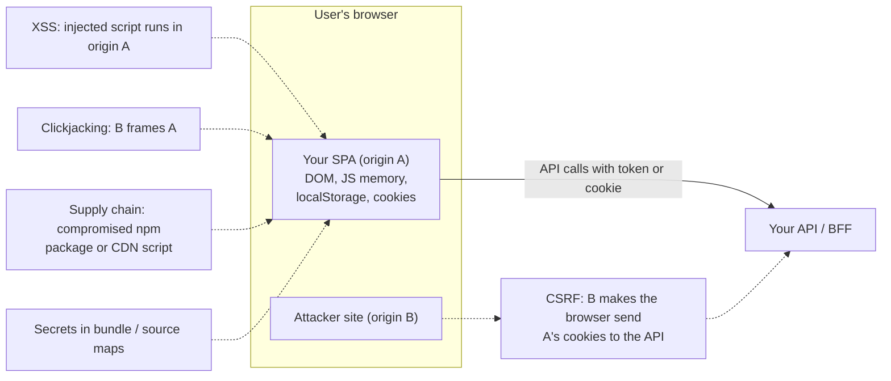
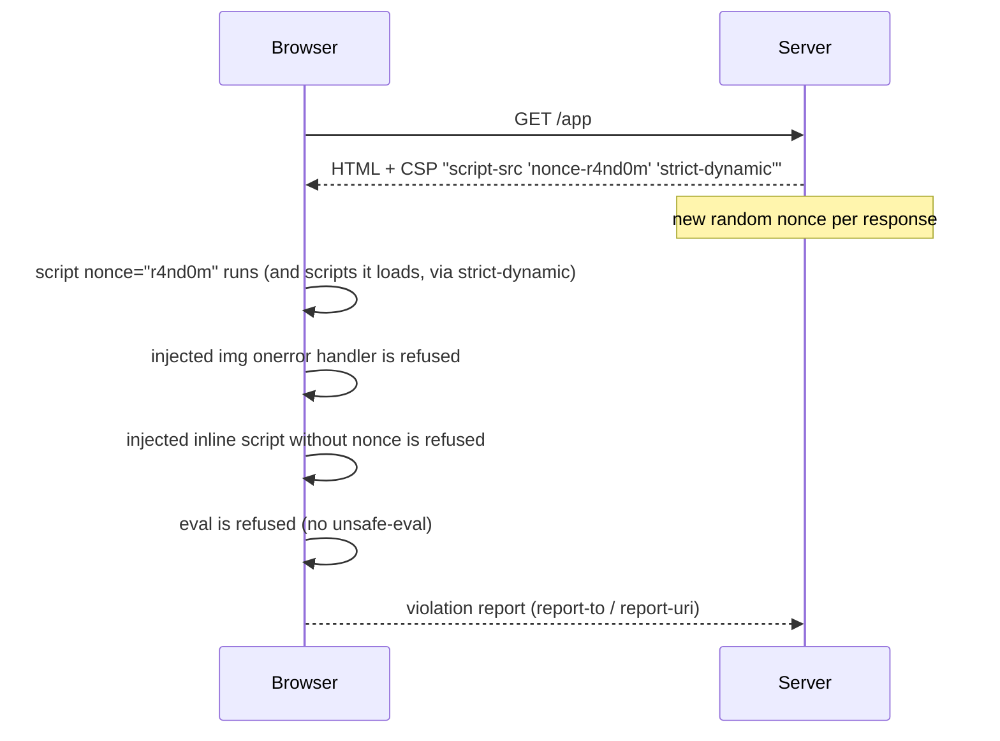
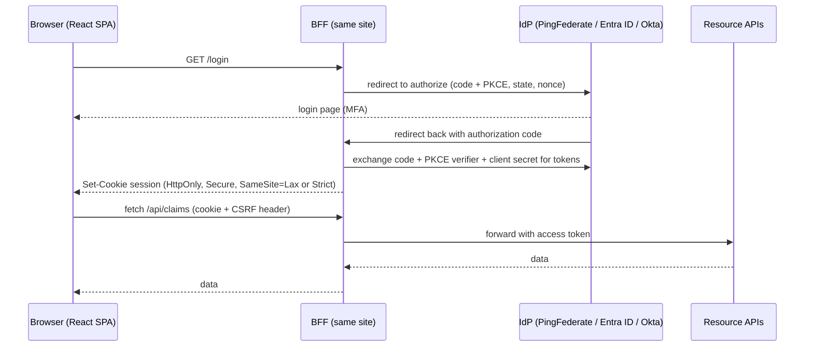

# Frontend Security (XSS, Token Storage, CSP)

!!! abstract "Key takeaways"
    - **XSS is the main frontend threat:** attacker script running in your origin can read the DOM, call your APIs with the user's session and steal anything JavaScript can reach. **React escapes text by default** (a payload rendered as `{text}` showed as literal text, measured). The escape hatches are where XSS gets in: `dangerouslySetInnerHTML` ran an `onerror` payload (measured), so **sanitise with DOMPurify** (it stripped the handler, measured). **React 19 blocks `javascript:` URLs** in `href` (replaced with a throwing URL, measured). Also watch `ref.innerHTML`, `eval`, third-party scripts and unsafe markdown renderers.
    - **Content Security Policy** limits damage if an injection happens: with `script-src 'nonce-…'`, the nonce'd script ran, while an injected inline event handler, a dynamically created inline script and `eval` were all **blocked** (measured). The same handler ran on a page without CSP. Use nonces or hashes (+ `'strict-dynamic'`), `object-src 'none'`, `base-uri 'none'`, `frame-ancestors`, and roll out with `Content-Security-Policy-Report-Only` first.
    - **Trusted Types** (`require-trusted-types-for 'script'`) make DOM XSS sinks reject strings: `innerHTML = '<b>x</b>'` threw a `TypeError`, and only values from a named policy were accepted (measured in Chromium).
    - **Token storage:** anything in `localStorage` is readable by any script on the page (measured), so XSS means token theft. **HttpOnly cookies** aren't visible to `document.cookie` (only the non-HttpOnly cookie showed, measured). The current recommendation for browser apps (IETF *OAuth 2.0 for Browser-Based Applications*) is a **Backend-for-Frontend (BFF)**: the server does the OAuth flow, keeps tokens, and gives the browser an HttpOnly, Secure, SameSite session cookie. If the SPA must hold tokens: **authorization code + PKCE**, access token in memory, short lifetimes, refresh-token rotation.
    - **CSRF** affects cookie-based auth. In Chromium, a cross-site form POST did **not** carry `SameSite=Lax` or `Strict` cookies, but **did** carry `SameSite=None` and a cookie with no SameSite attribute set within the last 2 minutes (the "Lax + POST" exception) (measured). So keep CSRF tokens or origin checks (`Origin`/`Sec-Fetch-Site`) for state-changing requests. SameSite is defence in depth, not the whole defence.
    - Also: CORS isn't an auth mechanism, frame protection (`frame-ancestors`), security headers, dependency hygiene (lockfiles, audit, SRI for CDN scripts), and never putting secrets in the bundle.

## Why it matters

Every senior frontend interview for an authenticated app asks "where do you store the token?" and "how do you prevent XSS?". My resume mentions OAuth2 with PingFederate and Active Directory at OptumRx (a healthcare app with 750K+ users and PHI), and JWT/SSO with Spring Security at Johnson Controls, so I should expect follow-ups that join the frontend and backend parts: the OAuth flow for the React app, cookies vs tokens, CSRF, CSP and how micro-frontends share auth.

Measurements on this page come from React 19.3, DOMPurify and Chromium (Playwright) against a small Node server, run while writing this page. Cookie and CSP behaviour can differ slightly across browsers and versions.

## Core concepts

### Threat model of a SPA


*Notice that XSS is the most severe: injected script runs as your origin, so every client-side storage choice and every API the user can call is exposed. The other defences assume XSS is under control.*

### XSS types and React

| Type | How it gets in | Example |
|---|---|---|
| **Stored** | Malicious content saved on the server, rendered to other users | A comment or claim note with `` |
| **Reflected** | Payload in a URL echoed into the page | `?q=<script>…` rendered by the server |
| **DOM-based** | Client-side code moves untrusted data into a sink | `el.innerHTML = location.hash.slice(1)` |

React's JSX escapes strings inserted as children and attribute values, which removes most XSS by default. The remaining risks are escape hatches and sinks:

- `dangerouslySetInnerHTML` (rich text, CMS content, markdown output).
- **URLs** in `href`/`src` built from user input: `javascript:` schemes. React 19 blocks `javascript:` URLs (earlier versions only warned in dev). Validate URL schemes yourself anyway (`https:` / `mailto:` allowlist), because other schemes and non-React code paths remain.
- Direct DOM access through refs (`ref.current.innerHTML`), `document.write`, `eval`, `new Function`, `setTimeout("string")`.
- Server-side rendering that injects state into a `<script>` without proper serialisation.
- Third-party scripts (analytics, tag managers, chat widgets) that run with full origin privileges.

Measured in Chromium with React 19.3:

| Code | Result |
|---|---|
| `<p>{payload}</p>` | Rendered as literal text ``. No execution |
| `<div dangerouslySetInnerHTML={{__html: payload}} />` | `onerror` **executed** |
| `dangerouslySetInnerHTML={{__html: DOMPurify.sanitize(payload)}}` | Sanitised to `<b>bold</b>`. No execution |
| `<a href="javascript:…">` | React rewrote it to `javascript:throw new Error('React has blocked a javascript: URL as a security precaution.')`. Clicking ran nothing |

### Content Security Policy

CSP is a response header that tells the browser which sources of script, style, frames and connections are allowed. Its main job is limiting XSS damage: even if an attacker injects markup, the browser refuses to run script that the policy doesn't allow.


*Notice that the nonce changes on every response, so an attacker who injects markup can't guess it. Static SPAs served from a CDN usually use hashes instead.*

Measured in Chromium with `script-src 'nonce-r4nd0m'`: the nonce'd script ran, while the injected `onerror` handler, a dynamically inserted inline script and `eval` were refused (`eval` threw, three "Refused to execute" violations logged). The same `onerror` injection **ran** on a page without CSP.

A **strict CSP** (Google's recommended approach) looks like:

```
Content-Security-Policy:
  script-src 'nonce-{random}' 'strict-dynamic' https: 'unsafe-inline';
  object-src 'none';
  base-uri 'none';
  frame-ancestors 'none';
  report-to csp-endpoint
```

`'strict-dynamic'` lets trusted (nonce'd) scripts load further scripts, so you don't maintain long host allowlists, and browsers that support it ignore `https:` and `'unsafe-inline'`, which are only there as fallbacks for old browsers. Host allowlists (`script-src cdn.example.com`) are weaker: research by Google found most allowlist-based policies bypassable through JSONP endpoints or script gadgets on allowed hosts.

**For SPAs:** a static `index.html` on a CDN can't inject a fresh nonce per request without an edge function, so use **hashes** of inline scripts (or no inline scripts at all), or generate nonces at the edge or in the BFF. Avoid `'unsafe-inline'` and `'unsafe-eval'` without `strict-dynamic`. CSS-in-JS libraries need a nonce for injected styles (Emotion takes one via its cache) or `style-src 'unsafe-inline'`, which is lower risk than scripts.

**Roll out safely:** start with `Content-Security-Policy-Report-Only`, collect reports, fix violations, then enforce.

### Trusted Types

Trusted Types stop DOM XSS at the sink: with `require-trusted-types-for 'script'`, assigning a string to `innerHTML`, `outerHTML`, `script.src`, `eval` and similar throws, and only typed values created by a named policy are accepted.

Measured in Chromium: `div.innerHTML = '<b>x</b>'` threw a `TypeError`, while `div.innerHTML = policy.createHTML('<b>y</b>')` succeeded (the policy escaped it to `&lt;b&gt;y&lt;/b&gt;`). A sensible policy wraps DOMPurify (`DOMPurify.sanitize(s, {RETURN_TRUSTED_TYPE: true})`). Support is in Chromium-based browsers, and Firefox and Safari have been adding it, so treat it as an extra layer, not the only one.

### Where to store tokens

| Option | XSS exposure | CSRF exposure | Notes |
|---|---|---|---|
| `localStorage` / `sessionStorage` | **Readable by any script** (measured) | None (not auto-sent) | Simple. Token theft = attacker uses it from anywhere until expiry |
| JS memory (closure, React state) | Not persistent, but XSS can still call APIs as the user or hook `fetch` | None | Lost on refresh, needs silent renew or refresh-token flow |
| **HttpOnly, Secure, SameSite cookie** | **Not readable by JS** (measured: `document.cookie` showed only the non-HttpOnly cookie) | Yes: needs SameSite + CSRF token or origin checks | Auto-sent; works best same-site |
| **BFF (server holds tokens)** | Tokens never reach the browser. XSS can still act during the session, but can't steal long-lived tokens | Handled by BFF (SameSite + CSRF token / custom header) | Recommended by the IETF browser-apps BCP |

Key point for interviews: **no storage is safe against XSS**. If attacker script runs, it can act as the user while the page is open. What storage changes is whether the attacker can **steal a token and keep using it elsewhere**. HttpOnly cookies and a BFF stop token exfiltration, which is why they're preferred, and XSS prevention (escaping, sanitising, CSP) remains the primary control.

{ loading=lazy }
*Watch the stolen token: only localStorage lets the script take it away. The other options stop exfiltration, not the script acting as the user while the page is open.*

### OAuth 2.0 for SPAs and the BFF pattern


*Notice that the browser never sees an access or refresh token. The BFF is a confidential client, refreshes tokens server-side, and the browser holds only a session cookie it can't read.*

- **Implicit flow is deprecated** (OAuth 2.0 Security BCP, RFC 9700, and OAuth 2.1). SPAs use **authorization code + PKCE**.
- **If the SPA is the OAuth client** (no BFF): it's a public client. Keep the access token in memory, use short lifetimes (minutes), and use refresh-token rotation with reuse detection, or sender-constrained tokens (DPoP), as the IdP allows.
- **BFF:** a thin server (Spring Cloud Gateway + `oauth2Login` with `TokenRelay`, Next.js server, a Node proxy) that is a confidential OAuth client. It's the strongest pattern for apps handling sensitive data, at the cost of running a server and keeping the API same-site.

### CSRF and SameSite

CSRF tricks the browser into sending an authenticated request from another site. It only matters when the browser attaches credentials automatically, i.e. cookies (and HTTP Basic or client certificates). Bearer tokens in an `Authorization` header aren't sent automatically, so token-in-header APIs aren't CSRF-prone (but are exposed to XSS token theft instead).

**SameSite** controls when cookies are sent on cross-site requests:

| Attribute | Cross-site subresource (img, fetch) | Cross-site top-level GET navigation | Cross-site top-level POST |
|---|---|---|---|
| `Strict` | Not sent | Not sent | Not sent |
| `Lax` | Not sent | **Sent** | Not sent |
| `None; Secure` | Sent | Sent | Sent |
| *(no attribute, Chromium)* | Treated as Lax | Sent | Sent if the cookie was set less than 2 minutes ago ("Lax + POST"), otherwise not |

Measured in Chromium (attacker page on `127.0.0.1:8802`, app on `localhost:8801`, `Sec-Fetch-Site: cross-site`):

- Auto-submitted cross-site **form POST**: carried `none=1; nosamesite=1`, so the `SameSite=None` cookie and the fresh default cookie were sent, while the `Lax` (`sid`) and `Strict` cookies were **not**.
- Cross-site **img GET** and **fetch POST** (`credentials: 'include'`, `no-cors`): only the `SameSite=None` cookie was sent.
- **Same-site** navigation: all cookies were sent.
- Repeating the cross-site form POST 130 seconds after login: only the `SameSite=None` cookie was sent (see the note below).

!!! note "Lax + POST, re-measured"
    The cross-site POST was repeated 130 seconds after login. Only `none=1` was sent: the cookie with no SameSite attribute had aged out of the 2-minute window and was treated as plain Lax. The `SameSite=None` cookie is sent regardless of age.

{ loading=lazy }
*Notice the `nosamesite` cookie: it rides along only while it's under 2 minutes old, then behaves like Lax.*

**Defences for cookie-authenticated, state-changing requests:**

1. `SameSite=Lax` or `Strict` on session cookies (always set the attribute explicitly).
2. A CSRF token (synchronizer token, or double-submit cookie as Spring Security's `CookieCsrfTokenRepository` does, read by the SPA and sent as `X-XSRF-TOKEN`), or require a custom header (cross-site forms can't set headers, and cross-origin `fetch` with custom headers triggers a CORS preflight).
3. Check `Origin` / `Sec-Fetch-Site` on the server and reject cross-site state-changing requests.
4. Never change state on GET (Lax cookies are sent on cross-site top-level GETs).

See [Sessions vs tokens, CSRF and CORS in Spring](../spring-security-oauth2/03-sessions-vs-tokens-csrf-and-cors-in-spring.md) for the server side.

### CORS is not security for your API

CORS relaxes the browser's same-origin policy for **reading responses**. It doesn't stop requests from being sent (simple requests are sent without a preflight), doesn't stop non-browser clients, and doesn't replace authentication. Common mistakes: reflecting any `Origin` together with `Access-Control-Allow-Credentials: true`, `null` origin allowed, or regex allowlists that match `evil-example.com`.

### Other frontend protections

| Risk | Control |
|---|---|
| Clickjacking | `Content-Security-Policy: frame-ancestors 'none'` (or a list), legacy `X-Frame-Options: DENY` |
| Protocol downgrade | `Strict-Transport-Security: max-age=63072000; includeSubDomains; preload` |
| MIME sniffing | `X-Content-Type-Options: nosniff` |
| Referrer leaks (tokens/IDs in URLs) | `Referrer-Policy: strict-origin-when-cross-origin`; never put tokens in URLs |
| Powerful APIs | `Permissions-Policy: camera=(), geolocation=()` |
| Cross-origin isolation / Spectre | `Cross-Origin-Opener-Policy: same-origin` (also protects against tabnabbing-style `window.opener` access) |
| CDN script tampering | Subresource Integrity: `<script src=… integrity="sha384-…" crossorigin>` |
| Supply chain | Lockfiles, `npm ci`, `npm audit`/Dependabot/Snyk, review new deps, pin versions, limit install scripts |
| Secrets in bundle | Anything in the bundle (including `VITE_`/`REACT_APP_` env vars) is public. Keep secrets server-side; don't publish source maps publicly unless intended |
| Sensitive data in the browser | Don't cache PHI in `localStorage`; clear state on logout; `Cache-Control: no-store` on sensitive API responses |

## In practice: code & configuration

### Rendering user content

=== "❌ Raw HTML and unchecked URLs"

    ```tsx
    function ClaimNote({ note, website }: { note: string; website: string }) {
      return (
        <>
          {/* Stored XSS: any  in the note runs as our origin */}
          <div dangerouslySetInnerHTML={{ __html: note }} />
          {/* javascript:, data: or vbscript: URLs from user input */}
          <a href={website}>Provider website</a>
        </>
      );
    }
    ```

=== "✅ Sanitise HTML, allowlist URL schemes"

    ```tsx
    import DOMPurify from "dompurify";

    const SAFE_SCHEMES = new Set(["https:", "mailto:"]);
    function safeUrl(raw: string): string | undefined {
      try {
        const u = new URL(raw, window.location.origin);
        return SAFE_SCHEMES.has(u.protocol) ? u.href : undefined; // reject javascript:, data:, etc.
      } catch {
        return undefined;
      }
    }

    function ClaimNote({ note, website }: { note: string; website: string }) {
      // Prefer plain text: {note}. Only sanitise when rich text is a real requirement.
      const clean = DOMPurify.sanitize(note, { USE_PROFILES: { html: true } });
      const href = safeUrl(website);
      return (
        <>
          <div dangerouslySetInnerHTML={{ __html: clean }} />
          {href ? <a href={href} rel="noopener noreferrer" target="_blank">Provider website</a> : null}
        </>
      );
    }
    ```

### Security headers at the edge or BFF

```ts
// Express BFF (Node): a fresh nonce per response + strict CSP
import crypto from "node:crypto";
import helmet from "helmet";

app.use((req, res, next) => {
  res.locals.nonce = crypto.randomBytes(16).toString("base64"); // unguessable, per response
  next();
});
app.use(
  helmet({
    contentSecurityPolicy: {
      useDefaults: false,
      directives: {
        scriptSrc: [(req, res) => `'nonce-${res.locals.nonce}'`, "'strict-dynamic'"],
        objectSrc: ["'none'"],
        baseUri: ["'none'"],
        frameAncestors: ["'none'"],
        connectSrc: ["'self'", "https://api.example.com"],
      },
      reportOnly: process.env.CSP_REPORT_ONLY === "true", // roll out in report-only first
    },
    strictTransportSecurity: { maxAge: 63072000, includeSubDomains: true },
    referrerPolicy: { policy: "strict-origin-when-cross-origin" },
  }),
);
// The HTML template puts nonce="<%= nonce %>" on its script tags
```

### Spring BFF: OAuth login, session cookie and CSRF for the SPA

```java
@Bean
SecurityFilterChain bff(HttpSecurity http) throws Exception {
    http
        .oauth2Login(Customizer.withDefaults())                  // code + PKCE with the IdP; tokens stay server-side
        .authorizeHttpRequests(a -> a
            .requestMatchers("/", "/assets/**").permitAll()
            .anyRequest().authenticated())
        .csrf(c -> c
            .csrfTokenRepository(CookieCsrfTokenRepository.withHttpOnlyFalse())   // SPA reads XSRF-TOKEN cookie
            .csrfTokenRequestHandler(new SpaCsrfTokenRequestHandler()))           // custom handler, see Spring docs
        .logout(l -> l.logoutSuccessUrl("/"));
    return http.build();
}
```

```yaml
server:
  servlet:
    session:
      cookie:
        http-only: true
        secure: true
        same-site: lax        # set explicitly; strict if no cross-site entry links are needed
```

*Spring Security's reference documents the SPA CSRF handler pattern for version 6. The SPA sends the token in `X-XSRF-TOKEN` (axios does this automatically for same-origin requests).*

### If the SPA must hold tokens

```ts
// Access token in memory only, never localStorage. Refresh is handled by the IdP SDK
// (e.g. oidc-client-ts / MSAL) with code + PKCE and refresh-token rotation.
let accessToken: string | null = null;
export const setToken = (t: string | null) => { accessToken = t; };

export async function api(path: string, init: RequestInit = {}) {
  const res = await fetch(path, {
    ...init,
    headers: { ...init.headers, Authorization: `Bearer ${accessToken}` },
  });
  if (res.status === 401) {
    /* trigger silent renew or re-login; don't loop */
  }
  return res;
}
```

## Real-world usage

- **Banks, healthcare and government portals** increasingly use the **BFF pattern** with HttpOnly session cookies, often via an API gateway (Spring Cloud Gateway `TokenRelay`, Duende BFF in .NET, Next.js server routes).
- **Google** deploys strict nonce-based CSP and Trusted Types across many products and publishes the approach (web.dev "Strict CSP", "Trusted Types").
- **GitHub** uses a strict CSP and SameSite cookies together with CSRF tokens.
- **Supply-chain incidents** (event-stream 2018, ua-parser-js 2021, the Polyfill.io CDN takeover 2024) are why teams pin dependencies, monitor advisories, prefer self-hosting third-party scripts, and use SRI.
- **Micro-frontends** share one auth session through the shell or BFF rather than each MFE running its own OAuth flow and storing tokens ([communication between MFEs](02-shared-dependencies-routing-and-communication-between-micro.md)).

## Trade-offs & production gotchas

!!! warning "Frontend security pitfalls"
    - **Tokens in `localStorage`** in an app with PHI or payments: one XSS leaks reusable tokens. Prefer a BFF or at least in-memory tokens with short lifetimes.
    - **"React prevents XSS, so we're fine":** escape hatches, URLs, refs, third-party scripts and SSR state injection remain.
    - **CSP with `'unsafe-inline'` and broad host allowlists:** close to no protection. Use nonces or hashes + `strict-dynamic`.
    - **Enforcing CSP without a report-only phase:** breaks analytics, fonts or widgets in production.
    - **Relying only on SameSite:** default-cookie behaviour differs by browser, the 2-minute Lax + POST window exists, and same-site (sibling subdomain) attacks bypass it. Keep CSRF tokens or origin checks.
    - **CORS `*` with credentials or reflected origins:** lets any site read authenticated responses.
    - **Secrets in env vars bundled into the frontend:** visible to anyone. API keys belong server-side.
    - **Sanitising on input only:** sanitise at output for the context (HTML, URL, attribute). Data can arrive from other paths.
    - **Logging tokens or PHI** in browser error reporting (Sentry breadcrumbs, console logs). Scrub before sending.
    - **Logout that only clears client state:** revoke or expire the server session and refresh tokens too.

- **BFF vs token-in-SPA:** BFF is more secure and simpler for the browser, but adds a server hop and requires same-site deployment. Token-in-SPA works with any API but has a larger exposure and more complex token renewal.
- **Strict CSP vs developer convenience:** nonces need server or edge rendering of HTML; hashes need build tooling; some third-party tags don't support CSP well.

## How this connects to my experience

- **Resume facts:** OptumRx: "Built the ReactJS application from the ground up and established a micro-frontend architecture" and security with "OAuth2, PingFederate and Active Directory" in a healthcare context (750K+ users). Johnson Controls: user management microservices with JWT/SSO and Spring Security. Coriolis/Thales: key management and cryptography background.
- **How to talk about it:** the React app authenticating through PingFederate (an OIDC/OAuth2 IdP federated with AD), how tokens or sessions were handled in the browser, CSRF and CORS configuration on the Spring side, and shared auth across micro-frontends via the shell. *[confirm: flow used (code + PKCE or BFF/gateway), where tokens lived in the browser, token lifetimes and refresh, CSP and security headers, how MFEs got the auth context, any pen-test or security review findings, HIPAA-related frontend controls (no PHI in storage, session timeouts)]*
- **Talking points:**
    - "React escapes by default, so I focus on the escape hatches: no raw HTML without DOMPurify, URL scheme allowlists, and CSP with nonces as a second layer."
    - "For a healthcare app I prefer a BFF: tokens stay on the server, the browser gets an HttpOnly SameSite cookie, and CSRF is handled with a token or custom header."
    - "No storage is XSS-proof. HttpOnly cookies stop token theft, but preventing XSS is still the main control."
    - "Micro-frontends get auth from the shell. They don't each run an OAuth flow or store their own tokens."
- **Likely follow-up chain:** "Where did you store the token?" → "Why not localStorage?" → "Then how do you handle CSRF?" → "What does SameSite do exactly?" → "How did PingFederate fit into the flow?" → "What CSP would you set?" → "How did the micro-frontends share the session?"

## Interview questions

### Fundamentals

??? question "Q1. What is XSS, and how does React help prevent it?"
    **Answer:** Cross-site scripting is injecting script that runs in your origin, through stored, reflected or DOM-based paths. The script can read the page, call APIs as the user and exfiltrate data. React escapes strings rendered as children and attribute values, so `<p>{userText}</p>` shows a payload as literal text (measured). Risks remain in escape hatches: `dangerouslySetInnerHTML` (measured: `onerror` executed), user-controlled URLs (React 19 now blocks `javascript:` URLs, measured, but validate schemes anyway), direct DOM writes via refs, `eval`, SSR state injection and third-party scripts. Mitigate with sanitisation (DOMPurify), URL allowlists, CSP and Trusted Types.

    **Interviewer listens for:** XSS types, React escaping, the escape hatches.

    **Common wrong answer:** "React makes XSS impossible."

??? question "Q2. Where should a SPA store access tokens?"
    **Answer:** Best: not in the browser at all. Use a BFF that performs OAuth (code + PKCE) as a confidential client, keeps tokens server-side, and issues an HttpOnly, Secure, SameSite session cookie, which JavaScript can't read (measured: `document.cookie` showed only the non-HttpOnly cookie). If the SPA must be the OAuth client: keep the access token in memory, use short lifetimes and refresh-token rotation, and avoid `localStorage`, which any script on the page can read (measured), so one XSS steals reusable tokens. Remember that no option survives XSS completely: script can still act as the user while the page is open. Storage choice decides whether tokens can be stolen and replayed elsewhere.

    **Interviewer listens for:** BFF, HttpOnly, memory vs localStorage, XSS caveat.

    **Common wrong answer:** "localStorage is fine because we use HTTPS."

??? question "Q3. What is CSRF, and when does it apply?"
    **Answer:** Cross-site request forgery makes the victim's browser send an authenticated request from another site, relying on credentials the browser attaches automatically (cookies, Basic auth, client certs). It applies to cookie-based sessions. APIs that only accept `Authorization: Bearer` headers aren't CSRF-prone, since another site can't make the browser add that header. Defences: SameSite cookies, CSRF tokens (synchronizer or double-submit), custom headers that force a preflight, `Origin`/`Sec-Fetch-Site` checks, and no state changes on GET.

    **Interviewer listens for:** automatic credentials, cookie vs bearer, defences.

    **Common wrong answer:** "CORS prevents CSRF."

??? question "Q4. What does Content Security Policy do?"
    **Answer:** It's a response header that restricts where scripts, styles, frames, images and connections can come from, and whether inline script and `eval` are allowed. Its main value is limiting XSS impact: with `script-src 'nonce-…'`, injected inline handlers, injected inline scripts and `eval` were blocked while the nonce'd script ran (measured), and the same injection ran without CSP. Strict CSP uses per-response nonces or hashes plus `'strict-dynamic'`, `object-src 'none'`, `base-uri 'none'`, and `frame-ancestors` for clickjacking. Roll out in report-only mode first.

    **Interviewer listens for:** defence in depth, nonce/hash, strict-dynamic, report-only.

    **Common wrong answer:** "CSP stops all XSS, so sanitising isn't needed." Or using `'unsafe-inline'`.

### Intermediate

??? question "Q5. Explain SameSite cookie attributes and their limits."
    **Answer:** `Strict`: never sent on cross-site requests, including top-level links. `Lax`: sent on cross-site top-level GET navigations only. `None; Secure`: sent on all requests. Chromium treats cookies without the attribute as Lax, with a 2-minute exception that allows top-level cross-site POSTs right after the cookie is set. Measured: a cross-site form POST carried the `None` cookie and the fresh default cookie but not `Lax` or `Strict` ones, and a cross-site img or fetch carried only the `None` cookie. Limits: "site" means registrable domain, so a compromised sibling subdomain is same-site; GET handlers that change state are still exposed to Lax; browser defaults differ. So SameSite is defence in depth beside CSRF tokens or origin checks.

    **Interviewer listens for:** precise per-attribute behaviour, site vs origin, why tokens remain.

    **Common wrong answer:** "Lax blocks all cross-site requests."

??? question "Q6. What is PKCE, and why do SPAs need it?"
    **Answer:** Proof Key for Code Exchange (RFC 7636): the client creates a random `code_verifier`, sends its SHA-256 hash (`code_challenge`) on the authorize request, and must present the verifier when exchanging the code for tokens. An attacker who intercepts the authorization code can't redeem it without the verifier. SPAs are public clients (they can't keep a client secret), so PKCE replaces the secret's role in protecting the code exchange. The implicit flow, which returned tokens in the URL fragment, is deprecated by the OAuth Security BCP (RFC 9700) and dropped in OAuth 2.1. Code + PKCE is now recommended for all client types.

    **Interviewer listens for:** verifier/challenge, public clients, implicit deprecated.

    **Common wrong answer:** "PKCE encrypts the token."

??? question "Q7. What is the Backend-for-Frontend pattern for auth, and what are its trade-offs?"
    **Answer:** A server-side component, deployed same-site with the SPA, acts as the confidential OAuth client: it runs code + PKCE with the IdP, stores access and refresh tokens server-side, issues an HttpOnly, Secure, SameSite session cookie, proxies API calls adding the access token, and refreshes tokens itself. Benefits: no tokens in the browser, simpler SPA, central token handling and logout, recommended by the IETF browser-based apps BCP. Costs: an extra hop and server to run and scale, session state (or encrypted cookies), CSRF protection needed because auth is cookie-based, and APIs must be reachable through the BFF.

    **Interviewer listens for:** confidential client, tokens server-side, CSRF still needed, ops cost.

    **Common wrong answer:** "A BFF is just an API gateway for aggregation." (It can be, but the security role is token handling.)

??? question "Q8. How do you safely render user-supplied rich text or markdown?"
    **Answer:** Prefer plain text. If rich text is required, render markdown with a library that escapes raw HTML by default (react-markdown doesn't render raw HTML unless you add a plugin), or sanitise the HTML with DOMPurify before `dangerouslySetInnerHTML` (measured: `` reduced to ``). Allowlist URL schemes in links and images, add `rel="noopener noreferrer"` to external links, keep DOMPurify up to date, and enforce Trusted Types with a DOMPurify-backed policy so unsanitised strings can't reach `innerHTML`. Sanitise at output; server-side sanitisation is an extra layer for other consumers.

    **Interviewer listens for:** plain text first, DOMPurify, URL schemes, Trusted Types.

    **Common wrong answer:** "Strip `<script>` tags with a regex."

### Senior

??? question "Q9. Design the authentication architecture for a healthcare React app with micro-frontends and an enterprise IdP."
    **Answer:** The IdP (PingFederate federated with AD, or Entra ID) handles login, MFA and SSO via OIDC. A BFF or gateway (e.g. Spring Cloud Gateway with `oauth2Login` and `TokenRelay`) is the confidential client using code + PKCE. It keeps tokens server-side and issues an HttpOnly, Secure, `SameSite=Lax` session cookie with idle and absolute timeouts suited to PHI. The shell app loads user info (`/me`) and exposes it to MFEs through a typed auth context or event contract. MFEs never handle tokens and call APIs through the BFF, so cookies and CSRF tokens apply uniformly. APIs validate access tokens (resource server), and authorisation is enforced server-side, with the UI only hiding features. Add a strict CSP, security headers, no PHI in browser storage, `Cache-Control: no-store` on sensitive responses, and logout that ends the BFF session and IdP session.

    **Interviewer listens for:** BFF, server-side authZ, MFE auth sharing, PHI-specific controls.

    **Common wrong answer:** "Each micro-frontend gets its own token and stores it in localStorage."

??? question "Q10. How would you roll out a strict CSP to an existing large SPA?"
    **Answer:** Inventory scripts (bundles, inline snippets, third-party tags, CSS-in-JS). Remove inline handlers and `eval`-based code (some old libraries, template compilers). Choose nonces (if HTML is rendered per request by a BFF, SSR or edge function) or hashes (static `index.html`), plus `'strict-dynamic'`, `object-src 'none'`, `base-uri 'none'`. Deploy as `Content-Security-Policy-Report-Only` with `report-to`, collect and triage reports for weeks, fix or allow legitimate sources, then enforce, keeping reporting on. Handle third parties: tag managers that inject scripts work with `strict-dynamic` but widen trust, so limit them. Add Trusted Types in report-only next. Test CSP in CI with Playwright so regressions are caught.

    **Interviewer listens for:** inventory, nonce vs hash, report-only phase, third parties, CI checks.

    **Common wrong answer:** "Add `script-src 'self' 'unsafe-inline' *.cdn.com` and ship it."

??? question "Q11. Your API uses cookie sessions and the SPA is on a different subdomain. What do you check?"
    **Answer:** Whether they're same-site: `app.example.com` and `api.example.com` share the registrable domain, so they're same-site (SameSite cookies flow) but cross-origin (CORS applies). Configure CORS with an explicit origin allowlist and `Access-Control-Allow-Credentials: true`, never reflected arbitrary origins. Use `fetch(..., {credentials: 'include'})`. Scope the cookie (`Domain` only if needed, HttpOnly, Secure, SameSite=Lax). Keep CSRF protection, because a compromised or attacker-controlled subdomain is same-site and bypasses SameSite. If the domains are different registrable domains, cookies need `SameSite=None; Secure` and are subject to third-party cookie restrictions, so move to same-site hosting or a BFF on the app's domain.

    **Interviewer listens for:** site vs origin, CORS with credentials, subdomain risk, third-party cookie limits.

    **Common wrong answer:** "Set `Access-Control-Allow-Origin: *` and it will work."

??? question "Q12. What supply-chain controls do you put on a frontend codebase?"
    **Answer:** Committed lockfiles with `npm ci` in CI, automated advisories (Dependabot, Renovate, Snyk, `npm audit`) with SLAs by severity, review of new dependencies (maintainers, popularity, install scripts, size), and minimal dependencies for trivial functions. Restrict install scripts where possible, use a private registry or proxy, enable npm provenance checks, and generate an SBOM. Self-host third-party scripts, or pin them with SRI. Limit third-party tags in production and isolate them (CSP, sandboxed iframes). Protect CI secrets and publishing tokens (2FA, OIDC trusted publishing). Incidents like event-stream and the Polyfill.io takeover show both packages and CDNs as attack paths.

    **Interviewer listens for:** lockfiles, advisories, SRI/self-hosting, provenance, CI secret hygiene.

    **Common wrong answer:** "We run npm audit once in a while."

### Scenario-based

??? question "Q13. A pen test reports stored XSS in the claim-notes field, and the app stores tokens in localStorage. What do you do?"
    **Answer:** Immediately: fix the sink (render as text or sanitise with DOMPurify), search the codebase for other `dangerouslySetInnerHTML`, `innerHTML` and URL sinks, and clean or neutralise stored payloads. Assess impact: tokens in localStorage may have been exfiltrated, so revoke refresh tokens, shorten access-token lifetimes, force re-login, and check logs for unusual API use from new IPs. Then harden: move tokens out of localStorage (BFF or in-memory with rotation), add a strict CSP in report-only then enforce, enable Trusted Types, and add lint rules (`react/no-danger`, security plugins) and tests. Follow incident and breach-notification processes, since claim data is PHI.

    **Interviewer listens for:** contain, assess token theft, revoke, structural fixes, compliance.

    **Common wrong answer:** "Fix the field and move on."

??? question "Q14. A product team wants to add a third-party chat widget and an analytics tag to the logged-in area. How do you respond?"
    **Answer:** Treat them as code running with full privileges in your origin: they can read the DOM (including PHI), call APIs as the user and inject more script. Evaluate the vendor (security review, BAA for healthcare data, data handling). Prefer integrations that run in a sandboxed iframe on the vendor's origin, or load the scripts only on pages without sensitive data. Pin versions or self-host with SRI where possible, and add the sources to CSP (with `strict-dynamic`, only the nonce'd loader). Configure the tools to avoid collecting PHI (masking, no URL parameters with identifiers), and monitor with CSP reports. Document the decision and owner.

    **Interviewer listens for:** origin privileges, PHI exposure, sandboxing, CSP/SRI, vendor review.

    **Common wrong answer:** "Paste the snippet into index.html."

## Cheat sheet

| Topic | Remember |
|---|---|
| React XSS | Escapes text; escape hatches: `dangerouslySetInnerHTML`, URLs, refs, eval, SSR state, third-party scripts |
| Measured | Raw HTML ran `onerror`; DOMPurify stripped it; React 19 blocked `javascript:` href |
| CSP | `script-src 'nonce-…' 'strict-dynamic'`, `object-src 'none'`, `base-uri 'none'`, `frame-ancestors`; report-only first; blocked injected handler, inline script and eval (measured) |
| Trusted Types | `require-trusted-types-for 'script'`: string → `TypeError`; policy (DOMPurify) required |
| Tokens | localStorage readable by any script; HttpOnly hidden from JS; BFF best; SPA client: code + PKCE, memory, short-lived, rotation |
| CSRF | Cookies only; SameSite + CSRF token / custom header / Origin check; no state change on GET |
| SameSite (Chromium) | Cross-site POST: None + fresh default sent, Lax/Strict not; img/fetch: only None |
| CORS | Controls reading responses, not sending; no reflected origins with credentials |
| Headers | HSTS, nosniff, Referrer-Policy, Permissions-Policy, COOP, frame-ancestors |
| Supply chain | Lockfile + `npm ci`, advisories, SRI/self-host, provenance, no secrets in bundle |

## Sources
1. [OWASP Cross Site Scripting Prevention Cheat Sheet](https://cheatsheetseries.owasp.org/cheatsheets/Cross_Site_Scripting_Prevention_Cheat_Sheet.html), [CSRF Prevention Cheat Sheet](https://cheatsheetseries.owasp.org/cheatsheets/Cross-Site_Request_Forgery_Prevention_Cheat_Sheet.html) and [HTML5 Security Cheat Sheet (local storage)](https://cheatsheetseries.owasp.org/cheatsheets/HTML5_Security_Cheat_Sheet.html).
2. [React docs: dangerouslySetInnerHTML](https://react.dev/reference/react-dom/components/common#dangerously-setting-the-inner-html) and [React 19 release notes](https://react.dev/blog/2024/12/05/react-19).
3. [MDN: Content Security Policy](https://developer.mozilla.org/en-US/docs/Web/HTTP/CSP), [web.dev: Mitigate XSS with a strict CSP](https://web.dev/articles/strict-csp) and [Trusted Types](https://web.dev/articles/trusted-types).
4. Weichselbaum et al., *CSP Is Dead, Long Live CSP!* (ACM CCS 2016), on allowlist bypasses.
5. [IETF draft: OAuth 2.0 for Browser-Based Applications](https://datatracker.ietf.org/doc/draft-ietf-oauth-browser-based-apps/), [RFC 9700: OAuth 2.0 Security Best Current Practice](https://www.rfc-editor.org/rfc/rfc9700) and [RFC 7636: PKCE](https://www.rfc-editor.org/rfc/rfc7636).
6. [MDN: SameSite cookies](https://developer.mozilla.org/en-US/docs/Web/HTTP/Headers/Set-Cookie#samesitesamesite-value) and [Chromium SameSite updates (Lax + POST)](https://www.chromium.org/updates/same-site/).
7. [Spring Security reference: CSRF for single-page applications](https://docs.spring.io/spring-security/reference/servlet/exploits/csrf.html#csrf-integration-javascript-spa).
8. [DOMPurify](https://github.com/cure53/DOMPurify).
9. Demonstrations on this page: React 19.3, DOMPurify and Chromium via Playwright against a local Node server (two origins, `localhost` and `127.0.0.1`), run while writing this page.
