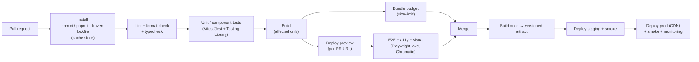
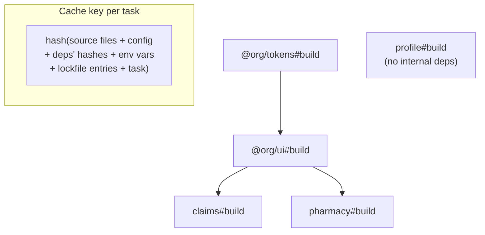
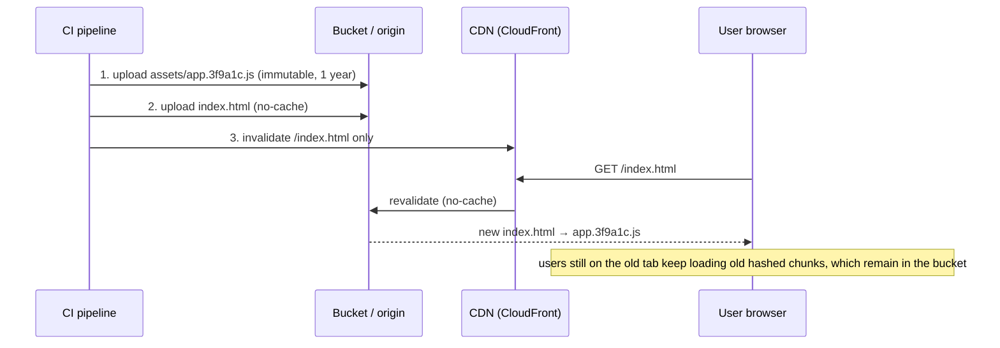
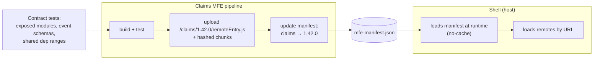

# Frontend CI/CD & Monorepos

!!! abstract "TL;DR"
    - A frontend pipeline runs **install (lockfile, `npm ci`) → lint + typecheck → unit tests → build → E2E/visual on a preview → bundle-size budget → deploy to CDN → smoke test**, with fast feedback on every PR and the same artifact promoted across environments.
    - **Monorepo vs polyrepo:** a monorepo gives atomic cross-package changes, one toolchain and easy code sharing (design system, API clients), but needs **tooling** so CI doesn't rebuild everything. A polyrepo gives hard boundaries and independent pipelines, at the cost of version juggling and slower cross-cutting changes.
    - **Workspaces** (npm, pnpm, Yarn) link local packages. **Orchestrators** (Turborepo, Nx) add a **task graph** (`dependsOn: ["^build"]` builds dependencies first), **caching** keyed by input hashes, and **affected-only** runs. Measured with Turborepo 2.11 on 5 packages: cold build 5.2 s, unchanged re-run **11 ms "FULL TURBO"** (5/5 cached), outputs restored from cache after deleting `dist/` (70 ms). Changing `@org/ui` rebuilt only `ui`, `claims` and `pharmacy` (2/5 cached), and `--filter='...[HEAD]'` scoped a change in a leaf app to just that app.
    - **Remote caching** shares those hashes across CI runners and developers, which is where most time savings come from in large repos.
    - **Deploying SPAs:** content-hashed assets with `Cache-Control: public, max-age=31536000, immutable`, and `index.html` (and MFE `remoteEntry.js` or manifests) with `no-cache` so a deploy is picked up immediately. Upload assets **before** the HTML so no user gets HTML pointing at missing files. Keep old assets for a while for users on the previous version. Rollback = repoint HTML or manifest to the previous build.
    - **Micro-frontends** each deploy independently (their own pipeline, versioned remote URLs, a manifest the shell reads), with contract tests and shared-dependency checks so one team's deploy can't break the shell.

## Why it matters

My resume says I "defined CI/CD standards" at OptumRx and built the React app with micro-frontends, and lists GitLab CI/CD and Jenkins. Senior frontend interviews ask how you keep CI fast as the codebase grows, monorepo or polyrepo for MFEs and a design system, how you deploy without breaking users mid-session, how you roll back, and what quality gates you put in the pipeline.

Measurements on this page come from Turborepo 2.11 with npm workspaces on Node 22, using five small packages whose build takes 1.5 s each, run while writing this page.

## Core concepts

### Pipeline stages


*Notice that the artifact is built once and promoted. Environment-specific values come from runtime config, not from rebuilding per environment.*

**Build once, promote everywhere** is harder for SPAs than for backends because bundlers inline `import.meta.env` / `process.env` values at build time. Common fixes: a `config.json` fetched at startup, or a small `window.__CONFIG__` script injected by the server or CDN per environment.

### Monorepo vs polyrepo

| Aspect | Monorepo | Polyrepo |
|---|---|---|
| Cross-package change | One atomic PR (UI lib + every app) | Publish lib, then PR each app |
| Code sharing | Workspace links, no publishing needed internally | Versioned packages on a registry |
| Tooling consistency | One lint, TS, test config | Drifts across repos |
| CI cost | Needs task graph, caching and affected detection | Naturally small per repo |
| Ownership | CODEOWNERS per folder, boundary lint rules | Repo permissions |
| Independent deploys | Possible (per-app pipelines and filters) | Natural |
| Scale concerns | Git size, IDE performance, CI design | Dependency hell, version drift |

**Monorepo ≠ monolith.** Apps in a monorepo can still deploy independently. Google, Meta and Microsoft run huge monorepos with custom tooling, while many companies run polyrepos successfully. For micro-frontends, both work: a monorepo makes shared-dependency alignment and design-system updates easier, and a polyrepo makes team autonomy explicit.

### Workspaces and orchestrators

- **Workspaces** (npm, Yarn, **pnpm**): install all packages together and symlink local packages, so `apps/claims` imports `@org/ui` from source. pnpm's content-addressable store and strict `node_modules` layout save disk and catch undeclared dependencies.
- **Turborepo:** a task runner over workspaces. You declare tasks in `turbo.json` (`dependsOn`, `outputs`, `inputs`, `env`). It hashes inputs, caches outputs and logs, runs in parallel by topology, and supports remote caching.
- **Nx:** a fuller build system: task graph, caching (local and Nx Cloud), `nx affected`, code generators, module-boundary lint rules (`@nx/enforce-module-boundaries` with tags), plugins for many frameworks, distributed task execution.
- **Others:** Bazel (hermetic, multi-language, steep learning curve), Rush, Lerna (now maintained by the Nx team, mostly for versioning and publishing).

### The task graph and caching


*Notice that a change to `ui` invalidates `ui`, `claims` and `pharmacy` (their hashes include `ui`'s) but not `tokens` or `profile`, which come straight from cache.*

The graph above is what Turborepo printed for the demo repo with `dependsOn: ["^build"]` (`^` means "the same task in my dependencies first").

Measured (5 packages, each build busy-waits 1.5 s, cache local):

| Run | Tasks run / cached | Time |
|---|---|---|
| Cold | 5 / 0 | 5.2 s (tokens → ui → claims/pharmacy chain, `profile` in parallel) |
| No changes | 0 / 5 | **11 ms**, ">>> FULL TURBO" |
| `dist/` deleted, no source change | 0 / 5 (outputs restored) | 70 ms |
| Changed `packages/ui/src` | 3 / 2 | 3.5 s (`ui`, `claims`, `pharmacy` rebuilt) |
| `--filter='...[HEAD]'` after changing only `apps/profile` | scope: `profile` only | 1 task |

`--filter='...[HEAD]'` means "packages changed since HEAD, **plus their dependents**" (the leading `...`). With the `ui` change it selected `@org/ui`, `claims` and `pharmacy` (and the root workspace). In CI you compare against the merge base, e.g. `--filter='...[origin/main]'` (or `--affected` in Turborepo 2.x, which uses the base branch).

**Cache correctness:** a cache is only as good as its inputs. Declare `env` variables that change the output (`API_URL`, feature flags), the right `outputs`, and `inputs` if tests depend on non-source files. A missed input means **stale cached builds** shipped to production.

**Remote cache:** CI runners and developers upload and download task outputs by hash (Vercel Remote Cache, Nx Cloud, or self-hosted S3-compatible servers). A PR that touches one app reuses everyone else's builds. Protect it: signed artifacts (`TURBO_REMOTE_CACHE_SIGNATURE_KEY`) and write access only from trusted CI, since a poisoned cache entry would be deployed.

### Deploying SPAs to a CDN


*Notice the order: assets first, HTML last. If the HTML went first, users could get references to files that don't exist yet. Old hashed files stay for a while so open tabs can still lazy-load their chunks.*

- **Hashed filenames** (`app.3f9a1c.js`) change whenever content changes, so they can be cached forever: `Cache-Control: public, max-age=31536000, immutable`.
- **Entry points** that must update immediately: `index.html`, MFE `remoteEntry.js` (unless versioned in the URL), `manifest.json`, service-worker scripts: `Cache-Control: no-cache` (store, but revalidate every time).
- **Chunk-load errors after deploys:** a long-open tab requests a lazy chunk that was deleted. Keep previous builds' assets for days or weeks, and handle `ChunkLoadError` by prompting a reload.
- **SPA routing:** the CDN must return `index.html` for unknown paths (CloudFront custom error response or function), while real 404s for missing assets should stay 404.
- **Rollback:** re-upload or repoint the previous `index.html` (or the MFE manifest entry). Because assets are immutable, rollback is instant and doesn't need a rebuild.

### Micro-frontend pipelines


*Notice that the shell finds remotes through a runtime manifest, so each MFE deploys (and rolls back) by updating one manifest entry, without rebuilding the shell.*

- **Versioned remote URLs** (`/claims/1.42.0/remoteEntry.js`) + a **manifest** give atomic switchovers and instant rollbacks per MFE.
- **Gates before switching the manifest:** contract tests (exposed module names and props, [event schemas](02-shared-dependencies-routing-and-communication-between-micro.md)), shared-dependency range checks (`strictVersion` failures caught in CI, not production), and an integration smoke test of the shell with the new remote on a preview manifest.
- **Canary per MFE:** the manifest can serve a new version to a percentage of users or internal users first.

### Preview environments, feature flags and quality gates

- **Per-PR previews** (Vercel/Netlify/Amplify previews, or an S3 prefix per branch) let reviewers, designers and E2E tests run against the real build.
- **Feature flags** (LaunchDarkly, Unleash, OpenFeature, or config) decouple deploy from release: merge dark, enable gradually, kill switch without rollback.
- **Quality gates:** typecheck with `tsc --noEmit`, ESLint (including `jsx-a11y`, security plugins), unit coverage thresholds for critical code, bundle budgets (`size-limit`, Lighthouse CI budgets), visual regression, axe checks, and dependency audit. Keep the PR path fast (< 10 min) and push slower suites (full E2E matrix) to merge or nightly.

## In practice: code & configuration

### turbo.json

```json
{
  "$schema": "https://turbo.build/schema.json",
  "globalDependencies": [".env.ci", "tsconfig.base.json"],
  "tasks": {
    "build": {
      "dependsOn": ["^build"],                 // build internal deps first
      "outputs": ["dist/**"],                  // what to cache and restore
      "env": ["VITE_API_URL", "VITE_FLAGS"]    // part of the hash: different value = different cache entry
    },
    "lint": {},
    "typecheck": { "dependsOn": ["^build"] },
    "test": { "dependsOn": ["^build"], "outputs": ["coverage/**"] },
    "dev": { "cache": false, "persistent": true }
  }
}
```

*JSON doesn't allow comments: they're shown here only for explanation.*

### CI: GitLab with affected-only builds and a remote cache

=== "❌ Build and test everything, every time"

    ```yaml
    build:
      image: node:22
      script:
        - npm install            # not reproducible: may update the lockfile
        - npm run build --workspaces
        - npm test --workspaces  # 40 minutes, even for a one-line change
    ```

=== "✅ Lockfile install, cache, affected tasks"

    ```yaml
    # .gitlab-ci.yml
    variables:
      TURBO_TELEMETRY_DISABLED: "1"
      TURBO_API: $TURBO_API          # remote cache server
      TURBO_TOKEN: $TURBO_TOKEN      # masked CI variable
      TURBO_TEAM: web

    default:
      image: node:22
      cache:
        key: { files: [package-lock.json] }
        paths: [.npm/]

    verify:
      stage: test
      script:
        - npm ci --cache .npm --prefer-offline
        - git fetch origin $CI_DEFAULT_BRANCH --depth=50
        # changed packages + their dependents, compared with main
        - npx turbo run lint typecheck test build --filter="...[origin/$CI_DEFAULT_BRANCH]"
        - npx size-limit                      # fail if bundles exceed budgets
      rules:
        - if: $CI_PIPELINE_SOURCE == "merge_request_event"

    deploy_claims:
      stage: deploy
      script:
        - npm ci --cache .npm --prefer-offline
        - npx turbo run build --filter=claims
        - ./scripts/deploy-spa.sh apps/claims/dist claims
      rules:
        - if: $CI_COMMIT_BRANCH == $CI_DEFAULT_BRANCH
          changes: [apps/claims/**/*, packages/**/*, package-lock.json]
      environment: { name: production/claims }
    ```

### Deploy script with correct cache headers

```bash
#!/usr/bin/env bash
set -euo pipefail
DIST=$1; APP=$2; BUCKET=s3://web-prod; VERSION=${CI_COMMIT_SHORT_SHA}

# 1) Immutable hashed assets first, never deleted on deploy (open tabs still need old chunks)
aws s3 sync "$DIST/assets" "$BUCKET/$APP/assets" \
  --cache-control "public,max-age=31536000,immutable"

# 2) Entry points last, always revalidated
aws s3 cp "$DIST/index.html" "$BUCKET/$APP/index.html" \
  --cache-control "no-cache" --content-type "text/html"

# 3) Invalidate only what isn't hashed
aws cloudfront create-invalidation --distribution-id "$CF_ID" --paths "/$APP/index.html"

# 4) Smoke test the live site
curl -fsS "https://app.example.com/$APP/" | grep -q "<div id=\"root\">"
echo "deployed $APP@$VERSION"
```

### Enforcing boundaries in a monorepo

```text
# CODEOWNERS: reviews from the owning team
/packages/ui/        @org/design-system
/apps/claims/        @org/claims-team
/apps/pharmacy/      @org/pharmacy-team
/.gitlab-ci.yml      @org/platform
```

```js
// eslint.config.js: apps may import packages, but not each other (Nx offers this natively via tags)
export default [
  {
    files: ["apps/claims/**"],
    rules: {
      "no-restricted-imports": ["error", { patterns: ["../pharmacy/*", "pharmacy", "profile"] }],
    },
  },
];
```

### Bundle budgets

```json
// package.json (apps/claims)
"size-limit": [
  { "path": "dist/assets/index-*.js", "limit": "180 kB" },
  { "path": "dist/assets/vendor-*.js", "limit": "250 kB" }
]
```

## Real-world usage

- **Large monorepos:** Google (Piper + Bazel), Meta, Microsoft (Rush and Lage in some JS orgs), and Vercel's and Nx's own repos. Many mid-size companies use pnpm workspaces + Turborepo or Nx for apps, a design system and shared API clients.
- **Polyrepos for micro-frontends** are common when teams are in different departments or vendors, with a shared design system published to a private registry.
- **CDN deployment of SPAs** (S3 + CloudFront, Azure Storage + Front Door, Netlify, Vercel) with hashed assets and `no-cache` HTML is the standard pattern.
- **Feature flags and canaries** (LaunchDarkly, Unleash, Flagsmith) are how large teams ship many times a day without risky big-bang releases.
- **Remote caching** is a major reason organisations adopt Turborepo or Nx: published case studies report large CI time reductions, though savings depend heavily on how well inputs and outputs are declared.

## Trade-offs & production gotchas

!!! warning "Frontend CI/CD pitfalls"
    - **`npm install` in CI:** can change the lockfile and give different builds. Use `npm ci` / `pnpm install --frozen-lockfile`.
    - **Undeclared cache inputs** (env vars, config files): stale cached builds reach production. Declare `env`, `inputs` and `globalDependencies`.
    - **Shallow clones with affected filters:** `--filter=[origin/main]` needs enough history to find the merge base. Fetch the base branch.
    - **Deleting old assets on deploy** (`aws s3 sync --delete`): open tabs hit `ChunkLoadError`. Keep old hashed files and expire them later.
    - **Caching `index.html` or `remoteEntry.js` for long:** users don't see deploys, or the shell loads an old remote. Use `no-cache` or versioned URLs.
    - **Uploading HTML before assets:** brief 404s for new chunks.
    - **Environment-specific builds:** what you tested isn't what you ship. Inject runtime config instead.
    - **Flaky E2E blocking every PR:** quarantine fixes with ownership, run critical-path E2E on PRs and the full suite on merge.
    - **Secrets in frontend build variables:** they end up in the bundle. Only public config belongs there.
    - **Monorepo without boundaries:** apps importing each other's internals and one giant CI job. Add CODEOWNERS, boundary lint rules and per-app pipelines.

- **Turborepo vs Nx:** Turborepo is small and easy to adopt on top of existing workspaces. Nx offers more (generators, boundary enforcement, distributed execution, framework plugins) with more configuration.
- **Speed vs confidence:** affected-only builds speed up PRs but rely on an accurate graph. Some teams also run a full build nightly to catch graph mistakes.

## How this connects to my experience

- **Resume facts:** OptumRx: "Built the ReactJS application from the ground up and established a micro-frontend architecture" and defined CI/CD standards while leading 8–10 engineers. Skills: GitLab CI/CD, Jenkins, Docker, Terraform, AWS (Deloitte: EKS, Terraform). Coriolis: GitLab CI/CD for Spring Boot services.
- **How to talk about it:** CI/CD standards for the team (pipeline stages, quality gates, branch and review rules), how the React MFEs were built and deployed independently, and how shared code (design system, utilities) was managed. *[confirm: monorepo or separate repos for the MFEs, which CI system the frontend used, where the frontend was hosted (CDN, containers on EKS/AKS), how remotes were discovered (manifest, env config), test stages (unit, E2E, visual), deployment frequency, rollback process, feature flags]*
- **Not used directly (unless confirmed):** Turborepo/Nx remote caching. Position it as knowledge of how to scale CI for a monorepo.
- **Talking points:**
    - "Every PR runs lint, typecheck, unit tests, build and a bundle budget, plus E2E against a preview. Then we build once and promote the same artifact."
    - "For SPAs, hashed assets are immutable and the HTML or remote entry is `no-cache`, so deploys are instant and rollbacks are a pointer change."
    - "Each micro-frontend has its own pipeline and deploys by updating a versioned entry in the manifest the shell reads."
    - "In a monorepo, the task graph and caching are what keep CI fast: only affected packages build."
- **Likely follow-up chain:** "What CI/CD standards did you define?" → "Monorepo or polyrepo for the MFEs?" → "How did you deploy an MFE without redeploying the shell?" → "How do you roll back?" → "How do you keep CI under 10 minutes as it grows?" → "How do you avoid breaking users mid-session on deploy?"

## Interview questions

### Fundamentals

??? question "Q1. What stages should a frontend CI pipeline have?"
    **Answer:** Reproducible install from the lockfile (`npm ci`), lint and format check, typecheck (`tsc --noEmit`), unit and component tests, build, bundle-size budget, deploy a preview, E2E/accessibility/visual tests against the preview, then after merge build once and promote that artifact through staging to production with smoke tests and monitoring. Keep the PR path fast with caching and affected-only runs, and move long suites to merge or nightly.

    **Interviewer listens for:** lockfile install, typecheck, previews, budgets, build once.

    **Common wrong answer:** "Run `npm run build` and copy it to the server."

??? question "Q2. Monorepo or polyrepo: what are the trade-offs?"
    **Answer:** A monorepo enables atomic changes across packages (update the design system and all apps in one PR), shared tooling and configs, and easy code sharing without publishing. It needs task-graph tooling, caching, affected detection, CODEOWNERS and boundary rules to stay fast and orderly. A polyrepo gives clear ownership and independent, small pipelines, but cross-cutting changes need publishing and multiple PRs, and versions drift. A monorepo doesn't mean coupled deploys: apps can still release independently.

    **Interviewer listens for:** atomic changes vs autonomy, tooling cost, monorepo ≠ monolith.

    **Common wrong answer:** "Monorepos mean everything deploys together."

??? question "Q3. How should SPA assets be cached on a CDN?"
    **Answer:** Content-hashed files (JS, CSS, images with the hash in the name) get `Cache-Control: public, max-age=31536000, immutable`, since any content change produces a new name. Entry points that reference them (`index.html`, MFE `remoteEntry.js` without a version in the URL, manifests, service workers) get `no-cache`, so browsers revalidate and see new deploys immediately. Upload assets before HTML, invalidate only non-hashed paths, and keep old hashed assets so open tabs can still load their lazy chunks.

    **Interviewer listens for:** hashed immutable vs no-cache entry, upload order, old assets kept.

    **Common wrong answer:** "Invalidate the whole CDN on every deploy and set a short TTL on everything."

??? question "Q4. What are workspaces, and what do Turborepo or Nx add?"
    **Answer:** Workspaces (npm, Yarn, pnpm) install a multi-package repo together and symlink local packages so apps use shared packages from source. Orchestrators add a task graph (`dependsOn: ["^build"]` builds dependencies first, parallelising the rest), caching keyed by hashes of inputs (measured: an unchanged re-run took 11 ms with 5/5 tasks cached, and deleted outputs were restored from cache), affected-only runs, and remote caching across machines. Nx adds generators, module-boundary enforcement and distributed execution.

    **Interviewer listens for:** linking vs orchestration, graph, cache, affected.

    **Common wrong answer:** "Turborepo is a package manager."

### Intermediate

??? question "Q5. How does build caching decide whether a task can be skipped, and how can it go wrong?"
    **Answer:** The tool hashes the task's inputs: source files in the package, relevant config, the hashes of dependency tasks, declared env variables, lockfile entries and the task definition. If the hash matches a cache entry, it restores outputs and logs instead of running. Measured: changing `@org/ui` invalidated `ui`, `claims` and `pharmacy` (3 ran, 2 cached). It goes wrong when inputs aren't declared: an env var that changes the bundle (`VITE_API_URL`) or a config file outside the package. The cache then serves a stale build. Also guard the remote cache against poisoning (signatures, write access only from CI).

    **Interviewer listens for:** input hashing, dependency hashes, undeclared inputs, cache security.

    **Common wrong answer:** "It compares file timestamps."

??? question "Q6. How do you run only affected projects in CI?"
    **Answer:** Compute changed files against the merge base with the target branch, map them to packages, and include their dependents via the dependency graph: Turborepo `--filter='...[origin/main]'` (or `--affected`), `nx affected -t build test`. Measured: a change in a leaf app scoped the run to that app alone, and a change in `ui` selected `ui` and its two dependent apps. Fetch enough git history for the merge base, treat root-level changes (lockfile, shared config) as affecting everything, and run a full build periodically to catch graph mistakes.

    **Interviewer listens for:** merge base, dependents, root changes, history depth.

    **Common wrong answer:** "Use `git diff` and rebuild only the changed folder." (Misses dependents.)

??? question "Q7. How do you deploy a new SPA version without breaking users who have the app open?"
    **Answer:** Make deploys additive: upload new hashed assets alongside old ones, then switch `index.html` (or the manifest) last. Keep old assets for a retention period so open tabs can still lazy-load their chunks. Handle `ChunkLoadError` (catch in a route-level error boundary or `lazy` wrapper and offer a reload). For API compatibility, keep backend changes backward compatible during the overlap (expand and contract). Optionally notify users of a new version (poll a version file, or service-worker update prompt).

    **Interviewer listens for:** additive deploys, retention, chunk errors, API compatibility.

    **Common wrong answer:** "`s3 sync --delete` and invalidate everything."

??? question "Q8. How do you handle environment configuration for a frontend that should be built once?"
    **Answer:** Keep build-time variables environment-neutral and load environment config at runtime: fetch `/config.json` before rendering, or have the server or CDN inject `window.__CONFIG__` per environment. Only public values belong there (API base URLs, feature-flag client keys, IdP issuer and client ID). Secrets never go to the browser. This allows promoting the exact tested artifact from staging to production and makes rollbacks safe.

    **Interviewer listens for:** build-time inlining problem, runtime config, no secrets.

    **Common wrong answer:** "Rebuild for each environment with different `.env` files." (Works, but you ship something you didn't test.)

### Senior

??? question "Q9. Design CI/CD for five micro-frontends, a shell and a design system."
    **Answer:** Repo layout: a monorepo with pnpm workspaces and Turborepo or Nx (shared tooling, atomic design-system changes), or polyrepos with the design system published. Each MFE has its own pipeline scope (affected filter or path rules): lint, typecheck, tests, build, contract tests (exposed modules, event schemas, shared-dependency ranges), preview with the shell loading the new remote, E2E smoke. Deploy each MFE to versioned paths on the CDN (`/claims/1.42.0/…`), then update its entry in a runtime manifest the shell reads with `no-cache`. Canary via the manifest, roll back by repointing. The shell deploys the same way. Design-system changes run the dependents' tests in the same PR (monorepo) or a canary consumer (polyrepo). Observability: errors and Web Vitals tagged by MFE version.

    **Interviewer listens for:** independent deploys, manifest, contract tests, rollback, version tagging.

    **Common wrong answer:** "Build all MFEs together and deploy one bundle." (That's a monolith.)

??? question "Q10. CI takes 45 minutes in a growing frontend monorepo. How do you bring it down?"
    **Answer:** Measure first (per-stage timings). Then: lockfile install with a cached package store, affected-only tasks via the task graph, local and remote caching with correct inputs and outputs, parallelise by splitting jobs (lint, typecheck, test, build) and sharding tests (Playwright `--shard`, Vitest/Jest sharding), run expensive suites (full E2E matrix, visual) on merge or nightly with critical paths on PRs, speed up tools (Vite/esbuild/SWC, `tsc --build` with project references, Vitest), fix or quarantine flaky tests with owners, and remove dead packages. Set a target (e.g. under 10 minutes for PRs) and track it.

    **Interviewer listens for:** measure, affected + cache, sharding, tiered suites, flaky-test ownership.

    **Common wrong answer:** "Buy bigger CI runners." (Helps a little, doesn't scale.)

??? question "Q11. How do you version and release shared packages in a monorepo?"
    **Answer:** Internal-only packages can stay unversioned (workspace protocol, always latest in the repo), since every consumer is tested in the same PR. Packages used outside the repo (a design system consumed by polyrepo MFEs) need semver and publishing: Changesets (contributors add a changeset, CI versions, writes changelogs, publishes) or Nx release / Lerna. Choose fixed versioning (all packages share one version) or independent versioning. Publish from CI only, with provenance and 2FA or OIDC trusted publishing.

    **Interviewer listens for:** internal vs external packages, Changesets, fixed vs independent, CI publishing.

    **Common wrong answer:** "Bump versions by hand before each release."

??? question "Q12. How do you add quality gates without slowing teams down?"
    **Answer:** Tier the gates. Fast, deterministic checks on every PR (lint, typecheck, unit tests, build, bundle budget, a11y lint) that finish in minutes. Preview-based checks (critical-path E2E, axe, visual diffs) in parallel. Heavy suites on merge or nightly. Make gates actionable: clear failure messages, auto-fix where possible (formatting), and budgets reviewed with product (a budget increase needs an explicit approval). Run the same checks locally via pre-commit hooks on staged files (lint-staged). Track pipeline time and flakiness as team metrics.

    **Interviewer listens for:** tiering, speed, actionable failures, local parity, metrics.

    **Common wrong answer:** "Run the full E2E suite on every commit and block on any failure."

### Scenario-based

??? question "Q13. After a deploy, users report a blank screen and the console shows `ChunkLoadError`. What happened, and how do you fix it?"
    **Answer:** Most likely the deploy removed the previous build's hashed chunks (e.g. `s3 sync --delete`) while users had the old `index.html` open or cached, so lazy routes requested files that no longer exist. Other causes: HTML cached too long pointing at new or old asset names, or a CDN serving `index.html` with a 200 for missing JS files (the SPA fallback), which then fails to parse. Fix: restore previous assets, stop deleting on deploy (expire old files after a retention period), serve `no-cache` HTML, scope the SPA fallback to navigation requests only, and handle `ChunkLoadError` with a reload prompt. Add a post-deploy smoke test that loads a lazy route.

    **Interviewer listens for:** deleted chunks, cache headers, SPA fallback on assets, retention, smoke test.

    **Common wrong answer:** "Tell users to clear their cache."

??? question "Q14. A team's micro-frontend deploy broke the shell in production. How do you prevent it from happening again?"
    **Answer:** First roll back by repointing the manifest entry to the previous version. Then find the break: a changed exposed-module name or props, a changed event payload, a shared-dependency version outside the shell's range (`strictVersion` failure or a second React copy), or a global CSS leak. Prevent it with contract tests in the MFE pipeline (exposed modules and TypeScript types, event schemas validated, shared-dependency ranges checked against the shell's), an integration test that loads the shell with the candidate remote on a preview manifest, a canary via the manifest with error-rate monitoring tagged by MFE version and automatic rollback, error boundaries around each remote so one failure doesn't blank the page, and a written compatibility policy (breaking changes need a new exposed module or a version bump that the shell opts into).

    **Interviewer listens for:** fast rollback, contract + integration tests, canary, error boundaries, compatibility policy.

    **Common wrong answer:** "Make all MFEs deploy together from now on."

## Cheat sheet

| Topic | Remember |
|---|---|
| Pipeline | `npm ci` → lint + typecheck → unit → build → budget → preview + E2E/a11y/visual → build once, promote → smoke |
| Mono vs poly | Atomic changes + shared tooling vs autonomy + simple CI; monorepo ≠ coupled deploys |
| Orchestrators | Turborepo (light), Nx (fuller: generators, boundaries, DTE); task graph `^build` |
| Measured cache | Cold 5.2 s → unchanged 11 ms FULL TURBO; outputs restored; ui change → 3 ran / 2 cached |
| Affected | `--filter='...[origin/main]'` / `nx affected`; includes dependents; fetch history |
| Cache inputs | Declare `env`, `inputs`, `globalDependencies`; sign remote cache |
| CDN | Hashed assets `max-age=31536000, immutable`; HTML/remoteEntry `no-cache`; assets first, HTML last; keep old chunks |
| Rollback | Repoint HTML/manifest to the previous immutable build |
| MFEs | Versioned remote paths + runtime manifest; contract tests; canary; error boundaries |
| Config | Runtime config (`config.json`), no secrets in bundle |

## Sources
1. [Turborepo documentation](https://turborepo.com/docs): [configuring tasks](https://turborepo.com/docs/crafting-your-repository/configuring-tasks), [caching](https://turborepo.com/docs/crafting-your-repository/caching), [filtering](https://turborepo.com/docs/reference/run#--filter-string), [remote caching](https://turborepo.com/docs/core-concepts/remote-caching).
2. [Nx documentation](https://nx.dev/getting-started/intro): [affected](https://nx.dev/ci/features/affected), [enforce module boundaries](https://nx.dev/features/enforce-module-boundaries).
3. [pnpm workspaces](https://pnpm.io/workspaces) and [npm workspaces](https://docs.npmjs.com/cli/using-npm/workspaces).
4. [MDN: Cache-Control](https://developer.mozilla.org/en-US/docs/Web/HTTP/Headers/Cache-Control) and [web.dev: HTTP cache](https://web.dev/articles/http-cache).
5. [AWS: Hosting a static website with S3 and CloudFront](https://docs.aws.amazon.com/AmazonS3/latest/userguide/website-hosting-cloudfront-walkthrough.html).
6. [GitLab CI/CD YAML reference](https://docs.gitlab.com/ee/ci/yaml/) (rules, changes, cache).
7. [Changesets](https://github.com/changesets/changesets) and [size-limit](https://github.com/ai/size-limit).
8. [monorepo.tools](https://monorepo.tools/) (comparison of monorepo tools).
9. Demonstrations on this page: Turborepo 2.11.7 with npm workspaces on Node 22 (five packages, 1.5 s builds), run while writing this page.
