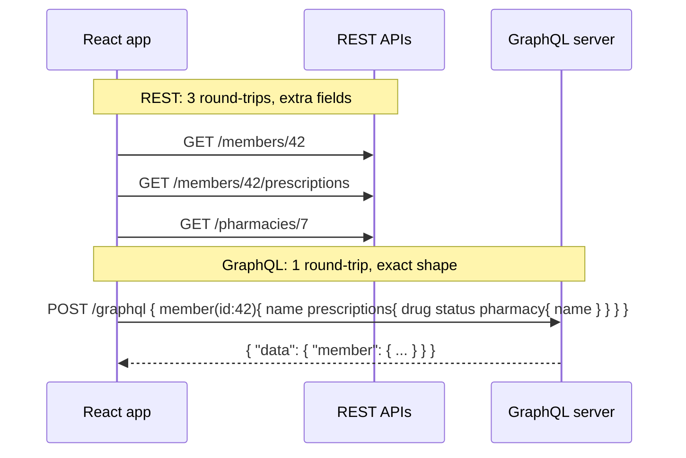

# GraphQL Fundamentals vs REST

!!! abstract "TL;DR"
    - GraphQL is a **query language and runtime** for APIs: one endpoint, a **strongly typed schema**, and **clients ask for exactly the fields they need**.
    - Three operation types: **query** (read), **mutation** (write, executed serially at the top level), **subscription** (server push, usually over WebSocket).
    - It solves REST's **over-fetching, under-fetching and N round-trips**, and it's a great **aggregation layer** over many backends.
    - It costs you **HTTP caching** (mostly POST, one URL), **N+1 risk**, **query cost/abuse risk**, and errors returned with HTTP 200 in an `errors` array.
    - Typical fit: **BFF / aggregation layer** for UIs with varied data needs. REST still fits simple resource APIs, file transfer and public cacheable APIs.

## Why it matters

My GraphQL Consumer Service at Optum sits between 5 upstream systems and multiple downstream consumers, so "why GraphQL?" is likely the first question about it. You need a crisp, balanced answer.

## Core concepts

### One request instead of many


*Notice that the round-trips move from the client (over a mobile network) to the server (inside the data centre), and the client gets exactly the shape it asked for.*

### The type system (SDL)

```graphql
scalar DateTime

enum RxStatus { CREATED APPROVED SHIPPED CANCELLED }

interface Node { id: ID! }

type Member implements Node {
  id: ID!
  name: String!
  prescriptions(status: RxStatus, first: Int = 10, after: String): PrescriptionConnection!
}

type Prescription implements Node {
  id: ID!
  drugName: String!
  status: RxStatus!
  pharmacy: Pharmacy          # nullable: the pharmacy service may be down
  updatedAt: DateTime!
}

type Query {
  member(id: ID!): Member
  node(id: ID!): Node
}

input CancelPrescriptionInput { prescriptionId: ID!, reason: String }

type CancelPrescriptionPayload { prescription: Prescription, errors: [UserError!]! }

type Mutation {
  cancelPrescription(input: CancelPrescriptionInput!): CancelPrescriptionPayload!
}

type Subscription {
  prescriptionStatusChanged(memberId: ID!): Prescription!
}
```

| Building block | Purpose |
|---|---|
| Object types, fields | The graph's shape |
| Scalars | `Int`, `Float`, `String`, `Boolean`, `ID` + custom (`DateTime`) |
| `!` (non-null) | A guarantee to clients; a null in a non-null field bubbles up to the nearest nullable parent |
| Enums, interfaces, unions | Polymorphism and constrained values |
| Input types | Structured arguments for mutations |
| Directives | `@include`, `@skip`, `@deprecated`, custom (`@auth`) |
| Introspection | The schema is queryable (`__schema`), which powers tooling, codegen and GraphiQL |

### Operations

```graphql
query MemberDashboard($id: ID!, $withPharmacy: Boolean!) {
  member(id: $id) {
    name
    prescriptions(first: 5) {
      edges { node { ...RxSummary  pharmacy @include(if: $withPharmacy) { name } } }
    }
  }
}

fragment RxSummary on Prescription { id drugName status }
```

- **Variables** keep queries static (cacheable, persisted, safe from injection).
- **Fragments** reuse field selections (each React component declares its data needs).
- **Aliases** fetch the same field twice with different args.
- **Mutations** run top-level fields **serially**. Query fields may resolve **in parallel**.

### Response format

```json
{
  "data": { "member": { "name": "A. Patel", "prescriptions": { "edges": [ { "node": { "pharmacy": null } } ] } } },
  "errors": [ { "message": "Pharmacy service unavailable", "path": ["member","prescriptions","edges",0,"node","pharmacy"],
               "extensions": { "classification": "INTERNAL_ERROR" } } ]
}
```

*Partial data + errors is normal in GraphQL. That's why field nullability is a design decision.*

### GraphQL vs REST

| Aspect | REST | GraphQL |
|---|---|---|
| Endpoints | Many resource URLs | Usually one `/graphql` |
| Data shape | Server-defined | Client-defined |
| Over/under-fetching | Common | Solved |
| HTTP caching | Natural (GET + URLs + ETags) | Harder; needs persisted queries/GET or app-level caching |
| Versioning | `/v2` URLs | Evolve the schema; `@deprecated` fields |
| Errors | HTTP status codes | 200 + `errors[]` (transport errors still use 4xx/5xx) |
| File upload / streaming | Simple | Awkward (multipart spec, or use REST) |
| Tooling | OpenAPI | Introspection, codegen, GraphiQL |
| Risks | Chatty clients | Expensive queries, N+1, auth per field |

## In practice: code & configuration

Minimal Spring for GraphQL controller:

```java
@Controller
class MemberController {
    private final MemberClient members;
    private final PrescriptionClient prescriptions;

    @QueryMapping
    Member member(@Argument String id) {
        return members.findById(id);
    }

    @SchemaMapping(typeName = "Member", field = "prescriptions")
    List<Prescription> prescriptions(Member member, @Argument RxStatus status) {
        return prescriptions.findByMember(member.id(), status);
    }

    @MutationMapping
    CancelPrescriptionPayload cancelPrescription(@Argument CancelPrescriptionInput input) {
        return prescriptions.cancel(input);
    }
}
```

React client (Apollo Client):

```tsx
const MEMBER_DASHBOARD = gql`
  query MemberDashboard($id: ID!) { member(id: $id) { name prescriptions(first: 5) { edges { node { id drugName status } } } } }
`;
function Dashboard({ id }: { id: string }) {
  const { data, loading, error } = useQuery(MEMBER_DASHBOARD, { variables: { id } });
  if (loading) return <Spinner />;
  if (error) return <ErrorBanner error={error} />;
  return <RxList items={data.member.prescriptions.edges.map((e: any) => e.node)} />;
}
```

## Real-world usage

- **Facebook** created GraphQL (2012, open-sourced 2015) for mobile clients on slow networks. **GitHub, Shopify, Netflix and Airbnb** expose or run large GraphQL APIs.
- **Netflix** runs a federated graph built from many Domain Graph Services (DGS).
- **Healthcare portals** aggregate member, claims, pharmacy and benefits backends behind one graph, so each UI screen gets its data in one call.

## Trade-offs & production gotchas

!!! warning "Gotchas"
    - Without DataLoader, nested fields cause **N+1 backend calls**.
    - Without depth/complexity limits, a single query can **DoS** your backends.
    - **HTTP 200 with errors** breaks naive monitoring. Track `errors[]` separately.
    - Field-level **authorization** is required. One endpoint doesn't mean one permission check.
    - Don't make GraphQL a thin 1:1 mirror of REST services. Design the schema around client use cases.

## How this connects to my experience

- **Where I used it:** OptumRx Meteor: "Owned the GraphQL Consumer Service end-to-end, acting as the integration layer between 5 upstream systems and multiple downstream consumers"; React front end built on top.
- **Talking points:**
    - Why GraphQL: multiple UIs/consumers with different data needs, aggregating 5 upstream systems, fewer round-trips for 750K+ users.
    - What GraphQL cost us and how we handled it: N+1 → batching, caching → Redis, security → OAuth2 + field-level checks. *[confirm specifics]*
    - Framework: Spring for GraphQL or DGS. *[confirm]*
- **Likely follow-up chain:** "Why GraphQL over REST or a BFF?" → "How did you handle errors from one upstream?" → "N+1?" → "Caching?" → "Security?"

## Interview questions

### Fundamentals

??? question "Q1. What problems does GraphQL solve compared to REST?"
    **Answer:** Over-fetching (fields you don't need), under-fetching (multiple calls per screen), and API versioning churn. It adds a typed contract with introspection and lets clients evolve independently. It's especially strong as an aggregation layer.

??? question "Q2. Query vs mutation vs subscription?"
    **Answer:** A query reads data, and its fields can resolve in parallel. A mutation changes data, and top-level mutation fields execute serially. A subscription is a long-lived stream of results pushed by the server (WebSocket / graphql-transport-ws, or SSE).

??? question "Q3. What does `!` mean, and what happens if a non-null field resolves to null?"
    **Answer:** `!` is non-null. If a non-null field resolves to null (e.g. an error), the null propagates to the nearest nullable parent, which can wipe out a large part of the response. Use non-null for guaranteed fields, and nullable for fields backed by unreliable upstreams.

??? question "Q4. How are errors returned in GraphQL?"
    **Answer:** Usually HTTP 200 with a top-level `errors` array (message, path, locations, extensions), alongside partial `data`. Request-level failures (unparseable query, auth at the transport level) may use 4xx. Business errors are often modelled in the schema (payload `errors` / union result types).

### Intermediate

??? question "Q5. When would you NOT choose GraphQL?"
    **Answer:** Simple CRUD services with one client, public APIs relying on HTTP/CDN caching, file uploads and downloads, high-throughput service-to-service calls (gRPC fits better), or teams without capacity to handle query cost, security and N+1.

??? question "Q6. What are fragments and why do React apps use them?"
    **Answer:** Reusable field selections on a type. Components co-locate their data requirements as fragments, and the page query composes them. This keeps components and data needs in sync (Relay and Apollo patterns).

??? question "Q7. How do you version a GraphQL API?"
    **Answer:** Usually you don't version the endpoint. Evolve the schema additively, mark old fields `@deprecated(reason: ...)`, monitor field usage, then remove after clients migrate. Breaking changes need a new field or type name.

### Senior

??? question "Q8. GraphQL vs a REST BFF for a multi-backend UI: how do you decide?"
    **Answer:** A BFF per client is simple and cacheable, but needs a new endpoint per screen and duplicates logic across BFFs. GraphQL gives one flexible graph for many clients, with typed contracts and less endpoint churn, but needs governance, cost limits and batching. With multiple consumers and many backends (like my 5 upstreams), GraphQL usually wins.

??? question "Q9. How do subscriptions scale?"
    **Answer:** They're stateful connections. Scale horizontally with a pub/sub backbone (Kafka/Redis) so any node can push to its connected clients. Sticky sessions or connection-aware load balancers, connection limits and auth on connect plus token expiry handling are needed. Consider SSE, or polling for low-frequency updates.

### Scenario-based

??? question "Q10. A product team asks for a new screen needing data from 3 services. Walk through how GraphQL handles it."
    **Answer:** Check if the existing schema already covers it (often no backend change). Otherwise add fields or types to the schema designed around the use case, implement resolvers with DataLoader batching and timeouts per upstream, decide nullability for each upstream-backed field, add authorization rules, then update documentation and the contract tests. The front end composes fragments and ships independently.

## Cheat sheet

| Concept | Remember |
|---|---|
| Strength | Client-shaped responses, one round-trip, typed contract |
| Weakness | HTTP caching, N+1, query cost, field auth |
| Mutations | Top-level fields run serially |
| Errors | 200 + `errors[]` + partial data |
| Nullability | Nullable for unreliable upstream fields |
| Evolution | Additive + `@deprecated`, no `/v2` |
| Java | Spring for GraphQL (`@QueryMapping`, `@SchemaMapping`), Netflix DGS |

## Sources

1. [GraphQL Specification (October 2021)](https://spec.graphql.org/October2021/).
2. [graphql.org: Learn](https://graphql.org/learn/): queries, schemas, execution, best practices.
3. [Spring for GraphQL reference](https://docs.spring.io/spring-graphql/reference/).
4. [GitHub GraphQL API docs](https://docs.github.com/en/graphql): a large public GraphQL API example.
5. [Netflix Tech Blog: How Netflix scales its API with GraphQL Federation](https://netflixtechblog.com/how-netflix-scales-its-api-with-graphql-federation-part-1-ae3557c187e2).
