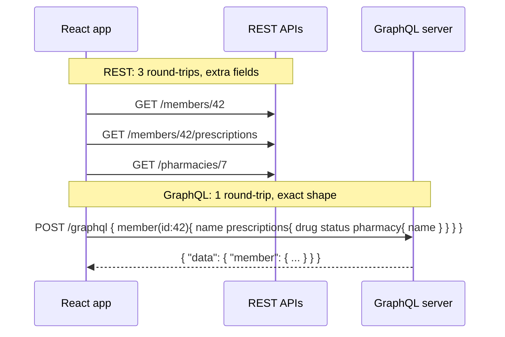
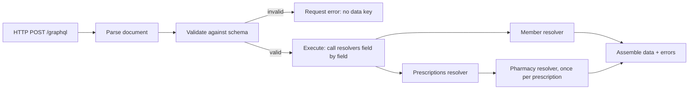

# GraphQL Fundamentals vs REST

!!! abstract "Key takeaways"
    - GraphQL is a **query language and runtime** for APIs: one endpoint, a **strongly typed schema**, and **clients ask for exactly the fields they need**.
    - Three operation types: **query** (read), **mutation** (write, executed serially at the top level), **subscription** (server push, usually over WebSocket).
    - It solves REST's **over-fetching, under-fetching and N round-trips**, and it's a great **aggregation layer** over many backends.
    - It costs you **HTTP caching** (mostly POST, one URL), **N+1 risk**, **query cost/abuse risk**, and **field errors that come back as HTTP 200** with an `errors` array next to partial `data`.
    - Typical fit: **BFF / aggregation layer** for UIs with varied data needs. REST still fits simple resource APIs, file transfer and public cacheable APIs.

## Why it matters

The GraphQL Consumer Service I owned on the OptumRx Meteor project (at Publicis Sapient) sits between 5 upstream systems and multiple downstream consumers, so "why GraphQL?" is likely the first question about it. You need a crisp, balanced answer.

## Core concepts

### One request instead of many


*Notice that the round-trips move from the client (over a mobile network) to the server (inside the data centre), and the client gets exactly the shape it asked for.*

{ loading=lazy }
*Notice that every key in the response matches a field the client selected, at the same depth. Fields that exist in the schema but weren't asked for never reach the client.*

### The type system (SDL)

```graphql
scalar DateTime

enum RxStatus { CREATED APPROVED SHIPPED CANCELLED }

interface Node { id: ID! }

type Member implements Node {
  id: ID!
  name: String!
  prescriptions(status: RxStatus, first: Int = 10, after: String): PrescriptionConnection!
}

type Prescription implements Node {
  id: ID!
  drugName: String!
  status: RxStatus!
  pharmacy: Pharmacy          # nullable: the pharmacy service may be down
  updatedAt: DateTime!
}

type Pharmacy implements Node { id: ID!, name: String! }

# Relay-style cursor pagination
type PrescriptionConnection { edges: [PrescriptionEdge!]!, pageInfo: PageInfo! }
type PrescriptionEdge { node: Prescription!, cursor: String! }
type PageInfo { hasNextPage: Boolean!, hasPreviousPage: Boolean!, startCursor: String, endCursor: String }

type UserError { field: [String!], message: String! }

type Query {
  member(id: ID!): Member
  node(id: ID!): Node
}

input CancelPrescriptionInput { prescriptionId: ID!, reason: String }

type CancelPrescriptionPayload { prescription: Prescription, errors: [UserError!]! }

type Mutation {
  cancelPrescription(input: CancelPrescriptionInput!): CancelPrescriptionPayload!
}

type Subscription {
  prescriptionStatusChanged(memberId: ID!): Prescription!
}
```

| Building block | Purpose |
|---|---|
| Object types, fields | The graph's shape |
| Scalars | `Int`, `Float`, `String`, `Boolean`, `ID` + custom (`DateTime`) |
| `!` (non-null) | A guarantee to clients; a null in a non-null field bubbles up to the nearest nullable parent |
| Enums, interfaces, unions | Polymorphism and constrained values |
| Input types | Structured arguments for mutations |
| Directives | Built-in: `@include`, `@skip`, `@deprecated`, `@specifiedBy`, and `@oneOf` (added in the September 2025 spec). Custom ones (e.g. `@auth`) are defined by you or your framework |
| Introspection | The schema is queryable (`__schema`, `__type`, `__typename`), which powers tooling, codegen and GraphiQL |

### How a request executes


*Notice the two failure classes: a **request error** (parse or validation) stops before execution and returns no `data`, while a **field error** during execution returns partial `data` plus an `errors` entry with a `path`. The per-prescription pharmacy call is where N+1 comes from.*

Every field has a **resolver** (GraphQL Java calls it a `DataFetcher`). If you don't write one, the default resolver reads a property of the same name from the parent object.

### Operations

```graphql
query MemberDashboard($id: ID!, $withPharmacy: Boolean!) {
  member(id: $id) {
    name
    prescriptions(first: 5) {
      edges { node { ...RxSummary  pharmacy @include(if: $withPharmacy) { name } } }
    }
  }
}

fragment RxSummary on Prescription { id drugName status }
```

- **Variables** keep queries static (cacheable, persisted, safe from injection).
- **Fragments** reuse field selections (each React component declares its data needs).
- **Aliases** fetch the same field twice with different args.
- **Mutations** run top-level fields **serially**, in document order. Only the top level is serial: the selection set under each mutation field resolves like a query. Query fields may resolve **in parallel** (the spec allows it; whether they actually do depends on the server, e.g. GraphQL Java runs them concurrently only when resolvers return `CompletableFuture`/`Mono`).

### Response format

```json
{
  "data": { "member": { "name": "A. Patel", "prescriptions": { "edges": [ { "node": { "pharmacy": null } } ] } } },
  "errors": [ { "message": "Pharmacy service unavailable", "path": ["member","prescriptions","edges",0,"node","pharmacy"],
               "extensions": { "classification": "INTERNAL_ERROR" } } ]
}
```

*Partial data + errors is normal in GraphQL. That's why field nullability is a design decision.*

{ loading=lazy }
*Notice the missing `data` key on the left: a client that only checks the HTTP status sees 200 in both cases.*

### GraphQL vs REST

| Aspect | REST | GraphQL |
|---|---|---|
| Endpoints | Many resource URLs | Usually one `/graphql` |
| Data shape | Server-defined | Client-defined |
| Over/under-fetching | Common | Solved on the wire (the server can still over-fetch from its backends) |
| HTTP caching | Natural (GET + URLs + ETags) | Harder; needs persisted queries/GET or app-level caching |
| Versioning | `/v2` URLs | Evolve the schema; `@deprecated` fields |
| Errors | HTTP status codes | Field errors: 200 + `errors[]` + partial data. Parse/validation errors: 200 with legacy `application/json`, 4xx with `application/graphql-response+json`. Transport/auth failures: 4xx/5xx |
| File upload / streaming | Simple | Awkward (multipart spec, or use REST) |
| Tooling | OpenAPI | Introspection, codegen, GraphiQL |
| Risks | Chatty clients | Expensive queries, N+1, auth per field |

## In practice: code & configuration

Minimal Spring for GraphQL controller (schema lives in `src/main/resources/graphql/*.graphqls`):

```java
@Controller
class MemberController {
    private final MemberClient memberClient;
    private final PrescriptionClient prescriptionClient;

    MemberController(MemberClient memberClient, PrescriptionClient prescriptionClient) {
        this.memberClient = memberClient;
        this.prescriptionClient = prescriptionClient;
    }

    @QueryMapping                       // Query.member (field name = method name)
    Member member(@Argument String id) {
        return memberClient.findById(id);
    }

    // Member.prescriptions: the return type must match the schema's PrescriptionConnection
    // (a record with edges + pageInfo). The parent type is inferred from the first parameter.
    @SchemaMapping(typeName = "Member", field = "prescriptions")
    PrescriptionConnection prescriptions(Member member, @Argument RxStatus status,
                                         @Argument int first, @Argument String after) {
        return prescriptionClient.findByMember(member.id(), status, first, after);
    }

    @MutationMapping                    // Mutation.cancelPrescription
    CancelPrescriptionPayload cancelPrescription(@Argument CancelPrescriptionInput input) {
        return prescriptionClient.cancel(input);
    }
}
```

`@QueryMapping`, `@MutationMapping` and `@SubscriptionMapping` are shortcuts for `@SchemaMapping` with `typeName` set to `Query`, `Mutation` or `Subscription`. `@Argument` binds a named GraphQL argument to a Java object (`ID` binds to `String`, an `input` type to a record or POJO).

The most common mistake on a first GraphQL service is resolving a nested field one parent at a time:

=== "❌ Common mistake"
    ```java
    // Prescription.pharmacy: called once PER prescription.
    // 50 prescriptions on the page = 50 calls to the pharmacy service (N+1).
    @SchemaMapping(typeName = "Prescription", field = "pharmacy")
    Pharmacy pharmacy(Prescription rx) {
        return pharmacyClient.findById(rx.pharmacyId());
    }
    ```

=== "✅ Correct approach"
    ```java
    // Called ONCE with every Prescription collected for this level of the query.
    // Spring registers a DataLoader behind the scenes.
    @BatchMapping(typeName = "Prescription", field = "pharmacy")
    Map<Prescription, Pharmacy> pharmacy(List<Prescription> prescriptions) {
        Set<String> ids = prescriptions.stream()
                .map(Prescription::pharmacyId).collect(Collectors.toSet());
        Map<String, Pharmacy> byId = pharmacyClient.findByIds(ids);   // one upstream call
        Map<Prescription, Pharmacy> result = new HashMap<>();
        for (Prescription rx : prescriptions) {
            Pharmacy pharmacy = byId.get(rx.pharmacyId());
            if (pharmacy != null) {
                result.put(rx, pharmacy);
            }
        }
        return result;
    }
    ```

The N+1 page covers DataLoader in depth; here it is enough to know that the flexible query shape is what makes this problem easy to create.

React client (shown with Apollo Client; the same query works with any GraphQL client, including a plain `fetch` wrapped in React Query):

```tsx
const MEMBER_DASHBOARD = gql`
  query MemberDashboard($id: ID!) { member(id: $id) { name prescriptions(first: 5) { edges { node { id drugName status } } } } }
`;
function Dashboard({ id }: { id: string }) {
  const { data, loading, error } = useQuery(MEMBER_DASHBOARD, { variables: { id } });
  if (loading) return <Spinner />;
  if (error) return <ErrorBanner error={error} />;
  return <RxList items={data.member.prescriptions.edges.map((e: any) => e.node)} />;
}
```

## Real-world usage

- **Facebook** created GraphQL (2012, open-sourced 2015) for mobile clients on slow networks. **GitHub, Shopify, Netflix and Airbnb** expose or run large GraphQL APIs.
- **Netflix** runs a federated graph built from many Domain Graph Services (DGS), each owned by a domain team, behind a gateway. Its DGS framework for Spring Boot is open source.
- **GitHub** kept its REST API alongside the GraphQL one. That is the usual outcome: GraphQL for flexible, UI-driven reads, REST for simple, cacheable or file-oriented endpoints.
- **Healthcare portals** aggregate member, claims, pharmacy and benefits backends behind one graph, so each UI screen gets its data in one call.

## Trade-offs & production gotchas

| Option | Pros | Cons | Use when |
|---|---|---|---|
| REST | HTTP caching, simple, universal tooling, easy per-endpoint rate limits | Over/under-fetching, a new endpoint per screen, versioning | Simple resource APIs, public cacheable APIs, file transfer |
| REST BFF per client | Tailored payloads, cacheable, simple to secure | One BFF per client type, duplicated aggregation logic | One or two clients with stable screens |
| GraphQL | Client-shaped responses, one round-trip, typed schema, additive evolution | N+1, query cost control, field-level auth, harder HTTP caching, 200-with-errors monitoring | Several clients with different data needs over many backends |
| gRPC | Fast binary protocol, streaming, strict contracts | Not browser-native, payload not human-readable | Internal service-to-service calls |

!!! warning "Gotchas"
    - Without DataLoader, nested fields cause **N+1 backend calls**.
    - Without depth/complexity limits, a single query can **DoS** your backends.
    - **HTTP 200 with errors** breaks naive monitoring. Track `errors[]` separately (error rate per operation name and per field).
    - A **non-null field backed by a flaky upstream** turns one upstream failure into a null parent, or a null `data`. Decide nullability per field.
    - Clients must **name their operations**. Without operation names you can't attribute traffic, errors or latency to a screen.
    - Field-level **authorization** is required. One endpoint doesn't mean one permission check.
    - Don't make GraphQL a thin 1:1 mirror of REST services. Design the schema around client use cases.

## How this connects to my experience

- **Where I used it:** Publicis Sapient, project OptumRx Meteor: "Owned the GraphQL Consumer Service end-to-end, acting as the integration layer between 5 upstream systems and multiple downstream consumers". On the same project I "built the ReactJS application from the ground up and established a micro-frontend architecture"; whether that React app is one of the GraphQL service's consumers is *[confirm]*.
- **Talking points:**
    - Why GraphQL: multiple downstream consumers with different data needs, and one integration layer aggregating 5 upstream systems, on a platform serving 750K+ users. Fewer round-trips per screen is the expected benefit *[confirm it was a stated goal, and any measured numbers]*.
    - What GraphQL cost us and how we handled it. The resume backs up the Redis caching ("Redis-based caching for frequently accessed queries and UI reference data") and OAuth2 with PingFederate and Active Directory. N+1 batching with DataLoader and field-level authorization checks are *[confirm]*.
    - Framework: Spring for GraphQL or Netflix DGS *[confirm]*. Client library on the React side (Apollo Client, React Query, other) *[confirm]*.
- **Likely follow-up chain:** "Why GraphQL over REST or a BFF?" → "How did you handle errors from one upstream?" → "N+1?" → "Caching?" → "Security?"

## Interview questions

### Fundamentals

??? question "Q1. What problems does GraphQL solve compared to REST?"
    **Answer:** Over-fetching (fields you don't need), under-fetching (multiple calls per screen), and API versioning churn. It adds a typed contract with introspection and lets clients evolve independently, because a new screen can often be built from existing fields with no backend release. It's especially strong as an aggregation layer over many backends. It is not free: you take on N+1, query cost control, field-level authorization and weaker HTTP caching.

    **Interviewer listens for:** Over- and under-fetching named explicitly, the typed schema as a contract, and at least one cost mentioned without being asked.

    **Common wrong answer:** "GraphQL is faster than REST" or "GraphQL replaces REST". It moves the round-trips to the server; it doesn't make the backends faster.

??? question "Q2. Query vs mutation vs subscription?"
    **Answer:** A query reads data, and its fields can resolve in parallel. A mutation changes data, and top-level mutation fields execute serially in document order, so two mutations in one request can't race each other. The request is not a transaction, though: if the second mutation fails, the first is not rolled back. A subscription is a long-lived stream of results pushed by the server, usually over WebSocket (the `graphql-transport-ws` subprotocol from the graphql-ws library) or Server-Sent Events. The serial/parallel difference is the only execution difference; nothing in GraphQL stops a query resolver from writing, it's a convention.

    **Interviewer listens for:** Serial execution applies to top-level mutation fields only, no transactional guarantee, and a transport named for subscriptions.

    **Common wrong answer:** "Queries are GET and mutations are POST", or "multiple mutations in one request are atomic".

??? question "Q3. What does `!` mean, and what happens if a non-null field resolves to null?"
    **Answer:** `!` is non-null. If a non-null field resolves to null or throws, the error is recorded and the null propagates to the nearest nullable parent, which can wipe out a large part of the response. If every ancestor is non-null, the whole `data` becomes null. In a list, `[Prescription!]` loses the whole list when one item fails, while `[Prescription]` loses only that item. Use non-null for fields you can always produce (ids, fields from the same row), and nullable for fields backed by a separate or unreliable upstream. Also remember that making a non-null output field nullable later is a breaking change, while the reverse is safe.

    **Interviewer listens for:** Null propagation ("bubbling"), the list cases, and nullability treated as a resilience decision.

    **Common wrong answer:** "Make everything non-null so the client doesn't need null checks."

??? question "Q4. How are errors returned in GraphQL?"
    **Answer:** There are two classes. A **request error** (the document doesn't parse or fails validation) happens before execution, and the response has `errors` and no `data`. A **field error** happens during execution: the field becomes null, an entry with `message`, `path`, `locations` and optional `extensions` is added to `errors`, and the rest of `data` is still returned. Over HTTP, field errors come back as 200. Request errors come back as 200 with the legacy `application/json` media type and as 4xx with `application/graphql-response+json`, which is what the GraphQL over HTTP spec defines and what Spring for GraphQL prefers by default. Authentication failures and malformed JSON are plain 4xx. Expected business failures ("prescription already shipped") are better modelled in the schema as a payload `errors` field or a union result type, so clients get typed, documented errors.

    **Interviewer listens for:** Partial data, `path` and `extensions`, the request-error vs field-error split, and schema-modelled business errors.

    **Common wrong answer:** "GraphQL always returns 200" (not true for transport failures or the newer media type), or returning stack traces in `message`.

??? question "Q5. What is a resolver, and how does the server execute a query?"
    **Answer:** The server parses the document, validates it against the schema (unknown fields, wrong argument types and so on are rejected before any code runs), then executes it. Execution walks the selection set from the root type. Each field has a resolver, which receives the parent object, the arguments and a context, and returns a value. For an object value the server recurses into its child fields; for scalars it serialises the value. Fields without an explicit resolver use a default one that reads the property of the same name from the parent. In Spring for GraphQL, resolvers are `@SchemaMapping` methods (`@QueryMapping` is a shortcut for the `Query` type), registered as GraphQL Java `DataFetcher`s.

    **Interviewer listens for:** Parse, validate, execute. One resolver per field, parent object passed down, default property resolver.

    **Common wrong answer:** "One resolver per query that returns the whole JSON", which loses the point of field-level resolution and leads to over-fetching on the server.

### Intermediate

??? question "Q6. When would you NOT choose GraphQL?"
    **Answer:** Simple CRUD services with one client, public APIs relying on HTTP/CDN caching, file uploads and downloads, high-throughput service-to-service calls (gRPC fits better), or teams without capacity to handle query cost, security and N+1. Also when clients are untrusted third parties and you can't use persisted queries, because arbitrary queries are harder to rate-limit than fixed endpoints.

    **Interviewer listens for:** A balanced view with concrete cases, and an operational cost argument, not only a technical one.

    **Common wrong answer:** "Never, GraphQL is always better."

??? question "Q7. What are fragments and why do React apps use them?"
    **Answer:** Reusable field selections on a type. Components co-locate their data requirements as fragments, and the page query composes them. This keeps components and data needs in sync (Relay and Apollo patterns): removing a component removes its fields from the query. Inline fragments (`... on Pharmacy { name }`) select fields by concrete type on interfaces and unions, usually together with `__typename`.

    **Interviewer listens for:** Co-location, composition into one query, inline fragments for polymorphic types.

    **Common wrong answer:** Confusing fragments with variables, or thinking fragments are a server-side feature that needs resolver code.

??? question "Q8. How do you version a GraphQL API?"
    **Answer:** Usually you don't version the endpoint. Evolve the schema additively, mark old fields `@deprecated(reason: ...)`, monitor field usage, then remove after clients migrate. Breaking changes need a new field or type name. Know what counts as breaking: removing or renaming a field, changing a field's type, making an output field nullable, adding a required argument or required input field, and removing an enum value. Adding fields, types, optional arguments and (with care) enum values is safe. Run a schema diff check in CI so breaking changes fail the build.

    **Interviewer listens for:** Additive evolution, `@deprecated`, usage data before removal, a concrete list of breaking changes.

    **Common wrong answer:** "Expose `/graphql/v2`", or assuming any schema change is safe because clients select their own fields.

??? question "Q9. Why is HTTP caching hard with GraphQL, and what do you do instead?"
    **Answer:** Requests are normally POSTs to one URL with the query in the body, so CDNs and browser caches have no URL to key on, and one response mixes data with different lifetimes. The options are layered. On the client, a normalised cache (Apollo Client, Relay) stores objects by `__typename` + `id`. At the edge, persisted queries (the client sends a hash of a registered query) sent as GET make responses CDN-cacheable for public data. On the server, cache at the resolver or upstream-call level, for example in Redis, where each backend's data has its own TTL, and use DataLoader for per-request de-duplication. For per-user data, server-side caching is usually the practical layer.

    **Interviewer listens for:** The POST/single-URL reason, and at least two layers (client normalised cache, persisted queries, resolver-level cache).

    **Common wrong answer:** "GraphQL can't be cached", or treating DataLoader as a cross-request cache (it is per request).

### Senior

??? question "Q10. GraphQL vs a REST BFF for a multi-backend UI: how do you decide?"
    **Answer:** A BFF per client is simple and cacheable, but needs a new endpoint per screen and duplicates logic across BFFs. GraphQL gives one flexible graph for many clients, with typed contracts and less endpoint churn, but needs governance, cost limits and batching. I look at the number of distinct consumers, how often screens change, how many backends are aggregated, and whether the team can own the operational side (query limits, per-field auth, monitoring by operation name). With multiple consumers and many backends (like the 5 upstreams behind my service), GraphQL usually wins. With one client and stable screens, a REST BFF is cheaper. A GraphQL server is itself a BFF pattern; the question is really fixed endpoints vs a queryable schema.

    **Interviewer listens for:** Decision criteria, not a preference. Ownership and governance cost acknowledged.

    **Common wrong answer:** Picking one on technical fashion without tying it to consumers, change rate and team capacity.

??? question "Q11. How do subscriptions scale?"
    **Answer:** They're stateful, long-lived connections, so each instance holds its own set of clients. Scale horizontally with a pub/sub backbone (Kafka or Redis) so that an event reaches every instance and each one pushes to the clients connected to it. With Kafka that means each instance must see every event, so instances can't share one consumer group for this fan-out. A WebSocket stays on the instance that accepted it, so you don't need sticky sessions for the socket itself, but you do need load balancer idle timeouts and keep-alive pings set correctly, connection limits per instance, graceful draining on deploy (clients reconnect and resubscribe), authentication on connection init, and handling of tokens that expire mid-connection. Consider SSE, or polling for low-frequency updates, which is far simpler to operate.

    **Interviewer listens for:** Statefulness, the broadcast-to-all-instances problem, auth at connect time, reconnect behaviour, and willingness to choose polling.

    **Common wrong answer:** "Just add more pods", ignoring that an event arrives at one instance while the subscriber is connected to another.

??? question "Q12. A single endpoint accepts arbitrary queries. How do you protect the service?"
    **Answer:** In layers. Limit query depth and complexity so one request can't fan out into thousands of backend calls (GraphQL Java ships `MaxQueryDepthInstrumentation` and `MaxQueryComplexityInstrumentation`). Enforce pagination limits on list fields. For first-party clients use persisted (allow-listed) queries so only known operations run. Set timeouts per upstream and for the whole request, and rate-limit by client and by operation cost, not only by request count. Authenticate at the transport (OAuth2 bearer token), then authorize at the field or type level, ideally in the service layer so every entry point gets the same check. Disable or restrict introspection in production for non-public APIs, knowing that this is hardening and not a control by itself. Batching with DataLoader keeps legitimate queries cheap.

    **Interviewer listens for:** Depth/complexity limits, persisted queries, field-level authorization, timeouts, and the point that hiding introspection alone is not security.

    **Common wrong answer:** "We sit behind an API gateway with rate limiting", which counts requests and misses that one request can be thousands of times more expensive than another.

### Scenario-based

??? question "Q13. A product team asks for a new screen needing data from 3 services. Walk through how GraphQL handles it."
    **Answer:** Check if the existing schema already covers it (often no backend change). Otherwise add fields or types to the schema designed around the use case, implement resolvers with DataLoader batching and timeouts per upstream, decide nullability for each upstream-backed field so one failing service degrades the screen instead of blanking it, add authorization rules, then update documentation and the contract tests. Check the change is additive with a schema diff. The front end composes fragments, names the operation so it shows up in monitoring, and ships independently.

    **Interviewer listens for:** Schema-first thinking, partial-failure design, batching, and backward compatibility.

    **Common wrong answer:** Adding one coarse field that returns a screen-specific blob, which recreates a REST endpoint inside the graph.

## Cheat sheet

| Concept | Remember |
|---|---|
| Strength | Client-shaped responses, one round-trip, typed contract |
| Weakness | HTTP caching, N+1, query cost, field auth |
| Mutations | Top-level fields run serially, not transactional |
| Errors | Field error: 200 + `errors[]` + partial data. Request error: no `data`, 4xx with `application/graphql-response+json` |
| Nullability | Nullable for unreliable upstream fields; a null in a `!` field bubbles to the nearest nullable parent |
| Execution | Parse → validate → execute; one resolver per field |
| Protection | Depth/complexity limits, persisted queries, field-level auth, timeouts |
| Evolution | Additive + `@deprecated`, no `/v2` |
| Java | Spring for GraphQL (`@QueryMapping`, `@SchemaMapping`, `@BatchMapping`), Netflix DGS, both built on GraphQL Java |

## Sources

1. [GraphQL Specification (September 2025)](https://spec.graphql.org/September2025/): type system, built-in directives, serial mutation execution, null propagation, response format. The [October 2021 edition](https://spec.graphql.org/October2021/) is the previous release.
2. [graphql.org: Learn](https://graphql.org/learn/): queries, schemas, execution, best practices.
3. [Spring for GraphQL reference](https://docs.spring.io/spring-graphql/reference/): annotated controllers (`@SchemaMapping`, `@BatchMapping`), and [server transports](https://docs.spring.io/spring-graphql/reference/transports.html) for media types, status codes, WebSocket and SSE.
4. [GraphQL over HTTP (draft spec)](https://graphql.github.io/graphql-over-http/draft/): `application/graphql-response+json` and status code rules.
5. [GitHub GraphQL API docs](https://docs.github.com/en/graphql): a large public GraphQL API example.
6. [Netflix Tech Blog: How Netflix Scales its API with GraphQL Federation (Part 1)](https://netflixtechblog.com/how-netflix-scales-its-api-with-graphql-federation-part-1-ae3557c187e2): Domain Graph Services and the federated gateway.
