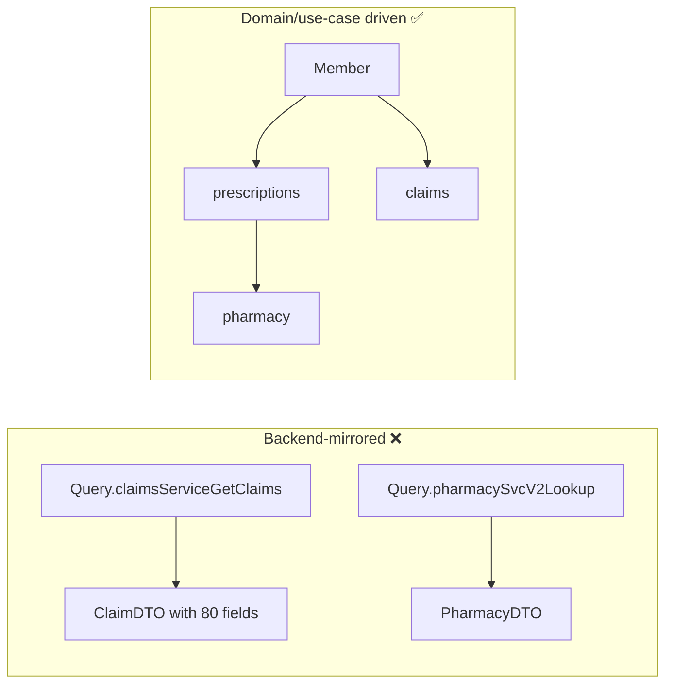

# GraphQL Schema Design Best Practices

!!! abstract "Key takeaways"
    - Design **from client use cases (demand-driven)**, not by mirroring backend services or database tables.
    - **Nullability is a contract**: non-null only when you can always deliver. Fields backed by flaky upstreams should be nullable.
    - **Pagination:** use Relay-style **cursor connections** (`edges`, `node`, `pageInfo`) for lists that can grow.
    - **Mutations:** one specific mutation per business action, with a single `input` argument and a **payload type** containing the result and user errors.
    - **Evolve, don't version:** additive changes, `@deprecated`, usage tracking, then removal.

## Why it matters

A schema is a long-lived public contract for every UI and consumer. Bad early decisions (everything non-null, unbounded lists, generic `updateX` mutations) become expensive to fix. As owner of a GraphQL integration layer that sits between upstream systems and several consumers, this is core design work for me.

## Core concepts

### Demand-driven vs backend-driven design


*Notice that the good schema models the domain graph clients navigate. Which service owns which field is an implementation detail hidden behind resolvers.*

### Naming and types

- Types: `PascalCase`. Fields and arguments: `camelCase`. Enums: `SCREAMING_SNAKE_CASE`.
- Use **specific custom scalars** (`DateTime`, `Email`, `Money`) and **enums** instead of free strings.
- Use `ID` for identifiers. Consider **global object IDs** + a `node(id:)` query for refetching (the Relay convention).
- Avoid booleans that will become states (`isActive` → `status: MemberStatus`).

### Nullability strategy

| Field | Recommendation | Why |
|---|---|---|
| `id`, required identifiers | Non-null | Always present |
| Data from a different upstream service | Nullable | Partial failure shouldn't null the parent |
| List fields | `[Item!]!` | The list exists (maybe empty); items aren't null |
| Arguments | Non-null when required | A missing required argument is rejected during validation, before any resolver runs |

!!! warning "Null bubbling"
    If `Member.pharmacy: Pharmacy!` fails, the error is recorded in `errors` and null propagates to the nearest **nullable** ancestor. Here that is `member`, so the whole member disappears from the response. If every ancestor is non-null, `data` itself becomes `null`. Making `pharmacy` nullable keeps the rest of the screen working.

### Pagination

```graphql
type PrescriptionConnection {
  edges: [PrescriptionEdge!]!
  pageInfo: PageInfo!
  totalCount: Int          # optional: can be expensive
}
type PrescriptionEdge { cursor: String!  node: Prescription! }
type PageInfo { hasNextPage: Boolean!  hasPreviousPage: Boolean!  startCursor: String  endCursor: String }

type Member {
  prescriptions(first: Int = 20, after: String, filter: PrescriptionFilter): PrescriptionConnection!
}
```

- **Cursor** (opaque, e.g. base64 of a sort key + id) is stable under inserts. **Offset** is simpler but skips or duplicates rows when data changes.
- Enforce a **max `first`** (e.g. 100) to bound cost.
- The Relay spec defines forward (`first`/`after`) and backward (`last`/`before`) arguments. Supporting only forward pagination is acceptable if clients never page backwards.
- A cursor is only stable if the sort is **deterministic**, so always add a unique tie-breaker (e.g. `updatedAt, id`).

### Mutation design

```graphql
input UpdateDeliveryAddressInput {
  prescriptionId: ID!
  address: AddressInput!
  clientMutationId: String          # optional correlation ID (legacy Relay convention)
}

type UpdateDeliveryAddressPayload {
  prescription: Prescription        # updated object → the client cache refreshes
  userErrors: [UserError!]!          # validation/business errors as data
}

type UserError { field: [String!], message: String!, code: UserErrorCode! }

type Mutation {
  updateDeliveryAddress(input: UpdateDeliveryAddressInput!): UpdateDeliveryAddressPayload!
}
```

- Name mutations as **verbs for business actions** (`cancelPrescription`, `approveRefill`), not CRUD (`updatePrescription(status: ...)`).
- **Expected business errors are data** (`userErrors`, or union results like `CancelResult = CancelSuccess | NotCancellable`). Unexpected failures go in top-level `errors`.
- `clientMutationId` is only echoed back for correlation. It does **not** make a mutation idempotent. For real idempotency the server must store and de-duplicate on an idempotency key.
- Top-level mutation fields run **serially**, in the order written. Fields inside a payload resolve in parallel like any query.

### Evolution and deprecation

```graphql
type Prescription {
  drugName: String! @deprecated(reason: "Use medication.name; removal after 2027-01-31")
  medication: Medication!
}
```

`@deprecated` can be applied to fields, enum values, arguments and input fields (the last two since the October 2021 spec). A **required** argument or input field cannot be deprecated: make it optional or give it a default first.

Process: add the new field → deprecate the old one → measure field usage (operation logs/metrics) → notify consumers → remove when usage is zero. Run **schema checks in CI** (e.g. `graphql-inspector`, Apollo/Hive schema checks) to block breaking changes.

## In practice: code & configuration

=== "❌ Common mistake"
    ```graphql
    type Query {
      getAllPrescriptions: [Prescription]          # unbounded, nullable mess
    }
    type Mutation {
      updatePrescription(id: ID!, status: String, address: String, notes: String): Prescription
      # generic CRUD, stringly typed, no error model
    }
    ```

=== "✅ Correct approach"
    ```graphql
    type Query {
      member(id: ID!): Member
    }
    type Member {
      prescriptions(first: Int = 20, after: String, status: RxStatus): PrescriptionConnection!
    }
    type Mutation {
      cancelPrescription(input: CancelPrescriptionInput!): CancelPrescriptionPayload!
      updateDeliveryAddress(input: UpdateDeliveryAddressInput!): UpdateDeliveryAddressPayload!
    }
    ```

Spring for GraphQL has built-in cursor pagination support (`ScrollSubrange`, `Window`):

```java
@SchemaMapping(typeName = "Member", field = "prescriptions")
Window<Prescription> prescriptions(Member member, ScrollSubrange subrange) {
    ScrollPosition position = subrange.position().orElse(ScrollPosition.offset());
    Limit limit = Limit.of(subrange.count().orElse(20));
    return repo.findByMemberIdOrderByUpdatedAtDesc(member.id(), position, limit); // Spring Data scrolling
}
// The Boot starter registers ConnectionTypeDefinitionConfigurer, which generates the
// PrescriptionConnection / PrescriptionEdge / PageInfo types if the schema doesn't declare them.
// A ConnectionFieldTypeVisitor then adapts the returned Window (or Slice) into edges/pageInfo/cursors.
```

!!! note "Offset vs keyset in Spring Data"
    `ScrollPosition.offset()` gives you connection-**shaped** results, but the cursor is still an encoded offset, so it has the same instability under writes as offset pagination. Use `ScrollPosition.keyset()` as the default for true keyset (seek) pagination. Keyset scrolling needs a deterministic sort and is supported by the JPA and MongoDB modules. Also clamp `count` yourself (e.g. `Math.min(count, 100)`), because nothing enforces a maximum page size for you.

## Real-world usage

- **GitHub's** public schema is a reference for Relay connections, global IDs and mutation payloads.
- **Shopify** popularised `userErrors` in mutation payloads.
- **Common failure mode:** a field is made non-null "because it's always there". Then an upstream outage nulls whole lists in the app, and the fix is to relax nullability (itself a breaking change for typed clients).
- **Healthcare relevance:** a member screen usually aggregates several upstream systems. Nullable upstream-backed fields let the screen render partial data instead of failing completely when one system is down.

## Trade-offs & production gotchas

| Decision | Option A | Option B |
|---|---|---|
| Pagination | Cursor (stable, scalable) | Offset (simple, unstable under writes) |
| Errors | `userErrors` / unions (typed) | Top-level errors (untyped, easy) |
| IDs | Global IDs (refetchable) | Raw DB IDs (simple, leak internals) |
| Total counts | Convenient | Expensive on big tables; make optional |

!!! warning "Gotchas"
    - Removing or renaming a field, changing nullability from nullable → non-null on an **argument** or non-null → nullable on an **output**, or removing enum values are **breaking**.
    - Overusing JSON scalars throws away GraphQL's type safety.
    - Exposing internal service names in the schema leaks architecture and blocks refactoring.

## How this connects to my experience

- **Where I used it:** OptumRx Meteor at Publicis Sapient, where I owned the GraphQL Consumer Service end-to-end as the integration layer between 5 upstream systems and multiple downstream consumers. How much of the schema I designed personally vs inherited: *[confirm]*
- **Talking points:**
    - How the domain graph hid upstream boundaries (member → prescriptions → pharmacy). *[confirm entities]*
    - Nullability choices for upstream-backed fields, i.e. partial results during an upstream outage. *[confirm]*
    - Pagination approach and deprecation process with downstream consumers. *[confirm]*
- **Likely follow-up chain:** "Show me a part of your schema" → "How did you handle an upstream being down?" → "How did you introduce breaking changes?"

## Interview questions

### Fundamentals

??? question "Q1. How do you decide if a field should be nullable?"
    **Answer:** Non-null is a promise the server can never take back, so I use it only when the server can always provide the value: IDs, fields stored on the same record, and list wrappers (`[T!]!`, because an empty list is a valid answer). Anything resolved from another service, anything optional in the domain, and anything behind authorization should be nullable, so that a failure costs one field instead of the parent object. Arguments are the opposite case: make them non-null whenever they are truly required, because validation then rejects bad requests before execution. I also consider evolution: nullable → non-null on an output is a safe change later, while non-null → nullable is breaking.

    **Interviewer listens for:** nullability as a contract; partial failure and null propagation; the `[T!]!` convention; the asymmetry between output fields and arguments.

    **Common wrong answer:** "Make everything non-null because it gives the client better types", or "non-null if the database column is NOT NULL".

??? question "Q2. What happens when a resolver for a non-null field throws or returns null?"
    **Answer:** The error is added to the top-level `errors` array with a `path`. Because the field cannot be null, the null propagates to the parent. If the parent is also non-null, it keeps going up until it reaches a nullable field, or `data` itself becomes `null`. Sibling fields that resolved successfully under the nulled ancestor are discarded. Inside a list, `[Item!]` nulls the whole list when one item fails, while `[Item]` nulls only that item. The response is still HTTP 200 with partial `data` plus `errors`, so clients must check both.

    **Interviewer listens for:** propagation to the nearest nullable ancestor; loss of sibling data; list item behaviour; partial responses with `data` and `errors` together.

    **Common wrong answer:** "The whole request fails", or "only that field is null".

??? question "Q3. Cursor vs offset pagination?"
    **Answer:** Offset (`limit`/`offset`) is simple and allows jumping to page N, but it skips or duplicates rows when data is inserted or deleted between requests, and deep pages are slow because the database still scans and discards the skipped rows. Cursor pagination uses an opaque cursor that encodes the sort key plus a unique tie-breaker, so the next page is a `WHERE (sortKey, id) < (?, ?)` index seek: stable under writes and constant cost at any depth. The costs are no random page access, and the cursor is tied to one sort order. The Relay connection spec standardises the shape (`edges`, `node`, `cursor`, `pageInfo`, `first`/`after`, `last`/`before`). I use connections for any list that can grow and always cap `first`.

    **Interviewer listens for:** stability and deep-page cost; opaque cursors; a deterministic sort with a tie-breaker; a maximum page size; awareness that a cursor wrapping an offset gains none of these benefits.

    **Common wrong answer:** "Cursors are just base64 offsets", or presenting cursors as free of trade-offs (no jump-to-page, `totalCount` still costs a count query).

### Intermediate

??? question "Q4. How should mutations be designed?"
    **Answer:** One mutation per business action, named as a verb (`cancelPrescription`), instead of a generic `updateX` with many optional arguments. It takes a single non-null `input` object, which makes it easy to evolve and to pass as one variable. It returns a dedicated payload type containing the affected objects (so normalised client caches update without a refetch) and typed business errors. I make the payload's object fields nullable, because they are absent when the action fails. Top-level mutation fields execute serially, but there is no transaction across them, so one business action should be one mutation. For retries I use a server-enforced idempotency key. `clientMutationId` only correlates the request and the response.

    **Interviewer listens for:** intent-based naming; input and payload types; returning the mutated object; serial execution; idempotency under retry.

    **Common wrong answer:** returning `Boolean` or just an ID; one CRUD-style `update` mutation with every field optional; assuming several mutations in one request are atomic.

??? question "Q5. How do you model business errors?"
    **Answer:** I separate two categories. Expected, domain-level outcomes (validation failed, not cancellable, out of stock) are part of the schema: either a `userErrors: [UserError!]!` list in the payload with `field`, `message` and an enum `code`, or a union result such as `CancelSuccess | NotCancellable`. Clients can then handle them exhaustively with generated types, and they are discoverable through introspection. Unexpected failures (upstream timeout, bug, unauthenticated) go in top-level `errors`, with a machine-readable `extensions.code` so clients don't parse messages. `userErrors` is simpler and is the additive choice. Unions are more type-safe, but adding a new member can break clients that have no fallback case.

    **Interviewer listens for:** errors-as-data vs top-level errors; `extensions` for classification; the trade-off between `userErrors` and unions; not leaking stack traces or internal messages.

    **Common wrong answer:** "Throw an exception and let the client read `errors[0].message`", or using HTTP status codes for business errors.

??? question "Q6. Which schema changes are breaking?"
    **Answer:** Breaking: removing or renaming a field, type, argument or enum value; changing a field's type; making an output field nullable (clients assumed it was always there); making an argument or input field non-null; adding a new required argument or input field without a default. Safe: adding types, fields, optional arguments, and making an output field non-null. There is a third category, **dangerous** changes, which are technically additive but can break at runtime: adding an enum value, a union member or an interface implementation (clients with exhaustive switches hit an unknown case), and changing an argument's default value. Tools such as GraphQL Inspector classify changes into these three groups.

    **Interviewer listens for:** the direction of nullability changes for outputs vs inputs; the "dangerous" category; using real usage data to decide whether a breaking change affects anyone.

    **Common wrong answer:** "Only removals are breaking", or getting the nullability direction backwards.

??? question "Q7. When do you use an interface, and when a union?"
    **Answer:** An interface is for types that share fields and that clients want to query uniformly, for example `interface Node { id: ID! }` or `interface Notification { id, createdAt }`. Clients select the common fields directly and use fragments for the rest. A union is for types with nothing meaningful in common, such as search results (`Member | Pharmacy | Prescription`) or mutation outcomes (`Success | NotCancellable`). On a union, clients must use inline fragments for everything except `__typename`. On the server both need type resolution (a `TypeResolver` in GraphQL Java, or class-name mapping in Spring for GraphQL). Neither can be used as an input type. For polymorphic input the spec now offers `@oneOf` input objects, where the tooling supports them.

    **Interviewer listens for:** shared contract vs unrelated alternatives; `__typename` and fragments; type resolution on the server; the output-only restriction.

    **Common wrong answer:** "They are interchangeable", or one big type with many nullable fields plus a `type` enum.

### Senior

??? question "Q8. GraphQL has no `/v2`. How do you ship a breaking change?"
    **Answer:** By continuous evolution on a single endpoint. Because clients select fields explicitly, I can add the replacement alongside the old field without affecting anyone:

    1. Add the new field or type.
    2. Mark the old one `@deprecated` with a reason and a removal date.
    3. Measure usage per field and per client, which requires clients to identify themselves (client name/version headers) and field-level metrics or operation logs.
    4. Notify the owning teams and help them migrate.
    5. Remove only when usage is zero, or after an agreed window for clients I can't force to upgrade, such as old mobile app versions.

    CI schema checks compare the proposed schema against the current one, and ideally against real or registered operations, so a breaking change fails the build unless it is explicitly approved. If a field's semantics must change, I add a new field with a new name and don't change the meaning in place.

    **Interviewer listens for:** add → deprecate → measure → remove; usage data as the gate; client identification; long-lived mobile clients; CI enforcement.

    **Common wrong answer:** "Put a version in the URL or in field names (`memberV2`) by default", or "deprecate it and remove it next sprint" with no usage data.

??? question "Q9. How do you govern a schema shared by many teams?"
    **Answer:** With clear ownership and automation. Each domain area has an owning team (code owners on schema files, or subgraph ownership in federation). A short written style guide covers naming, nullability, pagination, the error model and mutation shape, and a linter enforces what it can. Schema changes get a lightweight design review that includes consumer teams. CI runs breaking-change checks against the published schema and against known client operations. A schema registry (Apollo GraphOS, Hive, WunderGraph Cosmo) is the source of truth and provides field usage analytics. Deprecations follow a policy with dates. The aim is one coherent graph, not a set of per-team schemas glued together.

    **Interviewer listens for:** ownership; written conventions plus linting; CI checks against real operations; usage analytics; a deprecation policy; consumer involvement.

    **Common wrong answer:** "One central team writes all schema changes" (a bottleneck), or "each team adds what it needs" (an inconsistent graph).

??? question "Q10. Should the schema mirror your microservices?"
    **Answer:** No. Clients care about the domain graph, not service boundaries. Mirroring leaks architecture, forces clients to join data themselves across several queries, and makes every backend refactoring a breaking API change. The schema should model entities and relationships as the product understands them, and resolvers (or the federation layer) map fields onto services. The same applies to database tables and upstream DTOs: don't expose 80 pass-through fields because they exist. Expose what a use case needs, with domain names. The limit on "demand-driven" is that I don't build one field per screen either, because that gives a view-specific schema that can't be reused.

    **Interviewer listens for:** domain graph vs service topology; resolvers as an anti-corruption layer; avoiding both extremes (backend-mirrored and screen-specific).

    **Common wrong answer:** "Yes, one root field per service keeps ownership clear", or generating the schema directly from JPA entities or upstream DTOs.

??? question "Q11. How do you deprecate a field and know when it is safe to remove?"
    **Answer:** Mark it `@deprecated(reason: "Use dispensedAt. Removal after 2026-12-31")` and add the replacement in the same release. Then **measure usage**: require named operations and a client name/version header, and record field usage per client (Apollo GraphOS, Hive, or your own instrumentation that walks the selection set). Contact the remaining clients, and only remove the field when usage is zero for an agreed window, including mobile app versions still in the wild. Schema checks in CI should block removal while operations still use it.

    **Interviewer listens for:** @deprecated with a reason and date, field-level usage per client, mobile long tail, CI schema checks.

    **Common wrong answer:** "Deprecate it and delete it next sprint." Old mobile versions keep sending the field for months.

### Scenario-based

??? question "Q12. Mobile needs `prescriptions` sorted differently from web. How do you design it?"
    **Answer:** Add an `orderBy: PrescriptionOrder` argument on the same connection field: an input with a `field` enum and a `direction` enum, with a default that preserves current behaviour (so the change is additive). I expose only sorts that have a supporting index, and always append a unique tie-breaker so pagination is deterministic. Cursors must encode the sort key they were created with, and the server should reject a cursor used with a different `orderBy`. I don't create separate fields per client (`mobilePrescriptions`) and don't accept a free-form sort string.

    **Interviewer listens for:** one field with arguments instead of per-client fields; an enum of supported sorts; index backing; cursor validity tied to sort order; a backward-compatible default.

    **Common wrong answer:** a separate field or endpoint per client, or `sort: String` passed through to the database.

## Cheat sheet

| Rule | Remember |
|---|---|
| Design | Demand-driven, domain graph |
| Nullability | Nullable for independently failing data |
| Lists | `[T!]!` + cursor connections + max page size |
| Null propagation | Error in a non-null field nulls the nearest nullable ancestor |
| Mutations | Verb, single `input`, payload with `userErrors` |
| Evolution | Additive + `@deprecated` + usage tracking + CI checks |
| Breaking | Output non-null → nullable; argument nullable → non-null; removals/renames |
| Dangerous | New enum value, union member or interface implementation |

## Sources

1. [graphql.org: Best Practices](https://graphql.org/learn/best-practices/) and [Pagination](https://graphql.org/learn/pagination/): nullability, versioning by evolution and connection-style pagination.
2. [Relay: GraphQL Cursor Connections Specification](https://relay.dev/graphql/connections.htm): `edges`, `node`, `cursor`, `pageInfo` and the `first`/`after`/`last`/`before` arguments.
3. [GraphQL specification: Handling Field Errors](https://spec.graphql.org/October2021/#sec-Handling-Field-Errors): null propagation for non-null fields.
4. [Shopify: GraphQL Design Tutorial](https://github.com/Shopify/graphql-design-tutorial): business-action mutations, input/payload types and `userErrors`.
5. [Spring for GraphQL: Pagination](https://docs.spring.io/spring-graphql/reference/request-execution.html#execution.pagination) and [Subrange controller argument](https://docs.spring.io/spring-graphql/reference/controllers.html#controllers.schema-mapping.subrange): `ConnectionTypeDefinitionConfigurer`, `Window`/`Slice` adapters and `ScrollSubrange`.
6. [GitHub GraphQL API: schema reference](https://docs.github.com/en/graphql/reference): a public example of connections, global node IDs and mutation payloads.
