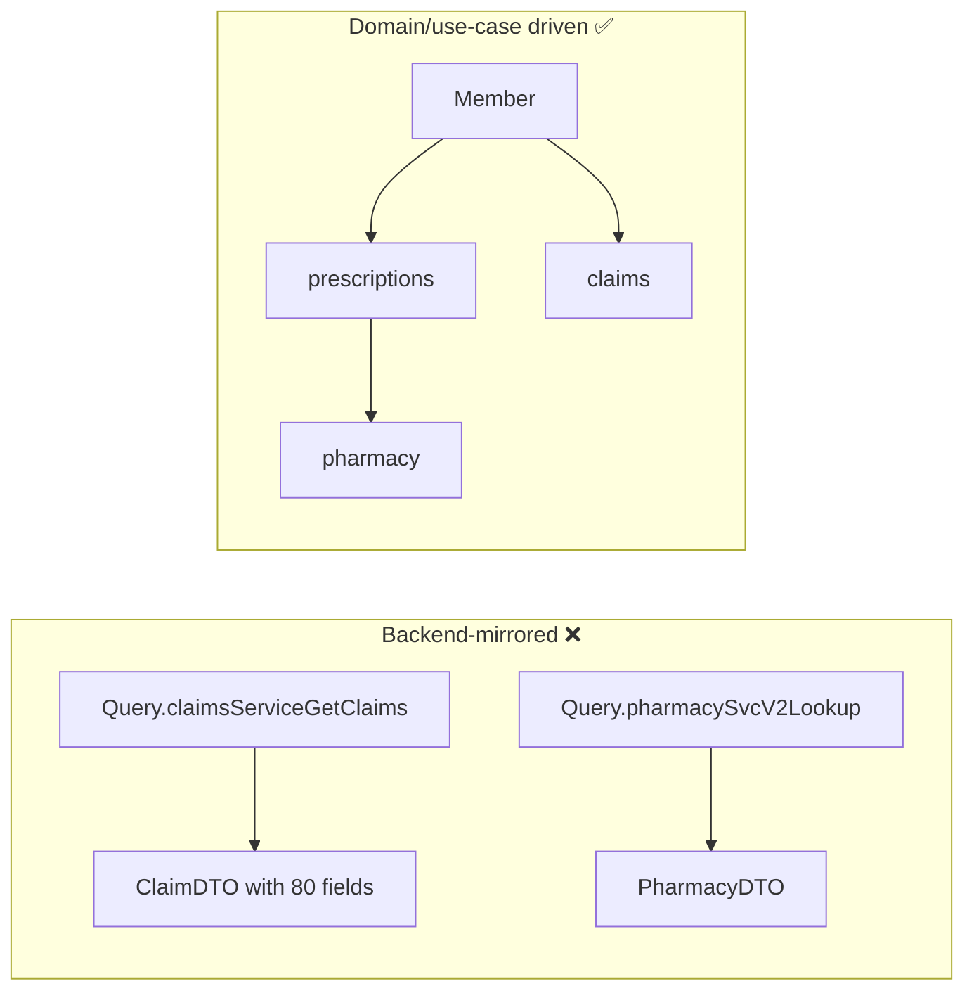

# GraphQL Schema Design Best Practices

!!! abstract "TL;DR"
    - Design **from client use cases (demand-driven)**, not by mirroring backend services or database tables.
    - **Nullability is a contract**: non-null only when you can always deliver. Fields backed by flaky upstreams should be nullable.
    - **Pagination:** use Relay-style **cursor connections** (`edges`, `node`, `pageInfo`) for lists that can grow.
    - **Mutations:** one specific mutation per business action, with a single `input` argument and a **payload type** containing the result and user errors.
    - **Evolve, don't version:** additive changes, `@deprecated`, usage tracking, then removal.

## Why it matters

A schema is a long-lived public contract for every UI and consumer. Bad early decisions (everything non-null, unbounded lists, generic `updateX` mutations) become expensive to fix. In my role as owner of the integration-layer schema, this is core design work.

## Core concepts

### Demand-driven vs backend-driven design


*Notice that the good schema models the domain graph clients navigate. Which service owns which field is an implementation detail hidden behind resolvers.*

### Naming and types

- Types: `PascalCase`. Fields and arguments: `camelCase`. Enums: `SCREAMING_SNAKE_CASE`.
- Use **specific custom scalars** (`DateTime`, `Email`, `Money`) and **enums** instead of free strings.
- Use `ID` for identifiers. Consider **global object IDs** + a `node(id:)` query for refetching (the Relay convention).
- Avoid booleans that will become states (`isActive` → `status: MemberStatus`).

### Nullability strategy

| Field | Recommendation | Why |
|---|---|---|
| `id`, required identifiers | Non-null | Always present |
| Data from a different upstream service | Nullable | Partial failure shouldn't null the parent |
| List fields | `[Item!]!` | The list exists (maybe empty); items aren't null |
| Arguments | Non-null when required | Validation at parse time |

!!! warning "Null bubbling"
    If `Member.pharmacy: Pharmacy!` fails, null propagates to `member`, and the whole member disappears from the response. Making `pharmacy` nullable keeps the rest of the screen working.

### Pagination

```graphql
type PrescriptionConnection {
  edges: [PrescriptionEdge!]!
  pageInfo: PageInfo!
  totalCount: Int          # optional: can be expensive
}
type PrescriptionEdge { cursor: String!  node: Prescription! }
type PageInfo { hasNextPage: Boolean!  hasPreviousPage: Boolean!  startCursor: String  endCursor: String }

type Member {
  prescriptions(first: Int = 20, after: String, filter: PrescriptionFilter): PrescriptionConnection!
}
```

- **Cursor** (opaque, e.g. base64 of a sort key + id) is stable under inserts. **Offset** is simpler but skips or duplicates rows when data changes.
- Enforce a **max `first`** (e.g. 100) to bound cost.

### Mutation design

```graphql
input UpdateDeliveryAddressInput {
  prescriptionId: ID!
  address: AddressInput!
  clientMutationId: String          # optional idempotency/correlation
}

type UpdateDeliveryAddressPayload {
  prescription: Prescription        # updated object → the client cache refreshes
  userErrors: [UserError!]!          # validation/business errors as data
}

type UserError { field: [String!], message: String!, code: UserErrorCode! }

type Mutation {
  updateDeliveryAddress(input: UpdateDeliveryAddressInput!): UpdateDeliveryAddressPayload!
}
```

- Name mutations as **verbs for business actions** (`cancelPrescription`, `approveRefill`), not CRUD (`updatePrescription(status: ...)`).
- **Expected business errors are data** (`userErrors`, or union results like `CancelResult = CancelSuccess | NotCancellable`). Unexpected failures go in top-level `errors`.

### Evolution and deprecation

```graphql
type Prescription {
  drugName: String! @deprecated(reason: "Use medication.name; removal after 2027-01-31")
  medication: Medication!
}
```

Process: add the new field → deprecate the old one → measure field usage (operation logs/metrics) → notify consumers → remove when usage is zero. Run **schema checks in CI** (e.g. `graphql-inspector`, Apollo/Hive schema checks) to block breaking changes.

## In practice: code & configuration

=== "❌ Common mistake"
    ```graphql
    type Query {
      getAllPrescriptions: [Prescription]          # unbounded, nullable mess
    }
    type Mutation {
      updatePrescription(id: ID!, status: String, address: String, notes: String): Prescription
      # generic CRUD, stringly typed, no error model
    }
    ```

=== "✅ Correct approach"
    ```graphql
    type Query {
      member(id: ID!): Member
    }
    type Member {
      prescriptions(first: Int = 20, after: String, status: RxStatus): PrescriptionConnection!
    }
    type Mutation {
      cancelPrescription(input: CancelPrescriptionInput!): CancelPrescriptionPayload!
      updateDeliveryAddress(input: UpdateDeliveryAddressInput!): UpdateDeliveryAddressPayload!
    }
    ```

Spring for GraphQL has built-in cursor pagination support (`ScrollSubrange`, `Window`):

```java
@SchemaMapping(typeName = "Member", field = "prescriptions")
Window<Prescription> prescriptions(Member member, ScrollSubrange subrange) {
    ScrollPosition position = subrange.position().orElse(ScrollPosition.offset());
    Limit limit = Limit.of(subrange.count().orElse(20));
    return repo.findByMemberIdOrderByUpdatedAtDesc(member.id(), position, limit); // Spring Data scrolling
}
// With the connection type wiring, Spring generates edges/pageInfo/cursors for the Window.
```

## Real-world usage

- **GitHub's** public schema is a reference for Relay connections, global IDs and mutation payloads.
- **Shopify** popularised `userErrors` in mutation payloads.
- **Common incident:** a field made non-null "because it's always there". Then an upstream outage nulled whole lists in the app, which was solved by relaxing nullability.

## Trade-offs & production gotchas

| Decision | Option A | Option B |
|---|---|---|
| Pagination | Cursor (stable, scalable) | Offset (simple, unstable under writes) |
| Errors | `userErrors` / unions (typed) | Top-level errors (untyped, easy) |
| IDs | Global IDs (refetchable) | Raw DB IDs (simple, leak internals) |
| Total counts | Convenient | Expensive on big tables; make optional |

!!! warning "Gotchas"
    - Removing or renaming a field, changing nullability from nullable → non-null on an **argument** or non-null → nullable on an **output**, or removing enum values are **breaking**.
    - Overusing JSON scalars throws away GraphQL's type safety.
    - Exposing internal service names in the schema leaks architecture and blocks refactoring.

## How this connects to my experience

- **Where I used it:** designing the OptumRx GraphQL Consumer Service schema over 5 upstream systems.
- **Talking points:**
    - How the domain graph hid upstream boundaries (member → prescriptions → pharmacy). *[confirm entities]*
    - Nullability choices for upstream-backed fields, i.e. partial results during an upstream outage. *[confirm]*
    - Pagination approach and deprecation process with downstream consumers. *[confirm]*
- **Likely follow-up chain:** "Show me a part of your schema" → "How did you handle an upstream being down?" → "How did you introduce breaking changes?"

## Interview questions

### Fundamentals

??? question "Q1. How do you decide if a field should be nullable?"
    **Answer:** Non-null only if the server can always provide it. Fields backed by other services, optional data or anything that can fail independently should be nullable, so errors don't bubble up and wipe the parent. List fields are usually `[T!]!`.

??? question "Q2. Cursor vs offset pagination?"
    **Answer:** Offset (`limit/offset`) is simple but unstable when rows are inserted or deleted and slow for deep pages. Cursor-based (an opaque cursor encoding the sort key) is stable and efficient via index seeks. The Relay connection spec standardises it.

### Intermediate

??? question "Q3. How should mutations be designed?"
    **Answer:** Specific business actions, a single input object argument, a payload type returning the affected objects (for cache updates) and typed user errors. Idempotency or correlation via a client mutation ID or idempotency key where relevant.

??? question "Q4. How do you model business errors?"
    **Answer:** As data: `userErrors` in payloads or union result types (`Success | ValidationError | NotFound`), so clients handle them with type safety. Reserve top-level `errors` for unexpected or system errors.

??? question "Q5. Which schema changes are breaking?"
    **Answer:** Removing or renaming fields, types or enum values; changing a field's type; making an output field nullable (clients assumed non-null) or an argument non-null; adding a required argument. Additive changes are safe.

### Senior

??? question "Q6. How do you govern a schema shared by many teams?"
    **Answer:** Schema ownership per domain (code owners), a design review with guidelines (naming, pagination, errors), CI schema checks against registered client operations, field usage analytics, a deprecation policy with dates, and a schema registry (Apollo/Hive/WunderGraph) or federation.

??? question "Q7. Should the schema mirror your microservices?"
    **Answer:** No. Clients care about the domain graph, not service boundaries. Mirroring leaks architecture, forces clients to stitch, and makes refactoring a breaking change. The resolvers or federation layer map the graph onto services.

### Scenario-based

??? question "Q8. Mobile needs `prescriptions` sorted differently from web. How do you design it?"
    **Answer:** Add an `orderBy: PrescriptionOrder` argument with an enum of supported sorts (each backed by an index), keeping cursors tied to the sort key. Don't create separate fields per client.

## Cheat sheet

| Rule | Remember |
|---|---|
| Design | Demand-driven, domain graph |
| Nullability | Nullable for independently failing data |
| Lists | `[T!]!` + cursor connections + max page size |
| Mutations | Verb, single `input`, payload with `userErrors` |
| Evolution | Additive + `@deprecated` + usage tracking + CI checks |

## Sources

1. [graphql.org: Best Practices](https://graphql.org/learn/best-practices/) and [Pagination](https://graphql.org/learn/pagination/).
2. [Relay: GraphQL Cursor Connections Specification](https://relay.dev/graphql/connections.htm).
3. [Shopify: GraphQL Design Tutorial](https://github.com/Shopify/graphql-design-tutorial).
4. [Spring for GraphQL: Pagination](https://docs.spring.io/spring-graphql/reference/request-execution.html#execution.pagination).
5. [GitHub GraphQL API: schema reference](https://docs.github.com/en/graphql/reference).
