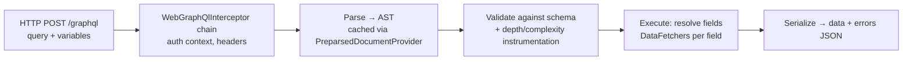
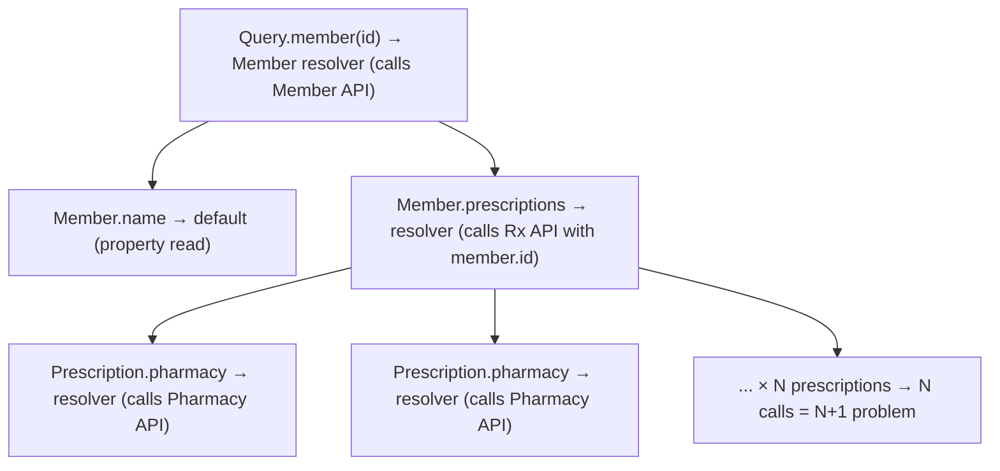

# Resolvers & Execution Model (Spring for GraphQL / DGS)

!!! abstract "Key takeaways"
    - Every request goes through **parse → validate (against the schema) → execute**. Execution walks the query tree **field by field**, calling a **resolver (DataFetcher)** for each field.
    - A child resolver receives its **parent object** (the "source"). Default resolvers just read a property of the same name.
    - Query fields can run **concurrently**, but only if DataFetchers are async (`CompletableFuture`/`Mono`, or blocking methods dispatched to an executor). GraphQL Java creates no threads itself. Top-level mutation fields run **serially**.
    - **Spring for GraphQL** (the official Spring project, built on GraphQL Java): `@QueryMapping`, `@MutationMapping`, `@SchemaMapping`, `@BatchMapping`, `@Argument`, transports for HTTP, WebSocket, SSE and RSocket.
    - **Netflix DGS** offers `@DgsComponent`/`@DgsQuery`/`@DgsData` and codegen. Modern DGS (10+) runs **on top of Spring for GraphQL**.

## Why it matters

Understanding execution explains N+1 problems, timeouts, partial failures, null bubbling and thread usage, which are all likely follow-ups for someone who owned a GraphQL service.

## Core concepts

### Request lifecycle


*Notice that validation happens before any resolver runs, so malformed or over-complex queries are rejected cheaply. A `PreparsedDocumentProvider` caches the parsed **and validated** document (not the result), so repeated queries skip both steps.*

### Field-by-field execution


*Notice that each object's child fields resolve independently, which is why `pharmacy` is called once per prescription unless batched with DataLoader.*

### Execution strategies

- **Queries:** `AsyncExecutionStrategy` (GraphQL Java default), so sibling fields resolve concurrently when DataFetchers return futures.
- **Mutations:** `AsyncSerialExecutionStrategy` (default), so top-level mutation fields run in document order. Each one completes (including its sub-selection) before the next starts.
- **Threading:** GraphQL Java **does not create threads**. A DataFetcher that returns a plain value runs synchronously on the calling thread, so sibling fields with blocking resolvers execute one after another. Concurrency only appears when the DataFetcher returns a `CompletableFuture` (or Spring adapts a `Mono`, or dispatches a blocking method to an `Executor`).
- **Errors:** an exception in a resolver yields `null` for that field + an entry in `errors[]` with `path` and `locations`. If the field is declared non-null (`!`), the `null` bubbles up to the nearest nullable parent, which can wipe out a whole object or even `data` itself. Sibling fields that succeeded are still returned (partial response, usually HTTP 200).
- **Error mapping in Spring:** exceptions go through the `DataFetcherExceptionResolver` chain (`@GraphQlExceptionHandler` methods are the annotated flavour). An unresolved exception becomes a generic `INTERNAL_ERROR` whose message is only `INTERNAL_ERROR for <executionId>`, so details are not leaked by default.

### Spring for GraphQL annotations

| Annotation | Binds |
|---|---|
| `@QueryMapping` / `@MutationMapping` / `@SubscriptionMapping` | Root fields |
| `@SchemaMapping(typeName, field)` | A field on any type (gets the parent as a parameter) |
| `@BatchMapping` | A field resolved for **many parents at once** (DataLoader under the hood) |
| `@Argument` / `@Arguments` | Field arguments (bound to records/POJOs) |
| `DataFetchingEnvironment`, `GraphQLContext`, `@ContextValue` | Execution context (selection set, auth info, headers) |
| `@GraphQlExceptionHandler` | Map exceptions to `GraphQLError` |

Return types can be plain objects, `CompletableFuture`, `Mono`/`Flux`, `Callable` (needs an `Executor` on `AnnotatedControllerConfigurer`) or `DataFetcherResult` (data + errors + extensions/local context). On **Java 21+**, when that `Executor` is configured, controller methods with a *blocking signature* (not returning `Mono`/`Flux`/`CompletableFuture`) are invoked asynchronously automatically. Spring Boot wires a virtual-thread executor for this when `spring.threads.virtual.enabled=true`, so plain blocking resolvers still run concurrently.

### Spring for GraphQL vs DGS

| | Spring for GraphQL | Netflix DGS |
|---|---|---|
| Owner | Spring team (GraphQL Java team collaboration) | Netflix |
| Programming model | `@Controller` + `@QueryMapping`… | `@DgsComponent` + `@DgsQuery`/`@DgsData` |
| Codegen | Community / DGS codegen plugin | First-class Gradle/Maven codegen |
| Federation | `FederationSchemaFactory` + `@EntityMapping` (1.3+, uses Apollo `federation-jvm`) | Built-in (`@DgsEntityFetcher`) |
| Today | The base layer (1.x on Boot 3.x, 2.x on Boot 4.x) | DGS 10+ runs on Spring for GraphQL; adds Netflix extras. Netflix recommends not mixing the two programming models in one service |

## In practice: code & configuration

```yaml
spring:
  graphql:
    schema:
      locations: classpath:graphql/**/  # the default; files end in .graphqls or .gqls
    graphiql:
      enabled: false                    # the default; enable only in dev
    http:
      path: /graphql                    # the default; before Boot 3.5 this was spring.graphql.path (now deprecated)
  threads:
    virtual:
      enabled: true                     # blocking resolvers on virtual threads (Java 21+)
```

```java
@Controller
@RequiredArgsConstructor
class MemberGraphController {
    private final MemberClient memberClient;
    private final RxClient rxClient;

    @QueryMapping
    Member member(@Argument String id) {
        return memberClient.get(id);
    }

    @SchemaMapping                        // typeName inferred from the parent parameter (Member)
    CompletableFuture<List<Prescription>> prescriptions(Member member, @Argument RxStatus status) {
        return rxClient.findByMemberAsync(member.id(), status);   // non-blocking, runs concurrently with siblings
    }

    @SchemaMapping
    String displayName(Member member, DataFetchingEnvironment env) {
        // env.getSelectionSet() lets you avoid fetching unrequested data
        return member.firstName() + " " + member.lastName();
    }
}

@ControllerAdvice
class GraphErrors {
    @GraphQlExceptionHandler
    GraphQLError handle(UpstreamTimeoutException ex, DataFetchingEnvironment env) {
        return GraphQLError.newError()
            .errorType(ErrorType.INTERNAL_ERROR)             // org.springframework.graphql.execution.ErrorType
            .message("Upstream temporarily unavailable")    // never leak internal details/PHI
            .path(env.getExecutionStepInfo().getPath())
            .location(env.getField().getSourceLocation())
            .build();
    }
}
```

Blocking resolvers and concurrency:

=== "❌ Common mistake"
    ```java
    // Assumes "GraphQL runs query fields in parallel". It does not create threads.
    // With no executor / virtual threads configured, these two blocking siblings
    // run one after the other on the request thread: latency = rx + claims.
    @SchemaMapping
    List<Prescription> prescriptions(Member member) {
        return rxClient.findByMember(member.id());       // blocking HTTP call
    }

    @SchemaMapping
    List<Claim> claims(Member member) {
        return claimClient.findByMember(member.id());    // blocking HTTP call
    }
    ```

=== "✅ Correct approach"
    ```java
    // Option 1: return an async type, so siblings overlap: latency = max(rx, claims).
    @SchemaMapping
    CompletableFuture<List<Prescription>> prescriptions(Member member) {
        return rxClient.findByMemberAsync(member.id());
    }

    // Option 2 (Java 21+): keep the blocking signature and set
    // spring.threads.virtual.enabled=true. Spring for GraphQL then invokes
    // blocking controller methods asynchronously on virtual threads.
    @SchemaMapping
    List<Claim> claims(Member member) {
        return claimClient.findByMember(member.id());
    }
    ```

{ loading=lazy }
*Watch the two lanes: blocking siblings add up (latency = rx + claims), async siblings overlap (latency = max(rx, claims)).*

Testing with `GraphQlTester` (`@MockitoBean` needs Spring Boot 3.4+; older versions use `@MockBean`):

```java
@GraphQlTest(MemberGraphController.class)
class MemberGraphControllerTest {
    @Autowired GraphQlTester tester;
    @MockitoBean MemberClient memberClient;
    @MockitoBean RxClient rxClient;

    @Test
    void returnsMemberName() {
        when(memberClient.get("42")).thenReturn(new Member("42", "Asha", "Patel"));
        tester.document("{ member(id: \"42\") { displayName } }")
              .execute()
              .path("member.displayName").entity(String.class).isEqualTo("Asha Patel");
    }
}
```

DGS equivalent:

```java
@DgsComponent
@RequiredArgsConstructor
class MemberDataFetcher {
    private final MemberClient memberClient;
    private final RxClient rxClient;

    @DgsQuery
    Member member(@InputArgument String id) { return memberClient.get(id); }

    @DgsData(parentType = "Member", field = "prescriptions")
    List<Prescription> prescriptions(DgsDataFetchingEnvironment dfe) {
        Member m = dfe.getSource();
        return rxClient.findByMember(m.id());
    }
}
```

## Real-world usage

- **Netflix** built DGS for its federated architecture (open-sourced in 2020), then aligned it with Spring for GraphQL (announced in 2024) so both communities share one GraphQL Java integration.
- **Aggregation services** (like the OptumRx Consumer Service) are typically I/O-bound. Async resolvers or virtual threads plus batching decide throughput.

## Trade-offs & production gotchas

| Resolver style | Pros | Cons | Use when |
|---|---|---|---|
| Blocking, platform threads | Simplest code and debugging | Siblings run serially; request threads starve under slow upstreams | Low traffic, few upstream calls per query |
| Blocking on virtual threads (Java 21+) | Blocking-style code, concurrent siblings, cheap threads | Pinning with `synchronized` on JDK 21–23; unbounded concurrency moves pressure to connection pools and upstreams | Spring MVC stack with blocking clients (`RestClient`, Feign, JDBC) |
| `CompletableFuture` / async client | Explicit concurrency, works on any JDK | Context propagation and error handling are more manual | Client already async, or pre-Java 21 |
| Reactive (`Mono`/`Flux`, WebFlux) | Backpressure, streaming subscriptions, mature | Steeper learning curve, harder stack traces, whole chain must be non-blocking | Already reactive end to end, or heavy subscription use |

!!! warning "Gotchas"
    - Blocking resolvers on a small platform thread pool means thread starvation under load. Use async clients or virtual threads.
    - "Queries run in parallel" is only true for async DataFetchers. Blocking sibling resolvers run serially unless an executor (for example virtual threads) is configured.
    - `ThreadLocal`-based context (security, MDC) does not follow work onto another thread by itself. Spring for GraphQL propagates it for controller methods through Micrometer `context-propagation` (a registered `ThreadLocalAccessor`; Spring Security's context is covered out of the box). Your own executors and `CompletableFuture.supplyAsync` calls are not covered, so pass values through `GraphQLContext` or wrap the executor.
    - A non-null (`!`) field that fails nulls out its parent. Over-using `!` on fields backed by remote calls turns one upstream failure into a lost page.
    - Fetching full upstream payloads regardless of the selection set wastes calls. Inspect `getSelectionSet()` for expensive optional fields.
    - Exceptions leaking stack traces or PHI in `errors[].message`. Map exceptions centrally.

## How this connects to my experience

- **Where I used it:** the GraphQL Consumer Service on the OptumRx Meteor project at Publicis Sapient (Java, Spring Boot), which I owned end-to-end as the integration layer between 5 upstream systems and multiple downstream consumers.
- **Talking points:**
    - Framework choice (Spring for GraphQL vs DGS vs graphql-java-kickstart) and why. *[confirm]*
    - How resolvers called the 5 upstreams (WebClient/RestClient/Feign, async or blocking). *[confirm]*
    - Error mapping strategy (no PHI in errors). *[confirm]*
    - Java version and whether virtual threads were an option. *[confirm]*
- **Likely follow-up chain:** "How does a query execute?" → "Where did N+1 appear?" → "Sync or async resolvers?" → "How did you test?"

## Interview questions

### Fundamentals

??? question "Q1. What is a resolver (DataFetcher)?"
    **Answer:** A function that produces the value for one field. It receives the parent object, arguments and context, and can return a value, a future or a publisher. Fields without explicit resolvers use a default property resolver (`PropertyDataFetcher` in GraphQL Java: getter, record accessor or `Map` key of the same name).

    **Interviewer listens for:** "one function per field", the parent/source object, and the default property fetcher.

    **Common wrong answer:** "A resolver is the controller method for a query", which ignores that every field on every type has one.

??? question "Q2. Walk through what happens when a GraphQL query hits the server."
    **Answer:** Transport → interceptors (auth/context) → parse to AST (cacheable) → validate against the schema and run instrumentations (depth/complexity) → execute: root resolvers, then child fields recursively using parent results, with concurrency for queries → errors collected per field → serialize data + errors.

    In Spring for GraphQL terms: the transport handler builds a `WebGraphQlRequest`, the `WebGraphQlInterceptor` chain runs, `ExecutionGraphQlService` invokes GraphQL Java, annotated controller methods are the registered DataFetchers, and exceptions pass through `DataFetcherExceptionResolver`s.

    **Interviewer listens for:** validation before execution, field-by-field execution with the parent passed down, and partial results (`data` plus `errors`).

    **Common wrong answer:** Describing it like REST ("the controller builds the whole response object"), with no mention of validation or per-field resolution.

### Intermediate

??? question "Q3. How do mutations and queries differ in execution?"
    **Answer:** Query fields may execute in parallel. Top-level mutation fields execute serially in document order, so dependent writes are predictable. Nested fields under a mutation's result resolve like a query. In GraphQL Java these are `AsyncExecutionStrategy` and `AsyncSerialExecutionStrategy`. Serial does not mean transactional: if the second mutation field fails, the first is not rolled back.

    **Interviewer listens for:** serial applies to *top-level* mutation fields only, and the reason (side effects need a defined order).

    **Common wrong answer:** "Mutations are atomic" or "the whole mutation tree is serial".

??? question "Q4. How do you access the authenticated user in a resolver?"
    **Answer:** Spring Security integration puts the `Authentication` into the security context, propagated by Spring for GraphQL (also across async boundaries). Inject `Principal`/`@AuthenticationPrincipal`, or read `GraphQLContext` values set by a `WebGraphQlInterceptor` (via `@ContextValue`). Authentication is done at the HTTP layer by the Spring Security filter chain. Authorization is best done per field or in the service layer with `@PreAuthorize`, because one `/graphql` endpoint serves every operation, so URL-based rules are not enough.

    **Interviewer listens for:** URL security is insufficient for GraphQL, method-level/field-level authorization, and context propagation across threads.

    **Common wrong answer:** "Read `SecurityContextHolder` anywhere", without considering resolvers that run on another thread through your own executor.

??? question "Q5. How would you unit/integration test resolvers?"
    **Answer:** `@GraphQlTest` slice with `GraphQlTester` and mocked clients for controller tests. `HttpGraphQlTester` against `@SpringBootTest` for full integration. WireMock for upstream contracts. Assert data paths and errors (`.errors().satisfy(...)`, since `GraphQlTester` fails a test on unexpected errors by default).

    **Interviewer listens for:** slice test vs full integration test, upstreams stubbed, and error-path assertions as well as happy paths.

    **Common wrong answer:** Only calling controller methods directly in plain unit tests, which never exercises schema mapping, argument binding or error resolution.

??? question "Q6. Does GraphQL execute query fields in parallel?"
    **Answer:** The spec *allows* it (query fields are side-effect free, so order does not matter), but GraphQL Java does not create threads. `AsyncExecutionStrategy` calls each sibling DataFetcher in turn and combines the returned futures. If a DataFetcher blocks and returns a plain value, the next sibling starts only after it finishes. You get real concurrency when resolvers return `CompletableFuture`/`Mono`, or when Spring for GraphQL dispatches blocking methods to an executor (automatic on Java 21+ with `spring.threads.virtual.enabled=true`, or by returning `Callable`).

    **Interviewer listens for:** the difference between "may" and "does", and who owns the threads.

    **Common wrong answer:** "Yes, GraphQL parallelises everything automatically."

??? question "Q7. What is the difference between `@SchemaMapping` and `@BatchMapping`?"
    **Answer:** `@SchemaMapping` is called once per parent object, so a list of N parents means N calls (the N+1 problem). `@BatchMapping` is called once with `List<Parent>` and returns `Map<Parent, Child>` (or a `List`/`Flux` in the same order as the parents, or `Mono<Map>`). Spring registers a DataLoader behind it, so all loads at that level are collected and dispatched as one batch. Use it for any field on a type that appears in lists. For key-based loading with caching across fields, register a `DataLoader` through `BatchLoaderRegistry` and inject it into a `@SchemaMapping` method.

    ```java
    @BatchMapping
    Map<Prescription, Pharmacy> pharmacy(List<Prescription> prescriptions) {
        Map<String, Pharmacy> byId = pharmacyClient.findByIds(
            prescriptions.stream().map(Prescription::pharmacyId).distinct().toList());
        return prescriptions.stream()
            .collect(Collectors.toMap(p -> p, p -> byId.get(p.pharmacyId())));
    }
    ```

    **Interviewer listens for:** per-parent vs per-batch invocation, DataLoader underneath, and that the upstream needs a bulk endpoint for it to help. Parents are map keys, so they need sensible `equals`/`hashCode` (records do).

    **Common wrong answer:** "`@BatchMapping` caches results across requests." DataLoaders are per request.

??? question "Q8. How do subscriptions work in Spring for GraphQL, and what makes them hard to scale?"
    **Answer:** A `@SubscriptionMapping` method returns a `Flux<T>`. Each item becomes a message to the client over **WebSocket** (`graphql-transport-ws` protocol) or, from Spring for GraphQL 1.3, **Server-Sent Events**. Authentication happens on the HTTP upgrade or in the `connection_init` payload.

    Scaling is hard because connections are **long-lived and stateful**. An event produced on instance A must reach a subscriber connected to instance B, so you need a fan-out backplane (Redis pub/sub, Kafka, or a broker) feeding each instance's `Flux`. You also need connection limits, heartbeats, token expiry handling on open connections, and load balancers that support WebSockets with long idle timeouts.

    **Interviewer listens for:** Flux return type, transport protocols, auth at connection time, cross-instance fan-out backplane, connection lifecycle.

    **Common wrong answer:** "Subscriptions are just polling queries." They are server-pushed streams over a persistent connection.

### Senior

??? question "Q9. How do you avoid fetching unrequested data from upstreams?"
    **Answer:** Split expensive data into separate fields with their own resolvers (they only run if selected), inspect `DataFetchingEnvironment.getSelectionSet()` to choose a lighter upstream call, and use projections. Combined with DataLoader, this minimises calls.

    **Interviewer listens for:** resolver granularity as the main tool, and `DataFetchingFieldSelectionSet` (`contains("prescriptions/pharmacy")`) as the look-ahead tool.

    **Common wrong answer:** "GraphQL only fetches what the client asks for automatically." It only *returns* what was asked for. What you fetch upstream is your code's decision.

??? question "Q10. Virtual threads vs reactive for a GraphQL aggregation service?"
    **Answer:** Both avoid thread starvation on I/O. Reactive (WebFlux, `Mono`) is mature but complex. Virtual threads (Java 21+, `spring.threads.virtual.enabled`) let you write blocking-style resolvers that scale. With that property set, Spring for GraphQL runs blocking controller methods asynchronously on virtual threads, so siblings overlap without `CompletableFuture` code. Watch pinning (`synchronized` blocks pin the carrier thread on JDK 21–23, fixed in JDK 24 by JEP 491) and connection-pool limits, since the bottleneck moves to upstream pools. Reactive still wins when you need backpressure or heavy streaming subscriptions.

    **Interviewer listens for:** a reasoned trade-off, pinning, and that virtual threads remove the thread limit but not the downstream capacity limit.

    **Common wrong answer:** "Virtual threads make it faster." They improve scalability of blocked I/O, not CPU speed or upstream latency.

### Scenario-based

??? question "Q11. Under load, GraphQL latency spikes and CPU is low. What's happening?"
    **Answer:** Likely thread pool or connection pool starvation: blocking resolvers waiting on upstreams, or HTTP client pools exhausted. Check thread dumps, pool metrics and upstream latency. Fix with async clients or virtual threads, right-sized pools, DataLoader batching, timeouts and bulkheads per upstream.

    **Interviewer listens for:** a diagnosis method (thread dump, pool and per-upstream metrics, tracing per field) before the fix, and "low CPU + high latency = waiting, not working".

    **Common wrong answer:** "Add more pods" or "increase the heap" without finding what the threads are waiting on.

??? question "Q12. One of five upstreams is down. What does the client get, and how do you design for it?"
    **Answer:** GraphQL returns partial results. The failing field becomes `null` with an entry in `errors[]` (`message`, `path`, `locations`, `extensions`), and the other fields still resolve, normally with HTTP 200. If the failing field is non-null (`!`), the `null` propagates to the nearest nullable ancestor, so schema nullability decides the blast radius. Design: keep fields backed by remote calls nullable, set per-upstream timeouts and circuit breakers, map exceptions centrally (`@GraphQlExceptionHandler` / `DataFetcherExceptionResolver`) to a stable `extensions` error code with no internal details, and have the UI render degraded sections.

    **Interviewer listens for:** partial response, null bubbling, nullability as a resilience decision, and sanitised errors.

    **Common wrong answer:** "The request fails with a 500", which is REST thinking.

## Cheat sheet

| Concept | Remember |
|---|---|
| Pipeline | Parse → validate → execute → serialize |
| Resolver input | Parent (source), args, context |
| Queries | Sibling fields concurrent only if resolvers are async (GraphQL Java makes no threads) |
| Mutations | Serial top-level fields |
| Spring | `@QueryMapping`, `@SchemaMapping`, `@BatchMapping`, `@GraphQlExceptionHandler` |
| Tests | `@GraphQlTest` + `GraphQlTester` |
| I/O scaling | Async or virtual threads + batching + pools |
| Errors | Field → `null` + `errors[]`; non-null bubbles to nearest nullable parent |
| HTTP path property | `spring.graphql.http.path` (Boot 3.5+; was `spring.graphql.path`) |
| Schema files | `classpath:graphql/**/`, `.graphqls` / `.gqls` |

## Sources

1. [GraphQL Specification: Execution](https://spec.graphql.org/October2021/#sec-Execution): normal vs serial execution, error handling and non-null propagation.
2. [Spring for GraphQL reference: Annotated Controllers](https://docs.spring.io/spring-graphql/reference/controllers.html): mapping annotations, return types, `@BatchMapping` signatures, blocking methods on virtual threads, `@GraphQlExceptionHandler`.
3. [GraphQL Java documentation: Execution](https://www.graphql-java.com/documentation/execution): default execution strategies, threading left to DataFetchers, `PreparsedDocumentProvider`.
4. [Spring Boot reference: Spring for GraphQL](https://docs.spring.io/spring-boot/reference/web/spring-graphql.html): `spring.graphql.*` properties, schema locations, `DataFetcherExceptionResolver` beans.
5. [Spring for GraphQL reference: Federation](https://docs.spring.io/spring-graphql/reference/federation.html): `FederationSchemaFactory` and `@EntityMapping`.
6. [Netflix DGS: Spring GraphQL integration](https://netflix.github.io/dgs/spring-graphql-integration/): how DGS runs on Spring for GraphQL and the advice not to mix programming models.
7. [Netflix Tech Blog: A Tale of Two Frameworks: The Domain Graph Service Framework Meets Spring GraphQL](https://netflixtechblog.medium.com/a-tale-of-two-frameworks-the-domain-graph-service-framework-meets-spring-graphql-f8237f09c389): background on the DGS and Spring for GraphQL alignment (April 2024).
