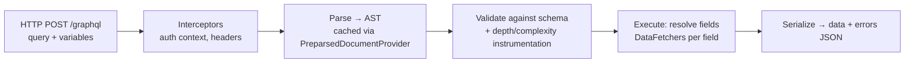
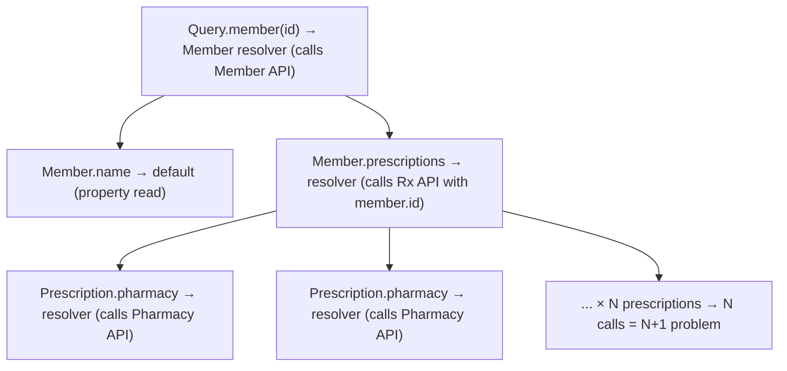

# Resolvers & Execution Model (Spring for GraphQL / DGS)

!!! abstract "TL;DR"
    - Every request goes through **parse → validate (against the schema) → execute**. Execution walks the query tree **field by field**, calling a **resolver (DataFetcher)** for each field.
    - A child resolver receives its **parent object** (the "source"). Default resolvers just read a property of the same name.
    - Query fields can run **concurrently** (async DataFetchers return `CompletableFuture`/`Mono`). Top-level mutation fields run **serially**.
    - **Spring for GraphQL** (the official Spring project, built on GraphQL Java): `@QueryMapping`, `@MutationMapping`, `@SchemaMapping`, `@BatchMapping`, `@Argument`, transports for HTTP, WebSocket, SSE and RSocket.
    - **Netflix DGS** offers `@DgsComponent`/`@DgsQuery`/`@DgsData` and codegen. Modern DGS runs **on top of Spring for GraphQL**.

## Why it matters

Understanding execution explains N+1 problems, timeouts, partial failures, null bubbling and thread usage, which are all likely follow-ups for someone who owned a GraphQL service.

## Core concepts

### Request lifecycle


*Notice that validation happens before any resolver runs, so malformed or over-complex queries are rejected cheaply.*

### Field-by-field execution


*Notice that each object's child fields resolve independently, which is why `pharmacy` is called once per prescription unless batched with DataLoader.*

### Execution strategies

- **Queries:** `AsyncExecutionStrategy`, so sibling fields resolve concurrently when DataFetchers return futures.
- **Mutations:** `AsyncSerialExecutionStrategy`, so top-level mutation fields run in order.
- **Errors:** an exception in a resolver yields `null` for that field + an entry in `errors[]` (null bubbling if the field is non-null).

### Spring for GraphQL annotations

| Annotation | Binds |
|---|---|
| `@QueryMapping` / `@MutationMapping` / `@SubscriptionMapping` | Root fields |
| `@SchemaMapping(typeName, field)` | A field on any type (gets the parent as a parameter) |
| `@BatchMapping` | A field resolved for **many parents at once** (DataLoader under the hood) |
| `@Argument` / `@Arguments` | Field arguments (bound to records/POJOs) |
| `DataFetchingEnvironment`, `GraphQLContext`, `@ContextValue` | Execution context (selection set, auth info, headers) |
| `@GraphQlExceptionHandler` | Map exceptions to `GraphQLError` |

Return types can be plain objects, `CompletableFuture`, `Mono`/`Flux`, or `Callable` (runs on an executor, so **virtual threads** fit well).

### Spring for GraphQL vs DGS

| | Spring for GraphQL | Netflix DGS |
|---|---|---|
| Owner | Spring team (GraphQL Java team collaboration) | Netflix |
| Programming model | `@Controller` + `@QueryMapping`… | `@DgsComponent` + `@DgsQuery`/`@DgsData` |
| Codegen | Community / DGS codegen plugin | First-class Gradle/Maven codegen |
| Federation | `FederationSchemaFactory` + `@EntityMapping` | Built-in |
| Today | The base layer | Runs on Spring for GraphQL; adds Netflix extras |

## In practice: code & configuration

```yaml
spring:
  graphql:
    schema:
      locations: classpath:graphql/**
    graphiql:
      enabled: false                    # enable only in dev
    path: /graphql
  threads:
    virtual:
      enabled: true                     # blocking resolvers on virtual threads (Java 21+)
```

```java
@Controller
@RequiredArgsConstructor
class MemberGraphController {
    private final MemberClient memberClient;
    private final RxClient rxClient;

    @QueryMapping
    Member member(@Argument String id) {
        return memberClient.get(id);
    }

    @SchemaMapping                        // typeName inferred from the parent parameter (Member)
    CompletableFuture<List<Prescription>> prescriptions(Member member, @Argument RxStatus status) {
        return rxClient.findByMemberAsync(member.id(), status);   // non-blocking, runs concurrently with siblings
    }

    @SchemaMapping
    String displayName(Member member, DataFetchingEnvironment env) {
        // env.getSelectionSet() lets you avoid fetching unrequested data
        return member.firstName() + " " + member.lastName();
    }
}

@ControllerAdvice
class GraphErrors {
    @GraphQlExceptionHandler
    GraphQLError handle(UpstreamTimeoutException ex, DataFetchingEnvironment env) {
        return GraphQLError.newError()
            .errorType(ErrorType.INTERNAL_ERROR)
            .message("Upstream temporarily unavailable")    // never leak internal details/PHI
            .path(env.getExecutionStepInfo().getPath())
            .location(env.getField().getSourceLocation())
            .build();
    }
}
```

Testing with `GraphQlTester`:

```java
@GraphQlTest(MemberGraphController.class)
class MemberGraphControllerTest {
    @Autowired GraphQlTester tester;
    @MockitoBean MemberClient memberClient;
    @MockitoBean RxClient rxClient;

    @Test
    void returnsMemberName() {
        when(memberClient.get("42")).thenReturn(new Member("42", "Asha", "Patel"));
        tester.document("{ member(id: \"42\") { displayName } }")
              .execute()
              .path("member.displayName").entity(String.class).isEqualTo("Asha Patel");
    }
}
```

DGS equivalent:

```java
@DgsComponent
class MemberDataFetcher {
    @DgsQuery
    Member member(@InputArgument String id) { return memberClient.get(id); }

    @DgsData(parentType = "Member", field = "prescriptions")
    List<Prescription> prescriptions(DgsDataFetchingEnvironment dfe) {
        Member m = dfe.getSource();
        return rxClient.findByMember(m.id());
    }
}
```

## Real-world usage

- **Netflix** built DGS for its federated architecture, then aligned it with Spring for GraphQL so both communities share GraphQL Java integration.
- **Aggregation services** (like the OptumRx Consumer Service) are typically I/O-bound. Async resolvers or virtual threads plus batching decide throughput.

## Trade-offs & production gotchas

!!! warning "Gotchas"
    - Blocking resolvers on a small platform thread pool means thread starvation under load. Use async clients or virtual threads.
    - `ThreadLocal`-based context (security, MDC) is lost across async boundaries. Use `GraphQLContext` and Spring's context propagation (Micrometer `context-propagation`).
    - Fetching full upstream payloads regardless of the selection set wastes calls. Inspect `getSelectionSet()` for expensive optional fields.
    - Exceptions leaking stack traces or PHI in `errors[].message`. Map exceptions centrally.

## How this connects to my experience

- **Where I used it:** the GraphQL Consumer Service at OptumRx (Java, Spring Boot).
- **Talking points:**
    - Framework choice (Spring for GraphQL vs DGS vs graphql-java-kickstart) and why. *[confirm]*
    - How resolvers called the 5 upstreams (WebClient/RestClient/Feign, async or blocking). *[confirm]*
    - Error mapping strategy (no PHI in errors). *[confirm]*
- **Likely follow-up chain:** "How does a query execute?" → "Where did N+1 appear?" → "Sync or async resolvers?" → "How did you test?"

## Interview questions

### Fundamentals

??? question "Q1. What is a resolver (DataFetcher)?"
    **Answer:** A function that produces the value for one field. It receives the parent object, arguments and context, and can return a value, a future or a publisher. Fields without explicit resolvers use a default property resolver.

??? question "Q2. Walk through what happens when a GraphQL query hits the server."
    **Answer:** Transport → interceptors (auth/context) → parse to AST (cacheable) → validate against the schema and run instrumentations (depth/complexity) → execute: root resolvers, then child fields recursively using parent results, with concurrency for queries → errors collected per field → serialize data + errors.

### Intermediate

??? question "Q3. How do mutations and queries differ in execution?"
    **Answer:** Query fields may execute in parallel. Top-level mutation fields execute serially in document order, so dependent writes are predictable. Nested fields under a mutation's result resolve like a query.

??? question "Q4. How do you access the authenticated user in a resolver?"
    **Answer:** Spring Security integration puts the `Authentication` into the security context, propagated by Spring for GraphQL (also across async boundaries). Inject `Principal`/`@AuthenticationPrincipal`, or read `GraphQLContext` values set by a `WebGraphQlInterceptor`.

??? question "Q5. How would you unit/integration test resolvers?"
    **Answer:** `@GraphQlTest` slice with `GraphQlTester` and mocked clients for controller tests. `HttpGraphQlTester` against `@SpringBootTest` for full integration. WireMock for upstream contracts. Assert data paths and errors.

### Senior

??? question "Q6. How do you avoid fetching unrequested data from upstreams?"
    **Answer:** Split expensive data into separate fields with their own resolvers (they only run if selected), inspect `DataFetchingEnvironment.getSelectionSet()` to choose a lighter upstream call, and use projections. Combined with DataLoader, this minimises calls.

??? question "Q7. Virtual threads vs reactive for a GraphQL aggregation service?"
    **Answer:** Both avoid thread starvation on I/O. Reactive (WebFlux, `Mono`) is mature but complex. Virtual threads (Java 21+, `spring.threads.virtual.enabled`) let you write blocking-style resolvers that scale. Watch pinning (old `synchronized` blocks) and connection-pool limits, since the bottleneck moves to upstream pools.

### Scenario-based

??? question "Q8. Under load, GraphQL latency spikes and CPU is low. What's happening?"
    **Answer:** Likely thread pool or connection pool starvation: blocking resolvers waiting on upstreams, or HTTP client pools exhausted. Check thread dumps, pool metrics and upstream latency. Fix with async clients or virtual threads, right-sized pools, DataLoader batching, timeouts and bulkheads per upstream.

## Cheat sheet

| Concept | Remember |
|---|---|
| Pipeline | Parse → validate → execute → serialize |
| Resolver input | Parent (source), args, context |
| Queries | Concurrent sibling fields |
| Mutations | Serial top-level fields |
| Spring | `@QueryMapping`, `@SchemaMapping`, `@BatchMapping`, `@GraphQlExceptionHandler` |
| Tests | `@GraphQlTest` + `GraphQlTester` |
| I/O scaling | Async or virtual threads + batching + pools |

## Sources

1. [GraphQL Specification: Execution](https://spec.graphql.org/October2021/#sec-Execution).
2. [Spring for GraphQL reference: Annotated Controllers](https://docs.spring.io/spring-graphql/reference/controllers.html).
3. [GraphQL Java documentation: Execution](https://www.graphql-java.com/documentation/execution).
4. [Netflix DGS: Spring GraphQL integration](https://netflix.github.io/dgs/spring-graphql-integration/).
5. [Netflix Tech Blog: The DGS Framework meets Spring GraphQL](https://netflixtechblog.medium.com/a-tale-of-two-frameworks-the-domain-graph-service-framework-meets-spring-graphql-f8237f09c389).
