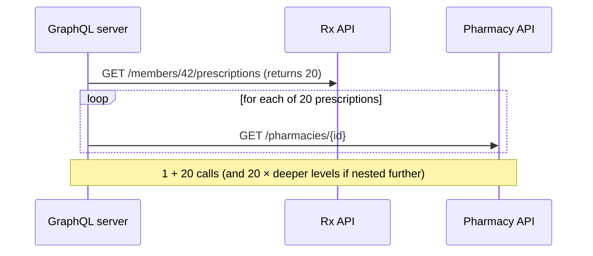
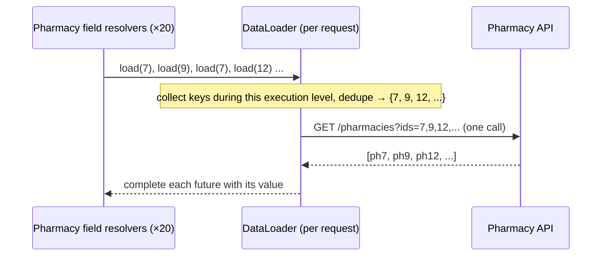

# The N+1 Problem & DataLoader Batching

!!! abstract "TL;DR"
    - **N+1:** one call fetches N parents, then each parent's child field triggers its own call, so you make **1 + N** (and nested levels multiply it) backend requests.
    - **DataLoader** collects all keys requested during an execution level, then calls a **batch function once** (`List<K> → Map<K,V>`), and **caches per request** (the same key is fetched once).
    - In Spring for GraphQL, **`@BatchMapping`** is the one-annotation solution. For more control, register loaders via `BatchLoaderRegistry`.
    - Batching needs **batch-capable upstream APIs** (`GET /pharmacies?ids=1,2,3`). If an upstream lacks one, add it or fall back to parallel calls with caching.
    - The DataLoader cache is **per request**, not a shared cache. Cross-request caching is a separate layer (Redis).

## Why it matters

Aggregating 5 upstream systems makes N+1 the biggest performance risk in a GraphQL integration layer. Expect "how did you solve N+1?" as a direct follow-up.

## Core concepts

### The problem

```graphql
query { member(id: "42") { prescriptions { drugName pharmacy { name } } } }
```


*Notice that the cost grows with result size. A list of 100 members with prescriptions and pharmacies becomes thousands of calls.*

### The fix: DataLoader


*Notice that the resolvers return futures immediately. The engine dispatches the loader once the level has been walked, so 20 lookups become 1 call, and duplicate IDs are fetched once.*

Two DataLoader features:

1. **Batching:** coalesce `load(key)` calls into one `batchLoad(keys)`.
2. **Per-request caching (memoisation):** `load(7)` twice returns the same future. This avoids duplicate fetches *within one request* and keeps results consistent within the response.

Batch function rules:

- Return results **in the same order** as the keys (`List` variant), or as a `Map<K,V>` keyed by input (`MappedBatchLoader`). Missing keys → null.
- Chunk big key sets (`maxBatchSize`) so upstream URL or body limits aren't exceeded.

## In practice: code & configuration

=== "❌ N+1"
    ```java
    @SchemaMapping
    Pharmacy pharmacy(Prescription rx) {
        return pharmacyClient.get(rx.pharmacyId());     // called once per prescription
    }
    ```

=== "✅ @BatchMapping"
    ```java
    @BatchMapping                                        // field "pharmacy" on type "Prescription"
    Map<Prescription, Pharmacy> pharmacy(List<Prescription> prescriptions) {
        Set<String> ids = prescriptions.stream().map(Prescription::pharmacyId).collect(toSet());
        Map<String, Pharmacy> byId = pharmacyClient.getByIds(ids);          // ONE call
        return prescriptions.stream()
            .collect(toMap(Function.identity(), rx -> byId.get(rx.pharmacyId())));
    }
    ```

Explicit registration (more control: options, async, key types):

```java
@Configuration
class LoaderConfig {
    LoaderConfig(BatchLoaderRegistry registry, PharmacyClient client) {
        registry.forTypePair(String.class, Pharmacy.class)
            .withOptions(o -> o.setMaxBatchSize(100))                       // chunk large key sets
            .registerMappedBatchLoader((ids, env) -> client.getByIdsMono(ids)); // Mono<Map<String, Pharmacy>>
    }
}

@Controller
class PrescriptionController {
    @SchemaMapping
    CompletableFuture<Pharmacy> pharmacy(Prescription rx, DataLoader<String, Pharmacy> loader) {
        return loader.load(rx.pharmacyId());                               // queued, batched, cached per request
    }
}
```

DGS equivalent:

```java
@DgsDataLoader(name = "pharmacies")
class PharmacyLoader implements MappedBatchLoader<String, Pharmacy> {
    public CompletionStage<Map<String, Pharmacy>> load(Set<String> ids) {
        return CompletableFuture.supplyAsync(() -> client.getByIds(ids));
    }
}
```

When the upstream has **no batch endpoint**:

```java
registry.forTypePair(String.class, Pharmacy.class)
    .registerMappedBatchLoader((ids, env) ->
        Flux.fromIterable(ids)
            .flatMap(id -> client.getMono(id).map(p -> Map.entry(id, p)), 8)   // bounded parallelism
            .collectMap(Map.Entry::getKey, Map.Entry::getValue));
// Still N calls, but parallel, bounded and deduped. Better: ask the owning team for a bulk endpoint.
```

## Real-world usage

- DataLoader originated at **Facebook** (the JavaScript `dataloader` library). **java-dataloader** is the JVM port used by GraphQL Java, Spring for GraphQL and DGS.
- **Netflix DGS** treats DataLoaders as essential for every relationship field across services.
- Measuring it: log **upstream calls per GraphQL operation**. A reduction from hundreds to a handful is a strong, quantifiable story.

## Trade-offs & production gotchas

| Approach | Calls | Notes |
|---|---|---|
| Naive resolver | 1 + N (× nesting) | Fine only for tiny lists |
| DataLoader + bulk API | 1 + 1 per level | Best; needs a bulk endpoint |
| DataLoader + parallel singles | 1 + N parallel, deduped | Interim solution |
| Join in the parent resolver | 1 | Over-fetches when the child isn't selected |

!!! warning "Gotchas"
    - Using a **singleton** DataLoader across requests leaks data between users (a security bug!). DataLoaders must be per request (frameworks handle this).
    - The batch function returning results in the **wrong order** silently returns the wrong data.
    - **Huge batches** (1,000 IDs) hit URL length limits or upstream timeouts. Set `maxBatchSize`.
    - Batching across different **auth contexts** is impossible. Keys must be resolvable with the current user's rights.
    - Errors for individual keys: return `Try`/null per key rather than failing the whole batch when possible.

## How this connects to my experience

- **Where I used it:** the GraphQL Consumer Service at OptumRx aggregating 5 upstream systems.
- **Talking points:**
    - Where N+1 showed up (e.g. prescriptions → pharmacy/drug details) and how batching fixed it. *[confirm the actual relationship]*
    - Measured impact: upstream calls per request and p95 latency before vs after. *[confirm numbers or say "significantly reduced"]*
    - Redis caching on top for reference data (DataLoader = per request, Redis = cross request).
- **Likely follow-up chain:** "Explain N+1" → "How does DataLoader know when to dispatch?" → "What if the upstream has no bulk API?" → "DataLoader cache vs Redis?"

## Interview questions

### Fundamentals

??? question "Q1. What is the N+1 problem in GraphQL?"
    **Answer:** Fetching a list of N items with one call, then resolving a child field per item with a separate call each: 1 + N calls, multiplied by nesting depth. It comes from GraphQL's per-field resolver model.

??? question "Q2. How does DataLoader solve it?"
    **Answer:** Resolvers call `loader.load(key)` and get a future. DataLoader collects keys for the current execution level, dedupes them, calls a batch function once with all keys, and completes each future. It also caches per request, so repeated keys are fetched once.

### Intermediate

??? question "Q3. How does DataLoader know when to dispatch the batch?"
    **Answer:** The GraphQL engine (GraphQL Java's DataLoader dispatch instrumentation/strategy) dispatches registered loaders when it has walked all fields of the current level and is waiting on pending futures. Batches form per level of the query tree.

??? question "Q4. @BatchMapping vs registering a BatchLoader?"
    **Answer:** `@BatchMapping` is a concise annotation: a method taking the list of parents and returning a `Map` or `List` of values, with the loader auto-registered. `BatchLoaderRegistry` gives full control (key types, options like max batch size, reactive loaders, reuse across fields).

??? question "Q5. DataLoader cache vs application cache?"
    **Answer:** The DataLoader cache is per request (consistency and dedupe within one response, no staleness concerns). An application cache (Redis/Caffeine) spans requests and needs TTL and invalidation. They complement each other.

### Senior

??? question "Q6. The upstream only supports single-item GET. What do you do?"
    **Answer:** Short term: a batch loader that fans out in parallel with bounded concurrency, plus dedupe, plus a short-TTL cache for reference data. Long term: request a bulk endpoint from the owning team (an API contract change), or subscribe to their events and keep a local read model.

??? question "Q7. How do you detect N+1 in production?"
    **Answer:** Instrument upstream client calls with the GraphQL operation name and trace ID. Track calls-per-operation and latency per resolver (GraphQL Java instrumentation / Micrometer observations). Alert when calls-per-operation exceed a threshold. Load-test with realistic list sizes.

### Scenario-based

??? question "Q8. After adding DataLoader, some users saw another user's pharmacy details. What happened?"
    **Answer:** The loader or its cache was shared across requests (singleton bean holding a DataLoader or a static map), so a cached value from user A was served to user B. DataLoaders must be request-scoped (use the framework's registry), and any cross-request cache must key on authorisation scope if data is user-specific.

## Cheat sheet

| Concept | Remember |
|---|---|
| N+1 | Per-field resolvers × list size |
| DataLoader | Batch + per-request cache |
| Spring | `@BatchMapping` or `BatchLoaderRegistry` |
| Batch fn | Keys in → values in the same order / map |
| Limits | `maxBatchSize`; per-key error handling |
| Never | Share DataLoaders across requests |

## Sources

1. [Spring for GraphQL: Batch Loading](https://docs.spring.io/spring-graphql/reference/request-execution.html#execution.batching) and [@BatchMapping](https://docs.spring.io/spring-graphql/reference/controllers.html#controllers.batch-mapping).
2. [GraphQL Java: Using DataLoader](https://www.graphql-java.com/documentation/batching).
3. [graphql/dataloader (original JS implementation)](https://github.com/graphql/dataloader).
4. [Netflix DGS: Data Loaders](https://netflix.github.io/dgs/data-loaders/).
