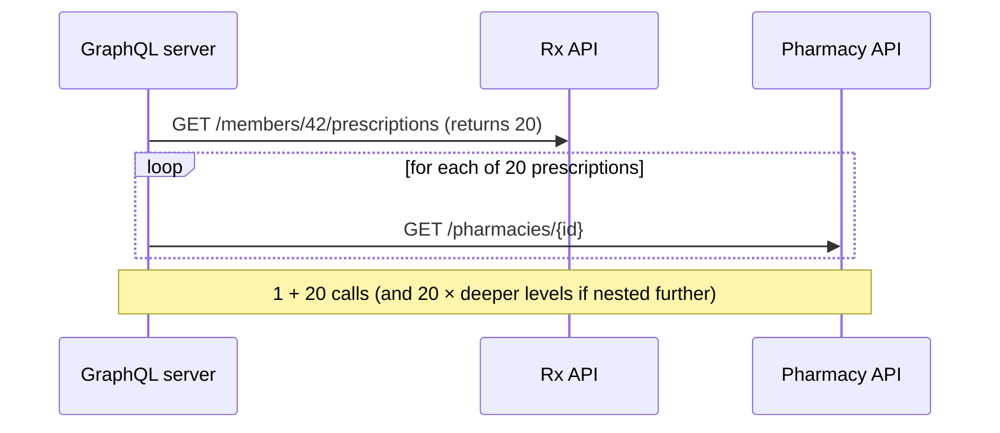
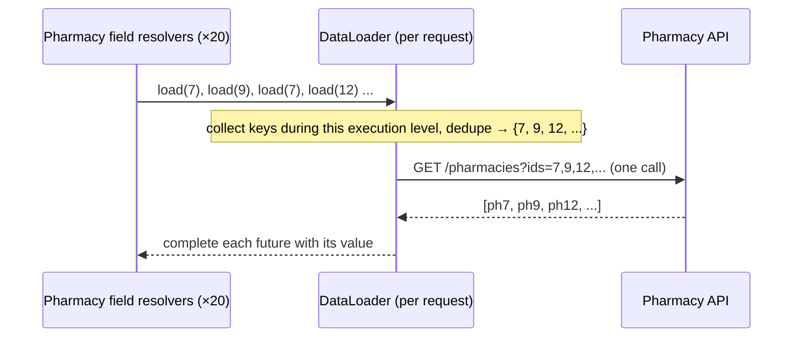

# The N+1 Problem & DataLoader Batching

!!! abstract "Key takeaways"
    - **N+1:** one call fetches N parents, then each parent's child field triggers its own call, so you make **1 + N** (and nested levels multiply it) backend requests.
    - **DataLoader** collects all keys requested during an execution level, then calls a **batch function once** (`List<K> → List<V>` in key order, or `Set<K> → Map<K,V>` for the mapped variant), and **caches per request** (the same key is fetched once).
    - In Spring for GraphQL, **`@BatchMapping`** is the one-annotation solution. For more control, register loaders via `BatchLoaderRegistry`.
    - Batching needs **batch-capable upstream APIs** (`GET /pharmacies?ids=1,2,3`). If an upstream lacks one, add it or fall back to parallel calls with caching.
    - The DataLoader cache is **per request**, not a shared cache. Cross-request caching is a separate layer (Redis).

## Why it matters

Aggregating 5 upstream systems makes N+1 the biggest performance risk in a GraphQL integration layer. Expect "how did you solve N+1?" as a direct follow-up.

## Core concepts

### The problem

```graphql
query { member(id: "42") { prescriptions { drugName pharmacy { name } } } }
```


*Notice that the cost grows with result size. A list of 100 members with prescriptions and pharmacies becomes thousands of calls.*

### The fix: DataLoader


*Notice that the resolvers return futures immediately. The engine dispatches the loader once the level has been walked, so 20 lookups become 1 call, and duplicate IDs are fetched once.*

{ loading=lazy }
*Watch the queue: keys pile up while the level is walked, duplicates collapse, and only then does a single call leave the service.*

Two DataLoader features:

1. **Batching:** coalesce `load(key)` calls into one `batchLoad(keys)`.
2. **Per-request caching (memoisation):** `load(7)` twice returns the same future. This avoids duplicate fetches *within one request* and keeps results consistent within the response.

{ loading=lazy }
*Notice the two lifetimes: a DataLoader lives and dies with one request, while Redis is shared and expires by TTL.*

Batch function rules:

- Return results **in the same order and the same size** as the keys (`BatchLoader`, `List` variant; a size mismatch fails the whole batch), or as a `Map<K,V>` keyed by input (`MappedBatchLoader`). With the mapped variant, missing keys → null.
- Chunk big key sets (`maxBatchSize`) so upstream URL or body limits aren't exceeded. DataLoader then calls the batch function several times, once per chunk.
- Keys must have correct `equals`/`hashCode` (they are cache keys and, in the mapped variant, map keys). Prefer IDs or small records over mutable entities.

## In practice: code & configuration

=== "❌ N+1"
    ```java
    @SchemaMapping
    Pharmacy pharmacy(Prescription rx) {
        return pharmacyClient.get(rx.pharmacyId());     // called once per prescription
    }
    ```

=== "✅ @BatchMapping"
    ```java
    @BatchMapping                                        // field "pharmacy" on type "Prescription"
    Map<Prescription, Pharmacy> pharmacy(List<Prescription> prescriptions) {
        Set<String> ids = prescriptions.stream().map(Prescription::pharmacyId).collect(toSet());
        Map<String, Pharmacy> byId = pharmacyClient.getByIds(ids);          // ONE call
        Map<Prescription, Pharmacy> result = new HashMap<>();               // not Collectors.toMap: it throws NPE on a
        prescriptions.forEach(rx -> result.put(rx, byId.get(rx.pharmacyId()))); // null value and on duplicate keys
        return result;
    }
    ```

By default the field name is the method name and the type name is the simple class name of the `List` element type (override with `@BatchMapping(typeName = "...", field = "...")`). The parent objects are the DataLoader keys here, so `Prescription` needs a stable `equals`/`hashCode` (a record works well). Return types can be `Map<K,V>`, `Collection<V>` (same order as the parents), `Mono<Map<K,V>>`, `Flux<V>`, or `Callable<...>` (needs an `Executor` configured on `AnnotatedControllerConfigurer`). For blocking upstream clients prefer the `Callable` or reactive variants so the batch call does not block the request thread.

Explicit registration (more control: options, async, key types):

```java
@Configuration
class LoaderConfig {
    LoaderConfig(BatchLoaderRegistry registry, PharmacyClient client) {
        registry.forTypePair(String.class, Pharmacy.class)
            .withOptions(o -> o.setMaxBatchSize(100))                       // chunk large key sets (1.4+: o is DataLoaderOptions.Builder)
            .registerMappedBatchLoader((ids, env) -> client.getByIdsMono(ids)); // Mono<Map<String, Pharmacy>>
    }
}

@Controller
class PrescriptionController {
    @SchemaMapping
    CompletableFuture<Pharmacy> pharmacy(Prescription rx, DataLoader<String, Pharmacy> loader) {
        return loader.load(rx.pharmacyId());                               // queued, batched, cached per request
    }
}
```

The `DataLoader<String, Pharmacy>` argument is resolved from the request's `DataLoaderRegistry` by the **full class name of the value type** (the default registration name from `forTypePair`), falling back to the argument name. Use `.withName("...")` when two loaders return the same value type.

DGS equivalent:

```java
@DgsDataLoader(name = "pharmacies")
class PharmacyLoader implements MappedBatchLoader<String, Pharmacy> {
    private final PharmacyClient client;
    PharmacyLoader(PharmacyClient client) { this.client = client; }

    @Override
    public CompletionStage<Map<String, Pharmacy>> load(Set<String> ids) {
        return CompletableFuture.supplyAsync(() -> client.getByIds(ids));
    }
}
```

When the upstream has **no batch endpoint**:

```java
registry.forTypePair(String.class, Pharmacy.class)
    .registerMappedBatchLoader((ids, env) ->
        Flux.fromIterable(ids)
            .flatMap(id -> client.getMono(id).map(p -> Map.entry(id, p)), 8)   // bounded parallelism
            .collectMap(Map.Entry::getKey, Map.Entry::getValue));
// Still N calls, but parallel, bounded and deduped. Better: ask the owning team for a bulk endpoint.
```

## Real-world usage

- DataLoader originated at **Facebook** (the JavaScript `dataloader` library). **java-dataloader** is the JVM port used by GraphQL Java, Spring for GraphQL and DGS.
- **Netflix DGS** documents DataLoaders (`@DgsDataLoader`) as its standard answer to N+1 for fields that load related data from other services.
- In **Apollo Federation**, the same problem appears at subgraph boundaries: the router sends one `_entities` query with a list of representations, and the subgraph's entity resolver must batch them (in Spring for GraphQL, a batched `@EntityMapping` method taking a `List` of IDs) instead of loading one entity at a time.
- Measuring it: log **upstream calls per GraphQL operation**. A reduction from hundreds to a handful is a strong, quantifiable story.

## Trade-offs & production gotchas

| Option | Calls | Pros | Cons | Use when |
|---|---|---|---|---|
| Naive resolver | 1 + N (× nesting) | Simplest code | Latency and upstream load grow with list size | Single objects or tiny, bounded lists |
| DataLoader + bulk API | 1 + 1 per level | Fewest calls, per-request dedupe | Needs a bulk endpoint; adds async indirection | Default for any child field under a list |
| DataLoader + parallel singles | 1 + N parallel, deduped | No upstream change needed | Still N calls; must bound concurrency | Interim, until a bulk endpoint exists |
| Join in the parent resolver | 1 | One round trip | Over-fetches when the child isn't selected (unless you inspect the selection set) | Same data store, child almost always selected |

!!! warning "Gotchas"
    - Using a **singleton** DataLoader across requests leaks data between users (a security bug!). DataLoaders must be per request (frameworks handle this).
    - The batch function returning results in the **wrong order** silently returns the wrong data.
    - **Huge batches** (1,000 IDs) hit URL length limits or upstream timeouts. Set `maxBatchSize`.
    - Batching across different **auth contexts** is impossible. Keys must be resolvable with the current user's rights.
    - Errors for individual keys: return null (or java-dataloader's `Try<V>` via `DataLoaderFactory.newDataLoaderWithTry(...)` when you build loaders directly) per key rather than failing the whole batch when possible. A batch function that throws fails **every** `load()` in that batch.
    - **Batching silently stops** if the `load()` call happens off the engine's execution path, e.g. inside `CompletableFuture.supplyAsync(...)` or after another async hop in the resolver. The engine dispatches when the level is walked, and a later `load()` can hang or go out one key at a time. Put async work inside the batch function. Chained loaders (a `load()` triggered from another loader's result) have the same issue. GraphQL Java 25+ has opt-in support for dispatching chained DataLoaders.
    - `Collectors.toMap` in a `@BatchMapping` method throws on **null values and duplicate keys**. Build the map with a plain `HashMap`.
    - Failed futures are **cached too**: a retry of the same key in the same request returns the cached failure unless you `clear(key)`.
    - Fields with **arguments** (`prescriptions(status: ACTIVE)`): the argument must be part of the key (a composite key record), otherwise two aliases with different arguments get the same cached result.

## How this connects to my experience

- **Where I used it:** the GraphQL Consumer Service I owned end-to-end on OptumRx Meteor (Publicis Sapient), the integration layer between 5 upstream systems and multiple downstream consumers. *[confirm that DataLoader/batching was actually used there, and whether the framework was Spring for GraphQL or DGS]*
- **Talking points:**
    - Where N+1 showed up (e.g. prescriptions → pharmacy/drug details) and how batching fixed it. *[confirm the actual relationship]*
    - Measured impact: upstream calls per request and p95 latency before vs after. *[confirm numbers or say "significantly reduced"]*
    - Redis-based caching for frequently accessed queries and UI reference data on top (DataLoader = per request, Redis = cross request). *[confirm how the two were layered]*
    - Whether the upstream systems exposed bulk endpoints or needed the parallel fallback. *[confirm]*
- **Likely follow-up chain:** "Explain N+1" → "How does DataLoader know when to dispatch?" → "What if the upstream has no bulk API?" → "DataLoader cache vs Redis?" Answer each in two or three sentences: per-field resolvers cause it, the engine dispatches per level after resolvers return futures, bounded parallel fan-out is the interim fix, and the DataLoader cache is request-scoped while Redis is cross-request with TTLs.

## Interview questions

### Fundamentals

??? question "Q1. What is the N+1 problem in GraphQL?"
    **Answer:** Fetching a list of N items with one call, then resolving a child field per item with a separate call each: 1 + N calls, multiplied by nesting depth. It comes from GraphQL's per-field resolver model: each resolver only knows its own parent, so it cannot see that 19 siblings need the same kind of lookup. Unlike the ORM version of N+1, the calls are often HTTP calls to other services, so the cost is network latency and upstream load.

    **Interviewer listens for:** the resolver-per-field cause, that cost scales with result size and nesting, and a concrete example.

    **Common wrong answer:** "GraphQL makes too many database queries", with no explanation of why, or treating it as a purely JPA lazy-loading problem.

??? question "Q2. How does DataLoader solve it?"
    **Answer:** Resolvers call `loader.load(key)` and get a future. DataLoader collects keys for the current execution level, dedupes them, calls a batch function once with all keys, and completes each future. It also caches per request, so repeated keys are fetched once.

    **Interviewer listens for:** both features (batching and per-request memoisation), futures returned immediately, the batch function contract (order or map), and that it needs a bulk upstream call to pay off.

    **Common wrong answer:** "DataLoader is a cache" (it is request-scoped memoisation, not a shared cache), or "it joins the data in one query" (it turns N calls into one batched call per level, it does not join).

??? question "Q3. What contract must a batch loader function satisfy?"
    **Answer:** Given a list of keys, it must return values **for every key, in the same order** (for a `List`-returning loader), using `null` or an error for missing items. If the upstream returns results in a different order or omits some, map them by id first (or use a `MappedBatchLoader`, which returns a `Map<K, V>`). Breaking this contract assigns data to the wrong parent, which in healthcare is a data leak.

    **Interviewer listens for:** same length and order as keys, mapping by id, MappedBatchLoader, missing keys handled.

    **Common wrong answer:** "Return whatever the upstream returns." A shorter or reordered list attaches results to the wrong members.

### Intermediate

??? question "Q4. How does DataLoader know when to dispatch the batch?"
    **Answer:** The GraphQL engine (GraphQL Java's DataLoader dispatch instrumentation/strategy) dispatches registered loaders when it has walked all fields of the current level and is waiting on pending futures. Batches form per level of the query tree. In older GraphQL Java this lived in `DataLoaderDispatcherInstrumentation`. Newer versions do it inside the engine with a per-level dispatch strategy, so no instrumentation has to be registered. (The JavaScript original instead dispatches on the next event-loop tick.) Consequence: a `load()` made later from an async callback, or from another loader's result, misses the dispatch. Keep `load()` calls synchronous in the resolver and do async work in the batch function. GraphQL Java 25+ adds opt-in dispatching for chained DataLoaders.

    **Interviewer listens for:** level-by-level dispatch driven by the engine (not a timer), the per-request `DataLoaderRegistry`, and awareness that async hops or chained loaders break batching.

    **Common wrong answer:** "It waits a few milliseconds and then sends the batch", or "it batches automatically whenever you call load()".

??? question "Q5. @BatchMapping vs registering a BatchLoader?"
    **Answer:** `@BatchMapping` is a concise annotation: a method taking the list of parents and returning a `Map` or `List` of values, with the loader auto-registered. `BatchLoaderRegistry` gives full control (key types, options like max batch size, reactive loaders, reuse across fields). Key difference: with `@BatchMapping` the **parent objects** are the keys, so the same pharmacy referenced from two different parents is deduped only if your method does it. With a registered loader keyed by ID, `load(pharmacyId)` from any field in the request shares one batch and one cache entry. Under the hood `@BatchMapping` is a shortcut that registers a loader and a `DataFetcher` that calls it.

    **Interviewer listens for:** knowing what the keys are in each style, when the loader is reused across fields, and the supported return types.

    **Common wrong answer:** "They are the same thing", or believing `@BatchMapping` needs no `equals`/`hashCode` on the parent type.

??? question "Q6. DataLoader cache vs application cache?"
    **Answer:** The DataLoader cache is per request (consistency and dedupe within one response, no staleness concerns). An application cache (Redis/Caffeine) spans requests and needs TTL and invalidation. They complement each other: the batch function can consult Redis first (`MGET`) and call the upstream only for the misses.

    **Interviewer listens for:** request scope vs cross-request scope, why request scope avoids staleness and data leaks, and how the two layers compose.

    **Common wrong answer:** "DataLoader already caches, so Redis is not needed", or making the DataLoader a singleton to get cross-request caching.

### Senior

??? question "Q7. The upstream only supports single-item GET. What do you do?"
    **Answer:** Short term: a batch loader that fans out in parallel with bounded concurrency, plus dedupe, plus a short-TTL cache for reference data. Long term: request a bulk endpoint from the owning team (an API contract change), or subscribe to their events and keep a local read model. Protect the upstream either way: a concurrency limit, timeouts, a circuit breaker, and a cap on list size (pagination or query complexity limits) so one query cannot fan out into thousands of calls.

    **Interviewer listens for:** an honest "this is still N calls", bounded concurrency, protecting the upstream, and driving the contract change as a lead.

    **Common wrong answer:** "DataLoader fixes it anyway", or unbounded parallel calls that move the problem to the upstream.

??? question "Q8. How do you detect N+1 in production?"
    **Answer:** Instrument upstream client calls with the GraphQL operation name and trace ID. Track calls-per-operation and latency per resolver (GraphQL Java instrumentation / Micrometer observations). Alert when calls-per-operation exceed a threshold. Load-test with realistic list sizes. In a distributed trace N+1 has a recognisable shape: one parent span with many sequential, near-identical child spans to the same upstream. Catch it earlier with an integration test that asserts the number of upstream calls for a list query (WireMock/MockWebServer verify counts).

    **Interviewer listens for:** a concrete metric (upstream calls per operation), tracing, and prevention in tests or code review, not only detection.

    **Common wrong answer:** "We would see it in slow response times", with no way to attribute the latency to a resolver.

??? question "Q9. A page requests 2,000 members' plans in one query. How do you stop the batch from overwhelming the upstream?"
    **Answer:** Set `maxBatchSize` in `DataLoaderOptions` to match what the upstream accepts (for example 100 ids). DataLoader then splits the 2,000 keys into chunks, which you can call with bounded concurrency. Also cap the page size in the schema (`first` ≤ 100), and apply query cost limits so one request cannot ask for unbounded fan-out.

    **Interviewer listens for:** maxBatchSize, upstream limits, bounded concurrency, page-size and cost limits in the schema.

    **Common wrong answer:** "DataLoader always sends one call, which is what we want." One call with 2,000 ids can time out or be rejected.

### Scenario-based

??? question "Q10. After adding DataLoader, some users saw another user's pharmacy details. What happened?"
    **Answer:** The loader or its cache was shared across requests (singleton bean holding a DataLoader or a static map), so a cached value from user A was served to user B. DataLoaders must be request-scoped (use the framework's registry), and any cross-request cache must key on authorisation scope if data is user-specific. Immediate response: treat it as a security incident (in healthcare, a potential PHI exposure), roll back or disable the cache, then fix the scope and add a test that runs two users' requests through the same instance.

    **Interviewer listens for:** request scoping as the root cause, treating it as a security incident, and a regression test.

    **Common wrong answer:** "Add a TTL to the cache". Expiry does not fix a scoping bug.

??? question "Q11. You added a DataLoader but the upstream still receives one call per item. Why might batching not be happening?"
    **Answer:** Work through the usual causes:

    1. The `load()` call happens after an async hop (`supplyAsync`, a reactive chain, another loader's callback), so it misses the level dispatch.
    2. The batch function itself loops and calls the single-item endpoint.
    3. A new `DataLoader` is created per resolver call instead of being taken from the request's registry, so each one holds a single key.
    4. `maxBatchSize` is set to 1 or batching is disabled in the options.
    5. The field is still wired to a plain `@SchemaMapping` that never calls the loader.
    6. The parents arrive through different paths or levels, so they legitimately form separate batches.

    Confirm by logging the size of the key set in the batch function.

    **Interviewer listens for:** a systematic checklist, knowledge of the dispatch timing, and verifying with evidence (batch size logs, traces).

    **Common wrong answer:** "DataLoader must be broken", or raising timeouts without checking the batch size.

??? question "Q12. The child field takes arguments, e.g. `prescriptions(status: ACTIVE, first: 10)` on each member. How do you batch it?"
    **Answer:** The key must capture everything that changes the result, so use a composite key such as `record RxKey(String memberId, Status status, int first)` with value semantics. The batch function groups keys by argument set and makes one bulk call per distinct argument combination (usually one, because every sibling gets the same arguments). Paginated children need an upstream that supports "top N per parent" in bulk. If it does not, fall back to bounded parallel calls or restrict pagination on nested lists. `@BatchMapping` cannot read field arguments, so this case needs a registered loader plus a `@SchemaMapping` that builds the key.

    **Interviewer listens for:** arguments in the key, the alias problem (same field, different arguments, same request), and the per-parent pagination limitation.

    **Common wrong answer:** keying only by parent ID, which returns the wrong cached list when the field is requested twice with different arguments.

## Cheat sheet

| Concept | Remember |
|---|---|
| N+1 | Per-field resolvers × list size |
| DataLoader | Batch + per-request cache |
| Spring | `@BatchMapping` or `BatchLoaderRegistry` |
| Batch fn | Keys in → values in the same order / map |
| Dispatch | Per level, by the engine. Keep `load()` synchronous in the resolver |
| Keys | Value `equals`/`hashCode`. Include field arguments |
| Limits | `maxBatchSize`; per-key error handling |
| Never | Share DataLoaders across requests |

## Sources

1. [Spring for GraphQL: Batch Loading](https://docs.spring.io/spring-graphql/reference/request-execution.html#execution.batching) and [@BatchMapping](https://docs.spring.io/spring-graphql/reference/controllers.html#controllers.batch-mapping): `BatchLoaderRegistry`, default loader naming, `@BatchMapping` arguments and return types.
2. [GraphQL Java: Using DataLoader](https://www.graphql-java.com/documentation/batching): per-level dispatch, per-request scope, async calls that break batching, chained DataLoaders (25.0+).
3. [graphql/dataloader (original JS implementation)](https://github.com/graphql/dataloader): the batching and per-request caching contract.
4. [Netflix DGS: Data Loaders](https://netflix.github.io/dgs/data-loaders/): `@DgsDataLoader` and `MappedBatchLoader` usage.
