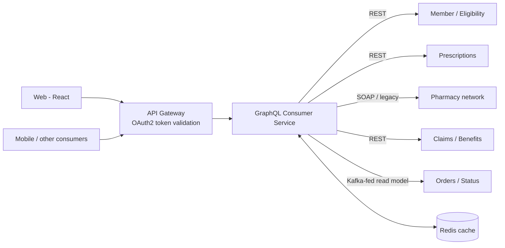
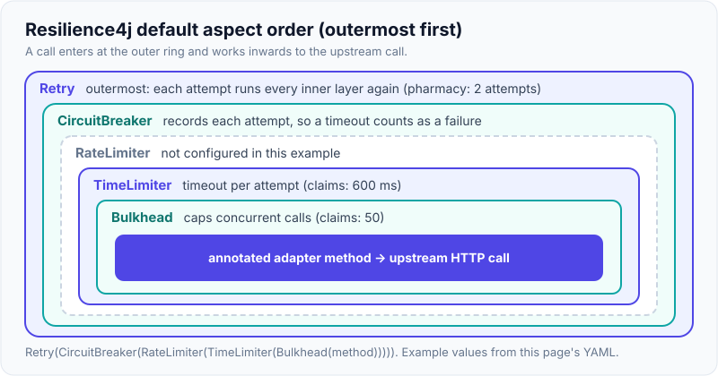

# Aggregating Multiple Upstream Systems: Orchestration, Timeouts & Partial Failures

!!! abstract "Key takeaways"
    - A GraphQL aggregation layer (BFF / integration layer) maps a **client-centric graph** onto many backends. It's the core of my GraphQL Consumer Service role on OptumRx Meteor at Publicis Sapient (5 upstream systems).
    - **Latency** = the slowest path through dependent calls. Run independent calls **in parallel**, batch with DataLoader, and keep dependency chains short.
    - Every upstream call needs a **timeout**, and per-upstream **bulkheads**, **circuit breakers** and (only for idempotent reads) **retries with backoff**.
    - Design for **partial results**: nullable fields for upstream-backed data, plus meaningful `errors[]` with paths, so one failing system degrades a section, not the page.
    - Also: an **anti-corruption layer** (map upstream DTOs to domain types), **auth/token propagation**, **correlation IDs**, and **caching** of reference data.

## Why it matters

This is the most resume-specific GraphQL topic. Interviewers will ask exactly "how did you integrate 5 upstreams?" and "what happened when one was slow or down?".

## Core concepts

### Architecture


*Notice that the service shields clients from 5 different protocols, data models and failure modes. That's the anti-corruption layer role. The upstream names and protocols here are illustrative, not from my resume.* *[confirm actual upstreams, protocols and whether a gateway sits in front]*

### Latency: parallel vs sequential

```mermaid
gantt
    dateFormat x
    axisFormat %L ms
    section Sequential
    Member      :0, 120
    Rx          :120, 300
    Claims      :300, 450
    Pharmacy    :450, 560
    section Parallel where independent
    Member      :0, 120
    Claims      :0, 150
    Rx - needs memberId :120, 300
    Pharmacy - batched and needs Rx :300, 410
```


*Notice that parallelising independent branches cuts total latency to the longest dependency chain (Member → Rx → Pharmacy), not the sum of all calls. Here that is about 410 ms instead of 560 ms. The numbers are illustrative.*

GraphQL helps naturally: sibling fields resolve concurrently **if resolvers are async**. Dependent fields wait for their parents.

!!! warning "Concurrency is not automatic"
    GraphQL Java's default query strategy (`AsyncExecutionStrategy`) calls each sibling `DataFetcher` one after another on the calling thread. Siblings only overlap when the fetcher returns a `CompletableFuture` (or, in Spring for GraphQL, a `Mono`/`Flux`, or a `Callable` when an `Executor` is configured). A resolver that blocks and returns a plain value makes its siblings wait.

    - On **Java 21+**, Spring for GraphQL invokes blocking controller methods asynchronously when `AnnotatedControllerConfigurer` has an `Executor`. Spring Boot configures a virtual-thread executor for this when `spring.threads.virtual.enabled=true`.
    - **Top-level mutation fields always run serially**, as the spec requires. Only query fields (and the sub-selections of a mutation's result) can run in parallel.

### Resilience per upstream

| Mechanism | Purpose | Typical setting |
|---|---|---|
| **Timeout** | Bound worst-case latency | Below the client SLO, per upstream p99 (e.g. 300–800 ms) |
| **Bulkhead** | A slow upstream can't exhaust shared threads/connections | Separate pools/semaphores per upstream |
| **Circuit breaker** | Fail fast when an upstream is unhealthy, let it recover | Open at ≥50% failures (or slow calls) over a sliding window, then probe in half-open |
| **Retry** | Absorb transient blips | Reads only, 1–2 retries, jittered backoff, within the timeout budget |
| **Fallback** | Degrade gracefully | Cached value, default, or null + error |
| **Hedging** (advanced) | Cut tail latency | Duplicate a slow read after p95 |

{ loading=lazy }
*Watch the states change: while OPEN the upstream gets no traffic at all, and HALF-OPEN lets only a few trial calls test it before traffic resumes.*

!!! tip "Timeout budget"
    Total budget, e.g. 2 s for the screen. Each dependency chain must fit inside it. Set per-hop timeouts so retries can't blow the budget: (timeout × attempts) + backoff waits < budget. In Resilience4j the `TimeLimiter` sits inside the `Retry`, so the timeout applies to **each attempt**, not to the total.

### Partial failure semantics

```json
{
  "data": {
    "member": {
      "name": "A. Patel",
      "prescriptions": [ { "drugName": "Atorvastatin", "pharmacy": null } ],
      "claimsSummary": null
    }
  },
  "errors": [
    { "message": "Claims temporarily unavailable", "path": ["member","claimsSummary"],
      "extensions": { "classification": "UPSTREAM_UNAVAILABLE", "upstream": "claims", "retryable": true } }
  ]
}
```

*The UI renders what it has and shows a "temporarily unavailable" card for claims. That only works if `claimsSummary` is nullable.*

{ loading=lazy }
*Watch the claims section: the rest of the screen is already usable, and the error entry's `path` tells the UI exactly which card to replace.*

If `claimsSummary` were declared `ClaimsSummary!`, the spec's null propagation would null the nearest nullable ancestor instead: `member` becomes `null` (and if `member` is non-null too, the whole `data` is `null`). The `upstream` and `retryable` extension keys are my own convention. `classification` is the key Spring for GraphQL writes by default.

### Anti-corruption layer and mapping

- Map upstream DTOs (inconsistent names, codes, date formats) into **clean domain types** in one place per upstream (adapter/client module).
- Normalise **codes** (status codes, drug identifiers) and **errors** (each upstream fails differently).
- Version-isolate upstreams: an upstream API change touches one adapter, not the schema.

### Auth and context propagation

- Validate the user's OAuth2 token at the gateway or service. For upstream calls, either **forward the user token** (if the upstream trusts the same IdP and audience) or use **token exchange** / **client credentials** with the user identity in a signed header, depending on the trust model.
- Propagate **correlation/trace IDs** (W3C `traceparent`) on every upstream call.

## In practice: code & configuration

Resilience4j per upstream (Spring Boot):

```yaml
resilience4j:
  timelimiter:
    instances:
      claims: { timeout-duration: 600ms }      # default is 1s
      pharmacy: { timeout-duration: 400ms }
  circuitbreaker:
    instances:
      claims:
        sliding-window-type: COUNT_BASED         # default
        sliding-window-size: 50                  # default 100
        minimum-number-of-calls: 20              # default 100: nothing is evaluated before this many calls
        failure-rate-threshold: 50               # default 50 (%)
        slow-call-duration-threshold: 500ms      # default 60s, so slow-call detection is effectively off by default
        slow-call-rate-threshold: 60             # default 100 (%)
        wait-duration-in-open-state: 20s         # default 60s
        permitted-number-of-calls-in-half-open-state: 5   # default 10
  bulkhead:                                      # semaphore bulkhead (the annotation's default type)
    instances:
      claims:
        max-concurrent-calls: 50                 # default 25
        max-wait-duration: 0                     # default 0: reject immediately when full
  retry:
    instances:
      pharmacy:
        max-attempts: 2                          # total attempts including the first call, so 1 retry (default 3)
        wait-duration: 50ms                      # default 500ms
        enable-randomized-wait: true             # jitter
        retry-exceptions: [java.net.SocketTimeoutException, org.springframework.web.client.ResourceAccessException]
```

A thread-pool bulkhead is configured under a **different prefix**, `resilience4j.thread-pool-bulkhead.instances.*` (`core-thread-pool-size`, `max-thread-pool-size`, `queue-capacity`), and is selected with `@Bulkhead(type = Bulkhead.Type.THREADPOOL)`. Mixing the semaphore YAML above with the `THREADPOOL` annotation type silently runs with default pool settings.

Default aspect order (outermost first): `Retry ( CircuitBreaker ( RateLimiter ( TimeLimiter ( Bulkhead ( method ) ) ) ) )`. So the breaker records a timeout as a failure, and each retry attempt gets its own timeout.

{ loading=lazy }
*Notice that Retry wraps everything else, so each attempt passes through the breaker, gets its own timeout and takes its own bulkhead permit.*

Resolver with timeout, circuit breaker and graceful degradation. The resilience annotations sit on the **adapter bean** (a public method on a Spring-proxied bean), and the controller stays thin:

```java
@Controller
@RequiredArgsConstructor
class ClaimsGraphController {
    private final ClaimsAdapter claims;

    // Returning a CompletableFuture lets sibling fields of Member resolve concurrently
    @SchemaMapping(typeName = "Member", field = "claimsSummary")
    CompletableFuture<ClaimsSummary> claimsSummary(Member member) {
        return claims.summaryFor(member.id());
    }
}

@Component
class ClaimsAdapter {
    private final ClaimsClient client;        // RestClient-based, returns the upstream DTO
    private final ClaimsMapper mapper;        // anti-corruption mapping: upstream DTO -> domain type
    private final Executor claimsExecutor;    // dedicated bounded pool (or virtual threads) for this upstream

    ClaimsAdapter(ClaimsClient client, ClaimsMapper mapper,
                  @Qualifier("claimsExecutor") Executor claimsExecutor) {
        this.client = client;
        this.mapper = mapper;
        this.claimsExecutor = claimsExecutor;
    }

    @CircuitBreaker(name = "claims", fallbackMethod = "claimsUnavailable")
    @TimeLimiter(name = "claims")             // needs a CompletionStage return type
    @Bulkhead(name = "claims")                // semaphore type, matches resilience4j.bulkhead.* above
    public CompletableFuture<ClaimsSummary> summaryFor(String memberId) {
        // Never use the no-arg supplyAsync for blocking I/O: it runs on the shared ForkJoinPool.commonPool()
        return CompletableFuture.supplyAsync(
                () -> mapper.toDomain(client.summaryFor(memberId)), claimsExecutor);
    }

    // Same class, same parameters plus one trailing exception parameter, same return type
    CompletableFuture<ClaimsSummary> claimsUnavailable(String memberId, Throwable t) {
        // Surface as a typed field error (null data + errors[] entry), not a page failure
        return CompletableFuture.failedFuture(new UpstreamUnavailableException("claims", t));
    }
}
```

Turning that exception into the `errors[]` entry shown earlier (Spring for GraphQL 1.2+):

```java
@ControllerAdvice
class UpstreamErrorAdvice {

    @GraphQlExceptionHandler
    GraphQLError handle(UpstreamUnavailableException ex, DataFetchingEnvironment env) {
        return GraphqlErrorBuilder.newError(env)                       // fills in path and locations
                .message("%s temporarily unavailable".formatted(ex.upstream()))   // safe message, no upstream internals
                .errorType(UpstreamErrorType.UPSTREAM_UNAVAILABLE)     // custom enum implementing graphql.ErrorClassification
                .extensions(Map.of("upstream", ex.upstream(), "retryable", true))
                .build();
    }
}
```

Spring's built-in `ErrorType` only has `BAD_REQUEST`, `UNAUTHORIZED`, `FORBIDDEN`, `NOT_FOUND` and `INTERNAL_ERROR`, so an upstream classification needs your own `ErrorClassification`. Unhandled exceptions are reported as a generic `INTERNAL_ERROR` with the message hidden.

!!! note "Things interviewers probe in this code"
    - **The fallback fires for every failure**, not only when the breaker is open: timeouts, bulkhead rejections (`BulkheadFullException`), open circuit (`CallNotPermittedException`) and upstream exceptions.
    - **A `TimeLimiter` timeout does not stop the work.** It completes the future with a `TimeoutException`, but cancelling a `CompletableFuture` does not interrupt the thread that is blocked on the socket. The HTTP **read timeout** is what actually frees the thread, so set both and keep the HTTP timeout at or just above the TimeLimiter value.
    - **Thread hops lose `ThreadLocal` context** (security context, MDC, trace). Spring for GraphQL propagates context into its own controller invocations, but a custom executor needs a context-propagating `TaskDecorator` (or Micrometer `ContextSnapshot`).
    - `UpstreamUnavailableException`, `UpstreamErrorType`, `ClaimsMapper` and `claimsExecutor` are my own classes/beans, not library types.

HTTP client with timeouts and propagated headers (Spring `RestClient`):

```java
@Bean
RestClient claimsRestClient(RestClient.Builder builder, ObservationRegistry registry) {
    var factory = new JdkClientHttpRequestFactory(HttpClient.newBuilder()
            .connectTimeout(Duration.ofMillis(200)).build());
    factory.setReadTimeout(Duration.ofMillis(600));
    return builder.baseUrl("https://claims.internal")
            .requestFactory(factory)
            .observationRegistry(registry)                    // metrics, plus traceparent when Micrometer Tracing is on the classpath
            .requestInterceptor(new BearerTokenRelayInterceptor())   // custom: copies the user/exchanged token
            .build();
}
```

Always inject the auto-configured `RestClient.Builder` (as above) instead of calling `RestClient.create()`, otherwise Boot's observation and tracing customisers are not applied.

=== "❌ Common mistake"
    ```java
    Member member = memberClient.get(id);          // sequential, no timeouts
    List<Claim> claims = claimsClient.get(id);     // independent call waits needlessly
    Pharmacy ph = pharmacyClient.get(...);         // one slow upstream = whole response slow or failed
    ```

=== "✅ Correct approach"
    ```java
    // Independent fields = separate async resolvers (run concurrently),
    // each with its own timeout, bulkhead, circuit breaker and nullable schema field.
    @QueryMapping
    CompletableFuture<Member> member(@Argument String id) {
        return memberAdapter.byId(id);                       // critical: if this fails, the query fails
    }

    @SchemaMapping(typeName = "Member", field = "claimsSummary")   // nullable in the schema
    CompletableFuture<ClaimsSummary> claimsSummary(Member member) {
        return claimsAdapter.summaryFor(member.id());        // runs alongside prescriptions
    }

    @BatchMapping(typeName = "Prescription", field = "pharmacy")   // one batched call, not N
    Mono<Map<Prescription, Pharmacy>> pharmacy(List<Prescription> prescriptions) {
        return pharmacyAdapter.forPrescriptions(prescriptions);
    }
    ```

## Real-world usage

- **Netflix's** API layer pioneered fault-tolerant aggregation (Hystrix: timeouts, bulkheads, circuit breakers, fallbacks). Hystrix has been in maintenance mode since 2018, and its README points to Resilience4j as the replacement for new projects.
- **Healthcare portals** commonly aggregate eligibility, claims, pharmacy and provider directory backends, often including legacy SOAP or mainframe-fronted services with poor latency. Caching and timeouts are essential.
- **Reading from events:** for slow or legacy upstreams, teams consume their change events (Kafka) into a local read model, so GraphQL queries hit a fast local store instead of the slow system.

## Trade-offs & production gotchas

| Choice | Pro | Con | Use when |
|---|---|---|---|
| Call upstream per request | Fresh data | Latency and availability coupling | Data must be current (eligibility, order status) and the upstream is fast and reliable |
| Cache (Redis) | Fast, resilient | Staleness, invalidation | Reference data and read-heavy data that tolerates a short TTL |
| Local read model from events | Fast, decoupled | Eventual consistency, more infra | The upstream is slow or legacy and publishes change events |
| Retry reads | Hides blips | Amplifies load during incidents (retry storms) | Idempotent reads, transient errors, one layer only |
| Semaphore bulkhead | Cheap, no thread hop, works with virtual threads | Does not bound time, only concurrency | Calls are already async or on virtual threads |
| Thread-pool bulkhead | Bounded queue and threads per upstream | Thread hop, context propagation, pool tuning | Blocking clients on platform threads |

!!! warning "Gotchas"
    - **Retry storms:** retries at the client, gateway and service multiply load on an already struggling upstream. Retry at one layer only, with budgets.
    - **Default HTTP client timeouts are often infinite.** Always set connect and read timeouts.
    - Non-null schema fields for upstream data turn a single failure into a missing parent.
    - **A fallback that returns a default value hides the failure from the breaker's caller and from the client.** Returning an empty list for "claims unavailable" looks like "no claims", which is a correctness bug in healthcare. Prefer null plus a typed error, or a cached value that is clearly marked stale.
    - **Caching per user data** in Redis needs the member/tenant in the key. A shared key leaks one member's data to another.
    - **Circuit breakers per instance, not global:** each service pod keeps its own breaker state, so with low traffic per pod `minimum-number-of-calls` may never be reached and the breaker never opens.
    - Logging full upstream payloads can leak **PHI**. Log IDs and metadata only.

## How this connects to my experience

- **Where I used it:** Publicis Sapient (Jan 2023 – present), project OptumRx Meteor. Resume bullets: "Owned the GraphQL Consumer Service end-to-end, acting as the integration layer between 5 upstream systems and multiple downstream consumers", "Implemented Redis-based caching for frequently accessed queries and UI reference data", "Built secure enterprise APIs using OAuth2, PingFederate, and Active Directory integration", "Designed Kafka-based event-driven workflows with retry and DLQ handling".
- **Talking points (STAR-ready):**
    - **S/T:** 5 upstream systems behind one GraphQL Consumer Service that I owned end-to-end, with multiple downstream consumers, for applications serving 750K+ users. The upstreams differed in protocols, SLAs and data models. *[confirm the differences and name the 5 systems]*
    - **A:** domain schema + adapters per upstream; parallel async resolvers + DataLoader; timeouts, circuit breakers and bulkheads per upstream; nullable upstream-backed fields with typed errors; Redis for frequently accessed queries and UI reference data (on resume); correlation IDs. *[confirm each: the resume states only the integration-layer role, Redis caching, OAuth2/PingFederate and Kafka retry/DLQ. Resilience4j, DataLoader, Spring for GraphQL vs DGS, and token relay vs exchange are not on it]*
    - **R:** p95 latency / availability / fewer client calls. *[confirm metrics: the resume gives no latency or availability numbers, so don't quote any I can't back up]*
- **Likely follow-up chain:** "What happens when upstream 3 is slow?" (timeout, bulkhead, breaker, null + typed error: Q12) → "How did you choose timeouts?" (SLO budget and upstream p99: Q4) → "Did you retry? Wasn't that dangerous?" (idempotent reads only, one layer, jitter: Q6) → "How did the UI handle partial data?" (nullable fields, `errors[]` with `path`: Q2) → "How did tokens flow to upstreams?" (relay vs token exchange vs client credentials: Q9).

## Interview questions

### Fundamentals

??? question "Q1. Why use GraphQL as an integration layer over multiple systems?"
    **Answer:** One client-centric contract hides upstream heterogeneity. Clients fetch exactly what screens need in one round-trip. Resolvers map one field to one upstream call, so independent fields can run concurrently (when the resolvers are async), and failures are reported per field instead of failing the whole response. Upstream changes are isolated behind adapters. The cost: the aggregation service becomes a shared dependency and a single point of failure, so it needs strong resilience, observability and ownership.

    **Interviewer listens for:** client-centric schema, per-field partial failure, anti-corruption layer, and an honest statement of the cost (extra hop, coupling point, N+1 risk).

    **Common wrong answer:** "GraphQL is faster than REST." It isn't inherently faster. It reduces client round-trips and moves orchestration to the server.

??? question "Q2. How does GraphQL represent a partial failure?"
    **Answer:** The failing field is null in `data` and an entry with `message`, `path` and optional `extensions` is added to `errors[]`, while the rest of the data is returned. The HTTP status is still 200 in the classic `application/json` convention. If the failing field is non-null (`!`), the null propagates to the nearest nullable ancestor, which can wipe out a whole section or all of `data`. So upstream-backed fields should be nullable, and clients must read both `data` and `errors`.

    **Interviewer listens for:** `data` and `errors` together, `path`, null propagation for non-null fields, HTTP 200 with errors.

    **Common wrong answer:** "The request returns HTTP 500" or "the whole query fails". Also treating a non-empty `errors[]` as a total failure on the client.

??? question "Q3. Do sibling fields in a GraphQL query resolve in parallel?"
    **Answer:** Only if the resolvers are asynchronous. The spec allows query fields to execute in any order, and GraphQL Java's `AsyncExecutionStrategy` invokes each `DataFetcher` in turn without waiting for the returned future to complete. If a fetcher returns a `CompletableFuture` (or a `Mono`, or a `Callable` with an `Executor` in Spring for GraphQL), siblings overlap. If it blocks and returns a plain value, siblings run one after another on the request thread. On Java 21+, Spring for GraphQL can invoke blocking controller methods asynchronously on virtual threads (`spring.threads.virtual.enabled=true` in Spring Boot). Top-level mutation fields are always serial.

    **Interviewer listens for:** "async return type" as the condition, the mutation exception, awareness of which thread pool the work runs on.

    **Common wrong answer:** "GraphQL runs all resolvers in parallel automatically."

### Intermediate

??? question "Q4. How do you set timeouts for upstream calls?"
    **Answer:** Start from the end-to-end SLO and divide it across the dependency chain. Set each upstream's timeout slightly above its healthy p99 and below the remaining budget. Set connect and read timeouts on the HTTP client separately (connect is short, e.g. 100–200 ms inside a data centre), and an overall time limit on the call. Make sure (timeout × attempts) plus backoff fits within the budget. Ideally pass the remaining deadline down the chain so a late call is not even started. Revisit with production latency histograms.

    **Interviewer listens for:** budget derived from the SLO, percentiles not averages, connect vs read timeout, retries counted in the budget, deadline propagation.

    **Common wrong answer:** one global 30 s timeout for everything, or using the library default (often infinite).

??? question "Q5. What is a bulkhead and why per upstream?"
    **Answer:** Isolated resource limits (threads, connections, semaphore permits) per dependency, so one slow upstream exhausts only its own allowance, not the threads serving other fields and requests. Resilience4j offers a semaphore bulkhead (limits concurrent calls, no thread hop) and a thread-pool bulkhead (bounded pool plus queue). The HTTP connection pool per upstream is a bulkhead too. A bulkhead limits concurrency, a timeout limits duration. You need both.

    **Interviewer listens for:** the failure it prevents (shared pool exhaustion causing a cascading failure), semaphore vs thread pool, relation to timeouts.

    **Common wrong answer:** confusing a bulkhead with a rate limiter (rate limits calls per time, bulkhead limits calls in flight) or with a circuit breaker.

??? question "Q6. When should you retry upstream calls?"
    **Answer:** Only idempotent reads, on transient errors (timeouts, 503, connection resets), with 1–2 attempts and jittered backoff inside the timeout budget, ideally at a single layer. Never retry 4xx responses. Never retry non-idempotent mutations without an idempotency key. Put the circuit breaker inside the retry so an open circuit stops the retries, and consider a retry budget (e.g. retries capped at a percentage of calls) to prevent storms.

    **Interviewer listens for:** idempotency, jitter, retry amplification across layers, interaction with the timeout budget and breaker.

    **Common wrong answer:** "Retry 3 times on any exception." That multiplies load on an upstream that is already failing and can duplicate writes.

??? question "Q7. Explain the circuit breaker states and how you would tune one."
    **Answer:** **Closed:** calls pass and outcomes are recorded in a sliding window (count- or time-based). When the failure rate or slow-call rate crosses its threshold, and at least `minimumNumberOfCalls` have been recorded, it goes **open:** calls fail immediately with `CallNotPermittedException`. After `waitDurationInOpenState` it goes **half-open:** a limited number of probe calls pass. If they succeed it closes, otherwise it re-opens. Tuning: window large enough to avoid flapping at the upstream's traffic level, slow-call threshold near the timeout so a slow upstream also trips it, a short open wait for fast recovery, and only count real upstream faults (not 4xx/validation errors) as failures.

    **Interviewer listens for:** three states, slow-call rate as well as failure rate, minimum number of calls, what counts as a failure, per-instance state.

    **Common wrong answer:** "It retries until the service is back." That's a retry. A breaker stops calling.

### Senior

??? question "Q8. One upstream (claims) has a p99 of 3 s, while the screen SLO is 1.5 s. Options?"
    **Answer:** Load claims in a separate query or deferred field so it doesn't block the page (`@defer`, where client and server support it, since it is not in the released spec yet, or simply a second request). Cache claims summaries in Redis with event-based invalidation or a short TTL. Build a local read model from claims events. Negotiate a lighter summary endpoint with the claims team. Meanwhile, set a timeout around 1 s with a graceful "unavailable" state. I'd pick based on freshness needs: if claims can be minutes stale, cache or read model. If not, split the query.

    **Interviewer listens for:** several options with trade-offs, a recommendation tied to freshness requirements, not accepting the upstream latency as the page latency.

    **Common wrong answer:** "Increase the timeout to 3 s" or "retry it", both of which break the SLO.

??? question "Q9. How do you propagate user identity to upstreams securely?"
    **Answer:** Options by trust model: relay the user's access token if the upstream accepts that audience; OAuth2 token exchange (RFC 8693) to get a downstream-scoped token; or client credentials (service identity) plus a signed user-context header or mTLS where the upstream trusts the service. Never forward tokens to systems outside the intended audience, and log no tokens. Cache exchanged/service tokens until just before expiry so each upstream call doesn't add an IdP round-trip. Authorisation is still enforced in the upstream (or in the aggregation layer if the upstream can't), never only in the UI.

    **Interviewer listens for:** audience (`aud`) restriction, least privilege, the confused-deputy risk of a service token with no user context, token caching.

    **Common wrong answer:** "Forward the same bearer token everywhere" without considering audience or scope.

??? question "Q10. How do you keep the schema stable when an upstream changes its API?"
    **Answer:** An anti-corruption layer: an adapter per upstream maps its DTOs to internal domain types. Contract tests (Pact for consumer-driven contracts, WireMock stubs for integration tests) catch upstream changes early. Feature-flag new upstream versions and run old and new side by side during migration. The schema only changes for client-visible needs, and then additively, with `@deprecated` and field-usage metrics before removing anything.

    **Interviewer listens for:** domain types separate from upstream DTOs, contract testing, additive schema evolution.

    **Common wrong answer:** exposing upstream DTOs directly in the schema (often by generating the schema from them), which couples every client to every upstream.

??? question "Q11. A mutation has to write to two upstream systems. How do you keep them consistent?"
    **Answer:** There is no distributed transaction across independent HTTP services, so I don't pretend there is. Options:

    1. Prefer a design where the mutation writes to **one** system of record and the second is updated asynchronously from an event (outbox + Kafka, with retry and a DLQ).
    2. If both must be called, order them so the reversible or idempotent one goes first, send an **idempotency key** to both so the client can safely retry the whole mutation, and run a compensating action if the second fails (a saga).
    3. Return a payload type that reports the outcome honestly, e.g. a `PENDING` status, instead of claiming success.

    Mutations are not retried automatically unless the upstream supports idempotency keys.

    **Interviewer listens for:** no 2PC, idempotency keys, saga/compensation, outbox, honest status to the client, serial execution of top-level mutation fields.

    **Common wrong answer:** "Wrap both calls in `@Transactional`." That only covers the local database.

### Scenario-based

??? question "Q12. The pharmacy upstream is down. Describe exactly what users and engineers experience in your design."
    **Answer:** The first failing calls time out at the configured limit, so they are slow but bounded, and the bulkhead caps how many are in flight. Once the failure threshold is reached the circuit breaker opens, so calls fail fast (no thread exhaustion). `pharmacy` fields resolve to null with `UPSTREAM_UNAVAILABLE` errors, or to a cached value if the data is cacheable reference data. The UI shows the prescriptions with "pharmacy details unavailable". Other sections are unaffected. Alerts fire on breaker state and error rates, and traces show the failing span. When the upstream recovers, half-open probes close the breaker automatically.

    **Interviewer listens for:** the sequence timeout → breaker opens → fail fast, the user-visible behaviour, blast-radius containment, alerting, automatic recovery.

    **Common wrong answer:** only describing the happy path of the breaker, or "we show an error page".

??? question "Q13. Latency regressed after onboarding upstream #5. How do you find the cause?"
    **Answer:** Distributed traces per operation show the critical path. Check whether the new upstream is on a dependency chain (sequential) or causes N+1 (one call per list item instead of a batched call). Check pool and bulkhead saturation, connection-pool wait time, and upstream latency percentiles. Check whether its resolver blocks the request thread and so serialises its siblings. Fix by parallelising, batching with DataLoader, caching, or moving it to a deferred field or separate query.

    **Interviewer listens for:** traces first (data, not guesses), N+1, sequential vs parallel, pool saturation, percentiles.

    **Common wrong answer:** "Add more pods" before finding the critical path.

## Cheat sheet

| Concept | Remember |
|---|---|
| Latency | = longest dependency chain; parallelise the rest |
| Parallelism | Only with async resolvers (`CompletableFuture`/`Mono`/virtual threads); top-level mutations are serial |
| Every call | Timeout + breaker + bulkhead; retry reads only |
| Resilience4j order | Retry → CircuitBreaker → RateLimiter → TimeLimiter → Bulkhead → call |
| Breaker states | Closed → Open → Half-open; trips on failure rate or slow-call rate |
| Mutations across systems | No 2PC: idempotency keys, saga/compensation, outbox |
| Schema | Nullable upstream-backed fields → partial results |
| Errors | `path` + `extensions` (classification, retryable) |
| Isolation | Adapter (anti-corruption layer) per upstream |
| Identity | Token relay / token exchange / client credentials |
| Speed-ups | DataLoader, Redis, read models from events |

## Sources

1. [Resilience4j documentation](https://resilience4j.readme.io/docs): CircuitBreaker, Bulkhead, TimeLimiter, Retry. See [Spring Boot getting started](https://resilience4j.readme.io/docs/getting-started-3) for annotation aspect order, fallback method rules and the `thread-pool-bulkhead` prefix.
2. [Microsoft: Circuit Breaker pattern](https://learn.microsoft.com/azure/architecture/patterns/circuit-breaker) and [Bulkhead pattern](https://learn.microsoft.com/azure/architecture/patterns/bulkhead).
3. [Netflix Tech Blog: Fault Tolerance in a High Volume, Distributed System](https://netflixtechblog.com/fault-tolerance-in-a-high-volume-distributed-system-91ab4faae74a).
4. [GraphQL Specification: Errors and nullability](https://spec.graphql.org/October2021/#sec-Handling-Field-Errors).
5. [RFC 8693: OAuth 2.0 Token Exchange](https://www.rfc-editor.org/rfc/rfc8693).
6. [Spring for GraphQL: Annotated Controllers](https://docs.spring.io/spring-graphql/reference/controllers.html): `@SchemaMapping` return values, blocking methods on Java 21+ virtual threads, `@BatchMapping`, `@GraphQlExceptionHandler`.
7. [GraphQL Specification: Normal and Serial Execution](https://spec.graphql.org/October2021/#sec-Normal-and-Serial-Execution): query fields may run in any order, top-level mutation fields run serially.
