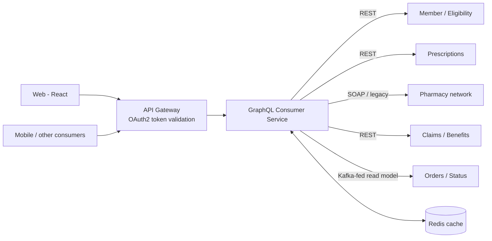

# Aggregating Multiple Upstream Systems: Orchestration, Timeouts & Partial Failures

!!! abstract "TL;DR"
    - A GraphQL aggregation layer (BFF / integration layer) maps a **client-centric graph** onto many backends. It's the core of my OptumRx Consumer Service role (5 upstream systems).
    - **Latency** = the slowest path through dependent calls. Run independent calls **in parallel**, batch with DataLoader, and keep dependency chains short.
    - Every upstream call needs a **timeout**, and per-upstream **bulkheads**, **circuit breakers** and (only for idempotent reads) **retries with backoff**.
    - Design for **partial results**: nullable fields for upstream-backed data, plus meaningful `errors[]` with paths, so one failing system degrades a section, not the page.
    - Also: an **anti-corruption layer** (map upstream DTOs to domain types), **auth/token propagation**, **correlation IDs**, and **caching** of reference data.

## Why it matters

This is the most resume-specific GraphQL topic. Interviewers will ask exactly "how did you integrate 5 upstreams?" and "what happened when one was slow or down?".

## Core concepts

### Architecture


*Notice that the service shields clients from 5 different protocols, data models and failure modes. That's the anti-corruption layer role.* *[confirm actual upstreams]*

### Latency: parallel vs sequential

```mermaid
gantt
    dateFormat X
    axisFormat %L ms
    section Sequential
    Member      :0, 120
    Rx          :120, 300
    Claims      :300, 450
    Pharmacy    :450, 560
    section Parallel (independent)
    Member      :0, 120
    Claims      :0, 150
    Rx (needs memberId) :120, 300
    Pharmacy (batched, needs Rx) :300, 410
```


*Notice that parallelising independent branches cuts total latency to the longest dependency chain (Member → Rx → Pharmacy), not the sum of all calls.*

GraphQL helps naturally: sibling fields resolve concurrently if resolvers are async. Dependent fields wait for their parents.

### Resilience per upstream

| Mechanism | Purpose | Typical setting |
|---|---|---|
| **Timeout** | Bound worst-case latency | Below the client SLO, per upstream p99 (e.g. 300–800 ms) |
| **Bulkhead** | A slow upstream can't exhaust shared threads/connections | Separate pools/semaphores per upstream |
| **Circuit breaker** | Fail fast when an upstream is unhealthy, let it recover | Open at ≥50% failures over a window |
| **Retry** | Absorb transient blips | Reads only, 1–2 retries, jittered backoff, within the timeout budget |
| **Fallback** | Degrade gracefully | Cached value, default, or null + error |
| **Hedging** (advanced) | Cut tail latency | Duplicate a slow read after p95 |

!!! tip "Timeout budget"
    Total budget, e.g. 2 s for the screen. Each dependency chain must fit inside it. Set per-hop timeouts so retries can't blow the budget (timeout × attempts < budget).

### Partial failure semantics

```json
{
  "data": {
    "member": {
      "name": "A. Patel",
      "prescriptions": [ { "drugName": "Atorvastatin", "pharmacy": null } ],
      "claimsSummary": null
    }
  },
  "errors": [
    { "message": "Claims temporarily unavailable", "path": ["member","claimsSummary"],
      "extensions": { "classification": "UPSTREAM_UNAVAILABLE", "upstream": "claims", "retryable": true } }
  ]
}
```

*The UI renders what it has and shows a "temporarily unavailable" card for claims. That only works if `claimsSummary` is nullable.*

### Anti-corruption layer and mapping

- Map upstream DTOs (inconsistent names, codes, date formats) into **clean domain types** in one place per upstream (adapter/client module).
- Normalise **codes** (status codes, drug identifiers) and **errors** (each upstream fails differently).
- Version-isolate upstreams: an upstream API change touches one adapter, not the schema.

### Auth and context propagation

- Validate the user's OAuth2 token at the gateway or service. For upstream calls, either **forward the user token** (if the upstream trusts the same IdP and audience) or use **token exchange** / **client credentials** with the user identity in a signed header, depending on the trust model.
- Propagate **correlation/trace IDs** (W3C `traceparent`) on every upstream call.

## In practice: code & configuration

Resilience4j per upstream (Spring Boot):

```yaml
resilience4j:
  timelimiter:
    instances:
      claims: { timeout-duration: 600ms }
      pharmacy: { timeout-duration: 400ms }
  circuitbreaker:
    instances:
      claims:
        sliding-window-size: 50
        failure-rate-threshold: 50
        slow-call-duration-threshold: 500ms
        slow-call-rate-threshold: 60
        wait-duration-in-open-state: 20s
  bulkhead:
    instances:
      claims: { max-concurrent-calls: 50 }
  retry:
    instances:
      pharmacy:
        max-attempts: 2
        wait-duration: 50ms
        retry-exceptions: [java.net.SocketTimeoutException, org.springframework.web.client.ResourceAccessException]
```

Resolver with timeout, circuit breaker and graceful degradation:

```java
@Controller
@RequiredArgsConstructor
class ClaimsGraphController {
    private final ClaimsClient claims;

    @SchemaMapping(typeName = "Member", field = "claimsSummary")
    @CircuitBreaker(name = "claims", fallbackMethod = "claimsUnavailable")
    @TimeLimiter(name = "claims")
    @Bulkhead(name = "claims", type = Bulkhead.Type.THREADPOOL)
    CompletableFuture<ClaimsSummary> claimsSummary(Member member) {
        return CompletableFuture.supplyAsync(() -> claims.summaryFor(member.id()));
    }

    CompletableFuture<ClaimsSummary> claimsUnavailable(Member member, Throwable t) {
        // Surface as a typed field error (null data + errors[] entry), not a page failure
        return CompletableFuture.failedFuture(new UpstreamUnavailableException("claims", t));
    }
}
```

HTTP client with timeouts and propagated headers (Spring `RestClient`):

```java
@Bean
RestClient claimsRestClient(RestClient.Builder builder, ObservationRegistry registry) {
    var factory = new JdkClientHttpRequestFactory(HttpClient.newBuilder()
            .connectTimeout(Duration.ofMillis(200)).build());
    factory.setReadTimeout(Duration.ofMillis(600));
    return builder.baseUrl("https://claims.internal")
            .requestFactory(factory)
            .observationRegistry(registry)                    // traceparent propagation + metrics
            .requestInterceptor(new BearerTokenRelayInterceptor())   // custom: copies the user/exchanged token
            .build();
}
```

=== "❌ Common mistake"
    ```java
    Member member = memberClient.get(id);          // sequential, no timeouts
    List<Claim> claims = claimsClient.get(id);     // independent call waits needlessly
    Pharmacy ph = pharmacyClient.get(...);         // one slow upstream = whole response slow or failed
    ```

=== "✅ Correct approach"
    ```java
    // Independent fields = separate async resolvers (run concurrently),
    // each with its own timeout, bulkhead, circuit breaker and nullable schema field.
    ```

## Real-world usage

- **Netflix's** API layer pioneered fault-tolerant aggregation (Hystrix: timeouts, bulkheads, circuit breakers, fallbacks). Resilience4j is the modern Java successor.
- **Healthcare portals** commonly aggregate eligibility, claims, pharmacy and provider directory backends, often including legacy SOAP or mainframe-fronted services with poor latency. Caching and timeouts are essential.
- **Reading from events:** for slow or legacy upstreams, teams consume their change events (Kafka) into a local read model, so GraphQL queries hit a fast local store instead of the slow system.

## Trade-offs & production gotchas

| Choice | Pro | Con |
|---|---|---|
| Call upstream per request | Fresh data | Latency and availability coupling |
| Cache (Redis) | Fast, resilient | Staleness, invalidation |
| Local read model from events | Fast, decoupled | Eventual consistency, more infra |
| Retry reads | Hides blips | Amplifies load during incidents (retry storms) |

!!! warning "Gotchas"
    - **Retry storms:** retries at the client, gateway and service multiply load on an already struggling upstream. Retry at one layer only, with budgets.
    - **Default HTTP client timeouts are often infinite.** Always set connect and read timeouts.
    - Non-null schema fields for upstream data turn a single failure into a missing parent.
    - Logging full upstream payloads can leak **PHI**. Log IDs and metadata only.

## How this connects to my experience

- **Where I used it:** OptumRx Meteor, the GraphQL Consumer Service: "integration layer between 5 upstream systems and multiple downstream consumers", "Redis-based caching for frequently accessed queries and UI reference data", "secure enterprise APIs using OAuth2, PingFederate".
- **Talking points (STAR-ready):**
    - **S/T:** 5 upstreams with different protocols, SLAs and data models, serving web and other consumers for 750K+ users.
    - **A:** domain schema + adapters per upstream; parallel async resolvers + DataLoader; timeouts, circuit breakers and bulkheads per upstream; nullable upstream-backed fields with typed errors; Redis for reference data; correlation IDs. *[confirm each]*
    - **R:** p95 latency / availability / fewer client calls. *[confirm metrics]*
- **Likely follow-up chain:** "What happens when upstream 3 is slow?" → "How did you choose timeouts?" → "Did you retry? Wasn't that dangerous?" → "How did the UI handle partial data?" → "How did tokens flow to upstreams?"

## Interview questions

### Fundamentals

??? question "Q1. Why use GraphQL as an integration layer over multiple systems?"
    **Answer:** One client-centric contract hides upstream heterogeneity. Clients fetch exactly what screens need in one round-trip. Resolvers run concurrently per field, and upstream changes are isolated behind adapters.

??? question "Q2. How does GraphQL represent a partial failure?"
    **Answer:** The failing field is null in `data` and an entry with `path` and `extensions` is added to `errors[]`, while the rest of the data is returned. This requires the field (or a parent) to be nullable.

### Intermediate

??? question "Q3. How do you set timeouts for upstream calls?"
    **Answer:** Start from the end-to-end SLO and divide it across the dependency chain. Set each upstream's timeout slightly above its healthy p99 and below the remaining budget. Include connect and read timeouts. Make sure retries fit within the budget. Revisit with production metrics.

??? question "Q4. What is a bulkhead and why per upstream?"
    **Answer:** Isolated resource pools (threads, connections, semaphores) per dependency, so one slow upstream exhausts only its own pool, not the threads serving other fields and requests.

??? question "Q5. When should you retry upstream calls?"
    **Answer:** Only idempotent reads, on transient errors (timeouts, 503, connection resets), with 1–2 attempts and jittered backoff inside the timeout budget, ideally at a single layer. Never retry non-idempotent mutations without an idempotency key.

### Senior

??? question "Q6. One upstream (claims) has a p99 of 3 s, while the screen SLO is 1.5 s. Options?"
    **Answer:** Load claims in a separate query or deferred field so it doesn't block the page (`@defer`, where supported, or a second request). Cache claims summaries in Redis with event-based invalidation. Build a local read model from claims events. Negotiate a summary endpoint. Meanwhile, set a 1 s timeout with a graceful "unavailable" state.

??? question "Q7. How do you propagate user identity to upstreams securely?"
    **Answer:** Options by trust model: relay the user's access token if the upstream accepts that audience; OAuth2 token exchange (RFC 8693) to get a downstream-scoped token; or client credentials (service identity) plus a signed user-context header or mTLS where the upstream trusts the service. Never forward tokens to systems outside the intended audience, and log no tokens.

??? question "Q8. How do you keep the schema stable when an upstream changes its API?"
    **Answer:** An anti-corruption layer: an adapter per upstream maps its DTOs to internal domain types. Contract tests (Pact/WireMock) catch upstream changes early. Feature-flag new upstream versions. The schema only changes for client-visible needs.

### Scenario-based

??? question "Q9. The pharmacy upstream is down. Describe exactly what users and engineers experience in your design."
    **Answer:** The circuit breaker opens after the failure threshold, so calls fail fast (no thread exhaustion). `pharmacy` fields resolve to null with `UPSTREAM_UNAVAILABLE` errors. The UI shows the prescriptions with "pharmacy details unavailable". Other sections are unaffected. Alerts fire on breaker state and error rates. When the upstream recovers, half-open probes close the breaker automatically.

??? question "Q10. Latency regressed after onboarding upstream #5. How do you find the cause?"
    **Answer:** Distributed traces per operation show the critical path. Check whether the new upstream is on a dependency chain (sequential) or causes N+1. Check pool saturation and upstream latency. Fix by parallelising, batching, caching, or moving it to a deferred field.

## Cheat sheet

| Concept | Remember |
|---|---|
| Latency | = longest dependency chain; parallelise the rest |
| Every call | Timeout + breaker + bulkhead; retry reads only |
| Schema | Nullable upstream-backed fields → partial results |
| Errors | `path` + `extensions` (classification, retryable) |
| Isolation | Adapter (anti-corruption layer) per upstream |
| Identity | Token relay / token exchange / client credentials |
| Speed-ups | DataLoader, Redis, read models from events |

## Sources

1. [Resilience4j documentation](https://resilience4j.readme.io/docs): CircuitBreaker, Bulkhead, TimeLimiter, Retry.
2. [Microsoft: Circuit Breaker pattern](https://learn.microsoft.com/azure/architecture/patterns/circuit-breaker) and [Bulkhead pattern](https://learn.microsoft.com/azure/architecture/patterns/bulkhead).
3. [Netflix Tech Blog: Fault Tolerance in a High Volume, Distributed System](https://netflixtechblog.com/fault-tolerance-in-a-high-volume-distributed-system-91ab4faae74a).
4. [GraphQL Specification: Errors and nullability](https://spec.graphql.org/October2021/#sec-Handling-Field-Errors).
5. [RFC 8693: OAuth 2.0 Token Exchange](https://www.rfc-editor.org/rfc/rfc8693).
