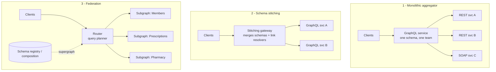
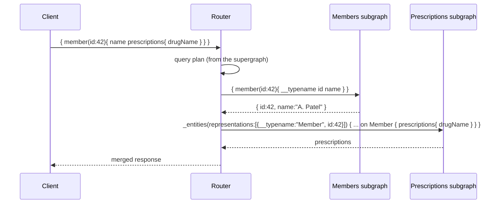

# Federation vs Schema Stitching

!!! abstract "TL;DR"
    - Three ways to build one graph over many services: a **monolithic aggregator** (one GraphQL service calling REST backends, like the OptumRx Consumer Service), **schema stitching** (a gateway merges remote GraphQL schemas plus hand-written links), and **federation** (each team owns a **subgraph**, and a **router** composes a **supergraph** and plans queries).
    - **Federation (Apollo Federation v2)**: entities with `@key` can be **extended across subgraphs**. The router resolves them via the `_entities` query. Composition is checked at build time.
    - Spring for GraphQL (1.3+) supports subgraphs via **`FederationSchemaFactory` + `@EntityMapping`**, built on Apollo's `federation-jvm` library. DGS supports federation natively.
    - Choose by **team topology**: one team owning integration → aggregator; many domain teams owning parts of the graph → federation.
    - Federation's costs: a router to operate, query-planning overhead, distributed ownership governance, and N+1 across subgraphs (mitigated by batched `_entities` calls).

## Why it matters

"Why didn't you use federation?" is a natural senior follow-up to "I owned a GraphQL integration layer over 5 upstream systems". You need a reasoned answer either way.

## Core concepts

### Three architectures


*Notice where knowledge of relationships lives: in the aggregator's code (1), in gateway glue code (2), or declaratively inside each subgraph's schema (3).*

### Federation mechanics

Each subgraph declares the entities it owns or extends:

```graphql
# Every Federation 2 subgraph opts in with @link and imports the directives it uses.
# Without this line the schema is composed with Federation 1 semantics.
extend schema
  @link(url: "https://specs.apollo.dev/federation/v2.3", import: ["@key", "@shareable"])

# Members subgraph
type Member @key(fields: "id") {
  id: ID!
  name: String!
}

# Prescriptions subgraph (a separate schema file with its own @link line):
# contributes a field to Member without owning the rest of it
type Member @key(fields: "id") {
  id: ID!
  prescriptions: [Prescription!]!
}
type Prescription @key(fields: "id") {
  id: ID!
  drugName: String!
}
```


*Notice that the router passes entity "representations" (`__typename` + key fields) to the subgraph that extends the entity. Lists are batched into one `_entities` call per subgraph per step.*

What the federation library adds to every subgraph schema (you do not write these by hand):

- `_entities(representations: [_Any!]!): [_Entity]!` on `Query`. This is the entry point the router uses to "jump into" an entity. `_Entity` is a generated union of every type with `@key`. `_Any` is a scalar carrying the JSON representation, for example `{"__typename": "Member", "id": "42"}`.
- `_service { sdl }` on `Query`. This returns the subgraph's SDL including federation directives. Composition tooling (Rover, a schema registry) reads it.

In Federation 2 the `extend type` keyword and `@extends` are no longer required: any subgraph can define the same entity type with the same `@key` and contribute fields. Key fields are implicitly shareable. Any other field defined in more than one subgraph must be marked `@shareable` in each of them, or composition fails.

Key Federation v2 directives:

| Directive | Meaning |
|---|---|
| `@key(fields: "...")` | Entity identity. Can be repeated for multiple keys, and can be compound (`"id organization { id }"`). `resolvable: false` means "I only reference this entity, do not call my `_entities` for it". |
| `@shareable` | The field can be resolved by more than one subgraph. All of them must return the same value. |
| `@external` | The field is declared here only so that `@requires` / `@provides` can refer to it. Another subgraph resolves it. |
| `@requires(fields: "...")` | A computed field that needs fields owned by another subgraph. The router fetches those first and includes them in the representation. |
| `@provides(fields: "...")` | On this particular query path, this subgraph can also return some fields of the entity it returns, so the router can skip a hop. |
| `@override(from: "...")` | Move field ownership from another subgraph to this one. Used for migrations. |
| `@inaccessible` / `@tag` | Hide a field from the public API schema / label it for contracts and tooling. |

### Comparison

| | Monolithic aggregator | Schema stitching | Federation |
|---|---|---|---|
| Ownership | One team | Gateway team + service teams | Each domain team owns its subgraph |
| Backends | Anything (REST, SOAP, DB) | GraphQL services | GraphQL subgraphs |
| Relationships | Code in resolvers | Glue code at the gateway | Declarative (`@key`) |
| Composition checks | Compile/test | Weak | Build-time composition + registry |
| Ops complexity | Low | Medium | Higher (router, registry, CI checks) |
| Best for | One integration team, heterogeneous legacy backends | Small number of GraphQL services, legacy setups | Many teams, large graph, independent deploys |

Router options: Apollo Router (Rust), Apollo Gateway (`@apollo/gateway`, Node.js, the older option that Apollo now recommends replacing with the Router), Cosmo Router (WunderGraph), Hive Gateway (The Guild), and Netflix's own gateway.

Two nuances a Lead should know:

- **Stitching is not only imperative.** Modern `graphql-tools` stitching has **type merging** and optional SDL directives (`@merge`, `@key`, `@computed`, `@canonical`), so services can also declare how their types merge. The practical difference from federation today is the ecosystem: a published subgraph specification, many compatible routers and subgraph libraries, and registry tooling for composition and schema checks.
- **Federation is no longer GraphQL-subgraphs only.** With **Apollo Connectors**, the Apollo Router can call REST APIs directly from declarative schema annotations. That weakens the old argument "our backends are REST, so federation does not apply", but it is Apollo-specific, and SOAP or other non-JSON backends still need a service in front of them.

## In practice: code & configuration

Spring for GraphQL subgraph (the Prescriptions subgraph from the example above). Add the `com.apollographql.federation:federation-graphql-java-support` dependency (the `federation-jvm` project) next to `spring-boot-starter-graphql`. Federation support was added in Spring for GraphQL 1.3 (Spring Boot 3.3).

```java
@Configuration
class FederationConfig {
    @Bean
    FederationSchemaFactory schemaFactory() { return new FederationSchemaFactory(); }

    @Bean
    GraphQlSourceBuilderCustomizer federation(FederationSchemaFactory factory) {
        return builder -> builder.schemaFactory(factory::createGraphQLSchema);
    }
}

@Controller
class MemberEntityController {

    private final PrescriptionService rxService;

    MemberEntityController(PrescriptionService rxService) { this.rxService = rxService; }

    // Resolves _entities representations with __typename "Member".
    // The method name is used as the type name (or set it: @EntityMapping("Member")).
    // This subgraph does not own Member, so it only builds a stub from the key.
    @EntityMapping
    Member member(@Argument String id) {     // "id" is the @key field from the representation
        return new Member(id);
    }

    @BatchMapping                            // one call for the prescriptions of all members in the request
    Map<Member, List<Prescription>> prescriptions(List<Member> members) {
        return rxService.byMembers(members); // Member needs equals/hashCode on id (a record works)
    }
}
```

The subgraph that **owns** an entity usually has to load it from a data store in its `@EntityMapping` method. That is where N+1 appears, because the router sends many representations in one `_entities` call:

=== "❌ Common mistake"
    ```java
    // Called once per representation: 200 members in a list = 200 lookups
    @EntityMapping
    Member member(@Argument String id) {
        return memberService.find(id);
    }
    ```

=== "✅ Correct approach"
    ```java
    // Called once per _entities request with all ids of this type
    @EntityMapping
    List<Member> member(@Argument List<String> idList) {
        // Return entities in the SAME ORDER as the ids, with null for ids not found
        Map<String, Member> byId = memberService.findAllById(idList);
        return idList.stream().map(byId::get).toList();
    }
    ```

An `@EntityMapping` method can also take a `DataLoader` argument, the full representation as `Map<String, Object>`, `DataFetchingEnvironment`, `@ContextValue` and the authenticated `Principal`.

Composing and checking in CI (Apollo Rover example):

```bash
rover subgraph check my-graph@prod --name prescriptions --schema ./schema.graphqls   # breaking-change check vs client ops
rover subgraph publish my-graph@prod --name prescriptions --schema ./schema.graphqls --routing-url https://rx.internal/graphql
```

## Real-world usage

- **Netflix** moved its studio API from a monolithic GraphQL aggregation layer (**Studio API**) to a federated architecture (**Studio Edge**), with Domain Graph Services (DGS) owned by domain teams behind a gateway. The DGS framework came out of this work.
- **Expedia, Walmart and others** have publicly described using federation so dozens of teams contribute to one graph without a central bottleneck team.
- **Aggregator stays valid:** when backends are REST/SOAP owned by other organisations (as with upstream healthcare systems), one integration team owning a single GraphQL service is simpler and often right.

## Trade-offs & production gotchas

| Option | Pros | Cons | Use when |
|---|---|---|---|
| Monolithic aggregator | Simple to run and debug. One place for auth, caching and error mapping. Works with any backend. | The owning team becomes a bottleneck as the graph grows. One deployable, one blast radius. | One integration team, non-GraphQL upstreams owned by other organisations |
| Schema stitching | No changes needed in the underlying services. Flexible transforms at the gateway. | Linking logic concentrates at the gateway. Smaller ecosystem (mostly JavaScript `graphql-tools`). | A few existing GraphQL services, or third-party schemas you cannot change |
| Federation | Domain teams own and deploy subgraphs independently. Composition and schema checks catch conflicts before deploy. | Router and registry to operate, extra network hops, governance needed, partial failures to handle. | Many teams, a large graph, independent release cadence |

!!! warning "Gotchas"
    - Federation with **few teams** adds more infrastructure than value.
    - **Entity fan-out:** deep cross-subgraph queries create many sequential router→subgraph hops. Watch query plans and latency.
    - Subgraphs must handle **`_entities` batches** efficiently (DataLoader), or you get N+1 at the subgraph level.
    - **Security:** subgraphs must only accept traffic from the router (network policy/mTLS) and still enforce authorisation.
    - **Partial failure:** if a subgraph is down or slow, the router returns the data it could fetch, sets the affected fields to `null` and adds entries to `errors`. A non-null field (`!`) that fails nulls out its parent, so over-using `!` on cross-subgraph fields turns one subgraph outage into a much larger hole in the response.
    - **Composition is not runtime safety:** composition proves the schemas fit together. It does not prove that a subgraph returns `_entities` results in the right order or that two `@shareable` resolvers return the same value.
    - **Missing `@link`:** a subgraph schema without the Federation 2 `@link` line is treated as Federation 1, and directives such as `@shareable` are not recognised.
    - Schema stitching is still maintained (The Guild's `graphql-tools`), but most new multi-team graphs choose federation because of its specification and tooling ecosystem.

## How this connects to my experience

- **Where I used it:** the OptumRx GraphQL Consumer Service (a single aggregator over 5 upstream systems, not federated, *[confirm]*).
- **Talking points:**
    - Why an aggregator fit: one owning team, heterogeneous non-GraphQL upstreams, consistent cross-cutting concerns (auth, caching, error mapping). *[confirm]*
    - When I'd move to federation: multiple domain teams wanting to own parts of the graph, independent release cadence, graph growing beyond one team's ownership.
    - Micro-frontends parallel: I established the micro-frontend architecture for the ReactJS application on the same project. Splitting the UI into independently owned parts (by domain *[confirm]*) is the front-end equivalent of what federation does for the API.
    - Be precise in the interview: I have not run a federated graph in production *[confirm]*. I can explain the mechanics and the decision criteria, and why the aggregator was the right fit here.
- **Likely follow-up chain:** "Did you use federation?" → "Why not?" → "When would you?" → "How does an entity resolve across subgraphs?"

## Interview questions

### Fundamentals

??? question "Q1. What is GraphQL federation?"
    **Answer:** An architecture where multiple services (subgraphs) each own part of a schema. The subgraph schemas are composed into one supergraph schema, and a router uses it to plan each client query as a set of fetches to subgraphs, then merges the results. Entities marked with `@key` can have fields contributed by multiple subgraphs. Clients see a single endpoint and a single schema.

    **Interviewer listens for:** subgraph, supergraph, router/query planner, entity and `@key`, and that composition happens ahead of time and not per request.

    **Common wrong answer:** "It is an API gateway that forwards queries to the right service." A federated query can span several subgraphs, and the router has to plan and join the results.

??? question "Q2. What's the difference between schema stitching and federation?"
    **Answer:** Classic stitching merges remote schemas at the gateway, with hand-written glue code (delegating resolvers) to link types. So the knowledge of relationships lives in the gateway, and the gateway team is involved in every cross-service change. Federation makes relationships declarative inside each subgraph (`@key`, entity references). Composition is validated by tooling before deployment, and the router derives the query plan from the composed supergraph. That supports independent team ownership. To be fair to stitching: newer `graphql-tools` versions added type merging and SDL directives, so it can also be declarative. Federation's advantage today is mainly the published subgraph specification and the ecosystem of routers, subgraph libraries (Spring for GraphQL, DGS) and schema registries.

    **Interviewer listens for:** where the linking logic lives, who owns it, build-time composition checks, and a balanced view of stitching.

    **Common wrong answer:** "Stitching is deprecated and federation replaced it." Apollo deprecated its own early stitching API, but stitching in `graphql-tools` is maintained by The Guild.

### Intermediate

??? question "Q3. How does the router resolve a field that lives in another subgraph?"
    **Answer:** The query planner knows from the supergraph schema which subgraph resolves each field. It first queries the subgraph that provides the entry point, and adds the entity's `@key` fields and `__typename` to the selection. It then calls `_entities(representations: [{__typename, key...}])` on the subgraph that contributes the remaining fields, with a `... on Member { ... }` fragment, and merges the results into the response. All entities of one type at one step go in a single `_entities` call, so a list of 50 members is one request and not 50. Fetches that do not depend on each other run in parallel. Dependent fetches run in sequence.

    **Interviewer listens for:** representations, `_entities`, key fields added by the router, batching per step, parallel versus sequential fetches.

    **Common wrong answer:** "The subgraphs call each other." Subgraphs never call each other in federation. Only the router calls subgraphs.

??? question "Q4. How do you implement a subgraph in Spring?"
    **Answer:** With Spring for GraphQL 1.3 or later: add the `federation-graphql-java-support` library (the `federation-jvm` project), declare a `FederationSchemaFactory` bean and plug it in with a `GraphQlSourceBuilderCustomizer` (`builder.schemaFactory(factory::createGraphQLSchema)`). Add the Federation 2 `@link` line and `@key` directives to the schema. Write `@EntityMapping` methods in a `@Controller` to resolve entity representations. Use the `List` variant of `@EntityMapping` (or a `DataLoader`) so one `_entities` call becomes one backend lookup, and `@BatchMapping` for fields on those entities. With Netflix DGS the equivalent is `@DgsEntityFetcher`.

    **Interviewer listens for:** `FederationSchemaFactory`, `@EntityMapping`, awareness of batching in entity resolution, and the DGS alternative.

    **Common wrong answer:** "Spring does not support federation, you need DGS." That was true before Spring for GraphQL 1.3.

??? question "Q5. What do `@external`, `@requires` and `@provides` do?"
    **Answer:** All three are about fields that belong to another subgraph. `@external` marks a field that this subgraph declares but does not resolve. It exists so the other two directives can refer to it. `@requires(fields: "weight")` is for a computed field: "to resolve `shippingCost` I need `weight`, which another subgraph owns". The router fetches `weight` first and includes it in the representation sent to `_entities`. `@provides(fields: "name")` is an optimisation: "on this query path I can also return `name` for the entity I return", so the router can skip a hop to the owning subgraph. The cost of `@requires` is an extra sequential fetch and coupling to another team's field. The risk of `@provides` is returning a stale or different copy of data.

    **Interviewer listens for:** `@requires` adds a dependency and a hop, `@provides` removes a hop, and both create coupling between subgraphs.

    **Common wrong answer:** Mixing the two up, or saying the subgraph calls the other subgraph to get the required field.

### Senior

??? question "Q6. When would you choose a monolithic GraphQL aggregator over federation?"
    **Answer:** A single integration team, non-GraphQL upstreams owned by other organisations or legacy systems, a modest schema size, and a need for consistent cross-cutting logic (auth, caching, error mapping) in one place. In that situation federation adds a router, a registry and composition checks in CI, but there are no independent teams to benefit from them. Federation solves an organisational scaling problem more than a technical one. It pays off with many domain teams, a large graph and independent deploy cadence. The signals that tell me to revisit the decision: the aggregator team is a bottleneck for other teams' changes, releases are being coordinated across domains, or the schema is too large for one team to review.

    **Interviewer listens for:** team topology as the main driver, an honest account of federation's operating cost, and concrete triggers for changing the decision.

    **Common wrong answer:** "Federation is the best practice for microservices, so always federation", or "the aggregator performs better" without mentioning ownership.

??? question "Q7. How would you migrate a monolithic GraphQL service to federation?"
    **Answer:** Use a strangler approach. First make the existing service federation-compatible and put it behind a router as the only subgraph. Clients keep the same schema and only the endpoint changes. Then extract one domain at a time into a new subgraph. Mark the shared types as entities with `@key`, and use `@override(from: "monolith")` to move field ownership without a coordinated release. Newer Federation versions support progressive `@override` with a percentage label, so traffic can be shifted gradually (an Apollo Router feature that needs the matching Federation version and plan). Set up a schema registry and CI checks (composition plus checks against recorded client operations) before the second subgraph exists. Compare latency and error rates per operation before and after each extraction. Decide early where auth lives: the router authenticates and forwards identity, and each subgraph still authorises.

    **Interviewer listens for:** incremental and reversible steps, no client-visible break, `@override`, schema checks in CI, and measurement.

    **Common wrong answer:** A "big bang" rewrite into subgraphs, or splitting by technical layer and not by domain.

??? question "Q8. Federation performance concerns?"
    **Answer:** Four main ones. First, query-plan depth: each dependent step is a sequential network hop, so a query that goes Members → Prescriptions → Pharmacy pays three round trips. Second, N+1 inside subgraphs when `_entities` is resolved one representation at a time. Third, router overhead: query planning (cached per operation shape) and JSON serialisation of representations and results. Fourth, tail latency: the response is as slow as the slowest subgraph on the critical path. Mitigations: batch entity resolution (`List`-based `@EntityMapping`, DataLoader), `@provides` or `@shareable` on hot fields to remove hops, keep tightly coupled data in the same subgraph, per-subgraph timeouts, persisted queries, caching in the subgraphs, and tracing per fetch node so you can see the query plan's cost.

    **Interviewer listens for:** sequential hops, `_entities` N+1, where to batch, subgraph boundaries as a performance decision, and observability of query plans.

    **Common wrong answer:** "The router adds latency so federation is slow." Planning is cheap and cached. The dominant cost is the number of sequential subgraph hops and unbatched entity resolvers.

??? question "Q9. How do you handle authentication, authorisation and failures in a federated graph?"
    **Answer:** Authentication happens once at the edge: the router (or a gateway in front of it) validates the JWT and forwards the token or verified claims to subgraphs as headers. Authorisation stays in the subgraphs, because they own the data and the rules. A subgraph must not trust requests that did not come through the router, so restrict it with network policy or mTLS. Otherwise anyone who can reach it can call `_entities` directly and bypass the query the router would have planned. For failures: set timeouts per subgraph at the router, and design nullability on purpose. If the Prescriptions subgraph is down, `member.prescriptions` should come back as `null` with an entry in `errors`, and the rest of the response should still be useful. If that field were non-null, the whole `member` would be nulled. Clients must be written to handle partial data.

    **Interviewer listens for:** authenticate at the router, authorise in subgraphs, protecting `_entities`, partial responses, and nullability as a resilience tool.

    **Common wrong answer:** "The router handles security, so the subgraphs can trust everything they receive."

??? question "Q10. How does a schema change reach production safely in federation?"
    **Answer:** Each subgraph team changes only its own schema. In CI, the proposed subgraph schema is checked against the registry: composition (does it still compose with all other subgraphs?) and operation checks (does it break queries that real clients have sent recently?). With Apollo that is `rover subgraph check`. On deploy, the subgraph publishes its schema (`rover subgraph publish`), the registry composes a new supergraph, and routers pick it up without a redeploy (managed federation). The alternative is composing a supergraph file in the pipeline (`rover supergraph compose`) and shipping it with the router. Order matters: deploy the subgraph that can serve a new field before the supergraph that exposes it, and remove a field from the supergraph before removing it from the subgraph. Breaking changes go through `@deprecated`, usage tracking, then removal.

    **Interviewer listens for:** composition check versus operation check, registry, deployment ordering between subgraph and supergraph, and deprecation discipline.

    **Common wrong answer:** "The router introspects the subgraphs at startup." Composing at router startup by introspection was an early Apollo Gateway pattern and is discouraged, because a bad subgraph deploy can then break the whole graph at runtime.

### Scenario-based

??? question "Q11. Two teams both want to define `Member.address`. How does federation handle it and what do you decide?"
    **Answer:** In Federation 2, if two subgraphs define the same non-key field and it is not marked `@shareable` in both, composition fails (an invalid field sharing error). So the conflict is caught in CI and not in production. Then it is a design decision. Decide on ownership: the member domain owns the address. Use `@shareable` only if both subgraphs truly return identical data from the same source of truth, because the router is free to pick either one. If the second team only needs the address as input for its own field, it should use `@external` + `@requires`. Use `@override` to migrate ownership if needed. Governance (schema review, naming conventions) settles such conflicts before they reach composition.

    **Interviewer listens for:** composition error by default, `@shareable` semantics and its consistency requirement, a clear ownership decision, `@requires` as the alternative.

    **Common wrong answer:** "The last deployed subgraph wins" or "the router merges both". There is no implicit winner.

## Cheat sheet

| Concept | Remember |
|---|---|
| Aggregator | One service, any backends, one team |
| Stitching | Gateway merges + glue code (legacy) |
| Federation | Subgraphs + router + supergraph |
| Entity | `@key`, resolved via `_entities(representations: [_Any!]!)` |
| Fed 2 opt-in | `extend schema @link(url: "https://specs.apollo.dev/federation/v2.x", import: [...])` |
| Same field in two subgraphs | Composition error unless `@shareable` in both (key fields are exempt) |
| `@requires` / `@provides` | Needs another subgraph's field (extra hop) / can return it too (saves a hop) |
| `@override` | Move field ownership during migration |
| Spring | `FederationSchemaFactory` + `@EntityMapping` (Spring for GraphQL 1.3+), `List` variant for batching |
| CI | `rover subgraph check` (composition + client operations), then `rover subgraph publish` |
| Security | Authenticate at router, authorise in subgraphs, subgraphs reachable only from router |
| Choose by | Team topology and graph size |

## Sources

1. [Apollo: Introduction to Apollo Federation](https://www.apollographql.com/docs/graphos/schema-design/federated-schemas/federation): subgraphs, supergraph, router, and Apollo Connectors for REST.
2. [Apollo Federation subgraph specification](https://www.apollographql.com/docs/graphos/schema-design/federated-schemas/reference/subgraph-spec): `_entities`, `_service`, `_Any`, and the Federation 2 `@link` opt-in.
3. [Spring for GraphQL: Federation](https://docs.spring.io/spring-graphql/reference/federation.html): `FederationSchemaFactory` configuration, `@EntityMapping` signatures and batching.
4. [Netflix Tech Blog: How Netflix Scales its API with GraphQL Federation (Part 1)](https://netflixtechblog.com/how-netflix-scales-its-api-with-graphql-federation-part-1-ae3557c187e2): the move from the monolithic Studio API to federated Studio Edge with DGS subgraphs.
5. [The Guild: Schema Stitching, overview of approaches](https://the-guild.dev/graphql/stitching/docs/approaches) and [stitching directives SDL](https://the-guild.dev/graphql/stitching/docs/approaches/stitching-directives): type merging and declarative stitching.
